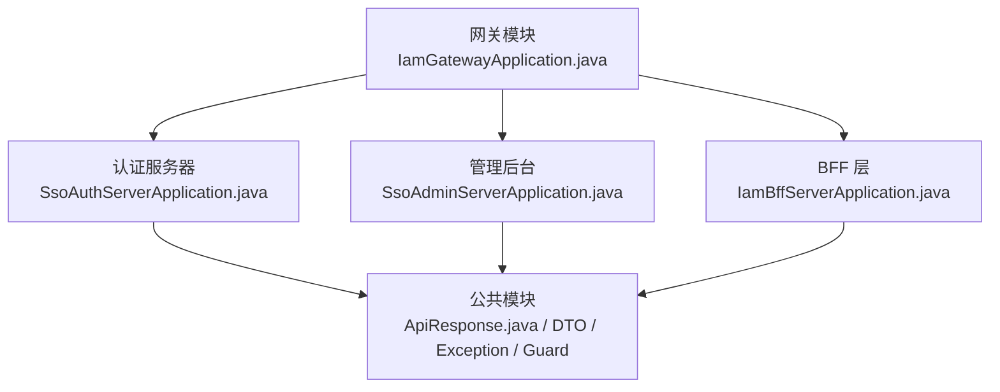
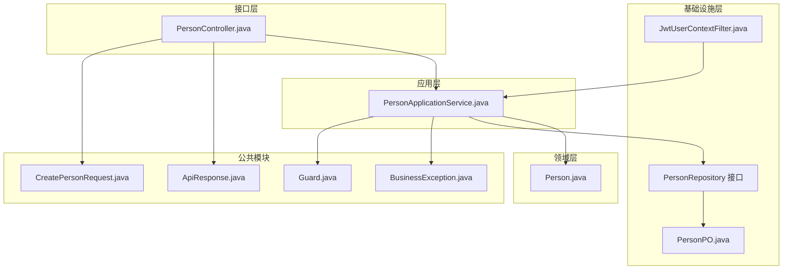
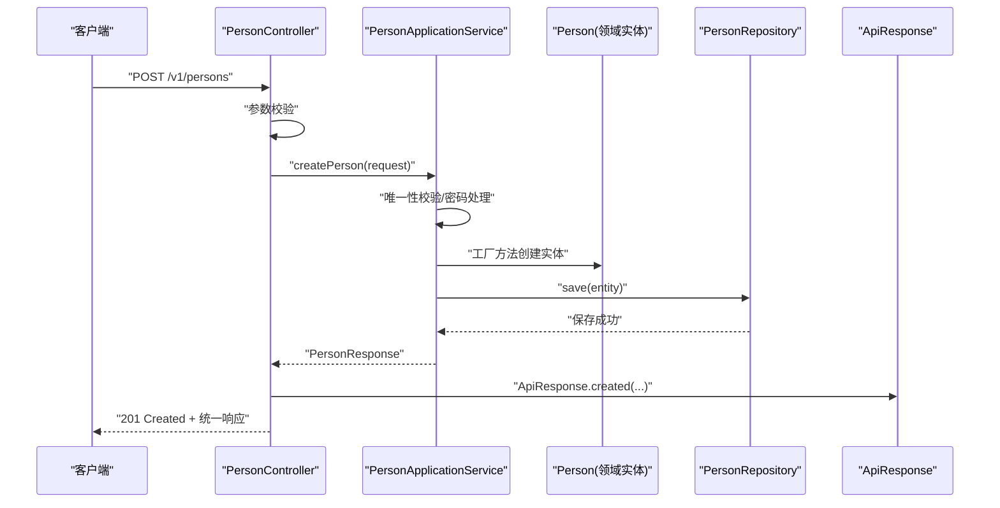
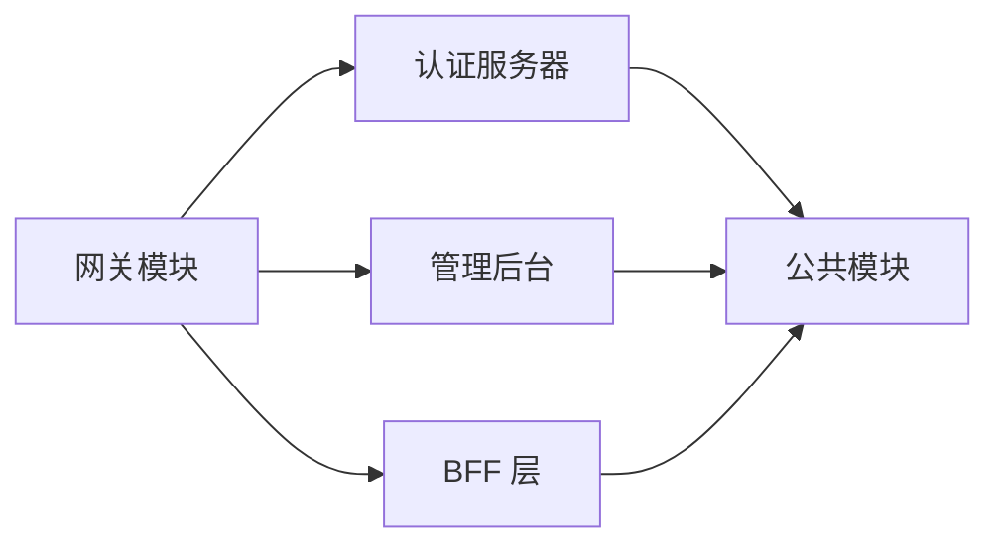

# 代码质量保证

<cite>
**本文引用的文件**
- [README.md](file://README.md)
- [SsoAdminServerApplication.java](file://iam-admin-server/src/main/java/iam/platform/admin/SsoAdminServerApplication.java)
- [SsoAuthServerApplication.java](file://iam-auth-server/src/main/java/iam/platform/auth/SsoAuthServerApplication.java)
- [IamBffServerApplication.java](file://iam-bff-server/src/main/java/iam/platform/bff/IamBffServerApplication.java)
- [IamGatewayApplication.java](file://iam-gateway/src/main/java/iam/platform/gateway/IamGatewayApplication.java)
- [ApiResponse.java](file://iam-common/src/main/java/iam/platform/common/api/ApiResponse.java)
- [CreatePersonRequest.java](file://iam-common/src/main/java/iam/platform/common/dto/request/CreatePersonRequest.java)
- [UserStatus.java](file://iam-common/src/main/java/iam/platform/common/model/enums/UserStatus.java)
- [PersonController.java](file://iam-admin-server/src/main/java/iam/platform/admin/interfaces/rest/PersonController.java)
- [PersonApplicationService.java](file://iam-admin-server/src/main/java/iam/platform/admin/application/service/PersonApplicationService.java)
- [Person.java](file://iam-admin-server/src/main/java/iam/platform/admin/domain/model/entity/Person.java)
- [PersonPO.java](file://iam-admin-server/src/main/java/iam/platform/admin/infrastructure/persistence/entity/PersonPO.java)
- [JwtUserContextFilter.java](file://iam-admin-server/src/main/java/iam/platform/admin/infrastructure/security/JwtUserContextFilter.java)
- [Guard.java](file://iam-common/src/main/java/iam/platform/common/util/Guard.java)
- [BusinessException.java](file://iam-common/src/main/java/iam/platform/common/model/exception/BusinessException.java)
- [AuditLog.java](file://iam-common/src/main/java/iam/platform/common/model/annotation/AuditLog.java)
</cite>

## 目录
1. [简介](#简介)
2. [项目结构](#项目结构)
3. [核心组件](#核心组件)
4. [架构总览](#架构总览)
5. [详细组件分析](#详细组件分析)
6. [依赖分析](#依赖分析)
7. [性能考虑](#性能考虑)
8. [故障排查指南](#故障排查指南)
9. [结论](#结论)
10. [附录](#附录)

## 简介
本指南面向IAM平台的代码质量保证，围绕代码审查标准与流程、测试驱动开发(TDD)、持续重构策略、RESTful API设计规范以及代码质量度量与持续改进方法展开。文档结合项目中实际代码示例，系统阐述如何在Clean Architecture与DDD分层下，通过统一的响应格式、参数校验、审计注解、异常体系与安全过滤器等机制，确保代码可读性、可维护性与安全性。

## 项目结构
项目采用多模块微服务架构，包含网关、认证服务器、管理后台、BFF与公共模块。各模块职责清晰，公共模块提供统一的API响应、请求DTO、枚举、异常与工具类；业务模块在各自application/domain/infrastructure/interfaces三层内协作完成业务闭环。

图表来源
- [IamGatewayApplication.java:1-15](file://iam-gateway/src/main/java/iam/platform/gateway/IamGatewayApplication.java#L1-L15)
- [SsoAuthServerApplication.java:1-19](file://iam-auth-server/src/main/java/iam/platform/auth/SsoAuthServerApplication.java#L1-L19)
- [SsoAdminServerApplication.java:1-17](file://iam-admin-server/src/main/java/iam/platform/admin/SsoAdminServerApplication.java#L1-L17)
- [IamBffServerApplication.java:1-17](file://iam-bff-server/src/main/java/iam/platform/bff/IamBffServerApplication.java#L1-L17)
- [ApiResponse.java:1-61](file://iam-common/src/main/java/iam/platform/common/api/ApiResponse.java#L1-L61)

章节来源
- [README.md:95-108](file://README.md#L95-L108)

## 核心组件
- 统一响应与错误格式：公共模块提供统一的响应载体与错误字段，控制器返回固定结构，便于前端与网关处理。
- 参数校验：请求DTO使用Jakarta Bean Validation注解，保障输入合法性。
- 审计注解：通过自定义注解标记需要记录审计日志的方法，自动采集事件类型、资源类型与敏感字段掩码。
- 异常体系：抽象业务异常类提供错误码与HTTP状态映射，便于全局异常处理器转换为统一响应。
- 安全上下文：网关侧鉴权后通过Header传递用户信息，下游服务通过过滤器建立安全上下文。

章节来源
- [ApiResponse.java:1-61](file://iam-common/src/main/java/iam/platform/common/api/ApiResponse.java#L1-L61)
- [CreatePersonRequest.java:1-37](file://iam-common/src/main/java/iam/platform/common/dto/request/CreatePersonRequest.java#L1-L37)
- [AuditLog.java:1-46](file://iam-common/src/main/java/iam/platform/common/model/annotation/AuditLog.java#L1-L46)
- [BusinessException.java:1-17](file://iam-common/src/main/java/iam/platform/common/model/exception/BusinessException.java#L1-L17)
- [JwtUserContextFilter.java:1-87](file://iam-admin-server/src/main/java/iam/platform/admin/infrastructure/security/JwtUserContextFilter.java#L1-L87)

## 架构总览
IAM平台遵循Clean Architecture与DDD分层，控制器负责接收请求与返回统一响应；应用服务编排用例、调用领域模型与仓储接口；基础设施层提供持久化、安全与配置实现；公共模块提供跨模块共享的契约与工具。

图表来源
- [PersonController.java:1-68](file://iam-admin-server/src/main/java/iam/platform/admin/interfaces/rest/PersonController.java#L1-L68)
- [PersonApplicationService.java:1-122](file://iam-admin-server/src/main/java/iam/platform/admin/application/service/PersonApplicationService.java#L1-L122)
- [Person.java:1-158](file://iam-admin-server/src/main/java/iam/platform/admin/domain/model/entity/Person.java#L1-L158)
- [PersonPO.java:1-97](file://iam-admin-server/src/main/java/iam/platform/admin/infrastructure/persistence/entity/PersonPO.java#L1-L97)
- [JwtUserContextFilter.java:1-87](file://iam-admin-server/src/main/java/iam/platform/admin/infrastructure/security/JwtUserContextFilter.java#L1-L87)
- [ApiResponse.java:1-61](file://iam-common/src/main/java/iam/platform/common/api/ApiResponse.java#L1-L61)
- [CreatePersonRequest.java:1-37](file://iam-common/src/main/java/iam/platform/common/dto/request/CreatePersonRequest.java#L1-L37)
- [BusinessException.java:1-17](file://iam-common/src/main/java/iam/platform/common/model/exception/BusinessException.java#L1-L17)
- [Guard.java:1-37](file://iam-common/src/main/java/iam/platform/common/util/Guard.java#L1-L37)

## 详细组件分析

### 统一响应与错误格式（ApiResponse）
- 设计要点
  - 固定字段：状态码、消息、数据、错误列表、时间戳。
  - 成功/创建/错误三类工厂方法，确保响应一致性。
  - 字段错误内部类用于参数校验失败时的结构化错误输出。
- 使用建议
  - 控制器仅返回统一响应，避免直接抛出异常或返回原始对象。
  - 错误响应应包含明确的错误码与HTTP状态映射，便于前端与网关处理。

章节来源
- [ApiResponse.java:1-61](file://iam-common/src/main/java/iam/platform/common/api/ApiResponse.java#L1-L61)

### 参数校验（CreatePersonRequest）
- 设计要点
  - 使用非空、邮箱格式、长度约束等注解，覆盖用户名、邮箱、电话、密码、昵称、头像URL等字段。
  - 与控制器配合，Spring在进入业务逻辑前完成参数校验。
- 使用建议
  - 在DTO层严格约束输入，避免脏数据进入领域层。
  - 对于敏感字段（如密码）不建议在响应中直接暴露，必要时使用审计注解的敏感字段掩码机制。

章节来源
- [CreatePersonRequest.java:1-37](file://iam-common/src/main/java/iam/platform/common/dto/request/CreatePersonRequest.java#L1-L37)

### 审计注解（AuditLog）
- 设计要点
  - 注解目标为方法，支持事件类型、资源类型、动作模板、是否记录参数、敏感字段掩码。
  - 结合AOP切面自动记录审计日志，降低重复代码。
- 使用建议
  - 对关键业务操作（创建、更新、删除）标注审计注解，确保可追溯。
  - 合理设置敏感字段，避免日志泄露。

章节来源
- [AuditLog.java:1-46](file://iam-common/src/main/java/iam/platform/common/model/annotation/AuditLog.java#L1-L46)

### 异常体系（BusinessException）
- 设计要点
  - 抽象基类提供错误码与HTTP状态，便于统一处理。
  - 结合全局异常处理器将业务异常映射到统一响应。
- 使用建议
  - 所有业务异常均继承该抽象类，确保错误语义一致。
  - 与控制器返回的统一响应配合，形成前后端一致的错误契约。

章节来源
- [BusinessException.java:1-17](file://iam-common/src/main/java/iam/platform/common/model/exception/BusinessException.java#L1-L17)

### 安全上下文（JwtUserContextFilter）
- 设计要点
  - 网关鉴权后通过Header传递用户ID、租户ID、角色与权限，过滤器解析并注入Spring Security上下文。
  - 解析JSON数组格式的角色与权限，构造授权集合。
- 使用建议
  - 确保网关侧Header命名规范与过滤器解析逻辑一致。
  - 异常兜底：解析失败不影响请求继续流转，由后续安全拦截器处理。

章节来源
- [JwtUserContextFilter.java:1-87](file://iam-admin-server/src/main/java/iam/platform/admin/infrastructure/security/JwtUserContextFilter.java#L1-L87)

### 控制器与应用服务（PersonController / PersonApplicationService）
- 设计要点
  - 控制器：RESTful路径、HTTP状态码、OpenAPI注解、统一响应包装。
  - 应用服务：事务边界、审计注解、领域服务与仓储交互、异常处理。
- 使用建议
  - 控制器只做编排与校验，业务逻辑下沉至应用服务。
  - 关键操作标注审计注解，确保可审计。

图表来源
- [PersonController.java:33-38](file://iam-admin-server/src/main/java/iam/platform/admin/interfaces/rest/PersonController.java#L33-L38)
- [PersonApplicationService.java:34-51](file://iam-admin-server/src/main/java/iam/platform/admin/application/service/PersonApplicationService.java#L34-L51)
- [ApiResponse.java:34-41](file://iam-common/src/main/java/iam/platform/common/api/ApiResponse.java#L34-L41)

章节来源
- [PersonController.java:1-68](file://iam-admin-server/src/main/java/iam/platform/admin/interfaces/rest/PersonController.java#L1-L68)
- [PersonApplicationService.java:1-122](file://iam-admin-server/src/main/java/iam/platform/admin/application/service/PersonApplicationService.java#L1-L122)

### 领域模型与值对象（Person）
- 设计要点
  - 工厂方法注册用户，内置默认状态与不变量。
  - 行为方法封装状态变更与验证，确保领域内一致性。
  - 与值对象Password、PersonCode协作，保证数据完整性。
- 使用建议
  - 领域方法内使用Guard进行前置条件校验，避免无效状态。
  - 避免在应用服务中直接修改实体属性，通过行为方法进行状态变更。

章节来源
- [Person.java:1-158](file://iam-admin-server/src/main/java/iam/platform/admin/domain/model/entity/Person.java#L1-L158)
- [Guard.java:1-37](file://iam-common/src/main/java/iam/platform/common/util/Guard.java#L1-L37)

### 持久化实体（PersonPO）
- 设计要点
  - JPA实体映射用户表字段，包含时间戳列与唯一约束。
  - 与领域实体通过Assembler/MapStruct转换，保持分层清晰。
- 使用建议
  - 数据库层面的约束与领域层的不变量共同保障数据质量。
  - 注意字段长度与可空性与DTO/领域模型保持一致。

章节来源
- [PersonPO.java:1-97](file://iam-admin-server/src/main/java/iam/platform/admin/infrastructure/persistence/entity/PersonPO.java#L1-L97)

### 枚举与状态（UserStatus）
- 设计要点
  - 枚举表达用户状态，避免魔法字符串与歧义。
- 使用建议
  - 在DTO、领域模型与数据库中统一使用枚举，减少状态不一致风险。

章节来源
- [UserStatus.java:1-8](file://iam-common/src/main/java/iam/platform/common/model/enums/UserStatus.java#L1-L8)

## 依赖分析
- 模块间耦合
  - 网关模块依赖认证与管理后台服务，通过Feign或路由转发。
  - 认证与管理后台均依赖公共模块，共享统一响应、DTO、异常与工具。
- 内部依赖
  - 控制器依赖应用服务；应用服务依赖领域模型与仓储接口；仓储接口与JPA实体绑定。
- 外部依赖
  - Spring Security、Spring Data JPA、OpenAPI、Lombok、MapStruct等。

图表来源
- [SsoAuthServerApplication.java:1-19](file://iam-auth-server/src/main/java/iam/platform/auth/SsoAuthServerApplication.java#L1-L19)
- [SsoAdminServerApplication.java:1-17](file://iam-admin-server/src/main/java/iam/platform/admin/SsoAdminServerApplication.java#L1-L17)
- [IamBffServerApplication.java:1-17](file://iam-bff-server/src/main/java/iam/platform/bff/IamBffServerApplication.java#L1-L17)
- [IamGatewayApplication.java:1-15](file://iam-gateway/src/main/java/iam/platform/gateway/IamGatewayApplication.java#L1-L15)
- [ApiResponse.java:1-61](file://iam-common/src/main/java/iam/platform/common/api/ApiResponse.java#L1-L61)

## 性能考虑
- 控制器与应用服务职责分离，避免在控制器中执行耗时逻辑。
- 使用分页查询与合理索引，避免一次性加载大量数据。
- 审计日志异步化与脱敏，降低写入开销与安全风险。
- DTO与实体分离，避免不必要的字段传输与序列化开销。

## 故障排查指南
- 参数校验失败
  - 现象：控制器返回统一错误响应，包含字段级错误列表。
  - 排查：核对请求DTO注解与前端传参格式。
- 审计日志缺失
  - 现象：关键操作未记录审计。
  - 排查：确认方法已标注AuditLog注解，且AOP生效；检查敏感字段掩码配置。
- 安全上下文为空
  - 现象：用户无权限或租户上下文未设置。
  - 排查：确认网关Header命名与过滤器解析一致；检查过滤器异常兜底逻辑。
- 业务异常未统一响应
  - 现象：部分异常未按统一格式返回。
  - 排查：确认异常继承BusinessException，并在全局异常处理器中映射。

章节来源
- [PersonController.java:33-38](file://iam-admin-server/src/main/java/iam/platform/admin/interfaces/rest/PersonController.java#L33-L38)
- [AuditLog.java:1-46](file://iam-common/src/main/java/iam/platform/common/model/annotation/AuditLog.java#L1-L46)
- [JwtUserContextFilter.java:33-62](file://iam-admin-server/src/main/java/iam/platform/admin/infrastructure/security/JwtUserContextFilter.java#L33-L62)
- [BusinessException.java:1-17](file://iam-common/src/main/java/iam/platform/common/model/exception/BusinessException.java#L1-L17)

## 结论
通过统一响应格式、参数校验、审计注解、异常体系与安全过滤器，IAM平台在Clean Architecture与DDD分层下实现了高内聚低耦合的代码质量保障。建议在日常开发中坚持：严格的代码审查清单、TDD驱动的测试策略、持续重构与度量改进，以维持系统的长期可维护性与安全性。

## 附录

### 代码审查标准与流程
- 审查清单
  - 是否遵循Clean Architecture与DDD分层？
  - 控制器是否仅做编排与校验？业务逻辑是否下沉至应用服务？
  - 是否使用统一响应与参数校验注解？
  - 关键业务操作是否标注审计注解并配置敏感字段？
  - 异常是否统一继承BusinessException并映射HTTP状态？
  - 是否存在过长方法与复杂类（参考README中的方法长度与类长度限制）？
  - 是否引入了不必要的外部依赖或循环依赖？
- 常见问题与修复建议
  - 将领域状态变更封装在行为方法中，避免在应用服务直接修改实体属性。
  - 对敏感字段在审计日志与响应中进行脱敏处理。
  - 在全局异常处理器中统一转换业务异常为统一响应。

章节来源
- [README.md:110-118](file://README.md#L110-L118)
- [PersonApplicationService.java:34-51](file://iam-admin-server/src/main/java/iam/platform/admin/application/service/PersonApplicationService.java#L34-L51)
- [AuditLog.java:1-46](file://iam-common/src/main/java/iam/platform/common/model/annotation/AuditLog.java#L1-L46)
- [BusinessException.java:1-17](file://iam-common/src/main/java/iam/platform/common/model/exception/BusinessException.java#L1-L17)

### 测试驱动开发（TDD）实施方法
- 单元测试
  - 针对应用服务的行为进行测试，使用Mock仓储与领域服务，验证业务规则与异常路径。
  - 使用参数化测试覆盖边界条件（如用户名长度、邮箱格式、密码强度）。
- 集成测试
  - 使用Testcontainers启动PostgreSQL与Redis，验证控制器到仓储的完整链路。
  - 验证统一响应格式与审计日志写入。
- 测试覆盖率
  - 参考README中的覆盖率要求，确保关键业务路径达到阈值。

章节来源
- [README.md](file://README.md#L116)
- [PersonApplicationService.java:1-122](file://iam-admin-server/src/main/java/iam/platform/admin/application/service/PersonApplicationService.java#L1-L122)
- [PersonController.java:1-68](file://iam-admin-server/src/main/java/iam/platform/admin/interfaces/rest/PersonController.java#L1-L68)

### 持续重构策略与技巧
- 代码异味识别
  - 过长方法：拆分为更小的私有方法或引入领域服务。
  - 过大类：按职责拆分，遵循单一职责原则。
  - 重复代码：抽取为通用工具或领域服务。
- 重构时机
  - 新增需求前的预重构、代码审查发现的问题、回归测试失败时。
- 安全保证
  - 通过单元测试与集成测试覆盖关键路径。
  - 保持统一响应与异常体系不变，避免破坏契约。

章节来源
- [README.md](file://README.md#L115)
- [Person.java:1-158](file://iam-admin-server/src/main/java/iam/platform/admin/domain/model/entity/Person.java#L1-L158)
- [Guard.java:1-37](file://iam-common/src/main/java/iam/platform/common/util/Guard.java#L1-L37)

### Lombok正确使用示例
- 使用@Data/@Builder/@NoArgsConstructor/@AllArgsConstructor简化样板代码。
- 在领域模型中谨慎使用@Setter，优先通过行为方法改变状态，保持不变量。
- 在DTO中使用@Builder与验证注解，避免在控制器中重复校验。

章节来源
- [Person.java:1-158](file://iam-admin-server/src/main/java/iam/platform/admin/domain/model/entity/Person.java#L1-L158)
- [PersonPO.java:1-97](file://iam-admin-server/src/main/java/iam/platform/admin/infrastructure/persistence/entity/PersonPO.java#L1-L97)
- [CreatePersonRequest.java:1-37](file://iam-common/src/main/java/iam/platform/common/dto/request/CreatePersonRequest.java#L1-L37)

### 方法长度控制与类复杂度管理
- 方法长度：参考README中的方法长度上限，超过阈值应拆分。
- 类复杂度：通过拆分职责、引入领域服务与值对象降低类复杂度。
- 审计与异常：通过注解与异常体系减少重复代码。

章节来源
- [README.md](file://README.md#L115)
- [PersonApplicationService.java:1-122](file://iam-admin-server/src/main/java/iam/platform/admin/application/service/PersonApplicationService.java#L1-L122)
- [AuditLog.java:1-46](file://iam-common/src/main/java/iam/platform/common/model/annotation/AuditLog.java#L1-L46)

### RESTful API设计规范
- 路径与动词
  - 使用名词复数与层级路径，如/v1/persons/{id}。
- HTTP状态码
  - 创建：201；成功：200；无内容：204；参数错误：400；未授权：401；禁止：403；未找到：404；冲突：409；服务器错误：500。
- 错误响应格式
  - 使用统一响应中的错误字段与时间戳，包含字段级错误列表。
- API版本管理
  - 路径中包含版本号，如/v1/，便于未来演进。

章节来源
- [PersonController.java:26-66](file://iam-admin-server/src/main/java/iam/platform/admin/interfaces/rest/PersonController.java#L26-L66)
- [ApiResponse.java:1-61](file://iam-common/src/main/java/iam/platform/common/api/ApiResponse.java#L1-L61)

### 代码质量度量指标与持续改进
- 指标
  - 单元测试覆盖率、方法/类复杂度、圈复杂度、重复率、技术债务。
- 改进方法
  - 代码审查与TDD结合，持续重构与静态分析工具辅助。
  - 建立统一的响应、校验、异常与审计规范，减少分歧与返工。

章节来源
- [README.md](file://README.md#L116)