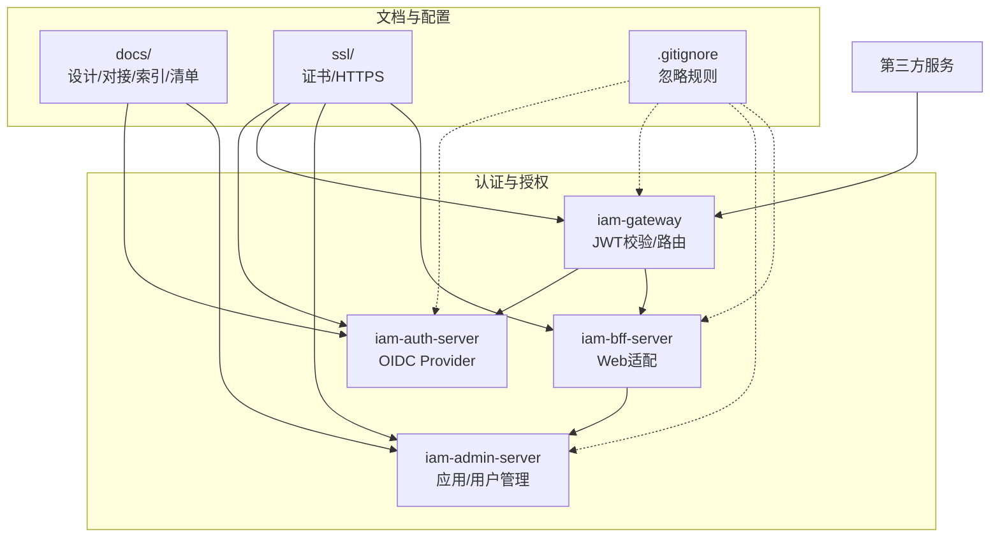
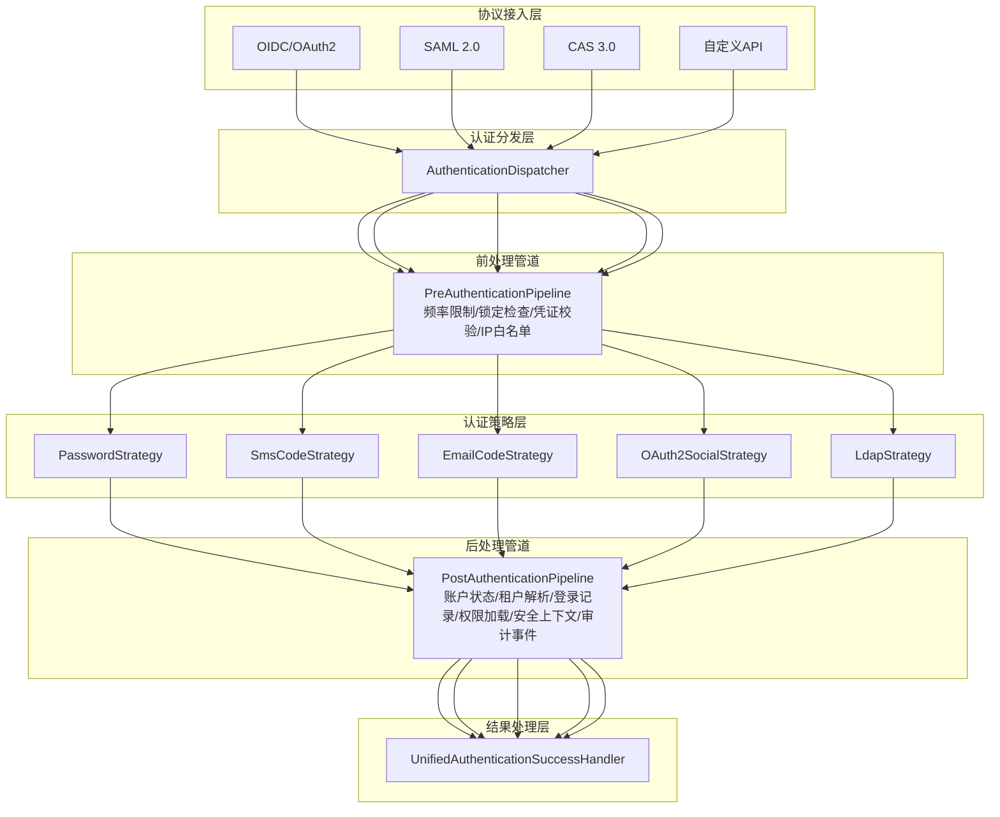
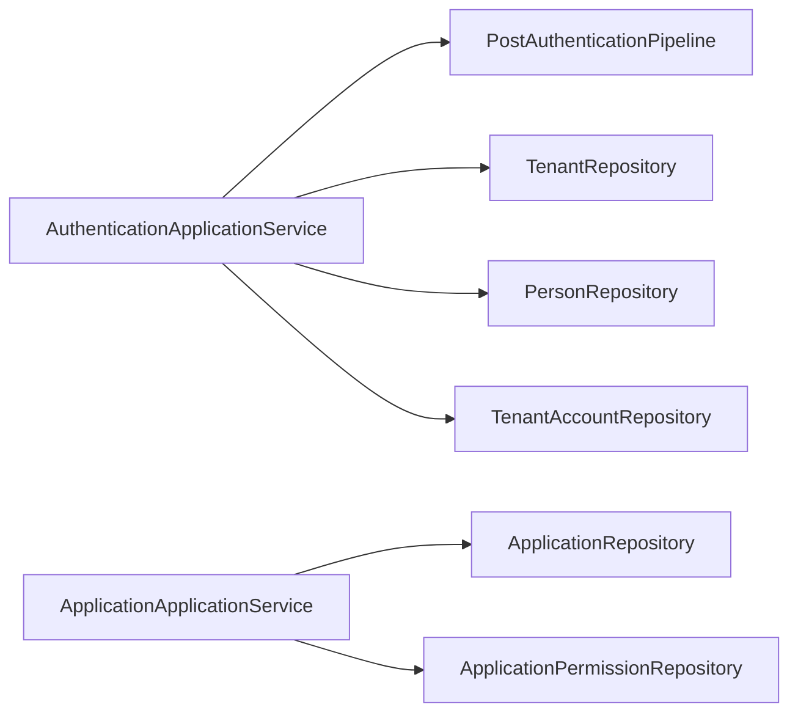

# 团队协作最佳实践

<cite>
**本文引用的文件**
- [README.md](file://README.md)
- [docs/index.md](file://docs/index.md)
- [docs/unfinished-features-checklist.md](file://docs/unfinished-features-checklist.md)
- [docs/design/统一认证框架.md](file://docs/design/统一认证框架.md)
- [docs/design/第三方服务对接指南.md](file://docs/design/第三方服务对接指南.md)
- [docs/archived/k8s/ARCHIVE_NOTICE.md](file://docs/archived/k8s/ARCHIVE_NOTICE.md)
- [ssl/README.md](file://ssl/README.md)
- [iam-auth-server/src/main/java/iam/platform/auth/application/service/AuthenticationApplicationService.java](file://iam-auth-server/src/main/java/iam/platform/auth/application/service/AuthenticationApplicationService.java)
- [iam-admin-server/src/main/java/iam/platform/admin/application/service/ApplicationApplicationService.java](file://iam-admin-server/src/main/java/iam/platform/admin/application/service/ApplicationApplicationService.java)
- [.gitignore](file://.gitignore)
</cite>

## 目录
1. [引言](#引言)
2. [项目结构](#项目结构)
3. [核心组件](#核心组件)
4. [架构总览](#架构总览)
5. [详细组件分析](#详细组件分析)
6. [依赖分析](#依赖分析)
7. [性能考虑](#性能考虑)
8. [故障排查指南](#故障排查指南)
9. [结论](#结论)
10. [附录](#附录)

## 引言
本指导手册面向IAM平台团队，围绕“代码规范、Git工作流、文档维护、知识分享、项目管理、跨团队协作、AI协作安全”七个维度，结合仓库现有实践与文档，形成可落地的团队协作最佳实践。目标是提升交付质量、缩短学习曲线、降低沟通成本、保障安全合规与持续演进。

## 项目结构
项目采用多模块微服务架构，围绕统一认证与授权能力提供服务：
- iam-auth-server：认证与OIDC Provider
- iam-admin-server：应用与用户管理后台
- iam-gateway：API网关与JWT校验
- iam-bff-server：前端后端一体化适配层
- docs：设计与对接文档、索引与清单
- ssl：SSL/TLS证书与HTTPS配置
- 脚本与配置：Docker部署、环境变量与忽略规则

图表来源
- [README.md:95-108](file://README.md#L95-L108)
- [docs/index.md:14-244](file://docs/index.md#L14-L244)
- [ssl/README.md:87-110](file://ssl/README.md#L87-L110)

章节来源
- [README.md:95-108](file://README.md#L95-L108)
- [docs/index.md:14-244](file://docs/index.md#L14-L244)

## 核心组件
- 认证应用服务：统一完成认证后处理、租户选择与上下文建立，替代原有验证码与会话服务逻辑，保证多租户与权限加载的一致性。
- 应用管理服务：负责OAuth2客户端注册、密钥轮换、状态管理与权限定义，支撑第三方服务对接。

章节来源
- [iam-auth-server/src/main/java/iam/platform/auth/application/service/AuthenticationApplicationService.java:24-111](file://iam-auth-server/src/main/java/iam/platform/auth/application/service/AuthenticationApplicationService.java#L24-L111)
- [iam-admin-server/src/main/java/iam/platform/admin/application/service/ApplicationApplicationService.java:35-176](file://iam-admin-server/src/main/java/iam/platform/admin/application/service/ApplicationApplicationService.java#L35-L176)

## 架构总览
IAM平台采用“统一认证框架”分层设计，协议接入层与身份认证层解耦，支持OIDC/SAML/CAS等多种协议，同时提供灵活的认证策略（密码、验证码、社交、LDAP等）。认证成功后，统一进入后处理管道，完成账户状态验证、租户解析、权限加载、安全上下文建立与审计事件发布。

图表来源
- [docs/design/统一认证框架.md:140-233](file://docs/design/统一认证框架.md#L140-L233)
- [docs/design/统一认证框架.md:333-354](file://docs/design/统一认证框架.md#L333-L354)

章节来源
- [docs/design/统一认证框架.md:140-233](file://docs/design/统一认证框架.md#L140-L233)

## 详细组件分析

### 代码规范与注释标准
- 代码风格与约束
  - 使用Lombok减少样板代码
  - 方法长度≤50行，类长度≤500行
  - 单元测试覆盖率≥80%
  - 遵循RESTful API设计规范
- 注释与审计
  - 关键业务方法与服务类使用注解进行审计日志标注，便于追踪变更与操作轨迹
  - 常量与枚举使用语义化命名，配合注释说明用途与取值范围

章节来源
- [README.md:112-117](file://README.md#L112-L117)
- [iam-admin-server/src/main/java/iam/platform/admin/application/service/ApplicationApplicationService.java:36-176](file://iam-admin-server/src/main/java/iam/platform/admin/application/service/ApplicationApplicationService.java#L36-L176)

### Git工作流与分支策略
- 分支模型
  - 采用Git Flow：feature/* → develop → release/* → canary/* → master
  - 各环境对应：DEV → TEST → CANARY → PROD
- 提交与评审
  - 严格遵循提交规范与评审流程，确保变更可追溯、可回滚
- 环境隔离
  - 通过Spring Profile实现多环境配置隔离，避免配置污染

章节来源
- [README.md:119-128](file://README.md#L119-L128)
- [README.md:147-158](file://README.md#L147-L158)

### 文档维护与版本管理
- 文档索引与导航
  - 通过docs/index.md提供全局导航，按主题与受众分类组织文档
- 更新原则
  - 单一职责、避免重复、保持同步、清晰导航、权威文档
- 结构规范
  - 文档目录结构清晰，便于检索与维护
- 归档与迁移
  - K8s部署配置已归档，当前采用Docker直连与Compose部署，归档说明明确迁移原因与恢复路径

章节来源
- [docs/index.md:196-244](file://docs/index.md#L196-L244)
- [docs/archived/k8s/ARCHIVE_NOTICE.md:1-30](file://docs/archived/k8s/ARCHIVE_NOTICE.md#L1-30)

### 知识分享与传承
- 技术分享会
  - 建议围绕统一认证框架、协议对接、安全机制等主题开展专题分享
- 代码评审
  - 评审重点覆盖：认证流程一致性、租户上下文建立、权限加载、审计日志、异常处理
- 导师制度
  - 新成员由资深成员带教，结合docs/design/统一认证框架.md与第三方对接指南进行系统培训

章节来源
- [docs/design/统一认证框架.md:1-10](file://docs/design/统一认证框架.md#L1-L10)
- [docs/design/第三方服务对接指南.md:1-10](file://docs/design/第三方服务对接指南.md#L1-L10)

### 项目管理与进度跟踪
- 未完成功能清单
  - 基于代码静态分析生成的清单，明确优先级、预计工时与状态，便于迭代排期
- 需求与任务分解
  - 将清单转化为可执行的任务卡片，结合评审与排期，纳入迭代计划
- 进度可视化
  - 使用清单与文档索引进行进度跟踪，确保功能闭环与文档同步更新

章节来源
- [docs/unfinished-features-checklist.md:1-319](file://docs/unfinished-features-checklist.md#L1-L319)

### 跨团队协作与接口定义
- 接口定义
  - 通过Admin Server管理API定义OAuth2客户端、回调地址、Scope与密钥轮换
- 依赖管理
  - 通过第三方服务对接指南明确客户端注册、回调配置、PKCE与JWT验证流程
- 变更协调
  - 客户端配置变更需同步更新Admin Server与各服务配置，确保一致性

章节来源
- [docs/design/第三方服务对接指南.md:42-99](file://docs/design/第三方服务对接指南.md#L42-L99)
- [iam-admin-server/src/main/java/iam/platform/admin/application/service/ApplicationApplicationService.java:35-176](file://iam-admin-server/src/main/java/iam/platform/admin/application/service/ApplicationApplicationService.java#L35-L176)

### AI协作安全规范
- 审核与确认
  - AI生成代码必须人工审核；敏感操作（DDL、密钥）需人工确认
- 访问控制
  - AI不得直接访问生产环境；引入依赖前需人工确认
- 风险管控
  - 通过严格的评审与变更流程，降低AI辅助带来的风险

章节来源
- [README.md:140-146](file://README.md#L140-L146)

## 依赖分析
- 认证应用服务依赖后处理管道与租户/人员仓储，完成认证后上下文建立与权限加载
- 应用管理服务依赖应用与权限仓储，负责OAuth2客户端生命周期管理

图表来源
- [iam-auth-server/src/main/java/iam/platform/auth/application/service/AuthenticationApplicationService.java:32-36](file://iam-auth-server/src/main/java/iam/platform/auth/application/service/AuthenticationApplicationService.java#L32-L36)
- [iam-admin-server/src/main/java/iam/platform/admin/application/service/ApplicationApplicationService.java:32-33](file://iam-admin-server/src/main/java/iam/platform/admin/application/service/ApplicationApplicationService.java#L32-L33)

章节来源
- [iam-auth-server/src/main/java/iam/platform/auth/application/service/AuthenticationApplicationService.java:32-36](file://iam-auth-server/src/main/java/iam/platform/auth/application/service/AuthenticationApplicationService.java#L32-L36)
- [iam-admin-server/src/main/java/iam/platform/admin/application/service/ApplicationApplicationService.java:32-33](file://iam-admin-server/src/main/java/iam/platform/admin/application/service/ApplicationApplicationService.java#L32-L33)

## 性能考虑
- 审计日志异步化
  - 建议将审计事件监听器改为异步处理，必要时引入消息队列进一步解耦，降低主流程延迟
- 速率限制与缓存
  - 验证码登录已实现Redis计数器与频率限制，建议在高并发场景下评估Redis连接池与键空间设计
- 多租户上下文
  - 租户上下文建立与权限加载应在保证正确性的前提下尽量减少数据库查询次数

章节来源
- [docs/unfinished-features-checklist.md:191-209](file://docs/unfinished-features-checklist.md#L191-L209)
- [docs/unfinished-features-checklist.md:239-258](file://docs/unfinished-features-checklist.md#L239-L258)

## 故障排查指南
- HTTPS与证书
  - 使用ssl/README.md提供的脚本或环境变量启用HTTPS；若出现证书问题，检查密钥库与JWK配置
- OIDC对接
  - 核对客户端注册信息（回调地址、Scope、PKCE）、令牌端点参数与状态/nonce校验
- 验证码登录
  - 检查Redis计数器与速率限制配置，确认验证码生成与存储逻辑
- 文档与配置同步
  - 若文档与实现不一致，以代码为准，及时更新文档并保持同步

章节来源
- [ssl/README.md:149-190](file://ssl/README.md#L149-L190)
- [docs/design/第三方服务对接指南.md:585-651](file://docs/design/第三方服务对接指南.md#L585-L651)
- [docs/unfinished-features-checklist.md:239-258](file://docs/unfinished-features-checklist.md#L239-L258)

## 结论
本指导手册将IAM平台现有实践与文档转化为可执行的团队协作规范，涵盖代码、流程、文档、安全与管理等关键领域。建议团队在日常工作中持续落实这些规范，结合未完成功能清单推进迭代，确保系统稳定、安全、可演进。

## 附录
- 多环境配置与部署
  - 通过Spring Profile隔离环境配置，当前采用Docker直连与Compose部署，归档说明了K8s迁移背景
- Git忽略与安全
  - .gitignore明确排除私钥与密钥库，确保敏感文件不被提交

章节来源
- [README.md:147-158](file://README.md#L147-L158)
- [docs/archived/k8s/ARCHIVE_NOTICE.md:14-29](file://docs/archived/k8s/ARCHIVE_NOTICE.md#L14-L29)
- [.gitignore:91-97](file://.gitignore#L91-L97)