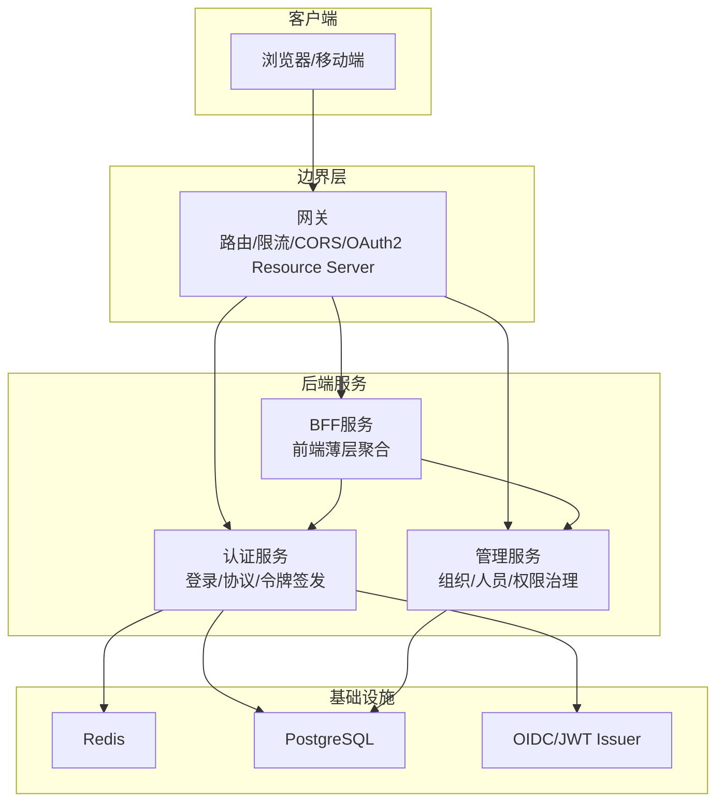
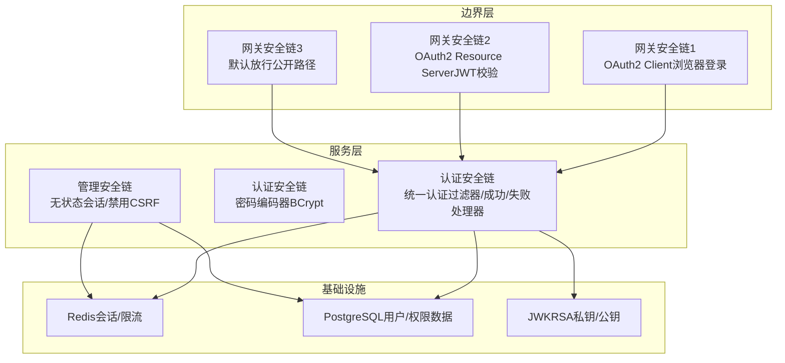
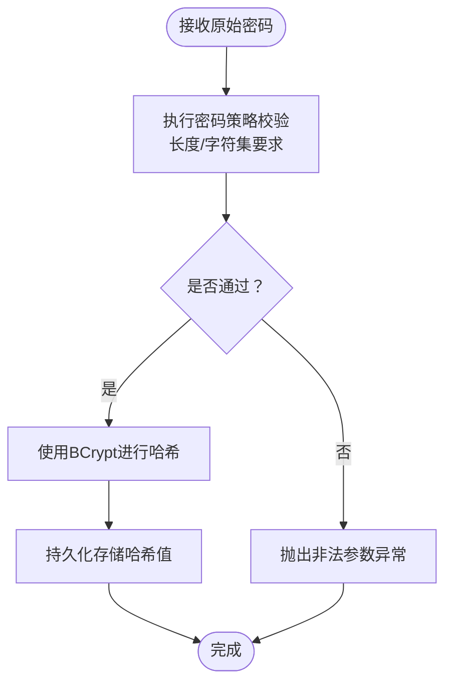
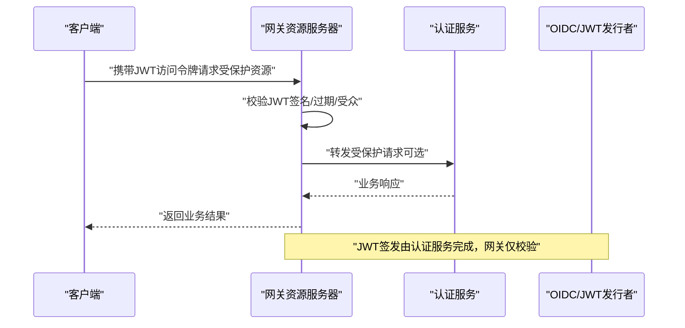
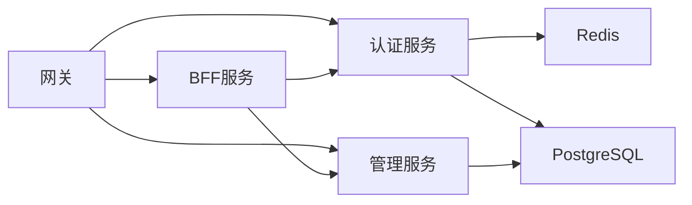

# 安全最佳实践

<cite>
**本文引用的文件**
- [AdminSecurityConfig.java](file://iam-admin-server/src/main/java/iam/platform/admin/infrastructure/config/AdminSecurityConfig.java)
- [DefaultSecurityConfig.java](file://iam-auth-server/src/main/java/iam/platform/auth/infrastructure/config/DefaultSecurityConfig.java)
- [EncryptionProperties.java](file://iam-auth-server/src/main/java/iam/platform/auth/infrastructure/config/EncryptionProperties.java)
- [JwkProperties.java](file://iam-auth-server/src/main/java/iam/platform/auth/infrastructure/config/JwkProperties.java)
- [Password.java](file://iam-common/src/main/java/iam/platform/common/model/valueobject/Password.java)
- [PasswordPolicyService.java](file://iam-admin-server/src/main/java/iam/platform/admin/domain/service/PasswordPolicyService.java)
- [TokenSettings.java](file://iam-common/src/main/java/iam/platform/common/model/valueobject/TokenSettings.java)
- [GatewaySecurityConfig.java](file://iam-gateway/src/main/java/iam/platform/gateway/infrastructure/security/GatewaySecurityConfig.java)
- [application.yml（认证服务）](file://iam-auth-server/src/main/resources/application.yml)
- [application.yml（管理服务）](file://iam-admin-server/src/main/resources/application.yml)
- [application.yml（网关）](file://iam-gateway/src/main/resources/application.yml)
- [application.yml（BFF）](file://iam-bff-server/src/main/resources/application.yml)
</cite>

## 目录
1. 引言
2. 项目结构
3. 核心组件
4. 架构总览
5. 详细组件分析
6. 依赖分析
7. 性能考虑
8. 故障排查指南
9. 结论
10. 附录

## 引言
本指南面向IAM平台的安全最佳实践落地，围绕密码加密、令牌管理、输入验证与输出编码、安全配置、认证与授权强化、以及安全审计与监控等维度，结合代码库中的实际实现进行系统性梳理与建议。目标是帮助开发者在不牺牲可用性的前提下，构建高安全性、可运维、可演进的统一身份认证与授权体系。

## 项目结构
IAM平台采用多模块分层设计：认证服务负责登录、协议适配与令牌签发；管理服务负责组织、人员、角色、权限等治理；BFF作为前端薄层聚合调用；网关负责路由、限流与资源服务器校验；公共模块提供通用模型与工具。安全配置贯穿各模块，通过Spring Security与Spring Cloud Gateway实现统一控制面。

图示来源
- [application.yml（网关）:18-54](file://iam-gateway/src/main/resources/application.yml#L18-L54)
- [application.yml（认证服务）:15-38](file://iam-auth-server/src/main/resources/application.yml#L15-L38)
- [application.yml（管理服务）:15-38](file://iam-admin-server/src/main/resources/application.yml#L15-L38)

章节来源
- [application.yml（网关）:1-116](file://iam-gateway/src/main/resources/application.yml#L1-L116)
- [application.yml（认证服务）:1-144](file://iam-auth-server/src/main/resources/application.yml#L1-L144)
- [application.yml（管理服务）:1-102](file://iam-admin-server/src/main/resources/application.yml#L1-L102)
- [application.yml（BFF）:1-54](file://iam-bff-server/src/main/resources/application.yml#L1-L54)

## 核心组件
- 密码加密与强度策略
  - 使用BCrypt进行密码哈希，确保不可逆与抗彩虹表。
  - 在公共模块中定义统一的密码值对象与策略校验，避免重复实现。
- 令牌管理
  - 令牌TTL通过值对象集中管理，默认访问令牌1小时、刷新令牌24小时。
  - 认证服务配置RSA-JWK用于签名密钥对，支持生产环境密钥轮换。
- 输入验证与输出编码
  - 通过Spring Security过滤器链统一拦截请求，结合业务层校验实现防注入与防篡改。
- 安全配置
  - HTTPS由各服务配置启用，网关与服务端均支持SSL。
  - CORS在网关全局开放，需按生产环境收紧。
- 认证与授权强化
  - 网关资源服务器链路校验JWT，认证入口点统一处理无效令牌场景。
  - 认证服务内置速率限制、账户锁定与IP白名单策略。
- 安全审计与监控
  - 各服务暴露指标与追踪，管理端开启审计日志异步写入与保留策略。

章节来源
- [DefaultSecurityConfig.java:90-94](file://iam-auth-server/src/main/java/iam/platform/auth/infrastructure/config/DefaultSecurityConfig.java#L90-L94)
- [AdminSecurityConfig.java:36-40](file://iam-admin-server/src/main/java/iam/platform/admin/infrastructure/config/AdminSecurityConfig.java#L36-L40)
- [Password.java:37-83](file://iam-common/src/main/java/iam/platform/common/model/valueobject/Password.java#L37-L83)
- [TokenSettings.java:36-48](file://iam-common/src/main/java/iam/platform/common/model/valueobject/TokenSettings.java#L36-L48)
- [JwkProperties.java:11-15](file://iam-auth-server/src/main/java/iam/platform/auth/infrastructure/config/JwkProperties.java#L11-L15)
- [GatewaySecurityConfig.java:47-59](file://iam-gateway/src/main/java/iam/platform/gateway/infrastructure/security/GatewaySecurityConfig.java#L47-L59)

## 架构总览
IAM平台的安全架构以“边界层-服务层-基础设施”三层划分，边界层承担统一入口、限流与资源服务器校验；服务层实现认证与授权核心逻辑；基础设施提供会话、缓存与数据库支撑。安全策略通过配置文件与安全组件统一落地。

图示来源
- [GatewaySecurityConfig.java:28-73](file://iam-gateway/src/main/java/iam/platform/gateway/infrastructure/security/GatewaySecurityConfig.java#L28-L73)
- [DefaultSecurityConfig.java:35-88](file://iam-auth-server/src/main/java/iam/platform/auth/infrastructure/config/DefaultSecurityConfig.java#L35-L88)
- [AdminSecurityConfig.java:18-34](file://iam-admin-server/src/main/java/iam/platform/admin/infrastructure/config/AdminSecurityConfig.java#L18-L34)
- [JwkProperties.java:11-15](file://iam-auth-server/src/main/java/iam/platform/auth/infrastructure/config/JwkProperties.java#L11-L15)

## 详细组件分析

### 密码加密与强度策略
- 实现要点
  - 服务端统一使用BCryptPasswordEncoder进行密码哈希，确保每次随机盐值生成，不可逆且抗暴力破解。
  - 公共模块Password值对象封装密码创建、重建与匹配逻辑，业务侧通过传入编码/匹配函数完成策略执行。
  - 管理服务提供独立的密码策略校验服务，保证在不同上下文的一致性。
- 参数与复杂度
  - 当前策略包含长度、大小写字母、数字要求；建议在生产中引入字典与历史密码检查，防止弱口令复用。
- 历史管理
  - 可扩展策略：在用户密码更新时，将旧哈希加入历史集合并在新密码校验阶段拒绝重复使用。

图示来源
- [Password.java:37-83](file://iam-common/src/main/java/iam/platform/common/model/valueobject/Password.java#L37-L83)
- [PasswordPolicyService.java:11-24](file://iam-admin-server/src/main/java/iam/platform/admin/domain/service/PasswordPolicyService.java#L11-L24)
- [DefaultSecurityConfig.java:90-94](file://iam-auth-server/src/main/java/iam/platform/auth/infrastructure/config/DefaultSecurityConfig.java#L90-L94)
- [AdminSecurityConfig.java:36-40](file://iam-admin-server/src/main/java/iam/platform/admin/infrastructure/config/AdminSecurityConfig.java#L36-L40)

章节来源
- [Password.java:1-90](file://iam-common/src/main/java/iam/platform/common/model/valueobject/Password.java#L1-L90)
- [PasswordPolicyService.java:1-35](file://iam-admin-server/src/main/java/iam/platform/admin/domain/service/PasswordPolicyService.java#L1-L35)
- [DefaultSecurityConfig.java:90-94](file://iam-auth-server/src/main/java/iam/platform/auth/infrastructure/config/DefaultSecurityConfig.java#L90-L94)
- [AdminSecurityConfig.java:36-40](file://iam-admin-server/src/main/java/iam/platform/admin/infrastructure/config/AdminSecurityConfig.java#L36-L40)

### 令牌管理与生命周期
- 设计与实现
  - TokenSettings集中管理访问令牌与刷新令牌TTL，提供默认值与显式构造方法，确保一致性。
  - 认证服务配置JWK（RSA私钥/公钥）用于JWT签名，支持外部密钥文件路径，便于密钥轮换。
- 生命周期管理
  - 访问令牌短周期（默认1小时），刷新令牌较长周期（默认24小时），降低泄露影响面。
  - 建议：在鉴权层增加令牌撤销列表（RTLT）与黑名单机制，配合刷新令牌的唯一性与绑定策略。
- 撤销机制
  - 建议：引入Redis存储已吊销的刷新令牌哈希，登录/注销时写入；校验阶段若命中则拒绝。

图示来源
- [GatewaySecurityConfig.java:47-59](file://iam-gateway/src/main/java/iam/platform/gateway/infrastructure/security/GatewaySecurityConfig.java#L47-L59)
- [TokenSettings.java:36-48](file://iam-common/src/main/java/iam/platform/common/model/valueobject/TokenSettings.java#L36-L48)
- [JwkProperties.java:11-15](file://iam-auth-server/src/main/java/iam/platform/auth/infrastructure/config/JwkProperties.java#L11-L15)

章节来源
- [TokenSettings.java:1-63](file://iam-common/src/main/java/iam/platform/common/model/valueobject/TokenSettings.java#L1-L63)
- [JwkProperties.java:1-16](file://iam-auth-server/src/main/java/iam/platform/auth/infrastructure/config/JwkProperties.java#L1-L16)
- [GatewaySecurityConfig.java:1-131](file://iam-gateway/src/main/java/iam/platform/gateway/infrastructure/security/GatewaySecurityConfig.java#L1-L131)

### 输入验证与输出编码
- SQL注入防护
  - 使用JPA/Hibernate与参数化查询，避免动态拼接SQL；当前配置关闭open-in-view，降低注入风险与性能隐患。
- XSS与CSRF
  - 管理服务明确禁用CSRF，采用无状态会话（STATELESS），降低CSRF威胁；前端模板渲染需严格转义输出。
- 建议
  - 对所有用户输入进行白名单校验与长度限制；对富文本输出进行HTML转义与CSP策略；对敏感字段进行脱敏输出。

章节来源
- [application.yml（认证服务）:29-32](file://iam-auth-server/src/main/resources/application.yml#L29-L32)
- [AdminSecurityConfig.java:27-31](file://iam-admin-server/src/main/java/iam/platform/admin/infrastructure/config/AdminSecurityConfig.java#L27-L31)

### 安全配置最佳实践
- HTTPS强制
  - 各服务均支持SSL配置，建议在生产中强制启用并使用强密码套件与TLS版本。
- 安全头与CORS
  - 网关全局CORS允许所有来源与凭据，生产需按域名与方法精确放开；建议补充安全头（HSTS、X-Content-Type-Options、Referrer-Policy等）。
- 会话与Cookie
  - 认证服务使用Redis存储会话，管理服务采用无状态会话；建议为Cookie设置SameSite、Secure、HttpOnly属性。

章节来源
- [application.yml（网关）:55-68](file://iam-gateway/src/main/resources/application.yml#L55-L68)
- [application.yml（认证服务）:49-52](file://iam-auth-server/src/main/resources/application.yml#L49-L52)
- [application.yml（管理服务）:47-50](file://iam-admin-server/src/main/resources/application.yml#L47-L50)

### 认证与授权强化
- 多因素认证（MFA）
  - 建议在统一认证过滤器链中接入短信/邮件验证码，结合账户锁定策略与IP白名单。
- 会话管理
  - 采用短会话与定期刷新；无状态服务通过JWT替代服务端会话，减少会话固定风险。
- 权限最小化
  - 基于角色与资源的细粒度授权，结合审计日志追踪权限变更与异常访问。

章节来源
- [DefaultSecurityConfig.java:35-63](file://iam-auth-server/src/main/java/iam/platform/auth/infrastructure/config/DefaultSecurityConfig.java#L35-L63)
- [application.yml（认证服务）:90-102](file://iam-auth-server/src/main/resources/application.yml#L90-L102)

### 安全审计与监控
- 审计日志
  - 管理服务开启审计系统，支持异步写入与保留天数配置，建议记录关键操作（登录、权限变更、账号锁定等）。
- 监控与追踪
  - 暴露指标与Zipkin追踪，建议结合告警规则对异常登录、频繁失败、高延迟等进行告警。

章节来源
- [application.yml（管理服务）:93-102](file://iam-admin-server/src/main/resources/application.yml#L93-L102)
- [application.yml（认证服务）:128-144](file://iam-auth-server/src/main/resources/application.yml#L128-L144)
- [application.yml（网关）:93-108](file://iam-gateway/src/main/resources/application.yml#L93-L108)

## 依赖分析
- 组件耦合
  - 网关资源服务器依赖认证服务的OIDC发行者与JWT校验器；认证服务依赖Redis与数据库；管理服务依赖Redis与数据库。
- 外部依赖
  - Spring Security、Spring Cloud Gateway、OpenFeign、Redis、PostgreSQL、JDBC驱动。
- 潜在风险
  - CORS全局放开可能带来跨域风险；需在生产收紧；密码策略需与历史口令策略协同。

图示来源
- [application.yml（网关）:18-54](file://iam-gateway/src/main/resources/application.yml#L18-L54)
- [application.yml（认证服务）:15-38](file://iam-auth-server/src/main/resources/application.yml#L15-L38)
- [application.yml（管理服务）:15-38](file://iam-admin-server/src/main/resources/application.yml#L15-L38)

章节来源
- [application.yml（网关）:1-116](file://iam-gateway/src/main/resources/application.yml#L1-L116)
- [application.yml（认证服务）:1-144](file://iam-auth-server/src/main/resources/application.yml#L1-L144)
- [application.yml（管理服务）:1-102](file://iam-admin-server/src/main/resources/application.yml#L1-L102)

## 性能考虑
- 限流与降载
  - 网关对不同路由配置了Redis限流参数，建议根据业务峰值调整补给速率与突发容量。
- 缓存与连接池
  - 数据源连接池参数已配置，建议结合压测结果优化最大连接数与超时时间。
- 日志与追踪
  - 调试级别日志仅在开发环境开启，生产建议降低日志级别并启用异步审计。

章节来源
- [application.yml（网关）:25-41](file://iam-gateway/src/main/resources/application.yml#L25-L41)
- [application.yml（认证服务）:19-24](file://iam-auth-server/src/main/resources/application.yml#L19-L24)

## 故障排查指南
- 令牌校验失败
  - 网关资源服务器自定义认证入口点，会根据异常信息分类返回错误类型（过期、签名无效、发行者无效、缺失令牌等），便于快速定位问题。
- 登录失败与风控
  - 认证服务内置速率限制、账户锁定阈值与锁定时长，建议结合日志与监控定位异常来源。
- CORS与跨域
  - 生产环境需收紧CORS配置，避免通配符导致的安全隐患。

章节来源
- [GatewaySecurityConfig.java:78-129](file://iam-gateway/src/main/java/iam/platform/gateway/infrastructure/security/GatewaySecurityConfig.java#L78-L129)
- [application.yml（认证服务）:93-102](file://iam-auth-server/src/main/resources/application.yml#L93-L102)
- [application.yml（网关）:55-68](file://iam-gateway/src/main/resources/application.yml#L55-L68)

## 结论
本指南基于代码库现有实现，总结了IAM平台在密码加密、令牌管理、输入输出安全、安全配置、认证授权强化与审计监控等方面的最佳实践。建议在生产环境中进一步完善密码历史策略、令牌撤销机制、CORS与安全头策略，并持续通过监控与审计提升整体安全韧性。

## 附录
- 关键配置项速查
  - HTTPS开关与证书路径：见各服务application.yml中server.ssl.*配置。
  - OIDC发行者URI：见认证服务security.issuer-uri与各服务oauth2.provider配置。
  - JWK密钥位置：见认证服务security.jwk.rsa.private-key-location/public-key-location。
  - CORS策略：见网关globalcors配置。
  - 审计与指标：见管理服务sso.audit.*与management.*配置。

章节来源
- [application.yml（认证服务）:81-88](file://iam-auth-server/src/main/resources/application.yml#L81-L88)
- [application.yml（网关）:55-83](file://iam-gateway/src/main/resources/application.yml#L55-L83)
- [application.yml（管理服务）:93-102](file://iam-admin-server/src/main/resources/application.yml#L93-L102)