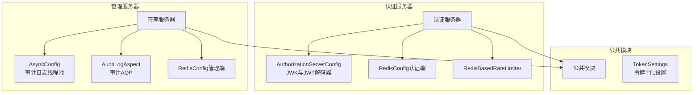
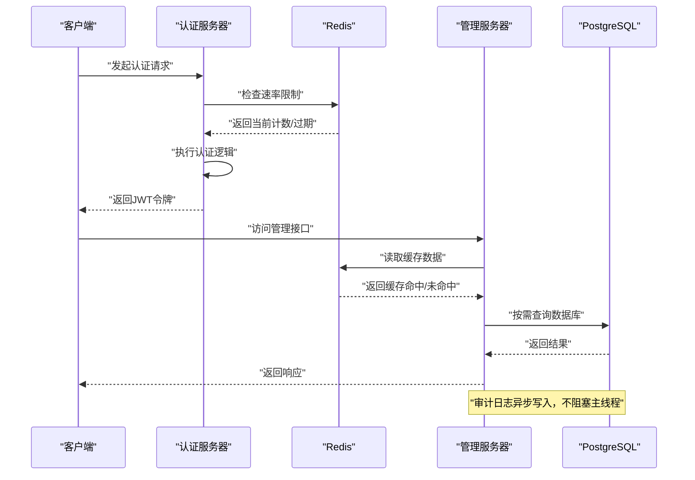
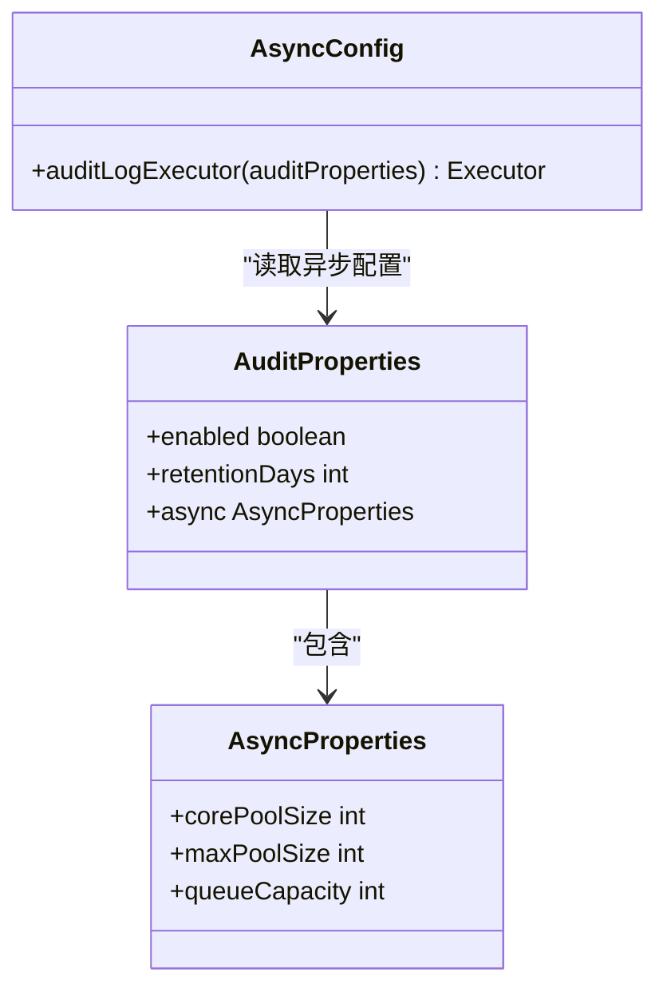
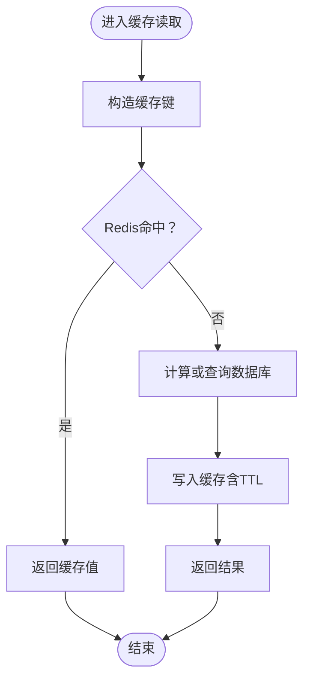
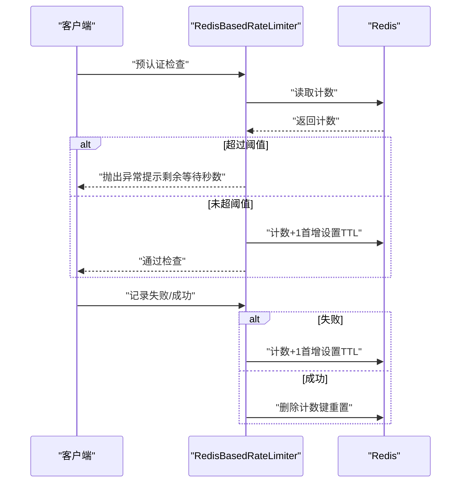
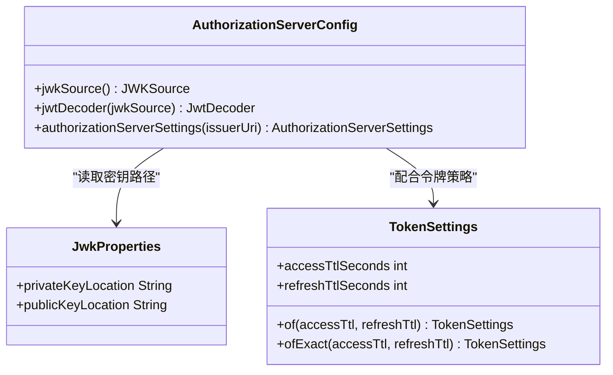
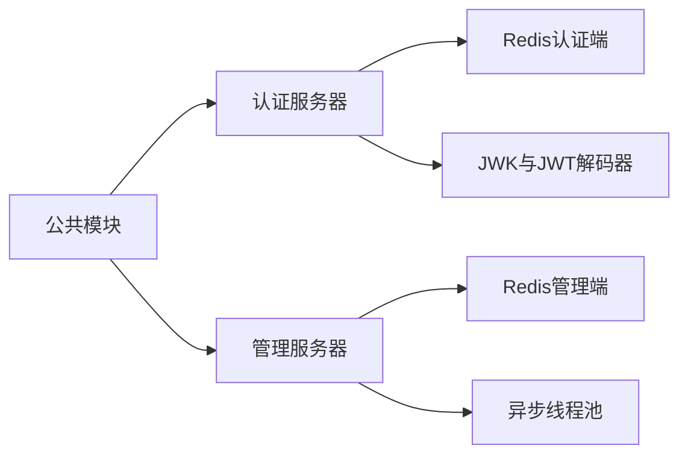

# 性能优化策略

<cite>
**本文引用的文件**
- [AsyncConfig.java](file://iam-admin-server/src/main/java/iam/platform/admin/infrastructure/config/AsyncConfig.java)
- [RedisConfig.java（管理端）](file://iam-admin-server/src/main/java/iam/platform/admin/infrastructure/config/RedisConfig.java)
- [RedisConfig.java（认证端）](file://iam-auth-server/src/main/java/iam/platform/auth/infrastructure/config/RedisConfig.java)
- [RedisBasedRateLimiter.java](file://iam-auth-server/src/main/java/iam/platform/auth/infrastructure/security/RedisBasedRateLimiter.java)
- [AuditLogAspect.java](file://iam-admin-server/src/main/java/iam/platform/admin/infrastructure/aspect/AuditLogAspect.java)
- [application.yml](file://iam-admin-server/src/main/resources/application.yml)
- [AuthorizationServerConfig.java](file://iam-auth-server/src/main/java/iam/platform/auth/infrastructure/config/AuthorizationServerConfig.java)
- [JwkProperties.java](file://iam-auth-server/src/main/java/iam/platform/auth/infrastructure/config/JwkProperties.java)
- [SecurityPolicyProperties.java](file://iam-auth-server/src/main/java/iam/platform/auth/infrastructure/config/SecurityPolicyProperties.java)
- [TokenSettings.java](file://iam-common/src/main/java/iam/platform/common/model/valueobject/TokenSettings.java)
</cite>

## 目录
1. [简介](#简介)
2. [项目结构](#项目结构)
3. [核心组件](#核心组件)
4. [架构总览](#架构总览)
5. [详细组件分析](#详细组件分析)
6. [依赖分析](#依赖分析)
7. [性能考量](#性能考量)
8. [故障排查指南](#故障排查指南)
9. [结论](#结论)
10. [附录](#附录)

## 简介
本指南面向IAM平台的性能优化，聚焦以下方面：
- 数据库查询优化：索引设计原则、查询计划分析与慢查询优化
- 缓存策略：Redis配置优化、缓存穿透防护、缓存雪崩预防、缓存一致性
- 异步处理：线程池配置、异步任务设计、消息队列使用
- 并发控制：乐观锁、悲观锁、分布式锁
- JWT令牌管理：令牌大小控制、签名算法选择、令牌刷新策略
- 性能监控与调优：APM集成、性能瓶颈识别

本指南基于仓库中的实际配置与实现进行分析，并提供可操作的优化建议与最佳实践。

## 项目结构
IAM平台由多个子模块组成，其中与性能优化直接相关的关键模块包括：
- 认证服务器（iam-auth-server）：负责授权与安全策略、JWT签发与校验、速率限制等
- 管理服务器（iam-admin-server）：负责审计日志异步写入、Redis缓存配置等
- 公共模块（iam-common）：包含通用模型与值对象，如令牌设置

图表来源
- [AuthorizationServerConfig.java:36-130](file://iam-auth-server/src/main/java/iam/platform/auth/infrastructure/config/AuthorizationServerConfig.java#L36-L130)
- [RedisConfig.java（认证端）:16-35](file://iam-auth-server/src/main/java/iam/platform/auth/infrastructure/config/RedisConfig.java#L16-L35)
- [RedisBasedRateLimiter.java:13-124](file://iam-auth-server/src/main/java/iam/platform/auth/infrastructure/security/RedisBasedRateLimiter.java#L13-L124)
- [AsyncConfig.java:14-30](file://iam-admin-server/src/main/java/iam/platform/admin/infrastructure/config/AsyncConfig.java#L14-L30)
- [AuditLogAspect.java:14-66](file://iam-admin-server/src/main/java/iam/platform/admin/infrastructure/aspect/AuditLogAspect.java#L14-L66)
- [RedisConfig.java（管理端）:15-29](file://iam-admin-server/src/main/java/iam/platform/admin/infrastructure/config/RedisConfig.java#L15-L29)
- [TokenSettings.java:38-62](file://iam-common/src/main/java/iam/platform/common/model/valueobject/TokenSettings.java#L38-L62)

章节来源
- [application.yml:10-102](file://iam-admin-server/src/main/resources/application.yml#L10-L102)

## 核心组件
- 异步审计日志执行器：通过独立线程池异步写入审计事件，避免阻塞主业务线程
- Redis缓存管理：统一的缓存配置与序列化策略，支持禁用空值缓存与自定义键前缀
- 速率限制器：基于Redis的滑动窗口计数器，实现失败尝试次数限制与过期时间控制
- 授权服务器配置：加载JWK密钥对，生成稳定的KeyID，构建JWT解码器与授权服务器过滤链
- 令牌设置：访问令牌与刷新令牌TTL的显式配置与参数校验

章节来源
- [AsyncConfig.java:18-29](file://iam-admin-server/src/main/java/iam/platform/admin/infrastructure/config/AsyncConfig.java#L18-L29)
- [RedisConfig.java（管理端）:19-28](file://iam-admin-server/src/main/java/iam/platform/admin/infrastructure/config/RedisConfig.java#L19-L28)
- [RedisConfig.java（认证端）:20-29](file://iam-auth-server/src/main/java/iam/platform/auth/infrastructure/config/RedisConfig.java#L20-L29)
- [RedisBasedRateLimiter.java:32-67](file://iam-auth-server/src/main/java/iam/platform/auth/infrastructure/security/RedisBasedRateLimiter.java#L32-L67)
- [AuthorizationServerConfig.java:66-93](file://iam-auth-server/src/main/java/iam/platform/auth/infrastructure/config/AuthorizationServerConfig.java#L66-L93)
- [TokenSettings.java:38-62](file://iam-common/src/main/java/iam/platform/common/model/valueobject/TokenSettings.java#L38-L62)

## 架构总览
下图展示了认证与管理两大子系统在性能优化方面的关键交互：

图表来源
- [RedisBasedRateLimiter.java:32-67](file://iam-auth-server/src/main/java/iam/platform/auth/infrastructure/security/RedisBasedRateLimiter.java#L32-L67)
- [RedisConfig.java（管理端）:19-28](file://iam-admin-server/src/main/java/iam/platform/admin/infrastructure/config/RedisConfig.java#L19-L28)
- [AsyncConfig.java:18-29](file://iam-admin-server/src/main/java/iam/platform/admin/infrastructure/config/AsyncConfig.java#L18-L29)
- [application.yml:15-48](file://iam-admin-server/src/main/resources/application.yml#L15-L48)

## 详细组件分析

### 异步审计日志执行器
- 设计目标：将审计事件写入与业务处理解耦，降低I/O对主流程的影响
- 线程池配置：核心池大小、最大池大小、队列容量、拒绝策略（调用方运行）
- 执行器命名：便于监控与定位
- 触发方式：通过AOP拦截标注了审计注解的方法，在方法完成后发布审计事件

图表来源
- [AsyncConfig.java:18-29](file://iam-admin-server/src/main/java/iam/platform/admin/infrastructure/config/AsyncConfig.java#L18-L29)
- [AuditProperties.java:10-36](file://iam-admin-server/src/main/java/iam/platform/admin/infrastructure/config/AuditProperties.java#L10-L36)

章节来源
- [AsyncConfig.java:18-29](file://iam-admin-server/src/main/java/iam/platform/admin/infrastructure/config/AsyncConfig.java#L18-L29)
- [AuditLogAspect.java:27-58](file://iam-admin-server/src/main/java/iam/platform/admin/infrastructure/aspect/AuditLogAspect.java#L27-L58)
- [AuditProperties.java:10-36](file://iam-admin-server/src/main/java/iam/platform/admin/infrastructure/config/AuditProperties.java#L10-L36)

### Redis缓存策略
- 缓存管理器：默认TTL、禁用空值缓存、简单键前缀、JSON序列化
- 认证端额外提供字符串模板，便于计数器与限流键操作
- 管理端与认证端分别在各自模块内启用缓存配置，避免跨模块干扰

图表来源
- [RedisConfig.java（管理端）:19-28](file://iam-admin-server/src/main/java/iam/platform/admin/infrastructure/config/RedisConfig.java#L19-L28)
- [RedisConfig.java（认证端）:20-29](file://iam-auth-server/src/main/java/iam/platform/auth/infrastructure/config/RedisConfig.java#L20-L29)

章节来源
- [RedisConfig.java（管理端）:19-28](file://iam-admin-server/src/main/java/iam/platform/admin/infrastructure/config/RedisConfig.java#L19-L28)
- [RedisConfig.java（认证端）:20-29](file://iam-auth-server/src/main/java/iam/platform/auth/infrastructure/config/RedisConfig.java#L20-L29)

### 速率限制器（Redis滑动窗口）
- 限流维度：用户名/手机号/邮箱标识或客户端IP
- 实现机制：计数器+过期时间；首次计数设置窗口过期时间；成功登录重置计数
- 容错策略：Redis不可用时“放行”（fail-open），保障可用性
- 配置项：是否启用、最大尝试次数、时间窗口秒数

图表来源
- [RedisBasedRateLimiter.java:32-108](file://iam-auth-server/src/main/java/iam/platform/auth/infrastructure/security/RedisBasedRateLimiter.java#L32-L108)
- [SecurityPolicyProperties.java:24-28](file://iam-auth-server/src/main/java/iam/platform/auth/infrastructure/config/SecurityPolicyProperties.java#L24-L28)

章节来源
- [RedisBasedRateLimiter.java:32-108](file://iam-auth-server/src/main/java/iam/platform/auth/infrastructure/security/RedisBasedRateLimiter.java#L32-L108)
- [SecurityPolicyProperties.java:16-36](file://iam-auth-server/src/main/java/iam/platform/auth/infrastructure/config/SecurityPolicyProperties.java#L16-L36)

### JWT令牌管理
- JWK加载与KeyID生成：从PEM文件解析RSA私钥/公钥，基于公钥生成稳定KeyID，避免重启导致JWKS缓存失效
- JWT解码器：结合JWK源构建解码器，供资源服务器验证令牌
- 令牌TTL设置：访问令牌与刷新令牌TTL通过值对象进行参数校验与组合

图表来源
- [AuthorizationServerConfig.java:66-99](file://iam-auth-server/src/main/java/iam/platform/auth/infrastructure/config/AuthorizationServerConfig.java#L66-L99)
- [JwkProperties.java:12-15](file://iam-auth-server/src/main/java/iam/platform/auth/infrastructure/config/JwkProperties.java#L12-L15)
- [TokenSettings.java:38-62](file://iam-common/src/main/java/iam/platform/common/model/valueobject/TokenSettings.java#L38-L62)

章节来源
- [AuthorizationServerConfig.java:66-99](file://iam-auth-server/src/main/java/iam/platform/auth/infrastructure/config/AuthorizationServerConfig.java#L66-L99)
- [JwkProperties.java:12-15](file://iam-auth-server/src/main/java/iam/platform/auth/infrastructure/config/JwkProperties.java#L12-L15)
- [TokenSettings.java:38-62](file://iam-common/src/main/java/iam/platform/common/model/valueobject/TokenSettings.java#L38-L62)

## 依赖分析
- 认证服务器依赖Redis进行速率限制与缓存；依赖JWK进行JWT签发与校验
- 管理服务器依赖Redis进行缓存；依赖异步线程池进行审计日志写入
- 公共模块提供令牌TTL设置，被认证与管理服务器共享

图表来源
- [RedisConfig.java（认证端）:16-35](file://iam-auth-server/src/main/java/iam/platform/auth/infrastructure/config/RedisConfig.java#L16-L35)
- [RedisConfig.java（管理端）:15-29](file://iam-admin-server/src/main/java/iam/platform/admin/infrastructure/config/RedisConfig.java#L15-L29)
- [AsyncConfig.java:18-29](file://iam-admin-server/src/main/java/iam/platform/admin/infrastructure/config/AsyncConfig.java#L18-L29)
- [AuthorizationServerConfig.java:66-99](file://iam-auth-server/src/main/java/iam/platform/auth/infrastructure/config/AuthorizationServerConfig.java#L66-L99)
- [TokenSettings.java:38-62](file://iam-common/src/main/java/iam/platform/common/model/valueobject/TokenSettings.java#L38-L62)

## 性能考量
- 数据库查询优化
  - 连接池与SQL输出：连接池最大大小、最小空闲、超时与生命周期已配置；SQL输出关闭以减少开销
  - 建议：为高频查询字段建立合适索引；使用EXPLAIN分析慢查询；分页查询避免一次性加载大结果集
  - 章节来源
    - [application.yml:15-33](file://iam-admin-server/src/main/resources/application.yml#L15-L33)

- 缓存策略
  - TTL与序列化：默认TTL、JSON序列化、禁用空值缓存；键前缀统一
  - 缓存穿透：对不存在的键设置短暂TTL或布隆过滤器
  - 缓存雪崩：为TTL增加抖动；热点键设置互斥锁或后台更新
  - 缓存一致性：写时更新/失效；版本号或时间戳校验
  - 章节来源
    - [RedisConfig.java（管理端）:19-28](file://iam-admin-server/src/main/java/iam/platform/admin/infrastructure/config/RedisConfig.java#L19-L28)
    - [RedisConfig.java（认证端）:20-29](file://iam-auth-server/src/main/java/iam/platform/auth/infrastructure/config/RedisConfig.java#L20-L29)

- 异步处理
  - 线程池：核心/最大线程与队列容量需根据峰值QPS与任务耗时调优；拒绝策略采用调用线程执行以保护系统
  - 任务设计：IO密集型与CPU密集型分离；避免长事务；幂等性设计
  - 章节来源
    - [AsyncConfig.java:18-29](file://iam-admin-server/src/main/java/iam/platform/admin/infrastructure/config/AsyncConfig.java#L18-L29)

- 并发控制
  - 乐观锁：基于版本号或时间戳；冲突时重试与退避
  - 悲观锁：短事务、合理锁粒度；避免长持有
  - 分布式锁：Redlock或基于Redis的SET key EX nx px；注意锁超时与续期
  - 章节来源
    - [RedisBasedRateLimiter.java:32-67](file://iam-auth-server/src/main/java/iam/platform/auth/infrastructure/security/RedisBasedRateLimiter.java#L32-L67)

- JWT令牌管理
  - KeyID稳定性：基于公钥生成固定KeyID，避免重启导致JWKS缓存失效
  - 令牌大小：精简声明；必要时使用引用令牌
  - 刷新策略：短有效期+刷新令牌轮换；刷新时撤销旧令牌
  - 章节来源
    - [AuthorizationServerConfig.java:117-128](file://iam-auth-server/src/main/java/iam/platform/auth/infrastructure/config/AuthorizationServerConfig.java#L117-L128)
    - [TokenSettings.java:38-62](file://iam-common/src/main/java/iam/platform/common/model/valueobject/TokenSettings.java#L38-L62)

- 性能监控与调优
  - 指标暴露：健康、信息、指标、Prometheus端点已开启
  - 链路追踪：Zipkin端点配置，采样概率1.0
  - 建议：结合APM工具（如Micrometer+Prometheus+Grafana）观察线程池饱和度、Redis命中率、数据库连接池利用率、JWT签发/校验耗时
  - 章节来源
    - [application.yml:76-92](file://iam-admin-server/src/main/resources/application.yml#L76-L92)

## 故障排查指南
- 审计日志异步写入失败
  - 现象：审计事件未落库或丢失
  - 排查：检查线程池配置与拒绝策略；查看AOP发布事件异常日志
  - 章节来源
    - [AsyncConfig.java:18-29](file://iam-admin-server/src/main/java/iam/platform/admin/infrastructure/config/AsyncConfig.java#L18-L29)
    - [AuditLogAspect.java:50-58](file://iam-admin-server/src/main/java/iam/platform/admin/infrastructure/aspect/AuditLogAspect.java#L50-L58)

- Redis不可用导致限流失效
  - 现象：认证频繁失败或无限制
  - 排查：确认Redis连接配置；检查限流器的容错策略（fail-open）是否生效
  - 章节来源
    - [RedisBasedRateLimiter.java:63-67](file://iam-auth-server/src/main/java/iam/platform/auth/infrastructure/security/RedisBasedRateLimiter.java#L63-L67)

- 缓存未命中或频繁失效
  - 现象：缓存命中率低或热点键抖动
  - 排查：调整TTL与序列化；为热点键增加互斥更新；检查键前缀与命名规范
  - 章节来源
    - [RedisConfig.java（管理端）:19-28](file://iam-admin-server/src/main/java/iam/platform/admin/infrastructure/config/RedisConfig.java#L19-L28)
    - [RedisConfig.java（认证端）:20-29](file://iam-auth-server/src/main/java/iam/platform/auth/infrastructure/config/RedisConfig.java#L20-L29)

- JWT签发/校验异常
  - 现象：令牌无效或KeyID变化导致客户端JWKS缓存失效
  - 排查：确认密钥PEM路径；检查KeyID生成逻辑；核对issuer URI
  - 章节来源
    - [AuthorizationServerConfig.java:66-99](file://iam-auth-server/src/main/java/iam/platform/auth/infrastructure/config/AuthorizationServerConfig.java#L66-L99)
    - [JwkProperties.java:12-15](file://iam-auth-server/src/main/java/iam/platform/auth/infrastructure/config/JwkProperties.java#L12-L15)

## 结论
本指南基于IAM平台现有实现，总结了异步处理、缓存、速率限制、JWT令牌管理与监控等方面的性能优化要点。建议在生产环境中结合监控指标持续迭代线程池与缓存配置，完善缓存穿透与雪崩防护策略，并通过APM工具定位瓶颈，逐步提升整体吞吐与稳定性。

## 附录
- 数据库连接池与SQL输出配置参考
  - 章节来源
    - [application.yml:15-33](file://iam-admin-server/src/main/resources/application.yml#L15-L33)

- 速率限制配置参考
  - 章节来源
    - [SecurityPolicyProperties.java:16-36](file://iam-auth-server/src/main/java/iam/platform/auth/infrastructure/config/SecurityPolicyProperties.java#L16-L36)

- 审计日志异步配置参考
  - 章节来源
    - [AuditProperties.java:10-36](file://iam-admin-server/src/main/java/iam/platform/admin/infrastructure/config/AuditProperties.java#L10-L36)