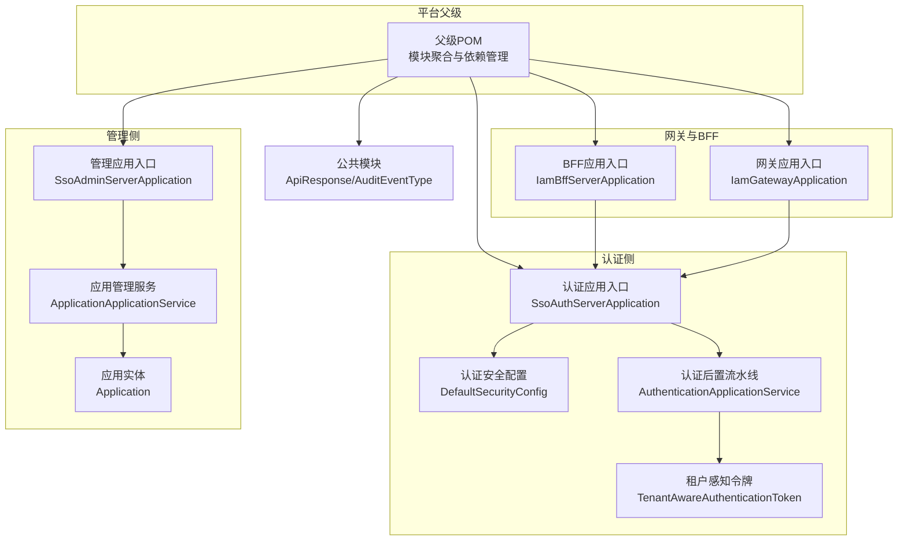
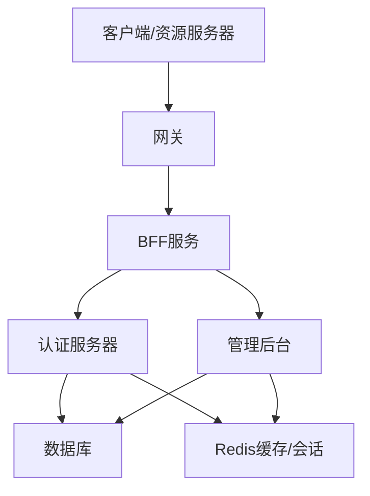
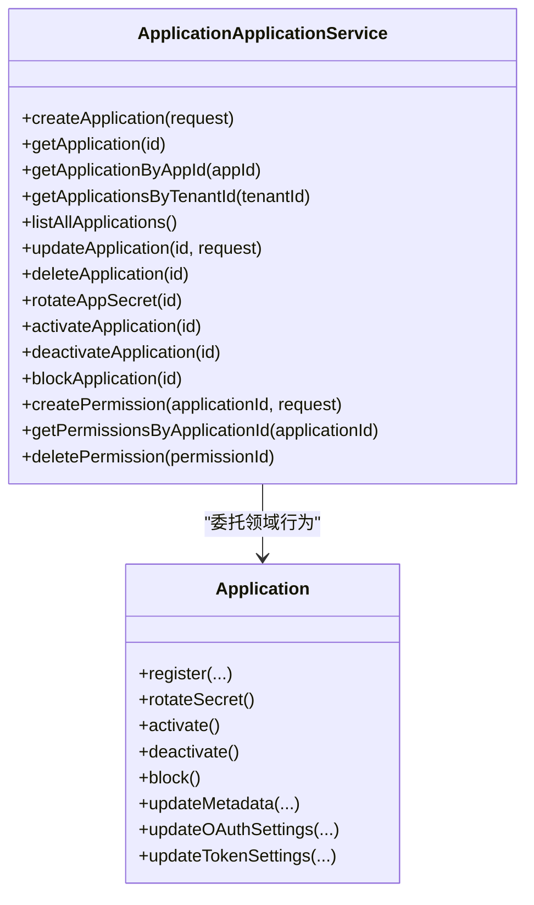
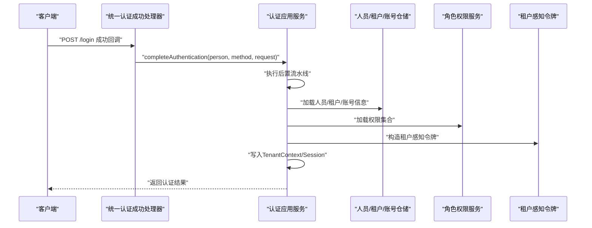
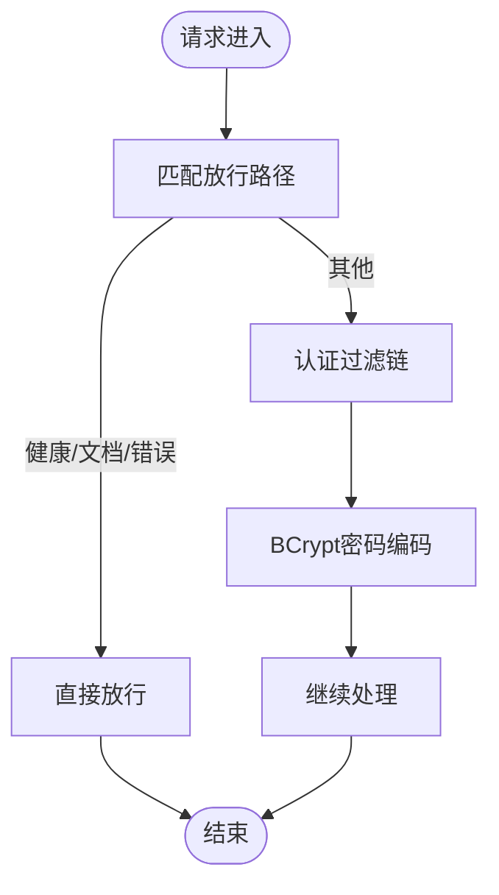
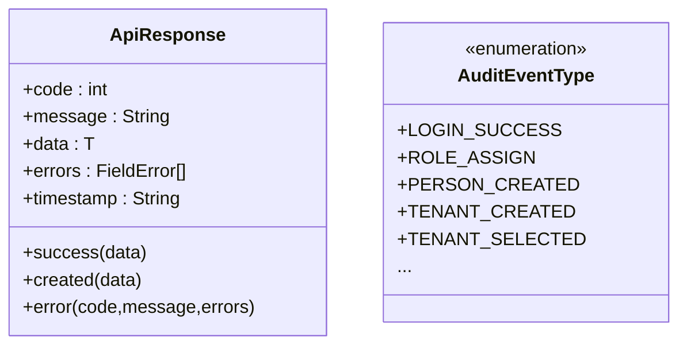
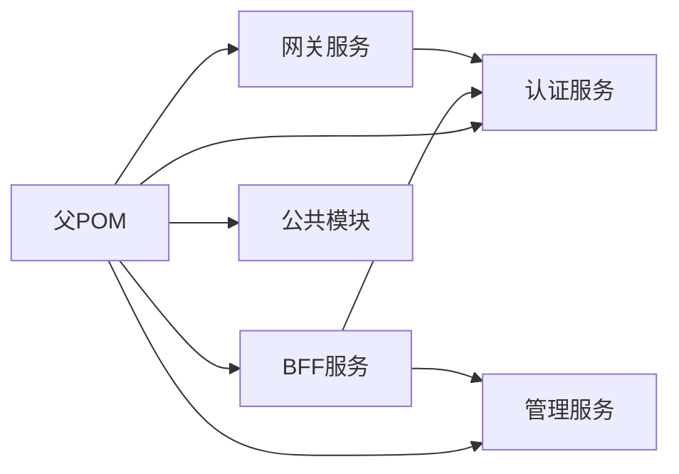

# 最佳实践

<cite>
**本文引用的文件**
- [README.md](file://README.md)
- [pom.xml](file://pom.xml)
- [SsoAdminServerApplication.java](file://iam-admin-server/src/main/java/iam/platform/admin/SsoAdminServerApplication.java)
- [SsoAuthServerApplication.java](file://iam-auth-server/src/main/java/iam/platform/auth/SsoAuthServerApplication.java)
- [IamBffServerApplication.java](file://iam-bff-server/src/main/java/iam/platform/bff/IamBffServerApplication.java)
- [IamGatewayApplication.java](file://iam-gateway/src/main/java/iam/platform/gateway/IamGatewayApplication.java)
- [Application.java](file://iam-admin-server/src/main/java/iam/platform/admin/domain/model/entity/Application.java)
- [ApplicationApplicationService.java](file://iam-admin-server/src/main/java/iam/platform/admin/application/service/ApplicationApplicationService.java)
- [AuthenticationApplicationService.java](file://iam-auth-server/src/main/java/iam/platform/auth/application/service/AuthenticationApplicationService.java)
- [ApiResponse.java](file://iam-common/src/main/java/iam/platform/common/api/ApiResponse.java)
- [AdminSecurityConfig.java](file://iam-admin-server/src/main/java/iam/platform/admin/infrastructure/config/AdminSecurityConfig.java)
- [DefaultSecurityConfig.java](file://iam-auth-server/src/main/java/iam/platform/auth/infrastructure/config/DefaultSecurityConfig.java)
- [TenantAwareAuthenticationToken.java](file://iam-auth-server/src/main/java/iam/platform/auth/infrastructure/security/TenantAwareAuthenticationToken.java)
- [AuditEventType.java](file://iam-common/src/main/java/iam/platform/common/model/enums/AuditEventType.java)
</cite>

## 目录
1. [简介](#简介)
2. [项目结构](#项目结构)
3. [核心组件](#核心组件)
4. [架构总览](#架构总览)
5. [详细组件分析](#详细组件分析)
6. [依赖分析](#依赖分析)
7. [性能考虑](#性能考虑)
8. [故障排查指南](#故障排查指南)
9. [结论](#结论)
10. [附录](#附录)

## 简介
本指南面向IAM平台的工程实践，围绕架构设计原则（分层架构、领域驱动设计、微服务拆分）、代码质量保障（代码评审、测试驱动、持续重构）、性能优化（数据库、缓存、异步与并发）、安全最佳实践（密码加密、令牌管理、输入校验、安全配置）、运维最佳实践（监控、日志、备份与灾备）、团队协作（规范、文档与知识分享）以及不同规模团队的实施建议与成熟度评估展开，并提供持续改进方法与衡量指标。

## 项目结构
本项目采用多模块聚合结构，结合Clean Architecture与领域驱动设计（DDD），在各子系统中清晰划分应用层、领域层、基础设施层与接口层。核心模块包括：
- iam-common：公共API、DTO、枚举与异常模型
- iam-auth-server：认证服务器（OIDC Provider、协议路由、统一认证）
- iam-admin-server：管理后台（RBAC、租户、应用与审计）
- iam-bff-server：前端网关（聚合与适配）
- iam-gateway：网关（服务发现与路由）

图表来源
- [pom.xml:21-27](file://pom.xml#L21-L27)
- [SsoAuthServerApplication.java:9-12](file://iam-auth-server/src/main/java/iam/platform/auth/SsoAuthServerApplication.java#L9-L12)
- [SsoAdminServerApplication.java:9-10](file://iam-admin-server/src/main/java/iam/platform/admin/SsoAdminServerApplication.java#L9-L10)
- [IamGatewayApplication.java:7-8](file://iam-gateway/src/main/java/iam/platform/gateway/IamGatewayApplication.java#L7-L8)
- [IamBffServerApplication.java:8-10](file://iam-bff-server/src/main/java/iam/platform/bff/IamBffServerApplication.java#L8-L10)

章节来源
- [README.md:95-108](file://README.md#L95-L108)
- [pom.xml:21-27](file://pom.xml#L21-L27)

## 核心组件
- 清晰的分层与职责边界：应用层负责用例编排与DTO装配；领域层封装业务规则与不变量；基础设施层提供持久化、安全与配置实现；接口层承载REST/Web控制器。
- 统一响应模型：公共模块提供统一的API响应包装，便于前后端一致处理。
- 安全配置：认证与管理侧分别提供安全过滤链与密码编码器，确保认证流程与会话策略符合要求。
- 多租户上下文：通过租户感知令牌与上下文管理，支撑多租户场景下的认证与权限选择。

章节来源
- [README.md:95-108](file://README.md#L95-L108)
- [ApiResponse.java:18-50](file://iam-common/src/main/java/iam/platform/common/api/ApiResponse.java#L18-L50)
- [AdminSecurityConfig.java:18-39](file://iam-admin-server/src/main/java/iam/platform/admin/infrastructure/config/AdminSecurityConfig.java#L18-L39)
- [DefaultSecurityConfig.java:35-94](file://iam-auth-server/src/main/java/iam/platform/auth/infrastructure/config/DefaultSecurityConfig.java#L35-L94)
- [TenantAwareAuthenticationToken.java:11-132](file://iam-auth-server/src/main/java/iam/platform/auth/infrastructure/security/TenantAwareAuthenticationToken.java#L11-L132)

## 架构总览
IAM平台采用“认证服务器 + 管理后台 + 网关/BFF”的微服务拆分，结合Clean Architecture与DDD：
- 认证服务器：统一OIDC Provider，支持多种协议适配与多租户上下文注入
- 管理后台：RBAC、组织与应用管理、审计事件
- 网关/BFF：对外聚合与适配，内部通过Feign调用认证与管理服务

图表来源
- [SsoAuthServerApplication.java:9-12](file://iam-auth-server/src/main/java/iam/platform/auth/SsoAuthServerApplication.java#L9-L12)
- [SsoAdminServerApplication.java:9-10](file://iam-admin-server/src/main/java/iam/platform/admin/SsoAdminServerApplication.java#L9-L10)
- [IamBffServerApplication.java:8-10](file://iam-bff-server/src/main/java/iam/platform/bff/IamBffServerApplication.java#L8-L10)
- [IamGatewayApplication.java:7-8](file://iam-gateway/src/main/java/iam/platform/gateway/IamGatewayApplication.java#L7-L8)

## 详细组件分析

### 应用管理服务（应用生命周期与权限）
该组件负责应用的注册、更新、状态变更、密钥轮换以及应用级权限的创建与查询。其核心遵循“领域工厂 + 领域行为 + 仓储保存”的模式，确保业务不变量由领域模型维护。

图表来源
- [Application.java:43-178](file://iam-admin-server/src/main/java/iam/platform/admin/domain/model/entity/Application.java#L43-L178)
- [ApplicationApplicationService.java:35-210](file://iam-admin-server/src/main/java/iam/platform/admin/application/service/ApplicationApplicationService.java#L35-L210)

章节来源
- [Application.java:43-178](file://iam-admin-server/src/main/java/iam/platform/admin/domain/model/entity/Application.java#L43-L178)
- [ApplicationApplicationService.java:35-210](file://iam-admin-server/src/main/java/iam/platform/admin/application/service/ApplicationApplicationService.java#L35-L210)

### 认证完成与租户选择（统一认证流水线）
该组件负责在认证完成后执行后置流水线、选择租户账户并建立完整的租户感知认证上下文，同时加载权限并写入会话。

图表来源
- [AuthenticationApplicationService.java:42-111](file://iam-auth-server/src/main/java/iam/platform/auth/application/service/AuthenticationApplicationService.java#L42-L111)
- [TenantAwareAuthenticationToken.java:50-130](file://iam-auth-server/src/main/java/iam/platform/auth/infrastructure/security/TenantAwareAuthenticationToken.java#L50-L130)

章节来源
- [AuthenticationApplicationService.java:42-111](file://iam-auth-server/src/main/java/iam/platform/auth/application/service/AuthenticationApplicationService.java#L42-L111)
- [TenantAwareAuthenticationToken.java:50-130](file://iam-auth-server/src/main/java/iam/platform/auth/infrastructure/security/TenantAwareAuthenticationToken.java#L50-L130)

### 安全配置与密码编码
- 认证侧：统一认证过滤器替代传统表单登录，集成OAuth2登录与多源认证提供者；会话策略为无状态，便于横向扩展。
- 管理侧：对特定公开端点放行，其余请求均需认证；使用BCrypt进行密码编码。

图表来源
- [DefaultSecurityConfig.java:39-62](file://iam-auth-server/src/main/java/iam/platform/auth/infrastructure/config/DefaultSecurityConfig.java#L39-L62)
- [AdminSecurityConfig.java:21-31](file://iam-admin-server/src/main/java/iam/platform/admin/infrastructure/config/AdminSecurityConfig.java#L21-L31)
- [DefaultSecurityConfig.java:90-94](file://iam-auth-server/src/main/java/iam/platform/auth/infrastructure/config/DefaultSecurityConfig.java#L90-L94)
- [AdminSecurityConfig.java:37-39](file://iam-admin-server/src/main/java/iam/platform/admin/infrastructure/config/AdminSecurityConfig.java#L37-L39)

章节来源
- [DefaultSecurityConfig.java:39-62](file://iam-auth-server/src/main/java/iam/platform/auth/infrastructure/config/DefaultSecurityConfig.java#L39-L62)
- [AdminSecurityConfig.java:21-31](file://iam-admin-server/src/main/java/iam/platform/admin/infrastructure/config/AdminSecurityConfig.java#L21-L31)
- [DefaultSecurityConfig.java:90-94](file://iam-auth-server/src/main/java/iam/platform/auth/infrastructure/config/DefaultSecurityConfig.java#L90-L94)
- [AdminSecurityConfig.java:37-39](file://iam-admin-server/src/main/java/iam/platform/admin/infrastructure/config/AdminSecurityConfig.java#L37-L39)

### 统一响应模型与审计事件
- 统一响应模型提供成功/创建/错误三类响应，包含时间戳与字段级错误信息，便于前端统一处理。
- 审计事件类型覆盖认证、授权、账户、管理、会话等类别，配合切面记录关键操作。

图表来源
- [ApiResponse.java:18-50](file://iam-common/src/main/java/iam/platform/common/api/ApiResponse.java#L18-L50)
- [AuditEventType.java:6-58](file://iam-common/src/main/java/iam/platform/common/model/enums/AuditEventType.java#L6-L58)

章节来源
- [ApiResponse.java:18-50](file://iam-common/src/main/java/iam/platform/common/api/ApiResponse.java#L18-L50)
- [AuditEventType.java:6-58](file://iam-common/src/main/java/iam/platform/common/model/enums/AuditEventType.java#L6-L58)

## 依赖分析
- 模块聚合：父POM统一管理Spring Cloud与Spring Cloud Alibaba版本，约束各子模块依赖一致性。
- 运行时特性：认证服务器启用Feign客户端以调用管理服务；BFF与网关启用服务发现与Feign，便于服务间通信。
- 安全与文档：引入OpenAPI/Springdoc用于API文档；OpenSAML用于SAML支持。

图表来源
- [pom.xml:43-122](file://pom.xml#L43-L122)
- [SsoAuthServerApplication.java:11-12](file://iam-auth-server/src/main/java/iam/platform/auth/SsoAuthServerApplication.java#L11-L12)
- [IamBffServerApplication.java:9-10](file://iam-bff-server/src/main/java/iam/platform/bff/IamBffServerApplication.java#L9-L10)
- [IamGatewayApplication.java:7-8](file://iam-gateway/src/main/java/iam/platform/gateway/IamGatewayApplication.java#L7-L8)

章节来源
- [pom.xml:43-122](file://pom.xml#L43-L122)
- [SsoAuthServerApplication.java:11-12](file://iam-auth-server/src/main/java/iam/platform/auth/SsoAuthServerApplication.java#L11-L12)
- [IamBffServerApplication.java:9-10](file://iam-bff-server/src/main/java/iam/platform/bff/IamBffServerApplication.java#L9-L10)
- [IamGatewayApplication.java:7-8](file://iam-gateway/src/main/java/iam/platform/gateway/IamGatewayApplication.java#L7-L8)

## 性能考虑
- 数据库查询优化
  - 合理使用仓储接口与JPA仓库，避免N+1查询；对高频查询建立必要索引（如按租户、应用ID、人员ID等）。
  - 使用分页与投影减少传输与内存占用。
- 缓存策略
  - 利用Redis缓存会话与热点数据（如OAuth客户端元数据、用户权限集），设置合理TTL与失效策略。
  - 对读多写少的数据采用缓存穿透防护与双写一致性策略。
- 异步处理
  - 审计事件与非关键副作用（如通知）采用异步或消息队列解耦，降低主流程延迟。
- 并发控制
  - 对关键写操作（应用密钥轮换、状态变更）使用乐观锁或分布式锁，避免竞态条件。
  - 在高并发登录场景下，结合速率限制与IP白名单策略，防止暴力破解。

## 故障排查指南
- 认证失败
  - 检查统一认证过滤器是否正确注入与顺序；确认密码编码器配置与凭证匹配。
- 租户上下文异常
  - 核对租户选择流程与会话写入逻辑；确保租户与账号处于激活状态。
- 审计日志缺失
  - 确认审计注解与切面生效；核对审计事件类型分类与存储实现。
- 统一响应不一致
  - 检查API响应包装是否在所有控制器中统一使用；关注错误字段与时间戳格式。

章节来源
- [DefaultSecurityConfig.java:35-94](file://iam-auth-server/src/main/java/iam/platform/auth/infrastructure/config/DefaultSecurityConfig.java#L35-L94)
- [AdminSecurityConfig.java:18-39](file://iam-admin-server/src/main/java/iam/platform/admin/infrastructure/config/AdminSecurityConfig.java#L18-L39)
- [TenantAwareAuthenticationToken.java:117-130](file://iam-auth-server/src/main/java/iam/platform/auth/infrastructure/security/TenantAwareAuthenticationToken.java#L117-L130)
- [AuditEventType.java:6-58](file://iam-common/src/main/java/iam/platform/common/model/enums/AuditEventType.java#L6-L58)
- [ApiResponse.java:18-50](file://iam-common/src/main/java/iam/platform/common/api/ApiResponse.java#L18-L50)

## 结论
本指南基于现有代码库提炼了IAM平台在架构、质量、性能、安全与运维方面的最佳实践。建议在落地过程中以Clean Architecture与DDD为指导，严格分层与职责分离；以统一响应与审计体系提升可观测性；以安全配置与密码/令牌策略保障系统安全；以缓存与异步处理优化性能；以团队协作规范与持续改进机制推动长期演进。

## 附录
- 团队协作最佳实践
  - 代码规范：方法长度与类长度上限、Lombok与MapStruct的使用、单元测试覆盖率目标。
  - Git工作流：采用Git Flow分支模型，明确从feature到master的发布路径。
  - 安全规范：密码BCrypt、Client Secret AES-256-GCM、JWT RS256、PKCE强制、Token生命周期。
- 不同规模团队的实施建议与成熟度评估
  - 小团队：优先完成Clean Architecture分层与DDD建模，建立统一响应与安全基线。
  - 中团队：完善测试金字塔、引入CI/CD与多环境配置，强化审计与监控。
  - 大团队：推进服务拆分与治理、引入容量规划与混沌工程、建立知识库与共享复盘机制。
- 持续改进方法与衡量指标
  - 指标：代码复杂度、静态扫描告警数、测试覆盖率、P95/P99延迟、错误率、审计事件完整性、安全合规检查通过率。
  - 方法：定期架构评审、技术债清单、发布后回顾、A/B实验与容量演练。

章节来源
- [README.md:110-146](file://README.md#L110-L146)
- [README.md:171-182](file://README.md#L171-L182)