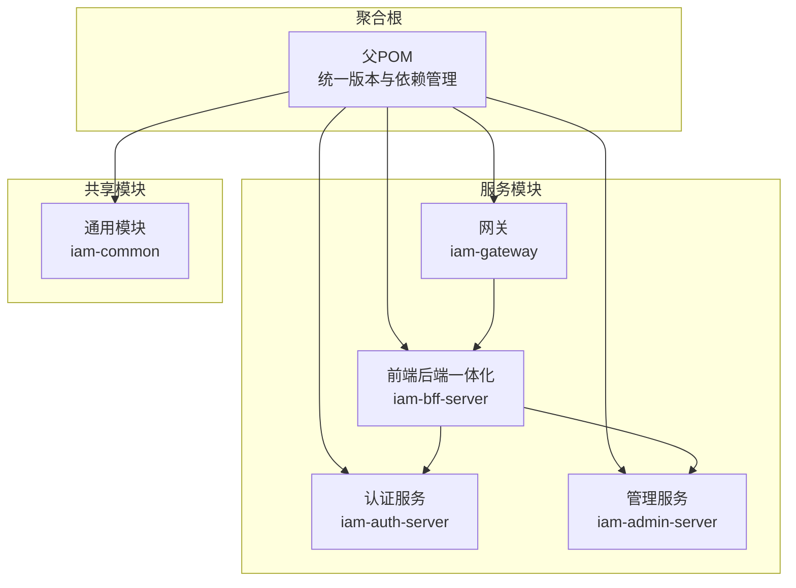
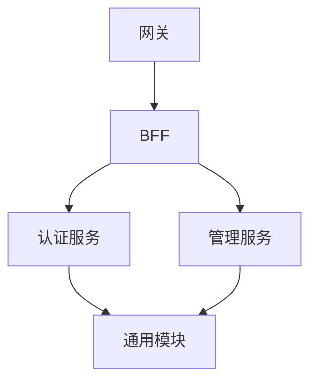
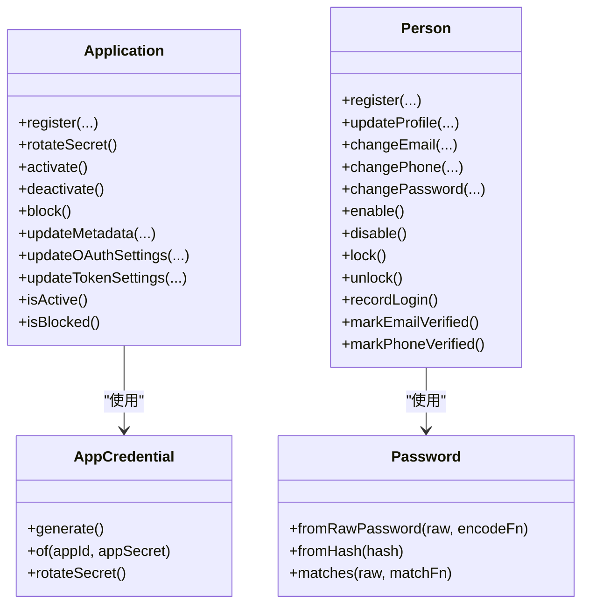
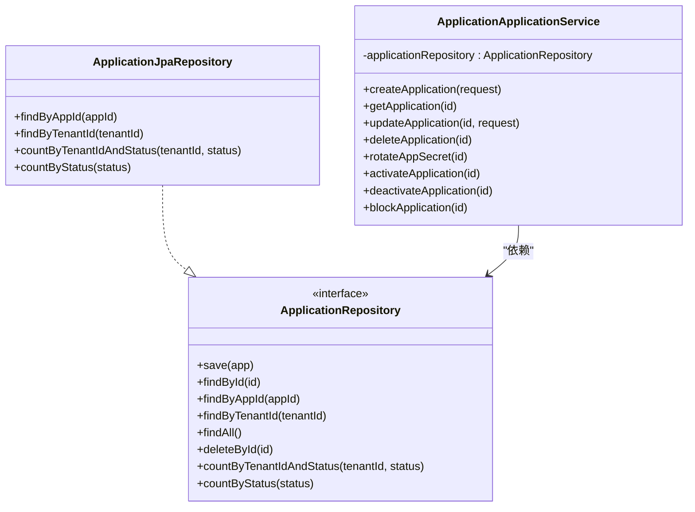
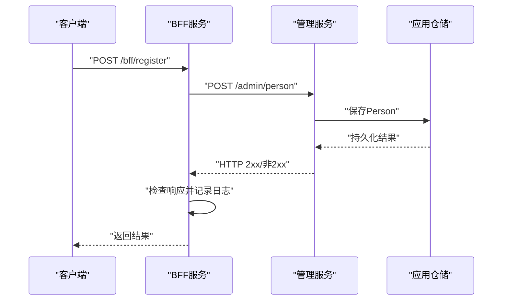
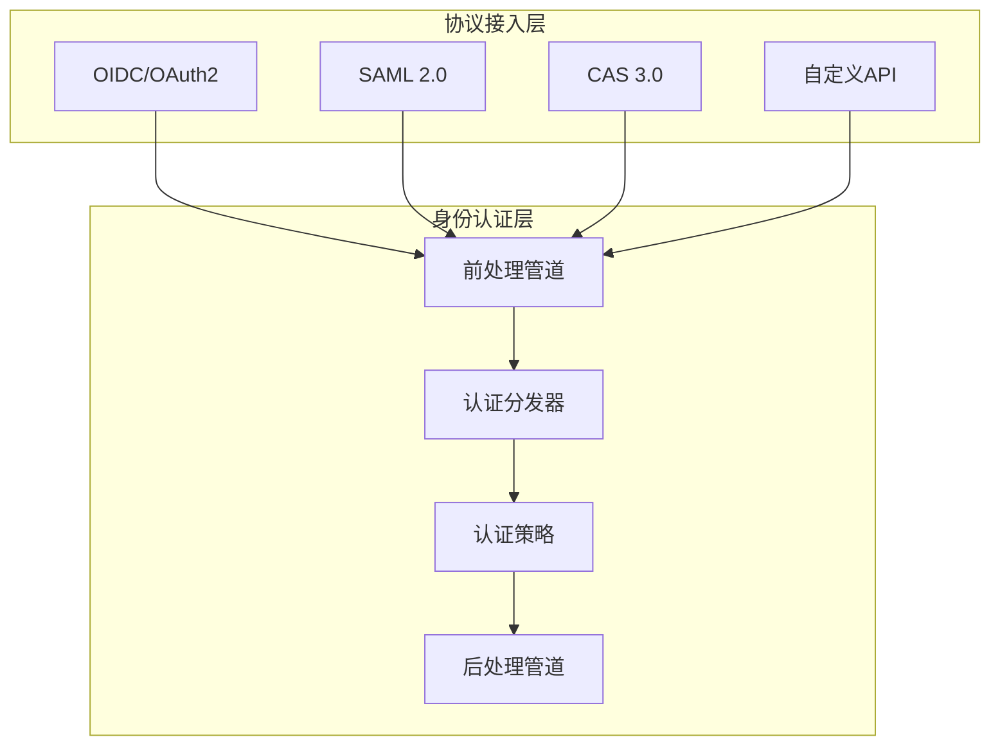
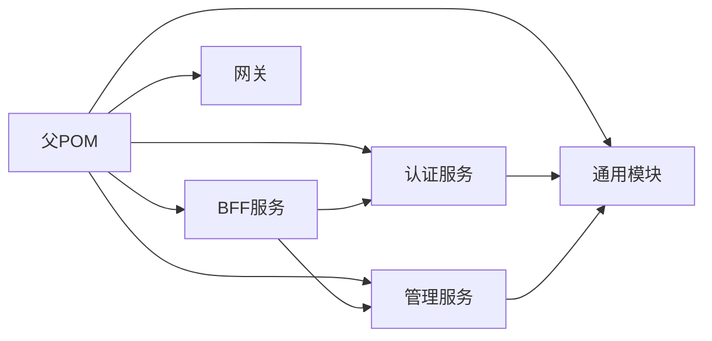

# 架构设计原则

<cite>
**本文引用的文件**
- [SsoAdminServerApplication.java](file://iam-admin-server/src/main/java/iam/platform/admin/SsoAdminServerApplication.java)
- [SsoAuthServerApplication.java](file://iam-auth-server/src/main/java/iam/platform/auth/SsoAuthServerApplication.java)
- [IamBffServerApplication.java](file://iam-bff-server/src/main/java/iam/platform/bff/IamBffServerApplication.java)
- [IamGatewayApplication.java](file://iam-gateway/src/main/java/iam/platform/gateway/IamGatewayApplication.java)
- [pom.xml](file://pom.xml)
- [Application.java](file://iam-admin-server/src/main/java/iam/platform/admin/domain/model/entity/Application.java)
- [ApplicationApplicationService.java](file://iam-admin-server/src/main/java/iam/platform/admin/application/service/ApplicationApplicationService.java)
- [ApplicationRepository.java](file://iam-admin-server/src/main/java/iam/platform/admin/domain/repository/ApplicationRepository.java)
- [ApplicationJpaRepository.java](file://iam-admin-server/src/main/java/iam/platform/admin/infrastructure/persistence/repository/ApplicationJpaRepository.java)
- [Person.java](file://iam-auth-server/src/main/java/iam/platform/auth/domain/model/entity/Person.java)
- [AuthenticationApplicationService.java](file://iam-auth-server/src/main/java/iam/platform/auth/application/service/AuthenticationApplicationService.java)
- [CreatePersonRequest.java](file://iam-common/src/main/java/iam/platform/common/dto/request/CreatePersonRequest.java)
- [BffRegistrationService.java](file://iam-bff-server/src/main/java/iam/platform/bff/application/service/BffRegistrationService.java)
- [AppCredential.java](file://iam-common/src/main/java/iam/platform/common/model/valueobject/AppCredential.java)
- [Password.java](file://iam-common/src/main/java/iam/platform/common/model/valueobject/Password.java)
- [统一认证框架.md](file://docs/design/统一认证框架.md)
- [Spring Authorization Server 原理与流程.md](file://docs/design/Spring Authorization Server 原理与流程.md)
- [第三方服务对接指南.md](file://docs/design/第三方服务对接指南.md)
</cite>

## 更新摘要
**变更内容**
- 重新组织架构文档结构，整合到现有的设计文档体系中
- 将Clean Architecture和DDD原则与统一认证框架文档相结合
- 更新架构总览图和组件分析，反映当前的多服务架构
- 补充Spring Authorization Server的详细实现说明

## 目录
1. [引言](#引言)
2. [项目结构](#项目结构)
3. [核心组件](#核心组件)
4. [架构总览](#架构总览)
5. [详细组件分析](#详细组件分析)
6. [依赖分析](#依赖分析)
7. [性能考虑](#性能考虑)
8. [故障排查指南](#故障排查指南)
9. [结论](#结论)
10. [附录](#附录)

## 引言
本文档基于IAM平台现有的设计文档，系统性阐述Clean Architecture与Domain-Driven Design（DDD）在本项目中的落地方式。项目采用"网关+BFF+多服务"的分层架构，通过统一认证框架实现身份认证与协议接入的分离，结合Clean Architecture的四层分界和DDD的领域建模原则，实现了高内聚、低耦合、可演进的IAM平台架构。

**更新** 本文件已整合到现有的架构文档体系中，重点参考了《统一认证框架.md》和《Spring Authorization Server原理与流程.md》等核心设计文档。

## 项目结构
本项目采用多模块聚合工程，通过父POM统一版本与依赖管理，子模块按职责划分为：通用模块、认证服务、管理服务、网关与BFF。各模块均遵循Clean Architecture分层：接口层、应用层、领域层、基础设施层。

**图示来源**
- [pom.xml:21-27](file://pom.xml#L21-L27)
- [SsoAdminServerApplication.java:8-11](file://iam-admin-server/src/main/java/iam/platform/admin/SsoAdminServerApplication.java#L8-L11)
- [SsoAuthServerApplication.java:9-12](file://iam-auth-server/src/main/java/iam/platform/auth/SsoAuthServerApplication.java#L9-L12)
- [IamBffServerApplication.java:8-10](file://iam-bff-server/src/main/java/iam/platform/bff/IamBffServerApplication.java#L8-L10)
- [IamGatewayApplication.java:7-8](file://iam-gateway/src/main/java/iam/platform/gateway/IamGatewayApplication.java#L7-L8)

**章节来源**
- [pom.xml:21-27](file://pom.xml#L21-L27)
- [pom.xml:43-122](file://pom.xml#L43-L122)

## 核心组件
- 清晰的分层职责
  - 接口层：REST控制器、Web控制器、客户端Feign接口等，负责请求接入与响应输出。
  - 应用层：应用服务编排业务流程，协调领域模型与仓储，保证事务边界与审计日志。
  - 领域层：实体、值对象、领域服务与工厂方法，封装业务规则与不变量。
  - 基础设施层：持久化实现、配置、安全过滤器、加密转换器等，屏蔽外部技术细节。
- 边界上下文
  - 认证上下文：围绕Person、Tenant、TenantAccount、权限加载与认证流水线。
  - 管理上下文：围绕Application、权限、组织、审计等管理能力。
  - BFF上下文：对前端暴露的聚合入口，编排跨服务调用。
- 微服务拆分
  - 以边界上下文为依据，服务粒度适中：认证与管理相对独立，BFF作为薄代理聚合调用，网关负责路由与鉴权前置。
- 接口与契约
  - DTO与响应模型集中于通用模块，避免循环依赖；Feign客户端在BFF中声明，契约清晰、版本化友好。

**章节来源**
- [SsoAdminServerApplication.java:8-11](file://iam-admin-server/src/main/java/iam/platform/admin/SsoAdminServerApplication.java#L8-L11)
- [SsoAuthServerApplication.java:9-12](file://iam-auth-server/src/main/java/iam/platform/auth/SsoAuthServerApplication.java#L9-L12)
- [IamBffServerApplication.java:8-10](file://iam-bff-server/src/main/java/iam/platform/bff/IamBffServerApplication.java#L8-L10)
- [IamGatewayApplication.java:7-8](file://iam-gateway/src/main/java/iam/platform/gateway/IamGatewayApplication.java#L7-L8)
- [CreatePersonRequest.java:15-36](file://iam-common/src/main/java/iam/platform/common/dto/request/CreatePersonRequest.java#L15-L36)

## 架构总览
IAM平台采用"网关+BFF+多服务"的分层与边界上下文架构。网关负责统一入口与安全前置，BFF聚合跨服务调用并面向前端，认证服务处理身份与会话，管理服务提供资源与权限管理，通用模块沉淀共享能力。

**图示来源**
- [IamGatewayApplication.java:7-8](file://iam-gateway/src/main/java/iam/platform/gateway/IamGatewayApplication.java#L7-L8)
- [IamBffServerApplication.java:8-10](file://iam-bff-server/src/main/java/iam/platform/bff/IamBffServerApplication.java#L8-L10)
- [SsoAuthServerApplication.java:9-12](file://iam-auth-server/src/main/java/iam/platform/auth/SsoAuthServerApplication.java#L9-L12)
- [SsoAdminServerApplication.java:8-11](file://iam-admin-server/src/main/java/iam/platform/admin/SsoAdminServerApplication.java#L8-L11)

## 详细组件分析

### 清洁架构与分层实践
- 分层边界与依赖方向
  - 接口层仅依赖应用层；应用层依赖领域层；领域层不依赖其他层；基础设施层实现仓储与工具，被应用层注入。
  - 示例：应用服务依赖领域实体与仓库接口，而不直接依赖JPA实现；BFF通过Feign客户端调用管理/认证服务，不直接访问数据库。
- 事务与审计
  - 应用服务使用事务注解包裹业务流程，配合审计注解记录关键事件，确保一致性与可追溯性。
- 依赖注入与装配
  - 启动类通过注解扫描配置与JPA仓库包，确保分层组件被容器管理。

**章节来源**
- [ApplicationApplicationService.java:35-62](file://iam-admin-server/src/main/java/iam/platform/admin/application/service/ApplicationApplicationService.java#L35-L62)
- [AuthenticationApplicationService.java:38-45](file://iam-auth-server/src/main/java/iam/platform/auth/application/service/AuthenticationApplicationService.java#L38-L45)
- [BffRegistrationService.java:23-29](file://iam-bff-server/src/main/java/iam/platform/bff/application/service/BffRegistrationService.java#L23-L29)
- [SsoAdminServerApplication.java:8-11](file://iam-admin-server/src/main/java/iam/platform/admin/SsoAdminServerApplication.java#L8-L11)
- [SsoAuthServerApplication.java:9-12](file://iam-auth-server/src/main/java/iam/platform/auth/SsoAuthServerApplication.java#L9-L12)

### 领域模型设计：实体与值对象
- 实体设计
  - Application：包含注册、状态生命周期、元数据与OAuth设置更新、密钥轮换等行为，体现"行为优先"的DDD思想。
  - Person：用户实体，封装注册、资料更新、凭证变更、账户启停与锁定解锁、登录记录与验证标记等行为。
- 值对象设计
  - AppCredential：封装appId/appSecret生成、轮换与校验，不可变且具备工厂方法，避免在领域外散落逻辑。
  - Password：封装密码策略校验与哈希匹配，通过函数式接口解耦编码器，降低跨模块耦合。
- 设计原则
  - 不变量保护：通过构造参数与工厂方法约束初始状态；行为方法内部更新状态并记录时间戳。
  - 工厂与行为分离：注册/创建由工厂或实体方法完成，应用服务只编排流程。

**图示来源**
- [Application.java:45-78](file://iam-admin-server/src/main/java/iam/platform/admin/domain/model/entity/Application.java#L45-L78)
- [Application.java:86-92](file://iam-admin-server/src/main/java/iam/platform/admin/domain/model/entity/Application.java#L86-L92)
- [Application.java:99-125](file://iam-admin-server/src/main/java/iam/platform/admin/domain/model/entity/Application.java#L99-L125)
- [Application.java:132-178](file://iam-admin-server/src/main/java/iam/platform/admin/domain/model/entity/Application.java#L132-L178)
- [Application.java:203-210](file://iam-admin-server/src/main/java/iam/platform/admin/domain/model/entity/Application.java#L203-L210)
- [Person.java:36-56](file://iam-auth-server/src/main/java/iam/platform/auth/domain/model/entity/Person.java#L36-L56)
- [Person.java:63-100](file://iam-auth-server/src/main/java/iam/platform/auth/domain/model/entity/Person.java#L63-L100)
- [Person.java:105-132](file://iam-auth-server/src/main/java/iam/platform/auth/domain/model/entity/Person.java#L105-L132)
- [Person.java:137-140](file://iam-auth-server/src/main/java/iam/platform/auth/domain/model/entity/Person.java#L137-L140)
- [AppCredential.java:31-36](file://iam-common/src/main/java/iam/platform/common/model/valueobject/AppCredential.java#L31-L36)
- [AppCredential.java:41-49](file://iam-common/src/main/java/iam/platform/common/model/valueobject/AppCredential.java#L41-L49)
- [AppCredential.java:56-60](file://iam-common/src/main/java/iam/platform/common/model/valueobject/AppCredential.java#L56-L60)
- [Password.java:37-41](file://iam-common/src/main/java/iam/platform/common/model/valueobject/Password.java#L37-L41)
- [Password.java:47-52](file://iam-common/src/main/java/iam/platform/common/model/valueobject/Password.java#L47-L52)
- [Password.java:60-65](file://iam-common/src/main/java/iam/platform/common/model/valueobject/Password.java#L60-L65)

**章节来源**
- [Application.java:1-211](file://iam-admin-server/src/main/java/iam/platform/admin/domain/model/entity/Application.java#L1-L211)
- [Person.java:1-158](file://iam-auth-server/src/main/java/iam/platform/auth/domain/model/entity/Person.java#L1-L158)
- [AppCredential.java:1-67](file://iam-common/src/main/java/iam/platform/common/model/valueobject/AppCredential.java#L1-L67)
- [Password.java:1-90](file://iam-common/src/main/java/iam/platform/common/model/valueobject/Password.java#L1-L90)

### 仓储接口与实现映射
- 仓储接口定义
  - ApplicationRepository：定义保存、查询、统计等抽象，隔离领域与持久化实现。
- 持久化实现
  - ApplicationJpaRepository：基于Spring Data JPA的实现，提供findByAppId、findByTenantId等查询方法。
- 映射与装配
  - 应用服务通过Repository接口编程，运行时由Spring容器注入具体实现，保证依赖倒置。

**图示来源**
- [ApplicationRepository.java:8-24](file://iam-admin-server/src/main/java/iam/platform/admin/domain/repository/ApplicationRepository.java#L8-L24)
- [ApplicationJpaRepository.java:9-17](file://iam-admin-server/src/main/java/iam/platform/admin/infrastructure/persistence/repository/ApplicationJpaRepository.java#L9-L17)
- [ApplicationApplicationService.java:32-33](file://iam-admin-server/src/main/java/iam/platform/admin/application/service/ApplicationApplicationService.java#L32-L33)

**章节来源**
- [ApplicationRepository.java:1-25](file://iam-admin-server/src/main/java/iam/platform/admin/domain/repository/ApplicationRepository.java#L1-L25)
- [ApplicationJpaRepository.java:1-18](file://iam-admin-server/src/main/java/iam/platform/admin/infrastructure/persistence/repository/ApplicationJpaRepository.java#L1-L18)
- [ApplicationApplicationService.java:1-255](file://iam-admin-server/src/main/java/iam/platform/admin/application/service/ApplicationApplicationService.java#L1-L255)

### 应用服务编排与认证流水线
- 应用服务编排
  - ApplicationApplicationService：以事务包裹业务流程，调用领域实体的行为方法，再持久化；同时负责DTO转换与审计日志。
- 认证流水线
  - AuthenticationApplicationService：完成认证后的后续处理（如权限加载、上下文建立、会话存储），并支持租户选择与权限注入。
- BFF编排
  - BffRegistrationService：通过Feign客户端调用管理服务创建人员，集中错误处理与日志。

**图示来源**
- [BffRegistrationService.java:23-29](file://iam-bff-server/src/main/java/iam/platform/bff/application/service/BffRegistrationService.java#L23-L29)
- [ApplicationApplicationService.java:37-62](file://iam-admin-server/src/main/java/iam/platform/admin/application/service/ApplicationApplicationService.java#L37-L62)

**章节来源**
- [ApplicationApplicationService.java:1-255](file://iam-admin-server/src/main/java/iam/platform/admin/application/service/ApplicationApplicationService.java#L1-L255)
- [AuthenticationApplicationService.java:1-139](file://iam-auth-server/src/main/java/iam/platform/auth/application/service/AuthenticationApplicationService.java#L1-L139)
- [BffRegistrationService.java:1-31](file://iam-bff-server/src/main/java/iam/platform/bff/application/service/BffRegistrationService.java#L1-L31)

### DDD边界上下文划分策略
- 认证上下文
  - 关注身份、租户、会话与权限加载，实体与行为集中在auth模块，避免与管理上下文耦合。
- 管理上下文
  - 关注应用、权限、组织、审计等管理能力，实体与行为集中在admin模块。
- BFF上下文
  - 聚合前后端交互，对外暴露简洁契约，内部编排跨服务调用。
- 上下文映射
  - 通过Feign客户端与DTO契约连接不同上下文，避免直接依赖实现细节。

**章节来源**
- [AuthenticationApplicationService.java:38-45](file://iam-auth-server/src/main/java/iam/platform/auth/application/service/AuthenticationApplicationService.java#L38-L45)
- [BffRegistrationService.java:18-29](file://iam-bff-server/src/main/java/iam/platform/bff/application/service/BffRegistrationService.java#L18-L29)

### 微服务拆分的平衡艺术
- 粒度控制
  - 认证与管理拆分为独立服务，便于独立扩展与演进；BFF薄代理聚合调用，减少前端直连复杂度。
- 接口设计原则
  - DTO集中于通用模块，避免循环依赖；控制器仅做参数校验与转发。
- 契约管理
  - 通过Feign客户端与OpenAPI文档约定契约，版本化管理接口变更。

**章节来源**
- [CreatePersonRequest.java:15-36](file://iam-common/src/main/java/iam/platform/common/dto/request/CreatePersonRequest.java#L15-L36)
- [SsoAuthServerApplication.java:11-12](file://iam-auth-server/src/main/java/iam/platform/auth/SsoAuthServerApplication.java#L11-L12)
- [SsoAdminServerApplication.java:10](file://iam-admin-server/src/main/java/iam/platform/admin/SsoAdminServerApplication.java#L10)

### 统一认证框架与协议接入
基于《统一认证框架.md》的设计，IAM平台实现了两层抽象架构：
- **身份认证层（Authentication Layer）**：解决"如何证明用户身份"的问题，支持密码、验证码、社交登录、LDAP等多种认证方式
- **协议接入层（Protocol Layer）**：解决"应用如何对接 SSO"的问题，支持OIDC/OAuth2、SAML、CAS等协议

**图示来源**
- [统一认证框架.md:16-93](file://docs/design/统一认证框架.md#L16-L93)

**章节来源**
- [统一认证框架.md:14-233](file://docs/design/统一认证框架.md#L14-L233)

## 依赖分析
- 父POM统一管理Spring Cloud与Spring Cloud Alibaba版本，确保模块间兼容性。
- 模块间依赖方向清晰：BFF依赖管理与认证服务；通用模块被所有服务复用；网关依赖发现与安全配置。

**图示来源**
- [pom.xml:43-122](file://pom.xml#L43-L122)
- [pom.xml:63-68](file://pom.xml#L63-L68)

**章节来源**
- [pom.xml:1-226](file://pom.xml#L1-L226)

## 性能考虑
- 仓储查询优化
  - 在仓储接口中提供必要的查询方法，避免在应用服务中进行复杂聚合；必要时引入投影查询或缓存。
- 事务边界
  - 将业务操作置于最小事务范围内，避免长事务阻塞；批量写入时考虑分批提交。
- 安全与加密
  - 密码哈希与敏感字段加密在值对象与基础设施层实现，避免重复计算与泄露风险。
- 并发与限流
  - 在认证流水线中集成限流与速率限制，防止暴力破解与流量洪峰。
- 水平扩展
  - 基于Redis的Session存储支持水平扩展，确保无状态部署。

**章节来源**
- [Spring Authorization Server 原理与流程.md:160-222](file://docs/design/Spring Authorization Server 原理与流程.md#L160-L222)

## 故障排查指南
- 常见问题定位
  - 应用服务异常：检查事务注解是否覆盖完整流程，确认审计日志是否记录关键事件。
  - 仓储访问异常：核对JPA包扫描与@EnableJpaRepositories配置，确保实现类位于指定包。
  - BFF调用失败：检查Feign客户端返回码与超时配置，集中处理非2xx响应。
- 错误处理策略
  - 使用统一异常与响应模型，避免泄露内部错误细节；对业务异常与系统异常进行区分。
- 日志与追踪
  - 在应用服务与安全过滤器中增加关键节点日志，便于问题回溯。
- 认证流程排查
  - 基于《Spring Authorization Server原理与流程.md》中的流程图进行逐环节排查。

**章节来源**
- [ApplicationApplicationService.java:35-62](file://iam-admin-server/src/main/java/iam/platform/admin/application/service/ApplicationApplicationService.java#L35-L62)
- [SsoAdminServerApplication.java:10](file://iam-admin-server/src/main/java/iam/platform/admin/SsoAdminServerApplication.java#L10)
- [BffRegistrationService.java:26-28](file://iam-bff-server/src/main/java/iam/platform/bff/application/service/BffRegistrationService.java#L26-L28)

## 结论
本项目以Clean Architecture与DDD为核心指导，通过清晰的分层、稳定的边界上下文、规范的仓储与值对象设计，以及以应用服务为中心的编排模式，实现了高内聚、低耦合、可演进的IAM平台架构。结合《统一认证框架.md》的两层抽象设计，项目在认证与协议接入方面实现了高度解耦，支持多种认证方式与协议的灵活组合。建议在后续迭代中持续完善契约管理、监控告警与自动化测试，确保架构守卫机制有效运行。

## 附录
- 团队规模与架构决策评估
  - 小团队：优先保证单体可演进性与快速交付，逐步拆分边界上下文，避免过度设计。
  - 中团队：明确模块边界与负责人，强化契约与测试，引入CI/CD与可观测性。
  - 大团队：细化上下文划分与发布节奏，加强跨团队协作与接口治理。
- 最佳实践清单
  - 以领域模型为中心，行为优先；仓储接口隔离实现细节。
  - 应用服务编排业务流程，事务与审计同框；DTO集中管理。
  - 通过Feign与OpenAPI管理契约，版本化演进；统一异常与日志。
  - 持续进行技术债识别与重构，保持架构守卫与质量红线。
  - 基于《统一认证框架.md》实现认证与协议的解耦设计。
  - 参考《Spring Authorization Server原理与流程.md》确保认证流程的正确实现。