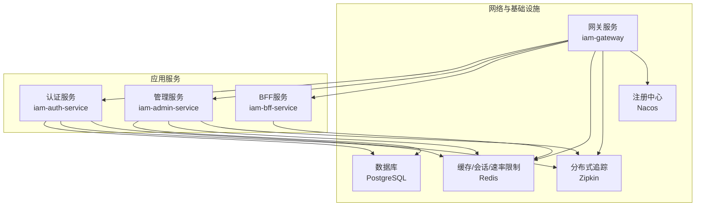
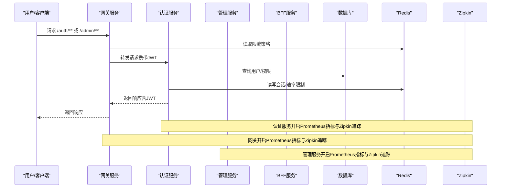
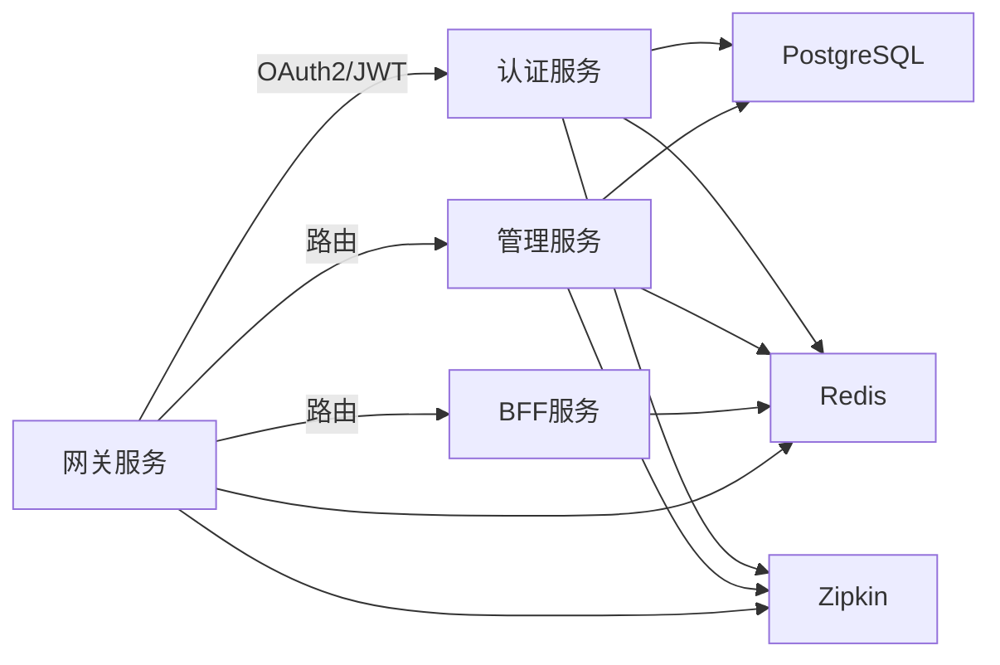

# 运维最佳实践

<cite>
**本文引用的文件**
- [README.md](file://README.md)
- [docs/index.md](file://docs/index.md)
- [ssl/README.md](file://ssl/README.md)
- [docker-compose.yml](file://docker-compose.yml)
- [iam-auth-server/src/main/resources/application.yml](file://iam-auth-server/src/main/resources/application.yml)
- [iam-auth-server/src/main/resources/application-dev.yml](file://iam-auth-server/src/main/resources/application-dev.yml)
- [iam-admin-server/src/main/resources/application.yml](file://iam-admin-server/src/main/resources/application.yml)
- [iam-admin-server/src/main/resources/application-dev.yml](file://iam-admin-server/src/main/resources/application-dev.yml)
- [iam-bff-server/src/main/resources/application.yml](file://iam-bff-server/src/main/resources/application.yml)
- [iam-bff-server/src/main/resources/application-dev.yml](file://iam-bff-server/src/main/resources/application-dev.yml)
- [iam-gateway/src/main/resources/application.yml](file://iam-gateway/src/main/resources/application.yml)
- [iam-gateway/src/main/resources/application-dev.yml](file://iam-gateway/src/main/resources/application-dev.yml)
- [iam-gateway/pom.xml](file://iam-gateway/pom.xml)
- [docs/archived/k8s/ARCHIVE_NOTICE.md](file://docs/archived/k8s/ARCHIVE_NOTICE.md)
- [docs/archived/k8s/k8s/base/secret.yaml](file://docs/archived/k8s/k8s/base/secret.yaml)
- [docs/archived/k8s/k8s/overlays/dev/dev-manifest.yaml](file://docs/archived/k8s/k8s/overlays/dev/dev-manifest.yaml)
</cite>

## 目录
1. [简介](#简介)
2. [项目结构](#项目结构)
3. [核心组件](#核心组件)
4. [架构总览](#架构总览)
5. [详细组件分析](#详细组件分析)
6. [依赖关系分析](#依赖关系分析)
7. [性能考量](#性能考量)
8. [故障排查指南](#故障排查指南)
9. [结论](#结论)
10. [附录](#附录)

## 简介
本指南面向IAM平台的运维团队，围绕监控体系、日志管理、备份策略、容器化部署、环境管理、故障排查以及容量规划与扩容等方面，结合仓库中现有的配置与文档，给出可落地的运维最佳实践。平台采用多模块微服务架构，包含认证服务、网关、管理服务与BFF服务，并通过Docker Compose进行本地与开发环境的编排。

## 项目结构
- 平台由四个主要服务组成：认证服务、网关、管理服务、BFF服务；另有公共模块与文档。
- 服务间通过Redis进行会话与速率限制共享，PostgreSQL存储业务数据，Zipkin用于分布式追踪。
- 当前采用Docker直连部署与Docker Compose编排，Kubernetes配置已归档。

图表来源
- [docker-compose.yml:1-190](file://docker-compose.yml#L1-L190)
- [iam-gateway/src/main/resources/application.yml:1-116](file://iam-gateway/src/main/resources/application.yml#L1-L116)
- [iam-auth-server/src/main/resources/application.yml:1-144](file://iam-auth-server/src/main/resources/application.yml#L1-L144)
- [iam-admin-server/src/main/resources/application.yml:1-102](file://iam-admin-server/src/main/resources/application.yml#L1-L102)
- [iam-bff-server/src/main/resources/application.yml:1-54](file://iam-bff-server/src/main/resources/application.yml#L1-L54)

章节来源
- [README.md:95-108](file://README.md#L95-L108)
- [docs/index.md:1-244](file://docs/index.md#L1-L244)
- [docker-compose.yml:1-190](file://docker-compose.yml#L1-L190)

## 核心组件
- 认证服务（OIDC Provider）：负责OAuth2/OIDC授权、会话存储、JWT签发、速率限制与账户锁定策略等。
- 网关服务：统一入口，提供路由、跨域、请求限流（基于Redis）、资源服务器校验。
- 管理服务：后台管理与审计日志、异步处理与会话存储。
- BFF服务：前端后端聚合，提供模板渲染与Feign调用。
- 基础设施：PostgreSQL、Redis、Zipkin、Nacos（已归档，当前使用Docker直连）。

章节来源
- [iam-auth-server/src/main/resources/application.yml:1-144](file://iam-auth-server/src/main/resources/application.yml#L1-L144)
- [iam-gateway/src/main/resources/application.yml:1-116](file://iam-gateway/src/main/resources/application.yml#L1-L116)
- [iam-admin-server/src/main/resources/application.yml:1-102](file://iam-admin-server/src/main/resources/application.yml#L1-L102)
- [iam-bff-server/src/main/resources/application.yml:1-54](file://iam-bff-server/src/main/resources/application.yml#L1-L54)
- [docker-compose.yml:1-190](file://docker-compose.yml#L1-L190)

## 架构总览
下图展示服务间的调用链路与运维关注点（健康检查、指标暴露、追踪采样、限流与会话）：

图表来源
- [iam-gateway/src/main/resources/application.yml:18-54](file://iam-gateway/src/main/resources/application.yml#L18-L54)
- [iam-auth-server/src/main/resources/application.yml:128-144](file://iam-auth-server/src/main/resources/application.yml#L128-L144)
- [iam-admin-server/src/main/resources/application.yml:76-92](file://iam-admin-server/src/main/resources/application.yml#L76-L92)
- [iam-bff-server/src/main/resources/application.yml:33-49](file://iam-bff-server/src/main/resources/application.yml#L33-L49)

## 详细组件分析

### 监控体系建设
- 指标暴露
  - 认证服务：Actuator暴露health、info、metrics、prometheus。
  - 网关服务：Actuator暴露gateway与prometheus。
  - 管理服务：Actuator暴露health、info、metrics、prometheus。
  - BFF服务：Actuator暴露health、info、metrics、prometheus。
- 采样与追踪
  - 所有服务均配置Zipkin与Tracing，采样概率为1.0，便于全链路观测。
- 健康检查
  - Docker Compose中为各服务配置了健康检查与启动探测，确保容器就绪后再对外提供服务。
- 建议的监控指标
  - 响应时间与错误率（按路径/端点维度）。
  - 数据库连接池使用率与慢查询。
  - Redis命中率与键空间大小。
  - 网关路由命中与限流触发次数。
  - 认证/授权成功率与失败原因分布。
- 告警规则建议
  - 健康检查连续失败阈值。
  - P95/P99延迟超过阈值。
  - 错误率超过阈值。
  - 数据库连接池空闲/最大连接数异常。
  - Redis内存使用率与淘汰事件。
  - 网关限流触发频率异常。
- 仪表板设计
  - 顶部指标：实例总数、在线实例、错误率、平均响应时间。
  - 分区视图：按服务/路径/状态码拆分。
  - 追踪拓扑：调用链时序与关键节点耗时。

章节来源
- [iam-auth-server/src/main/resources/application.yml:128-144](file://iam-auth-server/src/main/resources/application.yml#L128-L144)
- [iam-gateway/src/main/resources/application.yml:93-109](file://iam-gateway/src/main/resources/application.yml#L93-L109)
- [iam-admin-server/src/main/resources/application.yml:76-92](file://iam-admin-server/src/main/resources/application.yml#L76-L92)
- [iam-bff-server/src/main/resources/application.yml:33-49](file://iam-bff-server/src/main/resources/application.yml#L33-L49)
- [docker-compose.yml:17-41](file://docker-compose.yml#L17-L41)

### 日志管理标准化
- 日志级别
  - 开发环境：认证/网关/BFF服务开启DEBUG/TRACE以辅助定位问题；生产环境建议回归INFO级别。
  - 管理服务：审计日志异步处理，线程池与队列容量可调。
- 日志轮转
  - 建议在容器运行时使用日志驱动自带轮转（如json-file/driver），或在宿主机侧使用logrotate。
- 日志分析
  - 建议集中采集（如Filebeat/Fluent Bit）+ 存储（如ELK/EFK）+ 可视化（Kibana/Grafana Loki）。
  - 关键字段：traceId/spanId、服务名、端点、状态码、耗时、用户标识、IP、错误堆栈。
- 日志安全
  - 避免输出明文密码与密钥；敏感字段脱敏。

章节来源
- [iam-auth-server/src/main/resources/application-dev.yml:28-34](file://iam-auth-server/src/main/resources/application-dev.yml#L28-L34)
- [iam-gateway/src/main/resources/application-dev.yml:1-22](file://iam-gateway/src/main/resources/application-dev.yml#L1-L22)
- [iam-bff-server/src/main/resources/application-dev.yml:1-10](file://iam-bff-server/src/main/resources/application-dev.yml#L1-L10)
- [iam-admin-server/src/main/resources/application.yml:93-102](file://iam-admin-server/src/main/resources/application.yml#L93-L102)

### 备份策略与灾难恢复
- 数据库备份
  - 使用PostgreSQL的逻辑备份（如pg_dump/pg_restore）或物理备份策略，定期校验与异地存放。
- 配置文件备份
  - 将Docker Compose与各服务的环境变量/密钥文件纳入版本控制（仅公开证书），私钥与密钥通过安全渠道管理。
- 容灾演练
  - 定期进行RTO/RPO演练，验证备份恢复流程与数据一致性。
- 历史K8s密钥参考
  - 归档的K8s Secret示例可用于理解密钥管理思路（生产环境务必使用更安全的密管系统）。

章节来源
- [docker-compose.yml:23-41](file://docker-compose.yml#L23-L41)
- [docs/archived/k8s/k8s/base/secret.yaml:1-10](file://docs/archived/k8s/k8s/base/secret.yaml#L1-L10)

### 容器化部署最佳实践
- 镜像优化
  - 使用多阶段构建减少镜像体积；固定基础镜像版本；最小化安装包。
- 编排与编排
  - 使用Docker Compose进行本地与开发环境编排；生产环境建议使用编排平台（如Swarm/K8s）。
- 滚动更新
  - 设置合理的副本数与滚动窗口；结合健康检查与就绪探针，确保零停机。
- 环境隔离
  - 通过Profile与环境变量区分dev/test/canary/prod；敏感配置通过Secret/密钥管理服务注入。

章节来源
- [README.md:147-158](file://README.md#L147-L158)
- [docker-compose.yml:1-190](file://docker-compose.yml#L1-L190)
- [docs/archived/k8s/ARCHIVE_NOTICE.md:1-30](file://docs/archived/k8s/ARCHIVE_NOTICE.md#L1-L30)

### 环境管理规范
- 多环境配置
  - 通过Spring Profile与环境变量实现配置隔离；不同环境的端口、数据库、Redis、Zipkin等参数分离。
- 版本管理
  - 使用语义化版本；镜像标签与版本号一致；发布前进行兼容性测试。
- 发布流程
  - CI流水线：构建→测试→打包→推送镜像→编排更新→健康检查→回滚策略。
- 证书与安全
  - 使用脚本或环境变量启用HTTPS；生产环境使用正式CA证书与密钥轮换。

章节来源
- [README.md:147-158](file://README.md#L147-L158)
- [ssl/README.md:1-386](file://ssl/README.md#L1-L386)

### 故障排查系统方法
- 问题定位
  - 从网关开始，逐步定位到具体服务；结合Zipkin查看调用链；利用Actuator健康与指标端点判断异常。
- 根因分析
  - 关注错误率、延迟、连接池与Redis命中率；核对鉴权/授权失败日志与审计事件。
- 预防措施
  - 建立告警阈值基线；定期压测与容量评估；完善变更评审与回滚预案。

章节来源
- [iam-gateway/src/main/resources/application.yml:93-109](file://iam-gateway/src/main/resources/application.yml#L93-L109)
- [iam-auth-server/src/main/resources/application.yml:128-144](file://iam-auth-server/src/main/resources/application.yml#L128-L144)
- [iam-admin-server/src/main/resources/application.yml:76-92](file://iam-admin-server/src/main/resources/application.yml#L76-L92)
- [iam-bff-server/src/main/resources/application.yml:33-49](file://iam-bff-server/src/main/resources/application.yml#L33-L49)

### 容量规划与扩容策略
- 性能基准测试
  - 使用压测工具模拟并发登录/授权/资源访问，记录延迟、吞吐与错误率。
- 自动扩缩容
  - 基于CPU/内存/请求速率/队列长度设置HPA；结合服务特性选择合适指标。
- 资源预留
  - 为数据库与Redis设置合理上限与超时参数，避免雪崩效应。

章节来源
- [iam-gateway/pom.xml:66-80](file://iam-gateway/pom.xml#L66-L80)
- [iam-auth-server/src/main/resources/application.yml:19-24](file://iam-auth-server/src/main/resources/application.yml#L19-L24)
- [iam-admin-server/src/main/resources/application.yml:19-24](file://iam-admin-server/src/main/resources/application.yml#L19-L24)

## 依赖关系分析
- 网关依赖
  - OAuth2客户端、资源服务器、Redis响应式数据访问、Actuator、Prometheus、Zipkin。
- 服务间依赖
  - 认证/管理/BFF均依赖PostgreSQL与Redis；认证服务提供OIDC元数据与JWT；网关进行路由与限流。

图表来源
- [iam-gateway/pom.xml:37-80](file://iam-gateway/pom.xml#L37-L80)
- [iam-gateway/src/main/resources/application.yml:1-116](file://iam-gateway/src/main/resources/application.yml#L1-L116)
- [iam-auth-server/src/main/resources/application.yml:1-144](file://iam-auth-server/src/main/resources/application.yml#L1-L144)
- [iam-admin-server/src/main/resources/application.yml:1-102](file://iam-admin-server/src/main/resources/application.yml#L1-L102)
- [iam-bff-server/src/main/resources/application.yml:1-54](file://iam-bff-server/src/main/resources/application.yml#L1-L54)

## 性能考量
- 连接池与超时
  - HikariCP连接池参数需根据QPS与数据库性能调优；设置合理的连接超时与空闲回收。
- 缓存与会话
  - Redis作为会话存储与速率限制共享，需关注内存与命中率；必要时引入多级缓存。
- 网关限流
  - 基于Redis的令牌桶限流策略需结合业务峰值流量调整补充速率与突发容量。
- 指标与追踪
  - 启用Prometheus与Zipkin有助于识别瓶颈与异常路径。

章节来源
- [iam-auth-server/src/main/resources/application.yml:19-24](file://iam-auth-server/src/main/resources/application.yml#L19-L24)
- [iam-gateway/src/main/resources/application.yml:25-41](file://iam-gateway/src/main/resources/application.yml#L25-L41)
- [iam-admin-server/src/main/resources/application.yml:19-24](file://iam-admin-server/src/main/resources/application.yml#L19-L24)

## 故障排查指南
- 健康检查失败
  - 检查容器健康探针与启动探针配置；确认数据库/Redis可达。
- 认证失败
  - 核对OIDC Issuer配置、JWK公钥加载、客户端凭据与作用域。
- 网关路由异常
  - 检查路由规则、跨域配置与限流参数；确认目标服务端口与健康状态。
- 日志与追踪
  - 通过日志与Zipkin定位异常请求；结合指标观察异常时段的资源使用情况。

章节来源
- [docker-compose.yml:17-41](file://docker-compose.yml#L17-L41)
- [ssl/README.md:306-361](file://ssl/README.md#L306-L361)
- [iam-gateway/src/main/resources/application.yml:55-68](file://iam-gateway/src/main/resources/application.yml#L55-L68)

## 结论
本指南基于仓库现有配置与文档，给出了IAM平台运维的系统化实践建议。建议在生产环境中进一步完善监控告警、日志分析、备份与灾备、密钥管理与合规审计，并持续进行容量评估与压测，确保系统高可用与可运维性。

## 附录
- 证书与HTTPS启用
  - 使用脚本或环境变量启用HTTPS；生产环境使用正式CA证书与密钥轮换。
- 历史K8s配置
  - 归档说明表明项目已迁移至Docker直连与Compose编排，如需恢复K8s支持需从归档恢复并更新脚本与文档。

章节来源
- [ssl/README.md:1-386](file://ssl/README.md#L1-L386)
- [docs/archived/k8s/ARCHIVE_NOTICE.md:1-30](file://docs/archived/k8s/ARCHIVE_NOTICE.md#L1-L30)