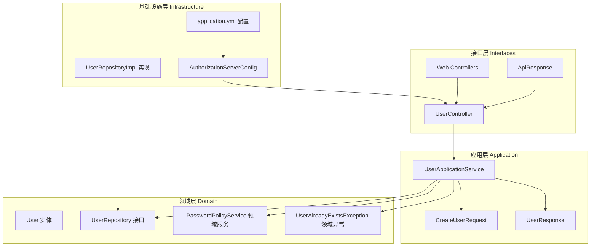
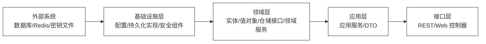
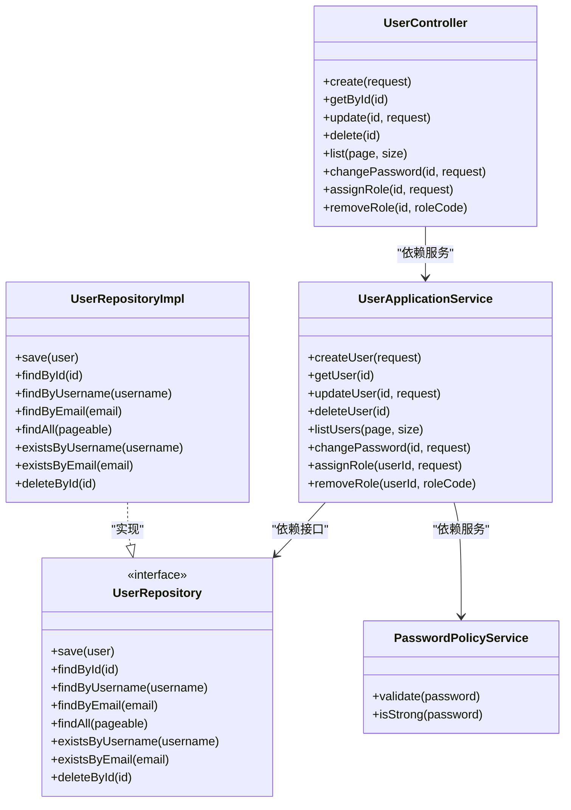
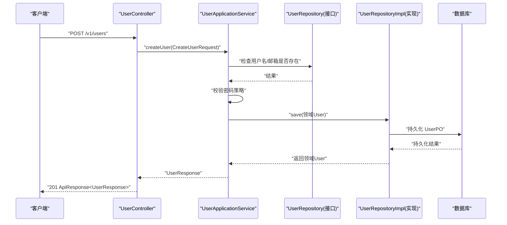
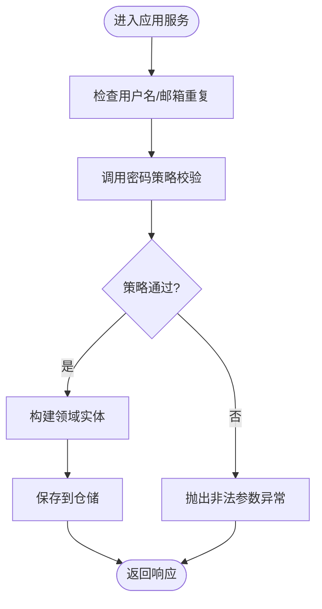
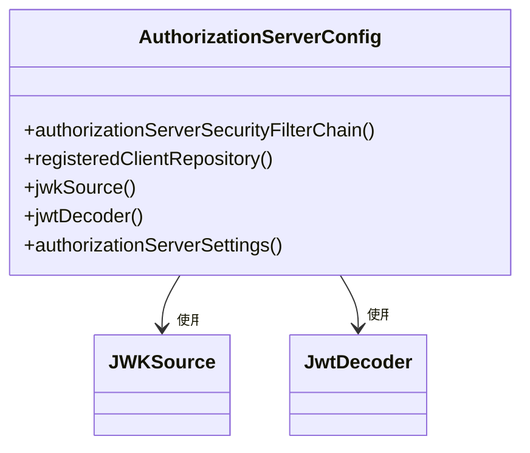
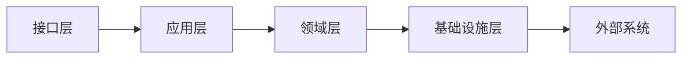

# Clean Architecture设计原则

<cite>
**本文引用的文件**
- [SsoOidcApplication.java](file://src/main/java/sso/oidc/SsoOidcApplication.java)
- [UserApplicationService.java](file://src/main/java/sso/oidc/application/service/UserApplicationService.java)
- [UserRepository.java](file://src/main/java/sso/oidc/domain/repository/UserRepository.java)
- [UserRepositoryImpl.java](file://src/main/java/sso/oidc/infrastructure/persistence/impl/UserRepositoryImpl.java)
- [UserController.java](file://src/main/java/sso/oidc/interfaces/rest/UserController.java)
- [User.java](file://src/main/java/sso/oidc/domain/model/entity/User.java)
- [AuthorizationServerConfig.java](file://src/main/java/sso/oidc/infrastructure/config/AuthorizationServerConfig.java)
- [PasswordPolicyService.java](file://src/main/java/sso/oidc/domain/service/PasswordPolicyService.java)
- [CreateUserRequest.java](file://src/main/java/sso/oidc/application/dto/request/CreateUserRequest.java)
- [UserResponse.java](file://src/main/java/sso/oidc/application/dto/response/UserResponse.java)
- [UserAlreadyExistsException.java](file://src/main/java/sso/oidc/domain/model/exception/UserAlreadyExistsException.java)
- [ApiResponse.java](file://src/main/java/sso/oidc/interfaces/rest/common/ApiResponse.java)
- [application.yml](file://src/main/resources/application.yml)
- [pom.xml](file://pom.xml)
- [README.md](file://README.md)
</cite>

## 目录
1. [引言](#引言)
2. [项目结构](#项目结构)
3. [核心组件](#核心组件)
4. [架构总览](#架构总览)
5. [详细组件分析](#详细组件分析)
6. [依赖分析](#依赖分析)
7. [性能考虑](#性能考虑)
8. [故障排除指南](#故障排除指南)
9. [结论](#结论)
10. [附录](#附录)

## 引言
本文件围绕IAM Platform认证服务，系统阐述Clean Architecture（整洁架构）的设计原则及其在项目中的落地实践。重点包括：
- 依赖倒置原则：接口与实现分离，应用服务依赖抽象而非具体实现
- 抽象隔离：领域层封装核心业务规则，基础设施层承载技术细节
- 关注点分离：接口层负责交互，应用层编排用例，领域层专注业务，基础设施层处理持久化与外部集成
- 可测试性、可维护性与可扩展性：通过依赖注入、接口抽象与分层解耦提升质量

## 项目结构
项目采用按“层次”组织的目录结构，清晰体现Clean Architecture的分层边界：
- 接口层（Interfaces）：REST控制器与Web页面控制器，负责HTTP请求/响应与UI交互
- 应用层（Application）：应用服务、DTO与Assembler，编排业务用例
- 领域层（Domain）：实体、值对象、仓储接口与领域服务，封装核心业务规则
- 基础设施层（Infrastructure）：配置、持久化实现、安全组件与外部系统适配

图表来源
- [UserController.java:1-90](file://src/main/java/sso/oidc/interfaces/rest/UserController.java#L1-L90)
- [UserApplicationService.java:1-165](file://src/main/java/sso/oidc/application/service/UserApplicationService.java#L1-L165)
- [UserRepository.java:1-26](file://src/main/java/sso/oidc/domain/repository/UserRepository.java#L1-L26)
- [UserRepositoryImpl.java:1-92](file://src/main/java/sso/oidc/infrastructure/persistence/impl/UserRepositoryImpl.java#L1-L92)
- [AuthorizationServerConfig.java:1-144](file://src/main/java/sso/oidc/infrastructure/config/AuthorizationServerConfig.java#L1-L144)
- [application.yml:1-78](file://src/main/resources/application.yml#L1-L78)

章节来源
- [README.md:104-139](file://README.md#L104-L139)

## 核心组件
- 接口层组件
  - REST控制器：接收HTTP请求，调用应用服务，返回标准化响应
  - Web控制器：处理Thymeleaf模板页面
  - 统一响应包装：统一返回结构，便于客户端消费
- 应用层组件
  - 应用服务：编排业务用例，协调仓储与领域服务，处理事务边界
  - DTO：请求与响应数据传输对象，隔离接口与领域模型
- 领域层组件
  - 实体与值对象：封装业务不变量与行为
  - 仓储接口：定义数据访问契约，应用服务仅依赖抽象
  - 领域服务：封装跨实体的业务规则
  - 领域异常：表达业务语义的异常类型
- 基础设施层组件
  - 配置：安全、OIDC提供者、JWK等配置
  - 持久化实现：将领域实体映射到JPA实体，实现仓储接口
  - 外部系统：数据库、Redis、密钥文件等

章节来源
- [UserController.java:1-90](file://src/main/java/sso/oidc/interfaces/rest/UserController.java#L1-L90)
- [UserApplicationService.java:1-165](file://src/main/java/sso/oidc/application/service/UserApplicationService.java#L1-L165)
- [UserRepository.java:1-26](file://src/main/java/sso/oidc/domain/repository/UserRepository.java#L1-L26)
- [UserRepositoryImpl.java:1-92](file://src/main/java/sso/oidc/infrastructure/persistence/impl/UserRepositoryImpl.java#L1-L92)
- [User.java:1-36](file://src/main/java/sso/oidc/domain/model/entity/User.java#L1-L36)
- [PasswordPolicyService.java:1-35](file://src/main/java/sso/oidc/domain/service/PasswordPolicyService.java#L1-L35)
- [UserAlreadyExistsException.java:1-10](file://src/main/java/sso/oidc/domain/model/exception/UserAlreadyExistsException.java#L1-L10)
- [ApiResponse.java:1-61](file://src/main/java/sso/oidc/interfaces/rest/common/ApiResponse.java#L1-L61)

## 架构总览
Clean Architecture以“依赖倒置”为核心，各层之间的依赖仅朝向“内层”，即：
- 接口层依赖应用层
- 应用层依赖领域层（接口）
- 基础设施层实现领域层接口，并被上层依赖
- 外部系统（数据库、Redis、密钥文件）位于最外层，被基础设施层使用

图表来源
- [AuthorizationServerConfig.java:1-144](file://src/main/java/sso/oidc/infrastructure/config/AuthorizationServerConfig.java#L1-L144)
- [UserRepositoryImpl.java:1-92](file://src/main/java/sso/oidc/infrastructure/persistence/impl/UserRepositoryImpl.java#L1-L92)
- [UserRepository.java:1-26](file://src/main/java/sso/oidc/domain/repository/UserRepository.java#L1-L26)
- [UserApplicationService.java:1-165](file://src/main/java/sso/oidc/application/service/UserApplicationService.java#L1-L165)
- [UserController.java:1-90](file://src/main/java/sso/oidc/interfaces/rest/UserController.java#L1-L90)

## 详细组件分析

### 依赖倒置的具体实现
- 接口与实现分离
  - 领域层定义仓储接口，应用服务通过接口编程
  - 基础设施层提供实现类，注入到应用服务
- 依赖注入的应用
  - 应用服务通过构造函数注入仓储接口与领域服务
  - 控制器通过构造函数注入应用服务
- 抽象隔离
  - 应用服务不关心数据访问技术细节（JPA/Redis）
  - 领域层不依赖Spring或外部框架

图表来源
- [UserApplicationService.java:1-165](file://src/main/java/sso/oidc/application/service/UserApplicationService.java#L1-L165)
- [UserRepository.java:1-26](file://src/main/java/sso/oidc/domain/repository/UserRepository.java#L1-L26)
- [UserRepositoryImpl.java:1-92](file://src/main/java/sso/oidc/infrastructure/persistence/impl/UserRepositoryImpl.java#L1-L92)
- [PasswordPolicyService.java:1-35](file://src/main/java/sso/oidc/domain/service/PasswordPolicyService.java#L1-L35)
- [UserController.java:1-90](file://src/main/java/sso/oidc/interfaces/rest/UserController.java#L1-L90)

章节来源
- [UserApplicationService.java:31-34](file://src/main/java/sso/oidc/application/service/UserApplicationService.java#L31-L34)
- [UserRepositoryImpl.java:14-18](file://src/main/java/sso/oidc/infrastructure/persistence/impl/UserRepositoryImpl.java#L14-L18)
- [UserController.java](file://src/main/java/sso/oidc/interfaces/rest/UserController.java#L33)

### 业务流程序列（用户创建）
该流程展示依赖倒置与关注点分离：接口层负责请求/响应，应用层编排业务，领域层保证不变量，基础设施层完成持久化。

图表来源
- [UserController.java:35-40](file://src/main/java/sso/oidc/interfaces/rest/UserController.java#L35-L40)
- [UserApplicationService.java:37-63](file://src/main/java/sso/oidc/application/service/UserApplicationService.java#L37-L63)
- [UserRepository.java:9-25](file://src/main/java/sso/oidc/domain/repository/UserRepository.java#L9-L25)
- [UserRepositoryImpl.java:20-25](file://src/main/java/sso/oidc/infrastructure/persistence/impl/UserRepositoryImpl.java#L20-L25)

章节来源
- [CreateUserRequest.java:1-31](file://src/main/java/sso/oidc/application/dto/request/CreateUserRequest.java#L1-L31)
- [UserResponse.java:1-26](file://src/main/java/sso/oidc/application/dto/response/UserResponse.java#L1-L26)
- [ApiResponse.java:25-41](file://src/main/java/sso/oidc/interfaces/rest/common/ApiResponse.java#L25-L41)

### 密码策略与业务规则
- 领域服务封装密码策略，应用服务在创建/修改密码时调用
- 领域异常表达业务约束失败，由全局异常处理或应用服务捕获并转换为HTTP状态

图表来源
- [UserApplicationService.java:37-54](file://src/main/java/sso/oidc/application/service/UserApplicationService.java#L37-L54)
- [PasswordPolicyService.java:11-24](file://src/main/java/sso/oidc/domain/service/PasswordPolicyService.java#L11-L24)

章节来源
- [PasswordPolicyService.java:1-35](file://src/main/java/sso/oidc/domain/service/PasswordPolicyService.java#L1-L35)
- [UserAlreadyExistsException.java:1-10](file://src/main/java/sso/oidc/domain/model/exception/UserAlreadyExistsException.java#L1-L10)

### OIDC提供者配置（基础设施层）
- 基础设施层负责安全配置、JWK生成与JWT解码器装配
- 通过Spring配置类对外暴露Bean，供接口层与安全过滤链使用

图表来源
- [AuthorizationServerConfig.java:49-124](file://src/main/java/sso/oidc/infrastructure/config/AuthorizationServerConfig.java#L49-L124)

章节来源
- [AuthorizationServerConfig.java:1-144](file://src/main/java/sso/oidc/infrastructure/config/AuthorizationServerConfig.java#L1-L144)

## 依赖分析
- 层间依赖方向
  - 接口层 → 应用层：控制器依赖应用服务
  - 应用层 → 领域层：应用服务依赖仓储接口与领域服务
  - 基础设施层 → 领域层：实现类实现仓储接口
  - 基础设施层 ← 外部系统：数据库、Redis、密钥文件
- 耦合与内聚
  - 应用服务高内聚地编排业务，低耦合地依赖接口
  - 领域层保持纯净业务规则，避免受技术细节影响
- 循环依赖
  - 通过接口抽象消除循环依赖风险
- 外部依赖与集成
  - Spring Security/OAuth2 Authorization Server、JPA、Redis、Flyway等

图表来源
- [pom.xml:29-140](file://pom.xml#L29-L140)
- [application.yml:9-46](file://src/main/resources/application.yml#L9-L46)

章节来源
- [pom.xml:1-225](file://pom.xml#L1-L225)
- [application.yml:1-78](file://src/main/resources/application.yml#L1-L78)

## 性能考虑
- 事务边界：应用服务方法标注事务，确保业务一致性与原子性
- 查询优化：分页查询减少一次性加载数据量
- 缓存与会话：Redis用于缓存与分布式会话，降低数据库压力
- 连接池配置：数据库连接池参数在配置文件中集中管理
- 指标与可观测性：Actuator、Prometheus、Zipkin集成，便于性能监控与追踪

## 故障排除指南
- 统一响应结构：接口层返回统一的响应包装，便于前端与调试工具解析
- 领域异常：业务异常类型明确语义，配合HTTP状态码快速定位问题
- 配置校验：OIDC提供者配置、JWK路径与密钥文件位置需正确，否则导致鉴权失败
- 数据库与迁移：Flyway版本迁移失败时检查脚本与数据库权限

章节来源
- [ApiResponse.java:1-61](file://src/main/java/sso/oidc/interfaces/rest/common/ApiResponse.java#L1-L61)
- [UserAlreadyExistsException.java:1-10](file://src/main/java/sso/oidc/domain/model/exception/UserAlreadyExistsException.java#L1-L10)
- [AuthorizationServerConfig.java:95-112](file://src/main/java/sso/oidc/infrastructure/config/AuthorizationServerConfig.java#L95-L112)
- [application.yml:32-35](file://src/main/resources/application.yml#L32-L35)

## 结论
本项目通过Clean Architecture实现了：
- 业务逻辑的稳定性：领域层封装不变量与规则，不受技术细节干扰
- 技术细节的可替换性：依赖倒置使数据库、缓存、安全等实现可替换
- 外部系统的可访问性：通过基础设施层适配，统一对外提供能力
- 可测试性、可维护性与可扩展性：清晰的分层与接口抽象，便于单元测试、集成测试与演进式重构

## 附录

### Clean Architecture在本项目的落地清单
- [ ] 接口层仅处理输入输出与UI交互，不包含业务逻辑
- [ ] 应用层编排用例，协调仓储与领域服务，处理事务
- [ ] 领域层保持纯净业务规则，定义仓储接口
- [ ] 基础设施层实现仓储接口，处理持久化与外部系统
- [ ] 依赖全部朝向内层，避免循环依赖
- [ ] 通过构造函数注入实现依赖倒置
- [ ] 使用统一响应包装与标准化异常处理

### 实际案例：如何在现有代码上应用Clean Architecture原则
- 将接口层控制器与应用服务解耦：控制器仅负责参数绑定与响应包装，业务逻辑集中在应用服务
- 将领域服务（如密码策略）从应用层迁移到领域层，增强业务规则的内聚性
- 为新的业务场景新增应用服务方法与DTO，保持对上层的兼容性
- 在基础设施层新增实现类时，确保仅实现领域层接口，不反向依赖上层