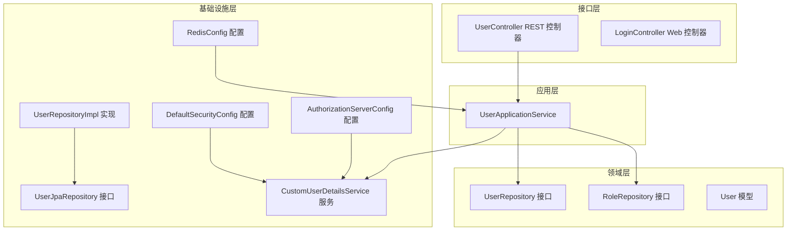
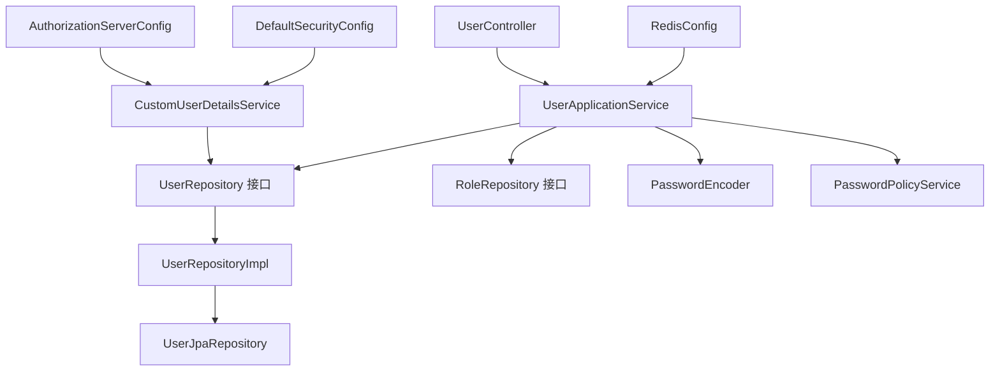
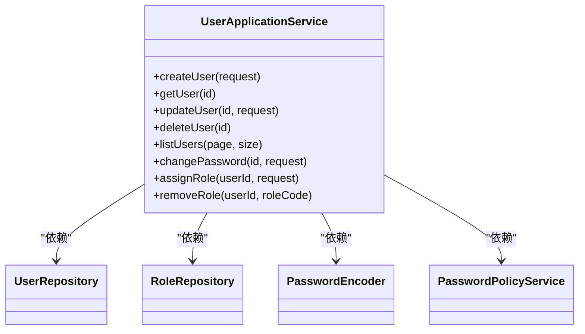
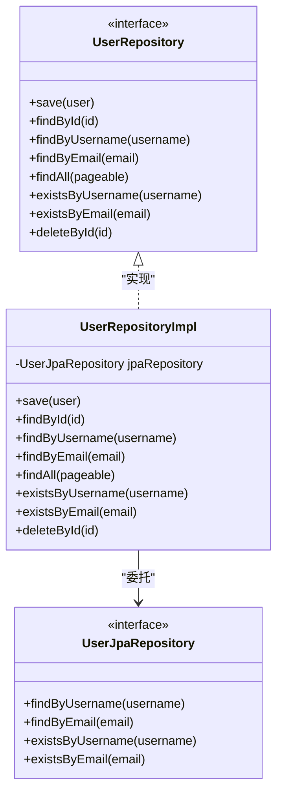
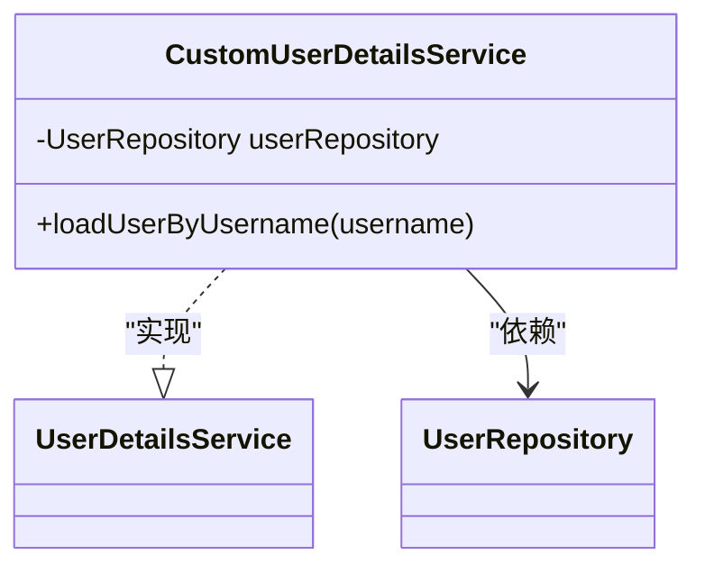
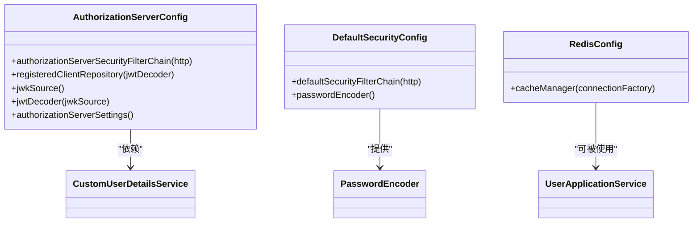
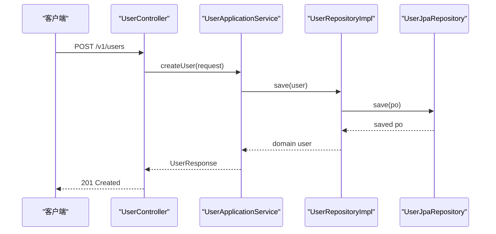
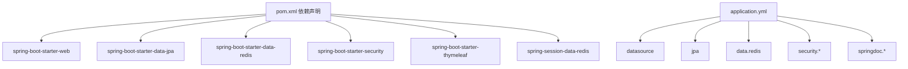

# 依赖注入与控制反转

<cite>
**本文引用的文件**
- [SsoOidcApplication.java](file://src/main/java/sso/oidc/SsoOidcApplication.java)
- [AuthorizationServerConfig.java](file://src/main/java/sso/oidc/infrastructure/config/AuthorizationServerConfig.java)
- [DefaultSecurityConfig.java](file://src/main/java/sso/oidc/infrastructure/config/DefaultSecurityConfig.java)
- [RedisConfig.java](file://src/main/java/sso/oidc/infrastructure/config/RedisConfig.java)
- [CustomUserDetailsService.java](file://src/main/java/sso/oidc/infrastructure/security/CustomUserDetailsService.java)
- [UserRepository.java](file://src/main/java/sso/oidc/domain/repository/UserRepository.java)
- [UserJpaRepository.java](file://src/main/java/sso/oidc/infrastructure/persistence/repository/UserJpaRepository.java)
- [UserRepositoryImpl.java](file://src/main/java/sso/oidc/infrastructure/persistence/impl/UserRepositoryImpl.java)
- [UserApplicationService.java](file://src/main/java/sso/oidc/application/service/UserApplicationService.java)
- [UserController.java](file://src/main/java/sso/oidc/interfaces/rest/UserController.java)
- [application.yml](file://src/main/resources/application.yml)
- [pom.xml](file://pom.xml)
</cite>

## 目录
1. [引言](#引言)
2. [项目结构](#项目结构)
3. [核心组件](#核心组件)
4. [架构总览](#架构总览)
5. [详细组件分析](#详细组件分析)
6. [依赖分析](#依赖分析)
7. [性能考虑](#性能考虑)
8. [故障排查指南](#故障排查指南)
9. [结论](#结论)
10. [附录](#附录)

## 引言
本文件围绕IAM Platform认证服务，系统梳理Spring框架中的依赖注入（DI）与控制反转（IoC）机制在本项目中的落地实践。重点涵盖：
- 组件注解：@Component、@Service、@Repository、@RestController、@Controller 的职责边界与装配方式
- 配置类与@Bean：如何通过Java配置类声明与注册Bean，以及Bean之间的依赖关系
- 构造函数注入与字段注入：在各层组件中的实际应用与最佳实践
- 松耦合架构：通过接口与抽象隔离领域与基础设施，降低模块间耦合
- 循环依赖：识别与规避策略
- 生命周期与作用域：Bean在IoC容器中的生命周期与作用域行为
- 安全与缓存：安全过滤链、密码编码器、Redis缓存管理的装配与使用

## 项目结构
项目采用分层架构与包划分清晰的组织方式，便于依赖注入与控制反转的落地：
- 应用层（application）：应用服务封装业务用例，负责事务与跨领域协调
- 领域层（domain）：模型与仓储接口，定义不变的业务规则
- 基础设施层（infrastructure）：数据库访问、安全配置、缓存配置、消息与外部集成
- 接口层（interfaces）：REST控制器与Web控制器，暴露对外接口
- 资源与配置：application.yml集中管理环境变量与运行参数

**图表来源**
- [UserApplicationService.java:26-35](file://src/main/java/sso/oidc/application/service/UserApplicationService.java#L26-L35)
- [UserRepository.java:9-25](file://src/main/java/sso/oidc/domain/repository/UserRepository.java#L9-L25)
- [UserRepositoryImpl.java:14-16](file://src/main/java/sso/oidc/infrastructure/persistence/impl/UserRepositoryImpl.java#L14-L16)
- [UserJpaRepository.java:8-16](file://src/main/java/sso/oidc/infrastructure/persistence/repository/UserJpaRepository.java#L8-L16)
- [AuthorizationServerConfig.java:42-47](file://src/main/java/sso/oidc/infrastructure/config/AuthorizationServerConfig.java#L42-L47)
- [DefaultSecurityConfig.java:13-16](file://src/main/java/sso/oidc/infrastructure/config/DefaultSecurityConfig.java#L13-L16)
- [RedisConfig.java:15-17](file://src/main/java/sso/oidc/infrastructure/config/RedisConfig.java#L15-L17)
- [CustomUserDetailsService.java:15-17](file://src/main/java/sso/oidc/infrastructure/security/CustomUserDetailsService.java#L15-L17)
- [UserController.java:27-33](file://src/main/java/sso/oidc/interfaces/rest/UserController.java#L27-L33)

**章节来源**
- [SsoOidcApplication.java:6-11](file://src/main/java/sso/oidc/SsoOidcApplication.java#L6-L11)
- [application.yml:1-78](file://src/main/resources/application.yml#L1-L78)

## 核心组件
本节聚焦于依赖注入的关键组件及其装配方式，结合注解与配置类说明Bean的创建与注入。

- 应用服务（@Service）
  - UserApplicationService：通过构造函数注入领域仓储与安全相关依赖，承担用户创建、更新、删除、角色分配等业务用例，并开启事务
  - 参考路径：[UserApplicationService.java:26-35](file://src/main/java/sso/oidc/application/service/UserApplicationService.java#L26-L35)

- 领域仓储接口（接口）
  - UserRepository：定义用户领域操作的抽象接口
  - 参考路径：[UserRepository.java:9-25](file://src/main/java/sso/oidc/domain/repository/UserRepository.java#L9-L25)

- 基础设施仓储实现（@Repository）
  - UserRepositoryImpl：基于JPA仓库实现领域接口，完成PO与领域对象的映射与持久化
  - 参考路径：[UserRepositoryImpl.java:14-16](file://src/main/java/sso/oidc/infrastructure/persistence/impl/UserRepositoryImpl.java#L14-L16)

- 数据访问接口（Spring Data JPA）
  - UserJpaRepository：继承JpaRepository，提供按用户名/邮箱查询与存在性检查
  - 参考路径：[UserJpaRepository.java:8-16](file://src/main/java/sso/oidc/infrastructure/persistence/repository/UserJpaRepository.java#L8-L16)

- 安全服务（@Service）
  - CustomUserDetailsService：实现UserDetailsService，从领域仓储加载用户详情
  - 参考路径：[CustomUserDetailsService.java:15-17](file://src/main/java/sso/oidc/infrastructure/security/CustomUserDetailsService.java#L15-L17)

- 配置类与Bean（@Configuration/@Bean）
  - AuthorizationServerConfig：声明安全过滤链、客户端注册、JWK与JWT解码器、授权服务器设置
  - DefaultSecurityConfig：声明默认Web安全过滤链与密码编码器
  - RedisConfig：声明Redis缓存管理器
  - 参考路径：
    - [AuthorizationServerConfig.java:42-47](file://src/main/java/sso/oidc/infrastructure/config/AuthorizationServerConfig.java#L42-L47)
    - [DefaultSecurityConfig.java:13-16](file://src/main/java/sso/oidc/infrastructure/config/DefaultSecurityConfig.java#L13-L16)
    - [RedisConfig.java:15-17](file://src/main/java/sso/oidc/infrastructure/config/RedisConfig.java#L15-L17)

- 接口层（@RestController/@Controller）
  - UserController：REST控制器，通过构造函数注入应用服务
  - LoginController：Web控制器，返回登录页面视图
  - 参考路径：
    - [UserController.java:27-33](file://src/main/java/sso/oidc/interfaces/rest/UserController.java#L27-L33)
    - [LoginController.java:6-13](file://src/main/java/sso/oidc/interfaces/web/LoginController.java#L6-L13)

**章节来源**
- [UserApplicationService.java:26-35](file://src/main/java/sso/oidc/application/service/UserApplicationService.java#L26-L35)
- [UserRepository.java:9-25](file://src/main/java/sso/oidc/domain/repository/UserRepository.java#L9-L25)
- [UserRepositoryImpl.java:14-16](file://src/main/java/sso/oidc/infrastructure/persistence/impl/UserRepositoryImpl.java#L14-L16)
- [UserJpaRepository.java:8-16](file://src/main/java/sso/oidc/infrastructure/persistence/repository/UserJpaRepository.java#L8-L16)
- [CustomUserDetailsService.java:15-17](file://src/main/java/sso/oidc/infrastructure/security/CustomUserDetailsService.java#L15-L17)
- [AuthorizationServerConfig.java:42-47](file://src/main/java/sso/oidc/infrastructure/config/AuthorizationServerConfig.java#L42-L47)
- [DefaultSecurityConfig.java:13-16](file://src/main/java/sso/oidc/infrastructure/config/DefaultSecurityConfig.java#L13-L16)
- [RedisConfig.java:15-17](file://src/main/java/sso/oidc/infrastructure/config/RedisConfig.java#L15-L17)
- [UserController.java:27-33](file://src/main/java/sso/oidc/interfaces/rest/UserController.java#L27-L33)
- [LoginController.java:6-13](file://src/main/java/sso/oidc/interfaces/web/LoginController.java#L6-L13)

## 架构总览
下图展示了从接口层到应用层、领域层与基础设施层的依赖流向，以及安全与缓存配置对整体架构的影响。

**图表来源**
- [UserController.java:27-33](file://src/main/java/sso/oidc/interfaces/rest/UserController.java#L27-L33)
- [UserApplicationService.java:26-35](file://src/main/java/sso/oidc/application/service/UserApplicationService.java#L26-L35)
- [UserRepository.java:9-25](file://src/main/java/sso/oidc/domain/repository/UserRepository.java#L9-L25)
- [UserRepositoryImpl.java:14-16](file://src/main/java/sso/oidc/infrastructure/persistence/impl/UserRepositoryImpl.java#L14-L16)
- [UserJpaRepository.java:8-16](file://src/main/java/sso/oidc/infrastructure/persistence/repository/UserJpaRepository.java#L8-L16)
- [CustomUserDetailsService.java:15-17](file://src/main/java/sso/oidc/infrastructure/security/CustomUserDetailsService.java#L15-L17)
- [AuthorizationServerConfig.java:42-47](file://src/main/java/sso/oidc/infrastructure/config/AuthorizationServerConfig.java#L42-L47)
- [DefaultSecurityConfig.java:13-16](file://src/main/java/sso/oidc/infrastructure/config/DefaultSecurityConfig.java#L13-L16)
- [RedisConfig.java:15-17](file://src/main/java/sso/oidc/infrastructure/config/RedisConfig.java#L15-L17)

## 详细组件分析

### 应用服务层：UserApplicationService
- 角色与职责
  - 通过构造函数注入领域仓储、密码编码器与密码策略服务，承担用户生命周期管理、密码变更、角色分配等业务逻辑
  - 使用事务注解确保业务一致性
- 依赖注入方式
  - 构造函数注入：明确依赖、便于测试与不可变性
  - 参考路径：[UserApplicationService.java:26-35](file://src/main/java/sso/oidc/application/service/UserApplicationService.java#L26-L35)

**图表来源**
- [UserApplicationService.java:26-35](file://src/main/java/sso/oidc/application/service/UserApplicationService.java#L26-L35)

**章节来源**
- [UserApplicationService.java:26-35](file://src/main/java/sso/oidc/application/service/UserApplicationService.java#L26-L35)

### 领域与基础设施仓储：Repository 抽象与实现
- 领域接口 UserRepository：定义用户领域操作的抽象契约
  - 参考路径：[UserRepository.java:9-25](file://src/main/java/sso/oidc/domain/repository/UserRepository.java#L9-L25)
- 基础设施实现 UserRepositoryImpl：基于UserJpaRepository完成PO与领域对象的双向转换
  - 参考路径：[UserRepositoryImpl.java:14-16](file://src/main/java/sso/oidc/infrastructure/persistence/impl/UserRepositoryImpl.java#L14-L16)
- 数据访问接口 UserJpaRepository：继承JpaRepository，提供常用查询方法
  - 参考路径：[UserJpaRepository.java:8-16](file://src/main/java/sso/oidc/infrastructure/persistence/repository/UserJpaRepository.java#L8-L16)

**图表来源**
- [UserRepository.java:9-25](file://src/main/java/sso/oidc/domain/repository/UserRepository.java#L9-L25)
- [UserRepositoryImpl.java:14-16](file://src/main/java/sso/oidc/infrastructure/persistence/impl/UserRepositoryImpl.java#L14-L16)
- [UserJpaRepository.java:8-16](file://src/main/java/sso/oidc/infrastructure/persistence/repository/UserJpaRepository.java#L8-L16)

**章节来源**
- [UserRepository.java:9-25](file://src/main/java/sso/oidc/domain/repository/UserRepository.java#L9-L25)
- [UserRepositoryImpl.java:14-16](file://src/main/java/sso/oidc/infrastructure/persistence/impl/UserRepositoryImpl.java#L14-L16)
- [UserJpaRepository.java:8-16](file://src/main/java/sso/oidc/infrastructure/persistence/repository/UserJpaRepository.java#L8-L16)

### 安全与认证：自定义用户详情服务
- CustomUserDetailsService：实现UserDetailsService，从领域仓储加载用户详情并构建Spring Security的UserDetails
  - 通过构造函数注入领域仓储
  - 参考路径：[CustomUserDetailsService.java:15-17](file://src/main/java/sso/oidc/infrastructure/security/CustomUserDetailsService.java#L15-L17)

**图表来源**
- [CustomUserDetailsService.java:15-17](file://src/main/java/sso/oidc/infrastructure/security/CustomUserDetailsService.java#L15-L17)
- [UserRepository.java:9-25](file://src/main/java/sso/oidc/domain/repository/UserRepository.java#L9-L25)

**章节来源**
- [CustomUserDetailsService.java:15-17](file://src/main/java/sso/oidc/infrastructure/security/CustomUserDetailsService.java#L15-L17)

### 配置类与Bean：声明式装配
- AuthorizationServerConfig：声明安全过滤链、客户端注册、JWK与JWT解码器、授权服务器设置
  - 通过@Bean方法声明多个Bean，并在方法参数中进行依赖注入
  - 参考路径：[AuthorizationServerConfig.java:42-47](file://src/main/java/sso/oidc/infrastructure/config/AuthorizationServerConfig.java#L42-L47)
- DefaultSecurityConfig：声明默认Web安全过滤链与密码编码器
  - 参考路径：[DefaultSecurityConfig.java:13-16](file://src/main/java/sso/oidc/infrastructure/config/DefaultSecurityConfig.java#L13-L16)
- RedisConfig：声明Redis缓存管理器
  - 参考路径：[RedisConfig.java:15-17](file://src/main/java/sso/oidc/infrastructure/config/RedisConfig.java#L15-L17)

**图表来源**
- [AuthorizationServerConfig.java:42-47](file://src/main/java/sso/oidc/infrastructure/config/AuthorizationServerConfig.java#L42-L47)
- [DefaultSecurityConfig.java:13-16](file://src/main/java/sso/oidc/infrastructure/config/DefaultSecurityConfig.java#L13-L16)
- [RedisConfig.java:15-17](file://src/main/java/sso/oidc/infrastructure/config/RedisConfig.java#L15-L17)
- [CustomUserDetailsService.java:15-17](file://src/main/java/sso/oidc/infrastructure/security/CustomUserDetailsService.java#L15-L17)

**章节来源**
- [AuthorizationServerConfig.java:42-47](file://src/main/java/sso/oidc/infrastructure/config/AuthorizationServerConfig.java#L42-L47)
- [DefaultSecurityConfig.java:13-16](file://src/main/java/sso/oidc/infrastructure/config/DefaultSecurityConfig.java#L13-L16)
- [RedisConfig.java:15-17](file://src/main/java/sso/oidc/infrastructure/config/RedisConfig.java#L15-L17)

### 接口层：REST与Web控制器
- UserController：通过构造函数注入应用服务，提供用户管理的REST接口
  - 参考路径：[UserController.java:27-33](file://src/main/java/sso/oidc/interfaces/rest/UserController.java#L27-L33)
- LoginController：Web控制器，返回登录页面视图
  - 参考路径：[LoginController.java:6-13](file://src/main/java/sso/oidc/interfaces/web/LoginController.java#L6-L13)

**图表来源**
- [UserController.java:27-33](file://src/main/java/sso/oidc/interfaces/rest/UserController.java#L27-L33)
- [UserApplicationService.java:36-63](file://src/main/java/sso/oidc/application/service/UserApplicationService.java#L36-L63)
- [UserRepositoryImpl.java:18-25](file://src/main/java/sso/oidc/infrastructure/persistence/impl/UserRepositoryImpl.java#L18-L25)
- [UserJpaRepository.java:8-16](file://src/main/java/sso/oidc/infrastructure/persistence/repository/UserJpaRepository.java#L8-L16)

**章节来源**
- [UserController.java:27-33](file://src/main/java/sso/oidc/interfaces/rest/UserController.java#L27-L33)
- [LoginController.java:6-13](file://src/main/java/sso/oidc/interfaces/web/LoginController.java#L6-L13)

### 依赖注入方式示例
- 构造函数注入（推荐）
  - 应用服务、仓储实现、安全服务均通过构造函数注入依赖，保证不可变性与可测试性
  - 示例路径：
    - [UserApplicationService.java:26-35](file://src/main/java/sso/oidc/application/service/UserApplicationService.java#L26-L35)
    - [UserRepositoryImpl.java:14-16](file://src/main/java/sso/oidc/infrastructure/persistence/impl/UserRepositoryImpl.java#L14-L16)
    - [CustomUserDetailsService.java:15-17](file://src/main/java/sso/oidc/infrastructure/security/CustomUserDetailsService.java#L15-L17)
- 字段注入（不推荐，但常见）
  - 在部分配置类或非核心组件中可能使用字段注入，建议优先使用构造函数注入以提升可测试性
  - 示例路径：
    - [AuthorizationServerConfig.java:46-47](file://src/main/java/sso/oidc/infrastructure/config/AuthorizationServerConfig.java#L46-L47)
    - [DefaultSecurityConfig.java:13-16](file://src/main/java/sso/oidc/infrastructure/config/DefaultSecurityConfig.java#L13-L16)

**章节来源**
- [UserApplicationService.java:26-35](file://src/main/java/sso/oidc/application/service/UserApplicationService.java#L26-L35)
- [UserRepositoryImpl.java:14-16](file://src/main/java/sso/oidc/infrastructure/persistence/impl/UserRepositoryImpl.java#L14-L16)
- [CustomUserDetailsService.java:15-17](file://src/main/java/sso/oidc/infrastructure/security/CustomUserDetailsService.java#L15-L17)
- [AuthorizationServerConfig.java:46-47](file://src/main/java/sso/oidc/infrastructure/config/AuthorizationServerConfig.java#L46-L47)
- [DefaultSecurityConfig.java:13-16](file://src/main/java/sso/oidc/infrastructure/config/DefaultSecurityConfig.java#L13-L16)

### 循环依赖检测与解决方案
- 现状分析
  - 本项目未发现直接的循环依赖（如A依赖B且B依赖A）。应用服务依赖领域仓储与安全组件；仓储实现依赖JPA仓库；安全配置依赖用户详情服务，均为单向依赖
- 检测手段
  - 启动时由Spring容器自动检测循环依赖，若存在则抛出异常
- 解决方案
  - 将相互依赖的逻辑拆分为独立的服务或引入事件/异步处理
  - 使用@Lazy延迟初始化以打破循环
  - 重构设计，避免紧耦合

**章节来源**
- [UserApplicationService.java:26-35](file://src/main/java/sso/oidc/application/service/UserApplicationService.java#L26-L35)
- [UserRepositoryImpl.java:14-16](file://src/main/java/sso/oidc/infrastructure/persistence/impl/UserRepositoryImpl.java#L14-L16)
- [CustomUserDetailsService.java:15-17](file://src/main/java/sso/oidc/infrastructure/security/CustomUserDetailsService.java#L15-L17)

## 依赖分析
- 外部依赖与特性启用
  - Web、数据访问、Redis、安全、模板引擎、会话存储等依赖通过Maven引入
  - 通过@EnableWebSecurity启用Web安全，@EnableCaching启用缓存
  - 参考路径：
    - [pom.xml:32-60](file://pom.xml#L32-L60)
    - [DefaultSecurityConfig.java:13-16](file://src/main/java/sso/oidc/infrastructure/config/DefaultSecurityConfig.java#L13-L16)
    - [RedisConfig.java:15-17](file://src/main/java/sso/oidc/infrastructure/config/RedisConfig.java#L15-L17)

- 运行参数与环境变量
  - 数据源、JPA、Redis、安全密钥、OpenAPI等通过application.yml集中配置
  - 参考路径：[application.yml:1-78](file://src/main/resources/application.yml#L1-L78)

**图表来源**
- [pom.xml:32-60](file://pom.xml#L32-L60)
- [application.yml:1-78](file://src/main/resources/application.yml#L1-L78)

**章节来源**
- [pom.xml:32-60](file://pom.xml#L32-L60)
- [application.yml:1-78](file://src/main/resources/application.yml#L1-L78)

## 性能考虑
- 缓存策略
  - Redis缓存管理器用于短期缓存，减少数据库压力
  - 参考路径：[RedisConfig.java:19-32](file://src/main/java/sso/oidc/infrastructure/config/RedisConfig.java#L19-L32)
- 数据访问优化
  - 使用分页查询与存在性检查，避免不必要的全量加载
  - 参考路径：[UserRepository.java:18-25](file://src/main/java/sso/oidc/domain/repository/UserRepository.java#L18-L25)
- 安全与加密
  - 使用BCrypt密码编码器与JWK生成的RSA密钥对，保障认证与令牌安全
  - 参考路径：
    - [DefaultSecurityConfig.java:39-42](file://src/main/java/sso/oidc/infrastructure/config/DefaultSecurityConfig.java#L39-L42)
    - [AuthorizationServerConfig.java:93-117](file://src/main/java/sso/oidc/infrastructure/config/AuthorizationServerConfig.java#L93-L117)

**章节来源**
- [RedisConfig.java:19-32](file://src/main/java/sso/oidc/infrastructure/config/RedisConfig.java#L19-L32)
- [UserRepository.java:18-25](file://src/main/java/sso/oidc/domain/repository/UserRepository.java#L18-L25)
- [DefaultSecurityConfig.java:39-42](file://src/main/java/sso/oidc/infrastructure/config/DefaultSecurityConfig.java#L39-L42)
- [AuthorizationServerConfig.java:93-117](file://src/main/java/sso/oidc/infrastructure/config/AuthorizationServerConfig.java#L93-L117)

## 故障排查指南
- 启动失败（循环依赖）
  - 现象：启动时报错提示循环依赖
  - 处理：检查组件间的依赖关系，必要时使用@Lazy或重构设计
- 用户不存在异常
  - 现象：加载用户详情时抛出“用户不存在”
  - 处理：确认用户是否已创建，检查用户名拼写与大小写
  - 参考路径：[CustomUserDetailsService.java:21-25](file://src/main/java/sso/oidc/infrastructure/security/CustomUserDetailsService.java#L21-L25)
- 密码错误
  - 现象：修改密码时提示旧密码不正确
  - 处理：确认旧密码与编码后的哈希一致
  - 参考路径：[UserApplicationService.java:113-125](file://src/main/java/sso/oidc/application/service/UserApplicationService.java#L113-L125)
- 安全过滤链问题
  - 现象：登录页面无法访问或重定向异常
  - 处理：检查安全过滤链顺序与匹配路径
  - 参考路径：
    - [AuthorizationServerConfig.java:49-66](file://src/main/java/sso/oidc/infrastructure/config/AuthorizationServerConfig.java#L49-L66)
    - [DefaultSecurityConfig.java:18-37](file://src/main/java/sso/oidc/infrastructure/config/DefaultSecurityConfig.java#L18-L37)

**章节来源**
- [CustomUserDetailsService.java:21-25](file://src/main/java/sso/oidc/infrastructure/security/CustomUserDetailsService.java#L21-L25)
- [UserApplicationService.java:113-125](file://src/main/java/sso/oidc/application/service/UserApplicationService.java#L113-L125)
- [AuthorizationServerConfig.java:49-66](file://src/main/java/sso/oidc/infrastructure/config/AuthorizationServerConfig.java#L49-L66)
- [DefaultSecurityConfig.java:18-37](file://src/main/java/sso/oidc/infrastructure/config/DefaultSecurityConfig.java#L18-L37)

## 结论
本项目通过清晰的分层与严格的依赖注入实践，实现了松耦合、高内聚的架构设计。应用服务通过构造函数注入依赖，仓储接口与实现分离，安全与缓存通过配置类统一装配，REST与Web控制器仅承担接口职责。该设计提升了可维护性、可测试性与扩展性，符合现代Spring Boot应用的最佳实践。

## 附录
- 关键配置项参考
  - 数据源与JPA：[application.yml:9-27](file://src/main/resources/application.yml#L9-L27)
  - Redis：[application.yml:28-32](file://src/main/resources/application.yml#L28-L32)
  - 安全与密钥：[application.yml:48-55](file://src/main/resources/application.yml#L48-L55)
  - OpenAPI：[application.yml:57-62](file://src/main/resources/application.yml#L57-L62)