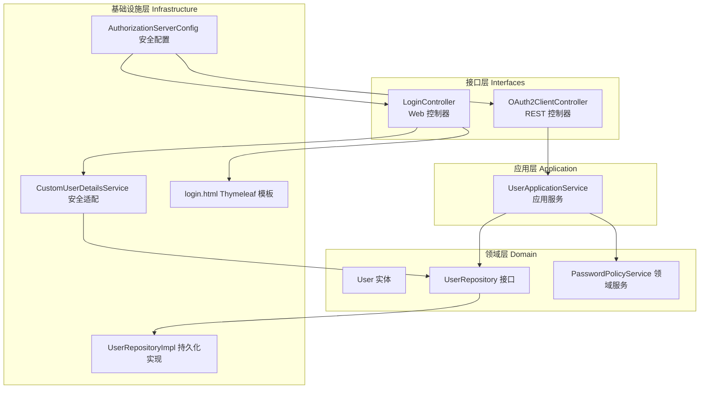
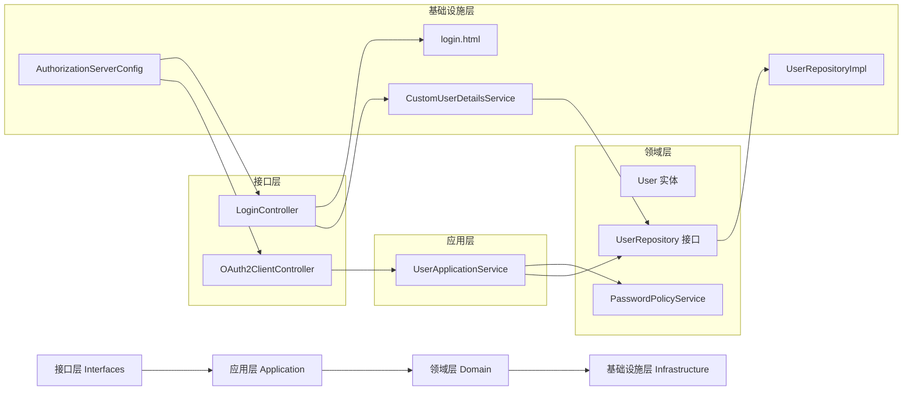
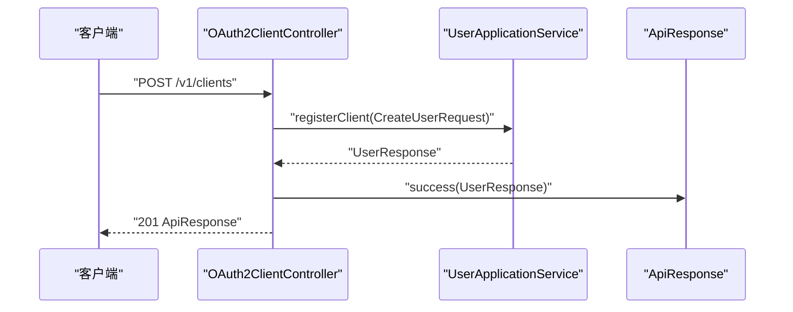
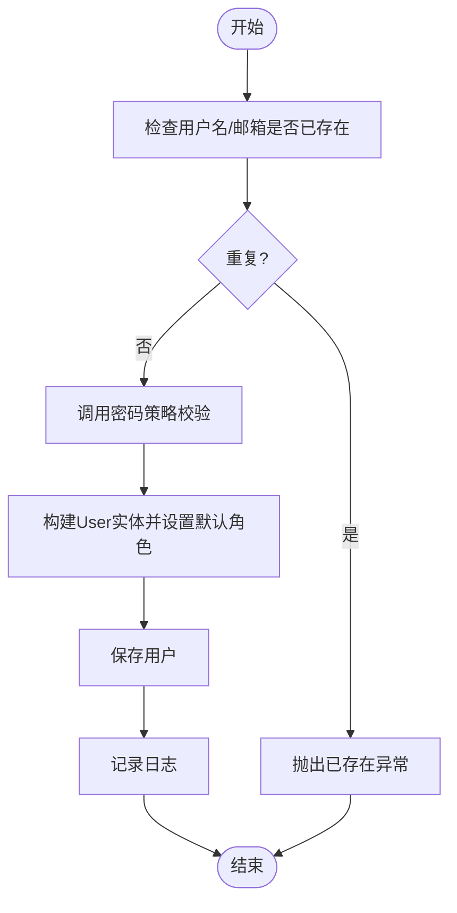
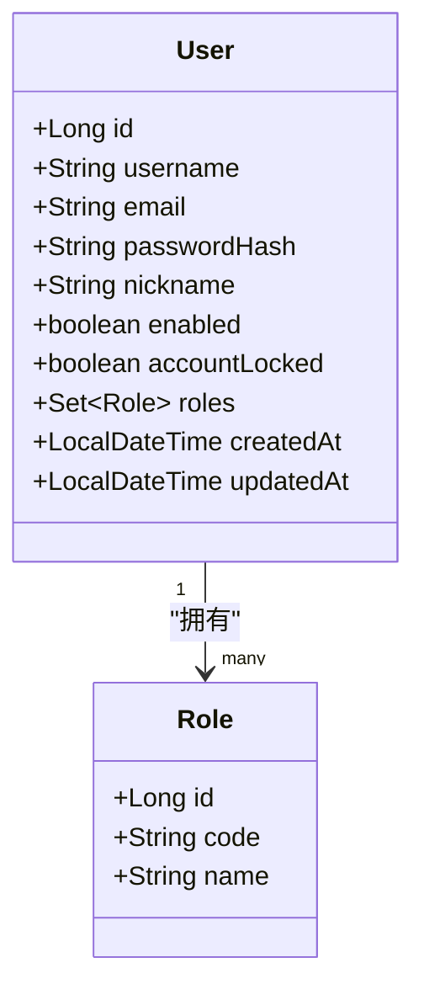
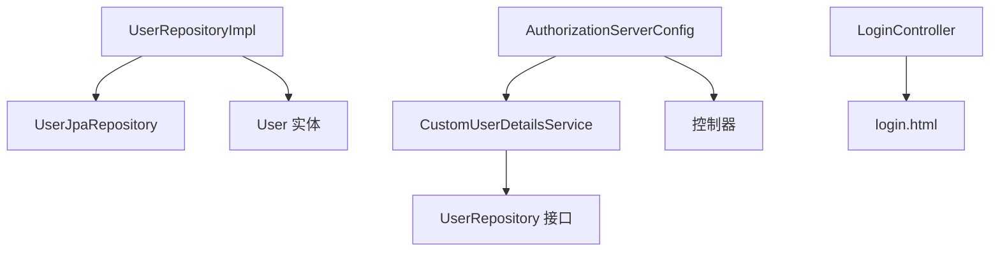
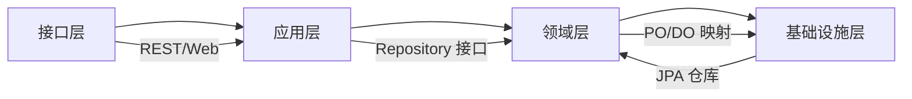

# 分层架构设计

<cite>
**本文引用的文件**
- [SsoOidcApplication.java](file://src/main/java/sso/oidc/SsoOidcApplication.java)
- [OAuth2ClientController.java](file://src/main/java/sso/oidc/interfaces/rest/OAuth2ClientController.java)
- [LoginController.java](file://src/main/java/sso/oidc/interfaces/web/LoginController.java)
- [UserApplicationService.java](file://src/main/java/sso/oidc/application/service/UserApplicationService.java)
- [User.java](file://src/main/java/sso/oidc/domain/model/entity/User.java)
- [UserRepository.java](file://src/main/java/sso/oidc/domain/repository/UserRepository.java)
- [UserRepositoryImpl.java](file://src/main/java/sso/oidc/infrastructure/persistence/impl/UserRepositoryImpl.java)
- [CustomUserDetailsService.java](file://src/main/java/sso/oidc/infrastructure/security/CustomUserDetailsService.java)
- [CreateUserRequest.java](file://src/main/java/sso/oidc/application/dto/request/CreateUserRequest.java)
- [application.yml](file://src/main/resources/application.yml)
- [AuthorizationServerConfig.java](file://src/main/java/sso/oidc/infrastructure/config/AuthorizationServerConfig.java)
- [login.html](file://src/main/resources/templates/login.html)
- [PasswordPolicyService.java](file://src/main/java/sso/oidc/domain/service/PasswordPolicyService.java)
- [ApiResponse.java](file://src/main/java/sso/oidc/interfaces/rest/common/ApiResponse.java)
</cite>

## 目录
1. [引言](#引言)
2. [项目结构](#项目结构)
3. [核心组件](#核心组件)
4. [架构总览](#架构总览)
5. [详细组件分析](#详细组件分析)
6. [依赖分析](#依赖分析)
7. [性能考虑](#性能考虑)
8. [故障排查指南](#故障排查指南)
9. [结论](#结论)
10. [附录](#附录)

## 引言
本文件面向IAM Platform认证服务，系统化阐述其分层架构设计：接口层（Interfaces）、应用层（Application）、领域层（Domain）、基础设施层（Infrastructure）。文档从职责边界、依赖关系与交互模式入手，结合实际代码路径，解释接口层如何暴露REST API与Web界面，应用层如何编排业务流程，领域层如何封装核心业务规则，基础设施层如何提供安全、持久化与运行时支撑，并给出层间依赖方向图与数据流向图，帮助读者快速理解并高效维护该系统。

## 项目结构
项目采用按“层次+子域”混合组织方式：
- 接口层（interfaces）：REST控制器与Web控制器，负责请求接入与响应封装
- 应用层（application）：应用服务，编排业务流程、事务控制与DTO转换
- 领域层（domain）：实体、值对象、仓库接口与领域服务，封装核心业务规则
- 基础设施层（infrastructure）：配置、持久化实现、安全适配器与外部集成

图表来源
- [OAuth2ClientController.java:1-75](file://src/main/java/sso/oidc/interfaces/rest/OAuth2ClientController.java#L1-L75)
- [LoginController.java:1-14](file://src/main/java/sso/oidc/interfaces/web/LoginController.java#L1-L14)
- [UserApplicationService.java:1-165](file://src/main/java/sso/oidc/application/service/UserApplicationService.java#L1-L165)
- [User.java:1-36](file://src/main/java/sso/oidc/domain/model/entity/User.java#L1-L36)
- [UserRepository.java:1-26](file://src/main/java/sso/oidc/domain/repository/UserRepository.java#L1-L26)
- [UserRepositoryImpl.java:1-92](file://src/main/java/sso/oidc/infrastructure/persistence/impl/UserRepositoryImpl.java#L1-L92)
- [CustomUserDetailsService.java:1-41](file://src/main/java/sso/oidc/infrastructure/security/CustomUserDetailsService.java#L1-L41)
- [AuthorizationServerConfig.java:1-143](file://src/main/java/sso/oidc/infrastructure/config/AuthorizationServerConfig.java#L1-L143)
- [login.html:1-47](file://src/main/resources/templates/login.html#L1-L47)

章节来源
- [SsoOidcApplication.java:1-13](file://src/main/java/sso/oidc/SsoOidcApplication.java#L1-L13)
- [application.yml:1-78](file://src/main/resources/application.yml#L1-L78)

## 核心组件
- 接口层
  - REST控制器：统一返回包装类，集中处理HTTP语义与错误码
  - Web控制器：提供HTML登录页等Web界面
- 应用层
  - 应用服务：编排业务流程、事务控制、DTO转换与异常处理
- 领域层
  - 实体与值对象：用户实体、角色集合、邮箱值对象等
  - 仓库接口：抽象数据访问能力
  - 领域服务：密码策略校验
- 基础设施层
  - 持久化实现：PO/DO映射与JPA仓库适配
  - 安全配置：OIDC授权服务器、JWK、登录入口
  - 安全适配：用户详情加载与权限装配
  - 模板：Thymeleaf登录页面

章节来源
- [OAuth2ClientController.java:1-75](file://src/main/java/sso/oidc/interfaces/rest/OAuth2ClientController.java#L1-L75)
- [LoginController.java:1-14](file://src/main/java/sso/oidc/interfaces/web/LoginController.java#L1-L14)
- [UserApplicationService.java:1-165](file://src/main/java/sso/oidc/application/service/UserApplicationService.java#L1-L165)
- [User.java:1-36](file://src/main/java/sso/oidc/domain/model/entity/User.java#L1-L36)
- [UserRepository.java:1-26](file://src/main/java/sso/oidc/domain/repository/UserRepository.java#L1-L26)
- [UserRepositoryImpl.java:1-92](file://src/main/java/sso/oidc/infrastructure/persistence/impl/UserRepositoryImpl.java#L1-L92)
- [CustomUserDetailsService.java:1-41](file://src/main/java/sso/oidc/infrastructure/security/CustomUserDetailsService.java#L1-L41)
- [AuthorizationServerConfig.java:1-143](file://src/main/java/sso/oidc/infrastructure/config/AuthorizationServerConfig.java#L1-L143)
- [login.html:1-47](file://src/main/resources/templates/login.html#L1-L47)
- [PasswordPolicyService.java:1-35](file://src/main/java/sso/oidc/domain/service/PasswordPolicyService.java#L1-L35)
- [ApiResponse.java:1-61](file://src/main/java/sso/oidc/interfaces/rest/common/ApiResponse.java#L1-L61)

## 架构总览
分层架构通过清晰的边界与依赖方向，实现关注点分离与可演进性：
- 上层仅依赖下层接口，避免反向依赖
- 应用层协调业务流程，不直接操作底层细节
- 领域层专注不变量与规则，保持高内聚
- 基础设施层提供技术支撑，可替换性强

图表来源
- [OAuth2ClientController.java:1-75](file://src/main/java/sso/oidc/interfaces/rest/OAuth2ClientController.java#L1-L75)
- [LoginController.java:1-14](file://src/main/java/sso/oidc/interfaces/web/LoginController.java#L1-L14)
- [UserApplicationService.java:1-165](file://src/main/java/sso/oidc/application/service/UserApplicationService.java#L1-L165)
- [UserRepository.java:1-26](file://src/main/java/sso/oidc/domain/repository/UserRepository.java#L1-L26)
- [UserRepositoryImpl.java:1-92](file://src/main/java/sso/oidc/infrastructure/persistence/impl/UserRepositoryImpl.java#L1-L92)
- [CustomUserDetailsService.java:1-41](file://src/main/java/sso/oidc/infrastructure/security/CustomUserDetailsService.java#L1-L41)
- [AuthorizationServerConfig.java:1-143](file://src/main/java/sso/oidc/infrastructure/config/AuthorizationServerConfig.java#L1-L143)
- [login.html:1-47](file://src/main/resources/templates/login.html#L1-L47)

## 详细组件分析

### 接口层（Interfaces）
- 职责
  - REST API：接收HTTP请求，参数校验，调用应用服务，使用统一响应包装类返回
  - Web界面：提供登录页、注册页、授权确认页等HTML页面
- 依赖关系
  - REST控制器依赖应用服务；Web控制器依赖安全配置与模板引擎
  - 统一响应包装类用于标准化返回格式
- 交互模式
  - 控制器到应用服务：请求对象DTO → 应用服务方法 → 返回响应DTO
  - Web到安全：表单提交触发Spring Security认证流程

图表来源
- [OAuth2ClientController.java:34-39](file://src/main/java/sso/oidc/interfaces/rest/OAuth2ClientController.java#L34-L39)
- [UserApplicationService.java:36-63](file://src/main/java/sso/oidc/application/service/UserApplicationService.java#L36-L63)
- [ApiResponse.java:25-32](file://src/main/java/sso/oidc/interfaces/rest/common/ApiResponse.java#L25-L32)

章节来源
- [OAuth2ClientController.java:1-75](file://src/main/java/sso/oidc/interfaces/rest/OAuth2ClientController.java#L1-L75)
- [LoginController.java:1-14](file://src/main/java/sso/oidc/interfaces/web/LoginController.java#L1-L14)
- [ApiResponse.java:1-61](file://src/main/java/sso/oidc/interfaces/rest/common/ApiResponse.java#L1-L61)

### 应用层（Application）
- 职责
  - 编排业务流程：保存用户、分配角色、变更密码、分页查询等
  - 事务控制：使用注解确保业务原子性
  - DTO转换：在应用层完成请求/响应DTO与领域模型的转换
  - 异常处理：对不存在、重复、凭据无效等场景抛出领域异常
- 依赖关系
  - 依赖领域仓库接口与领域服务，不直接依赖具体实现
- 协作模式
  - 应用服务通过仓库接口读写领域实体，必要时调用领域服务进行规则校验

图表来源
- [UserApplicationService.java:36-63](file://src/main/java/sso/oidc/application/service/UserApplicationService.java#L36-L63)
- [PasswordPolicyService.java:11-24](file://src/main/java/sso/oidc/domain/service/PasswordPolicyService.java#L11-L24)

章节来源
- [UserApplicationService.java:1-165](file://src/main/java/sso/oidc/application/service/UserApplicationService.java#L1-L165)
- [CreateUserRequest.java:1-31](file://src/main/java/sso/oidc/application/dto/request/CreateUserRequest.java#L1-L31)

### 领域层（Domain）
- 职责
  - 封装核心业务规则：用户状态、角色集合、密码强度等
  - 定义不变量：账户启用/锁定、邮箱唯一性等
- 数据结构
  - 实体：User包含基础属性与角色集合
  - 值对象：Email等
  - 仓库接口：抽象数据访问
  - 领域服务：PasswordPolicyService
- 复杂度与优化
  - 仓库接口方法多为O(1)或基于索引的查找
  - 集合操作在实体中延迟初始化，避免空指针

图表来源
- [User.java:1-36](file://src/main/java/sso/oidc/domain/model/entity/User.java#L1-L36)

章节来源
- [User.java:1-36](file://src/main/java/sso/oidc/domain/model/entity/User.java#L1-L36)
- [UserRepository.java:1-26](file://src/main/java/sso/oidc/domain/repository/UserRepository.java#L1-L26)
- [PasswordPolicyService.java:1-35](file://src/main/java/sso/oidc/domain/service/PasswordPolicyService.java#L1-L35)

### 基础设施层（Infrastructure）
- 职责
  - 持久化实现：PO/DO映射、JPA仓库适配
  - 安全配置：OIDC授权服务器、JWK生成、登录入口
  - 安全适配：用户详情加载与权限装配
  - 模板：Thymeleaf登录页
- 依赖关系
  - 持久化实现依赖JPA仓库与领域实体
  - 安全配置与控制器共同决定认证与授权行为
- 运行时支撑
  - Spring Boot自动装配与YAML配置驱动

图表来源
- [UserRepositoryImpl.java:14-60](file://src/main/java/sso/oidc/infrastructure/persistence/impl/UserRepositoryImpl.java#L14-L60)
- [CustomUserDetailsService.java:15-39](file://src/main/java/sso/oidc/infrastructure/security/CustomUserDetailsService.java#L15-L39)
- [AuthorizationServerConfig.java:49-66](file://src/main/java/sso/oidc/infrastructure/config/AuthorizationServerConfig.java#L49-L66)
- [LoginController.java:6-13](file://src/main/java/sso/oidc/interfaces/web/LoginController.java#L6-L13)
- [login.html:1-47](file://src/main/resources/templates/login.html#L1-L47)

章节来源
- [UserRepositoryImpl.java:1-92](file://src/main/java/sso/oidc/infrastructure/persistence/impl/UserRepositoryImpl.java#L1-L92)
- [CustomUserDetailsService.java:1-41](file://src/main/java/sso/oidc/infrastructure/security/CustomUserDetailsService.java#L1-L41)
- [AuthorizationServerConfig.java:1-143](file://src/main/java/sso/oidc/infrastructure/config/AuthorizationServerConfig.java#L1-L143)
- [login.html:1-47](file://src/main/resources/templates/login.html#L1-L47)
- [application.yml:1-78](file://src/main/resources/application.yml#L1-L78)

## 依赖分析
- 层间依赖方向
  - 接口层 → 应用层 → 领域层 → 基础设施层
  - 依赖均为单向，避免循环依赖
- 关键依赖链
  - 控制器 → 应用服务 → 仓库接口 → 持久化实现
  - 安全配置 → 控制器/Web控制器 → 用户详情加载
- 可替换性
  - 通过接口隔离，可在不改动上层的情况下替换实现

图表来源
- [OAuth2ClientController.java:32](file://src/main/java/sso/oidc/interfaces/rest/OAuth2ClientController.java#L32)
- [UserApplicationService.java:31-34](file://src/main/java/sso/oidc/application/service/UserApplicationService.java#L31-L34)
- [UserRepository.java:9-25](file://src/main/java/sso/oidc/domain/repository/UserRepository.java#L9-L25)
- [UserRepositoryImpl.java:14-60](file://src/main/java/sso/oidc/infrastructure/persistence/impl/UserRepositoryImpl.java#L14-L60)

章节来源
- [UserRepository.java:1-26](file://src/main/java/sso/oidc/domain/repository/UserRepository.java#L1-L26)
- [UserRepositoryImpl.java:1-92](file://src/main/java/sso/oidc/infrastructure/persistence/impl/UserRepositoryImpl.java#L1-L92)

## 性能考虑
- 数据访问
  - 使用分页查询减少一次性载荷
  - 延迟初始化集合，避免不必要的对象创建
- 安全与加密
  - JWK密钥生成与缓存，避免频繁解析PEM
  - 合理配置连接池与会话存储（Redis）
- 日志与监控
  - 开启指标与追踪，定位瓶颈
  - 禁用生产环境SQL打印，降低开销

## 故障排查指南
- 认证失败
  - 检查登录控制器重定向与安全配置
  - 核对用户是否存在、是否启用/锁定
- 密码策略校验失败
  - 确认密码长度与字符要求
- 用户重复或不存在
  - 校验用户名/邮箱唯一性，查看应用服务异常分支
- 数据持久化问题
  - 检查PO/DO映射与JPA仓库方法

章节来源
- [AuthorizationServerConfig.java:57-63](file://src/main/java/sso/oidc/infrastructure/config/AuthorizationServerConfig.java#L57-L63)
- [CustomUserDetailsService.java:21-26](file://src/main/java/sso/oidc/infrastructure/security/CustomUserDetailsService.java#L21-L26)
- [UserApplicationService.java:38-43](file://src/main/java/sso/oidc/application/service/UserApplicationService.java#L38-L43)
- [UserApplicationService.java:117-119](file://src/main/java/sso/oidc/application/service/UserApplicationService.java#L117-L119)
- [UserRepositoryImpl.java:62-90](file://src/main/java/sso/oidc/infrastructure/persistence/impl/UserRepositoryImpl.java#L62-L90)

## 结论
该分层架构通过清晰的边界与单向依赖，实现了关注点分离、可测试性与可维护性。接口层专注于接入与响应标准化，应用层编排业务流程与事务，领域层封装核心规则，基础设施层提供安全与持久化支撑。配合统一响应包装、密码策略与安全配置，系统具备良好的扩展性与运行稳定性。

## 附录
- 配置要点
  - 数据源、JPA、Redis、Flyway、OpenAPI等通过YAML集中管理
- 模板与静态资源
  - Thymeleaf模板与样式文件位于resources目录

章节来源
- [application.yml:1-78](file://src/main/resources/application.yml#L1-L78)
- [login.html:1-47](file://src/main/resources/templates/login.html#L1-L47)