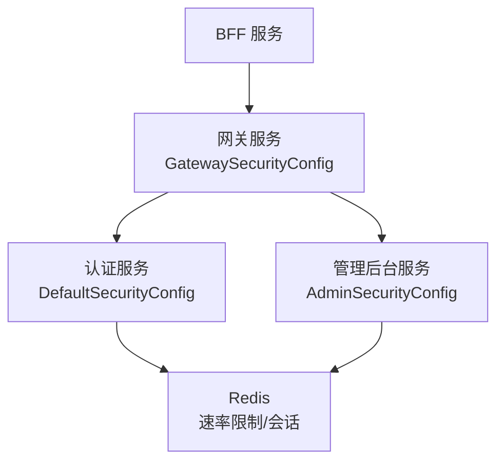
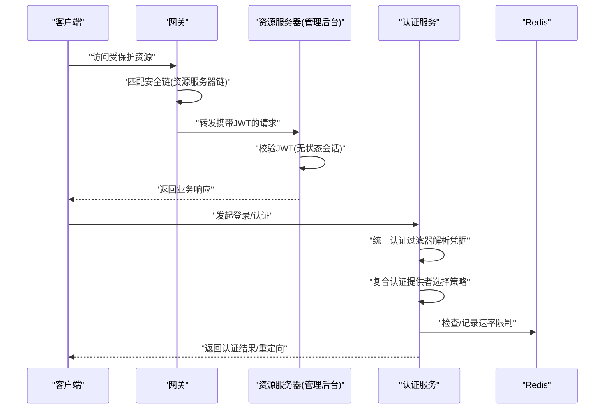
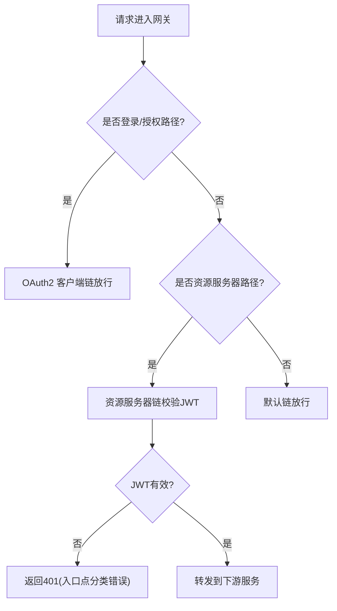
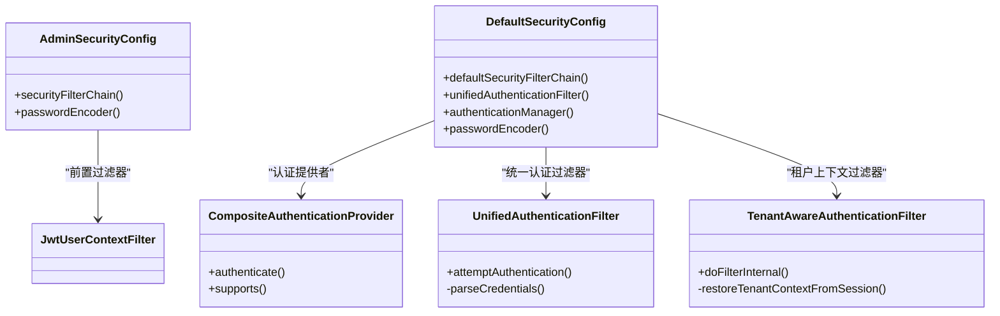
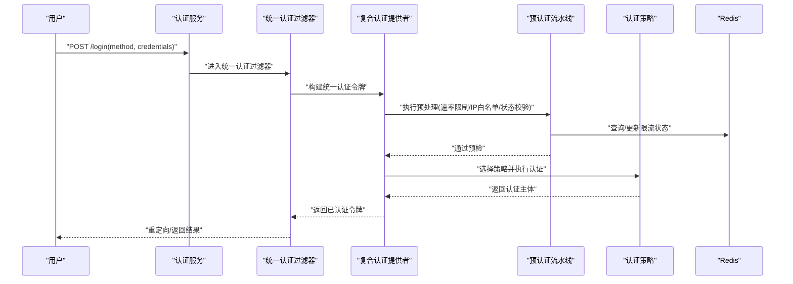
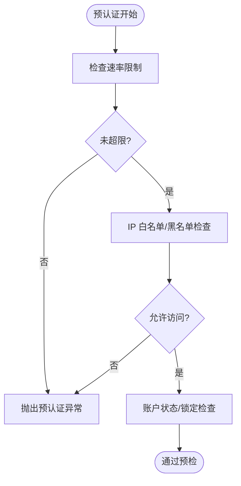
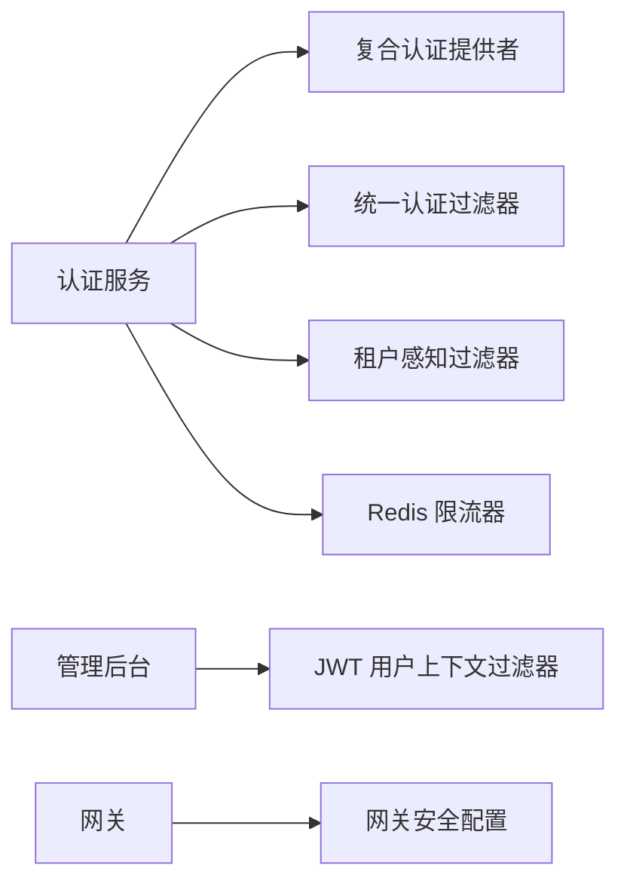

# 安全架构

<cite>
**本文引用的文件**
- [SsoAdminServerApplication.java](file://iam-admin-server/src/main/java/iam/platform/admin/SsoAdminServerApplication.java)
- [AdminSecurityConfig.java](file://iam-admin-server/src/main/java/iam/platform/admin/infrastructure/config/AdminSecurityConfig.java)
- [JwtUserContextFilter.java](file://iam-admin-server/src/main/java/iam/platform/admin/infrastructure/security/JwtUserContextFilter.java)
- [SsoAuthServerApplication.java](file://iam-auth-server/src/main/java/iam/platform/auth/SsoAuthServerApplication.java)
- [DefaultSecurityConfig.java](file://iam-auth-server/src/main/java/iam/platform/auth/infrastructure/config/DefaultSecurityConfig.java)
- [CompositeAuthenticationProvider.java](file://iam-auth-server/src/main/java/iam/platform/auth/infrastructure/security/CompositeAuthenticationProvider.java)
- [UnifiedAuthenticationFilter.java](file://iam-auth-server/src/main/java/iam/platform/auth/infrastructure/security/UnifiedAuthenticationFilter.java)
- [TenantAwareAuthenticationFilter.java](file://iam-auth-server/src/main/java/iam/platform/auth/infrastructure/security/TenantAwareAuthenticationFilter.java)
- [RedisBasedRateLimiter.java](file://iam-auth-server/src/main/java/iam/platform/auth/infrastructure/security/RedisBasedRateLimiter.java)
- [RateLimitHandler.java](file://iam-auth-server/src/main/java/iam/platform/auth/application/service/pipeline/RateLimitHandler.java)
- [IpWhitelistHandler.java](file://iam-auth-server/src/main/java/iam/platform/auth/application/service/pipeline/IpWhitelistHandler.java)
- [SecurityPolicyProperties.java](file://iam-auth-server/src/main/java/iam/platform/auth/infrastructure/config/SecurityPolicyProperties.java)
- [EncryptionProperties.java](file://iam-auth-server/src/main/java/iam/platform/auth/infrastructure/config/EncryptionProperties.java)
- [IamGatewayApplication.java](file://iam-gateway/src/main/java/iam/platform/gateway/IamGatewayApplication.java)
- [GatewaySecurityConfig.java](file://iam-gateway/src/main/java/iam/platform/gateway/infrastructure/security/GatewaySecurityConfig.java)
- [IamBffServerApplication.java](file://iam-bff-server/src/main/java/iam/platform/bff/IamBffServerApplication.java)
</cite>

## 目录
1. [引言](#引言)
2. [项目结构](#项目结构)
3. [核心组件](#核心组件)
4. [架构总览](#架构总览)
5. [详细组件分析](#详细组件分析)
6. [依赖分析](#依赖分析)
7. [性能考虑](#性能考虑)
8. [故障排查指南](#故障排查指南)
9. [结论](#结论)
10. [附录](#附录)

## 引言
本文件系统化梳理 IAM 平台的安全架构，覆盖多层防护体系（网络层、传输层、应用层、数据层），认证与授权机制（OAuth2/OIDC、JWT、权限评估、租户隔离），以及安全配置、加密与防护措施（速率限制、IP 白名单、会话管理、CSRF 防护）等。文档以代码为依据，结合架构图与流程图，帮助读者快速理解平台如何在工程层面实现安全目标。

## 项目结构
IAM 平台采用多服务分层设计：
- 网关层：统一入口与资源服务器校验
- 认证与授权服务：集中式认证、协议适配、统一认证过滤器、租户上下文恢复
- 管理后台服务：基于网关传递的用户上下文进行鉴权
- BFF 层：面向前端的聚合与协议适配
- 共享模块：通用 API、DTO、枚举与工具

图表来源
- [GatewaySecurityConfig.java:28-73](file://iam-gateway/src/main/java/iam/platform/gateway/infrastructure/security/GatewaySecurityConfig.java#L28-L73)
- [DefaultSecurityConfig.java:35-63](file://iam-auth-server/src/main/java/iam/platform/auth/infrastructure/config/DefaultSecurityConfig.java#L35-L63)
- [AdminSecurityConfig.java:18-34](file://iam-admin-server/src/main/java/iam/platform/admin/infrastructure/config/AdminSecurityConfig.java#L18-L34)

章节来源
- [IamGatewayApplication.java:7-14](file://iam-gateway/src/main/java/iam/platform/gateway/IamGatewayApplication.java#L7-L14)
- [SsoAuthServerApplication.java:9-18](file://iam-auth-server/src/main/java/iam/platform/auth/SsoAuthServerApplication.java#L9-L18)
- [SsoAdminServerApplication.java:8-16](file://iam-admin-server/src/main/java/iam/platform/admin/SsoAdminServerApplication.java#L8-L16)
- [IamBffServerApplication.java:8-16](file://iam-bff-server/src/main/java/iam/platform/bff/IamBffServerApplication.java#L8-L16)

## 核心组件
- 网关安全链：区分 OAuth2 登录链、资源服务器链与默认链，统一处理 JWT 校验与公开路径放行。
- 认证安全链：替换传统表单登录为统一认证过滤器，支持多种认证方法；引入复合认证提供者按凭据类型路由到对应策略。
- 租户上下文：登录后通过会话保存租户信息，后续请求由租户感知过滤器恢复上下文。
- 速率限制与 IP 策略：预认证管道中执行滑动窗口计数限流与黑白名单检查。
- 密码编码：BCrypt 编码器用于密码存储。
- 数据层加密：配置项暴露密钥字段，便于敏感数据加密策略落地。

章节来源
- [GatewaySecurityConfig.java:28-73](file://iam-gateway/src/main/java/iam/platform/gateway/infrastructure/security/GatewaySecurityConfig.java#L28-L73)
- [DefaultSecurityConfig.java:35-88](file://iam-auth-server/src/main/java/iam/platform/auth/infrastructure/config/DefaultSecurityConfig.java#L35-L88)
- [CompositeAuthenticationProvider.java:24-75](file://iam-auth-server/src/main/java/iam/platform/auth/infrastructure/security/CompositeAuthenticationProvider.java#L24-L75)
- [UnifiedAuthenticationFilter.java:18-79](file://iam-auth-server/src/main/java/iam/platform/auth/infrastructure/security/UnifiedAuthenticationFilter.java#L18-L79)
- [TenantAwareAuthenticationFilter.java:21-67](file://iam-auth-server/src/main/java/iam/platform/auth/infrastructure/security/TenantAwareAuthenticationFilter.java#L21-L67)
- [RedisBasedRateLimiter.java:19-124](file://iam-auth-server/src/main/java/iam/platform/auth/infrastructure/security/RedisBasedRateLimiter.java#L19-L124)
- [RateLimitHandler.java:14-42](file://iam-auth-server/src/main/java/iam/platform/auth/application/service/pipeline/RateLimitHandler.java#L14-L42)
- [IpWhitelistHandler.java:14-107](file://iam-auth-server/src/main/java/iam/platform/auth/application/service/pipeline/IpWhitelistHandler.java#L14-L107)
- [AdminSecurityConfig.java:18-39](file://iam-admin-server/src/main/java/iam/platform/admin/infrastructure/config/AdminSecurityConfig.java#L18-L39)
- [JwtUserContextFilter.java:25-87](file://iam-admin-server/src/main/java/iam/platform/admin/infrastructure/security/JwtUserContextFilter.java#L25-L87)
- [EncryptionProperties.java:12-14](file://iam-auth-server/src/main/java/iam/platform/auth/infrastructure/config/EncryptionProperties.java#L12-L14)

## 架构总览
下图展示从客户端到各服务的安全控制点与数据流：

图表来源
- [GatewaySecurityConfig.java:45-59](file://iam-gateway/src/main/java/iam/platform/gateway/infrastructure/security/GatewaySecurityConfig.java#L45-L59)
- [AdminSecurityConfig.java:18-34](file://iam-admin-server/src/main/java/iam/platform/admin/infrastructure/config/AdminSecurityConfig.java#L18-L34)
- [DefaultSecurityConfig.java:35-88](file://iam-auth-server/src/main/java/iam/platform/auth/infrastructure/config/DefaultSecurityConfig.java#L35-L88)
- [RedisBasedRateLimiter.java:32-108](file://iam-auth-server/src/main/java/iam/platform/auth/infrastructure/security/RedisBasedRateLimiter.java#L32-L108)

## 详细组件分析

### 网络层安全（API 网关）
- OAuth2 客户端链：仅对登录与授权路径放行，其余需认证。
- 资源服务器链：对 /admin/** 路径启用 JWT 校验，转换器负责将 JWT 映射为认证主体。
- 默认链：对公开路径（如 /auth/**、/actuator/**、/.well-known/**、/oauth2/jwks）放行。
- 未认证入口点：自定义认证入口点返回结构化 401 错误，区分过期、签名无效、发行方不合法、缺失令牌等场景。

图表来源
- [GatewaySecurityConfig.java:28-73](file://iam-gateway/src/main/java/iam/platform/gateway/infrastructure/security/GatewaySecurityConfig.java#L28-L73)
- [GatewaySecurityConfig.java:78-129](file://iam-gateway/src/main/java/iam/platform/gateway/infrastructure/security/GatewaySecurityConfig.java#L78-L129)

章节来源
- [GatewaySecurityConfig.java:28-129](file://iam-gateway/src/main/java/iam/platform/gateway/infrastructure/security/GatewaySecurityConfig.java#L28-L129)

### 应用层安全（Spring Security 配置）
- 管理后台：禁用 CSRF，无状态会话，添加 JWT 用户上下文过滤器，仅放行健康检查与文档路径。
- 认证服务：禁用 CSRF，配置 OAuth2 登录与统一认证过滤器，替换默认表单登录；添加租户感知过滤器恢复上下文；注册复合认证提供者与认证管理器。

图表来源
- [AdminSecurityConfig.java:18-39](file://iam-admin-server/src/main/java/iam/platform/admin/infrastructure/config/AdminSecurityConfig.java#L18-L39)
- [DefaultSecurityConfig.java:35-88](file://iam-auth-server/src/main/java/iam/platform/auth/infrastructure/config/DefaultSecurityConfig.java#L35-L88)
- [CompositeAuthenticationProvider.java:24-75](file://iam-auth-server/src/main/java/iam/platform/auth/infrastructure/security/CompositeAuthenticationProvider.java#L24-L75)
- [UnifiedAuthenticationFilter.java:18-79](file://iam-auth-server/src/main/java/iam/platform/auth/infrastructure/security/UnifiedAuthenticationFilter.java#L18-L79)
- [TenantAwareAuthenticationFilter.java:21-67](file://iam-auth-server/src/main/java/iam/platform/auth/infrastructure/security/TenantAwareAuthenticationFilter.java#L21-L67)

章节来源
- [AdminSecurityConfig.java:18-39](file://iam-admin-server/src/main/java/iam/platform/admin/infrastructure/config/AdminSecurityConfig.java#L18-L39)
- [DefaultSecurityConfig.java:35-88](file://iam-auth-server/src/main/java/iam/platform/auth/infrastructure/config/DefaultSecurityConfig.java#L35-L88)

### 认证与授权机制
- OAuth2/OIDC：认证服务启用 oauth2Login，登录页与用户信息加载由自定义服务完成，成功处理器统一分发至协议路由。
- 统一认证过滤器：统一入口 /login 接收多种认证方法（密码、短信、邮箱验证码、LDAP），解析隐藏 method 参数构造统一认证令牌交由认证管理器处理。
- 复合认证提供者：根据凭据类型自动选择策略，执行预认证流水线（速率限制、IP 白名单、账户状态等），再调用具体策略认证，记录成功或失败。
- 权限评估与租户隔离：租户上下文在登录后写入会话，后续请求由租户感知过滤器恢复；管理后台通过网关头注入的角色与权限构建授权主体。

图表来源
- [DefaultSecurityConfig.java:44-60](file://iam-auth-server/src/main/java/iam/platform/auth/infrastructure/config/DefaultSecurityConfig.java#L44-L60)
- [UnifiedAuthenticationFilter.java:31-62](file://iam-auth-server/src/main/java/iam/platform/auth/infrastructure/security/UnifiedAuthenticationFilter.java#L31-L62)
- [CompositeAuthenticationProvider.java:31-68](file://iam-auth-server/src/main/java/iam/platform/auth/infrastructure/security/CompositeAuthenticationProvider.java#L31-L68)
- [RateLimitHandler.java:18-21](file://iam-auth-server/src/main/java/iam/platform/auth/application/service/pipeline/RateLimitHandler.java#L18-L21)
- [IpWhitelistHandler.java:23-46](file://iam-auth-server/src/main/java/iam/platform/auth/application/service/pipeline/IpWhitelistHandler.java#L23-L46)
- [RedisBasedRateLimiter.java:32-108](file://iam-auth-server/src/main/java/iam/platform/auth/infrastructure/security/RedisBasedRateLimiter.java#L32-L108)

章节来源
- [DefaultSecurityConfig.java:35-88](file://iam-auth-server/src/main/java/iam/platform/auth/infrastructure/config/DefaultSecurityConfig.java#L35-L88)
- [UnifiedAuthenticationFilter.java:18-79](file://iam-auth-server/src/main/java/iam/platform/auth/infrastructure/security/UnifiedAuthenticationFilter.java#L18-L79)
- [CompositeAuthenticationProvider.java:24-75](file://iam-auth-server/src/main/java/iam/platform/auth/infrastructure/security/CompositeAuthenticationProvider.java#L24-L75)
- [TenantAwareAuthenticationFilter.java:21-67](file://iam-auth-server/src/main/java/iam/platform/auth/infrastructure/security/TenantAwareAuthenticationFilter.java#L21-L67)
- [JwtUserContextFilter.java:25-87](file://iam-admin-server/src/main/java/iam/platform/admin/infrastructure/security/JwtUserContextFilter.java#L25-L87)

### 数据层加密与密钥管理
- 密钥配置：提供 security.encryption.key 配置项，用于敏感数据加密策略参数化。
- 密码存储：使用 BCrypt 编码器，确保不可逆存储。
- 建议实践：密钥轮换应通过配置中心动态更新，密钥材料由 KMS 或密管系统托管，应用侧仅读取。

章节来源
- [EncryptionProperties.java:12-14](file://iam-auth-server/src/main/java/iam/platform/auth/infrastructure/config/EncryptionProperties.java#L12-L14)
- [AdminSecurityConfig.java:36-39](file://iam-admin-server/src/main/java/iam/platform/admin/infrastructure/config/AdminSecurityConfig.java#L36-L39)
- [DefaultSecurityConfig.java:81-93](file://iam-auth-server/src/main/java/iam/platform/auth/infrastructure/config/DefaultSecurityConfig.java#L81-L93)

### 防护措施
- 速率限制（防暴力破解）：滑动窗口计数，基于用户名/手机号/邮箱或 IP 作为标识键，超限则阻断并在响应中提示剩余等待时间。
- IP 白名单/黑名单：支持精确 IP 与 CIDR 段，黑名单优先于白名单，未配置时跳过。
- 会话管理：无状态会话策略（STATELESS），租户上下文通过会话恢复，避免 Cookie 持久化风险。
- CSRF 防护：在网关与后台禁用 CSRF，配合 JWT 无状态认证与严格的 CORS/来源校验。

图表来源
- [RateLimitHandler.java:18-21](file://iam-auth-server/src/main/java/iam/platform/auth/application/service/pipeline/RateLimitHandler.java#L18-L21)
- [RedisBasedRateLimiter.java:32-67](file://iam-auth-server/src/main/java/iam/platform/auth/infrastructure/security/RedisBasedRateLimiter.java#L32-L67)
- [IpWhitelistHandler.java:23-46](file://iam-auth-server/src/main/java/iam/platform/auth/application/service/pipeline/IpWhitelistHandler.java#L23-L46)
- [SecurityPolicyProperties.java:16-36](file://iam-auth-server/src/main/java/iam/platform/auth/infrastructure/config/SecurityPolicyProperties.java#L16-L36)

章节来源
- [RedisBasedRateLimiter.java:19-124](file://iam-auth-server/src/main/java/iam/platform/auth/infrastructure/security/RedisBasedRateLimiter.java#L19-L124)
- [RateLimitHandler.java:14-42](file://iam-auth-server/src/main/java/iam/platform/auth/application/service/pipeline/RateLimitHandler.java#L14-L42)
- [IpWhitelistHandler.java:14-107](file://iam-auth-server/src/main/java/iam/platform/auth/application/service/pipeline/IpWhitelistHandler.java#L14-L107)
- [SecurityPolicyProperties.java:13-37](file://iam-auth-server/src/main/java/iam/platform/auth/infrastructure/config/SecurityPolicyProperties.java#L13-L37)
- [AdminSecurityConfig.java:27-29](file://iam-admin-server/src/main/java/iam/platform/admin/infrastructure/config/AdminSecurityConfig.java#L27-L29)

## 依赖分析
- 组件耦合：认证服务通过复合认证提供者与策略解耦；预认证流水线将限流、IP 策略与状态校验抽象为可插拔处理器。
- 外部依赖：Redis 用于限流与会话上下文；BCrypt 用于密码编码；网关负责资源服务器 JWT 校验。
- 循环依赖：当前配置未见循环依赖迹象；过滤器链顺序明确（统一认证过滤器 → 租户上下文过滤器）。

图表来源
- [DefaultSecurityConfig.java:35-88](file://iam-auth-server/src/main/java/iam/platform/auth/infrastructure/config/DefaultSecurityConfig.java#L35-L88)
- [CompositeAuthenticationProvider.java:24-75](file://iam-auth-server/src/main/java/iam/platform/auth/infrastructure/security/CompositeAuthenticationProvider.java#L24-L75)
- [UnifiedAuthenticationFilter.java:18-79](file://iam-auth-server/src/main/java/iam/platform/auth/infrastructure/security/UnifiedAuthenticationFilter.java#L18-L79)
- [TenantAwareAuthenticationFilter.java:21-67](file://iam-auth-server/src/main/java/iam/platform/auth/infrastructure/security/TenantAwareAuthenticationFilter.java#L21-L67)
- [RedisBasedRateLimiter.java:19-124](file://iam-auth-server/src/main/java/iam/platform/auth/infrastructure/security/RedisBasedRateLimiter.java#L19-L124)
- [JwtUserContextFilter.java:25-87](file://iam-admin-server/src/main/java/iam/platform/admin/infrastructure/security/JwtUserContextFilter.java#L25-L87)
- [GatewaySecurityConfig.java:28-73](file://iam-gateway/src/main/java/iam/platform/gateway/infrastructure/security/GatewaySecurityConfig.java#L28-L73)

章节来源
- [DefaultSecurityConfig.java:35-88](file://iam-auth-server/src/main/java/iam/platform/auth/infrastructure/config/DefaultSecurityConfig.java#L35-L88)
- [AdminSecurityConfig.java:18-39](file://iam-admin-server/src/main/java/iam/platform/admin/infrastructure/config/AdminSecurityConfig.java#L18-L39)
- [GatewaySecurityConfig.java:28-73](file://iam-gateway/src/main/java/iam/platform/gateway/infrastructure/security/GatewaySecurityConfig.java#L28-L73)

## 性能考虑
- 无状态会话：减少服务端会话存储压力，提升横向扩展能力。
- Redis 限流：滑动窗口计数具备较好的抗突发能力，建议合理设置窗口与阈值，避免热点键竞争。
- 过滤器链顺序：将租户上下文恢复放在统一认证之后，降低后续请求的上下文解析成本。
- 密码编码：BCrypt 成本因子需结合硬件能力调整，平衡安全与性能。

## 故障排查指南
- 401 未授权：检查网关资源服务器链是否正确配置 JWT 转换器与认证入口点；确认令牌类型、签发方、有效期。
- 登录失败：查看统一认证过滤器参数解析是否完整；确认复合认证提供者是否识别到正确的认证方法；检查预认证流水线中的限流与 IP 策略。
- 速率限制触发：核对 Redis 可用性与键空间；确认标识键生成逻辑（优先使用用户名/手机号/邮箱，否则回退 IP）。
- 租户上下文丢失：确认会话中是否写入了租户 ID 与租户账号 ID；检查租户感知过滤器是否在过滤器链中生效。

章节来源
- [GatewaySecurityConfig.java:78-129](file://iam-gateway/src/main/java/iam/platform/gateway/infrastructure/security/GatewaySecurityConfig.java#L78-L129)
- [UnifiedAuthenticationFilter.java:43-71](file://iam-auth-server/src/main/java/iam/platform/auth/infrastructure/security/UnifiedAuthenticationFilter.java#L43-L71)
- [CompositeAuthenticationProvider.java:48-67](file://iam-auth-server/src/main/java/iam/platform/auth/infrastructure/security/CompositeAuthenticationProvider.java#L48-L67)
- [RedisBasedRateLimiter.java:32-108](file://iam-auth-server/src/main/java/iam/platform/auth/infrastructure/security/RedisBasedRateLimiter.java#L32-L108)
- [TenantAwareAuthenticationFilter.java:49-66](file://iam-auth-server/src/main/java/iam/platform/auth/infrastructure/security/TenantAwareAuthenticationFilter.java#L49-L66)

## 结论
该 IAM 平台通过“网关 + 认证服务 + 管理后台”的分层安全设计，实现了从入口到应用的多层防护。结合 OAuth2/OIDC、JWT、复合认证与租户上下文，满足多租户隔离与细粒度权限控制需求；预认证流水线将速率限制、IP 策略与账户状态检查前置，显著提升抗攻击能力。建议持续完善密钥轮换、审计日志与合规基线，并在生产环境细化限流阈值与告警策略。

## 附录
- 配置要点
  - 速率限制：开启、最大尝试次数、窗口秒数
  - 账户锁定：阈值、锁定时长
  - IP 白名单/黑名单：支持 CIDR
  - 加密密钥：security.encryption.key
- 建议增强
  - 引入 WAF/CDN 层面的 DDoS 防护
  - 完善审计事件采集与上报
  - 实施密钥生命周期管理与轮换自动化
  - 对关键接口增加二次验证与风控策略