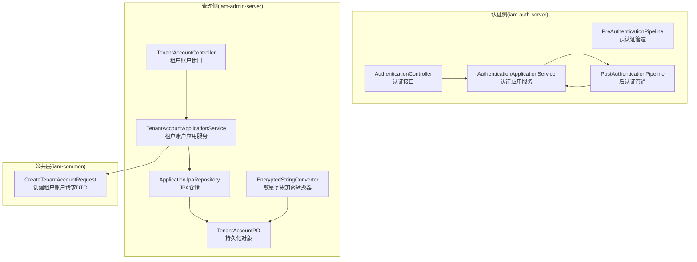
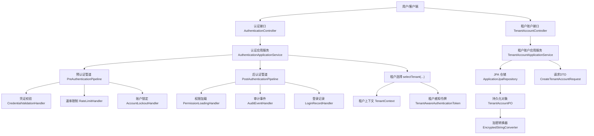
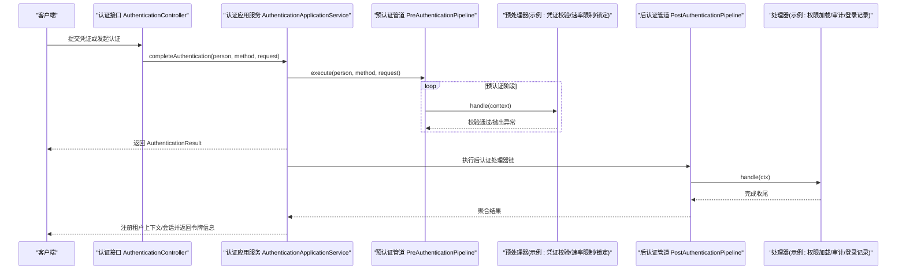
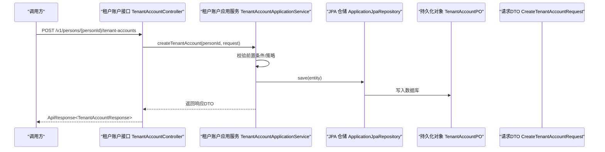
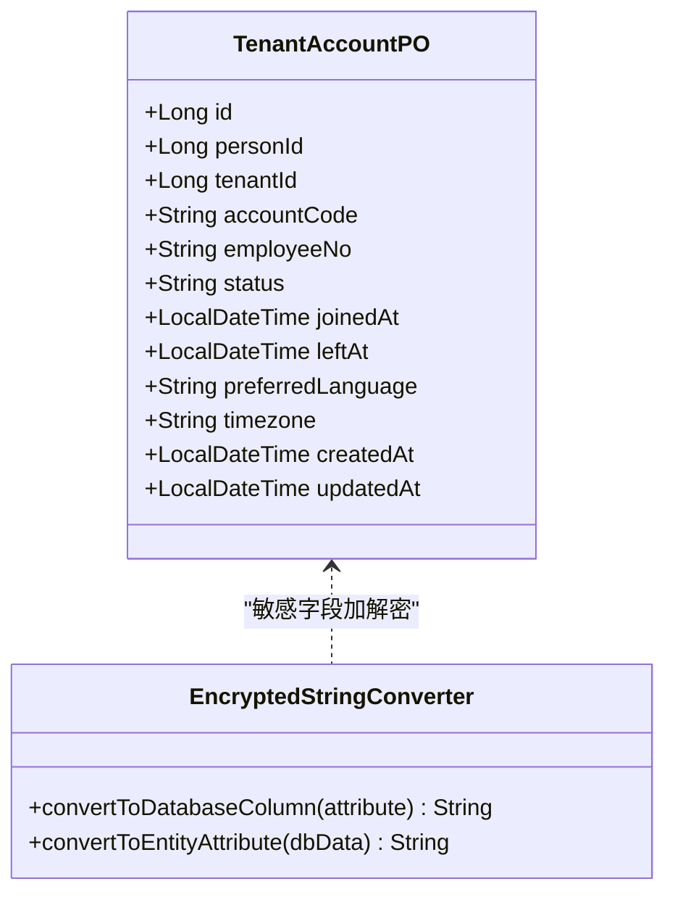
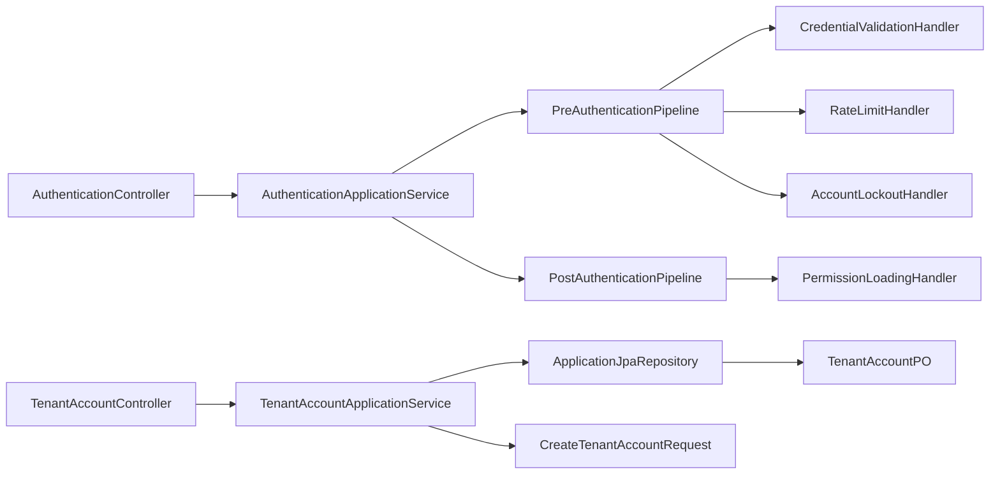

# 数据流设计

<cite>
**本文引用的文件**
- [PreAuthenticationPipeline.java](file://iam-auth-server/src/main/java/iam/platform/auth/application/service/pipeline/PreAuthenticationPipeline.java)
- [PostAuthenticationPipeline.java](file://iam-auth-server/src/main/java/iam/platform/auth/application/service/pipeline/PostAuthenticationPipeline.java)
- [PreAuthHandler.java](file://iam-auth-server/src/main/java/iam/platform/auth/application/service/pipeline/PreAuthHandler.java)
- [PostAuthHandler.java](file://iam-auth-server/src/main/java/iam/platform/auth/application/service/pipeline/PostAuthHandler.java)
- [CredentialValidationHandler.java](file://iam-auth-server/src/main/java/iam/platform/auth/application/service/pipeline/CredentialValidationHandler.java)
- [RateLimitHandler.java](file://iam-auth-server/src/main/java/iam/platform/auth/application/service/pipeline/RateLimitHandler.java)
- [AccountLockoutHandler.java](file://iam-auth-server/src/main/java/iam/platform/auth/application/service/pipeline/AccountLockoutHandler.java)
- [AuthenticationApplicationService.java](file://iam-auth-server/src/main/java/iam/platform/auth/application/service/AuthenticationApplicationService.java)
- [AuthenticationController.java](file://iam-auth-server/src/main/java/iam/platform/auth/interfaces/rest/AuthenticationController.java)
- [Person.java](file://iam-auth-server/src/main/java/iam/platform/auth/domain/model/entity/Person.java)
- [TenantAccountApplicationService.java](file://iam-admin-server/src/main/java/iam/platform/admin/application/service/TenantAccountApplicationService.java)
- [TenantAccountController.java](file://iam-admin-server/src/main/java/iam/platform/admin/interfaces/rest/TenantAccountController.java)
- [EncryptedStringConverter.java](file://iam-admin-server/src/main/java/iam/platform/admin/infrastructure/persistence/converter/EncryptedStringConverter.java)
- [ApplicationJpaRepository.java](file://iam-admin-server/src/main/java/iam/platform/admin/infrastructure/persistence/repository/ApplicationJpaRepository.java)
- [TenantAccountPO.java](file://iam-admin-server/src/main/java/iam/platform/admin/infrastructure/persistence/entity/TenantAccountPO.java)
- [CreateTenantAccountRequest.java](file://iam-common/src/main/java/iam/platform/common/dto/request/CreateTenantAccountRequest.java)
- [RedisConfig.java](file://iam-admin-server/src/main/java/iam/platform/admin/infrastructure/config/RedisConfig.java)
</cite>

## 目录
1. [引言](#引言)
2. [项目结构](#项目结构)
3. [核心组件](#核心组件)
4. [架构总览](#架构总览)
5. [详细组件分析](#详细组件分析)
6. [依赖分析](#依赖分析)
7. [性能考虑](#性能考虑)
8. [故障排查指南](#故障排查指南)
9. [结论](#结论)
10. [附录](#附录)

## 引言
本文件系统性梳理 IAM 平台的数据流设计，重点覆盖两大场景：
- 认证流程中的数据流：用户凭证输入 → 预认证管道处理 → 身份验证 → 后认证管道处理 → 令牌生成和返回
- 管理流程中的数据流：用户请求 → 权限验证 → 业务逻辑处理 → 数据持久化 → 响应返回

同时，文档阐述 DTO 转换、数据映射与序列化机制，解析数据访问层（JPA Repository 模式、Entity-PO 映射、数据加密）、缓存策略与一致性保障，并提供关键数据流图与时序图，帮助读者快速掌握典型业务场景下的数据处理步骤。

## 项目结构
IAM 平台采用多模块分层架构：
- 认证侧（iam-auth-server）：负责统一认证、预/后认证管道、安全上下文与令牌生成
- 管理侧（iam-admin-server）：负责租户账户、组织、角色、权限等管理能力
- 公共层（iam-common）：提供通用 DTO、枚举、异常与工具类
- 网关（iam-gateway）：负责路由与鉴权转换
- BFF（iam-bff-server）：面向前端的聚合与协议适配

图表来源
- [PreAuthenticationPipeline.java:1-61](file://iam-auth-server/src/main/java/iam/platform/auth/application/service/pipeline/PreAuthenticationPipeline.java#L1-L61)
- [PostAuthenticationPipeline.java:1-31](file://iam-auth-server/src/main/java/iam/platform/auth/application/service/pipeline/PostAuthenticationPipeline.java#L1-L31)
- [AuthenticationApplicationService.java:1-139](file://iam-auth-server/src/main/java/iam/platform/auth/application/service/AuthenticationApplicationService.java#L1-L139)
- [AuthenticationController.java:1-47](file://iam-auth-server/src/main/java/iam/platform/auth/interfaces/rest/AuthenticationController.java#L1-L47)
- [TenantAccountApplicationService.java:1-188](file://iam-admin-server/src/main/java/iam/platform/admin/application/service/TenantAccountApplicationService.java#L1-L188)
- [TenantAccountController.java:1-94](file://iam-admin-server/src/main/java/iam/platform/admin/interfaces/rest/TenantAccountController.java#L1-L94)
- [EncryptedStringConverter.java:1-109](file://iam-admin-server/src/main/java/iam/platform/admin/infrastructure/persistence/converter/EncryptedStringConverter.java#L1-L109)
- [ApplicationJpaRepository.java:1-18](file://iam-admin-server/src/main/java/iam/platform/admin/infrastructure/persistence/repository/ApplicationJpaRepository.java#L1-L18)
- [TenantAccountPO.java:1-82](file://iam-admin-server/src/main/java/iam/platform/admin/infrastructure/persistence/entity/TenantAccountPO.java#L1-L82)
- [CreateTenantAccountRequest.java:1-32](file://iam-common/src/main/java/iam/platform/common/dto/request/CreateTenantAccountRequest.java#L1-L32)

章节来源
- [PreAuthenticationPipeline.java:1-61](file://iam-auth-server/src/main/java/iam/platform/auth/application/service/pipeline/PreAuthenticationPipeline.java#L1-L61)
- [PostAuthenticationPipeline.java:1-31](file://iam-auth-server/src/main/java/iam/platform/auth/application/service/pipeline/PostAuthenticationPipeline.java#L1-L31)
- [AuthenticationApplicationService.java:1-139](file://iam-auth-server/src/main/java/iam/platform/auth/application/service/AuthenticationApplicationService.java#L1-L139)
- [TenantAccountApplicationService.java:1-188](file://iam-admin-server/src/main/java/iam/platform/admin/application/service/TenantAccountApplicationService.java#L1-L188)

## 核心组件
- 预认证管道（PreAuthenticationPipeline）
  - 职责：顺序执行所有 PreAuthHandler，完成参数校验、速率限制、账户锁定检查、IP 白名单、审计与登录记录等前置检查；失败时记录失败事件，成功时重置计数
  - 关键接口：PreAuthHandler
  - 典型处理器：CredentialValidationHandler、RateLimitHandler、AccountLockoutHandler、IpWhitelistHandler、AuditEventHandler、LoginRecordHandler、SecurityContextEstablishmentHandler、TenantResolutionHandler
- 后认证管道（PostAuthenticationPipeline）
  - 职责：在身份验证完成后执行一系列收尾处理，如权限加载、审计事件、会话建立、结果组装等
  - 关键接口：PostAuthHandler
  - 典型处理器：PermissionLoadingHandler、AuditEventHandler、LoginRecordHandler、SecurityContextEstablishmentHandler
- 认证应用服务（AuthenticationApplicationService）
  - 职责：完成认证收尾（运行后认证管道）、租户选择与上下文建立、权限集合构建、令牌上下文注册与会话存储
- 管理应用服务（TenantAccountApplicationService）
  - 职责：租户账户的创建、查询、更新、挂起/激活、离开等业务逻辑；跨聚合约束校验（如工号唯一性）；事务边界控制
- 数据访问层
  - JPA Repository 模式：通过 JpaRepository 接口定义查询契约，结合自定义方法实现复杂查询
  - Entity-PO 映射：Domain Model 与 JPA Entity 分离，PO 作为持久化载体，避免领域模型受 ORM 影响
  - 加密转换器：基于 AES-GCM 对敏感字段进行透明加解密，确保数据库层面的安全
- 缓存策略
  - Redis 缓存：启用 Spring Cache，统一 TTL、前缀与 JSON 序列化策略，用于热点数据缓存与一致性控制

章节来源
- [PreAuthHandler.java:1-18](file://iam-auth-server/src/main/java/iam/platform/auth/application/service/pipeline/PreAuthHandler.java#L1-L18)
- [PostAuthHandler.java:1-12](file://iam-auth-server/src/main/java/iam/platform/auth/application/service/pipeline/PostAuthHandler.java#L1-L12)
- [CredentialValidationHandler.java:1-97](file://iam-auth-server/src/main/java/iam/platform/auth/application/service/pipeline/CredentialValidationHandler.java#L1-L97)
- [RateLimitHandler.java:1-42](file://iam-auth-server/src/main/java/iam/platform/auth/application/service/pipeline/RateLimitHandler.java#L1-L42)
- [AccountLockoutHandler.java:1-42](file://iam-auth-server/src/main/java/iam/platform/auth/application/service/pipeline/AccountLockoutHandler.java#L1-L42)
- [AuthenticationApplicationService.java:1-139](file://iam-auth-server/src/main/java/iam/platform/auth/application/service/AuthenticationApplicationService.java#L1-L139)
- [TenantAccountApplicationService.java:1-188](file://iam-admin-server/src/main/java/iam/platform/admin/application/service/TenantAccountApplicationService.java#L1-L188)
- [EncryptedStringConverter.java:1-109](file://iam-admin-server/src/main/java/iam/platform/admin/infrastructure/persistence/converter/EncryptedStringConverter.java#L1-L109)
- [ApplicationJpaRepository.java:1-18](file://iam-admin-server/src/main/java/iam/platform/admin/infrastructure/persistence/repository/ApplicationJpaRepository.java#L1-L18)
- [TenantAccountPO.java:1-82](file://iam-admin-server/src/main/java/iam/platform/admin/infrastructure/persistence/entity/TenantAccountPO.java#L1-L82)
- [RedisConfig.java:1-30](file://iam-admin-server/src/main/java/iam/platform/admin/infrastructure/config/RedisConfig.java#L1-L30)

## 架构总览
下图展示了认证与管理两条主线的数据流路径，以及跨模块的交互关系。

图表来源
- [AuthenticationController.java:1-47](file://iam-auth-server/src/main/java/iam/platform/auth/interfaces/rest/AuthenticationController.java#L1-L47)
- [AuthenticationApplicationService.java:1-139](file://iam-auth-server/src/main/java/iam/platform/auth/application/service/AuthenticationApplicationService.java#L1-L139)
- [PreAuthenticationPipeline.java:1-61](file://iam-auth-server/src/main/java/iam/platform/auth/application/service/pipeline/PreAuthenticationPipeline.java#L1-L61)
- [PostAuthenticationPipeline.java:1-31](file://iam-auth-server/src/main/java/iam/platform/auth/application/service/pipeline/PostAuthenticationPipeline.java#L1-L31)
- [CredentialValidationHandler.java:1-97](file://iam-auth-server/src/main/java/iam/platform/auth/application/service/pipeline/CredentialValidationHandler.java#L1-L97)
- [RateLimitHandler.java:1-42](file://iam-auth-server/src/main/java/iam/platform/auth/application/service/pipeline/RateLimitHandler.java#L1-L42)
- [AccountLockoutHandler.java:1-42](file://iam-auth-server/src/main/java/iam/platform/auth/application/service/pipeline/AccountLockoutHandler.java#L1-L42)
- [TenantAccountController.java:1-94](file://iam-admin-server/src/main/java/iam/platform/admin/interfaces/rest/TenantAccountController.java#L1-L94)
- [TenantAccountApplicationService.java:1-188](file://iam-admin-server/src/main/java/iam/platform/admin/application/service/TenantAccountApplicationService.java#L1-L188)
- [ApplicationJpaRepository.java:1-18](file://iam-admin-server/src/main/java/iam/platform/admin/infrastructure/persistence/repository/ApplicationJpaRepository.java#L1-L18)
- [TenantAccountPO.java:1-82](file://iam-admin-server/src/main/java/iam/platform/admin/infrastructure/persistence/entity/TenantAccountPO.java#L1-L82)
- [EncryptedStringConverter.java:1-109](file://iam-admin-server/src/main/java/iam/platform/admin/infrastructure/persistence/converter/EncryptedStringConverter.java#L1-L109)
- [CreateTenantAccountRequest.java:1-32](file://iam-common/src/main/java/iam/platform/common/dto/request/CreateTenantAccountRequest.java#L1-L32)

## 详细组件分析

### 认证流程数据流（用户凭证输入 → 预认证 → 身份验证 → 后认证 → 令牌生成与返回）
该流程由认证接口触发，经统一认证应用服务协调，贯穿预/后认证管道，最终完成租户上下文与令牌注册。

图表来源
- [AuthenticationController.java:1-47](file://iam-auth-server/src/main/java/iam/platform/auth/interfaces/rest/AuthenticationController.java#L1-L47)
- [AuthenticationApplicationService.java:1-139](file://iam-auth-server/src/main/java/iam/platform/auth/application/service/AuthenticationApplicationService.java#L1-L139)
- [PreAuthenticationPipeline.java:1-61](file://iam-auth-server/src/main/java/iam/platform/auth/application/service/pipeline/PreAuthenticationPipeline.java#L1-L61)
- [PostAuthenticationPipeline.java:1-31](file://iam-auth-server/src/main/java/iam/platform/auth/application/service/pipeline/PostAuthenticationPipeline.java#L1-L31)
- [CredentialValidationHandler.java:1-97](file://iam-auth-server/src/main/java/iam/platform/auth/application/service/pipeline/CredentialValidationHandler.java#L1-L97)
- [RateLimitHandler.java:1-42](file://iam-auth-server/src/main/java/iam/platform/auth/application/service/pipeline/RateLimitHandler.java#L1-L42)
- [AccountLockoutHandler.java:1-42](file://iam-auth-server/src/main/java/iam/platform/auth/application/service/pipeline/AccountLockoutHandler.java#L1-L42)

章节来源
- [AuthenticationController.java:1-47](file://iam-auth-server/src/main/java/iam/platform/auth/interfaces/rest/AuthenticationController.java#L1-L47)
- [AuthenticationApplicationService.java:1-139](file://iam-auth-server/src/main/java/iam/platform/auth/application/service/AuthenticationApplicationService.java#L1-L139)
- [PreAuthenticationPipeline.java:1-61](file://iam-auth-server/src/main/java/iam/platform/auth/application/service/pipeline/PreAuthenticationPipeline.java#L1-L61)
- [PostAuthenticationPipeline.java:1-31](file://iam-auth-server/src/main/java/iam/platform/auth/application/service/pipeline/PostAuthenticationPipeline.java#L1-L31)

### 管理流程数据流（用户请求 → 权限验证 → 业务逻辑 → 数据持久化 → 响应返回）
以“租户账户管理”为例，展示从接口到应用服务再到仓储与持久化的完整数据流。

图表来源
- [TenantAccountController.java:1-94](file://iam-admin-server/src/main/java/iam/platform/admin/interfaces/rest/TenantAccountController.java#L1-L94)
- [TenantAccountApplicationService.java:1-188](file://iam-admin-server/src/main/java/iam/platform/admin/application/service/TenantAccountApplicationService.java#L1-L188)
- [ApplicationJpaRepository.java:1-18](file://iam-admin-server/src/main/java/iam/platform/admin/infrastructure/persistence/repository/ApplicationJpaRepository.java#L1-L18)
- [TenantAccountPO.java:1-82](file://iam-admin-server/src/main/java/iam/platform/admin/infrastructure/persistence/entity/TenantAccountPO.java#L1-L82)
- [CreateTenantAccountRequest.java:1-32](file://iam-common/src/main/java/iam/platform/common/dto/request/CreateTenantAccountRequest.java#L1-L32)

章节来源
- [TenantAccountController.java:1-94](file://iam-admin-server/src/main/java/iam/platform/admin/interfaces/rest/TenantAccountController.java#L1-L94)
- [TenantAccountApplicationService.java:1-188](file://iam-admin-server/src/main/java/iam/platform/admin/application/service/TenantAccountApplicationService.java#L1-L188)

### 数据传输与映射（DTO/VO/PO）
- 请求 DTO：CreateTenantAccountRequest 定义了创建租户账户所需的字段与校验规则
- 响应 DTO：各控制器返回的 ApiResponse<TenantAccountResponse> 等封装响应体
- 领域模型：Person 等实体承载业务行为与状态
- 持久化对象：TenantAccountPO 等 PO 承载数据库字段与注解映射
- 映射策略：应用服务在业务处理后将领域对象或 PO 转换为响应 DTO 返回

章节来源
- [CreateTenantAccountRequest.java:1-32](file://iam-common/src/main/java/iam/platform/common/dto/request/CreateTenantAccountRequest.java#L1-L32)
- [Person.java:1-158](file://iam-auth-server/src/main/java/iam/platform/auth/domain/model/entity/Person.java#L1-L158)
- [TenantAccountPO.java:1-82](file://iam-admin-server/src/main/java/iam/platform/admin/infrastructure/persistence/entity/TenantAccountPO.java#L1-L82)
- [TenantAccountApplicationService.java:1-188](file://iam-admin-server/src/main/java/iam/platform/admin/application/service/TenantAccountApplicationService.java#L1-L188)

### 数据访问层设计（JPA Repository、Entity-PO 映射、加密处理）
- JPA Repository 模式
  - 通过接口声明查询契约，如 ApplicationJpaRepository 提供按租户查询、统计等功能
  - 实现由 Spring Data JPA 自动生成，减少样板代码
- Entity-PO 映射
  - 领域模型（如 Person）与 JPA 实体（如 TenantAccountPO）分离，PO 仅承担持久化职责
  - PO 使用标准 JPA 注解（@Entity、@Table、@Column、时间戳注解等）定义表结构
- 数据加密处理
  - EncryptedStringConverter 使用 AES-GCM 对敏感字段进行透明加解密
  - 支持配置开关与降级策略，确保密钥有效时启用加密，无效时记录告警并保持功能可用

图表来源
- [TenantAccountPO.java:1-82](file://iam-admin-server/src/main/java/iam/platform/admin/infrastructure/persistence/entity/TenantAccountPO.java#L1-L82)
- [EncryptedStringConverter.java:1-109](file://iam-admin-server/src/main/java/iam/platform/admin/infrastructure/persistence/converter/EncryptedStringConverter.java#L1-L109)

章节来源
- [ApplicationJpaRepository.java:1-18](file://iam-admin-server/src/main/java/iam/platform/admin/infrastructure/persistence/repository/ApplicationJpaRepository.java#L1-L18)
- [TenantAccountPO.java:1-82](file://iam-admin-server/src/main/java/iam/platform/admin/infrastructure/persistence/entity/TenantAccountPO.java#L1-L82)
- [EncryptedStringConverter.java:1-109](file://iam-admin-server/src/main/java/iam/platform/admin/infrastructure/persistence/converter/EncryptedStringConverter.java#L1-L109)

### 缓存策略与一致性保障（Redis）
- 缓存配置
  - RedisCacheManager 默认 TTL 5 分钟，禁用空值缓存，使用 JSON 序列化
  - 统一缓存前缀，便于运维与清理
- 使用场景
  - 热点查询结果缓存（如应用列表、租户账户列表等）
  - 租户/用户元数据缓存（需结合失效策略）
- 失效策略
  - 写操作后主动失效相关缓存键
  - 设置合理 TTL，避免陈旧数据影响业务正确性
  - 对于强一致要求的读写链路，可采用读写绕过缓存或短 TTL

章节来源
- [RedisConfig.java:1-30](file://iam-admin-server/src/main/java/iam/platform/admin/infrastructure/config/RedisConfig.java#L1-L30)

## 依赖分析
- 认证侧
  - AuthenticationController 依赖 AuthenticationApplicationService
  - AuthenticationApplicationService 依赖 PostAuthenticationPipeline、仓储与上下文
  - Pipeline 通过 Spring 自动发现 PostAuthHandler/PreAuthHandler 顺序执行
- 管理侧
  - TenantAccountController 依赖 TenantAccountApplicationService
  - TenantAccountApplicationService 依赖仓储、领域策略与请求 DTO
  - 仓储接口与 PO 解耦，便于替换实现与测试

图表来源
- [AuthenticationController.java:1-47](file://iam-auth-server/src/main/java/iam/platform/auth/interfaces/rest/AuthenticationController.java#L1-L47)
- [AuthenticationApplicationService.java:1-139](file://iam-auth-server/src/main/java/iam/platform/auth/application/service/AuthenticationApplicationService.java#L1-L139)
- [PreAuthenticationPipeline.java:1-61](file://iam-auth-server/src/main/java/iam/platform/auth/application/service/pipeline/PreAuthenticationPipeline.java#L1-L61)
- [PostAuthenticationPipeline.java:1-31](file://iam-auth-server/src/main/java/iam/platform/auth/application/service/pipeline/PostAuthenticationPipeline.java#L1-L31)
- [CredentialValidationHandler.java:1-97](file://iam-auth-server/src/main/java/iam/platform/auth/application/service/pipeline/CredentialValidationHandler.java#L1-L97)
- [RateLimitHandler.java:1-42](file://iam-auth-server/src/main/java/iam/platform/auth/application/service/pipeline/RateLimitHandler.java#L1-L42)
- [AccountLockoutHandler.java:1-42](file://iam-auth-server/src/main/java/iam/platform/auth/application/service/pipeline/AccountLockoutHandler.java#L1-L42)
- [TenantAccountController.java:1-94](file://iam-admin-server/src/main/java/iam/platform/admin/interfaces/rest/TenantAccountController.java#L1-L94)
- [TenantAccountApplicationService.java:1-188](file://iam-admin-server/src/main/java/iam/platform/admin/application/service/TenantAccountApplicationService.java#L1-L188)
- [ApplicationJpaRepository.java:1-18](file://iam-admin-server/src/main/java/iam/platform/admin/infrastructure/persistence/repository/ApplicationJpaRepository.java#L1-L18)
- [TenantAccountPO.java:1-82](file://iam-admin-server/src/main/java/iam/platform/admin/infrastructure/persistence/entity/TenantAccountPO.java#L1-L82)
- [CreateTenantAccountRequest.java:1-32](file://iam-common/src/main/java/iam/platform/common/dto/request/CreateTenantAccountRequest.java#L1-L32)

## 性能考虑
- 预认证阶段尽早失败，减少后续昂贵操作
- 速率限制与账户锁定采用 Redis 计数，降低数据库压力
- 缓存命中率优化：热点数据短 TTL + 主动失效，兼顾一致性与性能
- 加密转换器仅对必要字段启用，避免全量加解密带来的开销
- 分页查询与投影查询，避免一次性加载大结果集

## 故障排查指南
- 认证失败
  - 检查预处理器是否抛出异常（如凭证格式错误、超出速率限制、账户被锁定）
  - 查看后处理器是否正常执行（权限加载、审计、登录记录）
- 管理操作异常
  - 关注应用服务中的跨聚合约束（如工号唯一性），确认异常类型与提示
  - 检查仓储保存是否成功，关注事务边界
- 加密问题
  - 核对加密密钥长度与格式，确认转换器启用状态
  - 观察日志告警，必要时临时关闭加密定位问题

章节来源
- [PreAuthenticationPipeline.java:1-61](file://iam-auth-server/src/main/java/iam/platform/auth/application/service/pipeline/PreAuthenticationPipeline.java#L1-L61)
- [PostAuthenticationPipeline.java:1-31](file://iam-auth-server/src/main/java/iam/platform/auth/application/service/pipeline/PostAuthenticationPipeline.java#L1-L31)
- [TenantAccountApplicationService.java:1-188](file://iam-admin-server/src/main/java/iam/platform/admin/application/service/TenantAccountApplicationService.java#L1-L188)
- [EncryptedStringConverter.java:1-109](file://iam-admin-server/src/main/java/iam/platform/admin/infrastructure/persistence/converter/EncryptedStringConverter.java#L1-L109)

## 结论
本设计通过“预/后认证管道”将横切关注点（速率限制、账户锁定、审计、权限加载等）模块化，既保证了认证流程的可扩展性，也提升了安全性与可观测性。管理侧以应用服务为核心，严格控制事务边界与跨聚合约束，配合 JPA 仓储与 PO 映射，实现了清晰的分层与高内聚低耦合。加密转换器与 Redis 缓存进一步强化了数据安全与性能表现。整体数据流设计兼顾了可维护性、可扩展性与可靠性。

## 附录
- 关键数据流图与时序图已在前述章节中给出，建议结合具体文件路径定位实现细节
- 如需深入某一流程（如登录、权限检查、数据更新），可参考对应章节的“章节来源”跳转至源码