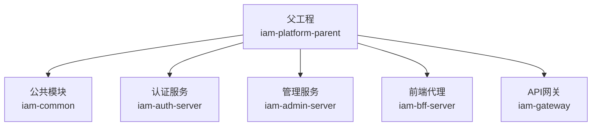
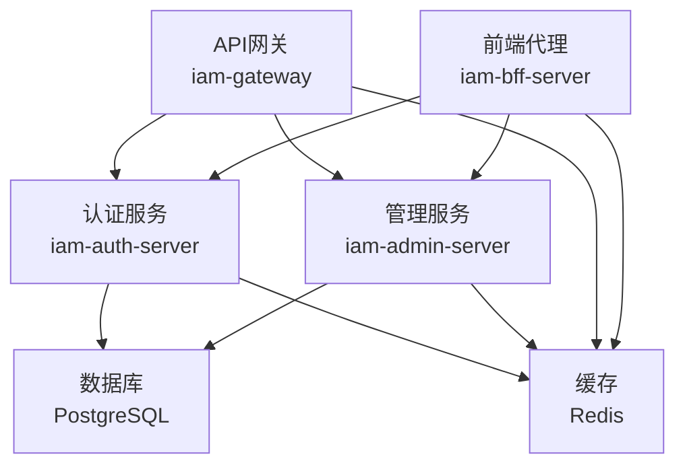
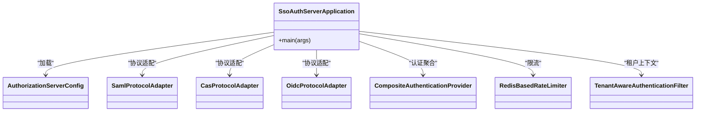
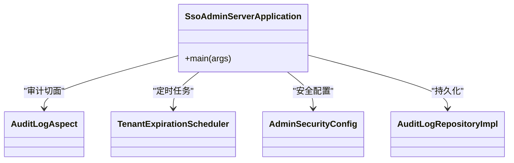
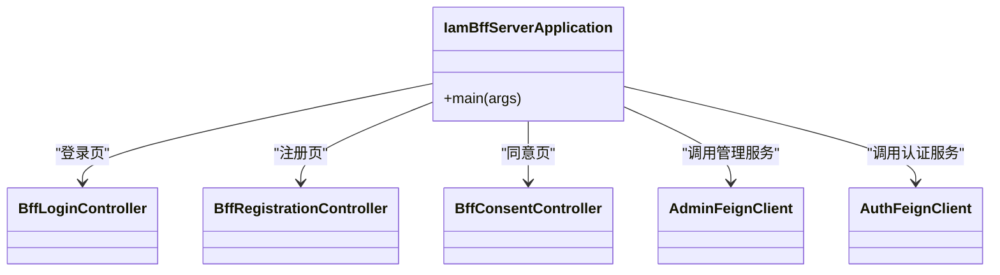
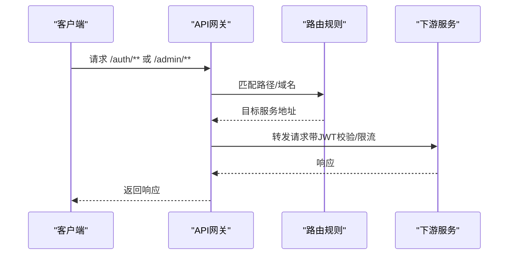
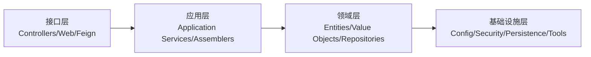
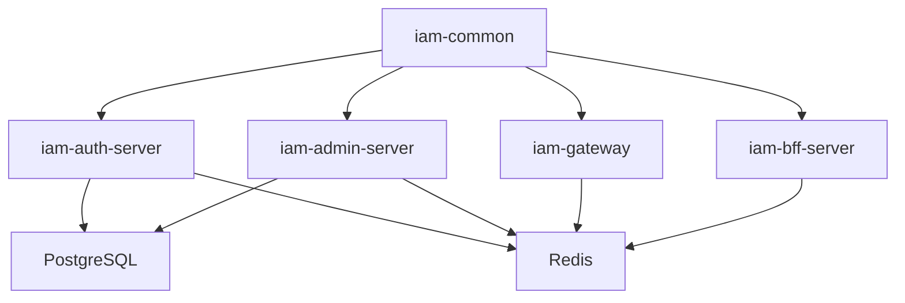

# 整体架构

<cite>
**本文引用的文件**
- [pom.xml](file://pom.xml)
- [iam-admin-server/pom.xml](file://iam-admin-server/pom.xml)
- [iam-auth-server/pom.xml](file://iam-auth-server/pom.xml)
- [iam-bff-server/pom.xml](file://iam-bff-server/pom.xml)
- [iam-gateway/pom.xml](file://iam-gateway/pom.xml)
- [iam-admin-server/src/main/java/iam/platform/admin/SsoAdminServerApplication.java](file://iam-admin-server/src/main/java/iam/platform/admin/SsoAdminServerApplication.java)
- [iam-auth-server/src/main/java/iam/platform/auth/SsoAuthServerApplication.java](file://iam-auth-server/src/main/java/iam/platform/auth/SsoAuthServerApplication.java)
- [iam-bff-server/src/main/java/iam/platform/bff/IamBffServerApplication.java](file://iam-bff-server/src/main/java/iam/platform/bff/IamBffServerApplication.java)
- [iam-gateway/src/main/java/iam/platform/gateway/IamGatewayApplication.java](file://iam-gateway/src/main/java/iam/platform/gateway/IamGatewayApplication.java)
- [iam-admin-server/src/main/resources/application.yml](file://iam-admin-server/src/main/resources/application.yml)
- [iam-auth-server/src/main/resources/application.yml](file://iam-auth-server/src/main/resources/application.yml)
- [iam-bff-server/src/main/resources/application.yml](file://iam-bff-server/src/main/resources/application.yml)
- [iam-gateway/src/main/resources/application.yml](file://iam-gateway/src/main/resources/application.yml)
- [iam-common/src/main/java/iam/platform/common/model/enums/AuditEventType.java](file://iam-common/src/main/java/iam/platform/common/model/enums/AuditEventType.java)
- [docs/design/Spring Authorization Server 原理与流程.md](file://docs/design/Spring Authorization Server 原理与流程.md)
</cite>

## 目录
1. [引言](#引言)
2. [项目结构](#项目结构)
3. [核心组件](#核心组件)
4. [架构总览](#架构总览)
5. [详细组件分析](#详细组件分析)
6. [依赖分析](#依赖分析)
7. [性能考虑](#性能考虑)
8. [故障排查指南](#故障排查指南)
9. [结论](#结论)
10. [附录](#附录)

## 引言
本文件面向IAM平台的整体架构，系统采用微服务架构，围绕“认证即服务”的核心目标，通过四个独立服务协同工作：认证服务器（iam-auth-server）、管理服务器（iam-admin-server）、前端代理服务器（iam-bff-server）与API网关（iam-gateway）。系统同时在工程层面体现Clean Architecture与领域驱动设计（DDD）思想，强调分层解耦、领域模型内聚与基础设施可替换性。技术栈方面，统一基于Spring Boot 3.2.5、Spring Cloud生态、PostgreSQL与Redis，结合OpenFeign、Nacos、Zipkin/Micrometer等组件，构建高可用、可观测、可扩展的企业级身份与访问管理体系。

## 项目结构
项目采用多模块Maven父工程组织，四大服务模块与公共模块清晰分离，便于独立开发、测试与部署。父POM集中管理版本与依赖，子模块按需引入所需依赖，确保一致性与可维护性。

图表来源
- [pom.xml:21-27](file://pom.xml#L21-L27)

章节来源
- [pom.xml:1-226](file://pom.xml#L1-L226)

## 核心组件
- 认证服务器（iam-auth-server）
  - 职责：作为OAuth2/OIDC授权服务器与统一认证入口，支持SAML 2.0、CAS协议适配，提供登录页、同意页、注册页、验证码登录、LDAP/AD集成、账户风控策略与审计事件。
  - 关键能力：Spring Authorization Server、OpenSAML、Spring Security CAS、LDAP、Redis会话、速率限制、账户锁定、审计日志。
- 管理服务器（iam-admin-server）
  - 职责：用户管理、权限控制、组织架构、审计日志、仪表盘统计、租户生命周期管理、密码策略与唯一性校验。
  - 关键能力：Spring Data JPA、Flyway迁移、Redis会话、AOP审计切面、异步审计线程池、OAuth2客户端登录。
- 前端代理服务器（iam-bff-server）
  - 职责：聚合后端服务接口、简化前端调用、页面模板渲染、统一登录/注册/同意页处理、与认证/管理服务通信。
  - 关键能力：OpenFeign、Thymeleaf、Nacos发现、负载均衡、Tracing/Metrics。
- API网关（iam-gateway）
  - 职责：统一入口、路由转发、安全过滤（JWT校验）、跨域、限流、健康检查暴露。
  - 关键能力：Spring Cloud Gateway、Reactive Redis限流、OAuth2资源服务器、全局CORS。

章节来源
- [iam-auth-server/pom.xml:18-180](file://iam-auth-server/pom.xml#L18-L180)
- [iam-admin-server/pom.xml:18-150](file://iam-admin-server/pom.xml#L18-L150)
- [iam-bff-server/pom.xml:18-107](file://iam-bff-server/pom.xml#L18-L107)
- [iam-gateway/pom.xml:17-106](file://iam-gateway/pom.xml#L17-L106)

## 架构总览
系统采用“网关+服务”分层，网关负责外部请求接入与统一安全策略，内部服务通过服务发现与负载均衡协作。认证与管理服务分别承担“身份认证/授权”和“业务管理/审计”的职责，BFF为前端提供统一体验，公共模块承载通用DTO、枚举与异常定义。

图表来源
- [iam-gateway/src/main/resources/application.yml:18-54](file://iam-gateway/src/main/resources/application.yml#L18-L54)
- [iam-auth-server/src/main/resources/application.yml:15-37](file://iam-auth-server/src/main/resources/application.yml#L15-L37)
- [iam-admin-server/src/main/resources/application.yml:15-37](file://iam-admin-server/src/main/resources/application.yml#L15-L37)

## 详细组件分析

### 认证服务器（iam-auth-server）
- 应用入口与扫描
  - 启动类启用Feign客户端扫描与JPA仓库扫描，确保服务间调用与持久化可用。
- 协议与安全
  - OIDC/OAuth2授权服务器、SAML 2.0（OpenSAML）、CAS适配、LDAP/AD集成、自定义OAuth2用户服务与过滤器链。
- 审计与风控
  - 速率限制、账户锁定、IP白名单/黑名单、审计事件记录。
- 配置要点
  - 数据源、Redis、Thymeleaf模板、JWK密钥、安全策略、LDAP/CAS参数、监控指标与Zipkin追踪。

图表来源
- [iam-auth-server/src/main/java/iam/platform/auth/SsoAuthServerApplication.java:9-18](file://iam-auth-server/src/main/java/iam/platform/auth/SsoAuthServerApplication.java#L9-L18)
- [iam-auth-server/src/main/resources/application.yml:54-126](file://iam-auth-server/src/main/resources/application.yml#L54-L126)

章节来源
- [iam-auth-server/src/main/java/iam/platform/auth/SsoAuthServerApplication.java:1-19](file://iam-auth-server/src/main/java/iam/platform/auth/SsoAuthServerApplication.java#L1-L19)
- [iam-auth-server/src/main/resources/application.yml:1-144](file://iam-auth-server/src/main/resources/application.yml#L1-L144)

### 管理服务器（iam-admin-server）
- 应用入口与扫描
  - 启动类启用配置属性扫描与JPA仓库扫描，配合AOP审计与Redis会话。
- 业务能力
  - 租户、组织、人员、角色、权限、应用管理，审计日志异步写入与保留策略。
- 配置要点
  - 数据源、Redis、Flyway迁移、OAuth2客户端（用于从认证服务登录）、监控与Zipkin。

图表来源
- [iam-admin-server/src/main/java/iam/platform/admin/SsoAdminServerApplication.java:8-16](file://iam-admin-server/src/main/java/iam/platform/admin/SsoAdminServerApplication.java#L8-L16)
- [iam-admin-server/src/main/resources/application.yml:66-102](file://iam-admin-server/src/main/resources/application.yml#L66-L102)

章节来源
- [iam-admin-server/src/main/java/iam/platform/admin/SsoAdminServerApplication.java:1-17](file://iam-admin-server/src/main/java/iam/platform/admin/SsoAdminServerApplication.java#L1-L17)
- [iam-admin-server/src/main/resources/application.yml:1-102](file://iam-admin-server/src/main/resources/application.yml#L1-L102)

### 前端代理服务器（iam-bff-server）
- 角色定位
  - 以BFF模式聚合后端服务，屏蔽复杂性，提供统一登录/注册/同意页与简化API。
- 能力特性
  - OpenFeign客户端、Thymeleaf模板、Nacos服务发现、负载均衡、Tracing/Metrics。
- 配置要点
  - Feign超时、模板前缀/后缀、监控与Zipkin。

图表来源
- [iam-bff-server/src/main/java/iam/platform/bff/IamBffServerApplication.java:8-16](file://iam-bff-server/src/main/java/iam/platform/bff/IamBffServerApplication.java#L8-L16)
- [iam-bff-server/src/main/resources/application.yml:25-48](file://iam-bff-server/src/main/resources/application.yml#L25-L48)

章节来源
- [iam-bff-server/src/main/java/iam/platform/bff/IamBffServerApplication.java:1-17](file://iam-bff-server/src/main/java/iam/platform/bff/IamBffServerApplication.java#L1-L17)
- [iam-bff-server/src/main/resources/application.yml:1-54](file://iam-bff-server/src/main/resources/application.yml#L1-L54)

### API网关（iam-gateway）
- 路由与安全
  - 手动路由配置（基于路径与域名），全局跨域，JWT资源服务器校验，Redis限流。
- 运维可观测
  - 暴露health、info、metrics、gateway端点，Prometheus与Zipkin集成。
- 配置要点
  - 路由规则、Host匹配、全局CORS、OAuth2客户端与JWT issuer、Redis连接。

图表来源
- [iam-gateway/src/main/resources/application.yml:18-68](file://iam-gateway/src/main/resources/application.yml#L18-L68)

章节来源
- [iam-gateway/src/main/java/iam/platform/gateway/IamGatewayApplication.java:1-15](file://iam-gateway/src/main/java/iam/platform/gateway/IamGatewayApplication.java#L1-L15)
- [iam-gateway/src/main/resources/application.yml:1-116](file://iam-gateway/src/main/resources/application.yml#L1-L116)

### Clean Architecture 与 DDD 实践
- 分层理念
  - 接口层（Interfaces）：REST控制器、Web控制器、Feign客户端。
  - 应用层（Application）：应用服务、装配器、DTO转换。
  - 领域层（Domain）：实体、值对象、仓储接口、领域服务。
  - 基础设施层（Infrastructure）：配置、安全、持久化实现、工具组件。
- 在认证服务中的体现
  - 接口层包含OAuth2/OIDC、SAML、CAS、登录/注册/同意页控制器；应用层封装认证流程与协议适配；领域层包含用户、角色、客户端等实体与权限评估；基础设施层提供授权服务器配置、OpenSAML、Redis会话、JPA实现等。
- 在管理服务中的体现
  - 接口层为REST CRUD控制器；应用层封装组织、人员、角色、权限、租户等业务应用服务；领域层为实体与仓储接口；基础设施层含AOP审计、Redis配置、JPA实现、Flyway迁移等。

图表来源
- [docs/design/Spring Authorization Server 原理与流程.md:52-84](file://docs/design/Spring Authorization Server 原理与流程.md#L52-L84)

章节来源
- [docs/design/Spring Authorization Server 原理与流程.md:52-84](file://docs/design/Spring Authorization Server 原理与流程.md#L52-L84)

## 依赖分析
- 模块依赖
  - 四大服务模块均依赖公共模块iam-common，共享DTO、枚举、注解与异常定义。
- 外部依赖
  - 认证与管理服务：PostgreSQL、Redis、Spring Authorization Server、OpenSAML、LDAP、Zipkin/Micrometer。
  - 网关与BFF：Spring Cloud Gateway、OpenFeign、Nacos、Zipkin/Micrometer。
- 版本与BOM
  - 父POM统一管理Spring Boot、Spring Cloud、MapStruct、OpenSAML等版本，确保一致性。

图表来源
- [pom.xml:63-121](file://pom.xml#L63-L121)
- [iam-auth-server/pom.xml:18-180](file://iam-auth-server/pom.xml#L18-L180)
- [iam-admin-server/pom.xml:18-150](file://iam-admin-server/pom.xml#L18-L150)
- [iam-bff-server/pom.xml:18-107](file://iam-bff-server/pom.xml#L18-L107)
- [iam-gateway/pom.xml:17-106](file://iam-gateway/pom.xml#L17-L106)

章节来源
- [pom.xml:1-226](file://pom.xml#L1-L226)

## 性能考虑
- 连接池与数据库
  - HikariCP连接池参数在各服务中保持一致，建议根据QPS与事务特性调整最大池大小、空闲超时与最大生命周期。
- 缓存与会话
  - Redis用于分布式会话与限流，建议开启持久化与主从复制，合理设置过期策略与内存上限。
- 限流与降载
  - 网关与认证服务内置限流策略，建议结合Redis限流器与熔断降载策略，避免雪崩。
- 监控与追踪
  - Prometheus指标与Zipkin链路追踪已启用，建议完善告警阈值与关键指标面板。

## 故障排查指南
- 认证失败/登录异常
  - 检查OIDC Issuer URI、JWK密钥位置、客户端ID/Secret是否正确；确认LDAP/CAS配置与网络连通性。
- 会话丢失/并发问题
  - 核对Redis连接参数与命名空间、会话存储类型与过期时间；排查Redis集群状态。
- 网关路由不生效
  - 检查路由规则（路径/域名）、负载均衡、服务发现是否正常；确认JWT校验与跨域配置。
- 审计日志缺失
  - 确认审计开关、异步线程池配置、保留天数与数据库连接；检查AOP审计切面是否生效。

章节来源
- [iam-auth-server/src/main/resources/application.yml:81-126](file://iam-auth-server/src/main/resources/application.yml#L81-L126)
- [iam-admin-server/src/main/resources/application.yml:93-102](file://iam-admin-server/src/main/resources/application.yml#L93-L102)
- [iam-gateway/src/main/resources/application.yml:18-68](file://iam-gateway/src/main/resources/application.yml#L18-L68)

## 结论
本IAM平台通过清晰的服务边界与分层架构，实现了认证、管理、前端代理与网关的协同工作。Clean Architecture与DDD思想贯穿代码组织，使领域模型稳定、应用逻辑清晰、基础设施可替换。技术栈选择兼顾企业级稳定性与现代化能力，结合可观测性与安全策略，满足高可用与可扩展需求。

## 附录
- 审计事件类型概览（来源于公共模块枚举）
  - 认证类：登录成功/失败、登出、令牌刷新、短信/邮箱验证码发送。
  - 授权类：角色分配/撤销、权限变更。
  - 账户类：人员创建/更新/删除、租户账户创建/更新、密码修改、账户锁定/解锁。
  - 管理类：租户创建/更新/激活/停用/删除、组织创建/更新/删除、应用创建/更新/删除/启用/禁用、角色创建/删除、权限创建/删除。
  - 会话类：租户选择、会话过期。

章节来源
- [iam-common/src/main/java/iam/platform/common/model/enums/AuditEventType.java:1-59](file://iam-common/src/main/java/iam/platform/common/model/enums/AuditEventType.java#L1-L59)