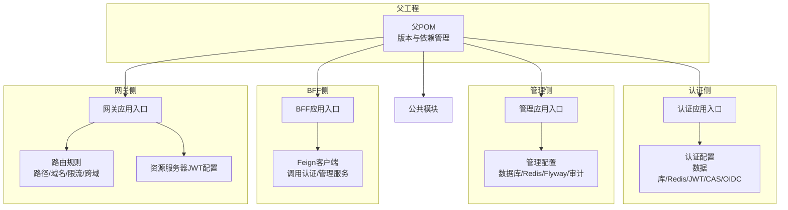
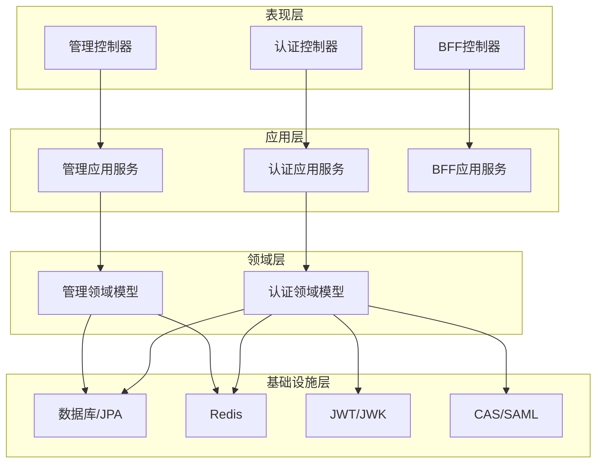
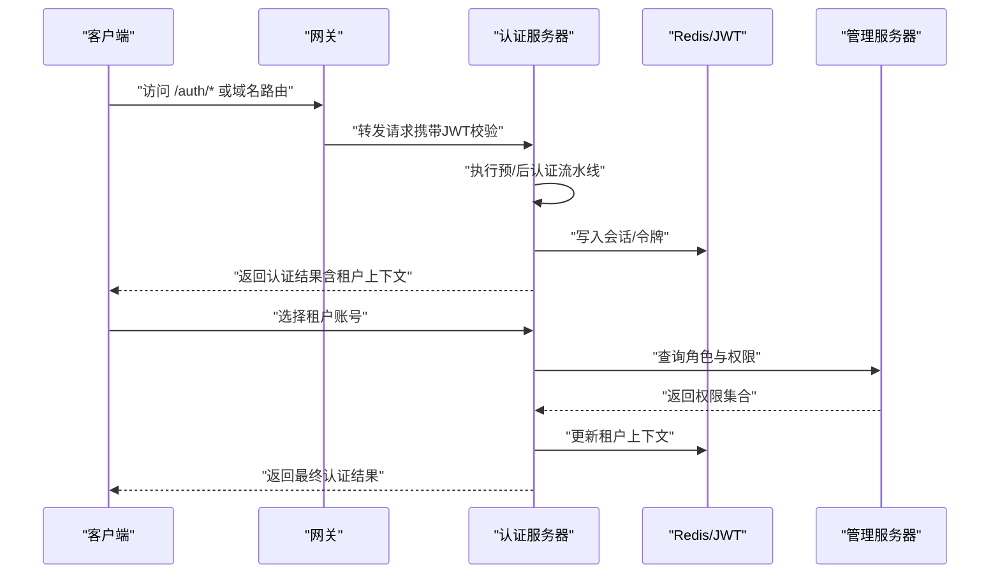
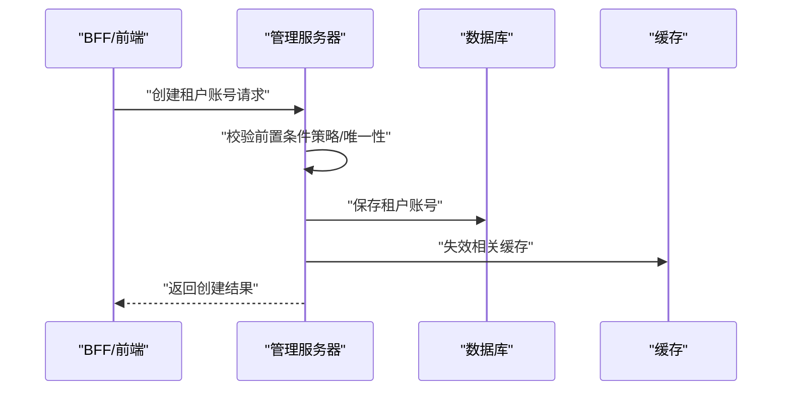
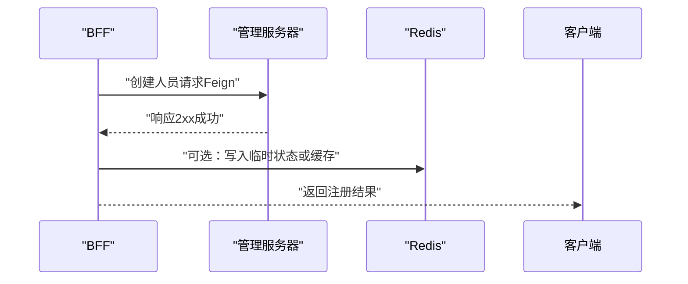
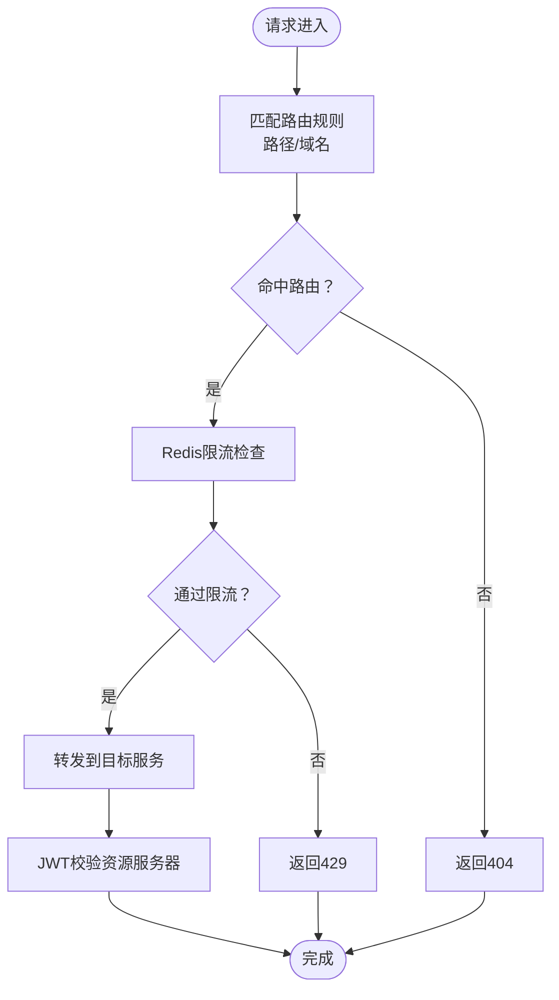
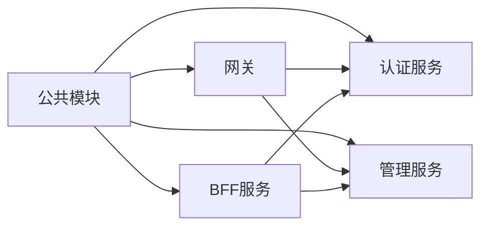
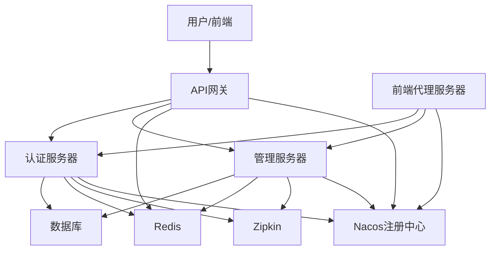

# 架构设计

<cite>
**本文引用的文件**
- [pom.xml](file://pom.xml)
- [SsoAuthServerApplication.java](file://iam-auth-server/src/main/java/iam/platform/auth/SsoAuthServerApplication.java)
- [SsoAdminServerApplication.java](file://iam-admin-server/src/main/java/iam/platform/admin/SsoAdminServerApplication.java)
- [IamBffServerApplication.java](file://iam-bff-server/src/main/java/iam/platform/bff/IamBffServerApplication.java)
- [IamGatewayApplication.java](file://iam-gateway/src/main/java/iam/platform/gateway/IamGatewayApplication.java)
- [bootstrap.yml（认证服务）](file://iam-auth-server/bootstrap.yml)
- [bootstrap.yml（管理服务）](file://iam-admin-server/bootstrap.yml)
- [bootstrap.yml（BFF服务）](file://iam-bff-server/bootstrap.yml)
- [bootstrap.yml（网关）](file://iam-gateway/bootstrap.yml)
- [application.yml（认证服务）](file://iam-auth-server/src/main/resources/application.yml)
- [application.yml（管理服务）](file://iam-admin-server/src/main/resources/application.yml)
- [application.yml（BFF服务）](file://iam-bff-server/src/main/resources/application.yml)
- [application.yml（网关）](file://iam-gateway/src/main/resources/application.yml)
- [AuthenticationApplicationService.java](file://iam-auth-server/src/main/java/iam/platform/auth/application/service/AuthenticationApplicationService.java)
- [TenantAccountApplicationService.java](file://iam-admin-server/src/main/java/iam/platform/admin/application/service/TenantAccountApplicationService.java)
- [DashboardApplicationService.java](file://iam-admin-server/src/main/java/iam/platform/admin/application/service/DashboardApplicationService.java)
- [TenantAccountRoleApplicationService.java（认证侧）](file://iam-auth-server/src/main/java/iam/platform/auth/application/service/TenantAccountRoleApplicationService.java)
- [TenantAccountRoleApplicationService.java（管理侧）](file://iam-admin-server/src/main/java/iam/platform/admin/application/service/TenantAccountRoleApplicationService.java)
- [BffRegistrationService.java](file://iam-bff-server/src/main/java/iam/platform/bff/application/service/BffRegistrationService.java)
- [AuditEventType.java](file://iam-common/src/main/java/iam/platform/common/model/enums/AuditEventType.java)
- [Person.java](file://iam-auth-server/src/main/java/iam/platform/auth/domain/model/entity/Person.java)
</cite>

## 目录
1. [引言](#引言)
2. [项目结构](#项目结构)
3. [核心组件](#核心组件)
4. [架构总览](#架构总览)
5. [详细组件分析](#详细组件分析)
6. [依赖分析](#依赖分析)
7. [性能考虑](#性能考虑)
8. [故障排查指南](#故障排查指南)
9. [结论](#结论)
10. [附录](#附录)

## 引言
本文件面向IAM平台的整体架构设计，基于Clean Architecture与领域驱动设计（DDD）思想，结合微服务拆分原则与服务间通信机制，系统化阐述认证服务器、管理服务器、前端代理服务器（BFF）、API网关四类核心服务的职责划分、交互关系与数据流。文档同时覆盖基础设施要求、可扩展性与部署拓扑，并对安全、监控与灾备等横切关注点进行说明。

## 项目结构
本仓库采用多模块Maven聚合工程组织，父POM统一管理版本与依赖，子模块按功能域拆分：
- iam-common：公共模型、DTO、异常与枚举
- iam-auth-server：认证与会话（OIDC/CAS/SAML支持）
- iam-admin-server：租户/用户/角色/权限等管理能力
- iam-bff-server：前端代理，聚合后端服务接口
- iam-gateway：API网关，路由、鉴权、限流与跨域

图表来源
- [pom.xml:1-226](file://pom.xml#L1-L226)
- [SsoAuthServerApplication.java:1-19](file://iam-auth-server/src/main/java/iam/platform/auth/SsoAuthServerApplication.java#L1-L19)
- [SsoAdminServerApplication.java:1-17](file://iam-admin-server/src/main/java/iam/platform/admin/SsoAdminServerApplication.java#L1-L17)
- [IamBffServerApplication.java:1-17](file://iam-bff-server/src/main/java/iam/platform/bff/IamBffServerApplication.java#L1-L17)
- [IamGatewayApplication.java:1-15](file://iam-gateway/src/main/java/iam/platform/gateway/IamGatewayApplication.java#L1-L15)

章节来源
- [pom.xml:1-226](file://pom.xml#L1-L226)

## 核心组件
- 认证服务器（iam-auth-server）
  - 职责：统一认证、OIDC/CAS/SAML协议适配、会话与租户上下文建立、权限加载与令牌签发
  - 关键点：Post/Pre认证流水线、租户账号选择、权限查询、速率限制与账户锁定策略
- 管理服务器（iam-admin-server）
  - 职责：租户/人员/组织/应用/角色/权限的全生命周期管理；仪表盘统计
  - 关键点：应用服务编排、领域策略校验、审计日志、异步处理
- 前端代理服务器（iam-bff-server）
  - 职责：聚合后端接口，简化前端调用；通过Feign调用认证/管理服务
  - 关键点：注册流程编排、模板渲染、轻量业务编排
- API网关（iam-gateway）
  - 职责：统一入口、路由转发、跨域、限流、资源服务器JWT校验
  - 关键点：基于路径/域名的路由规则、全局CORS、Redis限流器

章节来源
- [SsoAuthServerApplication.java:1-19](file://iam-auth-server/src/main/java/iam/platform/auth/SsoAuthServerApplication.java#L1-L19)
- [SsoAdminServerApplication.java:1-17](file://iam-admin-server/src/main/java/iam/platform/admin/SsoAdminServerApplication.java#L1-L17)
- [IamBffServerApplication.java:1-17](file://iam-bff-server/src/main/java/iam/platform/bff/IamBffServerApplication.java#L1-L17)
- [IamGatewayApplication.java:1-15](file://iam-gateway/src/main/java/iam/platform/gateway/IamGatewayApplication.java#L1-L15)

## 架构总览
系统采用Clean Architecture分层与DDD建模：
- 表现层：REST控制器/前端模板
- 应用层：应用服务编排业务用例
- 领域层：实体/值对象/聚合根与领域行为
- 基础设施层：持久化、外部集成、安全与配置

图表来源
- [AuthenticationApplicationService.java:24-138](file://iam-auth-server/src/main/java/iam/platform/auth/application/service/AuthenticationApplicationService.java#L24-L138)
- [TenantAccountApplicationService.java:26-187](file://iam-admin-server/src/main/java/iam/platform/admin/application/service/TenantAccountApplicationService.java#L26-L187)
- [DashboardApplicationService.java:24-157](file://iam-admin-server/src/main/java/iam/platform/admin/application/service/DashboardApplicationService.java#L24-L157)
- [BffRegistrationService.java:13-30](file://iam-bff-server/src/main/java/iam/platform/bff/application/service/BffRegistrationService.java#L13-L30)
- [Person.java:1-158](file://iam-auth-server/src/main/java/iam/platform/auth/domain/model/entity/Person.java#L1-L158)

## 详细组件分析

### 认证服务器（Clean Architecture与DDD落地）
- 分层与职责
  - 表现层：登录/注册/同意/租户选择/CAS/SAML等控制器
  - 应用层：统一认证应用服务、租户账号角色查询、流水线处理器
  - 领域层：Person等实体与行为方法（注册、启用/禁用、加解锁、登录记录等）
  - 基础设施：JPA仓储、Redis、OpenSAML、JWT/JWK、安全策略配置
- 数据模型要点
  - Person实体封装用户状态与行为，工厂方法与断言Guard确保不变式
- 安全与策略
  - 速率限制、账户锁定阈值、IP白名单/黑名单、CAS单点登出
- 交互时序（认证完成与租户选择）

图表来源
- [application.yml（网关）:14-54](file://iam-gateway/src/main/resources/application.yml#L14-L54)
- [AuthenticationApplicationService.java:38-111](file://iam-auth-server/src/main/java/iam/platform/auth/application/service/AuthenticationApplicationService.java#L38-L111)
- [TenantAccountRoleApplicationService.java（认证侧）:18-66](file://iam-auth-server/src/main/java/iam/platform/auth/application/service/TenantAccountRoleApplicationService.java#L18-L66)

章节来源
- [Person.java:1-158](file://iam-auth-server/src/main/java/iam/platform/auth/domain/model/entity/Person.java#L1-L158)
- [application.yml（认证服务）:90-127](file://iam-auth-server/src/main/resources/application.yml#L90-L127)

### 管理服务器（管理域用例与审计）
- 分层与职责
  - 应用服务：租户账号创建/更新/挂起/激活/离职；角色与权限分配；仪表盘统计
  - 领域服务：创建策略、唯一性校验、偏好设置
  - 基础设施：Flyway迁移、Redis缓存、异步审计
- 用例时序（租户账号创建）

图表来源
- [TenantAccountApplicationService.java:36-63](file://iam-admin-server/src/main/java/iam/platform/admin/application/service/TenantAccountApplicationService.java#L36-L63)
- [TenantAccountRoleApplicationService.java（管理侧）:43-71](file://iam-admin-server/src/main/java/iam/platform/admin/application/service/TenantAccountRoleApplicationService.java#L43-L71)

章节来源
- [TenantAccountApplicationService.java:26-187](file://iam-admin-server/src/main/java/iam/platform/admin/application/service/TenantAccountApplicationService.java#L26-L187)
- [DashboardApplicationService.java:24-157](file://iam-admin-server/src/main/java/iam/platform/admin/application/service/DashboardApplicationService.java#L24-L157)
- [application.yml（管理服务）:39-41](file://iam-admin-server/src/main/resources/application.yml#L39-L41)

### 前端代理服务器（BFF）
- 职责：聚合后端接口，简化前端调用；注册流程编排
- 交互时序（BFF注册）

图表来源
- [BffRegistrationService.java:23-29](file://iam-bff-server/src/main/java/iam/platform/bff/application/service/BffRegistrationService.java#L23-L29)

章节来源
- [IamBffServerApplication.java:1-17](file://iam-bff-server/src/main/java/iam/platform/bff/IamBffServerApplication.java#L1-L17)
- [application.yml（BFF服务）:25-32](file://iam-bff-server/src/main/resources/application.yml#L25-L32)

### API网关（路由与安全）
- 路由规则：基于路径与域名的显式路由，禁用自动发现
- 安全：资源服务器JWT校验，issuer-uri指向认证服务器
- 限流：基于Redis的限流器，不同路由差异化配置
- 跨域：全局CORS配置

图表来源
- [application.yml（网关）:18-54](file://iam-gateway/src/main/resources/application.yml#L18-L54)
- [application.yml（网关）:90-92](file://iam-gateway/src/main/resources/application.yml#L90-L92)

章节来源
- [IamGatewayApplication.java:1-15](file://iam-gateway/src/main/java/iam/platform/gateway/IamGatewayApplication.java#L1-L15)
- [application.yml（网关）:14-116](file://iam-gateway/src/main/resources/application.yml#L14-L116)

## 依赖分析
- 技术栈与版本
  - Java 21、Spring Boot 3.2.5、Spring Cloud 2023.0.1、Spring Cloud Alibaba 2023.0.1.0
  - Spring Authorization Server 1.2.5、OpenSAML 4.3.2、MapStruct 1.5.5.Final、SpringDoc 2.3.0
- 模块耦合
  - 认证服务与管理服务通过Feign在BFF侧间接耦合
  - 网关对认证服务与管理服务进行统一路由与鉴权
  - 公共模块被各服务复用，降低重复定义

图表来源
- [pom.xml:43-122](file://pom.xml#L43-L122)

章节来源
- [pom.xml:29-122](file://pom.xml#L29-L122)

## 性能考虑
- 连接池与超时：数据库连接池参数、Feign默认连接/读取超时
- 缓存：Redis作为会话存储与权限缓存基础
- 限流：网关基于Redis的限流器，按路由差异化配置
- 监控与追踪：Prometheus指标、Zipkin链路追踪采样率100%
- 可扩展性：服务独立部署，水平扩展认证/管理服务；网关作为流量入口统一治理

章节来源
- [application.yml（认证服务）:15-24](file://iam-auth-server/src/main/resources/application.yml#L15-L24)
- [application.yml（BFF服务）:25-32](file://iam-bff-server/src/main/resources/application.yml#L25-L32)
- [application.yml（网关）:24-41](file://iam-gateway/src/main/resources/application.yml#L24-L41)
- [application.yml（网关）:103-108](file://iam-gateway/src/main/resources/application.yml#L103-L108)

## 故障排查指南
- 认证失败/速率限制
  - 检查速率限制策略与账户锁定阈值配置
  - 查看认证服务日志与审计事件
- 权限不足
  - 确认租户账号角色与权限映射是否正确
  - 校验JWT中权限声明与租户上下文
- 注册/创建失败
  - 检查管理服务策略校验与唯一性约束
  - 关注异步审计队列与保留期配置
- 网关路由/鉴权问题
  - 核对路由规则与Host/Path匹配
  - 检查JWT issuer与资源服务器配置

章节来源
- [application.yml（认证服务）:90-102](file://iam-auth-server/src/main/resources/application.yml#L90-L102)
- [application.yml（管理服务）:93-102](file://iam-admin-server/src/main/resources/application.yml#L93-L102)
- [application.yml（网关）:90-92](file://iam-gateway/src/main/resources/application.yml#L90-L92)

## 结论
本架构以Clean Architecture与DDD为核心，结合微服务拆分与API网关统一治理，实现了认证、管理、前端代理与网关的清晰边界与职责分离。通过Redis、JWT与OpenSAML等技术栈，满足多协议认证与高可用需求；借助网关限流、全局CORS与资源服务器鉴权，保障了系统的安全性与可观测性。建议在生产环境完善Nacos注册中心、数据库主从与Redis哨兵/集群、以及完善的灾备与蓝绿发布策略。

## 附录
- 系统上下文图（概念示意）

- 配置与部署要点
  - 服务端口与SSL：认证服务9000/9001、管理服务9002/9003、BFF 9010/9011、网关8080/8081
  - 环境变量：DB/Redis/Nacos/Zipkin等通过环境变量注入
  - 部署拓扑：建议将网关置于公网入口，认证/管理服务内网暴露，BFF作为内部服务

章节来源
- [application.yml（认证服务）:1-144](file://iam-auth-server/src/main/resources/application.yml#L1-L144)
- [application.yml（管理服务）:1-102](file://iam-admin-server/src/main/resources/application.yml#L1-L102)
- [application.yml（BFF服务）:1-54](file://iam-bff-server/src/main/resources/application.yml#L1-L54)
- [application.yml（网关）:1-116](file://iam-gateway/src/main/resources/application.yml#L1-L116)
- [bootstrap.yml（认证服务）:1-10](file://iam-auth-server/bootstrap.yml#L1-L10)
- [bootstrap.yml（管理服务）:1-10](file://iam-admin-server/bootstrap.yml#L1-L10)
- [bootstrap.yml（BFF服务）:1-10](file://iam-bff-server/bootstrap.yml#L1-L10)
- [bootstrap.yml（网关）:1-10](file://iam-gateway/bootstrap.yml#L1-L10)