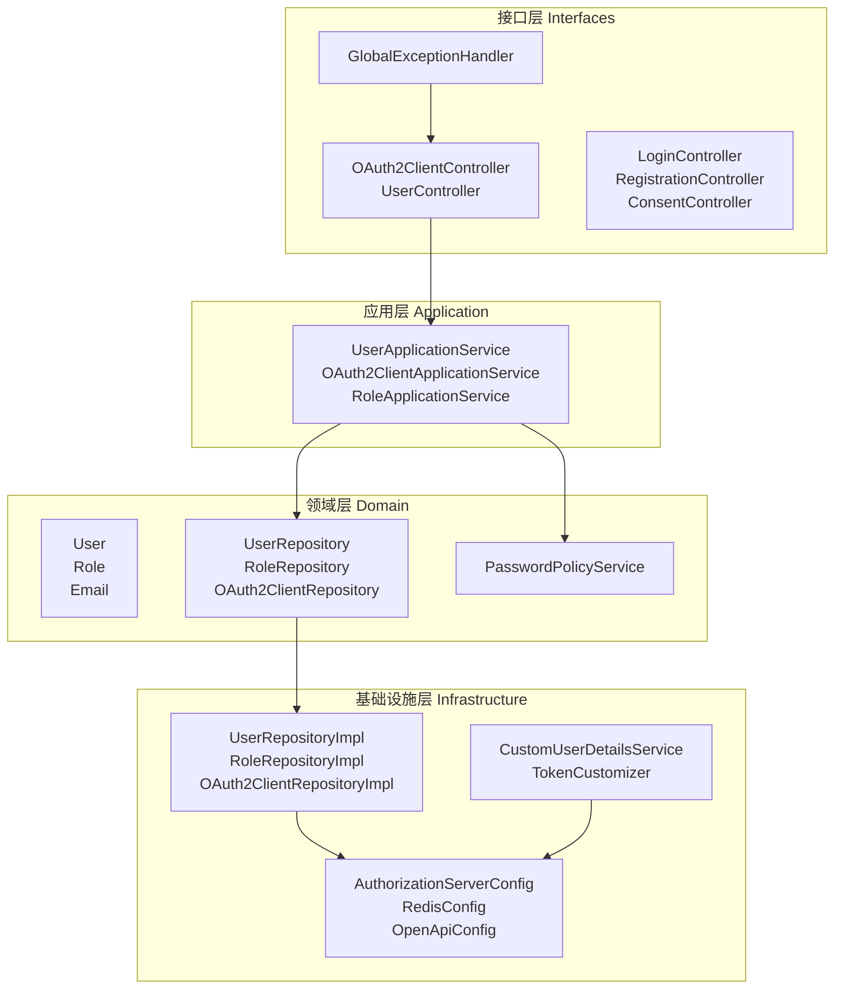
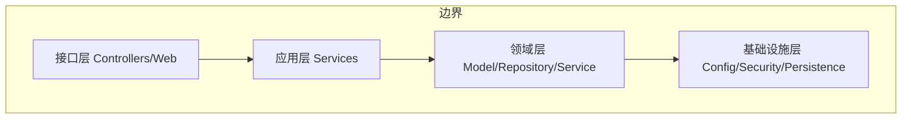
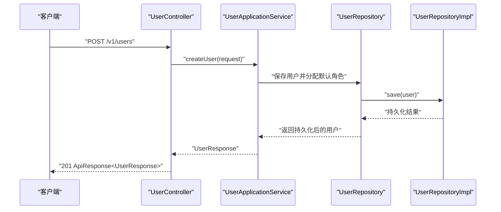
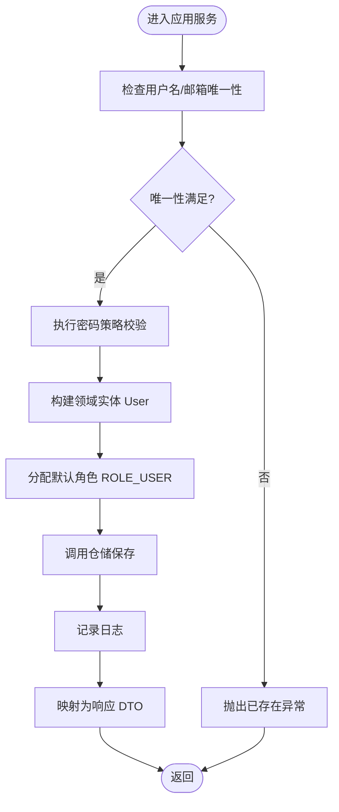
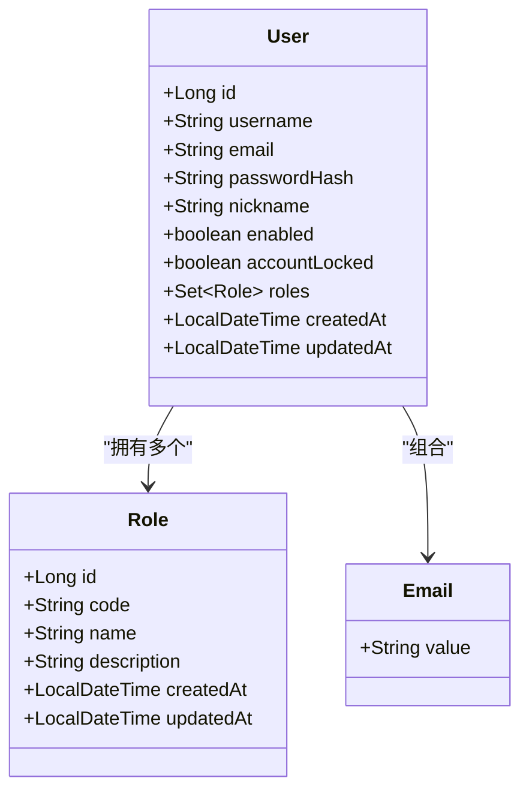
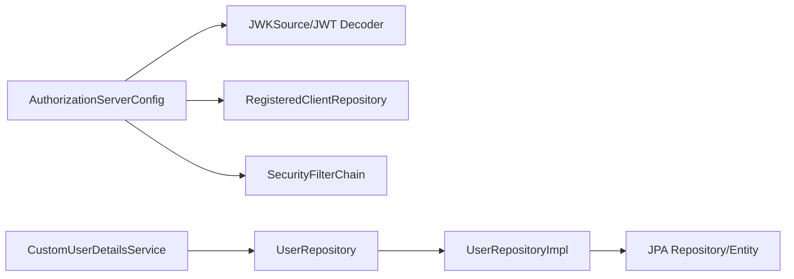
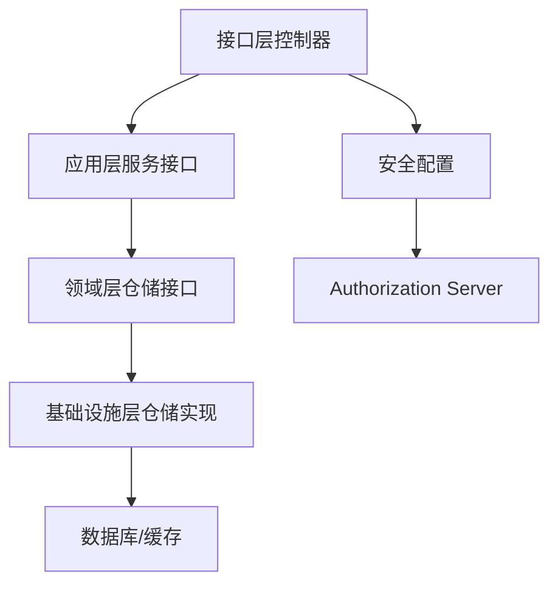

# 架构设计

<cite>
**本文引用的文件**
- [SsoOidcApplication.java](file://src/main/java/sso/oidc/SsoOidcApplication.java)
- [OAuth2ClientController.java](file://src/main/java/sso/oidc/interfaces/rest/OAuth2ClientController.java)
- [UserController.java](file://src/main/java/sso/oidc/interfaces/rest/UserController.java)
- [UserApplicationService.java](file://src/main/java/sso/oidc/application/service/UserApplicationService.java)
- [UserRepository.java](file://src/main/java/sso/oidc/domain/repository/UserRepository.java)
- [UserRepositoryImpl.java](file://src/main/java/sso/oidc/infrastructure/persistence/impl/UserRepositoryImpl.java)
- [User.java](file://src/main/java/sso/oidc/domain/model/entity/User.java)
- [Role.java](file://src/main/java/sso/oidc/domain/model/entity/Role.java)
- [Email.java](file://src/main/java/sso/oidc/domain/model/valueobject/Email.java)
- [AuthorizationServerConfig.java](file://src/main/java/sso/oidc/infrastructure/config/AuthorizationServerConfig.java)
- [CustomUserDetailsService.java](file://src/main/java/sso/oidc/infrastructure/security/CustomUserDetailsService.java)
- [GlobalExceptionHandler.java](file://src/main/java/sso/oidc/interfaces/rest/common/GlobalExceptionHandler.java)
- [application.yml](file://src/main/resources/application.yml)
- [pom.xml](file://pom.xml)
- [README.md](file://README.md)
</cite>

## 目录
1. [引言](#引言)
2. [项目结构](#项目结构)
3. [核心组件](#核心组件)
4. [架构总览](#架构总览)
5. [详细组件分析](#详细组件分析)
6. [依赖分析](#依赖分析)
7. [性能考虑](#性能考虑)
8. [故障排查指南](#故障排查指南)
9. [结论](#结论)
10. [附录](#附录)

## 引言
本项目是一个基于 Spring Authorization Server 的 OIDC/SAML 统一认证服务，面向微服务架构提供集中式认证与授权能力。本文档以 Clean Architecture 与 DDD 为核心设计思想，系统性阐述接口层、应用层、领域层、基础设施层的职责划分与相互关系；深入解析实体、值对象、仓储模式在项目中的落地实践；说明依赖注入与松耦合带来的可维护性与可扩展性优势；并结合安全性、监控、错误处理等跨领域关注点，给出架构决策的技术考量与权衡。

## 项目结构
项目采用按“层次+子域”混合组织方式，清晰分离接口层、应用层、领域层与基础设施层，并通过 Spring Profile 与 Kustomize Overlay 支持多环境隔离与部署。

图表来源
- [OAuth2ClientController.java:1-75](file://src/main/java/sso/oidc/interfaces/rest/OAuth2ClientController.java#L1-L75)
- [UserController.java:1-90](file://src/main/java/sso/oidc/interfaces/rest/UserController.java#L1-L90)
- [UserApplicationService.java:1-166](file://src/main/java/sso/oidc/application/service/UserApplicationService.java#L1-L166)
- [UserRepository.java:1-26](file://src/main/java/sso/oidc/domain/repository/UserRepository.java#L1-L26)
- [UserRepositoryImpl.java:1-92](file://src/main/java/sso/oidc/infrastructure/persistence/impl/UserRepositoryImpl.java#L1-L92)
- [AuthorizationServerConfig.java:1-143](file://src/main/java/sso/oidc/infrastructure/config/AuthorizationServerConfig.java#L1-L143)
- [CustomUserDetailsService.java:1-41](file://src/main/java/sso/oidc/infrastructure/security/CustomUserDetailsService.java#L1-L41)
- [GlobalExceptionHandler.java:1-68](file://src/main/java/sso/oidc/interfaces/rest/common/GlobalExceptionHandler.java#L1-L68)

章节来源
- [README.md:104-139](file://README.md#L104-L139)

## 核心组件
- 接口层：REST 控制器负责暴露资源 API，Web 控制器提供登录/注册/同意页面；全局异常处理器统一处理业务异常、校验异常与鉴权异常。
- 应用层：应用服务编排业务用例，协调仓储与领域服务，保证事务边界与业务一致性。
- 领域层：实体与值对象承载业务不变量与行为，仓储接口抽象持久化契约，领域服务封装跨实体的复杂规则。
- 基础设施层：安全配置（OIDC Provider）、用户详情加载、JWK 生成、Redis 配置、JPA/JDBC 适配等。

章节来源
- [OAuth2ClientController.java:1-75](file://src/main/java/sso/oidc/interfaces/rest/OAuth2ClientController.java#L1-L75)
- [UserController.java:1-90](file://src/main/java/sso/oidc/interfaces/rest/UserController.java#L1-L90)
- [UserApplicationService.java:1-166](file://src/main/java/sso/oidc/application/service/UserApplicationService.java#L1-L166)
- [UserRepository.java:1-26](file://src/main/java/sso/oidc/domain/repository/UserRepository.java#L1-L26)
- [UserRepositoryImpl.java:1-92](file://src/main/java/sso/oidc/infrastructure/persistence/impl/UserRepositoryImpl.java#L1-L92)
- [AuthorizationServerConfig.java:1-143](file://src/main/java/sso/oidc/infrastructure/config/AuthorizationServerConfig.java#L1-L143)
- [CustomUserDetailsService.java:1-41](file://src/main/java/sso/oidc/infrastructure/security/CustomUserDetailsService.java#L1-L41)
- [GlobalExceptionHandler.java:1-68](file://src/main/java/sso/oidc/interfaces/rest/common/GlobalExceptionHandler.java#L1-L68)

## 架构总览
系统遵循 Clean Architecture 的依赖倒置原则：上层模块仅依赖抽象，下层模块实现抽象；领域模型独立于框架与外部基础设施，确保业务稳定性与可测试性。

图表来源
- [SsoOidcApplication.java:1-13](file://src/main/java/sso/oidc/SsoOidcApplication.java#L1-L13)
- [AuthorizationServerConfig.java:1-143](file://src/main/java/sso/oidc/infrastructure/config/AuthorizationServerConfig.java#L1-L143)
- [UserApplicationService.java:1-166](file://src/main/java/sso/oidc/application/service/UserApplicationService.java#L1-L166)
- [UserRepositoryImpl.java:1-92](file://src/main/java/sso/oidc/infrastructure/persistence/impl/UserRepositoryImpl.java#L1-L92)

## 详细组件分析

### 接口层：REST 与 Web 控制器
- REST 控制器：提供 OAuth2 客户端与用户资源的完整 CRUD 与扩展操作（如密码修改、角色分配/移除、客户端密钥轮换），统一返回标准响应包装体。
- Web 控制器：提供登录、注册、同意页面，配合 Thymeleaf 渲染。
- 全局异常处理器：集中处理业务异常、参数校验异常、鉴权/授权异常与通用异常，输出结构化错误响应。

图表来源
- [UserController.java:1-90](file://src/main/java/sso/oidc/interfaces/rest/UserController.java#L1-L90)
- [UserApplicationService.java:1-166](file://src/main/java/sso/oidc/application/service/UserApplicationService.java#L1-L166)
- [UserRepository.java:1-26](file://src/main/java/sso/oidc/domain/repository/UserRepository.java#L1-L26)
- [UserRepositoryImpl.java:1-92](file://src/main/java/sso/oidc/infrastructure/persistence/impl/UserRepositoryImpl.java#L1-L92)

章节来源
- [UserController.java:1-90](file://src/main/java/sso/oidc/interfaces/rest/UserController.java#L1-L90)
- [OAuth2ClientController.java:1-75](file://src/main/java/sso/oidc/interfaces/rest/OAuth2ClientController.java#L1-L75)
- [GlobalExceptionHandler.java:1-68](file://src/main/java/sso/oidc/interfaces/rest/common/GlobalExceptionHandler.java#L1-L68)

### 应用层：应用服务与用例编排
- 用户管理用例：创建用户（校验唯一性、密码策略、默认角色分配）、更新用户、删除用户、分页查询、修改密码（旧密码校验、新密码策略）、角色分配与移除。
- 事务边界：所有写操作均在应用服务层开启事务，保证业务一致性。
- DTO 映射：应用服务负责将领域对象映射为响应 DTO，避免领域模型泄露到接口层。

图表来源
- [UserApplicationService.java:1-166](file://src/main/java/sso/oidc/application/service/UserApplicationService.java#L1-L166)

章节来源
- [UserApplicationService.java:1-166](file://src/main/java/sso/oidc/application/service/UserApplicationService.java#L1-L166)

### 领域层：实体、值对象与仓储
- 实体：User、Role 承载业务标识与状态；User 内聚角色集合与安全属性。
- 值对象：Email 封装邮箱格式校验与不可变性，确保业务不变量。
- 仓储接口：定义领域持久化契约，隔离技术细节。
- 领域服务：PasswordPolicyService 封装密码强度策略，避免散落于应用层。

图表来源
- [User.java:1-36](file://src/main/java/sso/oidc/domain/model/entity/User.java#L1-L36)
- [Role.java:1-22](file://src/main/java/sso/oidc/domain/model/entity/Role.java#L1-L22)
- [Email.java:1-31](file://src/main/java/sso/oidc/domain/model/valueobject/Email.java#L1-L31)

章节来源
- [User.java:1-36](file://src/main/java/sso/oidc/domain/model/entity/User.java#L1-L36)
- [Role.java:1-22](file://src/main/java/sso/oidc/domain/model/entity/Role.java#L1-L22)
- [Email.java:1-31](file://src/main/java/sso/oidc/domain/model/valueobject/Email.java#L1-L31)
- [UserRepository.java:1-26](file://src/main/java/sso/oidc/domain/repository/UserRepository.java#L1-L26)

### 基础设施层：安全、持久化与配置
- 安全配置：基于 Spring Authorization Server 提供 OIDC 发行能力，配置 JWK、JWT 解码器、授权端点、客户端仓库等。
- 用户详情加载：实现 UserDetailsService，将领域 User 映射为 Spring Security UserDetails。
- 持久化实现：仓储实现负责领域模型与 PO/Entity 的双向映射，屏蔽 JPA 细节。
- 多环境配置：通过 application.yml 与 Spring Profile 管理数据库、Redis、JWK、监控等配置。

图表来源
- [AuthorizationServerConfig.java:1-143](file://src/main/java/sso/oidc/infrastructure/config/AuthorizationServerConfig.java#L1-L143)
- [CustomUserDetailsService.java:1-41](file://src/main/java/sso/oidc/infrastructure/security/CustomUserDetailsService.java#L1-L41)
- [UserRepositoryImpl.java:1-92](file://src/main/java/sso/oidc/infrastructure/persistence/impl/UserRepositoryImpl.java#L1-L92)

章节来源
- [AuthorizationServerConfig.java:1-143](file://src/main/java/sso/oidc/infrastructure/config/AuthorizationServerConfig.java#L1-L143)
- [CustomUserDetailsService.java:1-41](file://src/main/java/sso/oidc/infrastructure/security/CustomUserDetailsService.java#L1-L41)
- [UserRepositoryImpl.java:1-92](file://src/main/java/sso/oidc/infrastructure/persistence/impl/UserRepositoryImpl.java#L1-L92)
- [application.yml:1-78](file://src/main/resources/application.yml#L1-L78)

## 依赖分析
- 依赖注入与松耦合：控制器依赖应用服务接口，应用服务依赖仓储接口，仓储接口由基础设施实现类提供，实现高层策略与低层实现的解耦。
- 外部依赖：Spring Authorization Server、PostgreSQL、Redis、Flyway、Actuator/Micrometer/Zipkin 等。
- 依赖方向：始终由上层模块依赖抽象，下层模块实现抽象，符合 Clean Architecture 与 DDD 的依赖倒置原则。

图表来源
- [pom.xml:29-140](file://pom.xml#L29-L140)
- [UserApplicationService.java:1-166](file://src/main/java/sso/oidc/application/service/UserApplicationService.java#L1-L166)
- [UserRepository.java:1-26](file://src/main/java/sso/oidc/domain/repository/UserRepository.java#L1-L26)
- [UserRepositoryImpl.java:1-92](file://src/main/java/sso/oidc/infrastructure/persistence/impl/UserRepositoryImpl.java#L1-L92)
- [AuthorizationServerConfig.java:1-143](file://src/main/java/sso/oidc/infrastructure/config/AuthorizationServerConfig.java#L1-L143)

章节来源
- [pom.xml:29-140](file://pom.xml#L29-L140)

## 性能考虑
- 连接池与会话：配置 HikariCP 连接池参数，启用 Redis 存储分布式会话，降低数据库压力并提升横向扩展能力。
- ORM 优化：禁用 open-in-view，避免长事务持有 Session；分页查询使用 Pageable，避免一次性加载大结果集。
- 缓存与令牌：Redis 用于会话与可能的缓存场景；OIDC 令牌生命周期合理配置，减少频繁刷新。
- 监控与可观测性：启用 Actuator、Prometheus 指标与 Zipkin 链路追踪，便于定位性能瓶颈。

章节来源
- [application.yml:9-46](file://src/main/resources/application.yml#L9-L46)
- [AuthorizationServerConfig.java:81-84](file://src/main/java/sso/oidc/infrastructure/config/AuthorizationServerConfig.java#L81-L84)

## 故障排查指南
- 统一错误响应：全局异常处理器将业务异常、参数校验异常、鉴权/授权异常与通用异常转换为结构化错误响应，便于前端与运维定位问题。
- 日志与审计：应用服务在关键操作处记录日志，结合链路追踪与指标监控，快速定位异常根因。
- 安全告警：鉴权失败、访问拒绝、业务异常均有明确日志级别与状态码，便于安全事件审计。

章节来源
- [GlobalExceptionHandler.java:1-68](file://src/main/java/sso/oidc/interfaces/rest/common/GlobalExceptionHandler.java#L1-L68)
- [UserApplicationService.java:37-126](file://src/main/java/sso/oidc/application/service/UserApplicationService.java#L37-L126)

## 结论
本项目以 Clean Architecture 与 DDD 为指导，实现了接口层、应用层、领域层与基础设施层的清晰分层与职责分离；通过实体/值对象/仓储模式强化了业务建模与可测试性；依赖注入与松耦合提升了系统的可维护性与演进弹性；同时在安全性、监控与错误处理方面提供了完善的跨领域保障。该架构既满足当前 OIDC Provider 的需求，也为未来扩展（如资源服务器对接、更复杂的领域规则）奠定了坚实基础。

## 附录
- 系统边界与端点参考：OIDC Discovery、授权、令牌、用户信息、JWKS、令牌撤销与内省等端点路径详见项目文档。
- 多环境与部署：通过 Spring Profile 与 Kustomize Overlay 实现环境隔离与自动化部署。

章节来源
- [README.md:360-387](file://README.md#L360-L387)