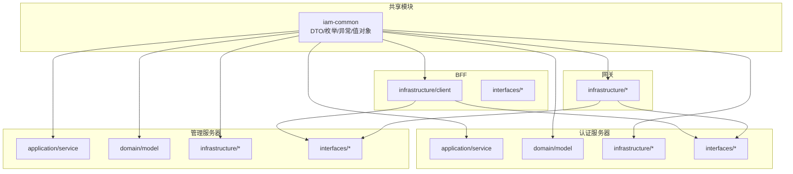
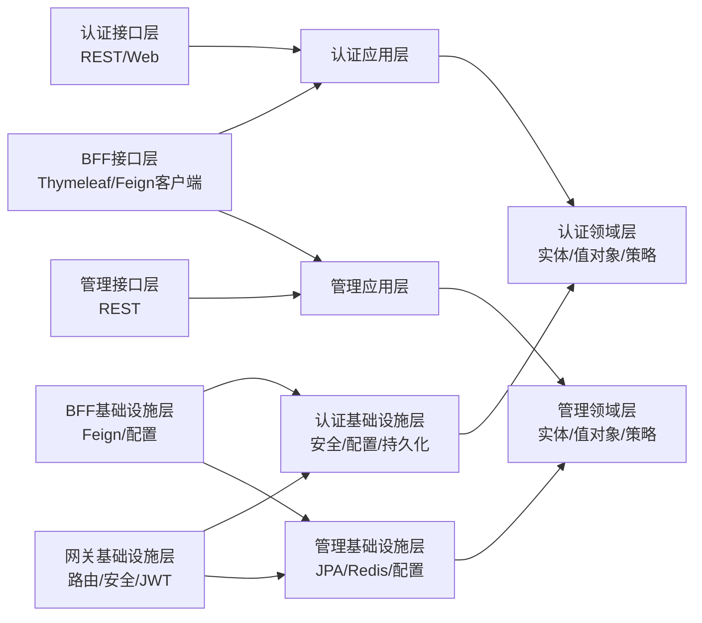
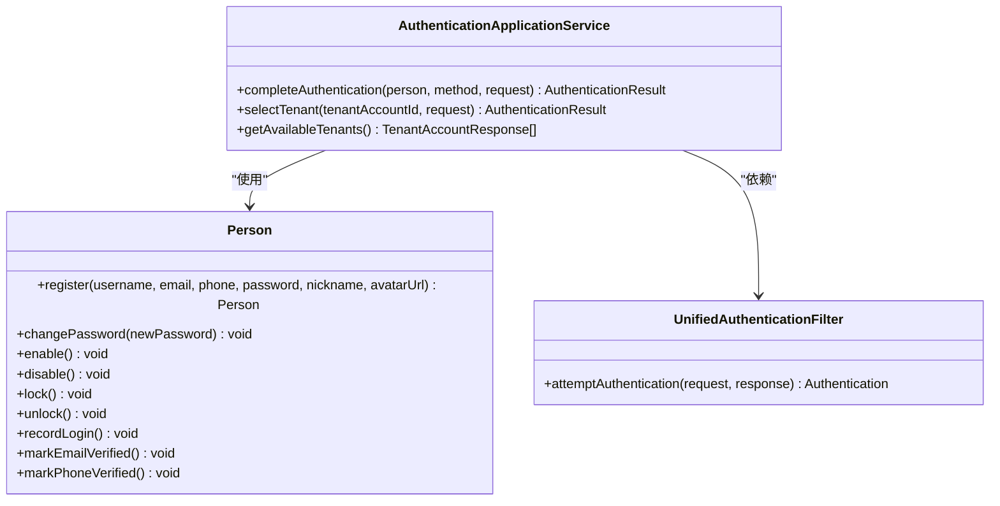
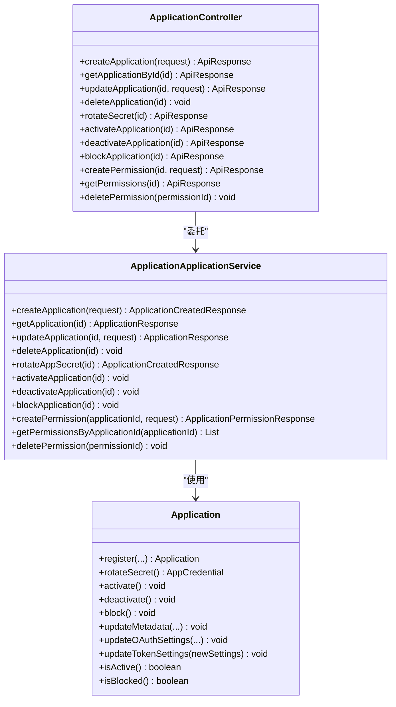
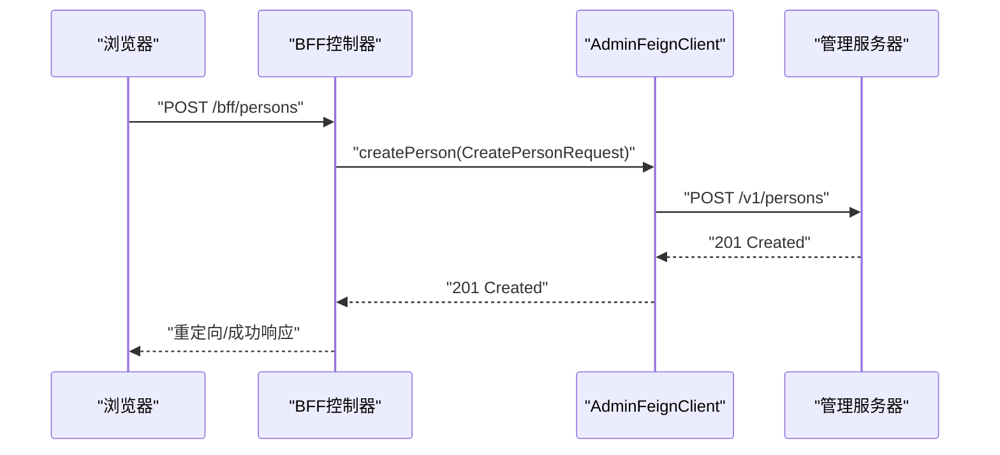
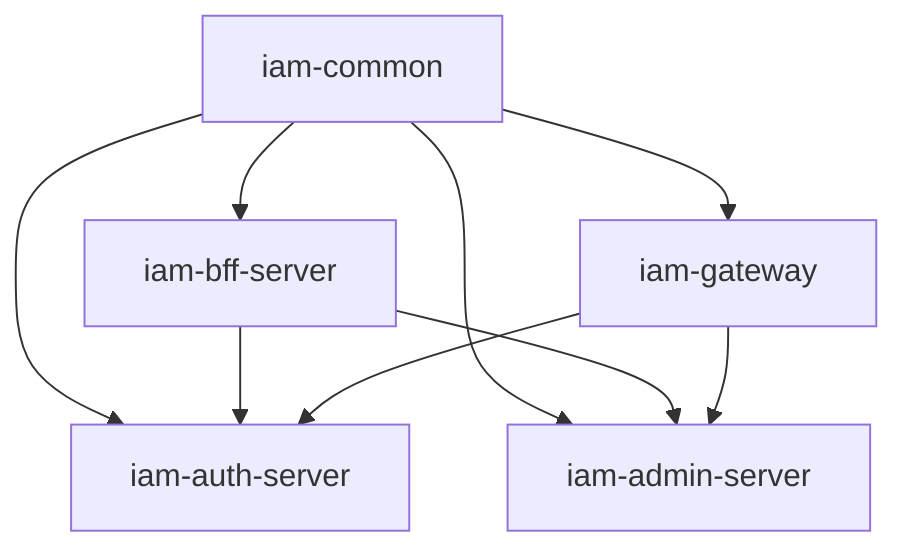

# 模块设计

<cite>
**本文引用的文件**
- [pom.xml](file://iam-common/pom.xml)
- [CreatePersonRequest.java](file://iam-common/src/main/java/iam/platform/common/dto/request/CreatePersonRequest.java)
- [UserStatus.java](file://iam-common/src/main/java/iam/platform/common/model/enums/UserStatus.java)
- [BusinessException.java](file://iam-common/src/main/java/iam/platform/common/model/exception/BusinessException.java)
- [pom.xml](file://iam-auth-server/pom.xml)
- [AuthenticationApplicationService.java](file://iam-auth-server/src/main/java/iam/platform/auth/application/service/AuthenticationApplicationService.java)
- [Person.java](file://iam-auth-server/src/main/java/iam/platform/auth/domain/model/entity/Person.java)
- [UnifiedAuthenticationFilter.java](file://iam-auth-server/src/main/java/iam/platform/auth/infrastructure/security/UnifiedAuthenticationFilter.java)
- [AuthenticationController.java](file://iam-auth-server/src/main/java/iam/platform/auth/interfaces/rest/AuthenticationController.java)
- [pom.xml](file://iam-admin-server/pom.xml)
- [ApplicationApplicationService.java](file://iam-admin-server/src/main/java/iam/platform/admin/application/service/ApplicationApplicationService.java)
- [Application.java](file://iam-admin-server/src/main/java/iam/platform/admin/domain/model/entity/Application.java)
- [ApplicationJpaRepository.java](file://iam-admin-server/src/main/java/iam/platform/admin/infrastructure/persistence/repository/ApplicationJpaRepository.java)
- [ApplicationController.java](file://iam-admin-server/src/main/java/iam/platform/admin/interfaces/rest/ApplicationController.java)
- [pom.xml](file://iam-bff-server/pom.xml)
- [AdminFeignClient.java](file://iam-bff-server/src/main/java/iam/platform/bff/infrastructure/client/AdminFeignClient.java)
- [AuthFeignClient.java](file://iam-bff-server/src/main/java/iam/platform/bff/infrastructure/client/AuthFeignClient.java)
- [pom.xml](file://iam-gateway/pom.xml)
</cite>

## 目录
1. [引言](#引言)
2. [项目结构](#项目结构)
3. [核心组件](#核心组件)
4. [架构总览](#架构总览)
5. [详细组件分析](#详细组件分析)
6. [依赖分析](#依赖分析)
7. [性能考虑](#性能考虑)
8. [故障排查指南](#故障排查指南)
9. [结论](#结论)
10. [附录](#附录)

## 引言
本文件面向IAM平台的模块化设计，围绕认证服务器、管理服务器、前端代理服务器（BFF）与API网关四大核心模块，系统阐述Clean Architecture在各模块中的落地实践，包括表现层（interfaces）、应用层（application）、领域层（domain）、基础设施层（infrastructure）的分层职责与依赖倒置原则；梳理模块间通过同步调用（OpenFeign）与安全策略（Spring Security/OAuth2/SAML/CAS/LDAP）的交互方式；总结共享模块iam-common的DTO、枚举、异常与工具的统一管理；并提供模块依赖图与包结构图，帮助开发者快速理解耦合关系与职责边界。

## 项目结构
- 模块划分
  - 认证服务器（iam-auth-server）：OAuth2授权服务器、OIDC提供者、CAS/SAML/LDAP支持、统一认证过滤器、会话与租户上下文管理。
  - 管理服务器（iam-admin-server）：业务CRUD、审计日志切面、OpenAPI文档、Flyway迁移、JPA仓储。
  - 前端代理服务器（iam-bff-server）：聚合后端服务、对外表单页面、OpenFeign客户端。
  - API网关（iam-gateway）：路由、鉴权转换、限流与可观测性。
  - 共享模块（iam-common）：DTO、枚举、异常、值对象与通用工具。

- 清晰的分层组织
  - interfaces：REST/Web控制器、Web表单控制器、Feign客户端接口。
  - application：应用服务（用例编排），负责事务边界与跨领域协调。
  - domain：领域模型与行为，强调不变量与状态机。
  - infrastructure：配置、持久化、安全过滤器与适配器、外部集成。

图表来源
- [pom.xml:18-23](file://iam-auth-server/pom.xml#L18-L23)
- [pom.xml:19-23](file://iam-admin-server/pom.xml#L19-L23)
- [pom.xml:19-23](file://iam-bff-server/pom.xml#L19-L23)
- [pom.xml:17-22](file://iam-gateway/pom.xml#L17-L22)

章节来源
- [pom.xml:18-23](file://iam-auth-server/pom.xml#L18-L23)
- [pom.xml:19-23](file://iam-admin-server/pom.xml#L19-L23)
- [pom.xml:19-23](file://iam-bff-server/pom.xml#L19-L23)
- [pom.xml:17-22](file://iam-gateway/pom.xml#L17-L22)

## 核心组件
- 认证服务器（iam-auth-server）
  - 分层职责
    - 表现层：REST控制器、Web表单控制器、CAS/SAML/OIDC路由与适配。
    - 应用层：统一认证应用服务，完成认证后处理与租户选择。
    - 领域层：Person、Application、Tenant等实体与行为方法。
    - 基础设施层：安全过滤器、统一认证令牌、租户上下文、Redis/JPA配置。
  - 关键特性：统一认证过滤器解析多种认证方式；认证后流水线处理；租户上下文贯穿会话与权限。
  
  章节来源
  - [AuthenticationApplicationService.java:24-139](file://iam-auth-server/src/main/java/iam/platform/auth/application/service/AuthenticationApplicationService.java#L24-L139)
  - [Person.java:1-158](file://iam-auth-server/src/main/java/iam/platform/auth/domain/model/entity/Person.java#L1-L158)
  - [UnifiedAuthenticationFilter.java:1-80](file://iam-auth-server/src/main/java/iam/platform/auth/infrastructure/security/UnifiedAuthenticationFilter.java#L1-L80)
  - [AuthenticationController.java:1-47](file://iam-auth-server/src/main/java/iam/platform/auth/interfaces/rest/AuthenticationController.java#L1-L47)

- 管理服务器（iam-admin-server）
  - 分层职责
    - 表现层：OpenAPI注解的REST控制器，统一响应包装。
    - 应用层：应用与权限管理应用服务，事务边界与审计日志注解。
    - 领域层：Application实体工厂方法与状态机，TokenSettings与凭证管理。
    - 基础设施层：JPA仓储接口、持久化实体映射、安全配置与AOP审计切面。
  - 关键特性：应用注册生成凭据与默认状态；OAuth设置与令牌TTL更新；审计日志横切。

  章节来源
  - [ApplicationApplicationService.java:1-255](file://iam-admin-server/src/main/java/iam/platform/admin/application/service/ApplicationApplicationService.java#L1-L255)
  - [Application.java:1-211](file://iam-admin-server/src/main/java/iam/platform/admin/domain/model/entity/Application.java#L1-L211)
  - [ApplicationJpaRepository.java:1-18](file://iam-admin-server/src/main/java/iam/platform/admin/infrastructure/persistence/repository/ApplicationJpaRepository.java#L1-L18)
  - [ApplicationController.java:1-139](file://iam-admin-server/src/main/java/iam/platform/admin/interfaces/rest/ApplicationController.java#L1-L139)

- 前端代理服务器（iam-bff-server）
  - 分层职责
    - 表现层：Thymeleaf视图与登录/注册/同意页控制器。
    - 基础设施层：OpenFeign客户端，聚合后端服务请求。
  - 关键特性：对内调用管理服务器创建人员，对外提供表单页面与验证码发送。

  章节来源
  - [AdminFeignClient.java:1-26](file://iam-bff-server/src/main/java/iam/platform/bff/infrastructure/client/AdminFeignClient.java#L1-L26)
  - [AuthFeignClient.java:1-31](file://iam-bff-server/src/main/java/iam/platform/bff/infrastructure/client/AuthFeignClient.java#L1-L31)

- API网关（iam-gateway）
  - 分层职责
    - 基础设施层：Spring Cloud Gateway路由、负载均衡、安全过滤与JWT转换。
  - 关键特性：基于WebFlux的非阻塞网关，结合Nacos与Redis进行限流与发现。

  章节来源
  - [pom.xml:17-81](file://iam-gateway/pom.xml#L17-L81)

- 共享模块（iam-common）
  - 设计要点
    - DTO：请求/响应对象，统一校验注解与JSON序列化注解。
    - 枚举：用户状态、应用状态/类型、审计事件、权限动作等。
    - 异常：统一业务异常基类，携带错误码与HTTP状态。
    - 值对象：密码、邮箱、人员编码、应用凭据、Token设置等。
    - 工具：Guard断言工具。
  - 作用：为所有模块提供一致的数据契约与领域建模基础。

  章节来源
  - [pom.xml:18-37](file://iam-common/pom.xml#L18-L37)
  - [CreatePersonRequest.java:1-37](file://iam-common/src/main/java/iam/platform/common/dto/request/CreatePersonRequest.java#L1-L37)
  - [UserStatus.java:1-8](file://iam-common/src/main/java/iam/platform/common/model/enums/UserStatus.java#L1-L8)
  - [BusinessException.java:1-17](file://iam-common/src/main/java/iam/platform/common/model/exception/BusinessException.java#L1-L17)

## 架构总览
Clean Architecture在各模块中的实现要点
- 依赖倒置
  - 上层（interfaces、application）仅依赖下层抽象（domain接口/值对象/异常）。
  - infrastructure实现domain定义的抽象，并被上层以接口注入的方式使用。
- 分层边界
  - interfaces只做参数绑定与响应封装，不包含业务规则。
  - application编排用例，保证事务与跨领域一致性。
  - domain专注不变量与行为，避免受技术细节影响。
  - infrastructure屏蔽外部依赖（数据库、缓存、第三方协议）。
- 接口与实现分离
  - 仓储接口位于domain或infrastructure，实现位于infrastructure。
  - Feign客户端接口位于infrastructure，实现由Spring Cloud自动生成。

图表来源
- [AuthenticationApplicationService.java:1-139](file://iam-auth-server/src/main/java/iam/platform/auth/application/service/AuthenticationApplicationService.java#L1-L139)
- [ApplicationApplicationService.java:1-255](file://iam-admin-server/src/main/java/iam/platform/admin/application/service/ApplicationApplicationService.java#L1-L255)
- [AdminFeignClient.java:1-26](file://iam-bff-server/src/main/java/iam/platform/bff/infrastructure/client/AdminFeignClient.java#L1-L26)
- [AuthFeignClient.java:1-31](file://iam-bff-server/src/main/java/iam/platform/bff/infrastructure/client/AuthFeignClient.java#L1-L31)

## 详细组件分析

### 认证服务器（Clean Architecture与职责边界）
- 分层映射
  - interfaces：AuthenticationController、CasController、SamlSsoController等。
  - application：AuthenticationApplicationService（认证完成、租户选择、可用租户查询）。
  - domain：Person、Tenant、TenantAccount、Application等实体与行为。
  - infrastructure：UnifiedAuthenticationFilter、TenantAwareAuthenticationToken、安全配置与持久化。
- 依赖关系
  - application层依赖domain实体与值对象，同时依赖infrastructure提供的仓储与上下文。
  - interfaces层依赖application层，不直接依赖infrastructure。
- 单一职责
  - AuthenticationApplicationService聚焦“认证完成”和“租户上下文建立”，职责清晰且可测试。

图表来源
- [AuthenticationApplicationService.java:24-139](file://iam-auth-server/src/main/java/iam/platform/auth/application/service/AuthenticationApplicationService.java#L24-L139)
- [Person.java:1-158](file://iam-auth-server/src/main/java/iam/platform/auth/domain/model/entity/Person.java#L1-L158)
- [UnifiedAuthenticationFilter.java:1-80](file://iam-auth-server/src/main/java/iam/platform/auth/infrastructure/security/UnifiedAuthenticationFilter.java#L1-L80)

章节来源
- [AuthenticationApplicationService.java:24-139](file://iam-auth-server/src/main/java/iam/platform/auth/application/service/AuthenticationApplicationService.java#L24-L139)
- [Person.java:1-158](file://iam-auth-server/src/main/java/iam/platform/auth/domain/model/entity/Person.java#L1-L158)
- [UnifiedAuthenticationFilter.java:1-80](file://iam-auth-server/src/main/java/iam/platform/auth/infrastructure/security/UnifiedAuthenticationFilter.java#L1-L80)
- [AuthenticationController.java:1-47](file://iam-auth-server/src/main/java/iam/platform/auth/interfaces/rest/AuthenticationController.java#L1-L47)

### 管理服务器（Clean Architecture与职责边界）
- 分层映射
  - interfaces：ApplicationController（OpenAPI标注）。
  - application：ApplicationApplicationService（应用生命周期、权限管理、审计日志）。
  - domain：Application（工厂、状态机、OAuth设置、令牌TTL）。
  - infrastructure：JPA仓储接口、持久化实体映射、安全与AOP配置。
- 依赖关系
  - application层依赖domain实体与common值对象/枚举。
  - interfaces层依赖application层，返回统一响应包装。
- 单一职责
  - ApplicationApplicationService承担应用与权限的完整用例，事务与审计横切。

图表来源
- [ApplicationController.java:1-139](file://iam-admin-server/src/main/java/iam/platform/admin/interfaces/rest/ApplicationController.java#L1-L139)
- [ApplicationApplicationService.java:1-255](file://iam-admin-server/src/main/java/iam/platform/admin/application/service/ApplicationApplicationService.java#L1-L255)
- [Application.java:1-211](file://iam-admin-server/src/main/java/iam/platform/admin/domain/model/entity/Application.java#L1-L211)

章节来源
- [ApplicationController.java:1-139](file://iam-admin-server/src/main/java/iam/platform/admin/interfaces/rest/ApplicationController.java#L1-L139)
- [ApplicationApplicationService.java:1-255](file://iam-admin-server/src/main/java/iam/platform/admin/application/service/ApplicationApplicationService.java#L1-L255)
- [Application.java:1-211](file://iam-admin-server/src/main/java/iam/platform/admin/domain/model/entity/Application.java#L1-L211)
- [ApplicationJpaRepository.java:1-18](file://iam-admin-server/src/main/java/iam/platform/admin/infrastructure/persistence/repository/ApplicationJpaRepository.java#L1-L18)

### 前端代理服务器（BFF）（Clean Architecture与职责边界）
- 分层映射
  - interfaces：Bff*Controller（Thymeleaf视图）。
  - infrastructure：AdminFeignClient、AuthFeignClient（对后端服务的声明式调用）。
- 依赖关系
  - BFF通过Feign客户端调用管理与认证服务，实现前后端解耦。
- 单一职责
  - 聚合后端服务，暴露简洁的前端所需接口与页面。

图表来源
- [AdminFeignClient.java:1-26](file://iam-bff-server/src/main/java/iam/platform/bff/infrastructure/client/AdminFeignClient.java#L1-L26)
- [CreatePersonRequest.java:1-37](file://iam-common/src/main/java/iam/platform/common/dto/request/CreatePersonRequest.java#L1-L37)

章节来源
- [AdminFeignClient.java:1-26](file://iam-bff-server/src/main/java/iam/platform/bff/infrastructure/client/AdminFeignClient.java#L1-L26)
- [AuthFeignClient.java:1-31](file://iam-bff-server/src/main/java/iam/platform/bff/infrastructure/client/AuthFeignClient.java#L1-L31)

### API网关（Clean Architecture与职责边界）
- 分层映射
  - infrastructure：GatewaySecurityConfig、JwtAuthenticationConverter、GatewayAuthenticationSuccessHandler。
- 依赖关系
  - 通过Spring Cloud Gateway路由到后端服务，结合Nacos与Redis实现服务发现与限流。
- 单一职责
  - 统一入口、鉴权转换、路由与可观测性。

章节来源
- [pom.xml:17-81](file://iam-gateway/pom.xml#L17-L81)

## 依赖分析
- 内部依赖
  - 认证服务器、管理服务器、BFF均依赖共享模块iam-common，确保DTO/枚举/异常/值对象一致。
  - BFF通过OpenFeign调用认证与管理服务；网关同样依赖这些服务进行路由与鉴权。
- 外部依赖
  - 认证服务器：Spring Authorization Server、OpenFeign、Redis/JPA、LDAP/CAS/SAML。
  - 管理服务器：Spring Data JPA、Flyway、OpenAPI、Redis/JPA。
  - BFF：OpenFeign、LoadBalancer、Nacos Discovery。
  - 网关：Spring Cloud Gateway、OAuth2 Resource Server、Redis Reactive。

图表来源
- [pom.xml:18-23](file://iam-auth-server/pom.xml#L18-L23)
- [pom.xml:19-23](file://iam-admin-server/pom.xml#L19-L23)
- [pom.xml:19-23](file://iam-bff-server/pom.xml#L19-L23)
- [pom.xml:17-22](file://iam-gateway/pom.xml#L17-L22)

章节来源
- [pom.xml:18-23](file://iam-auth-server/pom.xml#L18-L23)
- [pom.xml:19-23](file://iam-admin-server/pom.xml#L19-L23)
- [pom.xml:19-23](file://iam-bff-server/pom.xml#L19-L23)
- [pom.xml:17-22](file://iam-gateway/pom.xml#L17-L22)

## 性能考虑
- 认证服务器
  - 使用Redis存储会话与速率限制，减少数据库压力；合理配置JWK与加密属性。
  - 统一认证过滤器按需解析参数，避免多余计算。
- 管理服务器
  - JPA批量查询与缓存（Redis）结合；审计日志AOP注意性能开销。
- BFF
  - OpenFeign超时与重试策略配置；负载均衡与Nacos健康检查。
- 网关
  - 基于Redis Reactive的限流策略；路由规则优化与缓存静态资源。

## 故障排查指南
- 认证相关
  - 统一认证过滤器参数缺失会触发凭证异常；确认method与必填字段匹配。
  - 租户选择失败多因账户未激活或不属于当前用户。
- 管理相关
  - 应用状态变更需满足状态机约束（如仅ACTIVE可Deactivate，BLOCKED不可Activate）。
  - 审计日志切面异常不影响主流程，但需关注日志记录。
- BFF相关
  - Feign客户端404/5xx需检查服务名与路径前缀是否正确。
- 公共异常
  - BusinessException携带错误码与HTTP状态，便于前端统一处理。

章节来源
- [UnifiedAuthenticationFilter.java:43-71](file://iam-auth-server/src/main/java/iam/platform/auth/infrastructure/security/UnifiedAuthenticationFilter.java#L43-L71)
- [AuthenticationApplicationService.java:51-111](file://iam-auth-server/src/main/java/iam/platform/auth/application/service/AuthenticationApplicationService.java#L51-L111)
- [Application.java:99-125](file://iam-admin-server/src/main/java/iam/platform/admin/domain/model/entity/Application.java#L99-L125)
- [BusinessException.java:1-17](file://iam-common/src/main/java/iam/platform/common/model/exception/BusinessException.java#L1-L17)

## 结论
该IAM平台采用Clean Architecture在四核模块中实现了清晰的分层与职责边界，通过依赖倒置与接口分离有效降低了模块耦合。共享模块统一了数据契约与领域建模，提升了跨模块协作的一致性。同步调用（Feign）与安全策略（OAuth2/SAML/CAS/LDAP）共同构成了模块间通信与身份体系。建议持续完善异常与审计日志的可观测性，优化关键路径的缓存与限流策略。

## 附录
- 包结构要点（示例）
  - 认证服务器：interfaces/rest、interfaces/web、application/service、domain/model、infrastructure/security、infrastructure/persistence
  - 管理服务器：interfaces/rest、application/service、domain/model、infrastructure/persistence、infrastructure/config
  - BFF：interfaces/rest、interfaces/web、infrastructure/client、infrastructure/config
  - 网关：infrastructure/config、infrastructure/security
  - 共享模块：dto、model/enums、model/exception、model/valueobject、api、util