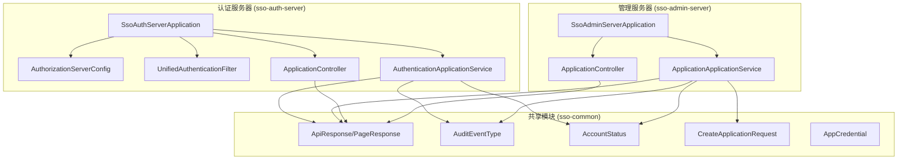
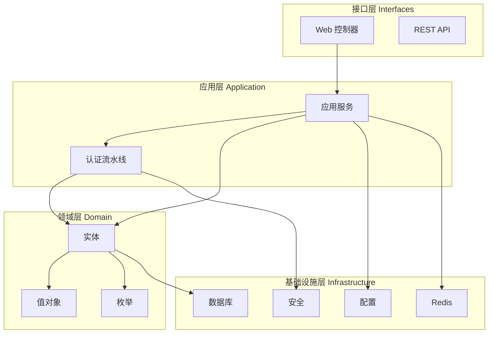
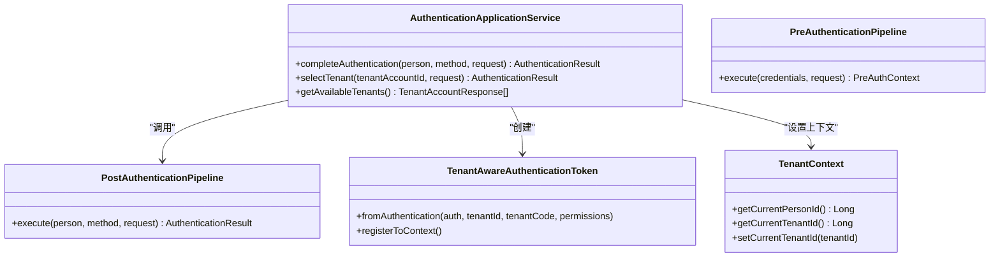
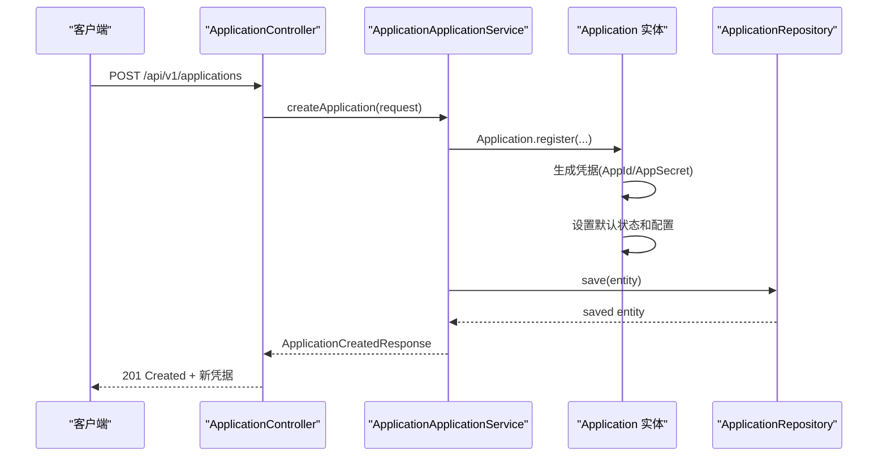
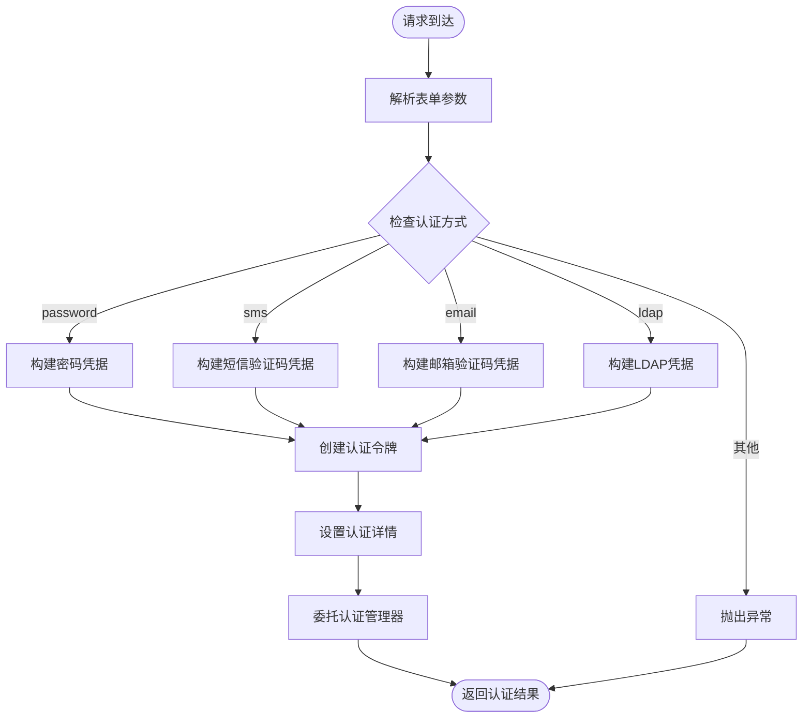
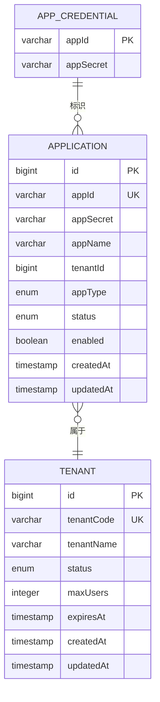
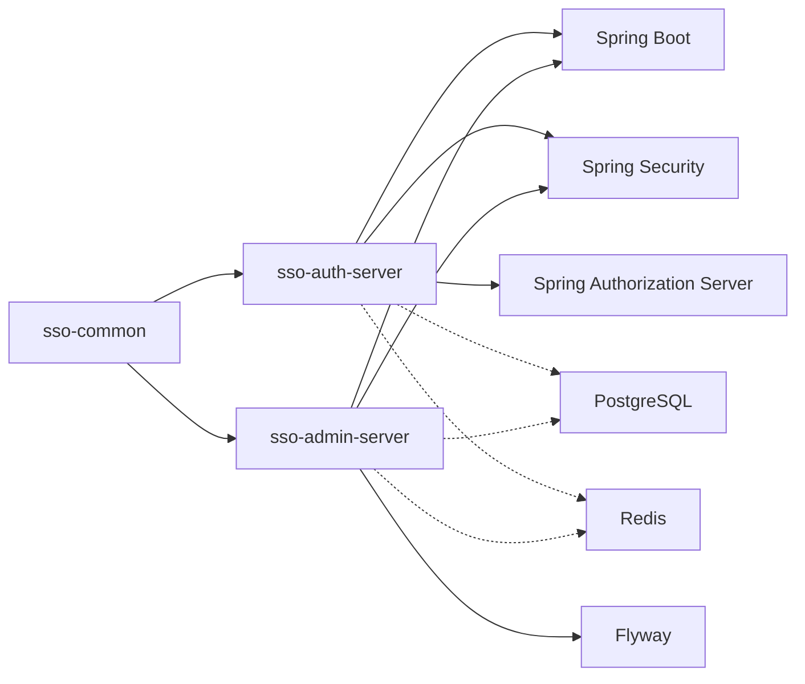

# 统一认证框架

<cite>
**本文档引用的文件**
- [README.md](file://README.md)
- [pom.xml](file://sso-auth-server/pom.xml)
- [pom.xml](file://sso-admin-server/pom.xml)
- [pom.xml](file://sso-common/pom.xml)
- [SsoAuthServerApplication.java](file://sso-auth-server/src/main/java/sso/oidc/auth/SsoAuthServerApplication.java)
- [SsoAdminServerApplication.java](file://sso-admin-server/src/main/java/sso/oidc/admin/SsoAdminServerApplication.java)
- [AuthorizationServerConfig.java](file://sso-auth-server/src/main/java/sso/oidc/auth/infrastructure/config/AuthorizationServerConfig.java)
- [UnifiedAuthenticationFilter.java](file://sso-auth-server/src/main/java/sso/oidc/auth/infrastructure/security/UnifiedAuthenticationFilter.java)
- [AuthenticationApplicationService.java](file://sso-auth-server/src/main/java/sso/oidc/auth/application/service/AuthenticationApplicationService.java)
- [ApplicationApplicationService.java](file://sso-admin-server/src/main/java/sso/oidc/admin/application/service/ApplicationApplicationService.java)
- [AuthenticationController.java](file://sso-auth-server/src/main/java/sso/oidc/auth/interfaces/rest/AuthenticationController.java)
- [ApplicationController.java](file://sso-admin-server/src/main/java/sso/oidc/admin/interfaces/rest/ApplicationController.java)
- [Application.java](file://sso-auth-server/src/main/java/sso/oidc/auth/domain/model/entity/Application.java)
- [Tenant.java](file://sso-auth-server/src/main/java/sso/oidc/auth/domain/model/entity/Tenant.java)
- [AuditEventType.java](file://sso-common/src/main/java/sso/oidc/common/model/enums/AuditEventType.java)
- [AccountStatus.java](file://sso-common/src/main/java/sso/oidc/common/model/enums/AccountStatus.java)
- [CreateApplicationRequest.java](file://sso-common/src/main/java/sso/oidc/common/dto/request/CreateApplicationRequest.java)
- [AppCredential.java](file://sso-common/src/main/java/sso/oidc/common/model/valueobject/AppCredential.java)
</cite>

## 目录
1. [简介](#简介)
2. [项目结构](#项目结构)
3. [核心组件](#核心组件)
4. [架构总览](#架构总览)
5. [详细组件分析](#详细组件分析)
6. [依赖关系分析](#依赖关系分析)
7. [性能考虑](#性能考虑)
8. [故障排除指南](#故障排除指南)
9. [结论](#结论)

## 简介
本项目是一个基于 OpenID Connect 1.0 协议的统一身份认证服务（SSO），为微服务架构提供集中式认证授权能力。系统采用 Clean Architecture + DDD 架构，包含认证服务器（sso-auth-server）和管理服务器（sso-admin-server），并通过共享模块（sso-common）提供通用的数据传输对象、枚举、值对象、异常和工具类。

主要特性包括：
- 支持 OIDC 授权码模式 + PKCE、客户端凭证模式、刷新令牌
- 提供 OIDC 发现端点、JWKS 端点、UserInfo 端点、令牌吊销
- 用户注册与登录、密码管理（BCrypt）、账户状态管理
- OAuth2 客户端管理（客户端密钥 AES-256-GCM 加密）
- 角色权限管理（RBAC）

## 项目结构
项目采用多模块 Maven 结构，分为三个核心模块：

**图表来源**
- [SsoAuthServerApplication.java:1-17](file://sso-auth-server/src/main/java/sso/oidc/auth/SsoAuthServerApplication.java#L1-L17)
- [SsoAdminServerApplication.java:1-17](file://sso-admin-server/src/main/java/sso/oidc/admin/SsoAdminServerApplication.java#L1-L17)
- [AuthorizationServerConfig.java:1-130](file://sso-auth-server/src/main/java/sso/oidc/auth/infrastructure/config/AuthorizationServerConfig.java#L1-L130)
- [UnifiedAuthenticationFilter.java:1-80](file://sso-auth-server/src/main/java/sso/oidc/auth/infrastructure/security/UnifiedAuthenticationFilter.java#L1-L80)
- [AuthenticationApplicationService.java:1-139](file://sso-auth-server/src/main/java/sso/oidc/auth/application/service/AuthenticationApplicationService.java#L1-L139)
- [ApplicationApplicationService.java:1-255](file://sso-admin-server/src/main/java/sso/oidc/admin/application/service/ApplicationApplicationService.java#L1-L255)

**章节来源**
- [README.md:95-108](file://README.md#L95-L108)
- [pom.xml:1-154](file://sso-auth-server/pom.xml#L1-L154)
- [pom.xml:1-144](file://sso-admin-server/pom.xml#L1-L144)
- [pom.xml:1-47](file://sso-common/pom.xml#L1-L47)

## 核心组件
本节介绍系统的关键组件及其职责：

### 认证服务器核心组件
- **SsoAuthServerApplication**: 应用程序入口点，启用配置属性扫描和 JPA 仓库
- **AuthorizationServerConfig**: 配置 OIDC 授权服务器，包括安全过滤链、JWK 源、JWT 解码器
- **UnifiedAuthenticationFilter**: 统一认证过滤器，处理多种认证方式（密码、短信、邮箱、LDAP）
- **AuthenticationApplicationService**: 认证应用服务，完成认证流程和租户选择

### 管理服务器核心组件
- **SsoAdminServerApplication**: 管理服务入口点
- **ApplicationApplicationService**: 应用管理服务，负责应用 CRUD、权限管理和状态变更
- **ApplicationController**: 应用管理 REST 控制器，提供完整的 API 接口

### 共享模块组件
- **ApiResponse/PageResponse**: 统一响应包装
- **AuditEventType**: 审计事件类型枚举
- **AccountStatus**: 账户状态枚举
- **CreateApplicationRequest**: 创建应用请求 DTO
- **AppCredential**: 应用凭据值对象

**章节来源**
- [SsoAuthServerApplication.java:8-16](file://sso-auth-server/src/main/java/sso/oidc/auth/SsoAuthServerApplication.java#L8-L16)
- [AuthorizationServerConfig.java:36-64](file://sso-auth-server/src/main/java/sso/oidc/auth/infrastructure/config/AuthorizationServerConfig.java#L36-L64)
- [UnifiedAuthenticationFilter.java:11-18](file://sso-auth-server/src/main/java/sso/oidc/auth/infrastructure/security/UnifiedAuthenticationFilter.java#L11-L18)
- [AuthenticationApplicationService.java:24-45](file://sso-auth-server/src/main/java/sso/oidc/auth/application/service/AuthenticationApplicationService.java#L24-L45)
- [SsoAdminServerApplication.java:8-16](file://sso-admin-server/src/main/java/sso/oidc/admin/SsoAdminServerApplication.java#L8-L16)
- [ApplicationApplicationService.java:27-62](file://sso-admin-server/src/main/java/sso/oidc/admin/application/service/ApplicationApplicationService.java#L27-L62)
- [ApplicationController.java:28-46](file://sso-admin-server/src/main/java/sso/oidc/admin/interfaces/rest/ApplicationController.java#L28-L46)

## 架构总览
系统采用分层架构，遵循 Clean Architecture 原则：

**图表来源**
- [README.md:97-106](file://README.md#L97-L106)
- [AuthorizationServerConfig.java:36-93](file://sso-auth-server/src/main/java/sso/oidc/auth/infrastructure/config/AuthorizationServerConfig.java#L36-L93)
- [ApplicationApplicationService.java:27-36](file://sso-admin-server/src/main/java/sso/oidc/admin/application/service/ApplicationApplicationService.java#L27-L36)

## 详细组件分析

### 认证流水线组件分析
认证流水线是系统的核心处理逻辑，负责执行各种认证处理器：

**图表来源**
- [AuthenticationApplicationService.java:30-111](file://sso-auth-server/src/main/java/sso/oidc/auth/application/service/AuthenticationApplicationService.java#L30-L111)
- [AuthorizationServerConfig.java:38-64](file://sso-auth-server/src/main/java/sso/oidc/auth/infrastructure/config/AuthorizationServerConfig.java#L38-L64)

**章节来源**
- [AuthenticationApplicationService.java:38-111](file://sso-auth-server/src/main/java/sso/oidc/auth/application/service/AuthenticationApplicationService.java#L38-L111)

### 应用管理组件分析
应用管理服务提供了完整的 OAuth2 客户端生命周期管理：

**图表来源**
- [ApplicationController.java:38-45](file://sso-admin-server/src/main/java/sso/oidc/admin/interfaces/rest/ApplicationController.java#L38-L45)
- [ApplicationApplicationService.java:35-62](file://sso-admin-server/src/main/java/sso/oidc/admin/application/service/ApplicationApplicationService.java#L35-L62)
- [Application.java:45-78](file://sso-auth-server/src/main/java/sso/oidc/auth/domain/model/entity/Application.java#L45-L78)

**章节来源**
- [ApplicationController.java:36-114](file://sso-admin-server/src/main/java/sso/oidc/admin/interfaces/rest/ApplicationController.java#L36-L114)
- [ApplicationApplicationService.java:35-147](file://sso-admin-server/src/main/java/sso/oidc/admin/application/service/ApplicationApplicationService.java#L35-L147)
- [Application.java:45-92](file://sso-auth-server/src/main/java/sso/oidc/auth/domain/model/entity/Application.java#L45-L92)

### 统一认证过滤器组件分析
统一认证过滤器处理多种认证方式：

**图表来源**
- [UnifiedAuthenticationFilter.java:31-78](file://sso-auth-server/src/main/java/sso/oidc/auth/infrastructure/security/UnifiedAuthenticationFilter.java#L31-L78)

**章节来源**
- [UnifiedAuthenticationFilter.java:31-78](file://sso-auth-server/src/main/java/sso/oidc/auth/infrastructure/security/UnifiedAuthenticationFilter.java#L31-L78)

### 数据模型组件分析
系统的核心数据模型包括应用、租户和凭据：

**图表来源**
- [Application.java:21-41](file://sso-auth-server/src/main/java/sso/oidc/auth/domain/model/entity/Application.java#L21-L41)
- [Tenant.java:16-26](file://sso-auth-server/src/main/java/sso/oidc/auth/domain/model/entity/Tenant.java#L16-L26)
- [AppCredential.java:14-24](file://sso-common/src/main/java/sso/oidc/common/model/valueobject/AppCredential.java#L14-L24)

**章节来源**
- [Application.java:21-78](file://sso-auth-server/src/main/java/sso/oidc/auth/domain/model/entity/Application.java#L21-L78)
- [Tenant.java:16-80](file://sso-auth-server/src/main/java/sso/oidc/auth/domain/model/entity/Tenant.java#L16-L80)
- [AppCredential.java:26-60](file://sso-common/src/main/java/sso/oidc/common/model/valueobject/AppCredential.java#L26-L60)

## 依赖关系分析
系统模块间的依赖关系如下：

**图表来源**
- [pom.xml:18-61](file://sso-auth-server/pom.xml#L18-L61)
- [pom.xml:18-80](file://sso-admin-server/pom.xml#L18-L80)
- [pom.xml:18-36](file://sso-common/pom.xml#L18-L36)

**章节来源**
- [pom.xml:18-154](file://sso-auth-server/pom.xml#L18-L154)
- [pom.xml:18-144](file://sso-admin-server/pom.xml#L18-L144)
- [pom.xml:18-47](file://sso-common/pom.xml#L18-L47)

## 性能考虑
系统在设计时考虑了以下性能优化：

### 缓存策略
- 使用 Redis 作为分布式会话存储
- JWT 令牌缓存减少重复计算
- 配置项缓存避免频繁读取

### 数据库优化
- 合理的索引设计（主键、唯一约束）
- 批量操作减少数据库往返
- 连接池配置优化

### 安全性能
- RSA 密钥指纹稳定，避免 JWKS 缓存失效
- JWT 解码器预热
- 认证策略异步化

## 故障排除指南
常见问题及解决方案：

### 认证失败排查
1. **凭据错误**: 检查用户名密码或验证码是否正确
2. **账户锁定**: 查看账户状态是否被锁定
3. **租户无效**: 确认租户账户是否激活

### 应用配置问题
1. **回调地址不匹配**: 检查应用配置的回调地址
2. **客户端密钥错误**: 确认使用正确的 appSecret
3. **权限不足**: 验证应用权限配置

### 系统集成问题
1. **OIDC 发现端点**: 确认 issuer URI 配置正确
2. **JWKS 端点**: 检查 RSA 密钥配置
3. **令牌验证**: 验证资源服务器配置

**章节来源**
- [AuthenticationApplicationService.java:52-75](file://sso-auth-server/src/main/java/sso/oidc/auth/application/service/AuthenticationApplicationService.java#L52-L75)
- [ApplicationApplicationService.java:137-146](file://sso-admin-server/src/main/java/sso/oidc/admin/application/service/ApplicationApplicationService.java#L137-L146)

## 结论
统一认证框架通过清晰的分层架构和模块化设计，提供了完整的 SSO 解决方案。系统具备良好的扩展性、安全性和可维护性，能够满足企业级微服务架构的身份认证需求。通过标准化的 API 接口和完善的审计机制，为后续的功能扩展和业务发展奠定了坚实基础。