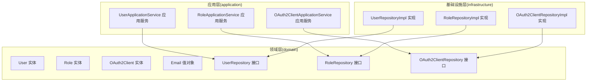
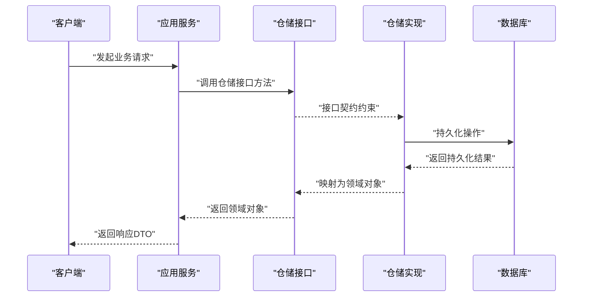
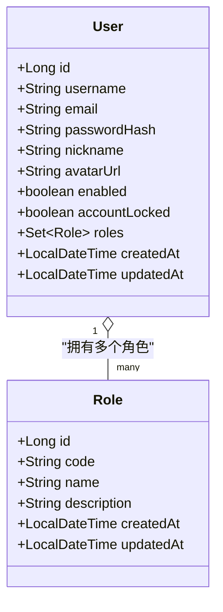
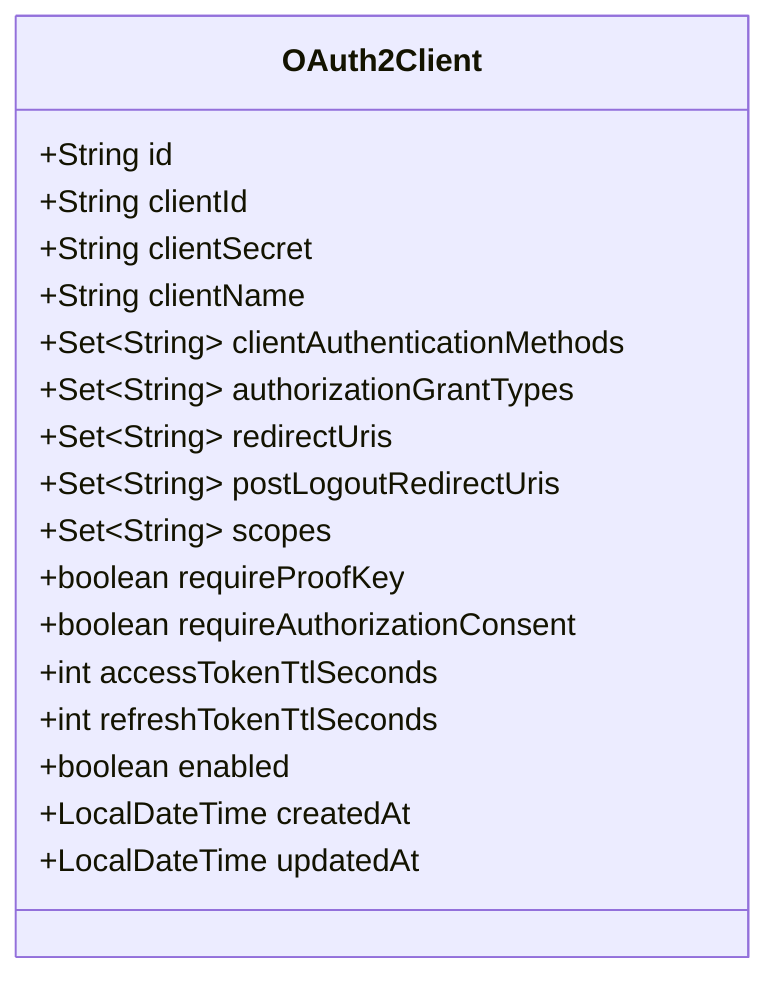
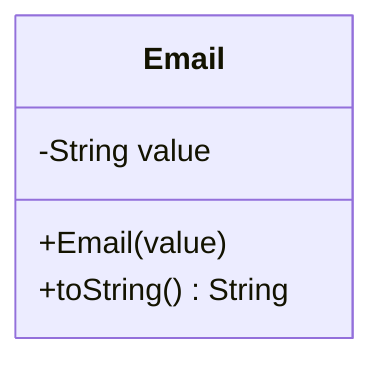
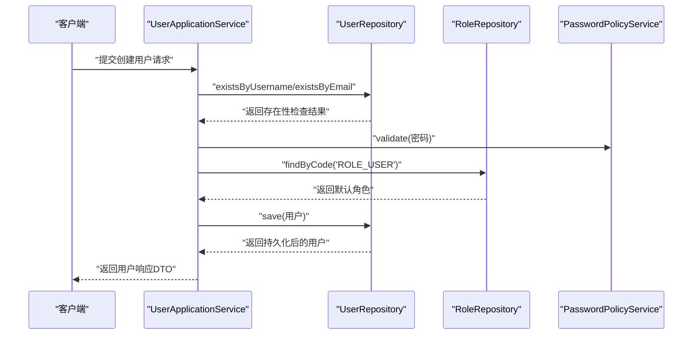
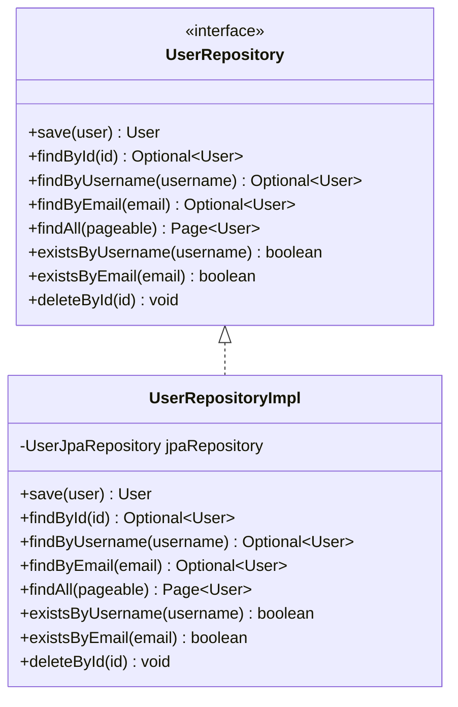
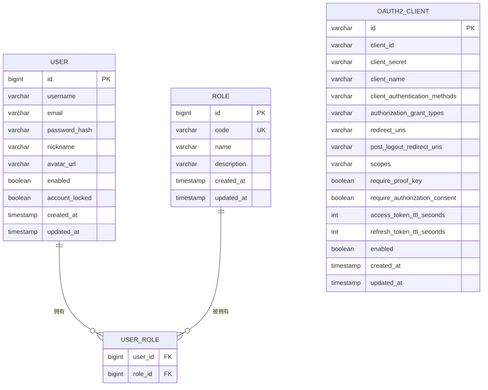
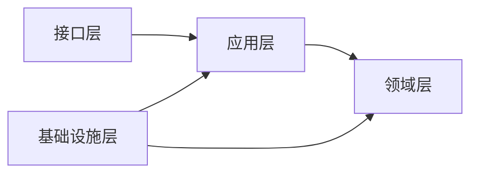

# 领域驱动设计(Domain Driven Design)

<cite>
**本文引用的文件**
- [User.java](file://src/main/java/sso/oidc/domain/model/entity/User.java)
- [Role.java](file://src/main/java/sso/oidc/domain/model/entity/Role.java)
- [OAuth2Client.java](file://src/main/java/sso/oidc/domain/model/entity/OAuth2Client.java)
- [Email.java](file://src/main/java/sso/oidc/domain/model/valueobject/Email.java)
- [UserRepository.java](file://src/main/java/sso/oidc/domain/repository/UserRepository.java)
- [RoleRepository.java](file://src/main/java/sso/oidc/domain/repository/RoleRepository.java)
- [OAuth2ClientRepository.java](file://src/main/java/sso/oidc/domain/repository/OAuth2ClientRepository.java)
- [UserApplicationService.java](file://src/main/java/sso/oidc/application/service/UserApplicationService.java)
- [RoleApplicationService.java](file://src/main/java/sso/oidc/application/service/RoleApplicationService.java)
- [OAuth2ClientApplicationService.java](file://src/main/java/sso/oidc/application/service/OAuth2ClientApplicationService.java)
- [UserRepositoryImpl.java](file://src/main/java/sso/oidc/infrastructure/persistence/impl/UserRepositoryImpl.java)
- [RoleRepositoryImpl.java](file://src/main/java/sso/oidc/infrastructure/persistence/impl/RoleRepositoryImpl.java)
- [OAuth2ClientRepositoryImpl.java](file://src/main/java/sso/oidc/infrastructure/persistence/impl/OAuth2ClientRepositoryImpl.java)
- [CreateUserRequest.java](file://src/main/java/sso/oidc/application/dto/request/CreateUserRequest.java)
- [UserResponse.java](file://src/main/java/sso/oidc/application/dto/response/UserResponse.java)
</cite>

## 目录
1. [引言](#引言)
2. [项目结构](#项目结构)
3. [核心组件](#核心组件)
4. [架构总览](#架构总览)
5. [详细组件分析](#详细组件分析)
6. [依赖分析](#依赖分析)
7. [性能考虑](#性能考虑)
8. [故障排查指南](#故障排查指南)
9. [结论](#结论)
10. [附录](#附录)

## 引言
本文件面向IAM Platform认证服务的领域驱动设计（DDD）实践，系统化阐述领域模型的设计理念与落地方式，覆盖实体（Entity）、值对象（Value Object）、聚合根（Aggregate Root）、仓储（Repository）与应用服务（Application Service）的职责划分与协作关系。文档重点解释用户、角色、OAuth2客户端等核心领域对象的建模思路与业务规则封装，说明仓储接口的设计模式与实现策略，以及领域服务的边界与作用。同时，提供实体关系图与聚合边界图，帮助读者快速把握系统的领域结构与数据流。

## 项目结构
该工程采用分层架构与DDD分层组织方式：
- domain：领域层，包含实体、值对象、仓储接口与领域服务
- application：应用层，包含应用服务与DTO
- infrastructure：基础设施层，包含仓储实现、持久化对象与配置
- interfaces：接口层，包含控制器与Web端点
- resources：资源与数据库迁移脚本

图表来源
- [User.java:1-40](file://src/main/java/sso/oidc/domain/model/entity/User.java#L1-L40)
- [Role.java:1-24](file://src/main/java/sso/oidc/domain/model/entity/Role.java#L1-L24)
- [OAuth2Client.java:1-73](file://src/main/java/sso/oidc/domain/model/entity/OAuth2Client.java#L1-L73)
- [Email.java:1-31](file://src/main/java/sso/oidc/domain/model/valueobject/Email.java#L1-L31)
- [UserRepository.java:1-26](file://src/main/java/sso/oidc/domain/repository/UserRepository.java#L1-L26)
- [RoleRepository.java:1-19](file://src/main/java/sso/oidc/domain/repository/RoleRepository.java#L1-L19)
- [OAuth2ClientRepository.java:1-20](file://src/main/java/sso/oidc/domain/repository/OAuth2ClientRepository.java#L1-L20)
- [UserApplicationService.java:1-165](file://src/main/java/sso/oidc/application/service/UserApplicationService.java#L1-L165)
- [RoleApplicationService.java:1-63](file://src/main/java/sso/oidc/application/service/RoleApplicationService.java#L1-L63)
- [OAuth2ClientApplicationService.java:1-170](file://src/main/java/sso/oidc/application/service/OAuth2ClientApplicationService.java#L1-L170)
- [UserRepositoryImpl.java:1-92](file://src/main/java/sso/oidc/infrastructure/persistence/impl/UserRepositoryImpl.java#L1-L92)
- [RoleRepositoryImpl.java:1-61](file://src/main/java/sso/oidc/infrastructure/persistence/impl/RoleRepositoryImpl.java#L1-L61)
- [OAuth2ClientRepositoryImpl.java:1-103](file://src/main/java/sso/oidc/infrastructure/persistence/impl/OAuth2ClientRepositoryImpl.java#L1-L103)

章节来源
- [User.java:1-40](file://src/main/java/sso/oidc/domain/model/entity/User.java#L1-L40)
- [Role.java:1-24](file://src/main/java/sso/oidc/domain/model/entity/Role.java#L1-L24)
- [OAuth2Client.java:1-73](file://src/main/java/sso/oidc/domain/model/entity/OAuth2Client.java#L1-L73)
- [Email.java:1-31](file://src/main/java/sso/oidc/domain/model/valueobject/Email.java#L1-L31)
- [UserRepository.java:1-26](file://src/main/java/sso/oidc/domain/repository/UserRepository.java#L1-L26)
- [RoleRepository.java:1-19](file://src/main/java/sso/oidc/domain/repository/RoleRepository.java#L1-L19)
- [OAuth2ClientRepository.java:1-20](file://src/main/java/sso/oidc/domain/repository/OAuth2ClientRepository.java#L1-L20)
- [UserApplicationService.java:1-165](file://src/main/java/sso/oidc/application/service/UserApplicationService.java#L1-L165)
- [RoleApplicationService.java:1-63](file://src/main/java/sso/oidc/application/service/RoleApplicationService.java#L1-L63)
- [OAuth2ClientApplicationService.java:1-170](file://src/main/java/sso/oidc/application/service/OAuth2ClientApplicationService.java#L1-L170)
- [UserRepositoryImpl.java:1-92](file://src/main/java/sso/oidc/infrastructure/persistence/impl/UserRepositoryImpl.java#L1-L92)
- [RoleRepositoryImpl.java:1-61](file://src/main/java/sso/oidc/infrastructure/persistence/impl/RoleRepositoryImpl.java#L1-L61)
- [OAuth2ClientRepositoryImpl.java:1-103](file://src/main/java/sso/oidc/infrastructure/persistence/impl/OAuth2ClientRepositoryImpl.java#L1-L103)

## 核心组件
本节从DDD视角对核心领域对象进行剖析，明确实体、值对象、仓储与应用服务的职责与协作。

- 实体（Entity）
  - User：用户实体，包含身份标识、凭证哈希、启用状态、锁定状态、角色集合与时间戳等属性；提供懒加载的角色集合初始化逻辑，确保空安全访问。
  - Role：角色实体，包含唯一编码、名称与描述等元信息，用于权限控制。
  - OAuth2Client：OAuth2/OIDC客户端实体，包含客户端标识、密钥、授权方法、授权类型、重定向URI、作用域、令牌有效期、启用状态等，支持多集合字段的懒初始化。
- 值对象（Value Object）
  - Email：不可变值对象，封装邮箱格式校验与字符串表示，保证领域内邮箱数据的一致性与有效性。
- 仓储接口（Repository）
  - UserRepository：提供用户存取、查询、去重校验与删除能力。
  - RoleRepository：提供角色存取、按编码查询与列表查询能力。
  - OAuth2ClientRepository：提供客户端存取、按ID与clientId查询、分页查询与删除能力。
- 应用服务（Application Service）
  - UserApplicationService：负责用户生命周期管理、密码变更、角色分配与移除、分页查询等业务编排。
  - RoleApplicationService：负责角色的创建、查询与删除。
  - OAuth2ClientApplicationService：负责客户端注册、更新、删除、分页查询与密钥轮换等业务编排。

章节来源
- [User.java:1-40](file://src/main/java/sso/oidc/domain/model/entity/User.java#L1-L40)
- [Role.java:1-24](file://src/main/java/sso/oidc/domain/model/entity/Role.java#L1-L24)
- [OAuth2Client.java:1-73](file://src/main/java/sso/oidc/domain/model/entity/OAuth2Client.java#L1-L73)
- [Email.java:1-31](file://src/main/java/sso/oidc/domain/model/valueobject/Email.java#L1-L31)
- [UserRepository.java:1-26](file://src/main/java/sso/oidc/domain/repository/UserRepository.java#L1-L26)
- [RoleRepository.java:1-19](file://src/main/java/sso/oidc/domain/repository/RoleRepository.java#L1-L19)
- [OAuth2ClientRepository.java:1-20](file://src/main/java/sso/oidc/domain/repository/OAuth2ClientRepository.java#L1-L20)
- [UserApplicationService.java:1-165](file://src/main/java/sso/oidc/application/service/UserApplicationService.java#L1-L165)
- [RoleApplicationService.java:1-63](file://src/main/java/sso/oidc/application/service/RoleApplicationService.java#L1-L63)
- [OAuth2ClientApplicationService.java:1-170](file://src/main/java/sso/oidc/application/service/OAuth2ClientApplicationService.java#L1-L170)

## 架构总览
下图展示了从应用服务到仓储接口再到基础设施实现的数据流与职责边界，体现DDD的分层与依赖倒置原则。

图表来源
- [UserApplicationService.java:36-63](file://src/main/java/sso/oidc/application/service/UserApplicationService.java#L36-L63)
- [RoleApplicationService.java:21-31](file://src/main/java/sso/oidc/application/service/RoleApplicationService.java#L21-L31)
- [OAuth2ClientApplicationService.java:29-72](file://src/main/java/sso/oidc/application/service/OAuth2ClientApplicationService.java#L29-L72)
- [UserRepositoryImpl.java:20-25](file://src/main/java/sso/oidc/infrastructure/persistence/impl/UserRepositoryImpl.java#L20-L25)
- [RoleRepositoryImpl.java:19-24](file://src/main/java/sso/oidc/infrastructure/persistence/impl/RoleRepositoryImpl.java#L19-L24)
- [OAuth2ClientRepositoryImpl.java:24-29](file://src/main/java/sso/oidc/infrastructure/persistence/impl/OAuth2ClientRepositoryImpl.java#L24-L29)

## 详细组件分析

### 用户聚合与聚合边界
用户聚合围绕User实体为核心，包含角色集合与基础身份信息。聚合边界内的业务规则由应用服务统一编排，确保一致性与原子性。

图表来源
- [User.java:18-38](file://src/main/java/sso/oidc/domain/model/entity/User.java#L18-L38)
- [Role.java:16-23](file://src/main/java/sso/oidc/domain/model/entity/Role.java#L16-L23)

章节来源
- [User.java:1-40](file://src/main/java/sso/oidc/domain/model/entity/User.java#L1-L40)
- [Role.java:1-24](file://src/main/java/sso/oidc/domain/model/entity/Role.java#L1-L24)
- [UserApplicationService.java:127-139](file://src/main/java/sso/oidc/application/service/UserApplicationService.java#L127-L139)

### OAuth2客户端聚合与边界
OAuth2客户端聚合以OAuth2Client为核心，包含授权方法、授权类型、重定向URI、作用域、令牌有效期等配置项，支持多集合字段的懒初始化与持久化转换。

图表来源
- [OAuth2Client.java:17-72](file://src/main/java/sso/oidc/domain/model/entity/OAuth2Client.java#L17-L72)

章节来源
- [OAuth2Client.java:1-73](file://src/main/java/sso/oidc/domain/model/entity/OAuth2Client.java#L1-L73)
- [OAuth2ClientRepositoryImpl.java:51-89](file://src/main/java/sso/oidc/infrastructure/persistence/impl/OAuth2ClientRepositoryImpl.java#L51-L89)

### 值对象：Email
Email作为不可变值对象，集中处理邮箱格式校验，避免在各处重复校验逻辑，提升一致性与可维护性。

图表来源
- [Email.java:11-29](file://src/main/java/sso/oidc/domain/model/valueobject/Email.java#L11-L29)

章节来源
- [Email.java:1-31](file://src/main/java/sso/oidc/domain/model/valueobject/Email.java#L1-L31)

### 应用服务流程：用户创建
用户创建流程体现了应用服务的编排职责：参数校验、去重检查、密码策略验证、默认角色装配与事务性保存。

图表来源
- [UserApplicationService.java:36-63](file://src/main/java/sso/oidc/application/service/UserApplicationService.java#L36-L63)
- [UserRepository.java:10-24](file://src/main/java/sso/oidc/domain/repository/UserRepository.java#L10-L24)
- [RoleRepository.java:9-17](file://src/main/java/sso/oidc/domain/repository/RoleRepository.java#L9-L17)

章节来源
- [UserApplicationService.java:36-63](file://src/main/java/sso/oidc/application/service/UserApplicationService.java#L36-L63)
- [CreateUserRequest.java:15-30](file://src/main/java/sso/oidc/application/dto/request/CreateUserRequest.java#L15-L30)
- [UserResponse.java:15-25](file://src/main/java/sso/oidc/application/dto/response/UserResponse.java#L15-L25)

### 仓储接口设计与实现策略
- 设计模式
  - 仓储接口与实现分离：通过接口定义契约，实现类负责与底层存储交互，便于替换与测试。
  - 映射策略：实现类负责将领域对象与持久化对象（PO）相互转换，保持领域模型与存储模型解耦。
  - 集合字段处理：针对多集合字段（如OAuth2Client的授权类型、重定向URI等），实现类提供集合与字符串之间的转换逻辑，确保持久化存储的简洁性与读取时的可用性。
- 实现策略
  - User：实现中完成User与UserPO的双向映射，支持分页查询与存在性检查。
  - Role：实现中完成Role与RolePO的双向映射，支持按编码查询与全量列表。
  - OAuth2Client：实现中完成OAuth2Client与OAuth2ClientPO的双向映射，并提供集合与字符串的转换工具方法。

图表来源
- [UserRepository.java:9-25](file://src/main/java/sso/oidc/domain/repository/UserRepository.java#L9-L25)
- [UserRepositoryImpl.java:16-60](file://src/main/java/sso/oidc/infrastructure/persistence/impl/UserRepositoryImpl.java#L16-L60)

章节来源
- [UserRepository.java:1-26](file://src/main/java/sso/oidc/domain/repository/UserRepository.java#L1-L26)
- [UserRepositoryImpl.java:1-92](file://src/main/java/sso/oidc/infrastructure/persistence/impl/UserRepositoryImpl.java#L1-L92)
- [RoleRepository.java:1-19](file://src/main/java/sso/oidc/domain/repository/RoleRepository.java#L1-L19)
- [RoleRepositoryImpl.java:1-61](file://src/main/java/sso/oidc/infrastructure/persistence/impl/RoleRepositoryImpl.java#L1-L61)
- [OAuth2ClientRepository.java:1-20](file://src/main/java/sso/oidc/domain/repository/OAuth2ClientRepository.java#L1-L20)
- [OAuth2ClientRepositoryImpl.java:1-103](file://src/main/java/sso/oidc/infrastructure/persistence/impl/OAuth2ClientRepositoryImpl.java#L1-L103)

### 领域服务与边界
- 密码策略服务：在应用服务中被调用，用于校验新密码强度，确保密码策略在业务流程中得到一致执行。
- 领域事件：当前代码未显式定义领域事件，可在需要的地方引入事件发布/订阅机制，以解耦跨聚合或跨模块的副作用。

章节来源
- [UserApplicationService.java:33-34](file://src/main/java/sso/oidc/application/service/UserApplicationService.java#L33-L34)

### 聚合边界与实体关系图
下图总结了用户、角色与OAuth2客户端三者的聚合边界与关系，突出用户聚合与角色的关联，以及客户端聚合的独立性。

图表来源
- [User.java:18-38](file://src/main/java/sso/oidc/domain/model/entity/User.java#L18-L38)
- [Role.java:16-23](file://src/main/java/sso/oidc/domain/model/entity/Role.java#L16-L23)
- [OAuth2Client.java:17-72](file://src/main/java/sso/oidc/domain/model/entity/OAuth2Client.java#L17-L72)
- [UserRepositoryImpl.java:77-90](file://src/main/java/sso/oidc/infrastructure/persistence/impl/UserRepositoryImpl.java#L77-L90)
- [RoleRepositoryImpl.java:50-59](file://src/main/java/sso/oidc/infrastructure/persistence/impl/RoleRepositoryImpl.java#L50-L59)
- [OAuth2ClientRepositoryImpl.java:70-89](file://src/main/java/sso/oidc/infrastructure/persistence/impl/OAuth2ClientRepositoryImpl.java#L70-L89)

## 依赖分析
- 分层依赖方向：应用层依赖领域层接口（仓储接口），基础设施层实现领域层接口，接口层依赖应用层与基础设施层。
- 耦合与内聚：仓储接口提供高内聚的领域操作契约，实现类专注于存储细节，降低领域模型对存储技术的依赖。
- 外部依赖：应用服务依赖Spring Security的PasswordEncoder与事务注解，确保密码加密与事务边界。

图表来源
- [UserApplicationService.java:31-34](file://src/main/java/sso/oidc/application/service/UserApplicationService.java#L31-L34)
- [UserRepositoryImpl.java:18-18](file://src/main/java/sso/oidc/infrastructure/persistence/impl/UserRepositoryImpl.java#L18-L18)

章节来源
- [UserApplicationService.java:1-165](file://src/main/java/sso/oidc/application/service/UserApplicationService.java#L1-L165)
- [UserRepositoryImpl.java:1-92](file://src/main/java/sso/oidc/infrastructure/persistence/impl/UserRepositoryImpl.java#L1-L92)

## 性能考虑
- 查询优化：分页查询应结合索引与合适的pageable参数，避免一次性加载大量数据。
- 集合字段处理：在仓储实现中对集合字段进行字符串拼接与拆分，建议在批量写入时减少转换开销，必要时在DAO层进行原生SQL优化。
- 缓存策略：对只读数据（如默认角色）可引入缓存，减少重复查询。
- 事务范围：应用服务的事务应尽量短小，避免在事务中执行耗时操作（如网络调用、文件IO）。

## 故障排查指南
- 用户不存在/已存在异常：在用户创建与更新时，若用户名或邮箱冲突会抛出相应异常；请检查输入参数与数据库唯一约束。
- 角色不存在：角色分配/移除时若角色编码不存在会抛出异常；请确认角色是否已创建。
- 客户端不存在：客户端更新/删除/轮换密钥时若客户端不存在会抛出异常；请确认客户端ID是否正确。
- 密码不匹配：修改密码时旧密码不匹配会抛出异常；请确认旧密码输入正确。

章节来源
- [UserApplicationService.java:38-43](file://src/main/java/sso/oidc/application/service/UserApplicationService.java#L38-L43)
- [UserApplicationService.java:113-124](file://src/main/java/sso/oidc/application/service/UserApplicationService.java#L113-L124)
- [OAuth2ClientApplicationService.java:110-117](file://src/main/java/sso/oidc/application/service/OAuth2ClientApplicationService.java#L110-L117)
- [OAuth2ClientApplicationService.java:129-139](file://src/main/java/sso/oidc/application/service/OAuth2ClientApplicationService.java#L129-L139)

## 结论
本项目遵循DDD分层与聚合设计原则，通过清晰的实体/值对象建模、仓储接口契约与应用服务编排，实现了用户、角色与OAuth2客户端的核心业务闭环。仓储实现与领域模型解耦，便于扩展与测试；应用服务承担业务协调职责，确保事务边界与业务规则的一致性。未来可在需要时引入领域事件与更细粒度的聚合内行为封装，进一步增强系统的可维护性与演进能力。

## 附录
- 代码示例路径（不含具体代码内容）：
  - 用户创建流程：[UserApplicationService.java:36-63](file://src/main/java/sso/oidc/application/service/UserApplicationService.java#L36-L63)
  - 用户更新流程：[UserApplicationService.java:71-92](file://src/main/java/sso/oidc/application/service/UserApplicationService.java#L71-L92)
  - 密码变更流程：[UserApplicationService.java:112-125](file://src/main/java/sso/oidc/application/service/UserApplicationService.java#L112-L125)
  - 角色分配流程：[UserApplicationService.java:127-139](file://src/main/java/sso/oidc/application/service/UserApplicationService.java#L127-L139)
  - 客户端注册流程：[OAuth2ClientApplicationService.java:29-72](file://src/main/java/sso/oidc/application/service/OAuth2ClientApplicationService.java#L29-L72)
  - 客户端密钥轮换流程：[OAuth2ClientApplicationService.java:128-153](file://src/main/java/sso/oidc/application/service/OAuth2ClientApplicationService.java#L128-L153)
  - 用户仓储实现（保存/查询/分页）：[UserRepositoryImpl.java:20-45](file://src/main/java/sso/oidc/infrastructure/persistence/impl/UserRepositoryImpl.java#L20-L45)
  - 角色仓储实现（保存/查询/列表）：[RoleRepositoryImpl.java:19-39](file://src/main/java/sso/oidc/infrastructure/persistence/impl/RoleRepositoryImpl.java#L19-L39)
  - 客户端仓储实现（保存/查询/集合转换）：[OAuth2ClientRepositoryImpl.java:24-49](file://src/main/java/sso/oidc/infrastructure/persistence/impl/OAuth2ClientRepositoryImpl.java#L24-L49)