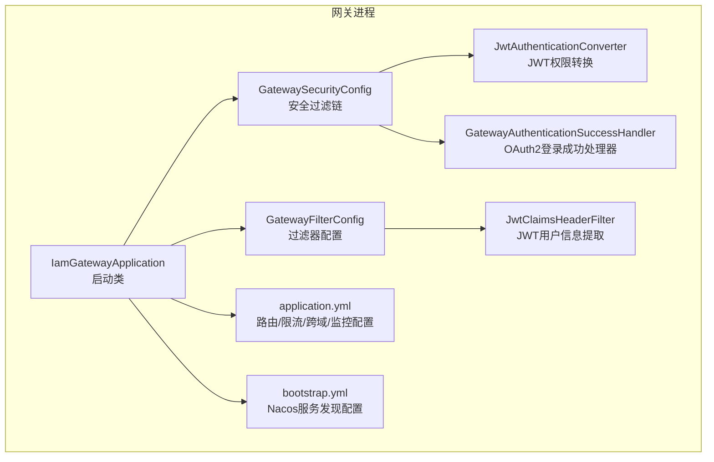
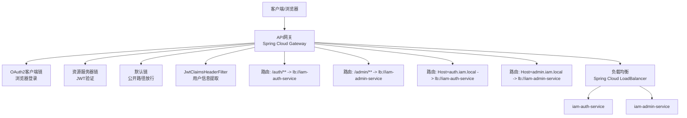
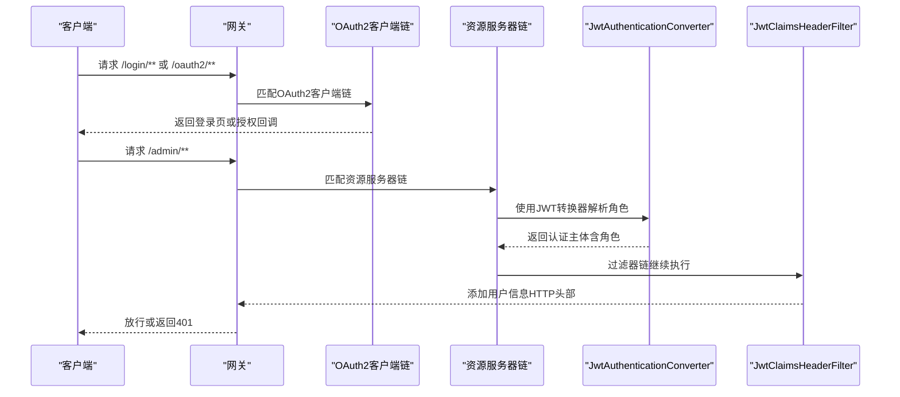
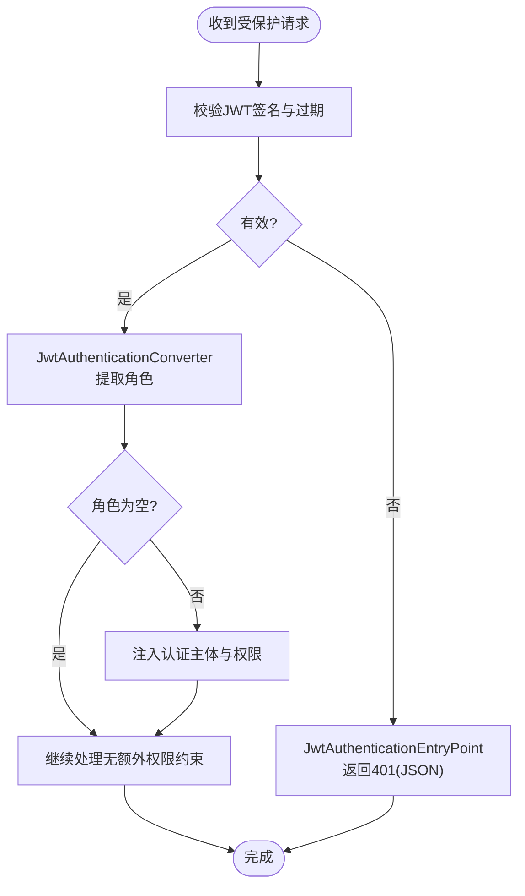
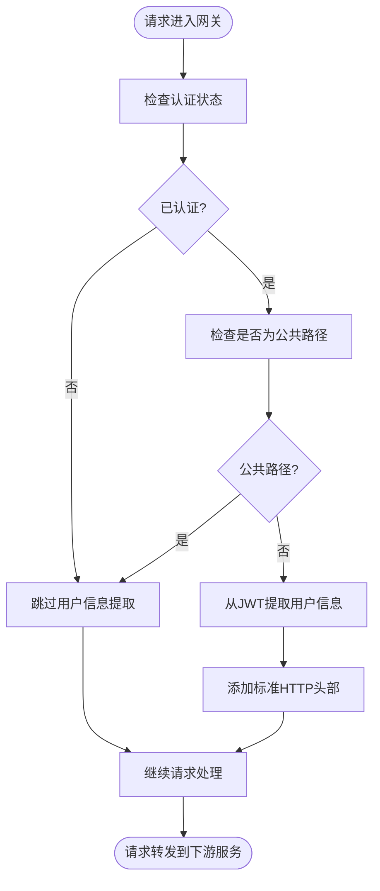
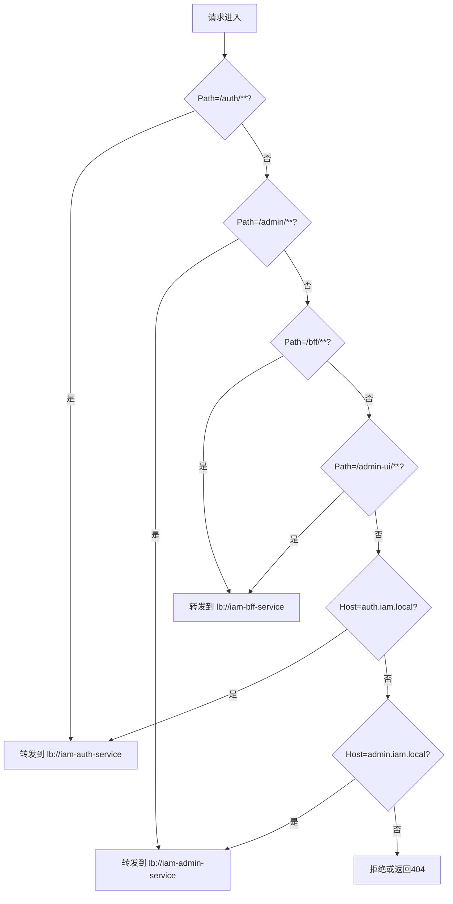
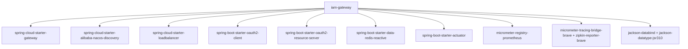

# API网关（iam-gateway）

<cite>
**本文引用的文件**
- [IamGatewayApplication.java](file://iam-gateway/src/main/java/iam/platform/gateway/IamGatewayApplication.java)
- [GatewaySecurityConfig.java](file://iam-gateway/src/main/java/iam/platform/gateway/infrastructure/security/GatewaySecurityConfig.java)
- [JwtAuthenticationConverter.java](file://iam-gateway/src/main/java/iam/platform/gateway/infrastructure/security/JwtAuthenticationConverter.java)
- [GatewayAuthenticationSuccessHandler.java](file://iam-gateway/src/main/java/iam/platform/gateway/infrastructure/security/GatewayAuthenticationSuccessHandler.java)
- [JwtClaimsHeaderFilter.java](file://iam-gateway/src/main/java/iam/platform/gateway/infrastructure/filter/JwtClaimsHeaderFilter.java)
- [GatewayFilterConfig.java](file://iam-gateway/src/main/java/iam/platform/gateway/infrastructure/config/GatewayFilterConfig.java)
- [application.yml](file://iam-gateway/src/main/resources/application.yml)
- [bootstrap.yml](file://iam-gateway/bootstrap.yml)
- [pom.xml](file://iam-gateway/pom.xml)
- [README.md](file://README.md)
</cite>

## 更新摘要
**变更内容**
- 新增JwtClaimsHeaderFilter组件，从JWT令牌中提取用户和租户信息并添加标准HTTP头部
- 增强跨服务通信能力，提供标准化的用户身份传递机制
- 新增GatewayFilterConfig配置类，管理过滤器相关Bean的注册
- 更新安全过滤链与请求处理流程，确保用户信息在请求转发前被正确提取和传递

## 目录
1. [简介](#简介)
2. [项目结构](#项目结构)
3. [核心组件](#核心组件)
4. [架构总览](#架构总览)
5. [详细组件分析](#详细组件分析)
6. [依赖分析](#依赖分析)
7. [性能考虑](#性能考虑)
8. [故障排查指南](#故障排查指南)
9. [结论](#结论)
10. [附录](#附录)

## 简介
本文件为 IAM 平台的 API 网关（iam-gateway）的综合技术文档。重点覆盖以下方面：
- 路由配置与请求转发机制
- 负载均衡与服务发现集成
- 安全过滤链路与认证授权
- JWT 令牌验证、认证转换器与权限拦截
- **新增：JwtClaimsHeaderFilter用户信息提取与传递**
- 限流保护与跨域策略
- 性能优化、监控与可观测性
- 故障排查与运维建议
- 自定义路由与扩展实践

## 项目结构
iam-gateway 是一个基于 Spring Cloud Gateway 的响应式网关，负责对外统一入口、路由转发、鉴权与限流。其核心结构如下：
- 启动类：应用入口，启用服务发现客户端
- 安全配置：三段式安全过滤链，分别处理浏览器登录、资源服务器 JWT 验证、默认放行路径
- 认证转换器：从 JWT 中提取角色并转换为认证主体
- **新增：过滤器配置：管理JwtClaimsHeaderFilter等WebFlux过滤器**
- **新增：JwtClaimsHeaderFilter：从JWT提取用户信息并添加HTTP头部**
- 配置文件：路由规则、全局跨域、OAuth2/OIDC 客户端与资源服务器配置、Redis 限流、管理端点与监控

**图表来源**
- [IamGatewayApplication.java:1-15](file://iam-gateway/src/main/java/iam/platform/gateway/IamGatewayApplication.java#L1-L15)
- [GatewaySecurityConfig.java:1-131](file://iam-gateway/src/main/java/iam/platform/gateway/infrastructure/security/GatewaySecurityConfig.java#L1-L131)
- [JwtAuthenticationConverter.java:1-49](file://iam-gateway/src/main/java/iam/platform/gateway/infrastructure/security/JwtAuthenticationConverter.java#L1-L49)
- [GatewayAuthenticationSuccessHandler.java:1-37](file://iam-gateway/src/main/java/iam/platform/gateway/infrastructure/security/GatewayAuthenticationSuccessHandler.java#L1-L37)
- [GatewayFilterConfig.java:1-38](file://iam-gateway/src/main/java/iam/platform/gateway/infrastructure/config/GatewayFilterConfig.java#L1-L38)
- [JwtClaimsHeaderFilter.java:1-192](file://iam-gateway/src/main/java/iam/platform/gateway/infrastructure/filter/JwtClaimsHeaderFilter.java#L1-L192)
- [application.yml:1-142](file://iam-gateway/src/main/resources/application.yml#L1-L142)
- [bootstrap.yml:1-10](file://iam-gateway/bootstrap.yml#L1-L10)

**章节来源**
- [IamGatewayApplication.java:1-15](file://iam-gateway/src/main/java/iam/platform/gateway/IamGatewayApplication.java#L1-L15)
- [application.yml:1-142](file://iam-gateway/src/main/resources/application.yml#L1-L142)
- [bootstrap.yml:1-10](file://iam-gateway/bootstrap.yml#L1-L10)

## 核心组件
- 启动与发现
  - 启动类启用 Spring Boot 与服务发现客户端，便于与 Nacos 集成
- 安全过滤链
  - OAuth2 客户端链：处理浏览器登录流程，放行登录相关路径，其余路径需认证
  - 资源服务器链：对受保护路径进行 JWT 验证，使用自定义认证转换器
  - 默认链：放行公开路径（如 /auth/**、/static/**、/error、/actuator/** 等）
- **新增：过滤器配置**
  - GatewayFilterConfig：管理WebFlux过滤器的注册与配置
  - JwtClaimsHeaderFilter：从JWT令牌中提取用户和租户信息并添加标准HTTP头部
- 认证转换器
  - 从 JWT 提取角色集合，构造响应式认证主体，供后续权限校验使用
- 配置中心与服务发现
  - 通过 bootstrap.yml 指定 Nacos 地址、命名空间与分组，以及管理端点元数据

**章节来源**
- [IamGatewayApplication.java:1-15](file://iam-gateway/src/main/java/iam/platform/gateway/IamGatewayApplication.java#L1-L15)
- [GatewaySecurityConfig.java:25-73](file://iam-gateway/src/main/java/iam/platform/gateway/infrastructure/security/GatewaySecurityConfig.java#L25-L73)
- [JwtAuthenticationConverter.java:15-49](file://iam-gateway/src/main/java/iam/platform/gateway/infrastructure/security/JwtAuthenticationConverter.java#L15-L49)
- [GatewayFilterConfig.java:15-38](file://iam-gateway/src/main/java/iam/platform/gateway/infrastructure/config/GatewayFilterConfig.java#L15-L38)
- [JwtClaimsHeaderFilter.java:20-50](file://iam-gateway/src/main/java/iam/platform/gateway/infrastructure/filter/JwtClaimsHeaderFilter.java#L20-L50)
- [bootstrap.yml:1-10](file://iam-gateway/bootstrap.yml#L1-L10)

## 架构总览
下图展示了网关在 IAM 平台中的位置与交互关系：外部请求经由网关进入，网关根据路由规则转发至对应后端服务；同时在安全链路上完成 OAuth2 登录与 JWT 资源访问控制，并通过JwtClaimsHeaderFilter提取用户信息传递给下游服务。

**图表来源**
- [application.yml:14-80](file://iam-gateway/src/main/resources/application.yml#L14-L80)
- [GatewaySecurityConfig.java:25-73](file://iam-gateway/src/main/java/iam/platform/gateway/infrastructure/security/GatewaySecurityConfig.java#L25-L73)
- [JwtClaimsHeaderFilter.java:20-50](file://iam-gateway/src/main/java/iam/platform/gateway/infrastructure/filter/JwtClaimsHeaderFilter.java#L20-L50)

**章节来源**
- [application.yml:14-80](file://iam-gateway/src/main/resources/application.yml#L14-L80)
- [GatewaySecurityConfig.java:25-73](file://iam-gateway/src/main/java/iam/platform/gateway/infrastructure/security/GatewaySecurityConfig.java#L25-L73)
- [JwtClaimsHeaderFilter.java:20-50](file://iam-gateway/src/main/java/iam/platform/gateway/infrastructure/filter/JwtClaimsHeaderFilter.java#L20-L50)

## 详细组件分析

### 安全过滤链与认证流程
网关采用三层安全过滤链：
- OAuth2 客户端链（优先级 1）：匹配登录与授权相关路径，允许匿名访问，其余路径需认证；登录成功后重定向首页
- 资源服务器链（优先级 2）：匹配受保护路径（如 /admin/**），启用 JWT 验证，使用自定义转换器将 JWT 角色注入认证主体
- 默认链（优先级 3）：放行公开路径，如 /auth/**、/static/**、/favicon.ico、/error、/actuator/**、/.well-known/**、/oauth2/jwks

**图表来源**
- [GatewaySecurityConfig.java:25-73](file://iam-gateway/src/main/java/iam/platform/gateway/infrastructure/security/GatewaySecurityConfig.java#L25-L73)
- [JwtAuthenticationConverter.java:15-49](file://iam-gateway/src/main/java/iam/platform/gateway/infrastructure/security/JwtAuthenticationConverter.java#L15-L49)
- [GatewayAuthenticationSuccessHandler.java:13-37](file://iam-gateway/src/main/java/iam/platform/gateway/infrastructure/security/GatewayAuthenticationSuccessHandler.java#L13-L37)
- [JwtClaimsHeaderFilter.java:55-119](file://iam-gateway/src/main/java/iam/platform/gateway/infrastructure/filter/JwtClaimsHeaderFilter.java#L55-L119)

**章节来源**
- [GatewaySecurityConfig.java:25-73](file://iam-gateway/src/main/java/iam/platform/gateway/infrastructure/security/GatewaySecurityConfig.java#L25-L73)
- [GatewayAuthenticationSuccessHandler.java:13-37](file://iam-gateway/src/main/java/iam/platform/gateway/infrastructure/security/GatewayAuthenticationSuccessHandler.java#L13-L37)

### JWT 令牌验证与权限拦截
- 资源服务器链启用 JWT 验证，并指定 issuer-uri 与自定义认证转换器
- 认证转换器从 JWT 中提取角色集合（优先从 realm_access.roles，其次自定义 roles），并将每个角色封装为 GrantedAuthority
- 任何未通过 JWT 验证的请求将由自定义入口点返回标准 JSON 错误响应（包含错误类型与路径）

**图表来源**
- [GatewaySecurityConfig.java:45-59](file://iam-gateway/src/main/java/iam/platform/gateway/infrastructure/security/GatewaySecurityConfig.java#L45-L59)
- [JwtAuthenticationConverter.java:15-49](file://iam-gateway/src/main/java/iam/platform/gateway/infrastructure/security/JwtAuthenticationConverter.java#L15-L49)

**章节来源**
- [GatewaySecurityConfig.java:45-59](file://iam-gateway/src/main/java/iam/platform/gateway/infrastructure/security/GatewaySecurityConfig.java#L45-L59)
- [JwtAuthenticationConverter.java:15-49](file://iam-gateway/src/main/java/iam/platform/gateway/infrastructure/security/JwtAuthenticationConverter.java#L15-L49)

### **新增：JwtClaimsHeaderFilter用户信息提取与传递**
**更新** 新增JwtClaimsHeaderFilter组件，负责从JWT令牌中提取用户和租户信息并添加标准HTTP头部，增强跨服务通信能力。

- **过滤器执行时机**：运行在Spring Security过滤器之后、网关路由之前，确保JWT已验证且用户已认证
- **支持的HTTP头部**：
  - X-User-Id：用户ID（来自user_id声明）
  - X-User-Name：用户名（来自nickname或sub声明）
  - X-Tenant-Id：租户ID（来自tenant_id声明，可能为null）
  - X-Tenant-Account-Id：租户账户ID（来自tenant_account_id声明）
  - X-User-Roles：JSON数组格式的角色列表（来自roles声明）
  - X-User-Permissions：JSON数组格式的权限列表（来自permissions声明）
- **公共路径跳过**：对/login/**、/oauth2/**、/auth/**、/static/**、/actuator/**、/.well-known/**、/favicon.ico、/error等路径跳过处理
- **安全保证**：仅对已认证的JWT令牌进行处理，未认证请求不会添加任何头部
- **数据序列化**：使用ObjectMapper将角色和权限序列化为JSON数组字符串

**图表来源**
- [JwtClaimsHeaderFilter.java:55-119](file://iam-gateway/src/main/java/iam/platform/gateway/infrastructure/filter/JwtClaimsHeaderFilter.java#L55-L119)
- [JwtClaimsHeaderFilter.java:131-140](file://iam-gateway/src/main/java/iam/platform/gateway/infrastructure/filter/JwtClaimsHeaderFilter.java#L131-L140)

**章节来源**
- [JwtClaimsHeaderFilter.java:20-50](file://iam-gateway/src/main/java/iam/platform/gateway/infrastructure/filter/JwtClaimsHeaderFilter.java#L20-L50)
- [JwtClaimsHeaderFilter.java:55-119](file://iam-gateway/src/main/java/iam/platform/gateway/infrastructure/filter/JwtClaimsHeaderFilter.java#L55-L119)
- [GatewayFilterConfig.java:15-38](file://iam-gateway/src/main/java/iam/platform/gateway/infrastructure/config/GatewayFilterConfig.java#L15-L38)

### 路由规则与请求转发
- 基于路径的路由
  - /auth/** 转发至 lb://iam-auth-service，并启用请求限流
  - /admin/** 转发至 lb://iam-admin-service，并启用请求限流
  - **新增：/bff/** 转发至 lb://iam-bff-service，支持BFF模式
  - **新增：/admin-ui/** 转发至 lb://iam-bff-service，提供静态资源访问
- 基于主机头的路由
  - Host=auth.iam.local 转发至 lb://iam-auth-service
  - Host=admin.iam.local 转发至 lb://iam-admin-service
- 负载均衡
  - 通过 lb:// 语法结合 Spring Cloud LoadBalancer 实现服务实例轮询

**图表来源**
- [application.yml:18-80](file://iam-gateway/src/main/resources/application.yml#L18-L80)

**章节来源**
- [application.yml:18-80](file://iam-gateway/src/main/resources/application.yml#L18-L80)

### 限流保护（Redis Replenish Rate Limiter）
- 在 /auth/**、/admin/** 与 /bff/** 路由上分别配置了 RequestRateLimiter 过滤器
- 参数包括 replenishRate、burstCapacity、requestedTokens，用于限制并发与突发流量
- 依赖 Redis 实现分布式限流

**章节来源**
- [application.yml:24-67](file://iam-gateway/src/main/resources/application.yml#L24-L67)
- [pom.xml:54-58](file://iam-gateway/pom.xml#L54-L58)

### 跨域与全局 CORS
- 全局配置允许跨域请求，支持常见方法与头部，允许凭据，设置最大缓存时间
- 适用于前端跨域访问网关接口

**章节来源**
- [application.yml:81-95](file://iam-gateway/src/main/resources/application.yml#L81-L95)

### 服务发现与配置中心
- 通过 bootstrap.yml 指定 Nacos 地址、命名空间、分组及管理端点元数据
- 网关可动态感知服务实例变化，配合负载均衡实现高可用

**章节来源**
- [bootstrap.yml:1-10](file://iam-gateway/bootstrap.yml#L1-L10)

### 监控与可观测性
- 暴露 actuator 端点，包含 health、info、metrics、gateway、prometheus
- Micrometer 集成 Prometheus 指标导出
- Zipkin 链路追踪，采样概率 1.0

**章节来源**
- [application.yml:119-142](file://iam-gateway/src/main/resources/application.yml#L119-L142)

## 依赖分析
网关的核心依赖包括：
- Spring Cloud Gateway（WebFlux）
- Nacos 服务发现
- Spring Cloud LoadBalancer
- Spring Security OAuth2 客户端与资源服务器
- Spring Data Redis Reactive（限流）
- Actuator、Prometheus、Zipkin
- **新增：Jackson ObjectMapper（用于JSON序列化）**

**图表来源**
- [pom.xml:17-106](file://iam-gateway/pom.xml#L17-L106)

**章节来源**
- [pom.xml:17-106](file://iam-gateway/pom.xml#L17-L106)

## 性能考虑
- 响应式编程模型：基于 WebFlux，具备更好的背压与吞吐能力
- 负载均衡：结合 Nacos 与 LoadBalancer，提升可用性与弹性
- 限流：Redis Replenish Rate Limiter 降低后端压力，避免雪崩
- **新增：过滤器性能**：JwtClaimsHeaderFilter采用异步处理，仅对已认证请求进行处理，避免不必要的计算开销
- 监控：Prometheus 指标与 Zipkin 链路追踪，便于定位瓶颈
- 日志：开启网关与安全日志级别，有助于问题定位

**章节来源**
- [application.yml:119-142](file://iam-gateway/src/main/resources/application.yml#L119-L142)
- [pom.xml:54-80](file://iam-gateway/pom.xml#L54-L80)

## 故障排查指南
- 401 未授权
  - 检查 JWT 是否过期、签名是否有效、issuer 是否正确
  - 查看自定义入口点返回的错误类型字段，区分 token_expired、invalid_signature、invalid_issuer、missing_token 等
- 路由不生效
  - 确认请求路径或 Host 是否匹配路由规则
  - 检查服务是否注册到 Nacos，实例是否健康
- 限流触发
  - 检查 Redis 连接与配置，核对 replenishRate/burstCapacity/requestedTokens 参数
- 登录流程异常
  - 检查 OAuth2 客户端注册与回调地址，确认登录成功处理器是否正确重定向
- **新增：用户信息缺失**
  - 检查JwtClaimsHeaderFilter是否正确执行，确认请求路径不在公共路径列表中
  - 验证JWT令牌中是否存在user_id、tenant_id等声明
  - 查看网关日志中关于用户信息提取的调试信息

**章节来源**
- [GatewaySecurityConfig.java:78-129](file://iam-gateway/src/main/java/iam/platform/gateway/infrastructure/security/GatewaySecurityConfig.java#L78-L129)
- [application.yml:18-80](file://iam-gateway/src/main/resources/application.yml#L18-L80)
- [pom.xml:54-58](file://iam-gateway/pom.xml#L54-L58)

## 结论
iam-gateway 作为 IAM 平台的统一入口，提供了完善的路由、负载均衡、安全过滤与限流能力。通过三层安全过滤链与 JWT 资源服务器验证，确保了访问控制与权限拦截的有效性；结合 Nacos 与 Redis，实现了高可用与弹性伸缩；Actuator、Prometheus 与 Zipkin 则为运维与监控提供了坚实基础。

**新增的JwtClaimsHeaderFilter组件显著增强了网关的跨服务通信能力**，通过标准化的HTTP头部传递用户和租户信息，简化了下游服务的身份识别与权限验证过程。该组件在不影响现有安全机制的前提下，提供了透明的用户信息传递，是微服务架构中实现统一身份管理的重要基础设施。

在微服务架构中，网关承担着"门面"与"安全边界"的双重职责，是保障系统稳定与安全的关键组件。随着JwtClaimsHeaderFilter的引入，网关不仅是一个路由和安全网关，更成为了统一身份信息传递的桥梁，为整个IAM平台的微服务生态提供了强有力的技术支撑。

## 附录

### 配置示例与最佳实践
- 自定义路由规则
  - 参考路径与主机头路由配置，按业务域拆分服务，明确转发目标
  - 为不同路由设置差异化限流参数，平衡性能与稳定性
  - **新增：BFF模式路由配置**，支持前端静态资源与BFF服务的统一管理
- 扩展网关功能
  - 新增过滤器：在 GatewayFilterConfig 中注册新的WebFilter Bean
  - 新增安全链：在 GatewaySecurityConfig 中新增 SecurityWebFilterChain，并合理设置顺序
  - **新增：用户信息处理**，利用JwtClaimsHeaderFilter提供的标准头部进行下游服务集成
- 安全加固
  - 严格限定公开路径范围，避免泄露内部接口
  - 启用 HTTPS 与强密码策略，确保传输安全
  - **新增：用户信息保护**，确保敏感用户信息仅在必要时传递
- 监控与告警
  - 关注网关指标（请求量、错误率、延迟、限流命中率）
  - 结合 Zipkin 进行端到端链路追踪，定位慢调用与异常
  - **新增：用户信息处理监控**，跟踪JwtClaimsHeaderFilter的执行情况与性能影响

**章节来源**
- [application.yml:14-95](file://iam-gateway/src/main/resources/application.yml#L14-L95)
- [GatewaySecurityConfig.java:25-73](file://iam-gateway/src/main/java/iam/platform/gateway/infrastructure/security/GatewaySecurityConfig.java#L25-L73)
- [GatewayFilterConfig.java:15-38](file://iam-gateway/src/main/java/iam/platform/gateway/infrastructure/config/GatewayFilterConfig.java#L15-L38)
- [pom.xml:54-80](file://iam-gateway/pom.xml#L54-L80)