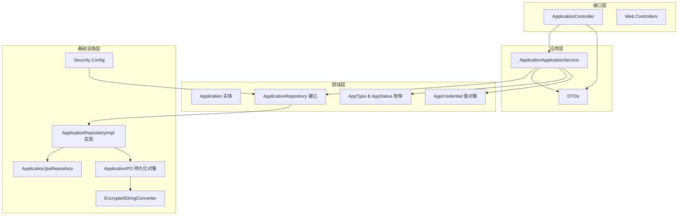
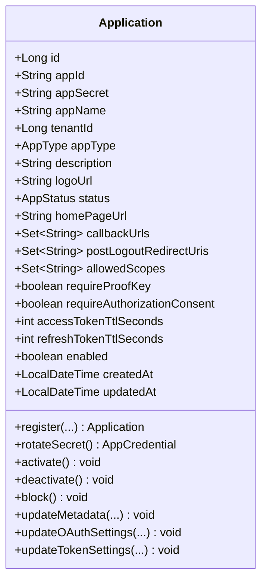
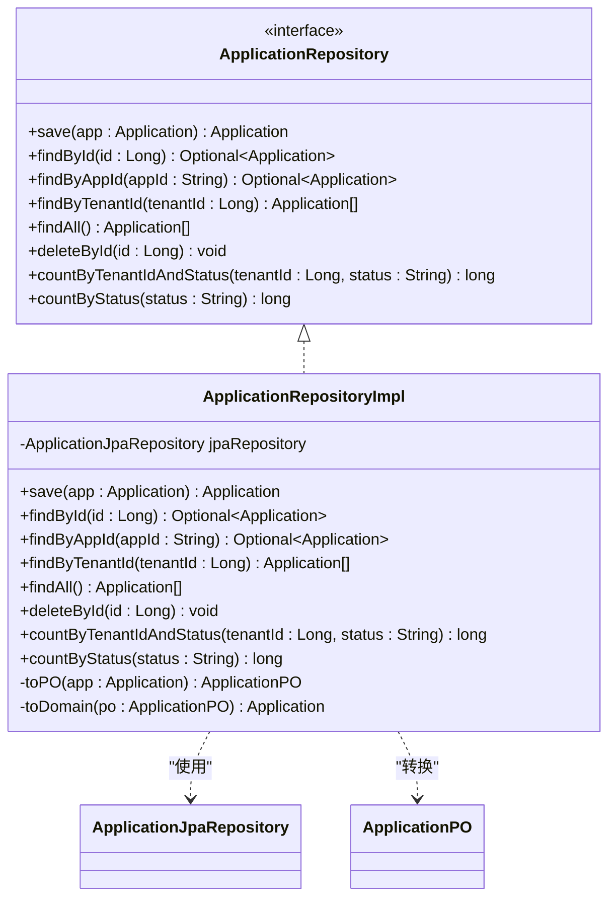
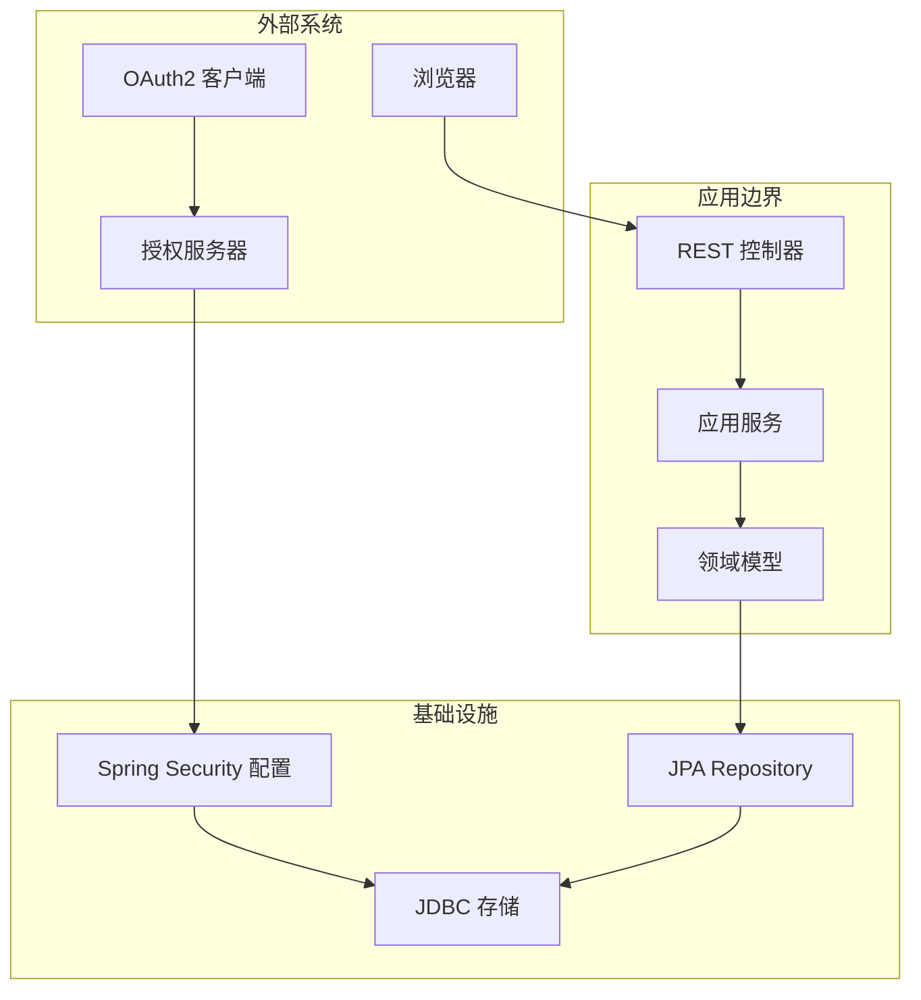
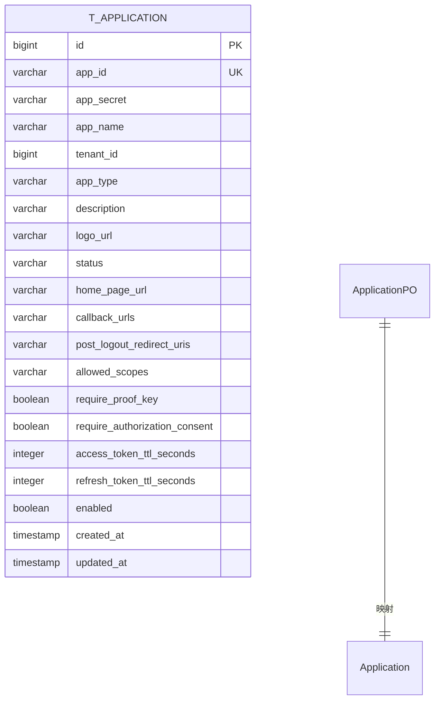
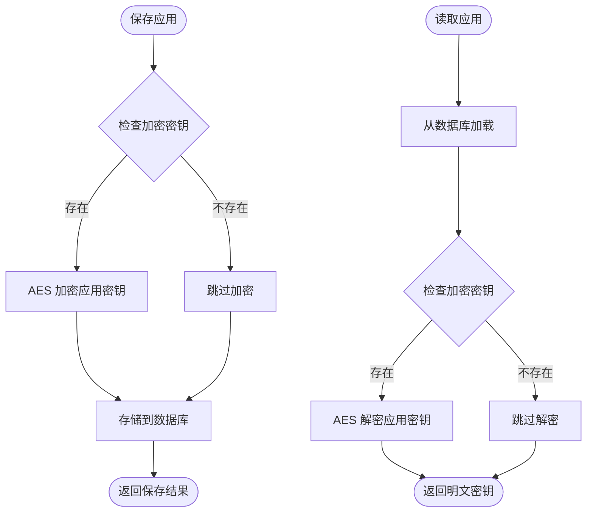
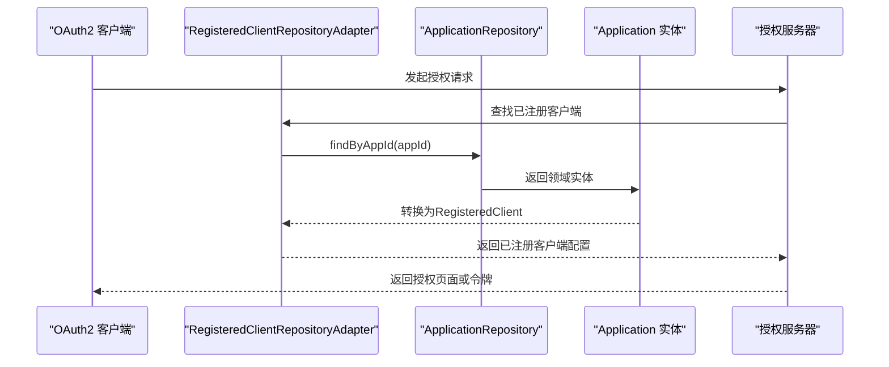
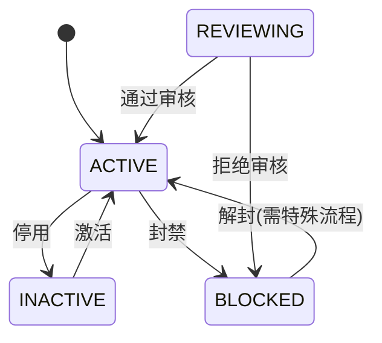
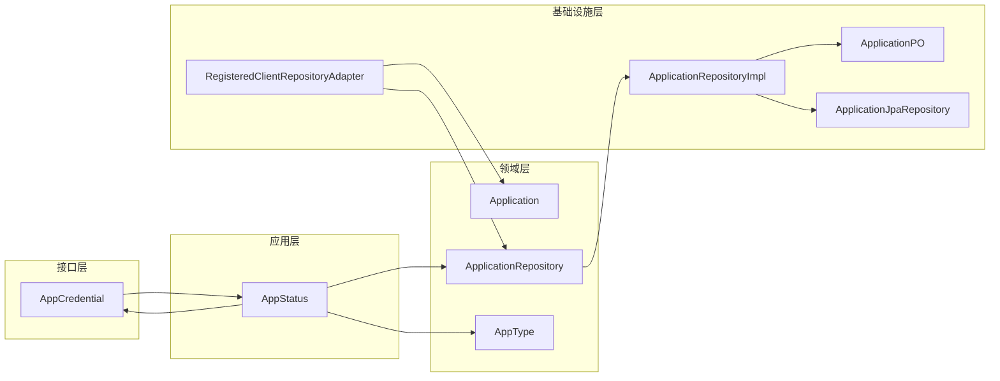

# OAuth2客户端管理

<cite>
**本文档引用的文件**
- [Application.java](file://src/main/java/sso/oidc/domain/model/entity/Application.java)
- [ApplicationApplicationService.java](file://src/main/java/sso/oidc/application/service/ApplicationApplicationService.java)
- [ApplicationController.java](file://src/main/java/sso/oidc/interfaces/rest/ApplicationController.java)
- [ApplicationRepository.java](file://src/main/java/sso/oidc/domain/repository/ApplicationRepository.java)
- [ApplicationRepositoryImpl.java](file://src/main/java/sso/oidc/infrastructure/persistence/impl/ApplicationRepositoryImpl.java)
- [ApplicationPO.java](file://src/main/java/sso/oidc/infrastructure/persistence/entity/ApplicationPO.java)
- [ApplicationJpaRepository.java](file://src/main/java/sso/oidc/infrastructure/persistence/repository/ApplicationJpaRepository.java)
- [EncryptedStringConverter.java](file://src/main/java/sso/oidc/infrastructure/persistence/converter/EncryptedStringConverter.java)
- [CreateApplicationRequest.java](file://src/main/java/sso/oidc/application/dto/request/CreateApplicationRequest.java)
- [UpdateApplicationRequest.java](file://src/main/java/sso/oidc/application/dto/request/UpdateApplicationRequest.java)
- [ApplicationResponse.java](file://src/main/java/sso/oidc/application/dto/response/ApplicationResponse.java)
- [ApplicationCreatedResponse.java](file://src/main/java/sso/oidc/application/dto/response/ApplicationCreatedResponse.java)
- [AppType.java](file://src/main/java/sso/oidc/domain/model/enums/AppType.java)
- [AppStatus.java](file://src/main/java/sso/oidc/domain/model/enums/AppStatus.java)
- [AppCredential.java](file://src/main/java/sso/oidc/domain/model/valueobject/AppCredential.java)
- [RegisteredClientRepositoryAdapter.java](file://src/main/java/sso/oidc/infrastructure/security/RegisteredClientRepositoryAdapter.java)
- [V4__migrate_oauth2_client_to_application.sql](file://src/main/resources/db/migration/V4__migrate_oauth2_client_to_application.sql)
- [V7__remove_deprecated_oauth2_client_table.sql](file://src/main/resources/db/migration/V7__remove_deprecated_oauth2_client_table.sql)
- [application.yml](file://src/main/resources/application.yml)
- [ApiResponse.java](file://src/main/java/sso/oidc/interfaces/rest/common/ApiResponse.java)
</cite>

## 更新摘要
**所做更改**
- 更新了所有OAuth2Client相关引用为Application实体
- 重新设计了应用管理API架构
- 更新了数据模型和持久化策略
- 修改了OAuth2授权流程集成方式
- 更新了所有代码示例和架构图

## 目录
1. [简介](#简介)
2. [项目结构](#项目结构)
3. [核心组件](#核心组件)
4. [架构总览](#架构总览)
5. [详细组件分析](#详细组件分析)
6. [依赖关系分析](#依赖关系分析)
7. [性能考虑](#性能考虑)
8. [故障排除指南](#故障排除指南)
9. [结论](#结论)
10. [附录](#附录)

## 简介
本项目是一个基于Spring Security OAuth2 Authorization Server的应用管理系统，提供OAuth2应用的注册、配置管理、密钥轮换、权限范围控制等核心能力。系统采用分层架构设计，包含领域层、应用层、基础设施层和接口层，确保业务逻辑与数据持久化、外部集成的解耦。

**更新** 系统已完成架构重构，OAuth2Client实体已被Application实体完全替代，客户端管理功能已重构为应用管理，支持多租户和更丰富的应用类型管理。

## 项目结构
项目采用按层次划分的组织方式，主要分为以下层次：
- 领域层：定义Application实体和业务规则
- 应用层：封装业务用例和工作流
- 基础设施层：实现数据持久化和外部服务集成
- 接口层：提供REST API和Web页面

**图表来源**
- [ApplicationController.java:1-139](file://src/main/java/sso/oidc/interfaces/rest/ApplicationController.java#L1-L139)
- [ApplicationApplicationService.java:1-242](file://src/main/java/sso/oidc/application/service/ApplicationApplicationService.java#L1-L242)
- [ApplicationRepository.java:1-25](file://src/main/java/sso/oidc/domain/repository/ApplicationRepository.java#L1-L25)
- [ApplicationRepositoryImpl.java:1-106](file://src/main/java/sso/oidc/infrastructure/persistence/impl/ApplicationRepositoryImpl.java#L1-L106)
- [ApplicationPO.java:1-118](file://src/main/java/sso/oidc/infrastructure/persistence/entity/ApplicationPO.java#L1-L118)

**章节来源**
- [ApplicationController.java:1-139](file://src/main/java/sso/oidc/interfaces/rest/ApplicationController.java#L1-L139)
- [ApplicationApplicationService.java:1-242](file://src/main/java/sso/oidc/application/service/ApplicationApplicationService.java#L1-L242)

## 核心组件
系统的核心组件围绕Application实体生命周期管理展开，包括实体建模、仓储接口、应用服务和控制器层。

### 应用实体设计
Application实体是系统的核心数据模型，包含应用标识、认证方法、授权类型、回调URL、作用域等关键属性，并支持多租户和多种应用类型。

**图表来源**
- [Application.java:17-210](file://src/main/java/sso/oidc/domain/model/entity/Application.java#L17-L210)

### 应用仓储接口
仓储接口定义了应用数据访问的标准契约，支持保存、查找、分页查询和删除操作。

**图表来源**
- [ApplicationRepository.java:8-24](file://src/main/java/sso/oidc/domain/repository/ApplicationRepository.java#L8-L24)
- [ApplicationRepositoryImpl.java:25-30](file://src/main/java/sso/oidc/infrastructure/persistence/impl/ApplicationRepositoryImpl.java#L25-L30)

### 应用管理API
系统提供完整的REST API用于应用生命周期管理。

| 方法 | 端点 | 描述 | 请求体 | 响应码 |
|------|------|------|--------|--------|
| POST | `/api/v1/applications` | 创建应用 | CreateApplicationRequest | 201 |
| GET | `/api/v1/applications/{id}` | 获取应用详情 | - | 200 |
| GET | `/api/v1/applications/by-app-id/{appId}` | 通过appId获取应用 | - | 200 |
| GET | `/api/v1/applications/tenant/{tenantId}` | 获取租户下所有应用 | - | 200 |
| GET | `/api/v1/applications` | 获取所有应用 | - | 200 |
| PUT | `/api/v1/applications/{id}` | 更新应用 | UpdateApplicationRequest | 200 |
| DELETE | `/api/v1/applications/{id}` | 删除应用 | - | 204 |
| POST | `/api/v1/applications/{id}/rotate-secret` | 轮换应用密钥 | - | 200 |
| POST | `/api/v1/applications/{id}/activate` | 激活应用 | - | 200 |
| POST | `/api/v1/applications/{id}/deactivate` | 停用应用 | - | 200 |
| POST | `/api/v1/applications/{id}/block` | 封禁应用 | - | 200 |

**章节来源**
- [ApplicationController.java:1-139](file://src/main/java/sso/oidc/interfaces/rest/ApplicationController.java#L1-L139)
- [CreateApplicationRequest.java:1-44](file://src/main/java/sso/oidc/application/dto/request/CreateApplicationRequest.java#L1-L44)
- [UpdateApplicationRequest.java:1-34](file://src/main/java/sso/oidc/application/dto/request/UpdateApplicationRequest.java#L1-L34)

## 架构总览
系统采用六边形架构（端口和适配器），通过适配器模式连接Spring Security OAuth2 Authorization Server。

**图表来源**
- [RegisteredClientRepositoryAdapter.java:1-95](file://src/main/java/sso/oidc/infrastructure/security/RegisteredClientRepositoryAdapter.java#L1-L95)

## 详细组件分析

### 数据模型设计
系统采用双模型设计：领域模型（Application）用于业务逻辑，持久化模型（ApplicationPO）用于数据库存储。

**图表来源**
- [ApplicationPO.java:19-118](file://src/main/java/sso/oidc/infrastructure/persistence/entity/ApplicationPO.java#L19-L118)
- [V4__migrate_oauth2_client_to_application.sql:10-50](file://src/main/resources/db/migration/V4__migrate_oauth2_client_to_application.sql#L10-L50)

### 密钥加密机制
系统使用AES对称加密保护应用密钥，通过JPA转换器实现透明加密。

**图表来源**
- [EncryptedStringConverter.java:11-33](file://src/main/java/sso/oidc/infrastructure/persistence/converter/EncryptedStringConverter.java#L11-L33)
- [ApplicationPO.java:34-37](file://src/main/java/sso/oidc/infrastructure/persistence/entity/ApplicationPO.java#L34-L37)

### OAuth2授权流程集成
系统通过适配器模式将内部应用模型与Spring Security OAuth2 Authorization Server集成。

**图表来源**
- [RegisteredClientRepositoryAdapter.java:41-95](file://src/main/java/sso/oidc/infrastructure/security/RegisteredClientRepositoryAdapter.java#L41-L95)

### 应用类型和状态管理
系统支持多种应用类型和状态管理，包括WEB、MOBILE、API、THIRD_PARTY等类型和ACTIVE、INACTIVE、REVIEWING、BLOCKED等状态。

**图表来源**
- [AppType.java:1-6](file://src/main/java/sso/oidc/domain/model/enums/AppType.java#L1-L6)
- [AppStatus.java:1-6](file://src/main/java/sso/oidc/domain/model/enums/AppStatus.java#L1-L6)

## 依赖关系分析

**图表来源**
- [ApplicationController.java:34-34](file://src/main/java/sso/oidc/interfaces/rest/ApplicationController.java#L34-L34)
- [ApplicationApplicationService.java:35-35](file://src/main/java/sso/oidc/application/service/ApplicationApplicationService.java#L35-L35)
- [RegisteredClientRepositoryAdapter.java:22-22](file://src/main/java/sso/oidc/infrastructure/security/RegisteredClientRepositoryAdapter.java#L22-L22)

**章节来源**
- [ApplicationRepositoryImpl.java:25-25](file://src/main/java/sso/oidc/infrastructure/persistence/impl/ApplicationRepositoryImpl.java#L25-L25)
- [RegisteredClientRepositoryAdapter.java:1-95](file://src/main/java/sso/oidc/infrastructure/security/RegisteredClientRepositoryAdapter.java#L1-L95)

## 性能考虑
系统在设计时考虑了以下性能优化：

1. **数据库索引优化**：为常用查询字段建立索引，包括app_id、tenant_id、status等
2. **连接池配置**：合理配置HikariCP连接池参数
3. **分页查询**：支持大数据量的分页查询
4. **缓存策略**：结合Redis进行会话和缓存管理
5. **加密性能**：使用高效的AES加密算法
6. **多租户优化**：针对租户ID的查询进行专门优化

## 故障排除指南

### 常见问题及解决方案

**应用未找到异常**
- 异常类型：RuntimeException（应用不存在）
- 可能原因：应用ID或appId错误或应用已被删除
- 解决方案：验证应用ID的有效性

**密钥轮换失败**
- 可能原因：ENCRYPTION_KEY环境变量未正确设置
- 解决方案：检查加密密钥配置

**数据库连接问题**
- 可能原因：数据库连接参数配置错误
- 解决方案：检查application.yml中的数据库配置

**应用类型不支持**
- 可能原因：AppType枚举值不在支持范围内
- 解决方案：使用WEB、MOBILE、API、THIRD_PARTY之一

**应用状态转换错误**
- 可能原因：状态转换违反业务规则
- 解决方案：按照正确的状态转换流程操作

**章节来源**
- [application.yml:9-18](file://src/main/resources/application.yml#L9-L18)

## 结论
本应用管理系统通过清晰的分层架构和完善的业务逻辑实现了应用全生命周期管理。系统具备良好的扩展性和安全性，能够满足企业级OAuth2授权服务的需求。通过标准化的API接口和完善的异常处理机制，为上层应用提供了稳定可靠的应用管理能力。

**更新** 架构重构后的系统不仅支持原有的OAuth2客户端功能，还新增了多租户支持、应用类型管理、状态生命周期控制等高级特性，为企业级应用管理提供了更强大的基础能力。

## 附录

### 配置参数说明

| 参数名 | 默认值 | 说明 |
|--------|--------|------|
| DB_HOST | localhost | 数据库主机地址 |
| DB_PORT | 5432 | 数据库端口号 |
| DB_NAME | sso_oidc | 数据库名称 |
| REDIS_HOST | localhost | Redis主机地址 |
| REDIS_PORT | 6379 | Redis端口号 |
| ENCRYPTION_KEY | change-me-in-production-32char | AES加密密钥（必须32字符） |
| OIDC_ISSUER_URI | http://localhost:9000 | OIDC发行者URI |

### 安全配置建议
1. 生产环境必须设置强加密密钥
2. 启用HTTPS和安全传输
3. 定期轮换应用密钥
4. 限制应用权限范围
5. 启用访问日志审计
6. 实施多租户隔离策略

### 应用类型说明

| 类型 | 描述 | 典型用途 |
|------|------|----------|
| WEB | Web应用 | 传统Web网站、单页应用 |
| MOBILE | 移动应用 | iOS、Android原生应用 |
| API | API应用 | 后端服务间通信 |
| THIRD_PARTY | 第三方应用 | 外部合作伙伴应用 |

### 状态管理说明

| 状态 | 描述 | 可执行操作 |
|------|------|------------|
| ACTIVE | 活跃状态 | 授权、使用、停用 |
| INACTIVE | 停用状态 | 激活、封禁 |
| REVIEWING | 审核中 | 通过审核、拒绝审核 |
| BLOCKED | 已封禁 | 解封(需特殊流程) |

**章节来源**
- [application.yml:53-55](file://src/main/resources/application.yml#L53-L55)
- [EncryptedStringConverter.java:9-9](file://src/main/java/sso/oidc/infrastructure/persistence/converter/EncryptedStringConverter.java#L9-L9)
- [AppType.java:1-6](file://src/main/java/sso/oidc/domain/model/enums/AppType.java#L1-L6)
- [AppStatus.java:1-6](file://src/main/java/sso/oidc/domain/model/enums/AppStatus.java#L1-L6)