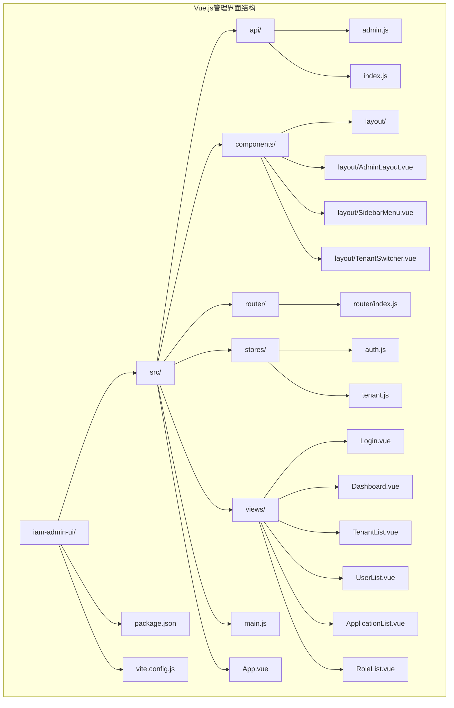
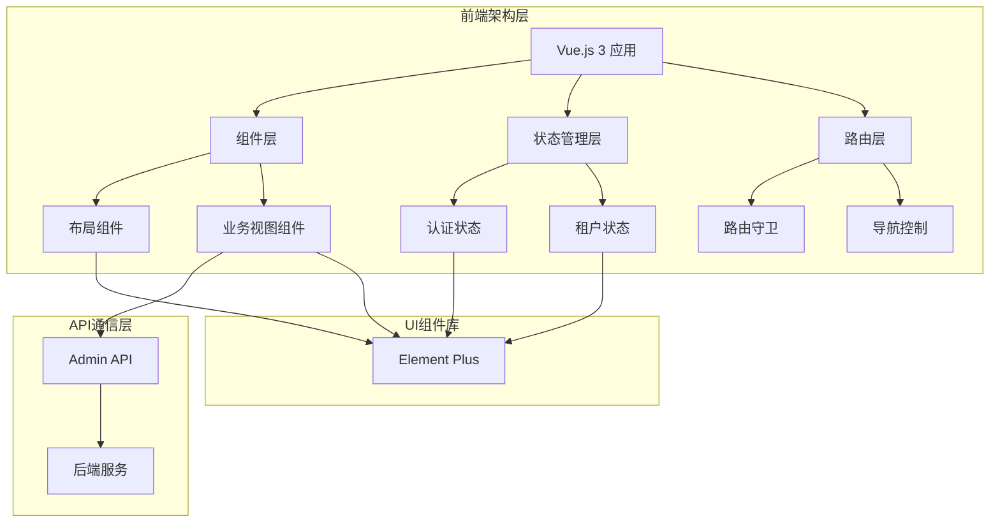
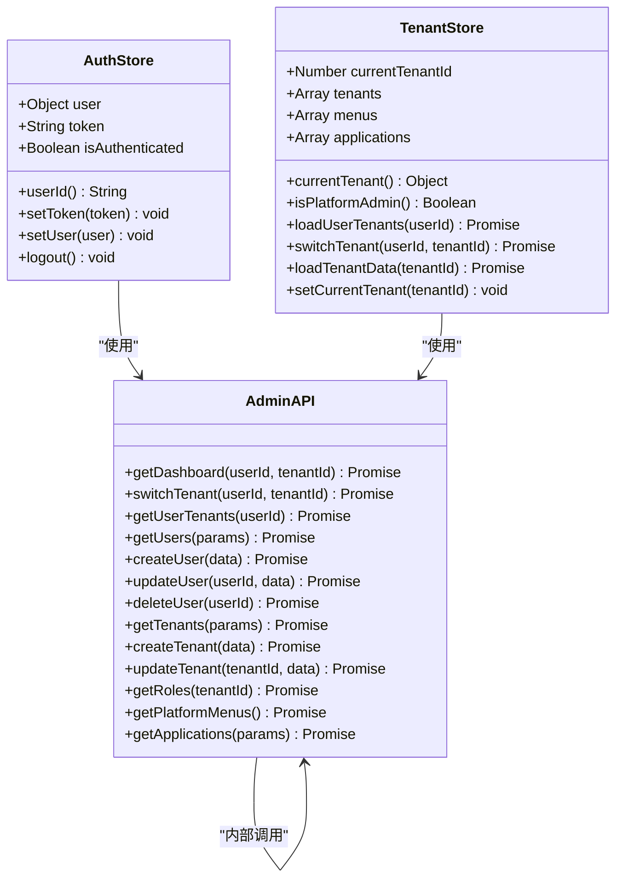
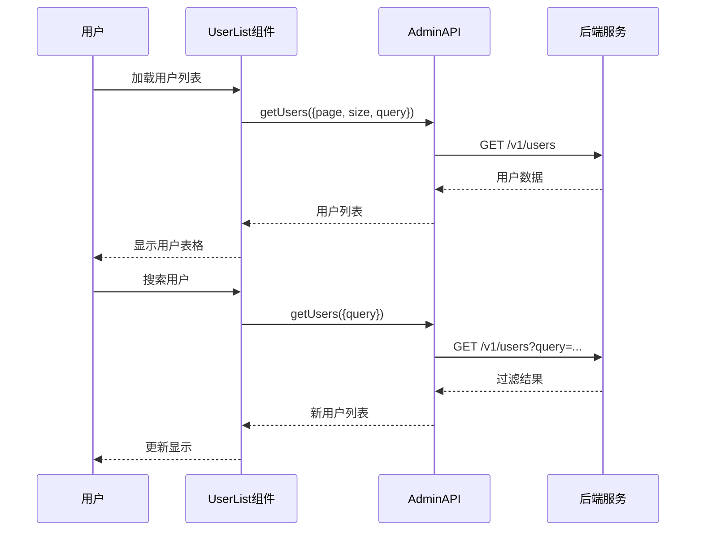
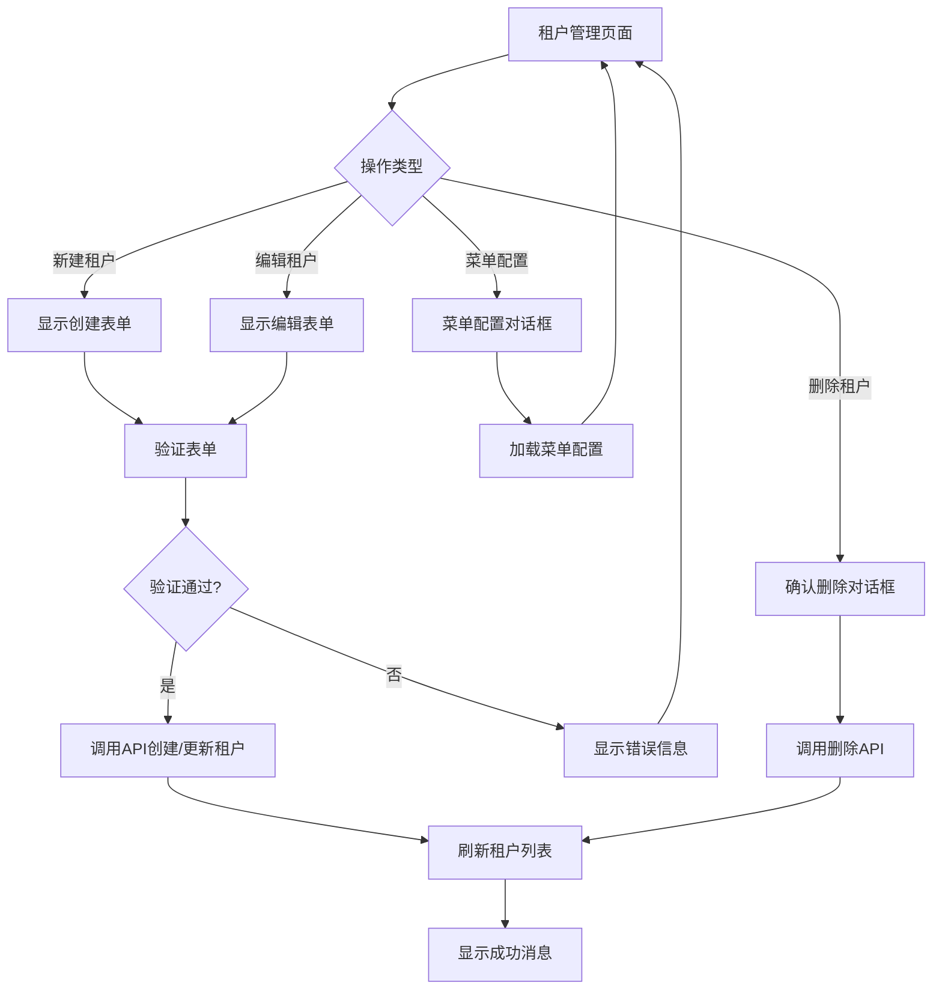
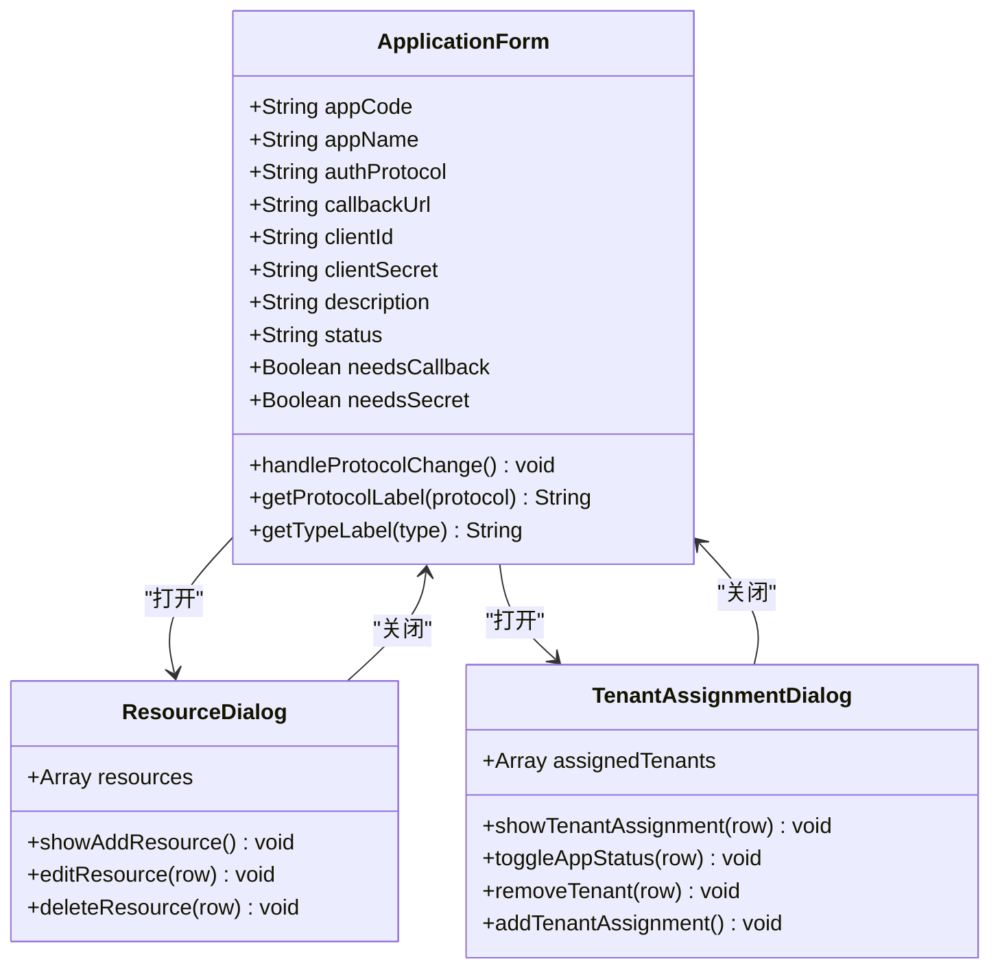

# Vue.js管理界面

<cite>
**本文档引用的文件**
- [package.json](file://iam-admin-ui/package.json)
- [vite.config.js](file://iam-admin-ui/vite.config.js)
- [main.js](file://iam-admin-ui/src/main.js)
- [App.vue](file://iam-admin-ui/src/App.vue)
- [router/index.js](file://iam-admin-ui/src/router/index.js)
- [components/layout/AdminLayout.vue](file://iam-admin-ui/src/components/layout/AdminLayout.vue)
- [stores/auth.js](file://iam-admin-ui/src/stores/auth.js)
- [stores/tenant.js](file://iam-admin-ui/src/stores/tenant.js)
- [api/admin.js](file://iam-admin-ui/src/api/admin.js)
- [views/Login.vue](file://iam-admin-ui/src/views/Login.vue)
- [views/Dashboard.vue](file://iam-admin-ui/src/views/Dashboard.vue)
- [views/TenantList.vue](file://iam-admin-ui/src/views/TenantList.vue)
- [views/UserList.vue](file://iam-admin-ui/src/views/UserList.vue)
- [views/ApplicationList.vue](file://iam-admin-ui/src/views/ApplicationList.vue)
- [views/RoleList.vue](file://iam-admin-ui/src/views/RoleList.vue)
</cite>

## 目录
1. [简介](#简介)
2. [项目结构](#项目结构)
3. [核心组件](#核心组件)
4. [架构概览](#架构概览)
5. [详细组件分析](#详细组件分析)
6. [依赖关系分析](#依赖关系分析)
7. [性能考虑](#性能考虑)
8. [故障排除指南](#故障排除指南)
9. [结论](#结论)

## 简介

这是一个基于Vue.js 3构建的企业级身份认证管理平台前端界面。该管理界面提供了完整的IAM（身份和访问管理）功能，包括用户管理、租户管理、应用管理和角色权限管理等核心功能模块。

项目采用现代化的前端技术栈，使用Vue 3 Composition API、Element Plus UI组件库、Pinia状态管理和Vite构建工具，为企业级应用提供了高效、可维护的前端解决方案。

## 项目结构



**图表来源**
- [package.json:1-28](file://iam-admin-ui/package.json#L1-L28)
- [main.js:1-21](file://iam-admin-ui/src/main.js#L1-L21)
- [router/index.js:1-72](file://iam-admin-ui/src/router/index.js#L1-L72)

**章节来源**
- [package.json:1-28](file://iam-admin-ui/package.json#L1-L28)
- [vite.config.js:1-26](file://iam-admin-ui/vite.config.js#L1-L26)
- [main.js:1-21](file://iam-admin-ui/src/main.js#L1-L21)

## 核心组件

### 应用程序入口

应用程序通过main.js进行初始化，配置了Vue实例、路由、状态管理和UI组件库。

### 路由系统

使用Vue Router 4实现前端路由管理，支持嵌套路由和导航守卫。

### 状态管理

采用Pinia作为状态管理库，提供用户认证状态和租户切换功能。

**章节来源**
- [main.js:1-21](file://iam-admin-ui/src/main.js#L1-L21)
- [router/index.js:1-72](file://iam-admin-ui/src/router/index.js#L1-L72)
- [stores/auth.js:1-33](file://iam-admin-ui/src/stores/auth.js#L1-L33)
- [stores/tenant.js:1-66](file://iam-admin-ui/src/stores/tenant.js#L1-L66)

## 架构概览



**图表来源**
- [App.vue:1-25](file://iam-admin-ui/src/App.vue#L1-L25)
- [components/layout/AdminLayout.vue:1-118](file://iam-admin-ui/src/components/layout/AdminLayout.vue#L1-L118)
- [api/admin.js:1-145](file://iam-admin-ui/src/api/admin.js#L1-L145)

## 详细组件分析

### 认证系统



**图表来源**
- [stores/auth.js:1-33](file://iam-admin-ui/src/stores/auth.js#L1-L33)
- [stores/tenant.js:1-66](file://iam-admin-ui/src/stores/tenant.js#L1-L66)
- [api/admin.js:1-145](file://iam-admin-ui/src/api/admin.js#L1-L145)

### 用户管理界面

用户管理组件提供了完整的用户生命周期管理功能：



**图表来源**
- [views/UserList.vue:155-170](file://iam-admin-ui/src/views/UserList.vue#L155-L170)
- [api/admin.js:22-36](file://iam-admin-ui/src/api/admin.js#L22-L36)

### 租户管理界面

租户管理提供了多租户架构的核心功能：



**图表来源**
- [views/TenantList.vue:105-145](file://iam-admin-ui/src/views/TenantList.vue#L105-L145)
- [views/TenantList.vue:147-158](file://iam-admin-ui/src/views/TenantList.vue#L147-L158)

### 应用管理界面

应用管理支持多种认证协议的配置和管理：



**图表来源**
- [views/ApplicationList.vue:147-157](file://iam-admin-ui/src/views/ApplicationList.vue#L147-L157)
- [views/ApplicationList.vue:266-300](file://iam-admin-ui/src/views/ApplicationList.vue#L266-L300)

**章节来源**
- [views/Login.vue:1-139](file://iam-admin-ui/src/views/Login.vue#L1-L139)
- [views/Dashboard.vue:1-182](file://iam-admin-ui/src/views/Dashboard.vue#L1-L182)
- [views/TenantList.vue:1-181](file://iam-admin-ui/src/views/TenantList.vue#L1-L181)
- [views/UserList.vue:1-304](file://iam-admin-ui/src/views/UserList.vue#L1-L304)
- [views/ApplicationList.vue:1-347](file://iam-admin-ui/src/views/ApplicationList.vue#L1-L347)
- [views/RoleList.vue:1-228](file://iam-admin-ui/src/views/RoleList.vue#L1-L228)

## 依赖关系分析

```mermaid
graph LR
subgraph "核心依赖"
A[Vue 3.4.0] --> B[Composition API]
C[Vue Router 4.2.5] --> D[路由管理]
E[Pinia 2.1.7] --> F[状态管理]
G[Element Plus 2.5.0] --> H[UI组件]
end
subgraph "开发依赖"
I[Vite 5.0.0] --> J[构建工具]
K[Sass 1.69.0] --> L[样式预处理]
M[ESLint 8.56.0] --> N[代码检查]
end
subgraph "运行时依赖"
O[Axios 1.6.5] --> P[HTTP客户端]
Q[@element-plus/icons-vue 2.3.1] --> R[图标组件]
end
```

**图表来源**
- [package.json:12-26](file://iam-admin-ui/package.json#L12-L26)

**章节来源**
- [package.json:1-28](file://iam-admin-ui/package.json#L1-L28)

## 性能考虑

### 构建优化
- 使用Vite进行快速开发和生产构建
- 按需加载路由组件，减少初始包大小
- Element Plus按需引入，避免全量导入

### 运行时优化
- Pinia状态管理提供响应式数据绑定
- Element Plus组件懒加载，提升首屏渲染速度
- API请求缓存策略，减少重复网络请求

### 开发体验
- ESLint代码规范检查
- Sass样式预处理，提高样式开发效率
- 开发服务器代理配置，简化API调试

## 故障排除指南

### 常见问题

**登录问题**
- 检查浏览器控制台是否有网络请求错误
- 验证后端服务是否正常运行
- 确认本地存储中的token状态

**路由跳转问题**
- 检查路由守卫逻辑
- 验证token存在性
- 确认路由元信息配置

**API调用问题**
- 检查代理配置是否正确
- 验证后端接口响应格式
- 查看网络面板的请求状态

**章节来源**
- [router/index.js:62-69](file://iam-admin-ui/src/router/index.js#L62-L69)
- [stores/auth.js:14-30](file://iam-admin-ui/src/stores/auth.js#L14-L30)

## 结论

Vue.js管理界面是一个功能完整、架构清晰的企业级身份认证管理平台前端解决方案。项目采用了现代化的前端技术栈，具有以下特点：

**技术优势**
- 基于Vue 3 Composition API，提供更好的代码组织和复用
- 使用Element Plus UI组件库，确保界面一致性和用户体验
- Pinia状态管理提供简单直观的状态管理方案
- Vite构建工具带来快速的开发体验

**功能完整性**
- 支持完整的用户、租户、应用和角色管理
- 提供多租户架构支持
- 包含丰富的认证协议配置
- 具备完善的权限管理体系

**扩展性**
- 模块化设计便于功能扩展
- 清晰的组件层次结构
- 完善的API接口定义

该管理界面为后续的功能扩展和维护提供了良好的基础，能够满足企业级身份认证管理的各种需求。