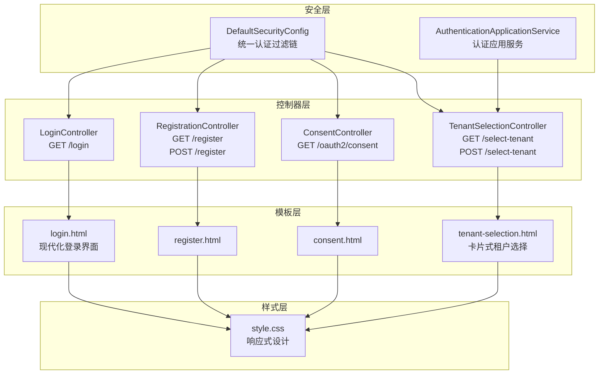
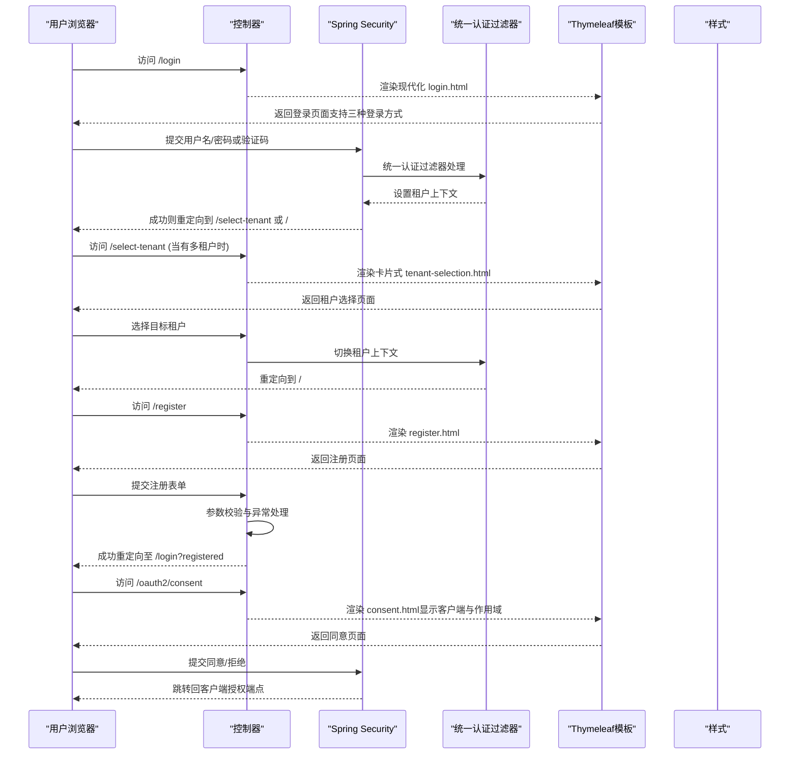
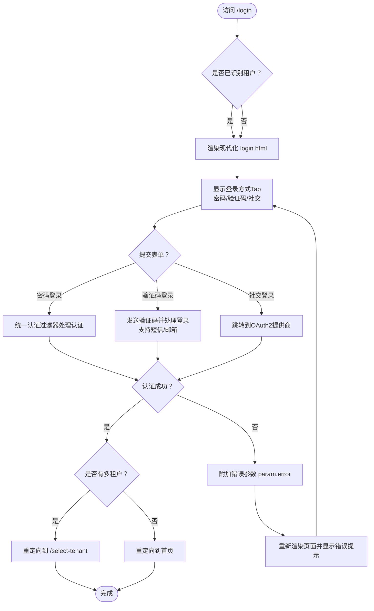
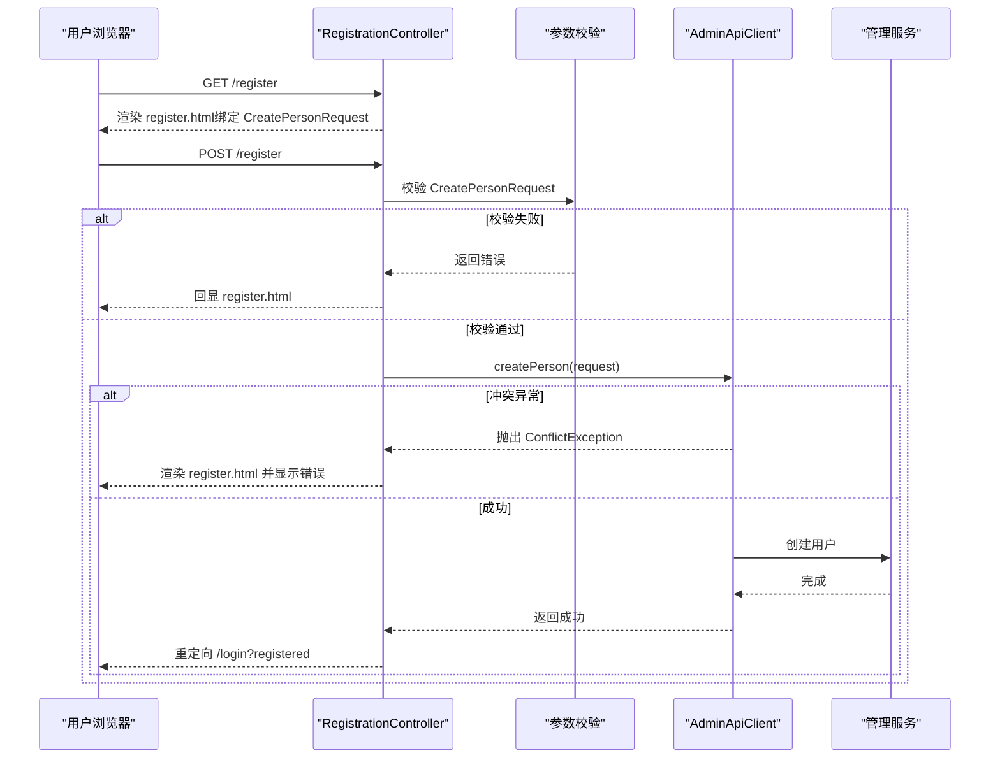
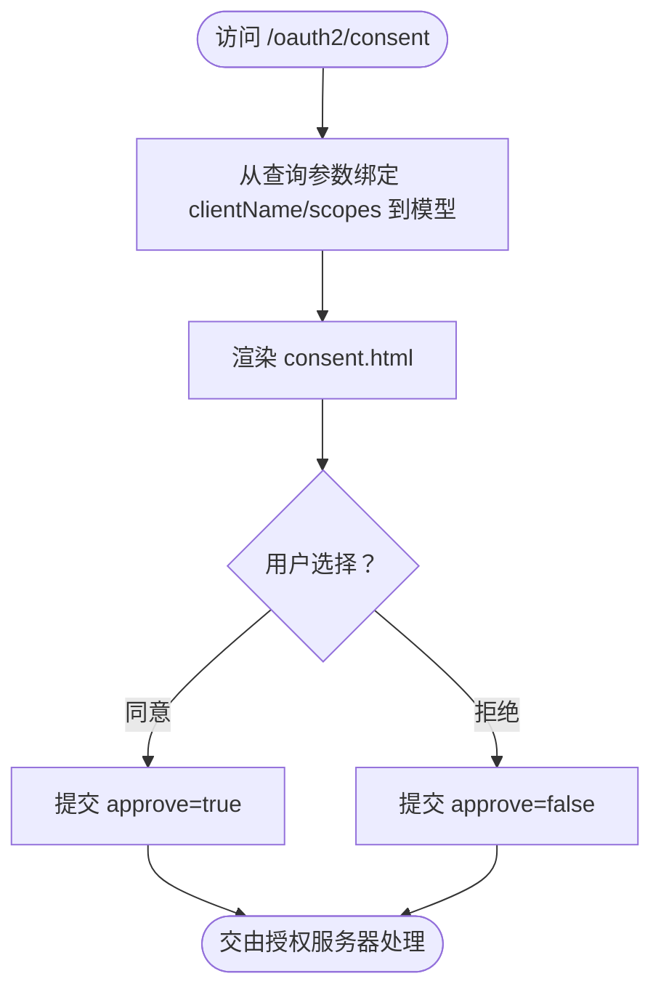
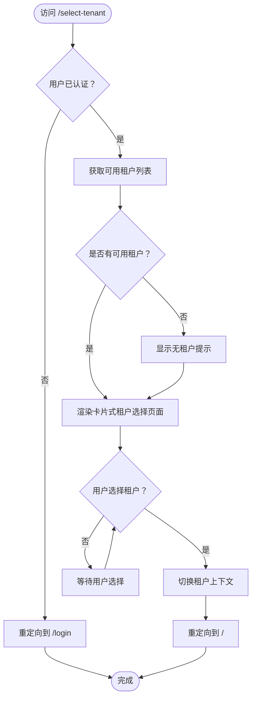
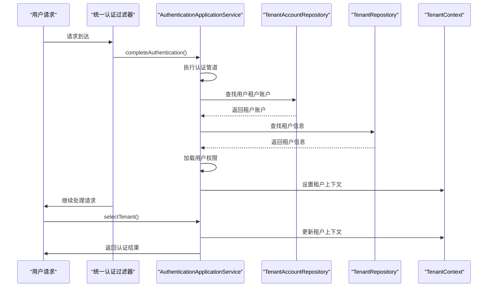
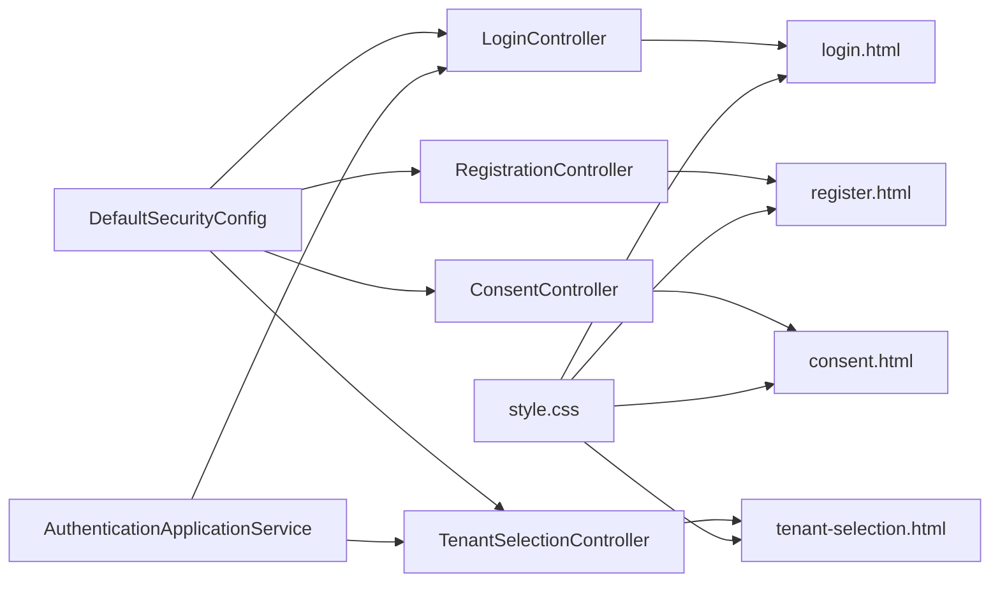

# Web界面系统

<cite>
**本文引用的文件**
- [LoginController.java](file://sso-auth-server/src/main/java/sso/oidc/auth/interfaces/web/LoginController.java)
- [RegistrationController.java](file://sso-auth-server/src/main/java/sso/oidc/auth/interfaces/web/RegistrationController.java)
- [ConsentController.java](file://sso-auth-server/src/main/java/sso/oidc/auth/interfaces/web/ConsentController.java)
- [TenantSelectionController.java](file://sso-auth-server/src/main/java/sso/oidc/auth/interfaces/web/TenantSelectionController.java)
- [login.html](file://sso-auth-server/src/main/resources/templates/login.html)
- [register.html](file://sso-auth-server/src/main/resources/templates/register.html)
- [consent.html](file://sso-auth-server/src/main/resources/templates/consent.html)
- [tenant-selection.html](file://sso-auth-server/src/main/resources/templates/tenant-selection.html)
- [style.css](file://sso-auth-server/src/main/resources/static/css/style.css)
- [DefaultSecurityConfig.java](file://sso-auth-server/src/main/java/sso/oidc/auth/infrastructure/config/DefaultSecurityConfig.java)
- [AuthenticationApplicationService.java](file://sso-auth-server/src/main/java/sso/oidc/auth/application/service/AuthenticationApplicationService.java)
- [application.yml](file://sso-auth-server/src/main/resources/application.yml)
</cite>

## 更新摘要
**变更内容**
- 登录页面模板重构：新的login.html模板位于sso-auth-server模块中，提供现代化的用户界面设计
- 登录页面功能增强：支持密码登录、验证码登录（短信/邮箱）和社交登录三种方式
- 前端交互优化：引入Tab切换机制，支持动态验证码发送和倒计时功能
- 模板结构更新：采用更现代化的卡片式布局和响应式设计
- 控制器逻辑保持稳定：LoginController继续提供多租户支持和参数处理

## 目录
1. [简介](#简介)
2. [项目结构](#项目结构)
3. [核心组件](#核心组件)
4. [架构总览](#架构总览)
5. [详细组件分析](#详细组件分析)
6. [多租户架构](#多租户架构)
7. [依赖分析](#依赖分析)
8. [性能考虑](#性能考虑)
9. [故障排查指南](#故障排查指南)
10. [结论](#结论)
11. [附录](#附录)

## 简介
本文件面向Web界面系统，聚焦登录、注册、授权同意和租户选择四大页面的设计与实现，系统性阐述Web控制器的业务逻辑、Thymeleaf模板结构、用户交互流程、前端实现要点（含表单验证、错误提示、用户体验），以及与后端API的集成与数据交互模式。同时覆盖安全机制（认证、会话、CSRF、XSS）与响应式样式设计。本次更新重点反映了架构重构后的多租户支持能力和现代化的登录界面设计。

## 项目结构
Web界面由四层组成：
- 控制器层：负责路由与页面渲染，分别处理登录、注册、授权同意和租户选择页面。
- 模板层：基于Thymeleaf的HTML模板，定义页面结构与动态内容。
- 安全层：多租户认证过滤器和上下文管理，确保每个请求都有正确的租户上下文。
- 样式层：统一的CSS样式与响应式布局，确保跨设备一致体验。

**图表来源**
- [LoginController.java:19-47](file://sso-auth-server/src/main/java/sso/oidc/auth/interfaces/web/LoginController.java#L19-L47)
- [RegistrationController.java:21-44](file://sso-auth-server/src/main/java/sso/oidc/auth/interfaces/web/RegistrationController.java#L21-L44)
- [ConsentController.java:10-16](file://sso-auth-server/src/main/java/sso/oidc/auth/interfaces/web/ConsentController.java#L10-L16)
- [TenantSelectionController.java:28-56](file://sso-auth-server/src/main/java/sso/oidc/auth/interfaces/web/TenantSelectionController.java#L28-L56)
- [login.html:1-343](file://sso-auth-server/src/main/resources/templates/login.html#L1-L343)
- [register.html:1-64](file://sso-auth-server/src/main/resources/templates/register.html#L1-L64)
- [consent.html:1-34](file://sso-auth-server/src/main/resources/templates/consent.html#L1-L34)
- [tenant-selection.html:1-237](file://sso-auth-server/src/main/resources/templates/tenant-selection.html#L1-L237)
- [style.css:1-171](file://sso-auth-server/src/main/resources/static/css/style.css#L1-L171)
- [DefaultSecurityConfig.java:36-64](file://sso-auth-server/src/main/java/sso/oidc/auth/infrastructure/config/DefaultSecurityConfig.java#L36-L64)
- [AuthenticationApplicationService.java:38-111](file://sso-auth-server/src/main/java/sso/oidc/auth/application/service/AuthenticationApplicationService.java#L38-L111)

## 核心组件
- 登录控制器：提供登录页渲染，支持多租户识别，交由Spring Security处理认证。
- 注册控制器：提供注册表单渲染与提交处理，包含参数校验与异常处理。
- 授权同意控制器：接收客户端名称与作用域列表，渲染同意页面供用户确认或拒绝。
- 租户选择控制器：当用户属于多个租户时，在登录后引导用户选择目标租户。

**章节来源**
- [LoginController.java:16-47](file://sso-auth-server/src/main/java/sso/oidc/auth/interfaces/web/LoginController.java#L16-L47)
- [RegistrationController.java:15-44](file://sso-auth-server/src/main/java/sso/oidc/auth/interfaces/web/RegistrationController.java#L15-L44)
- [ConsentController.java:7-16](file://sso-auth-server/src/main/java/sso/oidc/auth/interfaces/web/ConsentController.java#L7-L16)
- [TenantSelectionController.java:18-56](file://sso-auth-server/src/main/java/sso/oidc/auth/interfaces/web/TenantSelectionController.java#L18-L56)

## 架构总览
Web界面与多租户安全配置协同工作，控制链路如下：

**图表来源**
- [DefaultSecurityConfig.java:38-64](file://sso-auth-server/src/main/java/sso/oidc/auth/infrastructure/config/DefaultSecurityConfig.java#L38-L64)
- [login.html:156-261](file://sso-auth-server/src/main/resources/templates/login.html#L156-L261)
- [tenant-selection.html:181-237](file://sso-auth-server/src/main/resources/templates/tenant-selection.html#L181-L237)
- [consent.html:14-29](file://sso-auth-server/src/main/resources/templates/consent.html#L14-L29)

## 详细组件分析

### 登录页面与控制器
**更新** 登录页面模板已重构为现代化设计，提供更好的用户体验

- 页面结构与交互
  - 支持三种登录方式：密码登录、验证码登录（短信/邮箱）和社交登录（DingTalk）。
  - 使用Tab切换机制实现三种登录方式的动态切换，提升用户体验。
  - 通过Thymeleaf条件渲染不同状态消息，支持错误、注册成功、登出等参数提示。
  - 引入现代化的卡片式布局和响应式设计。
- 控制器职责
  - 提供登录页访问接口，支持租户识别参数（tenant、subdomain、header）。
  - 将租户信息添加到模型中，供视图层使用。
  - 处理错误和登出参数，提供友好的用户反馈。
- 安全集成
  - Spring Security配置指定登录页路径与默认成功跳转路径，并对静态资源放行。

**图表来源**
- [login.html:156-261](file://sso-auth-server/src/main/resources/templates/login.html#L156-L261)
- [login.html:271-340](file://sso-auth-server/src/main/resources/templates/login.html#L271-L340)
- [LoginController.java:19-47](file://sso-auth-server/src/main/java/sso/oidc/auth/interfaces/web/LoginController.java#L19-L47)
- [DefaultSecurityConfig.java:40-61](file://sso-auth-server/src/main/java/sso/oidc/auth/infrastructure/config/DefaultSecurityConfig.java#L40-L61)

**章节来源**
- [LoginController.java:16-58](file://sso-auth-server/src/main/java/sso/oidc/auth/interfaces/web/LoginController.java#L16-L58)
- [login.html:1-343](file://sso-auth-server/src/main/resources/templates/login.html#L1-L343)
- [DefaultSecurityConfig.java:25-64](file://sso-auth-server/src/main/java/sso/oidc/auth/infrastructure/config/DefaultSecurityConfig.java#L25-L64)

### 注册页面与控制器
- 表单字段与校验
  - 字段包括用户名、邮箱、昵称（可选）、密码与确认密码。
  - 前端JavaScript校验两次密码一致性；后端使用DTO与JSR-303注解进行参数校验。
- 控制器流程
  - GET：向模型注入空请求对象，渲染注册页。
  - POST：若校验失败回显注册页；若业务异常（如已存在）在页面显示错误信息；成功则重定向到登录页并带注册成功参数。
- 业务服务
  - 通过AdminApiClient调用管理服务创建用户，实现前后端分离的用户管理。

**图表来源**
- [register.html:16-44](file://sso-auth-server/src/main/resources/templates/register.html#L16-L44)
- [register.html:52-61](file://sso-auth-server/src/main/resources/templates/register.html#L52-L61)
- [RegistrationController.java:21-44](file://sso-auth-server/src/main/java/sso/oidc/auth/interfaces/web/RegistrationController.java#L21-L44)
- [AuthenticationApplicationService.java:117-127](file://sso-auth-server/src/main/java/sso/oidc/auth/application/service/AuthenticationApplicationService.java#L117-L127)

**章节来源**
- [RegistrationController.java:15-46](file://sso-auth-server/src/main/java/sso/oidc/auth/interfaces/web/RegistrationController.java#L15-L46)
- [register.html:1-64](file://sso-auth-server/src/main/resources/templates/register.html#L1-L64)
- [AuthenticationApplicationService.java:113-139](file://sso-auth-server/src/main/java/sso/oidc/auth/application/service/AuthenticationApplicationService.java#L113-L139)

### 授权同意页面与控制器
- 页面展示
  - 显示客户端名称与请求的作用域列表，便于用户审阅权限范围。
  - 采用简洁的卡片式设计，突出权限请求信息。
- 控制器职责
  - 从查询参数接收客户端名称与作用域字符串，放入模型并渲染同意页。
- 表单交互
  - 提交时携带同意/拒绝标记，交由Spring Authorization Server处理后续授权流程。

**图表来源**
- [ConsentController.java:10-16](file://sso-auth-server/src/main/java/sso/oidc/auth/interfaces/web/ConsentController.java#L10-L16)
- [consent.html:14-29](file://sso-auth-server/src/main/resources/templates/consent.html#L14-L29)

**章节来源**
- [ConsentController.java:7-18](file://sso-auth-server/src/main/java/sso/oidc/auth/interfaces/web/ConsentController.java#L7-L18)
- [consent.html:1-34](file://sso-auth-server/src/main/resources/templates/consent.html#L1-L34)

### 租户选择页面与控制器
**更新** 租户选择页面采用现代化卡片式设计，提供更好的用户体验

- 页面展示
  - 当用户属于多个租户时，登录后自动跳转到租户选择页面。
  - 采用现代化的卡片式布局，支持租户图标、状态指示和交互效果。
  - 显示可用的租户列表，包括租户名称、代码、员工号和状态。
- 控制器职责
  - 获取当前用户的所有可用租户账户，渲染租户选择页面。
  - 处理租户切换请求，更新用户在该租户的上下文。
- 业务流程
  - 如果用户没有可用租户，显示提示信息并引导联系管理员。
  - 支持租户切换失败的错误处理和重定向。

**图表来源**
- [TenantSelectionController.java:28-56](file://sso-auth-server/src/main/java/sso/oidc/auth/interfaces/web/TenantSelectionController.java#L28-L56)
- [tenant-selection.html:181-237](file://sso-auth-server/src/main/resources/templates/tenant-selection.html#L181-L237)

**章节来源**
- [TenantSelectionController.java:18-58](file://sso-auth-server/src/main/java/sso/oidc/auth/interfaces/web/TenantSelectionController.java#L18-L58)
- [tenant-selection.html:1-237](file://sso-auth-server/src/main/resources/templates/tenant-selection.html#L1-L237)

### 模板与样式设计
**更新** 所有模板已迁移到sso-auth-server模块，采用现代化设计风格

- Thymeleaf使用
  - 模板通过前缀与后缀配置指向classpath:/templates/目录，开发环境关闭缓存以便迭代。
  - 所有模板均使用现代化的卡片式布局设计。
- 响应式布局
  - 统一的CSS变量系统，支持主题色和响应式设计。
  - 登录页面采用Tab切换机制，支持三种登录方式的动态切换。
  - 租户选择页面采用现代化卡片式设计，支持hover效果和状态指示。
- 错误与成功提示
  - 使用条件渲染显示错误与成功消息，增强反馈及时性。
- 前端交互增强
  - 登录页面支持动态验证码发送，包含倒计时功能。
  - 租户选择页面支持卡片式交互，提升用户体验。

**章节来源**
- [application.yml:41-44](file://sso-auth-server/src/main/resources/application.yml#L41-L44)
- [style.css:1-171](file://sso-auth-server/src/main/resources/static/css/style.css#L1-L171)
- [login.html:14-24](file://sso-auth-server/src/main/resources/templates/login.html#L14-L24)
- [register.html:14](file://sso-auth-server/src/main/resources/templates/register.html#L14)
- [tenant-selection.html:8-178](file://sso-auth-server/src/main/resources/templates/tenant-selection.html#L8-L178)

## 多租户架构

### 租户上下文管理
系统通过统一的认证流程和应用服务实现完整的多租户上下文管理：

**图表来源**
- [DefaultSecurityConfig.java:66-80](file://sso-auth-server/src/main/java/sso/oidc/auth/infrastructure/config/DefaultSecurityConfig.java#L66-L80)
- [AuthenticationApplicationService.java:42-111](file://sso-auth-server/src/main/java/sso/oidc/auth/application/service/AuthenticationApplicationService.java#L42-L111)

### 租户识别策略
系统支持四种租户识别策略，按优先级顺序：

1. **请求头识别**：`X-Tenant-Code`头部参数
2. **查询参数识别**：`?tenant=company-a`查询参数
3. **子域名识别**：`company-a.sso.example.com`子域名提取
4. **会话恢复**：从之前的登录会话中恢复

### 权限管理
每个租户账户都有一套独立的权限集合，通过AuthenticationApplicationService加载：

- 用户在不同租户可能拥有不同的角色和权限
- 权限验证在每个请求的过滤阶段进行
- 支持细粒度的资源权限控制

**章节来源**
- [DefaultSecurityConfig.java:25-64](file://sso-auth-server/src/main/java/sso/oidc/auth/infrastructure/config/DefaultSecurityConfig.java#L25-L64)
- [AuthenticationApplicationService.java:24-139](file://sso-auth-server/src/main/java/sso/oidc/auth/application/service/AuthenticationApplicationService.java#L24-L139)

## 依赖分析
- 控制器与模板
  - 控制器方法返回模板名，由Thymeleaf解析并渲染对应HTML。
  - 所有模板均位于sso-auth-server模块的templates目录中。
  - 租户选择控制器依赖AuthenticationApplicationService获取可用租户列表。
- 安全过滤链
  - 对登录、注册与同意页放行，其余路径需认证；登录页与退出页配置明确。
  - 统一认证过滤器在UsernamePasswordAuthenticationFilter之前执行。
- 应用服务集成
  - AuthenticationApplicationService提供认证完成和租户选择的核心功能。
  - 通过TenantContext管理租户上下文，确保每个请求都有正确的租户信息。

**图表来源**
- [DefaultSecurityConfig.java:36-64](file://sso-auth-server/src/main/java/sso/oidc/auth/infrastructure/config/DefaultSecurityConfig.java#L36-L64)
- [AuthenticationApplicationService.java:32-111](file://sso-auth-server/src/main/java/sso/oidc/auth/application/service/AuthenticationApplicationService.java#L32-L111)
- [LoginController.java:16-47](file://sso-auth-server/src/main/java/sso/oidc/auth/interfaces/web/LoginController.java#L16-L47)
- [RegistrationController.java:15-44](file://sso-auth-server/src/main/java/sso/oidc/auth/interfaces/web/RegistrationController.java#L15-L44)
- [ConsentController.java:7-16](file://sso-auth-server/src/main/java/sso/oidc/auth/interfaces/web/ConsentController.java#L7-L16)
- [TenantSelectionController.java:18-56](file://sso-auth-server/src/main/java/sso/oidc/auth/interfaces/web/TenantSelectionController.java#L18-L56)

**章节来源**
- [DefaultSecurityConfig.java:25-96](file://sso-auth-server/src/main/java/sso/oidc/auth/infrastructure/config/DefaultSecurityConfig.java#L25-L96)
- [AuthenticationApplicationService.java:24-139](file://sso-auth-server/src/main/java/sso/oidc/auth/application/service/AuthenticationApplicationService.java#L24-L139)

## 性能考虑
- 模板缓存：开发环境关闭Thymeleaf缓存以提升迭代效率；生产环境建议开启缓存减少解析开销。
- 静态资源：CSS与静态资源路径统一管理，避免重复加载。
- 前端优化：登录页面采用Tab切换机制，减少页面跳转开销。
- 表单校验：前端即时校验与后端参数校验结合，降低无效请求带来的服务压力。
- 租户上下文：TenantContext使用ThreadLocal存储，避免每次请求重复查询数据库。
- 统一认证：统一认证过滤器减少重复的认证逻辑，提升整体性能。

## 故障排查指南
- 登录失败
  - 检查是否正确提交用户名与密码；查看页面是否有错误参数提示。
  - 确认Spring Security登录页与默认成功跳转路径配置。
  - 检查租户识别参数（tenant、X-Tenant-Code、子域名）是否正确。
  - 验证验证码发送功能是否正常工作。
- 注册失败
  - 查看前端JavaScript是否拦截了密码不一致的情况。
  - 后端参数校验失败会回显注册页；业务异常会在页面显示错误信息。
- 授权同意
  - 确认查询参数是否正确传递客户端名称与作用域；提交时检查同意/拒绝标记是否正确。
- 租户选择
  - 检查用户是否确实属于多个租户；确认AuthenticationApplicationService.getAvailableTenants()返回正确的租户列表。
  - 验证租户切换时的权限验证是否通过。
- 样式问题
  - 检查CSS路径与Thymeleaf链接标签是否正确；确认浏览器缓存与网络加载情况。
- 多租户问题
  - 确认统一认证过滤器是否正确处理认证流程。
  - 检查TenantContext中的租户ID和账户ID是否正确设置。
  - 验证权限加载是否正常，用户在目标租户是否有相应权限。

**章节来源**
- [login.html:144-154](file://sso-auth-server/src/main/resources/templates/login.html#L144-L154)
- [register.html:52-61](file://sso-auth-server/src/main/resources/templates/register.html#L52-L61)
- [RegistrationController.java:34-44](file://sso-auth-server/src/main/java/sso/oidc/auth/interfaces/web/RegistrationController.java#L34-L44)
- [consent.html:23-29](file://sso-auth-server/src/main/resources/templates/consent.html#L23-L29)
- [TenantSelectionController.java:28-56](file://sso-auth-server/src/main/java/sso/oidc/auth/interfaces/web/TenantSelectionController.java#L28-L56)
- [DefaultSecurityConfig.java:40-61](file://sso-auth-server/src/main/java/sso/oidc/auth/infrastructure/config/DefaultSecurityConfig.java#L40-L61)

## 结论
该Web界面系统采用清晰的分层设计：控制器负责路由与渲染，Thymeleaf模板提供一致的页面结构，CSS实现响应式与可维护的样式体系。配合多租户安全过滤链，实现了登录、注册、授权同意和租户选择的完整前端流程。通过参数校验、异常处理与状态提示，提升了用户体验与系统稳定性。

**更新后的系统特点**：
- **现代化登录界面**：全新的login.html模板提供更好的用户体验
- **多租户支持**：完整的租户识别、上下文管理和权限控制机制
- **灵活的登录方式**：支持密码、验证码和社交登录三种方式
- **前端交互优化**：Tab切换、验证码发送和倒计时功能
- **响应式设计**：统一的CSS变量系统和现代化布局
- **安全架构**：基于统一认证过滤器的多租户上下文管理

建议在生产环境中启用模板缓存、强化CSRF/XSS防护，并持续优化表单与网络交互性能。多租户场景下还需关注权限缓存和租户切换的性能优化。

## 附录
- 安全最佳实践
  - CSRF防护：使用Spring Security默认的跨站请求伪造保护，确保所有修改型请求均携带令牌。
  - XSS防护：严格使用Thymeleaf内置的输出转义能力，避免直接拼接不受信任的数据。
  - 会话与Cookie：结合Redis存储会话，设置HttpOnly与SameSite属性，降低会话劫持风险。
  - 租户隔离：确保不同租户间的数据完全隔离，权限验证在每个请求的过滤阶段进行。
- 前后端数据交互
  - 表单提交采用POST，参数通过模型绑定与校验；异常通过状态码与消息回传给视图层。
  - OAuth2授权同意页通过隐藏字段传递客户端标识，交由授权服务器处理后续流程。
  - 租户选择通过表单提交实现平滑的用户体验。
- 多租户扩展
  - 支持动态租户切换，用户可以在不同租户间自由切换。
  - 权限继承和覆盖机制，支持全局权限和租户特定权限的组合。
  - 审计日志记录每个租户操作，便于合规性检查。