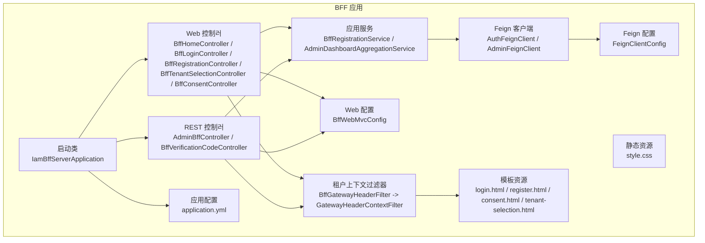
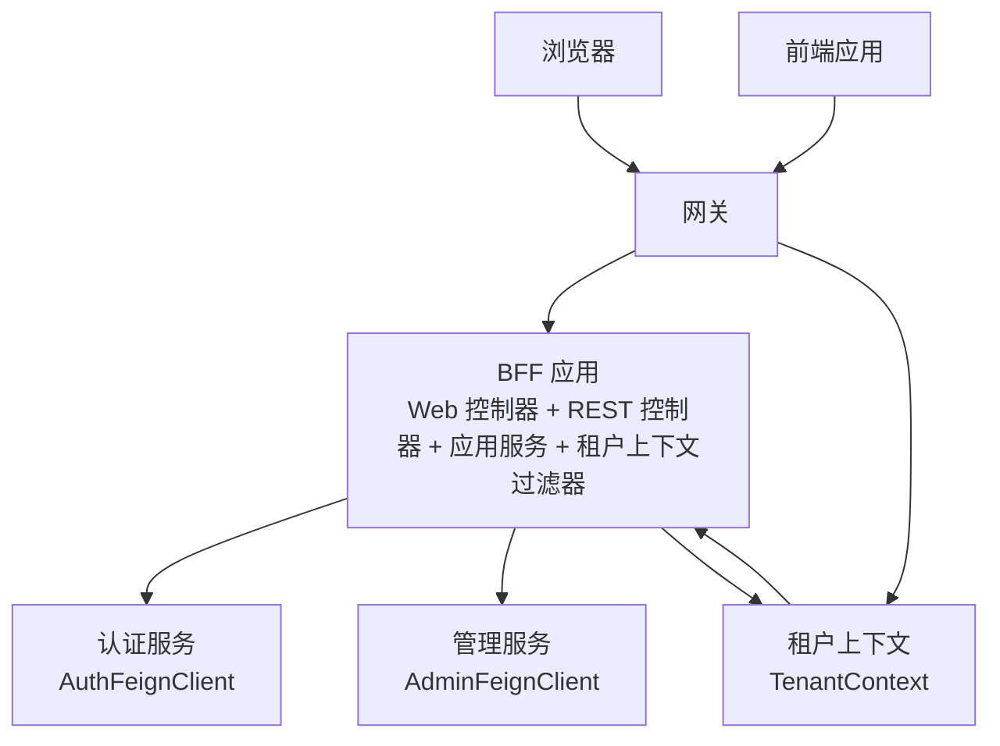
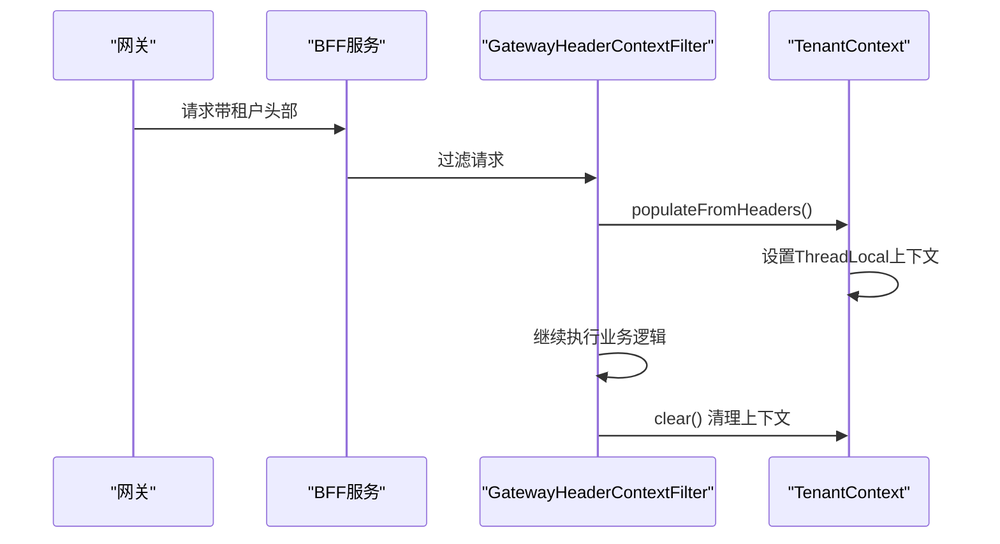
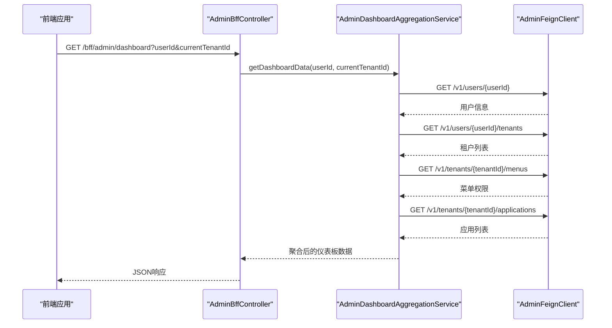
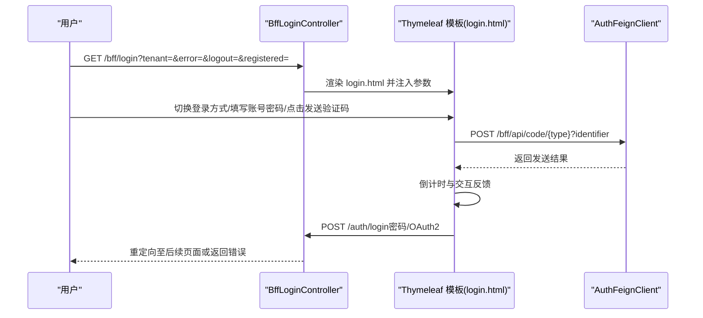
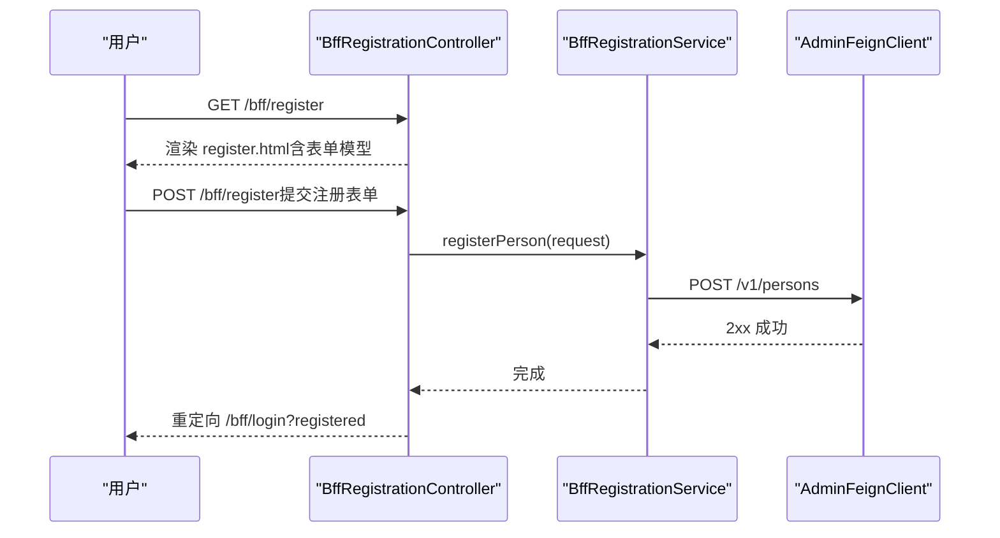
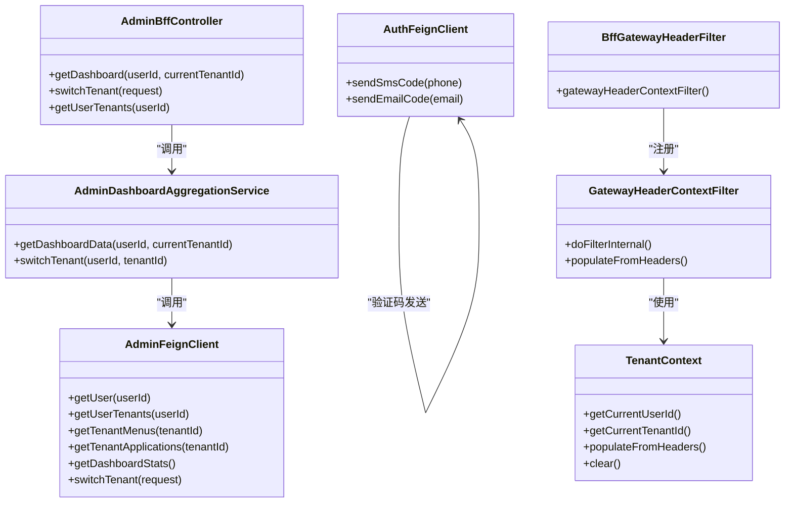
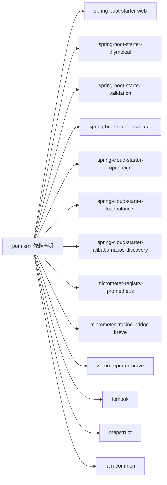

# 前端代理服务器（iam-bff-server）

<cite>
**本文引用的文件**
- [IamBffServerApplication.java](file://iam-bff-server/src/main/java/iam/platform/bff/IamBffServerApplication.java)
- [application.yml](file://iam-bff-server/src/main/resources/application.yml)
- [AdminDashboardAggregationService.java](file://iam-bff-server/src/main/java/iam/platform/bff/application/service/AdminDashboardAggregationService.java)
- [AdminBffController.java](file://iam-bff-server/src/main/java/iam/platform/bff/interfaces/rest/AdminBffController.java)
- [BffVerificationCodeController.java](file://iam-bff-server/src/main/java/iam/platform/bff/interfaces/rest/BffVerificationCodeController.java)
- [BffHomeController.java](file://iam-bff-server/src/main/java/iam/platform/bff/interfaces/web/BffHomeController.java)
- [BffLoginController.java](file://iam-bff-server/src/main/java/iam/platform/bff/interfaces/web/BffLoginController.java)
- [BffRegistrationController.java](file://iam-bff-server/src/main/java/iam/platform/bff/interfaces/web/BffRegistrationController.java)
- [BffTenantSelectionController.java](file://iam-bff-server/src/main/java/iam/platform/bff/interfaces/web/BffTenantSelectionController.java)
- [BffConsentController.java](file://iam-bff-server/src/main/java/iam/platform/bff/interfaces/web/BffConsentController.java)
- [BffRegistrationService.java](file://iam-bff-server/src/main/java/iam/platform/bff/application/service/BffRegistrationService.java)
- [AuthFeignClient.java](file://iam-bff-server/src/main/java/iam/platform/bff/infrastructure/client/AuthFeignClient.java)
- [AdminFeignClient.java](file://iam-bff-server/src/main/java/iam/platform/bff/infrastructure/client/AdminFeignClient.java)
- [BffWebMvcConfig.java](file://iam-bff-server/src/main/java/iam/platform/bff/infrastructure/config/BffWebMvcConfig.java)
- [FeignClientConfig.java](file://iam-bff-server/src/main/java/iam/platform/bff/infrastructure/config/FeignClientConfig.java)
- [BffGatewayHeaderFilter.java](file://iam-bff-server/src/main/java/iam/platform/bff/infrastructure/filter/BffGatewayHeaderFilter.java)
- [login.html](file://iam-bff-server/src/main/resources/templates/login.html)
- [register.html](file://iam-bff-server/src/main/resources/templates/register.html)
- [consent.html](file://iam-bff-server/src/main/resources/templates/consent.html)
- [tenant-selection.html](file://iam-bff-server/src/main/resources/templates/tenant-selection.html)
- [GatewayHeaderContextFilter.java](file://iam-common/src/main/java/iam/platform/common/context/GatewayHeaderContextFilter.java)
- [TenantContext.java](file://iam-common/src/main/java/iam/platform/common/context/TenantContext.java)
- [AdminGatewayHeaderFilter.java](file://iam-admin-server/src/main/java/iam/platform/admin/infrastructure/filter/AdminGatewayHeaderFilter.java)
- [pom.xml](file://iam-bff-server/pom.xml)
</cite>

## 目录
1. [简介](#简介)
2. [项目结构](#项目结构)
3. [核心组件](#核心组件)
4. [架构总览](#架构总览)
5. [详细组件分析](#详细组件分析)
6. [依赖分析](#依赖分析)
7. [性能考虑](#性能考虑)
8. [故障排查指南](#故障排查指南)
9. [结论](#结论)
10. [附录](#附录)

## 简介
本文件为 iam-bff-server（IAM 前端代理服务器）的完整技术文档，聚焦于 BFF（Backend for Frontend）架构的设计理念与实现策略，系统阐述前端集成方案、页面渲染机制、API 简化策略，以及 BFF 如何协调认证服务器与管理服务器，提供统一的前端访问接口。文档覆盖注册、登录、租户选择、仪表板聚合等核心业务流程，并说明模板引擎使用、静态资源管理、前端路由配置、与后端服务的通信机制、错误处理策略与性能优化方案。最后给出扩展 BFF 功能与自定义前端交互逻辑的实际示例路径。

**更新** 新增了租户上下文处理机制，通过 BffGatewayHeaderFilter 注册 GatewayHeaderContextFilter，与管理服务器保持一致的租户上下文处理模式，确保跨服务的租户信息传递和隔离。

## 项目结构
iam-bff-server 采用 Spring Boot + Spring MVC + Thymeleaf 模板引擎的典型 Web 应用结构，结合 OpenFeign 进行服务间通信，并通过 Nacos 进行服务发现。其主要模块划分如下：
- 应用入口：启动类启用服务发现与 Feign 客户端扫描
- 接口层（web）：面向浏览器的控制器，负责页面渲染与用户交互
- 接口层（rest）：面向前端应用的REST控制器，提供API接口
- 应用服务：封装业务流程（如注册、仪表板聚合）
- 基础设施：Feign 客户端、Web 配置、Feign 配置、租户上下文过滤器
- 资源：Thymeleaf 模板、静态样式、应用配置

**图表来源**
- [IamBffServerApplication.java:1-17](file://iam-bff-server/src/main/java/iam/platform/bff/IamBffServerApplication.java#L1-L17)
- [AdminBffController.java:1-61](file://iam-bff-server/src/main/java/iam/platform/bff/interfaces/rest/AdminBffController.java#L1-L61)
- [BffVerificationCodeController.java:1-39](file://iam-bff-server/src/main/java/iam/platform/bff/interfaces/rest/BffVerificationCodeController.java#L1-L39)
- [AdminDashboardAggregationService.java:1-129](file://iam-bff-server/src/main/java/iam/platform/bff/application/service/AdminDashboardAggregationService.java#L1-L129)
- [BffHomeController.java:1-22](file://iam-bff-server/src/main/java/iam/platform/bff/interfaces/web/BffHomeController.java#L1-L22)
- [BffLoginController.java:1-50](file://iam-bff-server/src/main/java/iam/platform/bff/interfaces/web/BffLoginController.java#L1-L50)
- [BffRegistrationController.java:1-40](file://iam-bff-server/src/main/java/iam/platform/bff/interfaces/web/BffRegistrationController.java#L1-L40)
- [BffTenantSelectionController.java:1-22](file://iam-bff-server/src/main/java/iam/platform/bff/interfaces/web/BffTenantSelectionController.java#L1-L22)
- [BffConsentController.java:1-35](file://iam-bff-server/src/main/java/iam/platform/bff/interfaces/web/BffConsentController.java#L1-L35)
- [BffRegistrationService.java:1-31](file://iam-bff-server/src/main/java/iam/platform/bff/application/service/BffRegistrationService.java#L1-L31)
- [AuthFeignClient.java:1-31](file://iam-bff-server/src/main/java/iam/platform/bff/infrastructure/client/AuthFeignClient.java#L1-L31)
- [AdminFeignClient.java:1-26](file://iam-bff-server/src/main/java/iam/platform/bff/infrastructure/client/AdminFeignClient.java#L1-L26)
- [BffWebMvcConfig.java:1-23](file://iam-bff-server/src/main/java/iam/platform/bff/infrastructure/config/BffWebMvcConfig.java#L1-L23)
- [FeignClientConfig.java:1-52](file://iam-bff-server/src/main/java/iam/platform/bff/infrastructure/config/FeignClientConfig.java#L1-L52)
- [BffGatewayHeaderFilter.java:1-28](file://iam-bff-server/src/main/java/iam/platform/bff/infrastructure/filter/BffGatewayHeaderFilter.java#L1-L28)
- [login.html:1-341](file://iam-bff-server/src/main/resources/templates/login.html#L1-L341)
- [register.html:1-64](file://iam-bff-server/src/main/resources/templates/register.html#L1-L64)
- [consent.html:1-34](file://iam-bff-server/src/main/resources/templates/consent.html#L1-L34)
- [tenant-selection.html:1-238](file://iam-bff-server/src/main/resources/templates/tenant-selection.html#L1-L238)
- [application.yml:1-54](file://iam-bff-server/src/main/resources/application.yml#L1-L54)

**章节来源**
- [pom.xml:1-107](file://iam-bff-server/pom.xml#L1-L107)
- [application.yml:1-54](file://iam-bff-server/src/main/resources/application.yml#L1-L54)

## 核心组件
- 启动类与服务发现：启用服务发现与 Feign 客户端扫描，自动装配基础配置
- Web 控制器：提供首页、登录页、注册页、租户选择页、授权同意页的渲染与参数透传
- REST 控制器：提供管理员仪表板API、验证码发送API等REST接口
- 应用服务：封装注册流程和仪表板聚合流程，调用管理服务获取综合数据
- Feign 客户端：抽象认证与管理服务的远程调用，统一超时与错误处理
- Web 配置：本地开发阶段允许跨域，生产由网关统一处理
- Feign 配置：统一请求头注入与错误解码策略
- **新增** 租户上下文过滤器：通过 BffGatewayHeaderFilter 注册 GatewayHeaderContextFilter，实现跨服务租户信息传递
- 模板与静态资源：Thymeleaf 渲染登录/注册/授权/租户选择页，内置样式与交互脚本

**更新** 新增了租户上下文过滤器组件，确保BFF与管理服务器在租户上下文处理上保持一致。

**章节来源**
- [IamBffServerApplication.java:1-17](file://iam-bff-server/src/main/java/iam/platform/bff/IamBffServerApplication.java#L1-L17)
- [AdminBffController.java:1-61](file://iam-bff-server/src/main/java/iam/platform/bff/interfaces/rest/AdminBffController.java#L1-L61)
- [BffVerificationCodeController.java:1-39](file://iam-bff-server/src/main/java/iam/platform/bff/interfaces/rest/BffVerificationCodeController.java#L1-L39)
- [AdminDashboardAggregationService.java:1-129](file://iam-bff-server/src/main/java/iam/platform/bff/application/service/AdminDashboardAggregationService.java#L1-L129)
- [BffHomeController.java:1-22](file://iam-bff-server/src/main/java/iam/platform/bff/interfaces/web/BffHomeController.java#L1-L22)
- [BffLoginController.java:1-50](file://iam-bff-server/src/main/java/iam/platform/bff/interfaces/web/BffLoginController.java#L1-L50)
- [BffRegistrationController.java:1-40](file://iam-bff-server/src/main/java/iam/platform/bff/interfaces/web/BffRegistrationController.java#L1-L40)
- [BffTenantSelectionController.java:1-22](file://iam-bff-server/src/main/java/iam/platform/bff/interfaces/web/BffTenantSelectionController.java#L1-L22)
- [BffConsentController.java:1-35](file://iam-bff-server/src/main/java/iam/platform/bff/interfaces/web/BffConsentController.java#L1-L35)
- [BffRegistrationService.java:1-31](file://iam-bff-server/src/main/java/iam/platform/bff/application/service/BffRegistrationService.java#L1-L31)
- [AuthFeignClient.java:1-31](file://iam-bff-server/src/main/java/iam/platform/bff/infrastructure/client/AuthFeignClient.java#L1-L31)
- [AdminFeignClient.java:1-26](file://iam-bff-server/src/main/java/iam/platform/bff/infrastructure/client/AdminFeignClient.java#L1-L26)
- [BffWebMvcConfig.java:1-23](file://iam-bff-server/src/main/java/iam/platform/bff/infrastructure/config/BffWebMvcConfig.java#L1-L23)
- [FeignClientConfig.java:1-52](file://iam-bff-server/src/main/java/iam/platform/bff/infrastructure/config/FeignClientConfig.java#L1-L52)
- [BffGatewayHeaderFilter.java:1-28](file://iam-bff-server/src/main/java/iam/platform/bff/infrastructure/filter/BffGatewayHeaderFilter.java#L1-L28)
- [login.html:1-341](file://iam-bff-server/src/main/resources/templates/login.html#L1-L341)
- [register.html:1-64](file://iam-bff-server/src/main/resources/templates/register.html#L1-L64)
- [consent.html:1-34](file://iam-bff-server/src/main/resources/templates/consent.html#L1-L34)
- [tenant-selection.html:1-238](file://iam-bff-server/src/main/resources/templates/tenant-selection.html#L1-L238)

## 架构总览
BFF 在整体 IAM 平台中承担"前端专用后端"的角色，作为统一入口协调认证与管理服务，向浏览器提供一致的页面与交互体验。其关键职责包括：
- 页面渲染：基于 Thymeleaf 提供登录、注册、租户选择、授权同意等页面
- API 简化：通过应用服务封装复杂流程，减少前端直连后端的复杂度
- 统一鉴权：配合网关与认证服务器完成 OAuth2/SAML/CAS 等协议交互
- 数据聚合：通过仪表板聚合服务整合多源数据，提供统一的前端数据接口
- **新增** 租户上下文管理：通过 GatewayHeaderContextFilter 实现跨服务租户信息传递
- 错误处理：集中化错误解码与提示，提升用户体验

**更新** 新增了租户上下文管理功能，确保跨服务的租户信息一致性和隔离性。

**图表来源**
- [AdminBffController.java:1-61](file://iam-bff-server/src/main/java/iam/platform/bff/interfaces/rest/AdminBffController.java#L1-L61)
- [BffVerificationCodeController.java:1-39](file://iam-bff-server/src/main/java/iam/platform/bff/interfaces/rest/BffVerificationCodeController.java#L1-L39)
- [AdminDashboardAggregationService.java:1-129](file://iam-bff-server/src/main/java/iam/platform/bff/application/service/AdminDashboardAggregationService.java#L1-L129)
- [BffLoginController.java:1-50](file://iam-bff-server/src/main/java/iam/platform/bff/interfaces/web/BffLoginController.java#L1-L50)
- [BffRegistrationController.java:1-40](file://iam-bff-server/src/main/java/iam/platform/bff/interfaces/web/BffRegistrationController.java#L1-L40)
- [BffRegistrationService.java:1-31](file://iam-bff-server/src/main/java/iam/platform/bff/application/service/BffRegistrationService.java#L1-L31)
- [AuthFeignClient.java:1-31](file://iam-bff-server/src/main/java/iam/platform/bff/infrastructure/client/AuthFeignClient.java#L1-L31)
- [AdminFeignClient.java:1-26](file://iam-bff-server/src/main/java/iam/platform/bff/infrastructure/client/AdminFeignClient.java#L1-L26)
- [BffGatewayHeaderFilter.java:18-26](file://iam-bff-server/src/main/java/iam/platform/bff/infrastructure/filter/BffGatewayHeaderFilter.java#L18-L26)
- [GatewayHeaderContextFilter.java:22-49](file://iam-common/src/main/java/iam/platform/common/context/GatewayHeaderContextFilter.java#L22-L49)
- [TenantContext.java:14-113](file://iam-common/src/main/java/iam/platform/common/context/TenantContext.java#L14-L113)

## 详细组件分析

### 租户上下文过滤器
**新增** 通过 BffGatewayHeaderFilter 注册 GatewayHeaderContextFilter，实现与管理服务器一致的租户上下文处理模式。

- 过滤器注册：在 BFF 服务中注册 GatewayHeaderContextFilter，设置最高优先级
- 头部提取：从标准 HTTP 头部提取用户ID、租户ID、租户账户ID等信息
- 上下文填充：将租户信息填充到 TenantContext 中，供后续业务逻辑使用
- 线程安全：使用 ThreadLocal 存储上下文信息，确保线程隔离
- 清理机制：在 finally 块中清理上下文，防止内存泄漏

**图表来源**
- [BffGatewayHeaderFilter.java:18-26](file://iam-bff-server/src/main/java/iam/platform/bff/infrastructure/filter/BffGatewayHeaderFilter.java#L18-L26)
- [GatewayHeaderContextFilter.java:24-48](file://iam-common/src/main/java/iam/platform/common/context/GatewayHeaderContextFilter.java#L24-L48)
- [TenantContext.java:72-104](file://iam-common/src/main/java/iam/platform/common/context/TenantContext.java#L72-L104)

**章节来源**
- [BffGatewayHeaderFilter.java:1-28](file://iam-bff-server/src/main/java/iam/platform/bff/infrastructure/filter/BffGatewayHeaderFilter.java#L1-L28)
- [GatewayHeaderContextFilter.java:1-50](file://iam-common/src/main/java/iam/platform/common/context/GatewayHeaderContextFilter.java#L1-L50)
- [TenantContext.java:1-113](file://iam-common/src/main/java/iam/platform/common/context/TenantContext.java#L1-L113)

### 管理员仪表板聚合服务
**新增** 管理员仪表板聚合服务提供了统一的数据聚合能力，整合用户信息、租户列表、菜单权限和应用信息。

- 数据聚合：从多个管理服务获取用户信息、租户列表、菜单权限和应用信息
- 条件查询：根据当前租户ID决定是否获取菜单和应用数据
- 平台统计：仅对平台管理员租户提供平台级统计数据
- 租户切换：提供租户切换功能，支持用户在不同租户间切换

**图表来源**
- [AdminBffController.java:29-35](file://iam-bff-server/src/main/java/iam/platform/bff/interfaces/rest/AdminBffController.java#L29-L35)
- [AdminDashboardAggregationService.java:30-93](file://iam-bff-server/src/main/java/iam/platform/bff/application/service/AdminDashboardAggregationService.java#L30-L93)
- [AdminFeignClient.java:1-26](file://iam-bff-server/src/main/java/iam/platform/bff/infrastructure/client/AdminFeignClient.java#L1-L26)

**章节来源**
- [AdminDashboardAggregationService.java:1-129](file://iam-bff-server/src/main/java/iam/platform/bff/application/service/AdminDashboardAggregationService.java#L1-L129)
- [AdminBffController.java:1-61](file://iam-bff-server/src/main/java/iam/platform/bff/interfaces/rest/AdminBffController.java#L1-L61)

### 验证码发送API
**新增** 专门的验证码发送API控制器，提供短信和邮件验证码发送功能。

- 短信验证码：POST /bff/api/code/sms，支持手机号参数
- 邮件验证码：POST /bff/api/code/email，支持邮箱参数
- 统一转发：将请求转发到认证服务进行实际发送
- 日志记录：记录验证码发送操作，便于审计和监控

**章节来源**
- [BffVerificationCodeController.java:1-39](file://iam-bff-server/src/main/java/iam/platform/bff/interfaces/rest/BffVerificationCodeController.java#L1-L39)

### 登录流程（页面渲染与交互）
- 页面入口：/bff/login，支持 tenant、error、logout、registered 参数透传
- 模板渲染：Thymeleaf 将参数注入模型，动态显示提示信息
- 多方式登录：密码登录、验证码登录（短信/邮箱）、第三方 OAuth2
- 验证码发送：通过 /bff/api/code/{type} 发起请求，调用认证服务发送验证码
- 行为逻辑：前端切换登录方式、验证码倒计时、表单提交到 /auth/login

**图表来源**
- [BffLoginController.java:1-50](file://iam-bff-server/src/main/java/iam/platform/bff/interfaces/web/BffLoginController.java#L1-L50)
- [login.html:1-341](file://iam-bff-server/src/main/resources/templates/login.html#L1-L341)
- [AuthFeignClient.java:1-31](file://iam-bff-server/src/main/java/iam/platform/bff/infrastructure/client/AuthFeignClient.java#L1-L31)

**章节来源**
- [BffLoginController.java:1-50](file://iam-bff-server/src/main/java/iam/platform/bff/interfaces/web/BffLoginController.java#L1-L50)
- [login.html:1-341](file://iam-bff-server/src/main/resources/templates/login.html#L1-L341)

### 注册流程（页面渲染与后端集成）
- 页面入口：/bff/register，GET 初始化表单模型
- 表单校验：前端 JS 校验两次密码一致性
- 提交处理：POST /bff/register，调用应用服务进行注册
- 应用服务：通过 AdminFeignClient 调用管理服务创建人员
- 成功跳转：重定向到登录页并提示已注册

**图表来源**
- [BffRegistrationController.java:1-40](file://iam-bff-server/src/main/java/iam/platform/bff/interfaces/web/BffRegistrationController.java#L1-L40)
- [BffRegistrationService.java:1-31](file://iam-bff-server/src/main/java/iam/platform/bff/application/service/BffRegistrationService.java#L1-L31)
- [AdminFeignClient.java:1-26](file://iam-bff-server/src/main/java/iam/platform/bff/infrastructure/client/AdminFeignClient.java#L1-L26)
- [register.html:1-64](file://iam-bff-server/src/main/resources/templates/register.html#L1-L64)

**章节来源**
- [BffRegistrationController.java:1-40](file://iam-bff-server/src/main/java/iam/platform/bff/interfaces/web/BffRegistrationController.java#L1-L40)
- [BffRegistrationService.java:1-31](file://iam-bff-server/src/main/java/iam/platform/bff/application/service/BffRegistrationService.java#L1-L31)
- [register.html:1-64](file://iam-bff-server/src/main/resources/templates/register.html#L1-L64)

### 租户选择流程（页面渲染与待办）
- 页面入口：/bff/select-tenant，当前仅渲染页面，后续可接入 Feign 客户端拉取可用租户列表
- 设计意图：在用户登录后引导其选择目标租户，以便后续权限与数据隔离

**章节来源**
- [BffTenantSelectionController.java:1-22](file://iam-bff-server/src/main/java/iam/platform/bff/interfaces/web/BffTenantSelectionController.java#L1-L22)

### 授权同意流程（页面渲染与参数透传）
- 页面入口：/bff/consent，接收 clientName、scopes、clientId 参数用于展示授权信息
- 设计意图：在 OAuth2 授权前展示第三方客户端与权限范围，确保用户知情同意

**章节来源**
- [BffConsentController.java:1-35](file://iam-bff-server/src/main/java/iam/platform/bff/interfaces/web/BffConsentController.java#L1-L35)

### API 简化策略与服务编排
- 注册流程：BFF 应用服务封装创建人员的调用细节，前端仅需提交表单
- 认证流程：登录页通过统一表单提交到认证服务，支持多种认证方式
- 参数透传：控制器将查询参数与模型属性注入模板，保证用户体验连贯性
- **新增** 仪表板聚合：AdminDashboardAggregationService 统一处理多源数据聚合
- **新增** 租户上下文：GatewayHeaderContextFilter 自动提取并传播租户信息

**更新** 新增了租户上下文处理功能，确保跨服务的租户信息一致性。

**章节来源**
- [AdminDashboardAggregationService.java:1-129](file://iam-bff-server/src/main/java/iam/platform/bff/application/service/AdminDashboardAggregationService.java#L1-L129)
- [AdminBffController.java:1-61](file://iam-bff-server/src/main/java/iam/platform/bff/interfaces/rest/AdminBffController.java#L1-L61)
- [BffVerificationCodeController.java:1-39](file://iam-bff-server/src/main/java/iam/platform/bff/interfaces/rest/BffVerificationCodeController.java#L1-L39)
- [BffRegistrationService.java:1-31](file://iam-bff-server/src/main/java/iam/platform/bff/application/service/BffRegistrationService.java#L1-L31)
- [BffLoginController.java:1-50](file://iam-bff-server/src/main/java/iam/platform/bff/interfaces/web/BffLoginController.java#L1-L50)
- [BffGatewayHeaderFilter.java:18-26](file://iam-bff-server/src/main/java/iam/platform/bff/infrastructure/filter/BffGatewayHeaderFilter.java#L18-L26)

### 模板引擎与静态资源
- 模板位置：classpath:/templates/*.html，Thymeleaf 自动解析
- 样式引入：login.html 与 register.html 引入 /bff/css/style.css
- 开发配置：Thymeleaf 缓存开启，便于生产环境性能稳定
- **新增** 模板：consent.html 和 tenant-selection.html 提供授权和租户选择页面

**更新** 新增了授权同意和租户选择模板。

**章节来源**
- [application.yml:15-18](file://iam-bff-server/src/main/resources/application.yml#L15-L18)
- [login.html:1-341](file://iam-bff-server/src/main/resources/templates/login.html#L1-L341)
- [register.html:1-64](file://iam-bff-server/src/main/resources/templates/register.html#L1-L64)
- [consent.html:1-34](file://iam-bff-server/src/main/resources/templates/consent.html#L1-L34)
- [tenant-selection.html:1-238](file://iam-bff-server/src/main/resources/templates/tenant-selection.html#L1-L238)

### 前端路由配置
- BFF 内部路由：以 /bff 前缀提供页面与 API（如 /bff/api/code/{type}）
- REST API 路由：/bff/admin 提供管理员仪表板相关API
- 生产路由：由网关统一转发到 BFF，BFF 专注页面渲染与业务编排
- 本地开发：允许跨域，便于前端联调
- **新增** 静态资源：/admin-ui/** 路径提供管理界面静态资源

**更新** 新增了管理界面静态资源路由配置。

**章节来源**
- [AdminBffController.java:20](file://iam-bff-server/src/main/java/iam/platform/bff/interfaces/rest/AdminBffController.java#L20)
- [BffWebMvcConfig.java:1-39](file://iam-bff-server/src/main/java/iam/platform/bff/infrastructure/config/BffWebMvcConfig.java#L1-L39)

### 与后端服务的通信机制
- 认证服务：AuthFeignClient 提供发送短信/邮箱验证码能力
- 管理服务：AdminFeignClient 提供创建人员、获取用户信息、租户管理等操作
- 超时与错误：Feign 默认连接超时与读取超时，自定义错误解码器区分客户端与服务端错误
- **新增** 仪表板聚合：AdminDashboardAggregationService 统一处理多源数据调用
- **新增** 租户上下文：GatewayHeaderContextFilter 自动传播租户信息到下游服务

**更新** 新增了租户上下文传播机制。

**图表来源**
- [AdminDashboardAggregationService.java:1-129](file://iam-bff-server/src/main/java/iam/platform/bff/application/service/AdminDashboardAggregationService.java#L1-L129)
- [AdminBffController.java:1-61](file://iam-bff-server/src/main/java/iam/platform/bff/interfaces/rest/AdminBffController.java#L1-L61)
- [AdminFeignClient.java:1-26](file://iam-bff-server/src/main/java/iam/platform/bff/infrastructure/client/AdminFeignClient.java#L1-L26)
- [AuthFeignClient.java:1-31](file://iam-bff-server/src/main/java/iam/platform/bff/infrastructure/client/AuthFeignClient.java#L1-L31)
- [BffGatewayHeaderFilter.java:18-26](file://iam-bff-server/src/main/java/iam/platform/bff/infrastructure/filter/BffGatewayHeaderFilter.java#L18-L26)
- [GatewayHeaderContextFilter.java:22-49](file://iam-common/src/main/java/iam/platform/common/context/GatewayHeaderContextFilter.java#L22-L49)
- [TenantContext.java:14-113](file://iam-common/src/main/java/iam/platform/common/context/TenantContext.java#L14-L113)

**章节来源**
- [AuthFeignClient.java:1-31](file://iam-bff-server/src/main/java/iam/platform/bff/infrastructure/client/AuthFeignClient.java#L1-L31)
- [AdminFeignClient.java:1-26](file://iam-bff-server/src/main/java/iam/platform/bff/infrastructure/client/AdminFeignClient.java#L1-L26)
- [FeignClientConfig.java:1-52](file://iam-bff-server/src/main/java/iam/platform/bff/infrastructure/config/FeignClientConfig.java#L1-L52)
- [BffGatewayHeaderFilter.java:1-28](file://iam-bff-server/src/main/java/iam/platform/bff/infrastructure/filter/BffGatewayHeaderFilter.java#L1-L28)
- [GatewayHeaderContextFilter.java:1-50](file://iam-common/src/main/java/iam/platform/common/context/GatewayHeaderContextFilter.java#L1-L50)
- [TenantContext.java:1-113](file://iam-common/src/main/java/iam/platform/common/context/TenantContext.java#L1-L113)

### 错误处理策略
- Feign 错误解码：区分 4xx 与 5xx，抛出运行时异常并记录日志
- 控制器错误回显：登录页根据参数显示错误/成功/退出提示
- 注册失败回退：注册异常时保留表单数据并提示错误
- **新增** 仪表板聚合错误：聚合服务捕获各服务调用异常，记录日志并继续处理其他数据
- **新增** 租户上下文错误：GatewayHeaderContextFilter 对租户信息解析异常进行容错处理

**更新** 新增了租户上下文处理的错误处理策略。

**章节来源**
- [AdminDashboardAggregationService.java:39-41](file://iam-bff-server/src/main/java/iam/platform/bff/application/service/AdminDashboardAggregationService.java#L39-L41)
- [AdminDashboardAggregationService.java:51-53](file://iam-bff-server/src/main/java/iam/platform/bff/application/service/AdminDashboardAggregationService.java#L51-L53)
- [AdminDashboardAggregationService.java:65-67](file://iam-bff-server/src/main/java/iam/platform/bff/application/service/AdminDashboardAggregationService.java#L65-L67)
- [AdminDashboardAggregationService.java:76-78](file://iam-bff-server/src/main/java/iam/platform/bff/application/service/AdminDashboardAggregationService.java#L76-L78)
- [AdminDashboardAggregationService.java:87-89](file://iam-bff-server/src/main/java/iam/platform/bff/application/service/AdminDashboardAggregationService.java#L87-L89)
- [FeignClientConfig.java:36-50](file://iam-bff-server/src/main/java/iam/platform/bff/infrastructure/config/FeignClientConfig.java#L36-L50)
- [BffLoginController.java:37-45](file://iam-bff-server/src/main/java/iam/platform/bff/interfaces/web/BffLoginController.java#L37-L45)
- [BffRegistrationController.java:33-37](file://iam-bff-server/src/main/java/iam/platform/bff/interfaces/web/BffRegistrationController.java#L33-L37)
- [GatewayHeaderContextFilter.java:36-39](file://iam-common/src/main/java/iam/platform/common/context/GatewayHeaderContextFilter.java#L36-L39)

## 依赖分析
- 启动类依赖：Spring Boot、Nacos 服务发现、OpenFeign
- Web 依赖：Thymeleaf、验证、Actuator、Micrometer
- 通信依赖：OpenFeign、LoadBalancer
- 链路追踪：Micrometer Prometheus、Brave Zipkin
- **新增** 工具依赖：Lombok、MapStruct
- **新增** 公共上下文依赖：iam-common 模块提供租户上下文管理

**更新** 新增了公共上下文依赖，支持租户上下文处理。

**图表来源**
- [pom.xml:18-87](file://iam-bff-server/pom.xml#L18-L87)

**章节来源**
- [pom.xml:1-107](file://iam-bff-server/pom.xml#L1-L107)

## 性能考虑
- 模板缓存：Thymeleaf 开启缓存，降低模板解析开销
- 超时设置：Feign 默认连接与读取超时，避免阻塞线程
- 指标监控：Actuator 暴露健康、指标、Prometheus，便于观测
- 链路追踪：Zipkin 采样概率 1.0，便于问题定位
- 静态资源：CSS 与 HTML 分离，利于浏览器缓存与 CDN 加速
- **新增** 数据聚合：仪表板聚合服务采用异步调用模式，提高响应速度
- **新增** 过滤器性能：GatewayHeaderContextFilter 使用 OncePerRequestFilter，避免重复过滤

**更新** 新增了租户上下文过滤器的性能考虑。

**章节来源**
- [application.yml:15-18](file://iam-bff-server/src/main/resources/application.yml#L15-L18)
- [application.yml:30-31](file://iam-bff-server/src/main/resources/application.yml#L30-L31)
- [application.yml:33-48](file://iam-bff-server/src/main/resources/application.yml#L33-L48)
- [GatewayHeaderContextFilter.java:22](file://iam-common/src/main/java/iam/platform/common/context/GatewayHeaderContextFilter.java#L22)

## 故障排查指南
- 登录失败：检查 /bff/login 是否正确透传 error、logout、registered 参数；确认认证服务可达
- 注册失败：查看注册异常回显与日志；确认管理服务 /v1/persons 可用
- 验证码发送失败：确认 /bff/api/code/{type} 请求是否被网关正确转发；检查 Feign 超时配置
- 仪表板数据缺失：检查 AdminDashboardAggregationService 各个服务调用是否正常；确认管理服务可用
- 跨域问题：本地开发可通过 BffWebMvcConfig 允许跨域；生产环境由网关统一处理
- 链路追踪：确认 Zipkin 地址与采样配置；检查 Prometheus 指标暴露端口
- **新增** 租户上下文问题：检查网关是否正确设置 X-User-Id、X-Tenant-Id 等头部；确认 GatewayHeaderContextFilter 是否正确注册
- **新增** 线程安全问题：如果出现租户信息串扰，检查 TenantContext.clear() 是否在 finally 块中执行

**更新** 新增了租户上下文相关的故障排查指南。

**章节来源**
- [AdminDashboardAggregationService.java:39-41](file://iam-bff-server/src/main/java/iam/platform/bff/application/service/AdminDashboardAggregationService.java#L39-L41)
- [AdminDashboardAggregationService.java:51-53](file://iam-bff-server/src/main/java/iam/platform/bff/application/service/AdminDashboardAggregationService.java#L51-L53)
- [AdminDashboardAggregationService.java:65-67](file://iam-bff-server/src/main/java/iam/platform/bff/application/service/AdminDashboardAggregationService.java#L65-L67)
- [AdminDashboardAggregationService.java:76-78](file://iam-bff-server/src/main/java/iam/platform/bff/application/service/AdminDashboardAggregationService.java#L76-L78)
- [AdminDashboardAggregationService.java:87-89](file://iam-bff-server/src/main/java/iam/platform/bff/application/service/AdminDashboardAggregationService.java#L87-L89)
- [BffLoginController.java:37-45](file://iam-bff-server/src/main/java/iam/platform/bff/interfaces/web/BffLoginController.java#L37-L45)
- [BffRegistrationController.java:33-37](file://iam-bff-server/src/main/java/iam/platform/bff/interfaces/web/BffRegistrationController.java#L33-L37)
- [BffWebMvcConfig.java:14-21](file://iam-bff-server/src/main/java/iam/platform/bff/infrastructure/config/BffWebMvcConfig.java#L14-L21)
- [application.yml:43-48](file://iam-bff-server/src/main/resources/application.yml#L43-L48)
- [BffGatewayHeaderFilter.java:18-26](file://iam-bff-server/src/main/java/iam/platform/bff/infrastructure/filter/BffGatewayHeaderFilter.java#L18-L26)
- [GatewayHeaderContextFilter.java:42-47](file://iam-common/src/main/java/iam/platform/common/context/GatewayHeaderContextFilter.java#L42-L47)

## 结论
iam-bff-server 通过清晰的分层设计与模板渲染能力，有效实现了 BFF 的核心价值：为前端提供统一入口、简化 API 调用、增强用户体验与安全性。结合认证与管理服务的协同，BFF 在微服务架构中扮演着"前端专用后端"的关键角色，既隔离了后端复杂性，又保障了业务流程的一致性与可观测性。

**更新** 新增的租户上下文处理机制进一步增强了BFF在微服务架构中的价值，通过标准化的租户信息传递，确保了跨服务的一致性和安全性，为后续的功能扩展奠定了坚实的基础。

## 附录
- 扩展建议
  - 新增登录方式：在 BffLoginController 中新增参数处理，在 login.html 中添加对应 UI 与脚本
  - 新增业务流程：在 application/service 下新增服务类，通过 Feign 客户端编排管理/认证服务
  - 自定义前端交互：在 templates 下新增页面，或复用现有页面结构进行局部改造
  - **新增** REST API扩展：在 interfaces/rest 下新增控制器，提供新的API接口
  - **新增** 数据聚合扩展：在 AdminDashboardAggregationService 中添加新的数据源调用
  - **新增** 租户上下文扩展：在业务逻辑中通过 TenantContext.getCurrentTenantId() 获取当前租户信息
  - 配置管理：通过 application.yml 或环境变量调整 SSL、端口、超时与采样策略

**更新** 新增了租户上下文处理的扩展建议。

**章节来源**
- [AdminBffController.java:1-61](file://iam-bff-server/src/main/java/iam/platform/bff/interfaces/rest/AdminBffController.java#L1-L61)
- [AdminDashboardAggregationService.java:1-129](file://iam-bff-server/src/main/java/iam/platform/bff/application/service/AdminDashboardAggregationService.java#L1-L129)
- [BffLoginController.java:1-50](file://iam-bff-server/src/main/java/iam/platform/bff/interfaces/web/BffLoginController.java#L1-L50)
- [login.html:1-341](file://iam-bff-server/src/main/resources/templates/login.html#L1-L341)
- [application.yml:1-54](file://iam-bff-server/src/main/resources/application.yml#L1-L54)
- [TenantContext.java:31-61](file://iam-common/src/main/java/iam/platform/common/context/TenantContext.java#L31-L61)