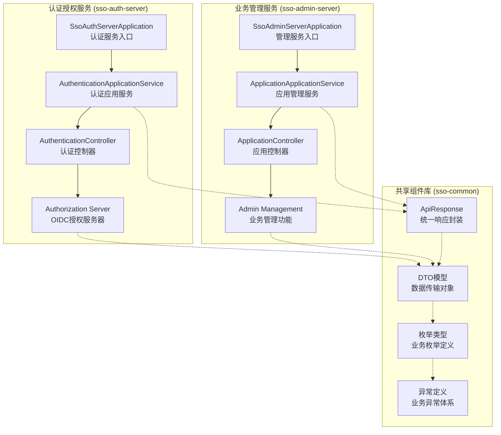
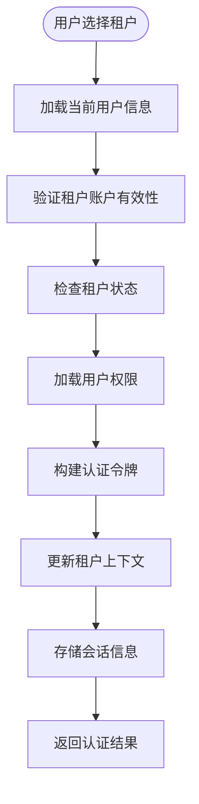
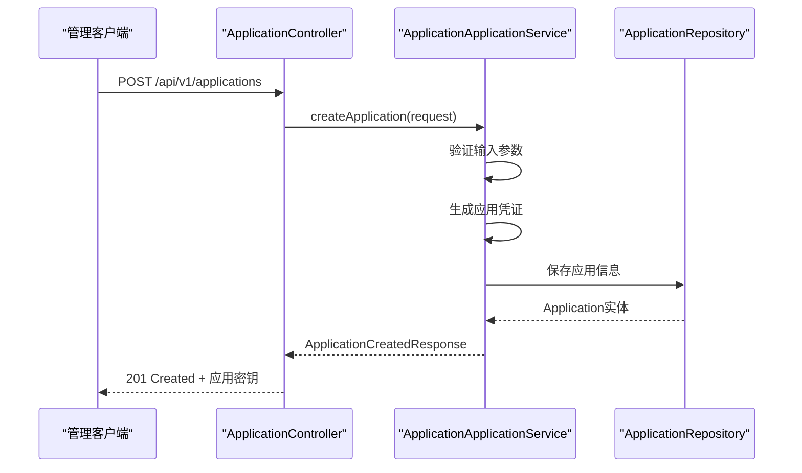
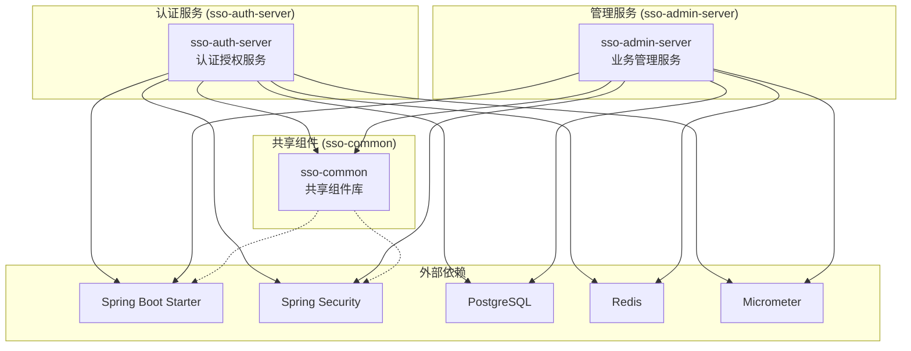

# 核心模块

<cite>
**本文引用的文件**
- [SsoAuthServerApplication.java](file://sso-auth-server/src/main/java/sso/oidc/auth/SsoAuthServerApplication.java)
- [SsoAdminServerApplication.java](file://sso-admin-server/src/main/java/sso/oidc/admin/SsoAdminServerApplication.java)
- [ApiResponse.java](file://sso-common/src/main/java/sso/oidc/common/api/ApiResponse.java)
- [CreateApplicationRequest.java](file://sso-common/src/main/java/sso/oidc/common/dto/request/CreateApplicationRequest.java)
- [AppType.java](file://sso-common/src/main/java/sso/oidc/common/model/enums/AppType.java)
- [ApplicationApplicationService.java](file://sso-admin-server/src/main/java/sso/oidc/admin/application/service/ApplicationApplicationService.java)
- [AuthenticationApplicationService.java](file://sso-auth-server/src/main/java/sso/oidc/auth/application/service/AuthenticationApplicationService.java)
- [AuthenticationController.java](file://sso-auth-server/src/main/java/sso/oidc/auth/interfaces/rest/AuthenticationController.java)
- [ApplicationController.java](file://sso-admin-server/src/main/java/sso/oidc/admin/interfaces/rest/ApplicationController.java)
- [pom.xml](file://sso-auth-server/pom.xml)
- [pom.xml](file://sso-admin-server/pom.xml)
- [pom.xml](file://sso-common/pom.xml)
</cite>

## 更新摘要
**所做更改**
- 更新了模块架构说明，从单体应用重构为三个独立模块
- 新增了模块职责划分和依赖关系说明
- 更新了核心组件分析，反映新的模块化架构
- 增加了模块间通信和集成方案
- 更新了部署和运维相关的架构图

## 目录
1. [简介](#简介)
2. [模块架构总览](#模块架构总览)
3. [模块划分与职责](#模块划分与职责)
4. [核心组件分析](#核心组件分析)
5. [模块间协作机制](#模块间协作机制)
6. [依赖关系分析](#依赖关系分析)
7. [性能考量](#性能考量)
8. [故障排查指南](#故障排查指南)
9. [结论](#结论)
10. [附录](#附录)

## 简介
本文件面向IAM Platform认证服务重构后的核心模块架构，系统性梳理从单体应用拆分为三个独立模块的设计与实现。重构后的架构包括sso-auth-server（认证授权服务）、sso-admin-server（业务管理服务）和sso-common（共享组件库）三大模块，每个模块承担明确的职责边界，通过标准化的API和共享组件实现松耦合协作。

## 模块架构总览
系统采用三层模块化架构设计，实现了关注点分离和职责明确化：



**图表来源**
- [SsoAuthServerApplication.java:1-17](file://sso-auth-server/src/main/java/sso/oidc/auth/SsoAuthServerApplication.java#L1-L17)
- [SsoAdminServerApplication.java:1-17](file://sso-admin-server/src/main/java/sso/oidc/admin/SsoAdminServerApplication.java#L1-L17)
- [ApiResponse.java:1-61](file://sso-common/src/main/java/sso/oidc/common/api/ApiResponse.java#L1-L61)

## 模块划分与职责

### sso-auth-server（认证授权服务）
**核心职责**
- 提供OAuth2.0/OIDC协议认证授权能力
- 处理用户身份验证和会话管理
- 实现多协议适配（OIDC、SAML、CAS）
- 管理租户上下文和权限体系
- 提供统一的认证管道和安全策略

**技术特点**
- 基于Spring Security OAuth2 Authorization Server
- 支持多种认证策略（密码、短信、邮箱、LDAP等）
- 内置租户解析和权限加载机制
- 提供认证成功/失败处理器

### sso-admin-server（业务管理服务）
**核心职责**
- 管理应用、用户、角色、权限等业务实体
- 提供业务CRUD操作和管理界面
- 实现审计日志和操作追踪
- 管理多租户组织架构
- 提供业务统计和概览功能

**技术特点**
- 基于Spring Boot的企业级管理服务
- 集成OpenAPI文档和审计切面
- 支持Flyway数据库迁移
- 提供丰富的业务API接口

### sso-common（共享组件库）
**核心职责**
- 提供统一的数据传输对象(DTO)
- 定义业务枚举和值对象
- 封装通用的响应格式
- 定义异常体系和业务规则
- 提供工具类和校验注解

**技术特点**
- 轻量级无状态设计
- 无Spring依赖，纯Java实现
- 标准化的数据模型定义
- 可复用的业务组件

**章节来源**
- [SsoAuthServerApplication.java:1-17](file://sso-auth-server/src/main/java/sso/oidc/auth/SsoAuthServerApplication.java#L1-L17)
- [SsoAdminServerApplication.java:1-17](file://sso-admin-server/src/main/java/sso/oidc/admin/SsoAdminServerApplication.java#L1-L17)
- [ApiResponse.java:1-61](file://sso-common/src/main/java/sso/oidc/common/api/ApiResponse.java#L1-L61)

## 核心组件分析

### 认证授权模块（sso-auth-server）

#### 认证应用服务
**业务职责**
- 完成用户认证后的后续处理
- 管理租户选择和上下文切换
- 加载用户权限和角色信息
- 构建认证结果和会话状态

**关键流程（租户选择）**


**图表来源**
- [AuthenticationApplicationService.java:51-111](file://sso-auth-server/src/main/java/sso/oidc/auth/application/service/AuthenticationApplicationService.java#L51-L111)

#### 认证控制器
**API接口**
- POST /oauth2/token：标准OAuth2令牌获取
- GET /login：认证页面访问
- POST /logout：用户登出处理
- GET /tenants：获取可用租户列表

### 业务管理模块（sso-admin-server）

#### 应用管理服务
**业务职责**
- 管理应用注册和配置
- 处理应用密钥轮换
- 管理应用权限和状态
- 提供应用统计和概览

**关键流程（应用创建）**


**图表来源**
- [ApplicationController.java:38-45](file://sso-admin-server/src/main/java/sso/oidc/admin/interfaces/rest/ApplicationController.java#L38-L45)
- [ApplicationApplicationService.java:37-62](file://sso-admin-server/src/main/java/sso/oidc/admin/application/service/ApplicationApplicationService.java#L37-L62)

**API接口**
- POST /api/v1/applications：创建应用
- GET /api/v1/applications/{id}：按ID查询应用
- PUT /api/v1/applications/{id}：更新应用
- DELETE /api/v1/applications/{id}：删除应用
- POST /api/v1/applications/{id}/rotate-secret：轮换应用密钥

#### 共享组件（sso-common）

**统一响应封装**
```java
public class ApiResponse<T> {
    private int code;
    private String message;
    private T data;
    private List<FieldError> errors;
    private String timestamp;
    
    public static <T> ApiResponse<T> success(T data) { ... }
    public static <T> ApiResponse<T> created(T data) { ... }
    public static <T> ApiResponse<T> error(int code, String message, List<FieldError> errors) { ... }
}
```

**数据传输对象**
- CreateApplicationRequest：应用创建请求
- ApplicationResponse：应用响应数据
- TenantAccountResponse：租户账户响应
- 各种枚举类型和值对象

**章节来源**
- [AuthenticationApplicationService.java:1-139](file://sso-auth-server/src/main/java/sso/oidc/auth/application/service/AuthenticationApplicationService.java#L1-L139)
- [ApplicationApplicationService.java:1-255](file://sso-admin-server/src/main/java/sso/oidc/admin/application/service/ApplicationApplicationService.java#L1-L255)
- [ApplicationController.java:1-139](file://sso-admin-server/src/main/java/sso/oidc/admin/interfaces/rest/ApplicationController.java#L1-L139)
- [ApiResponse.java:1-61](file://sso-common/src/main/java/sso/oidc/common/api/ApiResponse.java#L1-L61)
- [CreateApplicationRequest.java:1-44](file://sso-common/src/main/java/sso/oidc/common/dto/request/CreateApplicationRequest.java#L1-L44)

## 模块间协作机制

### 依赖关系架构
重构后的模块间依赖关系呈现清晰的层次化设计：



**图表来源**
- [pom.xml:18-140](file://sso-auth-server/pom.xml#L18-L140)
- [pom.xml:18-144](file://sso-admin-server/pom.xml#L18-L144)
- [pom.xml:18-47](file://sso-common/pom.xml#L18-L47)

### 数据模型与仓储
**实体模型**
- Application：应用信息和OAuth2配置
- TenantAccount：租户账户关联
- Person：用户基本信息
- Role/Permission：权限和角色体系
- AuditLog：审计日志记录

**仓储接口**
- ApplicationRepository：应用数据访问
- TenantAccountRepository：租户账户访问
- PersonRepository：用户信息访问
- RoleRepository/PermissionRepository：权限数据访问

### 安全与配置
**认证服务配置**
- OIDC授权服务器配置
- JWK密钥管理和JWT解码
- 多协议适配器（OIDC/SAML/CAS）
- 租户上下文管理和权限加载

**管理服务配置**
- OpenAPI文档生成
- 审计日志切面
- 权限拦截和校验
- 多租户上下文过滤

**章节来源**
- [pom.xml:1-154](file://sso-auth-server/pom.xml#L1-L154)
- [pom.xml:1-144](file://sso-admin-server/pom.xml#L1-L144)
- [pom.xml:1-47](file://sso-common/pom.xml#L1-L47)

## 依赖关系分析

### 模块依赖矩阵
| 依赖方 | 依赖类型 | 被依赖方 | 用途 |
|--------|----------|----------|------|
| sso-auth-server | compile | sso-common | 共享DTO和枚举 |
| sso-admin-server | compile | sso-common | 共享业务模型 |
| sso-auth-server | runtime | spring-security-oauth2-authorization-server | OIDC协议支持 |
| sso-admin-server | runtime | flyway-core | 数据库迁移 |
| 两个服务 | compile | spring-boot-starter-data-jpa | ORM框架 |
| 两个服务 | compile | spring-boot-starter-data-redis | 缓存支持 |

### 外部依赖分析
**核心框架依赖**
- Spring Boot 3.x：模块化应用基础
- Spring Security：安全框架和OAuth2支持
- PostgreSQL：主数据库存储
- Redis：会话和缓存存储

**监控和可观测性**
- Micrometer：指标收集
- Prometheus：指标导出
- Brave/Zipkin：分布式追踪

**章节来源**
- [pom.xml:58-67](file://sso-auth-server/pom.xml#L58-L67)
- [pom.xml:72-74](file://sso-admin-server/pom.xml#L72-L74)

## 性能考量

### 模块化性能优势
**资源隔离**
- 每个模块独立部署，资源使用相互隔离
- 可针对不同模块进行独立的性能优化
- 降低单点故障影响范围

**缓存策略**
- Redis集群支持高并发访问
- 模块内缓存与全局缓存分离
- 针对热点数据制定差异化缓存策略

**数据库优化**
- 读写分离支持
- 连接池参数按模块调优
- 索引和查询优化针对具体模块

### 监控和观测
**指标收集**
- 每个模块独立的健康检查端点
- 自定义业务指标和系统指标
- 分布式追踪链路完整

**性能监控**
- 响应时间和服务可用性监控
- 错误率和异常监控
- 资源使用情况监控

## 故障排查指南

### 模块化故障定位
**认证服务问题**
- OIDC端点不可用：检查Authorization Server配置
- 用户认证失败：验证租户解析和权限加载
- 令牌签发异常：检查JWK配置和密钥管理

**管理服务问题**
- 应用管理API异常：验证DTO转换和业务逻辑
- 数据库迁移失败：检查Flyway配置和SQL脚本
- 审计日志缺失：确认AOP切面配置

**共享组件问题**
- DTO序列化异常：检查Jackson配置和注解
- 枚举转换错误：验证枚举定义和转换逻辑
- 异常处理不一致：确认异常基类和处理策略

### 诊断工具
**日志分析**
- 模块化日志输出，便于问题定位
- 结构化日志格式，支持集中式日志管理
- 关键操作审计日志

**监控告警**
- 基础设施监控：CPU、内存、磁盘、网络
- 应用性能监控：响应时间、吞吐量、错误率
- 业务指标监控：用户数、应用数、认证次数

## 结论
重构后的三模块架构实现了清晰的职责分离和良好的扩展性。sso-auth-server专注于认证授权的核心能力，sso-admin-server提供全面的业务管理功能，sso-common通过标准化组件提升开发效率和一致性。这种架构设计不仅提高了系统的可维护性和可扩展性，还为未来的功能扩展和技术演进奠定了坚实基础。

## 附录

### 配置管理
**模块特定配置**
- 认证服务：OIDC配置、JWK设置、租户策略
- 管理服务：OpenAPI配置、审计设置、Flyway配置
- 共享组件：通用配置、校验规则、国际化设置

**环境配置**
- 开发环境：本地数据库和Redis
- 测试环境：测试数据库和模拟服务
- 生产环境：高可用数据库和缓存集群

### 部署策略
**容器化部署**
- Docker镜像构建和版本管理
- Kubernetes部署配置和扩缩容策略
- 滚动更新和蓝绿部署

**监控和运维**
- 日志聚合和分析
- 健康检查和自动恢复
- 性能监控和告警机制

### 最佳实践
**开发规范**
- 模块间接口契约定义
- 共享组件使用规范
- 异常处理和错误码约定

**安全实践**
- 最小权限原则
- 输入验证和输出编码
- 审计日志和合规要求

**章节来源**
- [pom.xml:1-154](file://sso-auth-server/pom.xml#L1-L154)
- [pom.xml:1-144](file://sso-admin-server/pom.xml#L1-L144)
- [pom.xml:1-47](file://sso-common/pom.xml#L1-L47)