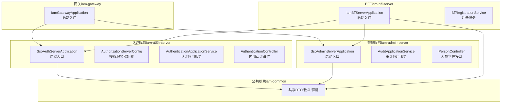
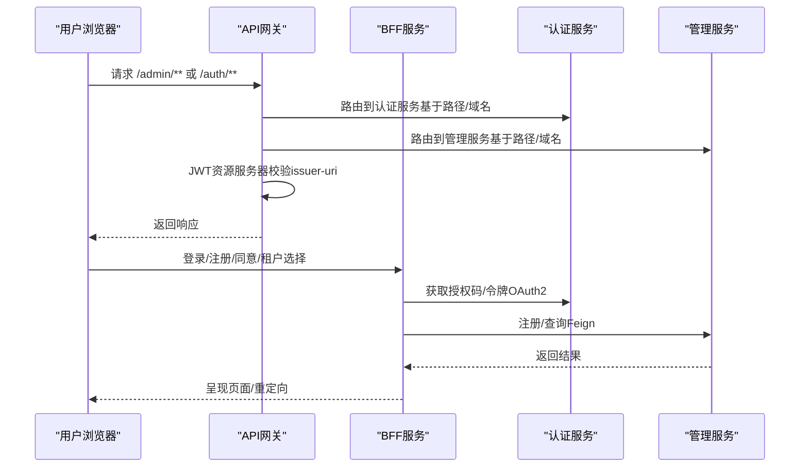
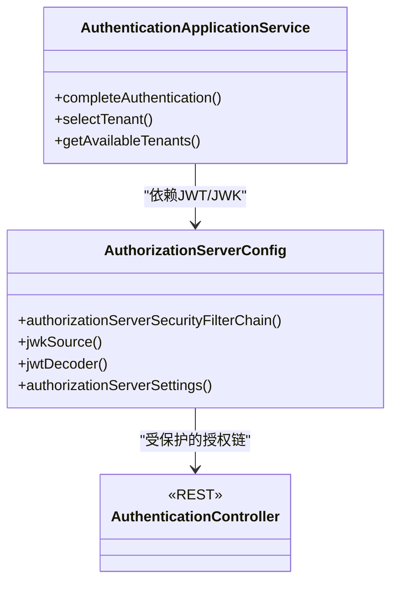
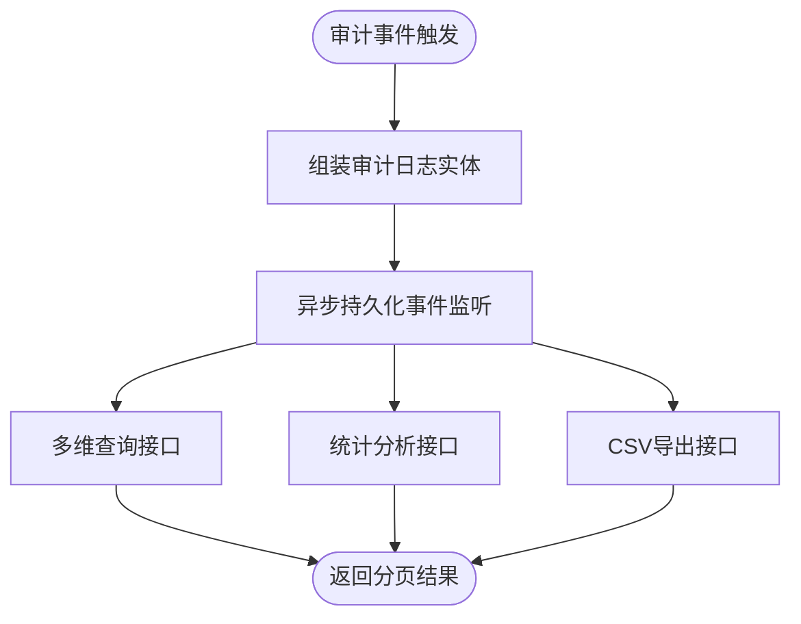
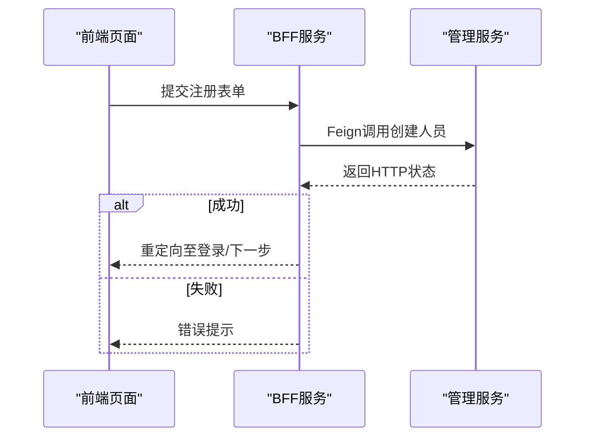
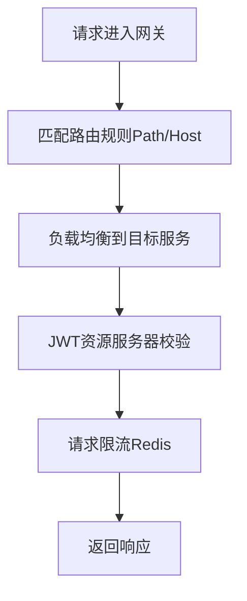
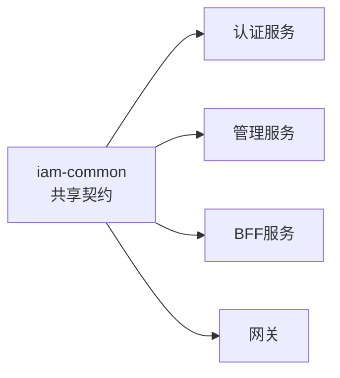
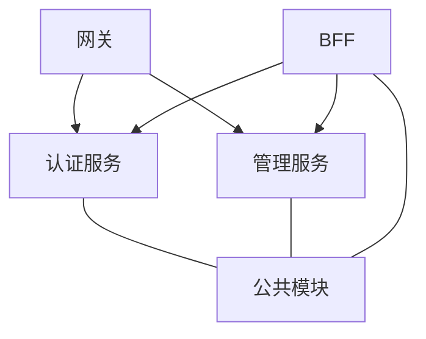

# 核心模块

<cite>
**本文引用的文件**   
- [SsoAuthServerApplication.java](file://iam-auth-server/src/main/java/iam/platform/auth/SsoAuthServerApplication.java)
- [application.yml（认证服务）](file://iam-auth-server/src/main/resources/application.yml)
- [AuthorizationServerConfig.java](file://iam-auth-server/src/main/java/iam/platform/auth/infrastructure/config/AuthorizationServerConfig.java)
- [AuthenticationApplicationService.java](file://iam-auth-server/src/main/java/iam/platform/auth/application/service/AuthenticationApplicationService.java)
- [AuthenticationController.java](file://iam-auth-server/src/main/java/iam/platform/auth/interfaces/rest/AuthenticationController.java)
- [SsoAdminServerApplication.java](file://iam-admin-server/src/main/java/iam/platform/admin/SsoAdminServerApplication.java)
- [application.yml（管理服务）](file://iam-admin-server/src/main/resources/application.yml)
- [AuditApplicationService.java](file://iam-admin-server/src/main/java/iam/platform/admin/application/service/AuditApplicationService.java)
- [PersonController.java](file://iam-admin-server/src/main/java/iam/platform/admin/interfaces/rest/PersonController.java)
- [IamBffServerApplication.java](file://iam-bff-server/src/main/java/iam/platform/bff/IamBffServerApplication.java)
- [application.yml（BFF）](file://iam-bff-server/src/main/resources/application.yml)
- [BffRegistrationService.java](file://iam-bff-server/src/main/java/iam/platform/bff/application/service/BffRegistrationService.java)
- [IamGatewayApplication.java](file://iam-gateway/src/main/java/iam/platform/gateway/IamGatewayApplication.java)
- [application.yml（网关）](file://iam-gateway/src/main/resources/application.yml)
- [iam-common（公共模块）](file://iam-common/pom.xml)
- [AuditEventType.java](file://iam-common/src/main/java/iam/platform/common/model/enums/AuditEventType.java)
- [CreatePersonRequest.java](file://iam-common/src/main/java/iam/platform/common/dto/request/CreatePersonRequest.java)
</cite>

## 目录
1. [引言](#引言)
2. [项目结构](#项目结构)
3. [核心组件](#核心组件)
4. [架构总览](#架构总览)
5. [详细组件分析](#详细组件分析)
6. [依赖分析](#依赖分析)
7. [性能考虑](#性能考虑)
8. [故障排查指南](#故障排查指南)
9. [结论](#结论)
10. [附录](#附录)

## 引言
本文件面向IAM平台核心模块的综合技术文档，覆盖以下目标：
- 认证服务器（iam-auth-server）：基于Spring Authorization Server的OAuth2/OIDC实现、多协议适配（CAS/SAML）、租户上下文与会话管理、安全策略与限流。
- 管理服务器（iam-admin-server）：用户与组织管理、角色与权限分配、审计日志系统、OpenAPI文档与异步审计。
- 前端代理服务器（iam-bff-server）：BFF模式的前端集成、统一登录/注册/选择租户流程、与后端服务的Feign调用。
- API网关（iam-gateway）：基于Spring Cloud Gateway的路由、跨域、JWT资源服务器校验、请求限流与负载均衡。
- 通用模块（iam-common）：共享DTO、枚举、异常与工具类，支撑跨服务契约一致性。

## 项目结构
平台采用多模块分层架构，每个服务独立运行，通过配置中心/注册中心与网关协同工作。公共模块提供共享契约与基础设施能力。

**图表来源**
- [SsoAuthServerApplication.java:1-19](file://iam-auth-server/src/main/java/iam/platform/auth/SsoAuthServerApplication.java#L1-L19)
- [AuthorizationServerConfig.java:1-130](file://iam-auth-server/src/main/java/iam/platform/auth/infrastructure/config/AuthorizationServerConfig.java#L1-L130)
- [AuthenticationApplicationService.java:24-138](file://iam-auth-server/src/main/java/iam/platform/auth/application/service/AuthenticationApplicationService.java#L24-L138)
- [AuthenticationController.java:1-47](file://iam-auth-server/src/main/java/iam/platform/auth/interfaces/rest/AuthenticationController.java#L1-L47)
- [SsoAdminServerApplication.java:1-17](file://iam-admin-server/src/main/java/iam/platform/admin/SsoAdminServerApplication.java#L1-L17)
- [AuditApplicationService.java:27-216](file://iam-admin-server/src/main/java/iam/platform/admin/application/service/AuditApplicationService.java#L27-L216)
- [PersonController.java:1-68](file://iam-admin-server/src/main/java/iam/platform/admin/interfaces/rest/PersonController.java#L1-L68)
- [IamBffServerApplication.java:1-17](file://iam-bff-server/src/main/java/iam/platform/bff/IamBffServerApplication.java#L1-L17)
- [BffRegistrationService.java:13-30](file://iam-bff-server/src/main/java/iam/platform/bff/application/service/BffRegistrationService.java#L13-L30)
- [IamGatewayApplication.java:1-15](file://iam-gateway/src/main/java/iam/platform/gateway/IamGatewayApplication.java#L1-L15)
- [iam-common（公共模块）:1-47](file://iam-common/pom.xml#L1-L47)

**章节来源**
- [SsoAuthServerApplication.java:1-19](file://iam-auth-server/src/main/java/iam/platform/auth/SsoAuthServerApplication.java#L1-L19)
- [SsoAdminServerApplication.java:1-17](file://iam-admin-server/src/main/java/iam/platform/admin/SsoAdminServerApplication.java#L1-L17)
- [IamBffServerApplication.java:1-17](file://iam-bff-server/src/main/java/iam/platform/bff/IamBffServerApplication.java#L1-L17)
- [IamGatewayApplication.java:1-15](file://iam-gateway/src/main/java/iam/platform/gateway/IamGatewayApplication.java#L1-L15)
- [iam-common（公共模块）:1-47](file://iam-common/pom.xml#L1-L47)

## 核心组件
- 认证服务器（iam-auth-server）
  - 职责：OAuth2/OIDC授权、CAS/SAML适配、租户感知认证、会话与JWK管理、安全策略与限流。
  - 关键实现：授权服务器配置、认证应用服务、统一认证成功处理器集成的后置流水线。
- 管理服务器（iam-admin-server）
  - 职责：人员、组织、角色、权限等实体管理；审计日志的异步入库、查询、统计与导出。
  - 关键实现：审计应用服务、人员控制器、异步审计切面与配置。
- 前端代理服务器（iam-bff-server）
  - 职责：前端登录/注册/同意页/租户选择的BFF封装；通过Feign调用管理与认证服务。
  - 关键实现：BFF注册服务、前端模板与控制器。
- API网关（iam-gateway）
  - 职责：基于路径/域名的路由、全局CORS、JWT资源服务器校验、请求限流与负载均衡。
  - 关键实现：路由规则、全局跨域配置、JWT issuer配置、Redis限流器。
- 通用模块（iam-common）
  - 职责：共享数据传输对象、枚举、异常与工具类，统一契约与验证注解。
  - 关键实现：DTO、枚举、异常与Jackson/Lombok依赖声明。

**章节来源**
- [AuthorizationServerConfig.java:1-130](file://iam-auth-server/src/main/java/iam/platform/auth/infrastructure/config/AuthorizationServerConfig.java#L1-L130)
- [AuthenticationApplicationService.java:24-138](file://iam-auth-server/src/main/java/iam/platform/auth/application/service/AuthenticationApplicationService.java#L24-L138)
- [AuditApplicationService.java:27-216](file://iam-admin-server/src/main/java/iam/platform/admin/application/service/AuditApplicationService.java#L27-L216)
- [PersonController.java:1-68](file://iam-admin-server/src/main/java/iam/platform/admin/interfaces/rest/PersonController.java#L1-L68)
- [BffRegistrationService.java:13-30](file://iam-bff-server/src/main/java/iam/platform/bff/application/service/BffRegistrationService.java#L13-L30)
- [application.yml（网关）:1-116](file://iam-gateway/src/main/resources/application.yml#L1-L116)
- [iam-common（公共模块）:1-47](file://iam-common/pom.xml#L1-L47)

## 架构总览
下图展示从网关到各服务的调用链路、鉴权与会话流转，以及BFF对前端的聚合。

**图表来源**
- [application.yml（网关）:18-54](file://iam-gateway/src/main/resources/application.yml#L18-L54)
- [application.yml（认证服务）:52-64](file://iam-auth-server/src/main/resources/application.yml#L52-L64)
- [application.yml（管理服务）:52-64](file://iam-admin-server/src/main/resources/application.yml#L52-L64)
- [BffRegistrationService.java:13-30](file://iam-bff-server/src/main/java/iam/platform/bff/application/service/BffRegistrationService.java#L13-L30)

## 详细组件分析

### 认证服务器（iam-auth-server）
- 启动与扫描
  - 扫描配置属性包、启用JPA仓库、开启Feign客户端，便于与管理服务交互。
- 授权服务器配置
  - 集成Spring Authorization Server默认安全策略，启用OIDC，配置JWT解码器与JWK源。
  - 自定义KeyID生成策略，保证重启后JWKS缓存稳定。
- 认证应用服务
  - 完成认证后置流水线执行；选择租户账户并建立带租户上下文的认证令牌；维护会话中的租户信息。
- 内部认证接口
  - 明确不直接处理OAuth2密码模式，统一走标准授权服务器端点，保障安全与一致性。

**图表来源**
- [AuthorizationServerConfig.java:36-130](file://iam-auth-server/src/main/java/iam/platform/auth/infrastructure/config/AuthorizationServerConfig.java#L36-L130)
- [AuthenticationApplicationService.java:24-138](file://iam-auth-server/src/main/java/iam/platform/auth/application/service/AuthenticationApplicationService.java#L24-L138)
- [AuthenticationController.java:1-47](file://iam-auth-server/src/main/java/iam/platform/auth/interfaces/rest/AuthenticationController.java#L1-L47)

**章节来源**
- [SsoAuthServerApplication.java:1-19](file://iam-auth-server/src/main/java/iam/platform/auth/SsoAuthServerApplication.java#L1-L19)
- [AuthorizationServerConfig.java:1-130](file://iam-auth-server/src/main/java/iam/platform/auth/infrastructure/config/AuthorizationServerConfig.java#L1-L130)
- [AuthenticationApplicationService.java:24-138](file://iam-auth-server/src/main/java/iam/platform/auth/application/service/AuthenticationApplicationService.java#L24-L138)
- [AuthenticationController.java:1-47](file://iam-auth-server/src/main/java/iam/platform/auth/interfaces/rest/AuthenticationController.java#L1-L47)

### 管理服务器（iam-admin-server）
- 启动与扫描
  - 扫描配置属性包、启用JPA仓库，Flyway迁移启用。
- 审计日志系统
  - 异步事件监听持久化审计日志；支持按租户、人员、事件类型、资源、时间范围查询；统计分析与CSV导出。
- 人员管理接口
  - 提供创建、查询、更新、删除人员的REST接口，配合OpenAPI文档。

**图表来源**
- [AuditApplicationService.java:27-216](file://iam-admin-server/src/main/java/iam/platform/admin/application/service/AuditApplicationService.java#L27-L216)

**章节来源**
- [SsoAdminServerApplication.java:1-17](file://iam-admin-server/src/main/java/iam/platform/admin/SsoAdminServerApplication.java#L1-L17)
- [AuditApplicationService.java:27-216](file://iam-admin-server/src/main/java/iam/platform/admin/application/service/AuditApplicationService.java#L27-L216)
- [PersonController.java:1-68](file://iam-admin-server/src/main/java/iam/platform/admin/interfaces/rest/PersonController.java#L1-L68)

### 前端代理服务器（iam-bff-server）
- 启动与发现
  - 开启服务发现与Feign客户端，用于调用认证与管理服务。
- BFF注册服务
  - 封装前端注册流程，调用管理服务创建人员，失败时抛出运行时异常。
- 前端模板与控制器
  - 提供登录、注册、同意、租户选择等页面模板与控制器，统一前端体验。

**图表来源**
- [BffRegistrationService.java:13-30](file://iam-bff-server/src/main/java/iam/platform/bff/application/service/BffRegistrationService.java#L13-L30)
- [application.yml（BFF）:25-32](file://iam-bff-server/src/main/resources/application.yml#L25-L32)

**章节来源**
- [IamBffServerApplication.java:1-17](file://iam-bff-server/src/main/java/iam/platform/bff/IamBffServerApplication.java#L1-L17)
- [BffRegistrationService.java:13-30](file://iam-bff-server/src/main/java/iam/platform/bff/application/service/BffRegistrationService.java#L13-L30)
- [application.yml（BFF）:1-54](file://iam-bff-server/src/main/resources/application.yml#L1-L54)

### API网关（iam-gateway）
- 路由与负载均衡
  - 基于路径与域名的路由规则，结合Ribbon负载均衡lb://服务名。
- 全局跨域
  - 配置允许的方法、头、凭据与缓存时间，满足前端跨域需求。
- 安全与限流
  - 配置JWT资源服务器issuer-uri进行令牌校验；为不同路由设置Redis限流参数。
- 服务发现
  - 开启服务发现，与注册中心联动。

**图表来源**
- [application.yml（网关）:18-54](file://iam-gateway/src/main/resources/application.yml#L18-L54)
- [application.yml（网关）:90-92](file://iam-gateway/src/main/resources/application.yml#L90-L92)

**章节来源**
- [IamGatewayApplication.java:1-15](file://iam-gateway/src/main/java/iam/platform/gateway/IamGatewayApplication.java#L1-L15)
- [application.yml（网关）:1-116](file://iam-gateway/src/main/resources/application.yml#L1-L116)

### 通用模块（iam-common）
- 作用
  - 提供共享的DTO、枚举、异常与工具类，统一前后端契约与验证约束。
- 依赖
  - Lombok、Jakarta Validation API、Jackson注解，减少样板代码与提升序列化一致性。

**图表来源**
- [iam-common（公共模块）:18-36](file://iam-common/pom.xml#L18-L36)

**章节来源**
- [iam-common（公共模块）:1-47](file://iam-common/pom.xml#L1-L47)
- [AuditEventType.java:1-59](file://iam-common/src/main/java/iam/platform/common/model/enums/AuditEventType.java#L1-L59)
- [CreatePersonRequest.java:1-37](file://iam-common/src/main/java/iam/platform/common/dto/request/CreatePersonRequest.java#L1-L37)

## 依赖分析
- 模块间耦合
  - 网关依赖注册中心与Redis（限流），BFF依赖管理与认证服务（Feign），认证与管理服务依赖数据库与Redis（会话/缓存）。
- 数据交换
  - BFF通过Feign调用管理服务；网关转发请求至认证/管理服务；认证服务与管理服务共享公共模块契约。
- 集成策略
  - OAuth2/OIDC统一在认证服务完成；网关负责路由与安全前置；BFF负责前端体验与业务编排。

**图表来源**
- [application.yml（网关）:18-54](file://iam-gateway/src/main/resources/application.yml#L18-L54)
- [application.yml（认证服务）:10-14](file://iam-auth-server/src/main/resources/application.yml#L10-L14)
- [application.yml（管理服务）:10-14](file://iam-admin-server/src/main/resources/application.yml#L10-L14)
- [iam-common（公共模块）:18-36](file://iam-common/pom.xml#L18-L36)

**章节来源**
- [application.yml（网关）:1-116](file://iam-gateway/src/main/resources/application.yml#L1-L116)
- [application.yml（认证服务）:1-144](file://iam-auth-server/src/main/resources/application.yml#L1-L144)
- [application.yml（管理服务）:1-102](file://iam-admin-server/src/main/resources/application.yml#L1-L102)
- [application.yml（BFF）:1-54](file://iam-bff-server/src/main/resources/application.yml#L1-L54)
- [iam-common（公共模块）:1-47](file://iam-common/pom.xml#L1-L47)

## 性能考虑
- 连接池与超时
  - 认证/管理服务使用Hikari连接池参数控制最大池大小、空闲与生命周期；BFF的Feign客户端配置连接与读取超时。
- 会话与缓存
  - 认证/管理服务使用Redis存储会话与缓存；建议独立Redis实例或命名空间隔离。
- 限流与降级
  - 网关为不同路由配置Redis限流参数；认证服务启用速率限制与账户锁定策略。
- 监控与追踪
  - 暴露健康、指标与Prometheus端点；Zipkin采样概率1.0，便于问题定位。

**章节来源**
- [application.yml（认证服务）:15-24](file://iam-auth-server/src/main/resources/application.yml#L15-L24)
- [application.yml（认证服务）:90-102](file://iam-auth-server/src/main/resources/application.yml#L90-L102)
- [application.yml（管理服务）:19-24](file://iam-admin-server/src/main/resources/application.yml#L19-L24)
- [application.yml（BFF）:25-32](file://iam-bff-server/src/main/resources/application.yml#L25-L32)
- [application.yml（网关）:24-41](file://iam-gateway/src/main/resources/application.yml#L24-L41)
- [application.yml（网关）:93-108](file://iam-gateway/src/main/resources/application.yml#L93-L108)

## 故障排查指南
- 认证失败/令牌无效
  - 检查授权服务器issuer-uri与网关JWT issuer-uri是否一致；确认JWK私钥/公钥位置与KeyID生成策略。
- 会话丢失/租户未选中
  - 检查Redis会话配置与命名空间；确认选择租户后会话中是否写入租户ID。
- 审计日志未入库
  - 检查审计异步配置与线程池参数；确认事件监听是否正常触发。
- 跨域问题
  - 检查网关全局CORS配置，确认允许的方法、头与凭据。
- 注册失败
  - 检查BFF到管理服务的Feign调用状态码与网络连通性。

**章节来源**
- [AuthorizationServerConfig.java:95-128](file://iam-auth-server/src/main/java/iam/platform/auth/infrastructure/config/AuthorizationServerConfig.java#L95-L128)
- [application.yml（网关）:55-68](file://iam-gateway/src/main/resources/application.yml#L55-L68)
- [AuditApplicationService.java:38-48](file://iam-admin-server/src/main/java/iam/platform/admin/application/service/AuditApplicationService.java#L38-L48)
- [BffRegistrationService.java:23-29](file://iam-bff-server/src/main/java/iam/platform/bff/application/service/BffRegistrationService.java#L23-L29)

## 结论
本平台以“网关+BFF+认证/管理服务”的分层架构实现统一认证与权限治理，通过公共模块统一契约，借助OAuth2/OIDC与JWT实现安全与可扩展性。认证服务专注授权与会话，管理服务专注实体与审计，BFF负责前端体验与编排，网关注入路由、跨域与安全前置。建议在生产环境完善注册中心、密钥轮换、审计保留策略与监控告警体系。

## 附录
- 配置要点速览
  - 认证服务：数据库、Redis、JWK、安全策略、CAS/SAML、审计与管理端点。
  - 管理服务：Flyway迁移、OpenAPI、审计异步配置、加密密钥。
  - BFF：Thymeleaf模板、Feign超时、管理端点。
  - 网关：路由规则、CORS、JWT issuer、Redis限流、管理端点。
- 扩展点与自定义
  - 新增认证策略：扩展认证流水线与适配器。
  - 新增审计事件：定义事件类型枚举与监听器。
  - 新增路由：在网关配置新增路由与过滤器。
  - 新增BFF页面：在BFF控制器与模板中添加新页面与调用。