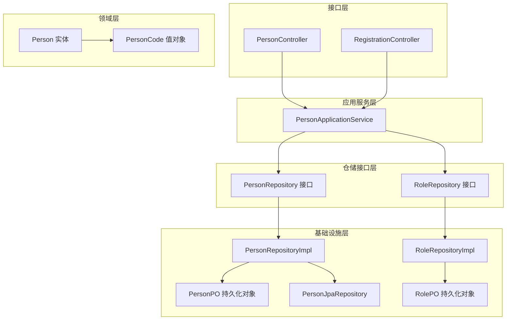
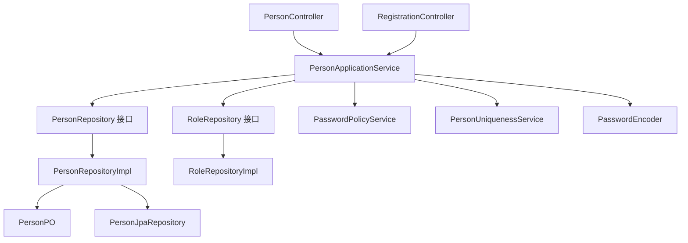
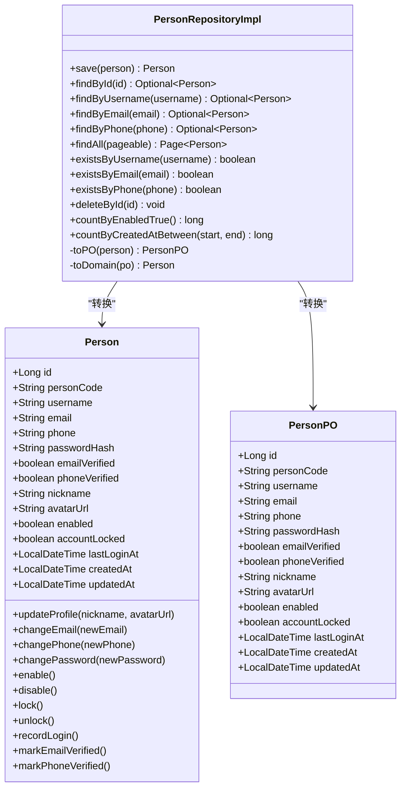
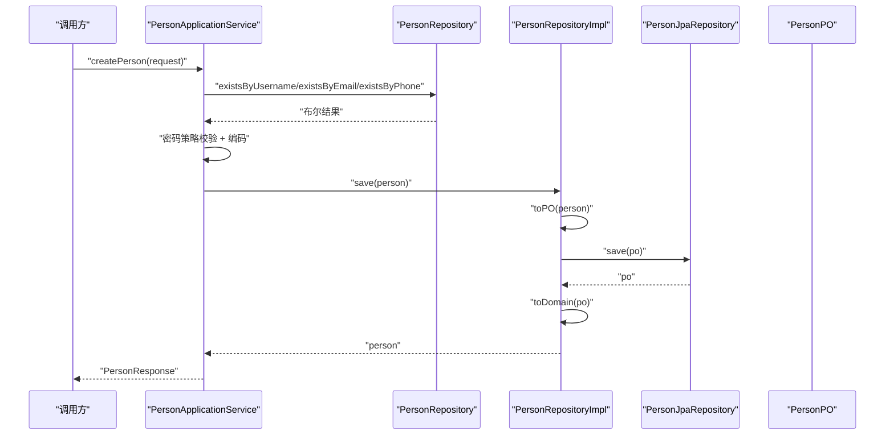
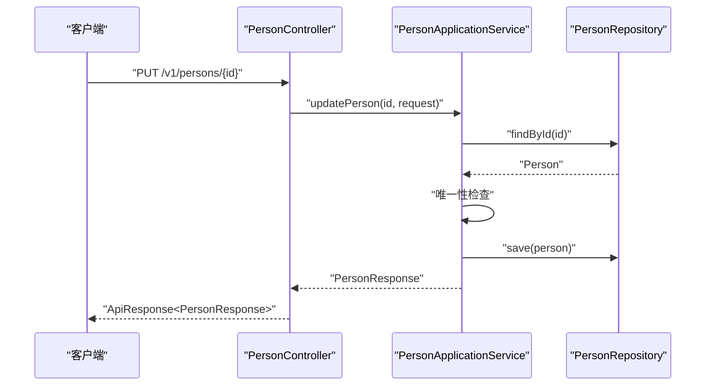
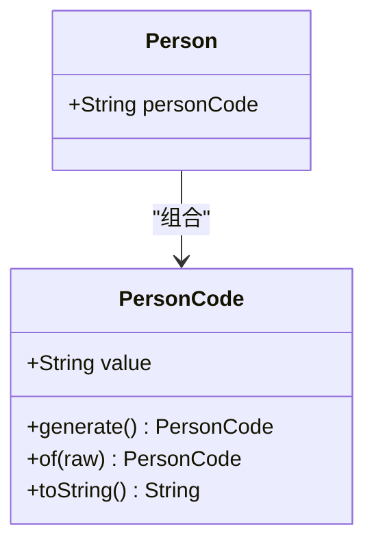
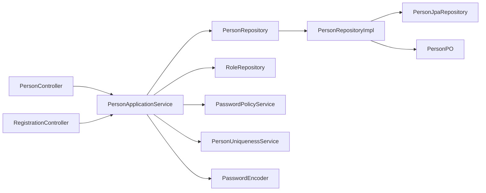

# 人员管理系统

<cite>
**本文引用的文件**
- [Person.java](file://src/main/java/sso/oidc/domain/model/entity/Person.java)
- [PersonPO.java](file://src/main/java/sso/oidc/infrastructure/persistence/entity/PersonPO.java)
- [PersonRepository.java](file://src/main/java/sso/oidc/domain/repository/PersonRepository.java)
- [PersonRepositoryImpl.java](file://src/main/java/sso/oidc/infrastructure/persistence/impl/PersonRepositoryImpl.java)
- [PersonApplicationService.java](file://src/main/java/sso/oidc/application/service/PersonApplicationService.java)
- [PersonController.java](file://src/main/java/sso/oidc/interfaces/rest/PersonController.java)
- [CreatePersonRequest.java](file://src/main/java/sso/oidc/application/dto/request/CreatePersonRequest.java)
- [UpdatePersonRequest.java](file://src/main/java/sso/oidc/application/dto/request/UpdatePersonRequest.java)
- [PersonResponse.java](file://src/main/java/sso/oidc/application/dto/response/PersonResponse.java)
- [PersonCode.java](file://src/main/java/sso/oidc/domain/model/valueobject/PersonCode.java)
- [PersonNotFoundException.java](file://src/main/java/sso/oidc/domain/model/exception/PersonNotFoundException.java)
- [PersonJpaRepository.java](file://src/main/java/sso/oidc/infrastructure/persistence/repository/PersonJpaRepository.java)
- [RegistrationController.java](file://src/main/java/sso/oidc/interfaces/web/RegistrationController.java)
- [register.html](file://src/main/resources/templates/register.html)
- [ApiResponse.java](file://src/main/java/sso/oidc/interfaces/rest/common/ApiResponse.java)
- [GlobalExceptionHandler.java](file://src/main/java/sso/oidc/interfaces/rest/common/GlobalExceptionHandler.java)
- [PageResponse.java](file://src/main/java/sso/oidc/interfaces/rest/common/PageResponse.java)
- [PasswordPolicyService.java](file://src/main/java/sso/oidc/domain/service/PasswordPolicyService.java)
- [RoleRepository.java](file://src/main/java/sso/oidc/domain/repository/RoleRepository.java)
- [RoleRepositoryImpl.java](file://src/main/java/sso/oidc/infrastructure/persistence/impl/RoleRepositoryImpl.java)
- [Role.java](file://src/main/java/sso/oidc/domain/model/entity/Role.java)
- [RolePO.java](file://src/main/java/sso/oidc/infrastructure/persistence/entity/RolePO.java)
- [application.yml](file://src/main/resources/application.yml)
</cite>

## 目录
1. [简介](#简介)
2. [项目结构](#项目结构)
3. [核心组件](#核心组件)
4. [架构总览](#架构总览)
5. [详细组件分析](#详细组件分析)
6. [依赖分析](#依赖分析)
7. [性能考虑](#性能考虑)
8. [故障排除指南](#故障排除指南)
9. [结论](#结论)
10. [附录](#附录)

## 简介
本文件为人员管理系统的完整技术文档，覆盖人员实体设计、业务逻辑实现、API 接口规范与管理流程。重点阐述人员注册、登录、CRUD 操作、密码管理、账户状态控制等核心功能；说明 Person 实体与 PersonPO 持久化对象的数据模型设计原理及转换映射；解析仓储接口实现模式与数据访问层设计；提供 API 调用示例与错误处理机制；并给出权限控制、安全策略与最佳实践建议。

**重要变更**：系统已完成从用户管理到人员管理的架构重构，User 实体已被 Person 实体完全替代，所有相关功能均以 "Person" 为核心概念进行重新设计和实现。

## 项目结构
系统采用分层架构：接口层（REST/Web）、应用服务层、领域模型与仓储接口、基础设施层（JPA/Hibernate、配置）。人员相关的核心模块分布如下：
- 领域层：Person 实体、PersonCode 值对象、人员相关业务异常
- 应用层：PersonApplicationService 提供人员业务编排
- 接口层：PersonController 对外暴露 REST API，RegistrationController 处理Web注册
- 基础设施层：PersonRepositoryImpl 实现仓储接口，PersonPO 映射数据库表
- DTO 层：请求与响应对象 CreatePersonRequest、UpdatePersonRequest、PersonResponse
- 异常层：人员相关业务异常定义
- 安全与通用：全局异常处理、统一响应包装

**图表来源**
- [PersonController.java:1-67](file://src/main/java/sso/oidc/interfaces/rest/PersonController.java#L1-L67)
- [RegistrationController.java:1-42](file://src/main/java/sso/oidc/interfaces/web/RegistrationController.java#L1-L42)
- [PersonApplicationService.java:1-120](file://src/main/java/sso/oidc/application/service/PersonApplicationService.java#L1-L120)
- [PersonRepository.java:1-34](file://src/main/java/sso/oidc/domain/repository/PersonRepository.java#L1-L34)
- [RoleRepository.java](file://src/main/java/sso/oidc/domain/repository/RoleRepository.java)
- [PersonRepositoryImpl.java:1-113](file://src/main/java/sso/oidc/infrastructure/persistence/impl/PersonRepositoryImpl.java#L1-L113)
- [RoleRepositoryImpl.java](file://src/main/java/sso/oidc/infrastructure/persistence/impl/RoleRepositoryImpl.java)
- [PersonPO.java:1-97](file://src/main/java/sso/oidc/infrastructure/persistence/entity/PersonPO.java#L1-L97)
- [RolePO.java](file://src/main/java/sso/oidc/infrastructure/persistence/entity/RolePO.java)
- [PersonJpaRepository.java:1-24](file://src/main/java/sso/oidc/infrastructure/persistence/repository/PersonJpaRepository.java#L1-L24)
- [Person.java:1-158](file://src/main/java/sso/oidc/domain/model/entity/Person.java#L1-L158)
- [PersonCode.java:1-51](file://src/main/java/sso/oidc/domain/model/valueobject/PersonCode.java#L1-L51)

**章节来源**
- [PersonController.java:1-67](file://src/main/java/sso/oidc/interfaces/rest/PersonController.java#L1-L67)
- [RegistrationController.java:1-42](file://src/main/java/sso/oidc/interfaces/web/RegistrationController.java#L1-L42)
- [PersonApplicationService.java:1-120](file://src/main/java/sso/oidc/application/service/PersonApplicationService.java#L1-L120)
- [PersonRepositoryImpl.java:1-113](file://src/main/java/sso/oidc/infrastructure/persistence/impl/PersonRepositoryImpl.java#L1-L113)
- [PersonPO.java:1-97](file://src/main/java/sso/oidc/infrastructure/persistence/entity/PersonPO.java#L1-L97)
- [Person.java:1-158](file://src/main/java/sso/oidc/domain/model/entity/Person.java#L1-L158)

## 核心组件
- 人员实体 Person：包含标识、人员编号、凭证哈希、昵称、头像、启用状态、锁定状态、邮箱验证、手机验证、最后登录时间、时间戳等字段，提供丰富的账户状态管理和行为方法
- 人员持久化对象 PersonPO：与 t_person 表映射，包含唯一约束用户名、邮箱、手机号与人员编号、默认启用状态、时间戳字段
- 人员仓储接口 PersonRepository：定义按主键、用户名、邮箱、手机号查询、分页列表、存在性检查与统计查询
- 人员仓储实现 PersonRepositoryImpl：负责 Person 与 PersonPO 的双向转换，委托 PersonJpaRepository 执行持久化
- 应用服务 PersonApplicationService：编排人员注册、更新、删除、分页查询、状态管理、行为操作，集成密码策略与唯一性检查
- 控制器 PersonController：暴露 REST API，使用 ApiResponse 包装响应，支持分页参数
- Web控制器 RegistrationController：处理HTML表单注册，集成Thymeleaf模板
- DTO：CreatePersonRequest、UpdatePersonRequest、PersonResponse
- 值对象：PersonCode 值对象（唯一标识生成）
- 异常体系：PersonNotFoundException 等人员相关业务异常

**章节来源**
- [Person.java:1-158](file://src/main/java/sso/oidc/domain/model/entity/Person.java#L1-L158)
- [PersonPO.java:1-97](file://src/main/java/sso/oidc/infrastructure/persistence/entity/PersonPO.java#L1-L97)
- [PersonRepository.java:1-34](file://src/main/java/sso/oidc/domain/repository/PersonRepository.java#L1-L34)
- [PersonRepositoryImpl.java:1-113](file://src/main/java/sso/oidc/infrastructure/persistence/impl/PersonRepositoryImpl.java#L1-L113)
- [PersonApplicationService.java:1-120](file://src/main/java/sso/oidc/application/service/PersonApplicationService.java#L1-L120)
- [PersonController.java:1-67](file://src/main/java/sso/oidc/interfaces/rest/PersonController.java#L1-L67)
- [RegistrationController.java:1-42](file://src/main/java/sso/oidc/interfaces/web/RegistrationController.java#L1-L42)
- [CreatePersonRequest.java:1-37](file://src/main/java/sso/oidc/application/dto/request/CreatePersonRequest.java#L1-L37)
- [UpdatePersonRequest.java:1-30](file://src/main/java/sso/oidc/application/dto/request/UpdatePersonRequest.java#L1-L30)
- [PersonResponse.java:1-30](file://src/main/java/sso/oidc/application/dto/response/PersonResponse.java#L1-L30)
- [PersonCode.java:1-51](file://src/main/java/sso/oidc/domain/model/valueobject/PersonCode.java#L1-L51)
- [PersonNotFoundException.java:1-12](file://src/main/java/sso/oidc/domain/model/exception/PersonNotFoundException.java#L1-L12)

## 架构总览
系统遵循整洁架构分层，接口层通过控制器接收请求，应用服务进行业务编排，仓储接口抽象数据访问，实现类完成与 JPA 的交互。Person 与 PersonPO 在仓储层之间转换，确保领域模型与持久化模型解耦。

**图表来源**
- [PersonController.java:1-67](file://src/main/java/sso/oidc/interfaces/rest/PersonController.java#L1-L67)
- [RegistrationController.java:1-42](file://src/main/java/sso/oidc/interfaces/web/RegistrationController.java#L1-L42)
- [PersonApplicationService.java:1-120](file://src/main/java/sso/oidc/application/service/PersonApplicationService.java#L1-L120)
- [PersonRepository.java:1-34](file://src/main/java/sso/oidc/domain/repository/PersonRepository.java#L1-L34)
- [RoleRepository.java](file://src/main/java/sso/oidc/domain/repository/RoleRepository.java)
- [PersonRepositoryImpl.java:1-113](file://src/main/java/sso/oidc/infrastructure/persistence/impl/PersonRepositoryImpl.java#L1-L113)
- [RoleRepositoryImpl.java](file://src/main/java/sso/oidc/infrastructure/persistence/impl/RoleRepositoryImpl.java)
- [PersonPO.java:1-97](file://src/main/java/sso/oidc/infrastructure/persistence/entity/PersonPO.java#L1-L97)
- [PersonJpaRepository.java:1-24](file://src/main/java/sso/oidc/infrastructure/persistence/repository/PersonJpaRepository.java#L1-L24)
- [PasswordPolicyService.java](file://src/main/java/sso/oidc/domain/service/PasswordPolicyService.java)
- [application.yml](file://src/main/resources/application.yml)

## 详细组件分析

### 人员实体与持久化对象设计
- Person 实体：包含人员编号、用户名、邮箱、手机号、密码哈希、昵称、头像、启用/锁定标志、邮箱验证/手机验证标志、最后登录时间、创建/更新时间；提供丰富的状态管理方法（enable/disable、lock/unlock、markEmailVerified/markPhoneVerified）和行为方法（updateProfile、changeEmail、changePhone、changePassword）
- PersonPO：与 t_person 表映射，字段长度与约束与实体保持一致；构造函数设置默认启用与未锁定状态
- 转换映射：PersonRepositoryImpl 在保存与查询时进行 Person 与 PersonPO 的双向转换，保证领域模型与持久化模型隔离

**图表来源**
- [Person.java:1-158](file://src/main/java/sso/oidc/domain/model/entity/Person.java#L1-L158)
- [PersonPO.java:1-97](file://src/main/java/sso/oidc/infrastructure/persistence/entity/PersonPO.java#L1-L97)
- [PersonRepositoryImpl.java:1-113](file://src/main/java/sso/oidc/infrastructure/persistence/impl/PersonRepositoryImpl.java#L1-L113)

**章节来源**
- [Person.java:1-158](file://src/main/java/sso/oidc/domain/model/entity/Person.java#L1-L158)
- [PersonPO.java:1-97](file://src/main/java/sso/oidc/infrastructure/persistence/entity/PersonPO.java#L1-L97)
- [PersonRepositoryImpl.java:1-113](file://src/main/java/sso/oidc/infrastructure/persistence/impl/PersonRepositoryImpl.java#L1-L113)

### 人员仓储接口与实现模式
- PersonRepository 接口：定义标准 CRUD 与存在性检查方法，返回领域模型 Person，新增统计查询方法
- PersonRepositoryImpl：实现接口，内部持有 PersonJpaRepository 并完成 Person 与 PersonPO 的转换；提供分页查询、条件查询和统计查询
- 设计要点：仓储接口面向领域模型，实现类负责与 JPA 的适配，保证领域层不直接依赖基础设施

**图表来源**
- [PersonApplicationService.java:31-92](file://src/main/java/sso/oidc/application/service/PersonApplicationService.java#L31-L92)
- [PersonRepositoryImpl.java:20-25](file://src/main/java/sso/oidc/infrastructure/persistence/impl/PersonRepositoryImpl.java#L20-L25)
- [PersonJpaRepository.java:1-24](file://src/main/java/sso/oidc/infrastructure/persistence/repository/PersonJpaRepository.java#L1-L24)
- [PersonPO.java:1-97](file://src/main/java/sso/oidc/infrastructure/persistence/entity/PersonPO.java#L1-L97)

**章节来源**
- [PersonRepository.java:1-34](file://src/main/java/sso/oidc/domain/repository/PersonRepository.java#L1-L34)
- [PersonRepositoryImpl.java:1-113](file://src/main/java/sso/oidc/infrastructure/persistence/impl/PersonRepositoryImpl.java#L1-L113)

### 人员业务逻辑与API流程
- 注册流程：校验用户名/邮箱/手机号唯一性，执行密码策略校验并编码，生成唯一人员编号，保存人员并返回响应
- 更新流程：按 ID 查询人员，校验邮箱/手机号唯一性，部分字段可更新，保存后返回
- 删除流程：按 ID 存在性检查后删除
- 分页列表：基于 PageRequest 获取分页人员并映射为 PersonResponse 列表
- 状态管理：支持启用/禁用、锁定/解锁等账户状态操作
- 行为操作：支持个人资料更新、邮箱/手机变更、密码修改等行为
- Web注册：RegistrationController 处理HTML表单注册，集成Thymeleaf模板

**图表来源**
- [PersonController.java:46-51](file://src/main/java/sso/oidc/interfaces/rest/PersonController.java#L46-L51)
- [PersonApplicationService.java:63-92](file://src/main/java/sso/oidc/application/service/PersonApplicationService.java#L63-L92)
- [PersonRepository.java:1-34](file://src/main/java/sso/oidc/domain/repository/PersonRepository.java#L1-L34)

**章节来源**
- [PersonApplicationService.java:31-120](file://src/main/java/sso/oidc/application/service/PersonApplicationService.java#L31-L120)
- [PersonController.java:1-67](file://src/main/java/sso/oidc/interfaces/rest/PersonController.java#L1-L67)
- [RegistrationController.java:1-42](file://src/main/java/sso/oidc/interfaces/web/RegistrationController.java#L1-L42)

### 数据模型与值对象
- Person 实体：聚合根，包含人员身份、凭证、属性与状态；提供丰富的状态管理和行为方法
- PersonCode 值对象：封装唯一人员编号生成与验证，确保人员标识的唯一性和格式正确性
- Web注册：RegistrationController 和 register.html 模板提供完整的Web注册体验

**图表来源**
- [PersonCode.java:1-51](file://src/main/java/sso/oidc/domain/model/valueobject/PersonCode.java#L1-L51)
- [Person.java:1-158](file://src/main/java/sso/oidc/domain/model/entity/Person.java#L1-L158)

**章节来源**
- [PersonCode.java:1-51](file://src/main/java/sso/oidc/domain/model/valueobject/PersonCode.java#L1-L51)
- [Person.java:1-158](file://src/main/java/sso/oidc/domain/model/entity/Person.java#L1-L158)

### API 接口规范
- 基础路径：/v1/persons
- 统一响应：ApiResponse<T>，分页使用 PageResponse
- 认证与授权：控制器未声明特定注解，默认遵循全局安全配置
- 错误处理：全局异常处理器将业务异常映射为标准错误响应

请求/响应示例（以路径代替具体代码）：
- 创建人员：POST /v1/persons → 请求体 CreatePersonRequest → 响应 ApiResponse<PersonResponse>
- 获取人员：GET /v1/persons/{id} → 响应 ApiResponse<PersonResponse>
- 更新人员：PUT /v1/persons/{id} → 请求体 UpdatePersonRequest → 响应 ApiResponse<PersonResponse>
- 删除人员：DELETE /v1/persons/{id} → 响应 204 No Content
- 列表人员：GET /v1/persons?page=0&size=20 → 响应 ApiResponse<PageResponse<PersonResponse>>
- 启用人员：PATCH /v1/persons/{id}/enable → 响应 ApiResponse<Void>
- 禁用人员：PATCH /v1/persons/{id}/disable → 响应 ApiResponse<Void>
- 锁定账户：PATCH /v1/persons/{id}/lock → 响应 ApiResponse<Void>
- 解锁账户：PATCH /v1/persons/{id}/unlock → 响应 ApiResponse<Void>

**章节来源**
- [PersonController.java:1-67](file://src/main/java/sso/oidc/interfaces/rest/PersonController.java#L1-L67)
- [ApiResponse.java](file://src/main/java/sso/oidc/interfaces/rest/common/ApiResponse.java)
- [PageResponse.java](file://src/main/java/sso/oidc/interfaces/rest/common/PageResponse.java)

### Web注册流程
- HTML表单：RegistrationController 提供注册页面，使用 Thymeleaf 模板
- 前端验证：register.html 包含JavaScript密码确认验证
- 服务器验证：PersonApplicationService 执行完整的业务验证
- 成功跳转：注册成功后重定向到登录页面

**章节来源**
- [RegistrationController.java:1-42](file://src/main/java/sso/oidc/interfaces/web/RegistrationController.java#L1-L42)
- [register.html:1-64](file://src/main/resources/templates/register.html#L1-L64)

### 密码管理与安全策略
- 密码策略：PasswordPolicyService 校验新密码强度
- 密码编码：Spring Security PasswordEncoder 进行不可逆编码存储
- 密码变更流程：执行新密码策略校验并编码，保存更新

**章节来源**
- [PersonApplicationService.java:31-92](file://src/main/java/sso/oidc/application/service/PersonApplicationService.java#L31-L92)
- [PasswordPolicyService.java](file://src/main/java/sso/oidc/domain/service/PasswordPolicyService.java)

### 权限控制与账户状态
- 账户状态：enabled 字段控制启用状态，accountLocked 控制锁定状态
- 状态管理：Person 实体提供 enable/disable、lock/unlock 等状态管理方法
- 登录与认证：登录控制器与安全配置位于基础设施安全包中，遵循 Spring Security 与 OIDC 流程

**章节来源**
- [Person.java:105-132](file://src/main/java/sso/oidc/domain/model/entity/Person.java#L105-L132)
- [PersonApplicationService.java:63-92](file://src/main/java/sso/oidc/application/service/PersonApplicationService.java#L63-L92)

## 依赖分析
- 控制器依赖应用服务，应用服务依赖仓储接口与密码策略服务
- 仓储实现依赖 JPA 接口与 PO 对象
- 领域模型与基础设施解耦，通过转换器完成映射
- 全局异常处理统一拦截业务异常，返回标准化错误

**图表来源**
- [PersonController.java:1-67](file://src/main/java/sso/oidc/interfaces/rest/PersonController.java#L1-L67)
- [RegistrationController.java:1-42](file://src/main/java/sso/oidc/interfaces/web/RegistrationController.java#L1-L42)
- [PersonApplicationService.java:1-120](file://src/main/java/sso/oidc/application/service/PersonApplicationService.java#L1-L120)
- [PersonRepositoryImpl.java:1-113](file://src/main/java/sso/oidc/infrastructure/persistence/impl/PersonRepositoryImpl.java#L1-L113)
- [PersonJpaRepository.java:1-24](file://src/main/java/sso/oidc/infrastructure/persistence/repository/PersonJpaRepository.java#L1-L24)
- [PersonPO.java:1-97](file://src/main/java/sso/oidc/infrastructure/persistence/entity/PersonPO.java#L1-L97)
- [PasswordPolicyService.java](file://src/main/java/sso/oidc/domain/service/PasswordPolicyService.java)
- [application.yml](file://src/main/resources/application.yml)

**章节来源**
- [PersonApplicationService.java:1-120](file://src/main/java/sso/oidc/application/service/PersonApplicationService.java#L1-L120)
- [PersonRepositoryImpl.java:1-113](file://src/main/java/sso/oidc/infrastructure/persistence/impl/PersonRepositoryImpl.java#L1-L113)

## 性能考虑
- 分页查询：使用 PageRequest 控制页面大小，避免一次性加载大量数据
- 唯一性检查：注册与更新前先做 existsByUsername/existsByEmail/existsByPhone 检查，减少无效写入
- 密码策略与编码：仅在必要时执行，避免重复计算
- 统计查询：利用 PersonJpaRepository 提供的统计方法，优化数据统计性能
- 数据库索引：用户名、邮箱、手机号、人员编号应建立唯一索引，提升查询与去重效率

## 故障排除指南
常见异常与处理：
- 人员不存在：当按 ID 查询不到人员时抛出 PersonNotFoundException，HTTP 404
- 全局异常：GlobalExceptionHandler 将业务异常映射为标准错误响应

排查步骤：
- 检查请求参数是否符合 DTO 校验规则（如用户名长度、邮箱格式、密码长度、手机号格式）
- 确认数据库中用户名、邮箱、手机号、人员编号唯一性约束是否生效
- 核对密码策略与编码器配置
- 查看应用日志中的业务日志与异常堆栈

**章节来源**
- [PersonNotFoundException.java:1-12](file://src/main/java/sso/oidc/domain/model/exception/PersonNotFoundException.java#L1-L12)
- [GlobalExceptionHandler.java](file://src/main/java/sso/oidc/interfaces/rest/common/GlobalExceptionHandler.java)

## 结论
本人员管理系统通过清晰的分层架构与DDD 原则，实现了人员实体与持久化对象的解耦、仓储接口与实现的分离、以及应用服务对业务流程的编排。结合统一的 API 规范、密码策略与异常处理机制，系统具备良好的可维护性与扩展性。新的架构以 Person 为核心概念，提供了更完善的人员管理能力，包括人员编号管理、多维度唯一性验证和丰富的状态管理功能。建议在生产环境中进一步完善审计日志、速率限制、输入净化与更细粒度的权限控制。

## 附录

### API 调用示例（路径参考）
- 创建人员：POST /v1/persons
  - 请求体：CreatePersonRequest
  - 响应：ApiResponse<PersonResponse>
- 获取人员：GET /v1/persons/{id}
  - 响应：ApiResponse<PersonResponse>
- 更新人员：PUT /v1/persons/{id}
  - 请求体：UpdatePersonRequest
  - 响应：ApiResponse<PersonResponse>
- 删除人员：DELETE /v1/persons/{id}
  - 响应：204 No Content
- 列表人员：GET /v1/persons?page=0&size=20
  - 响应：ApiResponse<PageResponse<PersonResponse>>
- 启用人员：PATCH /v1/persons/{id}/enable
  - 响应：ApiResponse<Void>
- 禁用人员：PATCH /v1/persons/{id}/disable
  - 响应：ApiResponse<Void>
- 锁定账户：PATCH /v1/persons/{id}/lock
  - 响应：ApiResponse<Void>
- 解锁账户：PATCH /v1/persons/{id}/unlock
  - 响应：ApiResponse<Void>

**章节来源**
- [PersonController.java:1-67](file://src/main/java/sso/oidc/interfaces/rest/PersonController.java#L1-L67)
- [CreatePersonRequest.java:1-37](file://src/main/java/sso/oidc/application/dto/request/CreatePersonRequest.java#L1-L37)
- [UpdatePersonRequest.java:1-30](file://src/main/java/sso/oidc/application/dto/request/UpdatePersonRequest.java#L1-L30)
- [PersonResponse.java:1-30](file://src/main/java/sso/oidc/application/dto/response/PersonResponse.java#L1-L30)