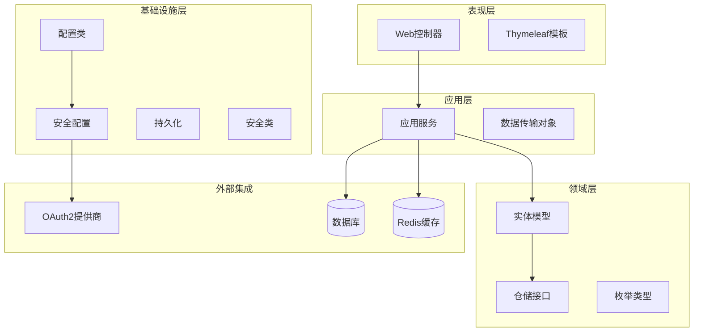
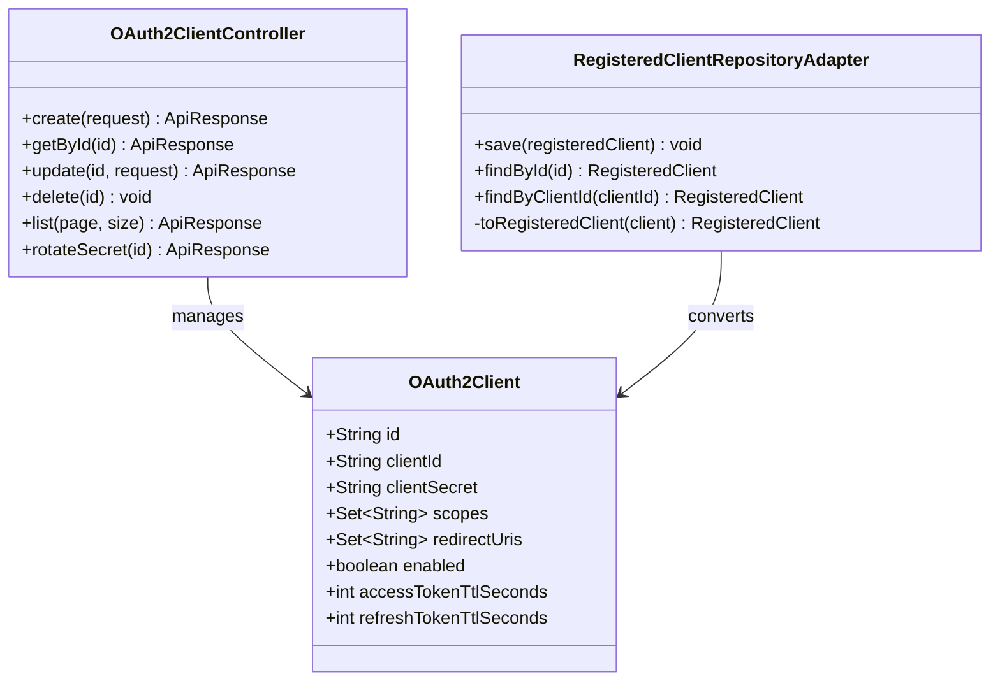
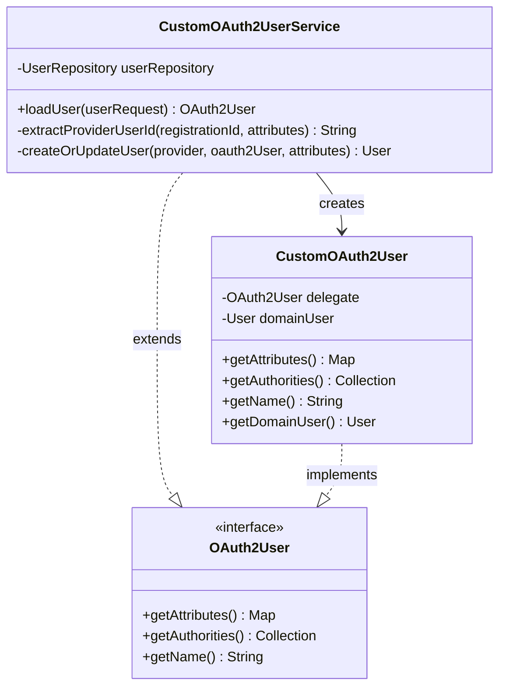
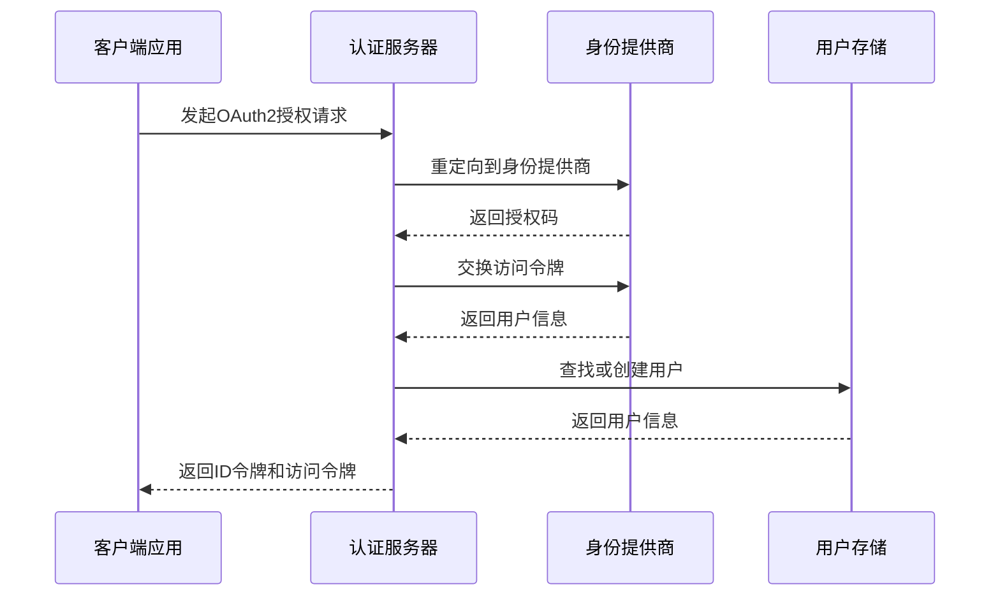
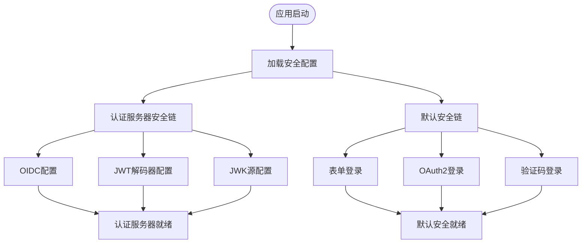
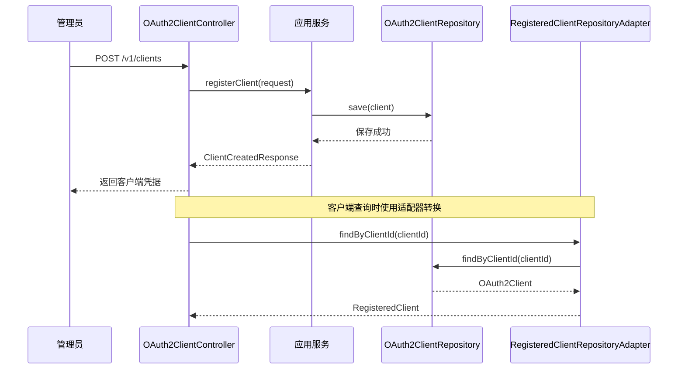
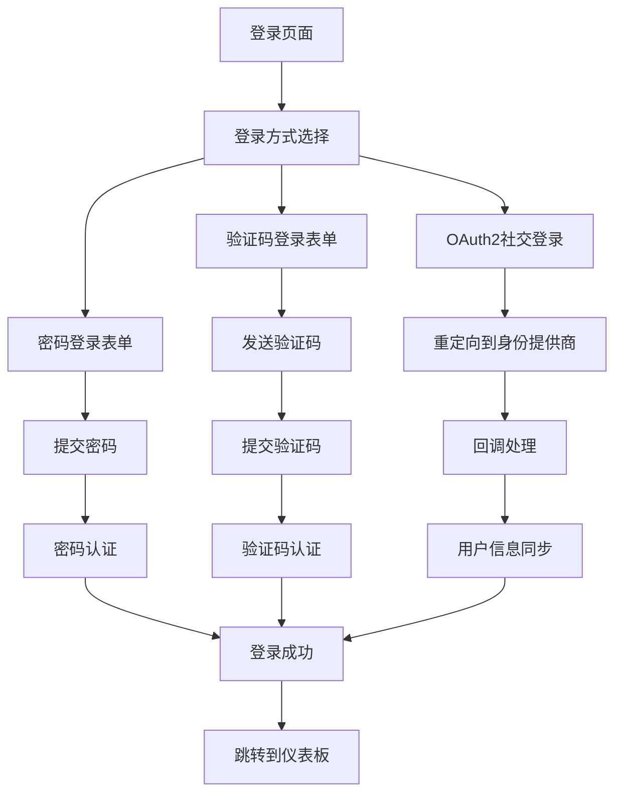
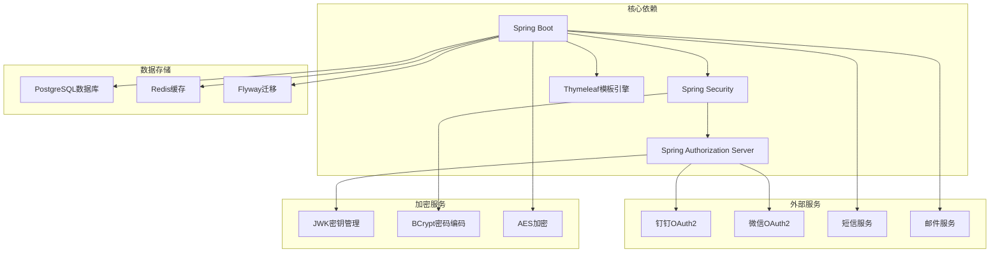

# 第三方OAuth2集成

<cite>
**本文档引用的文件**
- [SsoOidcApplication.java](file://src/main/java/sso/oidc/SsoOidcApplication.java)
- [AuthorizationServerConfig.java](file://src/main/java/sso/oidc/infrastructure/config/AuthorizationServerConfig.java)
- [DefaultSecurityConfig.java](file://src/main/java/sso/oidc/infrastructure/config/DefaultSecurityConfig.java)
- [JwkProperties.java](file://src/main/java/sso/oidc/infrastructure/config/JwkProperties.java)
- [CustomOAuth2UserService.java](file://src/main/java/sso/oidc/infrastructure/security/CustomOAuth2UserService.java)
- [CustomOAuth2User.java](file://src/main/java/sso/oidc/infrastructure/security/CustomOAuth2User.java)
- [RegisteredClientRepositoryAdapter.java](file://src/main/java/sso/oidc/infrastructure/security/RegisteredClientRepositoryAdapter.java)
- [OAuth2Client.java](file://src/main/java/sso/oidc/domain/model/entity/OAuth2Client.java)
- [OAuth2ClientJpaRepository.java](file://src/main/java/sso/oidc/infrastructure/persistence/repository/OAuth2ClientJpaRepository.java)
- [OAuth2ClientController.java](file://src/main/java/sso/oidc/interfaces/rest/OAuth2ClientController.java)
- [LoginController.java](file://src/main/java/sso/oidc/interfaces/web/LoginController.java)
- [ConsentController.java](file://src/main/java/sso/oidc/interfaces/web/ConsentController.java)
- [application.yml](file://src/main/resources/application.yml)
- [login.html](file://src/main/resources/templates/login.html)
</cite>

## 目录
1. [简介](#简介)
2. [项目结构](#项目结构)
3. [核心组件](#核心组件)
4. [架构概览](#架构概览)
5. [详细组件分析](#详细组件分析)
6. [依赖关系分析](#依赖关系分析)
7. [性能考虑](#性能考虑)
8. [故障排除指南](#故障排除指南)
9. [结论](#结论)

## 简介

本项目是一个基于Spring Authorization Server的SSO/OIDC身份认证系统，重点实现了第三方OAuth2集成功能。系统支持多种身份提供商（如钉钉、微信等），提供统一的身份认证和授权服务，同时具备完整的OAuth2客户端管理能力。

该系统的OAuth2集成特性包括：
- 多种身份提供商支持（钉钉、微信等）
- 自定义OAuth2用户服务
- 动态客户端注册和管理
- JWT令牌颁发和验证
- 用户信息映射和同步

## 项目结构

项目采用分层架构设计，主要包含以下层次：

**图表来源**
- [SsoOidcApplication.java:1-13](file://src/main/java/sso/oidc/SsoOidcApplication.java#L1-L13)
- [AuthorizationServerConfig.java:34-123](file://src/main/java/sso/oidc/infrastructure/config/AuthorizationServerConfig.java#L34-L123)

**章节来源**
- [SsoOidcApplication.java:1-13](file://src/main/java/sso/oidc/SsoOidcApplication.java#L1-L13)
- [application.yml:1-106](file://src/main/resources/application.yml#L1-L106)

## 核心组件

### OAuth2客户端管理

系统提供了完整的OAuth2客户端生命周期管理功能：

**图表来源**
- [OAuth2Client.java:16-69](file://src/main/java/sso/oidc/domain/model/entity/OAuth2Client.java#L16-L69)
- [OAuth2ClientController.java:30-75](file://src/main/java/sso/oidc/interfaces/rest/OAuth2ClientController.java#L30-L75)
- [RegisteredClientRepositoryAdapter.java:21-82](file://src/main/java/sso/oidc/infrastructure/security/RegisteredClientRepositoryAdapter.java#L21-L82)

### 自定义OAuth2用户服务

系统实现了自定义的OAuth2用户服务，支持多种身份提供商：

**图表来源**
- [CustomOAuth2UserService.java:18-83](file://src/main/java/sso/oidc/infrastructure/security/CustomOAuth2UserService.java#L18-L83)
- [CustomOAuth2User.java:12-36](file://src/main/java/sso/oidc/infrastructure/security/CustomOAuth2User.java#L12-L36)

**章节来源**
- [OAuth2ClientController.java:1-75](file://src/main/java/sso/oidc/interfaces/rest/OAuth2ClientController.java#L1-L75)
- [CustomOAuth2UserService.java:1-83](file://src/main/java/sso/oidc/infrastructure/security/CustomOAuth2UserService.java#L1-L83)

## 架构概览

系统采用Spring Security和Spring Authorization Server构建，实现了完整的OAuth2/OIDC认证流程：

**图表来源**
- [AuthorizationServerConfig.java:42-57](file://src/main/java/sso/oidc/infrastructure/config/AuthorizationServerConfig.java#L42-L57)
- [DefaultSecurityConfig.java:26-47](file://src/main/java/sso/oidc/infrastructure/config/DefaultSecurityConfig.java#L26-L47)

## 详细组件分析

### 安全配置组件

系统配置了两个主要的安全过滤链：

**图表来源**
- [AuthorizationServerConfig.java:42-92](file://src/main/java/sso/oidc/infrastructure/config/AuthorizationServerConfig.java#L42-L92)
- [DefaultSecurityConfig.java:24-47](file://src/main/java/sso/oidc/infrastructure/config/DefaultSecurityConfig.java#L24-L47)

### OAuth2客户端注册流程

**图表来源**
- [OAuth2ClientController.java:34-39](file://src/main/java/sso/oidc/interfaces/rest/OAuth2ClientController.java#L34-L39)
- [RegisteredClientRepositoryAdapter.java:31-39](file://src/main/java/sso/oidc/infrastructure/security/RegisteredClientRepositoryAdapter.java#L31-L39)

### 用户登录流程

系统支持多种登录方式，包括密码登录、验证码登录和OAuth2社交登录：

**图表来源**
- [login.html:128-181](file://src/main/resources/templates/login.html#L128-L181)
- [CustomOAuth2UserService.java:22-40](file://src/main/java/sso/oidc/infrastructure/security/CustomOAuth2UserService.java#L22-L40)

**章节来源**
- [AuthorizationServerConfig.java:1-123](file://src/main/java/sso/oidc/infrastructure/config/AuthorizationServerConfig.java#L1-L123)
- [DefaultSecurityConfig.java:1-54](file://src/main/java/sso/oidc/infrastructure/config/DefaultSecurityConfig.java#L1-L54)
- [login.html:1-257](file://src/main/resources/templates/login.html#L1-L257)

## 依赖关系分析

系统的关键依赖关系如下：

**图表来源**
- [application.yml:48-82](file://src/main/resources/application.yml#L48-L82)
- [JwkProperties.java:12-15](file://src/main/java/sso/oidc/infrastructure/config/JwkProperties.java#L12-L15)

**章节来源**
- [application.yml:1-106](file://src/main/resources/application.yml#L1-L106)
- [JwkProperties.java:1-16](file://src/main/java/sso/oidc/infrastructure/config/JwkProperties.java#L1-L16)

## 性能考虑

系统在设计时考虑了多个性能优化点：

### JWT令牌性能
- 使用固定的KeyID确保JWKS缓存有效性
- 优化JWK密钥生成和缓存机制
- 启用适当的令牌过期时间配置

### 数据库性能
- 使用连接池配置优化数据库连接
- 启用Flyway进行数据库迁移管理
- 优化用户查询和索引策略

### 缓存策略
- Redis缓存用于会话管理和令牌存储
- 合理设置缓存过期时间和内存使用

## 故障排除指南

### OAuth2集成常见问题

**问题1：身份提供商认证失败**
- 检查客户端ID和密钥配置
- 验证重定向URI设置
- 确认身份提供商的应用配置

**问题2：用户信息映射错误**
- 检查提供商特定的用户属性映射
- 验证用户查找逻辑
- 确认用户创建流程

**问题3：令牌颁发失败**
- 检查JWK密钥配置
- 验证JWT解码器设置
- 确认授权服务器配置

**章节来源**
- [CustomOAuth2UserService.java:42-48](file://src/main/java/sso/oidc/infrastructure/security/CustomOAuth2UserService.java#L42-L48)
- [AuthorizationServerConfig.java:110-121](file://src/main/java/sso/oidc/infrastructure/config/AuthorizationServerConfig.java#L110-L121)

## 结论

本项目成功实现了企业级的第三方OAuth2集成解决方案，具有以下特点：

**技术优势**
- 完整的OAuth2/OIDC协议实现
- 支持多种身份提供商
- 灵活的客户端管理机制
- 安全的令牌颁发和验证

**架构优势**
- 清晰的分层架构设计
- 良好的可扩展性
- 完善的错误处理机制
- 丰富的监控和诊断功能

**实践价值**
- 为企业提供统一的身份认证服务
- 支持多租户和多应用场景
- 具备生产环境部署能力
- 提供完整的开发和运维工具链

该系统为构建现代企业级身份认证平台奠定了坚实基础，可根据具体需求进行定制和扩展。