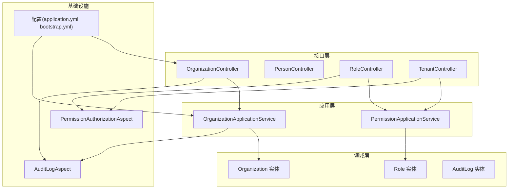
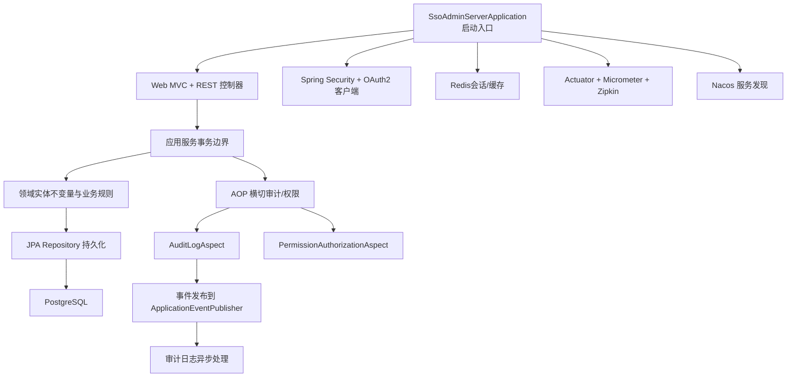
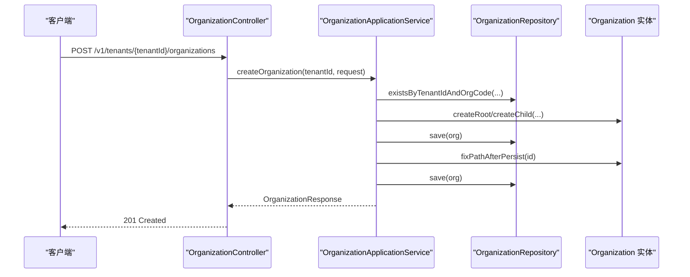
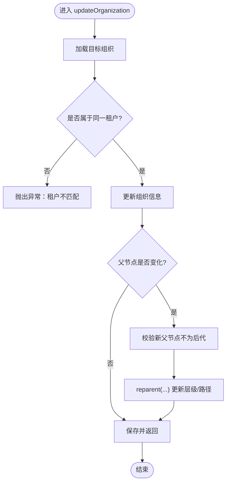
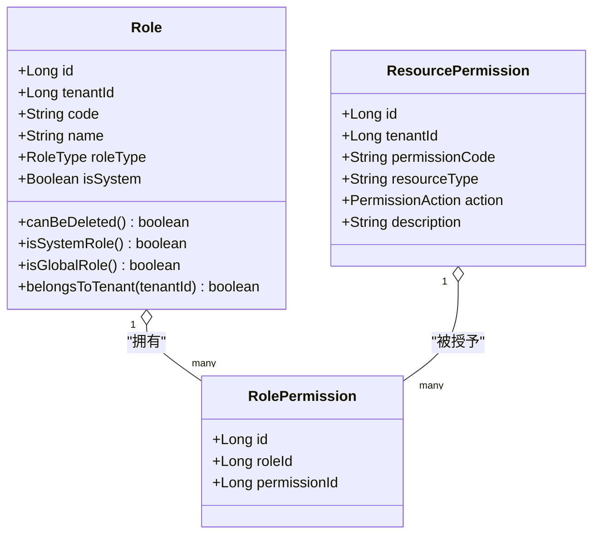
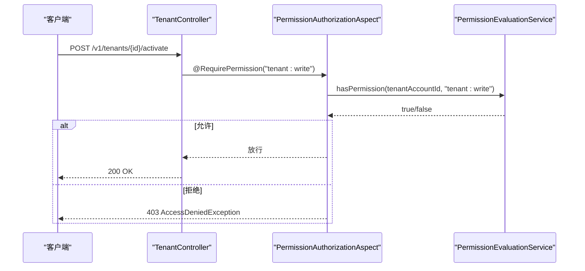
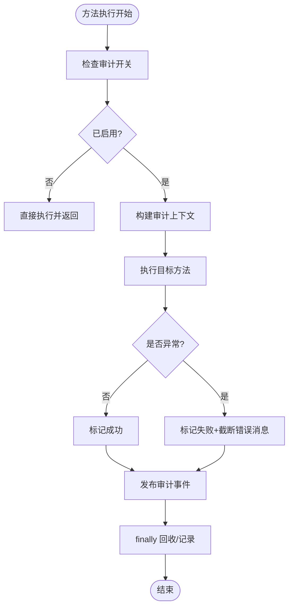
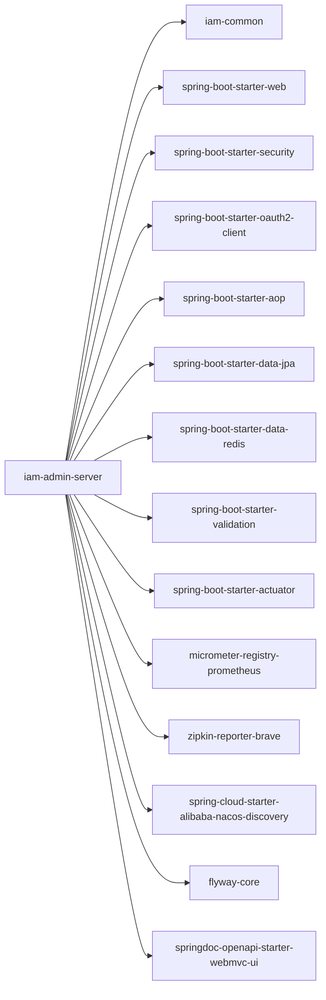

# 管理服务器（iam-admin-server）

<cite>
**本文引用的文件**
- [SsoAdminServerApplication.java](file://iam-admin-server/src/main/java/iam/platform/admin/SsoAdminServerApplication.java)
- [pom.xml](file://iam-admin-server/pom.xml)
- [bootstrap.yml](file://iam-admin-server/bootstrap.yml)
- [application.yml](file://iam-admin-server/src/main/resources/application.yml)
- [OrganizationController.java](file://iam-admin-server/src/main/java/iam/platform/admin/interfaces/rest/OrganizationController.java)
- [Organization.java](file://iam-admin-server/src/main/java/iam/platform/admin/domain/model/entity/Organization.java)
- [OrganizationApplicationService.java](file://iam-admin-server/src/main/java/iam/platform/admin/application/service/OrganizationApplicationService.java)
- [PersonController.java](file://iam-admin-server/src/main/java/iam/platform/admin/interfaces/rest/PersonController.java)
- [RoleController.java](file://iam-admin-server/src/main/java/iam/platform/admin/interfaces/rest/RoleController.java)
- [Role.java](file://iam-admin-server/src/main/java/iam/platform/admin/domain/model/entity/Role.java)
- [PermissionApplicationService.java](file://iam-admin-server/src/main/java/iam/platform/admin/application/service/PermissionApplicationService.java)
- [TenantController.java](file://iam-admin-server/src/main/java/iam/platform/admin/interfaces/rest/TenantController.java)
- [AuditLogAspect.java](file://iam-admin-server/src/main/java/iam/platform/admin/infrastructure/aspect/AuditLogAspect.java)
- [PermissionAuthorizationAspect.java](file://iam-admin-server/src/main/java/iam/platform/admin/infrastructure/aspect/PermissionAuthorizationAspect.java)
- [AuditLog.java](file://iam-admin-server/src/main/java/iam/platform/admin/domain/model/entity/AuditLog.java)
</cite>

## 目录
1. [简介](#简介)
2. [项目结构](#项目结构)
3. [核心组件](#核心组件)
4. [架构总览](#架构总览)
5. [详细组件分析](#详细组件分析)
6. [依赖分析](#依赖分析)
7. [性能考虑](#性能考虑)
8. [故障排查指南](#故障排查指南)
9. [结论](#结论)
10. [附录：API 规范与扩展实践](#附录api-规范与扩展实践)

## 简介
本文件为“管理服务器（iam-admin-server）”的综合技术文档，覆盖用户管理、组织管理、租户管理、权限管理等核心能力；深入解析 RBAC 权限模型、角色权限分配机制与资源权限控制策略；阐述审计日志系统的设计与实现、日志收集与异步落库、合规追踪能力；给出管理 API 的 RESTful 接口规范、参数校验与响应格式；说明多租户架构下的数据隔离与资源共享；并提供管理界面前后端交互、权限控制与安全防护要点，以及扩展与自定义业务逻辑的实践路径。

## 项目结构
管理服务器采用分层架构与整洁架构风格，按领域驱动划分：
- 接口层（REST 控制器）：暴露管理 API，负责请求接收、参数校验与响应封装
- 应用层（应用服务）：编排业务流程，触发审计与权限横切
- 领域层（实体与值对象）：表达业务规则与不变量
- 基础设施层（AOP、配置、持久化适配）：提供横切关注点与基础设施能力
- 资源与配置：数据库连接、Redis、OpenAPI 文档、Actuator 指标与链路追踪

图表来源
- [OrganizationController.java:1-84](file://iam-admin-server/src/main/java/iam/platform/admin/interfaces/rest/OrganizationController.java#L1-L84)
- [OrganizationApplicationService.java:1-191](file://iam-admin-server/src/main/java/iam/platform/admin/application/service/OrganizationApplicationService.java#L1-L191)
- [PermissionApplicationService.java:1-135](file://iam-admin-server/src/main/java/iam/platform/admin/application/service/PermissionApplicationService.java#L1-L135)
- [AuditLogAspect.java:1-66](file://iam-admin-server/src/main/java/iam/platform/admin/infrastructure/aspect/AuditLogAspect.java#L1-L66)
- [PermissionAuthorizationAspect.java:1-79](file://iam-admin-server/src/main/java/iam/platform/admin/infrastructure/aspect/PermissionAuthorizationAspect.java#L1-L79)
- [application.yml:1-102](file://iam-admin-server/src/main/resources/application.yml#L1-L102)
- [bootstrap.yml:1-10](file://iam-admin-server/bootstrap.yml#L1-L10)

章节来源
- [SsoAdminServerApplication.java:1-17](file://iam-admin-server/src/main/java/iam/platform/admin/SsoAdminServerApplication.java#L1-L17)
- [pom.xml:1-150](file://iam-admin-server/pom.xml#L1-L150)
- [application.yml:1-102](file://iam-admin-server/src/main/resources/application.yml#L1-L102)
- [bootstrap.yml:1-10](file://iam-admin-server/bootstrap.yml#L1-L10)

## 核心组件
- 用户与人员管理：提供自然人（Person）的增删改查与分页列表
- 组织管理：支持组织树构建、层级变更、状态维护
- 租户管理：租户生命周期管理与状态控制
- 权限管理：资源权限创建、查询、回收；角色授权/撤销
- 审计日志：基于 AOP 的方法级审计、异步事件发布、保留期配置
- 权限控制：基于注解的 RBAC 授权拦截、多条件组合校验

章节来源
- [PersonController.java:1-68](file://iam-admin-server/src/main/java/iam/platform/admin/interfaces/rest/PersonController.java#L1-L68)
- [OrganizationController.java:1-84](file://iam-admin-server/src/main/java/iam/platform/admin/interfaces/rest/OrganizationController.java#L1-L84)
- [TenantController.java:1-90](file://iam-admin-server/src/main/java/iam/platform/admin/interfaces/rest/TenantController.java#L1-L90)
- [RoleController.java:1-58](file://iam-admin-server/src/main/java/iam/platform/admin/interfaces/rest/RoleController.java#L1-L58)
- [PermissionApplicationService.java:1-135](file://iam-admin-server/src/main/java/iam/platform/admin/application/service/PermissionApplicationService.java#L1-L135)
- [AuditLogAspect.java:1-66](file://iam-admin-server/src/main/java/iam/platform/admin/infrastructure/aspect/AuditLogAspect.java#L1-L66)
- [PermissionAuthorizationAspect.java:1-79](file://iam-admin-server/src/main/java/iam/platform/admin/infrastructure/aspect/PermissionAuthorizationAspect.java#L1-L79)

## 架构总览
管理服务器通过 Spring Boot 启动，启用 Web、JPA、Redis、Security、OAuth2 客户端、AOP、Actuator、Prometheus、Zipkin 等能力。Nacos 用于服务发现与元数据注入，Flyway 迁移数据库模式。OpenAPI 提供在线接口文档。

图表来源
- [SsoAdminServerApplication.java:1-17](file://iam-admin-server/src/main/java/iam/platform/admin/SsoAdminServerApplication.java#L1-L17)
- [application.yml:1-102](file://iam-admin-server/src/main/resources/application.yml#L1-L102)
- [bootstrap.yml:1-10](file://iam-admin-server/bootstrap.yml#L1-L10)
- [AuditLogAspect.java:1-66](file://iam-admin-server/src/main/java/iam/platform/admin/infrastructure/aspect/AuditLogAspect.java#L1-L66)
- [PermissionAuthorizationAspect.java:1-79](file://iam-admin-server/src/main/java/iam/platform/admin/infrastructure/aspect/PermissionAuthorizationAspect.java#L1-L79)

## 详细组件分析

### 组织管理（Organization）
- 功能要点
  - 支持根组织与子组织创建，自动维护路径与层级
  - 组织树构建与查询，支持按租户维度聚合
  - 组织状态激活/停用
  - 层级变更时的路径修复与子节点路径同步
- 关键类与职责
  - 控制器：接收请求、封装响应
  - 应用服务：事务边界、调用领域实体与仓储、触发审计
  - 领域实体：组织的工厂方法、路径修正、重父、状态变更、租户归属校验
- 数据流与流程

图表来源
- [OrganizationController.java:33-40](file://iam-admin-server/src/main/java/iam/platform/admin/interfaces/rest/OrganizationController.java#L33-L40)
- [OrganizationApplicationService.java:32-66](file://iam-admin-server/src/main/java/iam/platform/admin/application/service/OrganizationApplicationService.java#L32-L66)
- [Organization.java:36-96](file://iam-admin-server/src/main/java/iam/platform/admin/domain/model/entity/Organization.java#L36-L96)

图表来源
- [OrganizationApplicationService.java:74-112](file://iam-admin-server/src/main/java/iam/platform/admin/application/service/OrganizationApplicationService.java#L74-L112)
- [Organization.java:123-135](file://iam-admin-server/src/main/java/iam/platform/admin/domain/model/entity/Organization.java#L123-L135)

章节来源
- [OrganizationController.java:1-84](file://iam-admin-server/src/main/java/iam/platform/admin/interfaces/rest/OrganizationController.java#L1-L84)
- [OrganizationApplicationService.java:1-191](file://iam-admin-server/src/main/java/iam/platform/admin/application/service/OrganizationApplicationService.java#L1-L191)
- [Organization.java:1-217](file://iam-admin-server/src/main/java/iam/platform/admin/domain/model/entity/Organization.java#L1-L217)

### 权限管理（RBAC）
- 能力概览
  - 资源权限：按资源类型与动作（读/写/执行等）定义
  - 角色：系统内置与租户自定义两类
  - 授权：角色与权限的多对多映射
- 关键类与职责
  - 控制器：提供权限 CRUD 与角色授权接口
  - 应用服务：权限唯一性校验、授权映射维护、审计标注
  - 领域实体：角色与资源权限的工厂方法与行为
- 授权拦截
  - 使用注解 RequirePermission 在方法级进行权限判定
  - 支持单个权限、allOf（AND）、anyOf（OR）三种组合方式
  - 结合租户上下文判断当前账号在租户内的权限集合

图表来源
- [Role.java:1-83](file://iam-admin-server/src/main/java/iam/platform/admin/domain/model/entity/Role.java#L1-L83)
- [PermissionApplicationService.java:1-135](file://iam-admin-server/src/main/java/iam/platform/admin/application/service/PermissionApplicationService.java#L1-L135)

图表来源
- [TenantController.java:74-80](file://iam-admin-server/src/main/java/iam/platform/admin/interfaces/rest/TenantController.java#L74-L80)
- [PermissionAuthorizationAspect.java:30-49](file://iam-admin-server/src/main/java/iam/platform/admin/infrastructure/aspect/PermissionAuthorizationAspect.java#L30-L49)

章节来源
- [RoleController.java:1-58](file://iam-admin-server/src/main/java/iam/platform/admin/interfaces/rest/RoleController.java#L1-L58)
- [PermissionApplicationService.java:1-135](file://iam-admin-server/src/main/java/iam/platform/admin/application/service/PermissionApplicationService.java#L1-L135)
- [PermissionAuthorizationAspect.java:1-79](file://iam-admin-server/src/main/java/iam/platform/admin/infrastructure/aspect/PermissionAuthorizationAspect.java#L1-L79)
- [Role.java:1-83](file://iam-admin-server/src/main/java/iam/platform/admin/domain/model/entity/Role.java#L1-L83)

### 审计日志系统
- 设计要点
  - 方法级审计：通过 @AuditLog 注解自动记录事件类型、结果、错误信息
  - 异步发布：AOP 切面捕获方法执行，成功/失败标记，最终发布审计事件
  - 配置化：开启/关闭、保留天数、线程池大小与队列容量
  - 不可变性：审计实体一旦创建即不可修改
- 流程图

图表来源
- [AuditLogAspect.java:27-48](file://iam-admin-server/src/main/java/iam/platform/admin/infrastructure/aspect/AuditLogAspect.java#L27-L48)
- [AuditLog.java:46-69](file://iam-admin-server/src/main/java/iam/platform/admin/domain/model/entity/AuditLog.java#L46-L69)

章节来源
- [AuditLogAspect.java:1-66](file://iam-admin-server/src/main/java/iam/platform/admin/infrastructure/aspect/AuditLogAspect.java#L1-L66)
- [AuditLog.java:1-118](file://iam-admin-server/src/main/java/iam/platform/admin/domain/model/entity/AuditLog.java#L1-L118)
- [application.yml:93-102](file://iam-admin-server/src/main/resources/application.yml#L93-L102)

### 多租户数据隔离与资源共享
- 隔离机制
  - 组织、角色、权限、人员等实体均携带 tenantId 字段
  - 应用服务在操作前校验实体归属租户，避免跨租户访问
  - 组织路径采用“租户根 + 路径”的结构，天然隔离不同租户的组织树
- 资源共享
  - 全局权限与系统角色可在租户间复用（由实体字段与应用层策略决定）
  - 人员与租户账号映射关系支撑跨租户的账号授权与登录态

章节来源
- [OrganizationApplicationService.java:82-83](file://iam-admin-server/src/main/java/iam/platform/admin/application/service/OrganizationApplicationService.java#L82-L83)
- [Organization.java:105-116](file://iam-admin-server/src/main/java/iam/platform/admin/domain/model/entity/Organization.java#L105-L116)
- [Role.java:18-25](file://iam-admin-server/src/main/java/iam/platform/admin/domain/model/entity/Role.java#L18-L25)

## 依赖分析
- 外部依赖
  - Spring 生态：Web、Security、OAuth2 客户端、AOP、Data JPA、Validation
  - Redis：分布式会话与缓存
  - PostgreSQL + Flyway：持久化与迁移
  - Nacos：服务注册与发现
  - OpenAPI：接口文档
  - Actuator + Micrometer + Zipkin：可观测性
- 内部模块
  - 依赖 iam-common 提供 DTO、枚举、注解与通用异常

图表来源
- [pom.xml:18-136](file://iam-admin-server/pom.xml#L18-L136)

章节来源
- [pom.xml:1-150](file://iam-admin-server/pom.xml#L1-L150)

## 性能考虑
- 连接池与超时：HikariCP 最大池大小、最小空闲、连接超时、空闲与最大生存时间
- 缓存与会话：Redis 作为会话存储与缓存，建议合理设置过期策略
- 异步审计：审计事件异步发布，避免阻塞主业务链路
- 分页与查询：人员列表、租户分页查询默认页大小可按场景调整
- 指标与追踪：Prometheus 指标与 Zipkin 链路追踪便于定位热点与延迟

章节来源
- [application.yml:15-25](file://iam-admin-server/src/main/resources/application.yml#L15-L25)
- [application.yml:47-50](file://iam-admin-server/src/main/resources/application.yml#L47-L50)
- [application.yml:83-92](file://iam-admin-server/src/main/resources/application.yml#L83-L92)

## 故障排查指南
- 权限不足
  - 现象：403 AccessDeniedException
  - 排查：确认租户上下文是否存在、注解 RequirePermission 的权限字符串是否正确、allOf/anyOf 组合是否满足
- 组织层级异常
  - 现象：移动组织时报错“不能移动到其后代”
  - 排查：检查新父节点是否为当前组织的后代；确保同一租户内
- 删除约束
  - 现象：删除组织报“存在子组织”
  - 排查：先删除或迁移子组织后再删除父组织
- 审计未记录
  - 现象：接口执行成功但无审计日志
  - 排查：检查审计开关、异步事件发布是否异常、线程池配置是否合理

章节来源
- [PermissionAuthorizationAspect.java:33-46](file://iam-admin-server/src/main/java/iam/platform/admin/infrastructure/aspect/PermissionAuthorizationAspect.java#L33-L46)
- [OrganizationApplicationService.java:96-97](file://iam-admin-server/src/main/java/iam/platform/admin/application/service/OrganizationApplicationService.java#L96-L97)
- [AuditLogAspect.java:50-58](file://iam-admin-server/src/main/java/iam/platform/admin/infrastructure/aspect/AuditLogAspect.java#L50-L58)

## 结论
管理服务器以清晰的分层与领域建模实现了组织、人员、租户与权限的核心能力，并通过 RBAC 注解授权与 AOP 审计保障了安全性与可追溯性。多租户通过租户标识与路径隔离实现强隔离，同时允许必要的全局共享。结合 Redis、Actuator、Micrometer 与 Zipkin，系统具备良好的可观测性与扩展性。

## 附录：API 规范与扩展实践

### API 设计规范
- 命名与版本
  - 版本前缀：/v1
  - 资源命名：复数形式，如 /v1/tenants、/v1/tenants/{id}/organizations
- 请求与响应
  - 统一响应包装：使用 ApiResponse 或 PageResponse
  - 参数校验：控制器层使用 @Valid，配合 DTO 与 JSR-303
  - 状态码：200/201/204/400/403/404/500
- 认证与授权
  - OAuth2 登录后访问受控接口
  - 方法级权限注解 RequirePermission 控制访问

章节来源
- [OrganizationController.java:25-84](file://iam-admin-server/src/main/java/iam/platform/admin/interfaces/rest/OrganizationController.java#L25-L84)
- [PersonController.java:25-68](file://iam-admin-server/src/main/java/iam/platform/admin/interfaces/rest/PersonController.java#L25-L68)
- [RoleController.java:23-58](file://iam-admin-server/src/main/java/iam/platform/admin/interfaces/rest/RoleController.java#L23-L58)
- [TenantController.java:26-90](file://iam-admin-server/src/main/java/iam/platform/admin/interfaces/rest/TenantController.java#L26-L90)

### 扩展与自定义实践
- 新增资源权限
  - 在应用服务中新增权限创建逻辑，确保租户作用域唯一性
  - 通过角色授权接口完成角色与权限绑定
- 自定义权限评估
  - 可在 PermissionEvaluationService 中扩展更复杂的权限计算（如资源属性、动态上下文）
- 审计事件扩展
  - 在控制器或应用服务方法上添加 @AuditLog 注解，自动采集上下文并异步落库
- 多租户扩展
  - 在实体与仓储中增加租户过滤条件，确保所有查询与更新均带 tenantId
- 界面交互与安全
  - 前端通过 OIDC/OAuth2 登录，后端通过 Security + TenantContext 传递租户上下文
  - 权限控制在后端统一拦截，前端仅做 UI 展示级屏蔽

章节来源
- [PermissionApplicationService.java:32-49](file://iam-admin-server/src/main/java/iam/platform/admin/application/service/PermissionApplicationService.java#L32-L49)
- [AuditLogAspect.java:27-48](file://iam-admin-server/src/main/java/iam/platform/admin/infrastructure/aspect/AuditLogAspect.java#L27-L48)
- [PermissionAuthorizationAspect.java:30-49](file://iam-admin-server/src/main/java/iam/platform/admin/infrastructure/aspect/PermissionAuthorizationAspect.java#L30-L49)