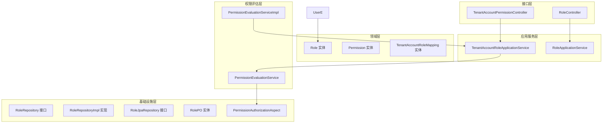
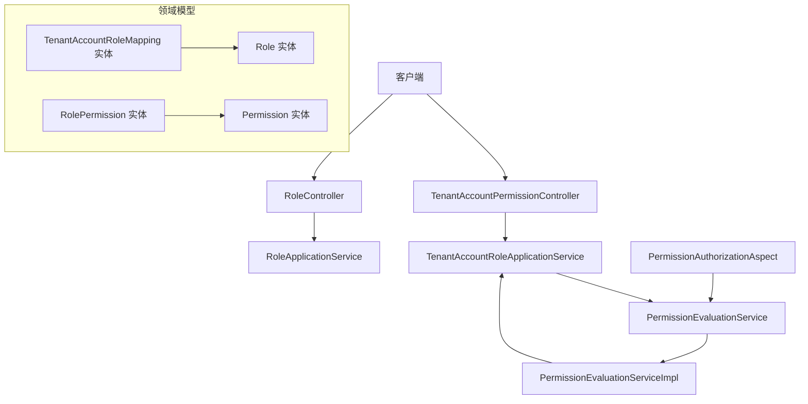
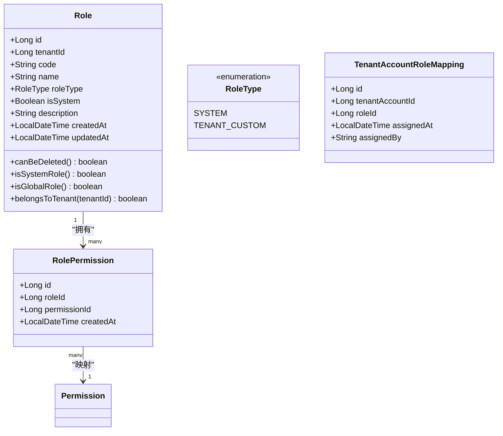
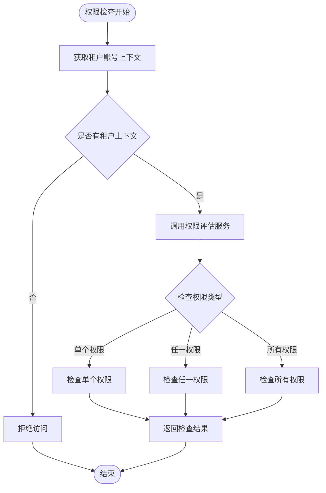
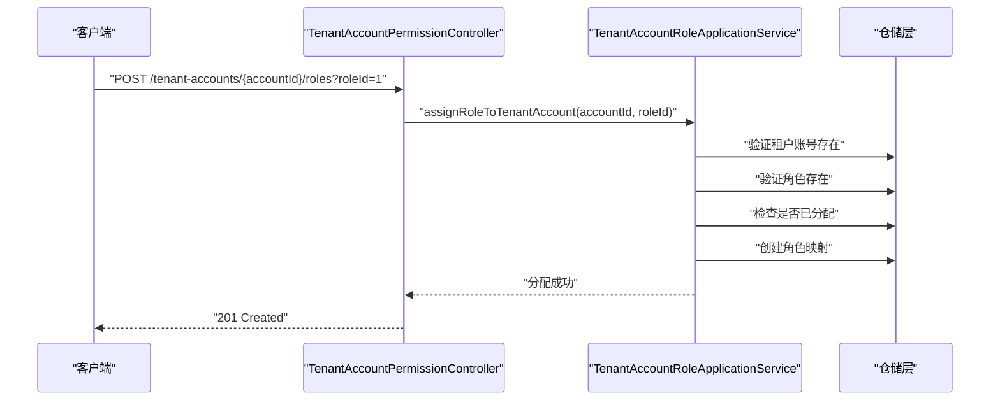
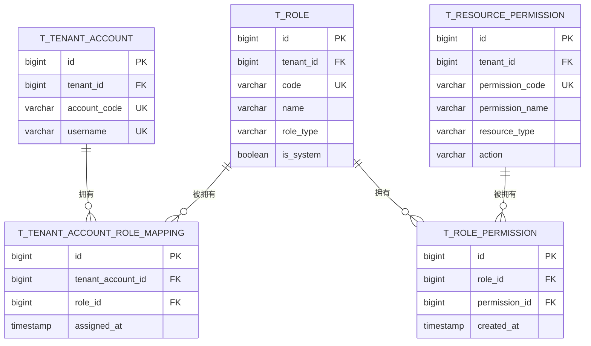
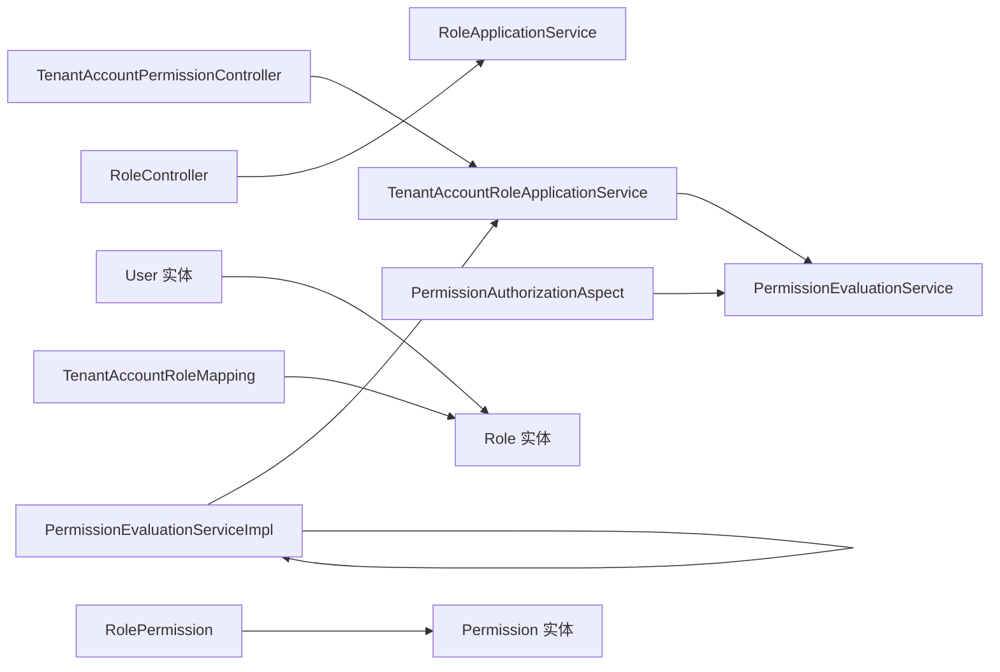

# 角色权限管理

<cite>
**本文引用的文件**
- [Role.java](file://src/main/java/sso/oidc/domain/model/entity/Role.java)
- [RoleResponse.java](file://src/main/java/sso/oidc/application/dto/response/RoleResponse.java)
- [RoleRepository.java](file://src/main/java/sso/oidc/domain/repository/RoleRepository.java)
- [RoleRepositoryImpl.java](file://src/main/java/sso/oidc/infrastructure/persistence/impl/RoleRepositoryImpl.java)
- [RoleJpaRepository.java](file://src/main/java/sso/oidc/infrastructure/persistence/repository/RoleJpaRepository.java)
- [RolePO.java](file://src/main/java/sso/oidc/infrastructure/persistence/entity/RolePO.java)
- [RoleController.java](file://src/main/java/sso/oidc/interfaces/rest/RoleController.java)
- [RoleApplicationService.java](file://src/main/java/sso/oidc/application/service/RoleApplicationService.java)
- [AssignRoleRequest.java](file://src/main/java/sso/oidc/application/dto/request/AssignRoleRequest.java)
- [User.java](file://src/main/java/sso/oidc/domain/model/entity/User.java)
- [V1__init_schema.sql](file://src/main/resources/db/migration/V1__init_schema.sql)
- [V2__seed_default_roles.sql](file://src/main/resources/db/migration/V2__seed_default_roles.sql)
- [RoleNotFoundException.java](file://src/main/java/sso/oidc/domain/model/exception/RoleNotFoundException.java)
- [PermissionEvaluationService.java](file://src/main/java/sso/oidc/domain/service/PermissionEvaluationService.java)
- [PermissionEvaluationServiceImpl.java](file://src/main/java/sso/oidc/domain/service/impl/PermissionEvaluationServiceImpl.java)
- [TenantAccountRoleApplicationService.java](file://src/main/java/sso/oidc/application/service/TenantAccountRoleApplicationService.java)
- [TenantAccountPermissionController.java](file://src/main/java/sso/oidc/interfaces/rest/TenantAccountPermissionController.java)
- [PermissionAuthorizationAspect.java](file://src/main/java/sso/oidc/infrastructure/aspect/PermissionAuthorizationAspect.java)
- [TenantAccountRoleMapping.java](file://src/main/java/sso/oidc/domain/model/entity/TenantAccountRoleMapping.java)
- [RolePermission.java](file://src/main/java/sso/oidc/domain/model/entity/RolePermission.java)
- [ApplicationPermission.java](file://src/main/java/sso/oidc/domain/model/entity/ApplicationPermission.java)
- [PermissionResponse.java](file://src/main/java/sso/oidc/application/dto/response/PermissionResponse.java)
- [RoleType.java](file://src/main/java/sso/oidc/domain/model/enums/RoleType.java)
- [V5__upgrade_rbac_with_tenant_and_permissions.sql](file://src/main/resources/db/migration/V5__upgrade_rbac_with_tenant_and_permissions.sql)
</cite>

## 更新摘要
**变更内容**
- 新增基于租户和权限的灵活权限评估系统
- Role实体重构，支持租户级角色和系统内置角色
- 新增PermissionEvaluationService权限评估服务
- 新增TenantAccountRoleApplicationService租户账号角色管理
- 新增权限注解@RequirePermission和权限AOP切面
- 数据库架构升级，支持资源权限和角色权限映射

## 目录
1. [简介](#简介)
2. [项目结构](#项目结构)
3. [核心组件](#核心组件)
4. [架构总览](#架构总览)
5. [详细组件分析](#详细组件分析)
6. [依赖关系分析](#依赖关系分析)
7. [性能考虑](#性能考虑)
8. [故障排查指南](#故障排查指南)
9. [结论](#结论)
10. [附录](#附录)

## 简介
本文档围绕重构后的角色权限管理系统进行深入解析，该系统已升级为基于租户和权限的更灵活架构。新系统采用RBAC 2.0模型，支持多租户权限隔离、细粒度资源权限控制、动态权限评估和权限继承机制。系统通过PermissionEvaluationService提供统一的权限评估能力，通过TenantAccountRoleApplicationService管理租户账号的角色分配，通过@RequirePermission注解和权限AOP切面实现声明式权限控制。

## 项目结构
重构后的角色权限管理相关代码分布在以下层次：
- 领域层：定义角色实体、权限实体、租户账号实体及其关系
- 应用服务层：封装租户账号角色管理和权限评估业务逻辑
- 接口层：REST控制器暴露角色管理和权限查询API
- 基础设施层：定义仓储接口及实现，权限AOP切面处理权限拦截
- 权限评估层：提供统一的权限检查和评估服务

**图表来源**
- [TenantAccountPermissionController.java:30-85](file://src/main/java/sso/oidc/interfaces/rest/TenantAccountPermissionController.java#L30-L85)
- [RoleController.java:1-58](file://src/main/java/sso/oidc/interfaces/rest/RoleController.java#L1-L58)
- [TenantAccountRoleApplicationService.java:32-145](file://src/main/java/sso/oidc/application/service/TenantAccountRoleApplicationService.java#L32-145)
- [PermissionEvaluationServiceImpl.java:16-52](file://src/main/java/sso/oidc/domain/service/impl/PermissionEvaluationServiceImpl.java#L16-52)
- [PermissionAuthorizationAspect.java:26-78](file://src/main/java/sso/oidc/infrastructure/aspect/PermissionAuthorizationAspect.java#L26-78)

**章节来源**
- [TenantAccountPermissionController.java:1-86](file://src/main/java/sso/oidc/interfaces/rest/TenantAccountPermissionController.java#L1-L86)
- [TenantAccountRoleApplicationService.java:1-145](file://src/main/java/sso/oidc/application/service/TenantAccountRoleApplicationService.java#L1-L145)
- [PermissionEvaluationServiceImpl.java:1-53](file://src/main/java/sso/oidc/domain/service/impl/PermissionEvaluationServiceImpl.java#L1-L53)
- [PermissionAuthorizationAspect.java:1-79](file://src/main/java/sso/oidc/infrastructure/aspect/PermissionAuthorizationAspect.java#L1-L79)

## 核心组件
- **角色实体 Role**：重构后的Role实体支持租户级角色和系统内置角色，包含tenantId、roleType、isSystem等字段
- **权限评估服务 PermissionEvaluationService**：提供统一的权限检查、权限集合获取和权限校验功能
- **租户账号角色应用服务 TenantAccountRoleApplicationService**：管理租户账号的角色分配、权限查询和权限码获取
- **权限注解 @RequirePermission**：声明式权限控制注解，支持单个权限、任一权限、所有权限的检查
- **权限AOP切面 PermissionAuthorizationAspect**：拦截标注@RequirePermission的方法，执行权限前置检查
- **租户账号角色映射 TenantAccountRoleMapping**：管理租户账号与角色的多对多关系
- **角色权限映射 RolePermission**：管理角色与资源权限的多对多关系
- **资源权限 ApplicationPermission**：定义细粒度的资源权限模型

**章节来源**
- [Role.java:16-82](file://src/main/java/sso/oidc/domain/model/entity/Role.java#L16-L82)
- [PermissionEvaluationService.java:8-53](file://src/main/java/sso/oidc/domain/service/PermissionEvaluationService.java#L8-L53)
- [TenantAccountRoleApplicationService.java:32-145](file://src/main/java/sso/oidc/application/service/TenantAccountRoleApplicationService.java#L32-L145)
- [PermissionAuthorizationAspect.java:26-78](file://src/main/java/sso/oidc/infrastructure/aspect/PermissionAuthorizationAspect.java#L26-L78)
- [TenantAccountRoleMapping.java:14-20](file://src/main/java/sso/oidc/domain/model/entity/TenantAccountRoleMapping.java#L14-L20)
- [RolePermission.java:14-19](file://src/main/java/sso/oidc/domain/model/entity/RolePermission.java#L14-L19)
- [ApplicationPermission.java:16-74](file://src/main/java/sso/oidc/domain/model/entity/ApplicationPermission.java#L16-L74)

## 架构总览
重构后的系统采用分层架构，支持多租户权限隔离和细粒度权限控制。权限评估通过PermissionEvaluationService统一处理，租户账号角色管理通过TenantAccountRoleApplicationService实现，权限控制通过@RequirePermission注解和AOP切面实现声明式权限管理。

**图表来源**
- [TenantAccountPermissionController.java:30-85](file://src/main/java/sso/oidc/interfaces/rest/TenantAccountPermissionController.java#L30-L85)
- [TenantAccountRoleApplicationService.java:123-127](file://src/main/java/sso/oidc/application/service/TenantAccountRoleApplicationService.java#L123-L127)
- [PermissionEvaluationServiceImpl.java:39-42](file://src/main/java/sso/oidc/domain/service/impl/PermissionEvaluationServiceImpl.java#L39-L42)
- [PermissionAuthorizationAspect.java:30-49](file://src/main/java/sso/oidc/infrastructure/aspect/PermissionAuthorizationAspect.java#L30-49)

## 详细组件分析

### 角色实体与数据模型重构
重构后的Role实体支持多租户架构，包含以下关键字段：
- **tenantId**：角色所属租户，null表示全局角色
- **roleType**：角色类型，SYSTEM或TENANT_CUSTOM
- **isSystem**：系统内置角色标志，不可删除
- **工厂方法**：createSystem()和createTenant()提供类型化的角色创建

**图表来源**
- [Role.java:16-82](file://src/main/java/sso/oidc/domain/model/entity/Role.java#L16-L82)
- [RoleType.java:3-6](file://src/main/java/sso/oidc/domain/model/enums/RoleType.java#L3-L6)
- [TenantAccountRoleMapping.java:14-20](file://src/main/java/sso/oidc/domain/model/entity/TenantAccountRoleMapping.java#L14-L20)
- [RolePermission.java:14-19](file://src/main/java/sso/oidc/domain/model/entity/RolePermission.java#L14-L19)

**章节来源**
- [Role.java:1-83](file://src/main/java/sso/oidc/domain/model/entity/Role.java#L1-L83)
- [RoleType.java:1-7](file://src/main/java/sso/oidc/domain/model/enums/RoleType.java#L1-L7)
- [TenantAccountRoleMapping.java:1-21](file://src/main/java/sso/oidc/domain/model/entity/TenantAccountRoleMapping.java#L1-L21)
- [RolePermission.java:1-20](file://src/main/java/sso/oidc/domain/model/entity/RolePermission.java#L1-L20)

### 权限评估服务与权限控制
新增的PermissionEvaluationService提供统一的权限评估能力：
- **权限检查**：hasPermission()、hasAnyPermission()、hasAllPermissions()
- **权限获取**：getAllPermissions()获取用户所有权限码
- **权限校验**：checkPermission()方法校验权限并抛出异常
- **缓存机制**：@Cacheable注解缓存权限结果，提升性能

**图表来源**
- [PermissionEvaluationServiceImpl.java:20-51](file://src/main/java/sso/oidc/domain/service/impl/PermissionEvaluationServiceImpl.java#L20-L51)
- [PermissionAuthorizationAspect.java:30-64](file://src/main/java/sso/oidc/infrastructure/aspect/PermissionAuthorizationAspect.java#L30-64)

**章节来源**
- [PermissionEvaluationService.java:8-53](file://src/main/java/sso/oidc/domain/service/PermissionEvaluationService.java#L8-L53)
- [PermissionEvaluationServiceImpl.java:1-53](file://src/main/java/sso/oidc/domain/service/impl/PermissionEvaluationServiceImpl.java#L1-L53)
- [PermissionAuthorizationAspect.java:1-79](file://src/main/java/sso/oidc/infrastructure/aspect/PermissionAuthorizationAspect.java#L1-L79)

### 租户账号角色管理
TenantAccountRoleApplicationService提供租户账号的角色管理功能：
- **角色分配**：assignRoleToTenantAccount()为租户账号分配角色
- **角色移除**：removeRoleFromTenantAccount()从租户账号移除角色
- **角色查询**：getTenantAccountRoles()获取租户账号的角色列表
- **权限查询**：getTenantAccountPermissions()获取租户账号的权限列表
- **权限码获取**：getAllPermissionCodes()获取租户账号的所有权限码

**图表来源**
- [TenantAccountPermissionController.java:35-41](file://src/main/java/sso/oidc/interfaces/rest/TenantAccountPermissionController.java#L35-L41)
- [TenantAccountRoleApplicationService.java:43-71](file://src/main/java/sso/oidc/application/service/TenantAccountRoleApplicationService.java#L43-L71)

**章节来源**
- [TenantAccountRoleApplicationService.java:32-145](file://src/main/java/sso/oidc/application/service/TenantAccountRoleApplicationService.java#L32-L145)
- [TenantAccountPermissionController.java:30-85](file://src/main/java/sso/oidc/interfaces/rest/TenantAccountPermissionController.java#L30-L85)

### 声明式权限控制
通过@RequirePermission注解和权限AOP切面实现声明式权限控制：
- **注解支持**：value()单个权限、allOf()所有权限、anyOf()任一权限
- **切面拦截**：PermissionAuthorizationAspect拦截标注方法
- **权限评估**：根据注解配置调用PermissionEvaluationService进行权限检查
- **异常处理**：权限不足时抛出AccessDeniedException

**章节来源**
- [PermissionAuthorizationAspect.java:26-78](file://src/main/java/sso/oidc/infrastructure/aspect/PermissionAuthorizationAspect.java#L26-L78)
- [PermissionEvaluationService.java:8-53](file://src/main/java/sso/oidc/domain/service/PermissionEvaluationService.java#L8-L53)

### 数据库架构升级
V5数据库迁移脚本实现了权限系统的架构升级：
- **角色表升级**：t_role表新增tenant_id、role_type、is_system列
- **资源权限表**：t_resource_permission存储细粒度权限定义
- **角色权限映射**：t_role_permission实现角色与权限的多对多关系
- **系统权限种子**：预置系统级权限和权限分配

**图表来源**
- [V5__upgrade_rbac_with_tenant_and_permissions.sql:10-22](file://src/main/resources/db/migration/V5__upgrade_rbac_with_tenant_and_permissions.sql#L10-L22)
- [V5__upgrade_rbac_with_tenant_and_permissions.sql:27-54](file://src/main/resources/db/migration/V5__upgrade_rbac_with_tenant_and_permissions.sql#L27-L54)
- [V5__upgrade_rbac_with_tenant_and_permissions.sql:59-71](file://src/main/resources/db/migration/V5__upgrade_rbac_with_tenant_and_permissions.sql#L59-L71)

**章节来源**
- [V5__upgrade_rbac_with_tenant_and_permissions.sql:1-149](file://src/main/resources/db/migration/V5__upgrade_rbac_with_tenant_and_permissions.sql#L1-L149)

### 角色管理API接口规范
重构后的角色管理API支持租户级角色管理和权限查询：

- **租户账号角色分配**
  - 方法：POST /v1/tenant-accounts/{accountId}/roles
  - 参数：roleId
  - 返回：201 Created

- **租户账号角色移除**
  - 方法：DELETE /v1/tenant-accounts/{accountId}/roles
  - 参数：roleId
  - 返回：200 OK

- **获取租户账号角色列表**
  - 方法：GET /v1/tenant-accounts/{accountId}/roles
  - 返回：200 OK，RoleResponse列表

- **获取租户账号权限列表**
  - 方法：GET /v1/tenant-accounts/{accountId}/permissions
  - 返回：200 OK，PermissionResponse列表

- **权限检查**
  - 方法：POST /v1/permissions/check
  - 参数：accountId、permissionCode
  - 返回：200 OK，布尔值

- **批量权限检查**
  - 方法：POST /v1/permissions/check/batch
  - 参数：accountId、permissionCodes(Set)
  - 返回：200 OK，权限码集合

**章节来源**
- [TenantAccountPermissionController.java:30-85](file://src/main/java/sso/oidc/interfaces/rest/TenantAccountPermissionController.java#L30-L85)

### 权限传递机制
新系统实现了灵活的权限传递机制：
- **角色继承**：通过角色权限映射实现权限继承
- **租户隔离**：通过tenantId实现租户间权限隔离
- **全局权限**：tenantId为null的权限为全局权限
- **动态评估**：通过PermissionEvaluationService动态评估用户权限

**章节来源**
- [TenantAccountRoleApplicationService.java:103-127](file://src/main/java/sso/oidc/application/service/TenantAccountRoleApplicationService.java#L103-L127)
- [PermissionEvaluationServiceImpl.java:39-42](file://src/main/java/sso/oidc/domain/service/impl/PermissionEvaluationServiceImpl.java#L39-L42)

## 依赖关系分析
重构后的系统依赖关系更加清晰，权限评估服务成为核心依赖：

**图表来源**
- [TenantAccountPermissionController.java:32-33](file://src/main/java/sso/oidc/interfaces/rest/TenantAccountPermissionController.java#L32-L33)
- [TenantAccountRoleApplicationService.java:34-38](file://src/main/java/sso/oidc/application/service/TenantAccountRoleApplicationService.java#L34-L38)
- [PermissionEvaluationServiceImpl.java:18](file://src/main/java/sso/oidc/domain/service/impl/PermissionEvaluationServiceImpl.java#L18)
- [PermissionAuthorizationAspect.java:28](file://src/main/java/sso/oidc/infrastructure/aspect/PermissionAuthorizationAspect.java#L28)

**章节来源**
- [TenantAccountPermissionController.java:1-86](file://src/main/java/sso/oidc/interfaces/rest/TenantAccountPermissionController.java#L1-L86)
- [TenantAccountRoleApplicationService.java:1-145](file://src/main/java/sso/oidc/application/service/TenantAccountRoleApplicationService.java#L1-L145)
- [PermissionEvaluationServiceImpl.java:1-53](file://src/main/java/sso/oidc/domain/service/impl/PermissionEvaluationServiceImpl.java#L1-L53)
- [PermissionAuthorizationAspect.java:1-79](file://src/main/java/sso/oidc/infrastructure/aspect/PermissionAuthorizationAspect.java#L1-L79)

## 性能考虑
重构后的系统在性能方面有以下优化：
- **权限缓存**：PermissionEvaluationServiceImpl使用@Cacheable缓存权限结果
- **批量查询**：TenantAccountRoleApplicationService支持批量权限查询
- **索引优化**：数据库表添加了多处索引支持高效查询
- **事务管理**：角色分配操作使用@Transactional保证数据一致性
- **缓存失效**：角色变更时通过@CacheEvict清除权限缓存

**章节来源**
- [PermissionEvaluationServiceImpl.java:39-42](file://src/main/java/sso/oidc/domain/service/impl/PermissionEvaluationServiceImpl.java#L39-L42)
- [TenantAccountRoleApplicationService.java:44](file://src/main/java/sso/oidc/application/service/TenantAccountRoleApplicationService.java#L44)
- [V5__upgrade_rbac_with_tenant_and_permissions.sql:14](file://src/main/resources/db/migration/V5__upgrade_rbac_with_tenant_and_permissions.sql#L14)

## 故障排查指南
重构后的系统故障排查要点：
- **权限评估失败**：检查租户上下文是否正确设置，确认TenantContext.getCurrentTenantAccountId()返回值
- **角色分配异常**：确认租户账号和角色是否存在，检查角色映射是否已存在
- **权限注解不生效**：确认方法被正确标注@RequirePermission，检查AOP切面配置
- **缓存问题**：角色变更后权限缓存可能过期，等待缓存自动失效或手动触发缓存清理

**章节来源**
- [PermissionAuthorizationAspect.java:33-46](file://src/main/java/sso/oidc/infrastructure/aspect/PermissionAuthorizationAspect.java#L33-L46)
- [TenantAccountRoleApplicationService.java:48-59](file://src/main/java/sso/oidc/application/service/TenantAccountRoleApplicationService.java#L48-59)
- [PermissionEvaluationServiceImpl.java:45-51](file://src/main/java/sso/oidc/domain/service/impl/PermissionEvaluationServiceImpl.java#L45-L51)

## 结论
重构后的角色权限管理系统实现了从传统RBAC到现代RBAC 2.0的升级，支持多租户权限隔离、细粒度资源权限控制和动态权限评估。通过PermissionEvaluationService提供统一的权限评估能力，通过TenantAccountRoleApplicationService实现灵活的角色管理，通过@RequirePermission注解和权限AOP切面实现声明式权限控制。新系统具有更好的扩展性、灵活性和安全性，能够满足复杂的多租户权限管理需求。

## 附录
- **数据库迁移**：V5升级脚本包含完整的权限系统架构定义
- **权限种子**：系统预置了用户管理、租户管理、角色管理等基础权限
- **角色类型**：SYSTEM系统内置角色和TENANT_CUSTOM租户自定义角色
- **权限格式**：采用"资源类型:操作"的标准化权限编码格式

**章节来源**
- [V5__upgrade_rbac_with_tenant_and_permissions.sql:74-118](file://src/main/resources/db/migration/V5__upgrade_rbac_with_tenant_and_permissions.sql#L74-L118)
- [RoleType.java:3-6](file://src/main/java/sso/oidc/domain/model/enums/RoleType.java#L3-L6)
- [ApplicationPermission.java:19](file://src/main/java/sso/oidc/domain/model/entity/ApplicationPermission.java#L19)