# 认证授权系统

<cite>
**本文档引用的文件**
- [SsoOidcApplication.java](file://src/main/java/sso/oidc/SsoOidcApplication.java)
- [AuthorizationServerConfig.java](file://src/main/java/sso/oidc/infrastructure/config/AuthorizationServerConfig.java)
- [DefaultSecurityConfig.java](file://src/main/java/sso/oidc/infrastructure/config/DefaultSecurityConfig.java)
- [JwkProperties.java](file://src/main/java/sso/oidc/infrastructure/config/JwkProperties.java)
- [CustomUserDetailsService.java](file://src/main/java/sso/oidc/infrastructure/security/CustomUserDetailsService.java)
- [CustomOAuth2UserService.java](file://src/main/java/sso/oidc/infrastructure/security/CustomOAuth2UserService.java)
- [CustomOAuth2User.java](file://src/main/java/sso/oidc/infrastructure/security/CustomOAuth2User.java)
- [VerificationCodeAuthenticationFilter.java](file://src/main/java/sso/oidc/infrastructure/security/VerificationCodeAuthenticationFilter.java)
- [RegisteredClientRepositoryAdapter.java](file://src/main/java/sso/oidc/infrastructure/security/RegisteredClientRepositoryAdapter.java)
- [TokenCustomizer.java](file://src/main/java/sso/oidc/infrastructure/security/TokenCustomizer.java)
- [JdbcOAuth2AuthorizationServiceConfig.java](file://src/main/java/sso/oidc/infrastructure/security/JdbcOAuth2AuthorizationServiceConfig.java)
- [VerificationCodeApplicationService.java](file://src/main/java/sso/oidc/application/service/VerificationCodeApplicationService.java)
- [VerificationCodeController.java](file://src/main/java/sso/oidc/interfaces/rest/VerificationCodeController.java)
- [PasswordPolicyService.java](file://src/main/java/sso/oidc/domain/service/PasswordPolicyService.java)
- [application.yml](file://src/main/resources/application.yml)
- [GlobalExceptionHandler.java](file://src/main/java/sso/oidc/interfaces/rest/common/GlobalExceptionHandler.java)
- [LoginController.java](file://src/main/java/sso/oidc/interfaces/web/LoginController.java)
- [RegistrationController.java](file://src/main/java/sso/oidc/interfaces/web/RegistrationController.java)
- [ConsentController.java](file://src/main/java/sso/oidc/interfaces/web/ConsentController.java)
- [User.java](file://src/main/java/sso/oidc/domain/model/entity/User.java)
- [TenantAwareAuthenticationFilter.java](file://src/main/java/sso/oidc/infrastructure/security/TenantAwareAuthenticationFilter.java)
- [TenantContext.java](file://src/main/java/sso/oidc/infrastructure/security/TenantContext.java)
- [TenantAwareAuthenticationToken.java](file://src/main/java/sso/oidc/infrastructure/security/TenantAwareAuthenticationToken.java)
- [TenantInterceptor.java](file://src/main/java/sso/oidc/infrastructure/security/TenantInterceptor.java)
- [TenantSelectionController.java](file://src/main/java/sso/oidc/interfaces/web/TenantSelectionController.java)
- [SsoSessionService.java](file://src/main/java/sso/oidc/application/service/SsoSessionService.java)
- [tenant-selection.html](file://src/main/resources/templates/tenant-selection.html)
- [V3__add_multi_tenant_support.sql](file://src/main/resources/db/migration/V3__add_multi_tenant_support.sql)
</cite>

## 更新摘要
**所做更改**
- 新增多租户认证上下文系统，引入 TenantAwareAuthenticationFilter 和 TenantContext
- 重构认证流程，支持多租户场景下的租户识别和权限注入
- 新增 TenantAwareAuthenticationToken，扩展标准认证令牌以包含租户上下文
- 新增 TenantInterceptor，支持基于请求头的租户上下文提取
- 新增租户选择页面和控制器，支持用户在多租户间的切换
- 更新安全配置，将多租户过滤器集成到双安全过滤链架构中

## 目录
1. [简介](#简介)
2. [项目结构](#项目结构)
3. [核心组件](#核心组件)
4. [架构总览](#架构总览)
5. [详细组件分析](#详细组件分析)
6. [依赖分析](#依赖分析)
7. [性能考虑](#性能考虑)
8. [故障排查指南](#故障排查指南)
9. [结论](#结论)
10. [附录](#附录)

## 简介
本项目是一个基于 Spring Authorization Server 的 OIDC（OpenID Connect）认证与授权服务，提供 OAuth 2.0 授权码流程、令牌签发与刷新、JWT 令牌定制与校验、用户与客户端管理、密码策略与账户锁定机制，以及统一异常处理与 Web 页面交互（登录、注册、授权同意页）。系统通过多配置类实现安全过滤链、OIDC 开启、JWK 密钥管理、令牌定制化、授权服务持久化等关键能力。

**更新** 系统现已重构为双安全过滤链架构，支持多种认证方式，包括传统的用户名密码认证、验证码认证和第三方OAuth2认证。新增多租户认证上下文系统，通过 TenantAwareAuthenticationFilter 和 TenantContext 实现租户级别的认证和权限管理，显著增强了系统的灵活性和用户体验。

## 项目结构
项目采用分层与按功能域组织的结构：
- 应用入口：启动类
- 配置层：认证授权服务器配置、默认安全配置、JWK 属性、OpenAPI、Redis 等
- 基础设施层：用户详情服务、客户端仓库适配器、令牌定制器、授权服务 JDBC 实现、验证码认证过滤器、自定义OAuth2用户服务、多租户认证过滤器、租户上下文管理
- 领域层：实体、值对象、仓储接口、应用服务与密码策略
- 接口层：REST 控制器与 Web 控制器（登录、注册、授权同意、租户选择）
- 资源：数据库迁移脚本、模板页面、静态资源、密钥文件

```mermaid
graph TB
subgraph "应用入口"
A["SsoOidcApplication"]
end
subgraph "配置层"
B["AuthorizationServerConfig<br/>双安全过滤链"]
C["DefaultSecurityConfig<br/>验证码认证过滤器"]
D["JwkProperties"]
E["OpenApiConfig"]
F["RedisConfig"]
end
subgraph "基础设施层"
G["CustomUserDetailsService"]
H["CustomOAuth2UserService<br/>第三方登录"]
I["VerificationCodeAuthenticationFilter<br/>验证码认证"]
J["RegisteredClientRepositoryAdapter"]
K["TokenCustomizer"]
L["JdbcOAuth2AuthorizationServiceConfig"]
M["TenantAwareAuthenticationFilter<br/>多租户认证过滤器"]
N["TenantContext<br/>租户上下文"]
O["TenantAwareAuthenticationToken<br/>租户感知令牌"]
P["TenantInterceptor<br/>租户拦截器"]
end
subgraph "领域层"
Q["User"]
R["Role"]
S["OAuth2Client"]
T["Tenant"]
U["TenantAccount"]
V["UserRepository"]
W["RoleRepository"]
X["OAuth2ClientRepository"]
Y["TenantRepository"]
Z["TenantAccountRepository"]
end
subgraph "接口层"
AA["UserController"]
BB["RoleController"]
CC["OAuth2ClientController"]
DD["LoginController"]
EE["RegistrationController"]
FF["ConsentController"]
GG["VerificationCodeController<br/>验证码API"]
HH["TenantSelectionController<br/>租户选择"]
end
A --> B
A --> C
B --> D
B --> G
B --> H
B --> I
B --> J
B --> K
B --> L
B --> M
C --> G
C --> H
C --> I
C --> M
M --> N
M --> O
M --> Y
M --> Z
J --> X
K --> V
G --> V
H --> V
I --> GG
DD --> HH
EE --> HH
FF --> J
GG --> I
HH --> M
```

**图表来源**
- [AuthorizationServerConfig.java:42-57](file://src/main/java/sso/oidc/infrastructure/config/AuthorizationServerConfig.java#L42-L57)
- [DefaultSecurityConfig.java:24-47](file://src/main/java/sso/oidc/infrastructure/config/DefaultSecurityConfig.java#L24-L47)
- [VerificationCodeAuthenticationFilter.java:18](file://src/main/java/sso/oidc/infrastructure/security/VerificationCodeAuthenticationFilter.java#L18)
- [CustomOAuth2UserService.java:18](file://src/main/java/sso/oidc/infrastructure/security/CustomOAuth2UserService.java#L18)
- [TenantAwareAuthenticationFilter.java:24-35](file://src/main/java/sso/oidc/infrastructure/security/TenantAwareAuthenticationFilter.java#L24-L35)
- [TenantContext.java:3-6](file://src/main/java/sso/oidc/infrastructure/security/TenantContext.java#L3-L6)

**章节来源**
- [SsoOidcApplication.java:1-13](file://src/main/java/sso/oidc/SsoOidcApplication.java#L1-L13)
- [application.yml:1-106](file://src/main/resources/application.yml#L1-L106)

## 核心组件
- **认证授权服务器配置**：启用 OIDC、设置认证入口、配置 JWT 资源服务器、注册客户端仓库、JWK 源与解码器、授权服务器发行者地址
- **默认安全配置**：定义双安全过滤链，支持验证码认证过滤器和OAuth2登录，开放静态资源与登录/注册页面，表单登录与登出
- **验证码认证过滤器**：拦截验证码登录请求，支持短信和邮箱两种认证方式，执行验证码验证并建立认证上下文
- **自定义OAuth2用户服务**：扩展OAuth2用户信息服务，支持钉钉、微信等第三方平台登录，自动创建或关联用户
- **用户详情服务**：从领域模型加载用户信息，映射角色为权限，支持账户禁用与锁定
- **客户端仓库适配器**：将领域侧 OAuth2Client 映射为 Spring Authorization Server 的 RegisteredClient
- **令牌定制器**：在 JWT 中注入额外声明（邮箱、昵称、角色）
- **授权服务 JDBC 配置**：使用 JDBC 持久化授权与授权同意
- **多租户认证过滤器**：识别并注入租户上下文，支持多种租户识别策略，加载用户权限并创建租户感知令牌
- **租户上下文管理**：线程本地存储当前租户信息，包括租户ID、租户账号ID和人员ID
- **租户感知令牌**：扩展标准认证令牌，包含租户特定数据和权限信息
- **租户拦截器**：从请求头提取租户ID，填充租户上下文
- **密码策略服务**：基础密码强度校验
- **全局异常处理器**：统一业务异常、参数校验、鉴权与访问拒绝、通用异常响应
- **Web 控roller**：登录、注册、授权同意页面路由，租户选择页面

**章节来源**
- [AuthorizationServerConfig.java:42-92](file://src/main/java/sso/oidc/infrastructure/config/AuthorizationServerConfig.java#L42-L92)
- [DefaultSecurityConfig.java:24-52](file://src/main/java/sso/oidc/infrastructure/config/DefaultSecurityConfig.java#L24-L52)
- [VerificationCodeAuthenticationFilter.java:18-76](file://src/main/java/sso/oidc/infrastructure/security/VerificationCodeAuthenticationFilter.java#L18-L76)
- [CustomOAuth2UserService.java:18-83](file://src/main/java/sso/oidc/infrastructure/security/CustomOAuth2UserService.java#L18-L83)
- [CustomUserDetailsService.java:16-35](file://src/main/java/sso/oidc/infrastructure/security/CustomUserDetailsService.java#L16-L35)
- [RegisteredClientRepositoryAdapter.java:21-82](file://src/main/java/sso/oidc/infrastructure/security/RegisteredClientRepositoryAdapter.java#L21-L82)
- [TokenCustomizer.java:14-32](file://src/main/java/sso/oidc/infrastructure/security/TokenCustomizer.java#L14-L32)
- [JdbcOAuth2AuthorizationServiceConfig.java:13-27](file://src/main/java/sso/oidc/infrastructure/security/JdbcOAuth2AuthorizationServiceConfig.java#L13-L27)
- [TenantAwareAuthenticationFilter.java:24-35](file://src/main/java/sso/oidc/infrastructure/security/TenantAwareAuthenticationFilter.java#L24-L35)
- [TenantContext.java:3-6](file://src/main/java/sso/oidc/infrastructure/security/TenantContext.java#L3-L6)
- [TenantAwareAuthenticationToken.java:6-10](file://src/main/java/sso/oidc/infrastructure/security/TenantAwareAuthenticationToken.java#L6-L10)
- [TenantInterceptor.java:10-16](file://src/main/java/sso/oidc/infrastructure/security/TenantInterceptor.java#L10-L16)
- [PasswordPolicyService.java:6-35](file://src/main/java/sso/oidc/domain/service/PasswordPolicyService.java#L6-L35)
- [GlobalExceptionHandler.java:16-67](file://src/main/java/sso/oidc/interfaces/rest/common/GlobalExceptionHandler.java#L16-L67)
- [LoginController.java:6-14](file://src/main/java/sso/oidc/interfaces/web/LoginController.java#L6-L14)
- [RegistrationController.java:15-43](file://src/main/java/sso/oidc/interfaces/web/RegistrationController.java#L15-L43)
- [ConsentController.java:9-18](file://src/main/java/sso/oidc/interfaces/web/ConsentController.java#L9-L18)

## 架构总览
系统以 Spring Authorization Server 为核心，结合双安全过滤链架构，提供 OIDC 发行与 OAuth 2.0 授权流程。认证服务器负责：
- OIDC 协议启用与 OpenID scope 支持
- 授权码、刷新令牌、客户端凭证等授权类型
- 自定义客户端注册与授权同意
- JWT 签发与校验（基于 JWK）
- 多种认证方式：用户名密码、验证码、第三方OAuth2
- 用户认证与权限映射
- 统一异常处理与 Web 页面交互

**更新** 新架构采用双安全过滤链设计，认证授权服务器过滤链优先级为1，默认安全过滤链优先级为2，确保认证服务器功能独立且不受其他过滤器干扰。新增多租户认证上下文系统，通过 TenantAwareAuthenticationFilter 在认证流程中自动识别租户并注入权限上下文。

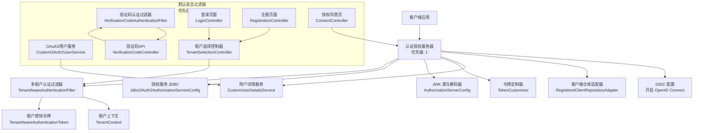
```mermaid
graph TB
Client["客户端应用"] --> AS["认证授权服务器<br/>优先级: 1"]
AS --> OIDC["OIDC 配置<br/>开启 OpenID Connect"]
AS --> Clients["客户端仓库适配器<br/>RegisteredClientRepositoryAdapter"]
AS --> Users["用户详情服务<br/>CustomUserDetailsService"]
AS --> Tokens["令牌定制器<br/>TokenCustomizer"]
AS --> JWK["JWK 源与解码器<br/>AuthorizationServerConfig"]
AS --> AuthzSvc["授权服务 JDBC<br/>JdbcOAuth2AuthorizationServiceConfig"]
AS --> TAF["多租户认证过滤器<br/>TenantAwareAuthenticationFilter"]
subgraph "默认安全过滤链<br/>优先级: 2"
VCFilter["验证码认证过滤器<br/>VerificationCodeAuthenticationFilter"]
OAuth2User["OAuth2用户服务<br/>CustomOAuth2UserService"]
LoginPage["登录页面<br/>LoginController"]
RegPage["注册页面<br/>RegistrationController"]
ConsentPage["授权同意页<br/>ConsentController"]
VCController["验证码API<br/>VerificationCodeController"]
TSelCtrl["租户选择控制器<br/>TenantSelectionController"]
end
TAF --> TenantCtx["租户上下文<br/>TenantContext"]
TAF --> TenantToken["租户感知令牌<br/>TenantAwareAuthenticationToken"]
VCFilter --> VCController
OAuth2User --> Users
LoginPage --> TSelCtrl
RegPage --> TSelCtrl
ConsentPage --> AS
VCController --> VCFilter
TSelCtrl --> TAF
```

**图表来源**
- [AuthorizationServerConfig.java:42-57](file://src/main/java/sso/oidc/infrastructure/config/AuthorizationServerConfig.java#L42-L57)
- [DefaultSecurityConfig.java:24-47](file://src/main/java/sso/oidc/infrastructure/config/DefaultSecurityConfig.java#L24-L47)
- [VerificationCodeAuthenticationFilter.java:18](file://src/main/java/sso/oidc/infrastructure/security/VerificationCodeAuthenticationFilter.java#L18)
- [CustomOAuth2UserService.java:18](file://src/main/java/sso/oidc/infrastructure/security/CustomOAuth2UserService.java#L18)
- [TenantAwareAuthenticationFilter.java:24-35](file://src/main/java/sso/oidc/infrastructure/security/TenantAwareAuthenticationFilter.java#L24-L35)

## 详细组件分析

### 认证授权服务器配置（AuthorizationServerConfig）
职责与要点：
- 启用默认安全与 OIDC 扩展，设置安全过滤链优先级为1
- 设置 HTML 登录入口与资源服务器 JWT 解码器
- 注册客户端仓库（内存或适配器）
- 提供 JWK 源与 JWT 解码器
- 配置授权服务器发行者地址
- **新增** 将 TenantAwareAuthenticationFilter 添加到认证服务器安全过滤链中

**更新** 重构后的配置类明确设置了安全过滤链优先级，确保认证授权服务器功能独立运行，不受其他过滤器影响。同时将多租户认证过滤器集成到认证服务器链中，确保租户上下文在所有认证流程中得到正确处理。

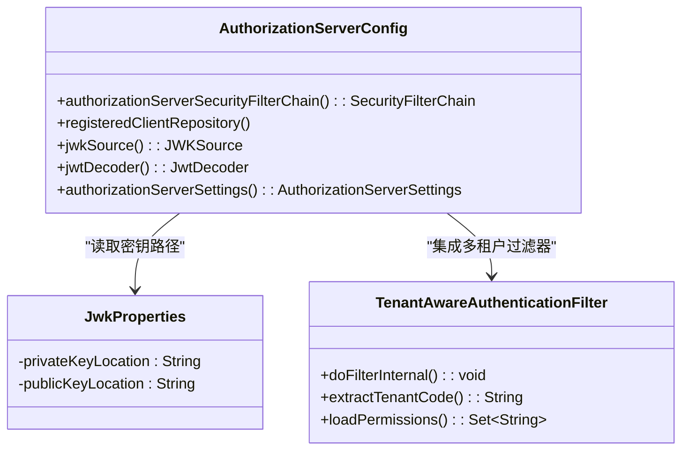
```mermaid
classDiagram
class AuthorizationServerConfig {
+authorizationServerSecurityFilterChain() : SecurityFilterChain
+registeredClientRepository()
+jwkSource() : JWKSource
+jwtDecoder() : JwtDecoder
+authorizationServerSettings() : AuthorizationServerSettings
}
class JwkProperties {
-privateKeyLocation : String
-publicKeyLocation : String
}
class TenantAwareAuthenticationFilter {
+doFilterInternal() : void
+extractTenantCode() : String
+loadPermissions() : Set~String~
}
AuthorizationServerConfig --> JwkProperties : "读取密钥路径"
AuthorizationServerConfig --> TenantAwareAuthenticationFilter : "集成多租户过滤器"
```

**图表来源**
- [AuthorizationServerConfig.java:42-92](file://src/main/java/sso/oidc/infrastructure/config/AuthorizationServerConfig.java#L42-L92)
- [JwkProperties.java:8-16](file://src/main/java/sso/oidc/infrastructure/config/JwkProperties.java#L8-L16)
- [TenantAwareAuthenticationFilter.java:50-74](file://src/main/java/sso/oidc/infrastructure/security/TenantAwareAuthenticationFilter.java#L50-L74)

**章节来源**
- [AuthorizationServerConfig.java:42-92](file://src/main/java/sso/oidc/infrastructure/config/AuthorizationServerConfig.java#L42-L92)

### 默认安全配置（DefaultSecurityConfig）
职责与要点：
- 定义默认安全过滤链，优先级为2，与认证授权服务器过滤链并行
- 放行静态资源与登录/注册页面，验证码相关路径也需放行
- 配置验证码认证过滤器，拦截特定URI的POST请求
- 配置OAuth2登录，使用自定义用户服务
- 表单登录页面、成功跳转与登出配置
- **新增** 配置 TenantAwareAuthenticationFilter，将其添加到 UsernamePasswordAuthenticationFilter 之后

**更新** 新增验证码认证过滤器和OAuth2用户服务配置，支持多种认证方式。同时将 TenantAwareAuthenticationFilter 集成到默认安全过滤链中，确保在所有认证流程中都能正确处理租户上下文。

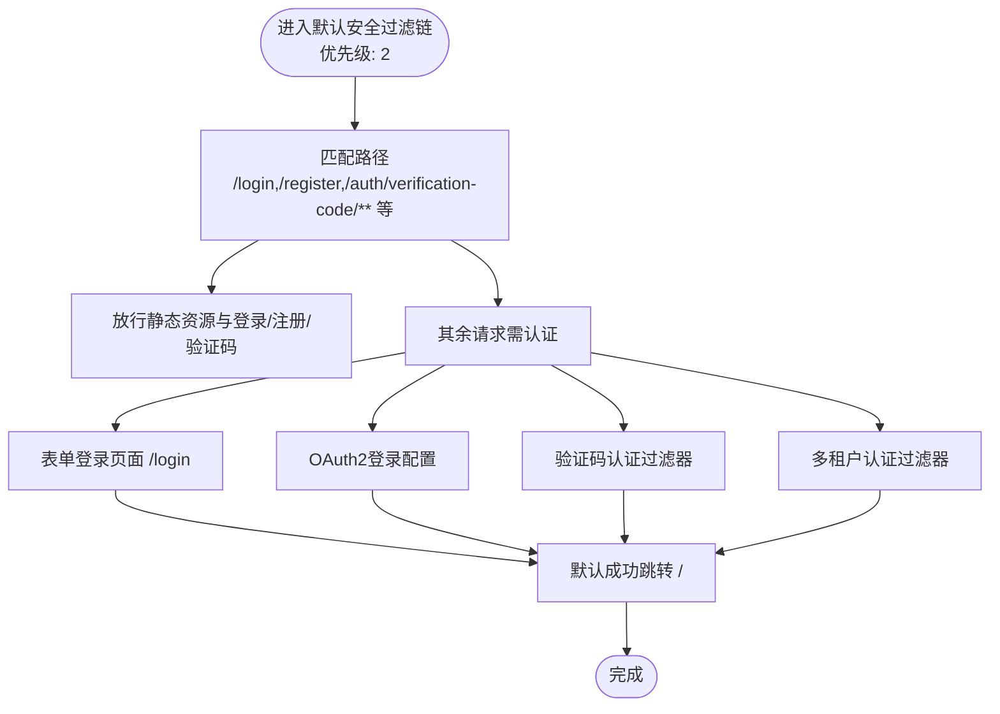
```mermaid
flowchart TD
Start(["进入默认安全过滤链<br/>优先级: 2"]) --> Matcher["匹配路径<br/>/login,/register,/auth/verification-code/** 等"]
Matcher --> Permit["放行静态资源与登录/注册/验证码"]
Matcher --> Auth["其余请求需认证"]
Auth --> FormLogin["表单登录页面 /login"]
Auth --> OAuth2Login["OAuth2登录配置"]
Auth --> VCFilter["验证码认证过滤器"]
Auth --> TAF["多租户认证过滤器"]
FormLogin --> Success["默认成功跳转 /"]
OAuth2Login --> Success
VCFilter --> Success
TAF --> Success
Success --> End(["完成"])
```

**图表来源**
- [DefaultSecurityConfig.java:24-47](file://src/main/java/sso/oidc/infrastructure/config/DefaultSecurityConfig.java#L24-L47)

**章节来源**
- [DefaultSecurityConfig.java:24-52](file://src/main/java/sso/oidc/infrastructure/config/DefaultSecurityConfig.java#L24-L52)

### 多租户认证过滤器（TenantAwareAuthenticationFilter）
职责与要点：
- 继承 OncePerRequestFilter，确保每个请求只处理一次
- 识别公共端点并跳过处理，避免对登录、注册等页面产生影响
- 检查认证状态，如果用户未认证则跳过处理
- 如果已经是 TenantAwareAuthenticationToken，则直接跳过
- **新增** 支持多种租户识别策略：X-Tenant-Code 头部、tenant 查询参数、子域名提取
- 从认证信息中提取人员ID，查找对应的租户账号
- 加载租户账号权限，创建租户感知认证令牌
- 更新 TenantContext，设置当前人员ID和租户账号ID
- 将租户感知令牌注册到 SecurityContext

**新增** 这是本次更新的核心组件，实现了完整的多租户认证上下文系统。

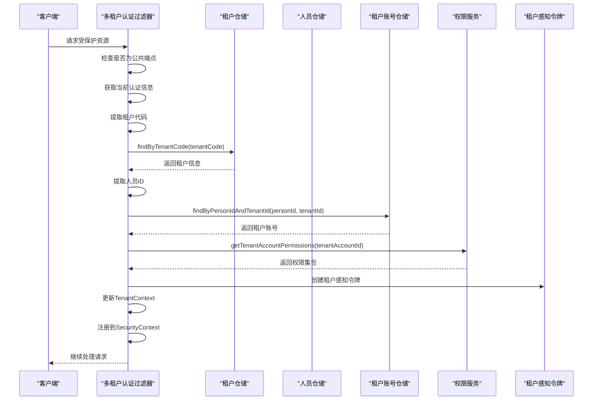
```mermaid
sequenceDiagram
participant Client as "客户端"
participant Filter as "多租户认证过滤器"
participant TenantRepo as "租户仓储"
participant PersonRepo as "人员仓储"
participant AccRepo as "租户账号仓储"
participant PermService as "权限服务"
participant Token as "租户感知令牌"
Client->>Filter : 请求受保护资源
Filter->>Filter : 检查是否为公共端点
Filter->>Filter : 获取当前认证信息
Filter->>Filter : 提取租户代码
Filter->>TenantRepo : findByTenantCode(tenantCode)
TenantRepo-->>Filter : 返回租户信息
Filter->>Filter : 提取人员ID
Filter->>AccRepo : findByPersonIdAndTenantId(personId, tenantId)
AccRepo-->>Filter : 返回租户账号
Filter->>PermService : getTenantAccountPermissions(tenantAccountId)
PermService-->>Filter : 返回权限集合
Filter->>Token : 创建租户感知令牌
Filter->>Filter : 更新TenantContext
Filter->>Filter : 注册到SecurityContext
Filter-->>Client : 继续处理请求
```

**图表来源**
- [TenantAwareAuthenticationFilter.java:75-127](file://src/main/java/sso/oidc/infrastructure/security/TenantAwareAuthenticationFilter.java#L75-L127)
- [TenantAwareAuthenticationToken.java:38-58](file://src/main/java/sso/oidc/infrastructure/security/TenantAwareAuthenticationToken.java#L38-L58)

**章节来源**
- [TenantAwareAuthenticationFilter.java:24-35](file://src/main/java/sso/oidc/infrastructure/security/TenantAwareAuthenticationFilter.java#L24-L35)
- [TenantAwareAuthenticationFilter.java:75-127](file://src/main/java/sso/oidc/infrastructure/security/TenantAwareAuthenticationFilter.java#L75-L127)
- [TenantAwareAuthenticationToken.java:38-58](file://src/main/java/sso/oidc/infrastructure/security/TenantAwareAuthenticationToken.java#L38-L58)

### 租户上下文管理（TenantContext）
职责与要点：
- 使用 ThreadLocal 存储当前请求的租户上下文信息
- 包括当前人员ID、当前租户ID、当前租户账号ID
- 提供设置和获取方法，支持清空操作
- 确保每个请求都有独立的租户上下文

**新增** 这是多租户系统的核心组件，为整个系统的多租户功能提供上下文支持。

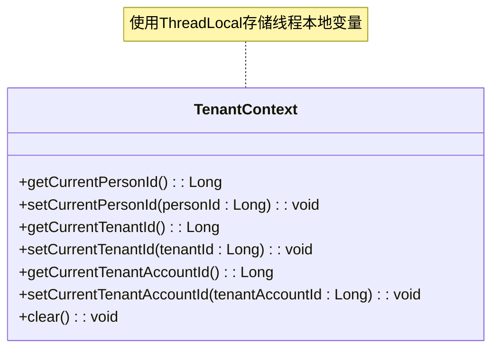
```mermaid
classDiagram
class TenantContext {
+getCurrentPersonId() : Long
+setCurrentPersonId(personId : Long) : void
+getCurrentTenantId() : Long
+setCurrentTenantId(tenantId : Long) : void
+getCurrentTenantAccountId() : Long
+setCurrentTenantAccountId(tenantAccountId : Long) : void
+clear() : void
}
note for TenantContext "使用ThreadLocal存储线程本地变量"
```

**图表来源**
- [TenantContext.java:7-44](file://src/main/java/sso/oidc/infrastructure/security/TenantContext.java#L7-L44)

**章节来源**
- [TenantContext.java:7-44](file://src/main/java/sso/oidc/infrastructure/security/TenantContext.java#L7-L44)

### 租户感知令牌（TenantAwareAuthenticationToken）
职责与要点：
- 扩展 Spring Security 的 Authentication 接口，支持多租户场景
- 包含租户ID、租户代码、权限集合等租户相关信息
- 支持从现有认证信息创建带租户上下文的令牌
- 提供 registerToContext 方法，将令牌注册到 SecurityContext 并更新 TenantContext
- 提供 clearContext 方法，清理 SecurityContext 和 TenantContext

**新增** 这是多租户认证系统的关键组件，扩展了标准认证令牌以支持租户上下文。

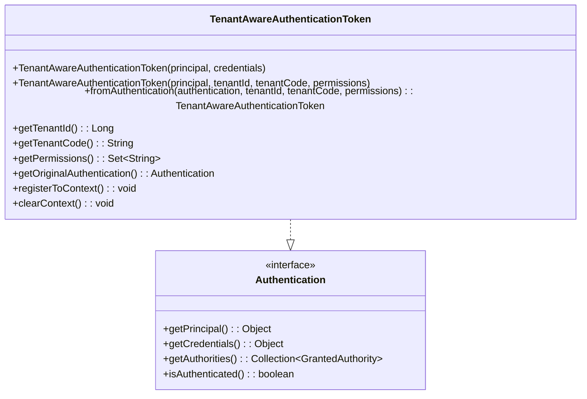
```mermaid
classDiagram
class TenantAwareAuthenticationToken {
+TenantAwareAuthenticationToken(principal, credentials)
+TenantAwareAuthenticationToken(principal, tenantId, tenantCode, permissions)
+fromAuthentication(authentication, tenantId, tenantCode, permissions) : TenantAwareAuthenticationToken
+getTenantId() : Long
+getTenantCode() : String
+getPermissions() : Set~String~
+getOriginalAuthentication() : Authentication
+registerToContext() : void
+clearContext() : void
}
class Authentication {
<<interface>>
+getPrincipal() : Object
+getCredentials() : Object
+getAuthorities() : Collection~GrantedAuthority~
+isAuthenticated() : boolean
}
TenantAwareAuthenticationToken ..|> Authentication
```

**图表来源**
- [TenantAwareAuthenticationToken.java:11-131](file://src/main/java/sso/oidc/infrastructure/security/TenantAwareAuthenticationToken.java#L11-L131)

**章节来源**
- [TenantAwareAuthenticationToken.java:11-131](file://src/main/java/sso/oidc/infrastructure/security/TenantAwareAuthenticationToken.java#L11-L131)

### 租户拦截器（TenantInterceptor）
职责与要点：
- 实现 HandlerInterceptor 接口，在请求处理前后填充和清理租户上下文
- 支持从请求头 X-Tenant-Id 或查询参数 tenant_id 提取租户ID
- 在 preHandle 方法中设置 TenantContext
- 在 afterCompletion 方法中清理租户上下文
- 确保每个请求都有正确的租户上下文

**新增** 这是多租户系统的辅助组件，支持基于请求头的租户上下文提取。

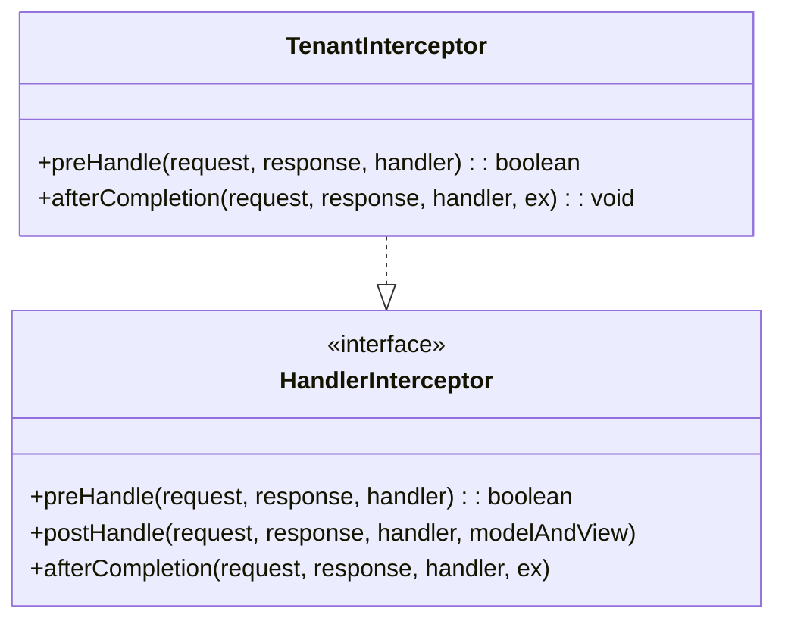
```mermaid
classDiagram
class TenantInterceptor {
+preHandle(request, response, handler) : boolean
+afterCompletion(request, response, handler, ex) : void
}
class HandlerInterceptor {
<<interface>>
+preHandle(request, response, handler) : boolean
+postHandle(request, response, handler, modelAndView)
+afterCompletion(request, response, handler, ex)
}
TenantInterceptor ..|> HandlerInterceptor
```

**图表来源**
- [TenantInterceptor.java:17-50](file://src/main/java/sso/oidc/infrastructure/security/TenantInterceptor.java#L17-L50)

**章节来源**
- [TenantInterceptor.java:17-50](file://src/main/java/sso/oidc/infrastructure/security/TenantInterceptor.java#L17-L50)

### 验证码认证过滤器（VerificationCodeAuthenticationFilter）
职责与要点：
- 继承OncePerRequestFilter，确保每个请求只处理一次
- 仅拦截`/auth/verification-code/login`的POST请求
- 支持短信验证码（type=sms）和邮箱验证码（type=email）两种认证方式
- 调用应用服务进行验证码验证和用户认证
- 成功时设置认证上下文，失败时返回相应HTTP状态码

**更新** 这是本次更新的核心组件，提供了灵活的验证码认证能力。

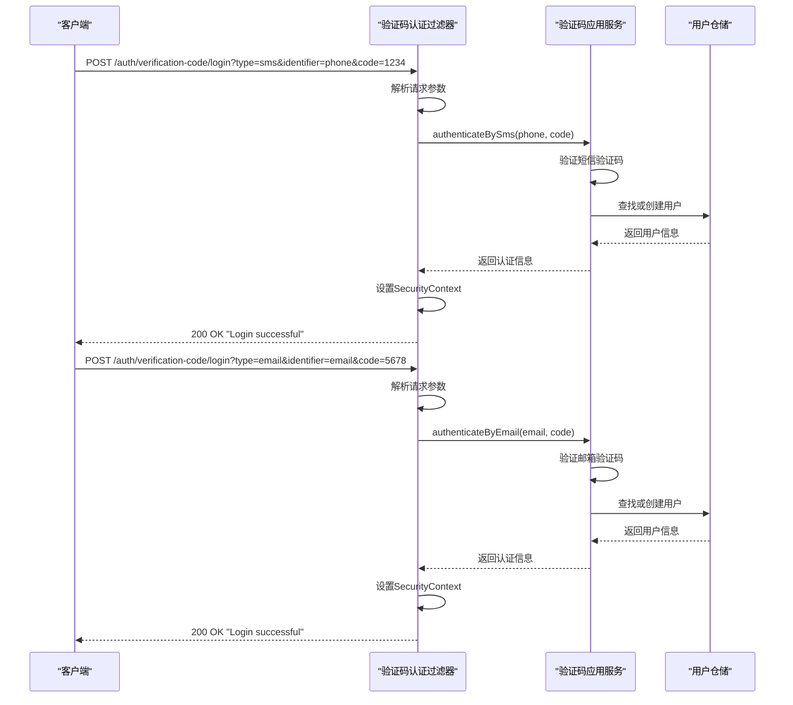
```mermaid
sequenceDiagram
participant Client as "客户端"
participant Filter as "验证码认证过滤器"
participant Service as "验证码应用服务"
participant UserRepo as "用户仓储"
Client->>Filter : POST /auth/verification-code/login?type=sms&identifier=phone&code=1234
Filter->>Filter : 解析请求参数
Filter->>Service : authenticateBySms(phone, code)
Service->>Service : 验证短信验证码
Service->>UserRepo : 查找或创建用户
UserRepo-->>Service : 返回用户信息
Service-->>Filter : 返回认证信息
Filter->>Filter : 设置SecurityContext
Filter-->>Client : 200 OK "Login successful"
Client->>Filter : POST /auth/verification-code/login?type=email&identifier=email&code=5678
Filter->>Filter : 解析请求参数
Filter->>Service : authenticateByEmail(email, code)
Service->>Service : 验证邮箱验证码
Service->>UserRepo : 查找或创建用户
UserRepo-->>Service : 返回用户信息
Service-->>Filter : 返回认证信息
Filter->>Filter : 设置SecurityContext
Filter-->>Client : 200 OK "Login successful"
```

**图表来源**
- [VerificationCodeAuthenticationFilter.java:22-76](file://src/main/java/sso/oidc/infrastructure/security/VerificationCodeAuthenticationFilter.java#L22-L76)
- [VerificationCodeApplicationService.java:30-46](file://src/main/java/sso/oidc/application/service/VerificationCodeApplicationService.java#L30-L46)

**章节来源**
- [VerificationCodeAuthenticationFilter.java:18-76](file://src/main/java/sso/oidc/infrastructure/security/VerificationCodeAuthenticationFilter.java#L18-L76)
- [VerificationCodeApplicationService.java:15-57](file://src/main/java/sso/oidc/application/service/VerificationCodeApplicationService.java#L15-L57)

### 自定义OAuth2用户服务（CustomOAuth2UserService）
职责与要点：
- 继承DefaultOAuth2UserService，扩展OAuth2用户信息服务
- 根据不同提供商（钉钉、微信、默认）提取用户ID
- 查找或创建用户，支持邮箱关联已有用户
- 返回自定义OAuth2用户包装器，包含领域用户信息

**更新** 新增对多种第三方平台的支持，包括钉钉和微信的特殊属性处理。

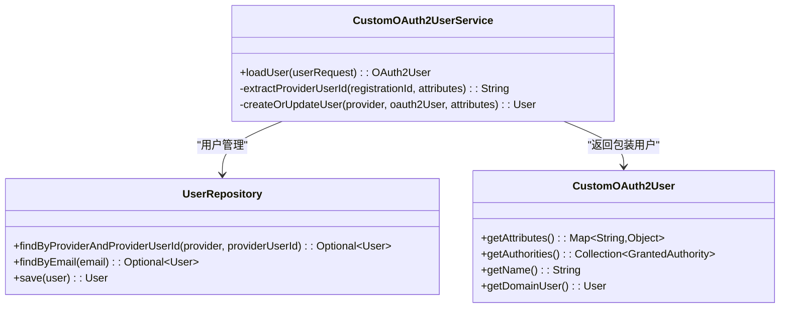
```mermaid
classDiagram
class CustomOAuth2UserService {
+loadUser(userRequest) : OAuth2User
-extractProviderUserId(registrationId, attributes) : String
-createOrUpdateUser(provider, oauth2User, attributes) : User
}
class CustomOAuth2User {
+getAttributes() : Map~String,Object~
+getAuthorities() : Collection~GrantedAuthority~
+getName() : String
+getDomainUser() : User
}
class UserRepository {
+findByProviderAndProviderUserId(provider, providerUserId) : Optional~User~
+findByEmail(email) : Optional~User~
+save(user) : User
}
CustomOAuth2UserService --> UserRepository : "用户管理"
CustomOAuth2UserService --> CustomOAuth2User : "返回包装用户"
```

**图表来源**
- [CustomOAuth2UserService.java:18-83](file://src/main/java/sso/oidc/infrastructure/security/CustomOAuth2UserService.java#L18-L83)
- [CustomOAuth2User.java:12-36](file://src/main/java/sso/oidc/infrastructure/security/CustomOAuth2User.java#L12-L36)

**章节来源**
- [CustomOAuth2UserService.java:18-83](file://src/main/java/sso/oidc/infrastructure/security/CustomOAuth2UserService.java#L18-L83)
- [CustomOAuth2User.java:12-36](file://src/main/java/sso/oidc/infrastructure/security/CustomOAuth2User.java#L12-L36)

### 自定义用户详情服务（CustomUserDetailsService）
职责与要点：
- 通过用户名查询领域用户
- 构建 Spring Security 用户对象，映射角色为权限
- 支持账户禁用与锁定状态

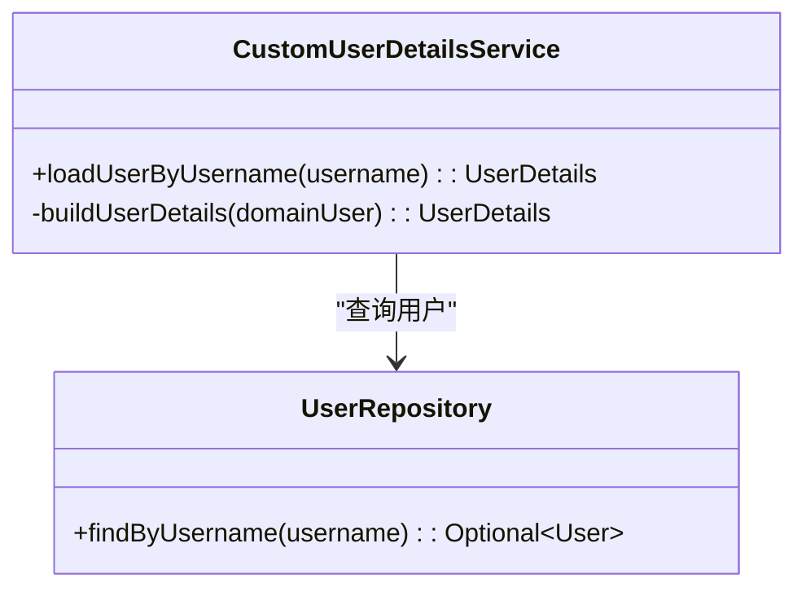
```mermaid
classDiagram
class CustomUserDetailsService {
+loadUserByUsername(username) : UserDetails
-buildUserDetails(domainUser) : UserDetails
}
class UserRepository {
+findByUsername(username) : Optional~User~
}
CustomUserDetailsService --> UserRepository : "查询用户"
```

**图表来源**
- [CustomUserDetailsService.java:16-35](file://src/main/java/sso/oidc/infrastructure/security/CustomUserDetailsService.java#L16-L35)

**章节来源**
- [CustomUserDetailsService.java:16-35](file://src/main/java/sso/oidc/infrastructure/security/CustomUserDetailsService.java#L16-L35)
- [User.java:16-35](file://src/main/java/sso/oidc/domain/model/entity/User.java#L16-L35)

### OAuth2 客户端注册适配器（RegisteredClientRepositoryAdapter）
职责与要点：
- 将领域侧 OAuth2Client 映射为 RegisteredClient
- 支持多种认证方式、授权类型、重定向 URI、作用域
- 支持令牌 TTL、PKCE、授权同意要求等设置

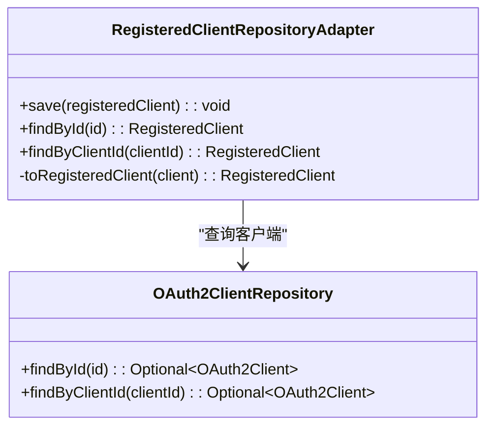
```mermaid
classDiagram
class RegisteredClientRepositoryAdapter {
+save(registeredClient) : void
+findById(id) : RegisteredClient
+findByClientId(clientId) : RegisteredClient
-toRegisteredClient(client) : RegisteredClient
}
class OAuth2ClientRepository {
+findById(id) : Optional~OAuth2Client~
+findByClientId(clientId) : Optional~OAuth2Client~
}
RegisteredClientRepositoryAdapter --> OAuth2ClientRepository : "查询客户端"
```

**图表来源**
- [RegisteredClientRepositoryAdapter.java:21-82](file://src/main/java/sso/oidc/infrastructure/security/RegisteredClientRepositoryAdapter.java#L21-L82)

**章节来源**
- [RegisteredClientRepositoryAdapter.java:21-82](file://src/main/java/sso/oidc/infrastructure/security/RegisteredClientRepositoryAdapter.java#L21-L82)

### 令牌定制器（TokenCustomizer）
职责与要点：
- 在 JWT 中添加自定义声明：邮箱、昵称、角色列表
- 通过 Principal 获取当前用户名并查询用户信息

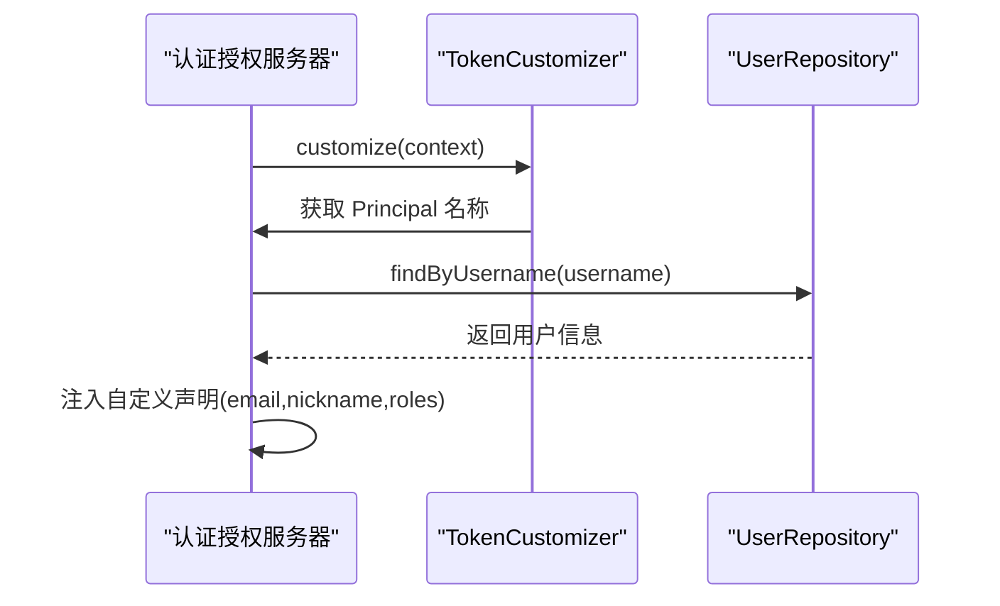
```mermaid
sequenceDiagram
participant AS as "认证授权服务器"
participant TC as "TokenCustomizer"
participant UR as "UserRepository"
AS->>TC : customize(context)
TC->>AS : 获取 Principal 名称
AS->>UR : findByUsername(username)
UR-->>AS : 返回用户信息
AS->>AS : 注入自定义声明(email,nickname,roles)
```

**图表来源**
- [TokenCustomizer.java:18-30](file://src/main/java/sso/oidc/infrastructure/security/TokenCustomizer.java#L18-L30)

**章节来源**
- [TokenCustomizer.java:14-32](file://src/main/java/sso/oidc/infrastructure/security/TokenCustomizer.java#L14-L32)

### 授权服务 JDBC 配置（JdbcOAuth2AuthorizationServiceConfig）
职责与要点：
- 使用 JDBC 持久化授权记录与授权同意
- 与 RegisteredClientRepository 协作

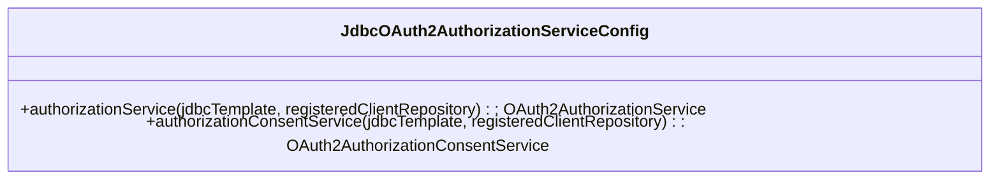
```mermaid
classDiagram
class JdbcOAuth2AuthorizationServiceConfig {
+authorizationService(jdbcTemplate, registeredClientRepository) : OAuth2AuthorizationService
+authorizationConsentService(jdbcTemplate, registeredClientRepository) : OAuth2AuthorizationConsentService
}
```

**图表来源**
- [JdbcOAuth2AuthorizationServiceConfig.java:13-27](file://src/main/java/sso/oidc/infrastructure/security/JdbcOAuth2AuthorizationServiceConfig.java#L13-L27)

**章节来源**
- [JdbcOAuth2AuthorizationServiceConfig.java:13-27](file://src/main/java/sso/oidc/infrastructure/security/JdbcOAuth2AuthorizationServiceConfig.java#L13-L27)

### 密码策略服务（PasswordPolicyService）
职责与要点：
- 校验密码长度与字符组成（大小写字母、数字）
- 提供强密码判断方法

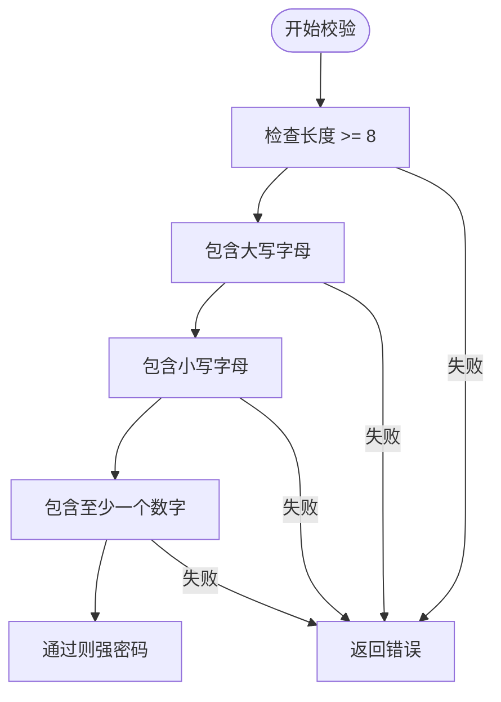
```mermaid
flowchart TD
Start(["开始校验"]) --> Len["检查长度 >= 8"]
Len --> Upper["包含大写字母"]
Upper --> Lower["包含小写字母"]
Lower --> Digit["包含至少一个数字"]
Digit --> Strong["通过则强密码"]
Len --> |失败| Fail["返回错误"]
Upper --> |失败| Fail
Lower --> |失败| Fail
Digit --> |失败| Fail
```

**图表来源**
- [PasswordPolicyService.java:11-24](file://src/main/java/sso/oidc/domain/service/PasswordPolicyService.java#L11-L24)

**章节来源**
- [PasswordPolicyService.java:9-34](file://src/main/java/sso/oidc/domain/service/PasswordPolicyService.java#L9-L34)

### Web 页面与控制器
职责与要点：
- 登录控制器：提供登录页面路由
- 注册控制器：表单提交与异常处理
- 授权同意控制器：展示客户端与作用域供用户确认
- 验证码控制器：提供短信和邮箱验证码发送API
- **新增** 租户选择控制器：处理多租户用户的租户选择和切换

**更新** 新增验证码控制器，支持RESTful的验证码发送接口。新增租户选择控制器，支持用户在多租户间的切换。

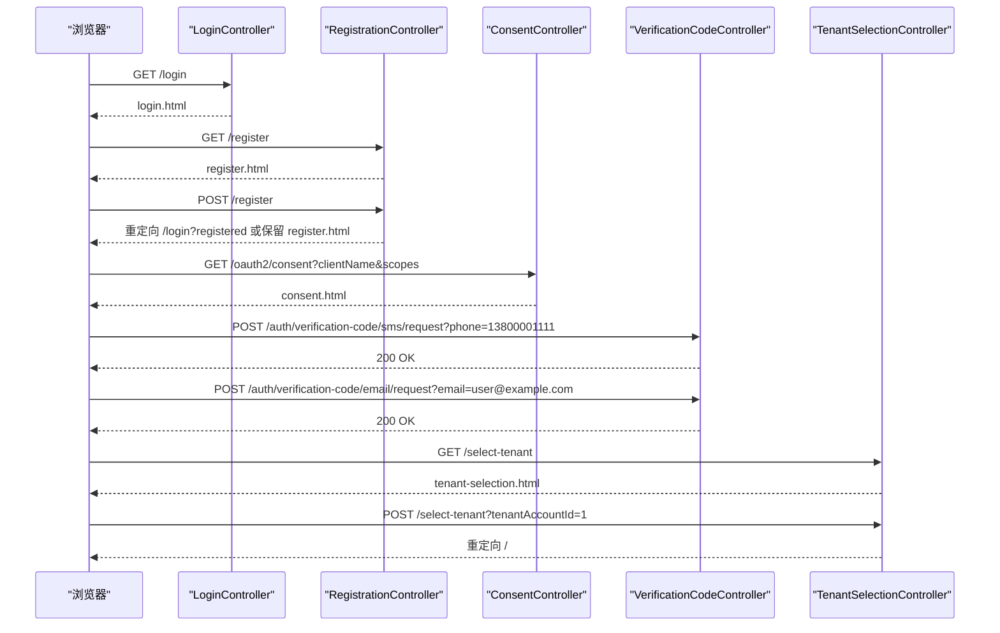
```mermaid
sequenceDiagram
participant Browser as "浏览器"
participant LC as "LoginController"
participant RC as "RegistrationController"
participant CC as "ConsentController"
participant VC as "VerificationCodeController"
participant TS as "TenantSelectionController"
Browser->>LC : GET /login
LC-->>Browser : login.html
Browser->>RC : GET /register
RC-->>Browser : register.html
Browser->>RC : POST /register
RC-->>Browser : 重定向 /login?registered 或保留 register.html
Browser->>CC : GET /oauth2/consent?clientName&scopes
CC-->>Browser : consent.html
Browser->>VC : POST /auth/verification-code/sms/request?phone=13800001111
VC-->>Browser : 200 OK
Browser->>VC : POST /auth/verification-code/email/request?email=user@example.com
VC-->>Browser : 200 OK
Browser->>TS : GET /select-tenant
TS-->>Browser : tenant-selection.html
Browser->>TS : POST /select-tenant?tenantAccountId=1
TS-->>Browser : 重定向 /
```

**图表来源**
- [LoginController.java:9-12](file://src/main/java/sso/oidc/interfaces/web/LoginController.java#L9-L12)
- [RegistrationController.java:21-41](file://src/main/java/sso/oidc/interfaces/web/RegistrationController.java#L21-L41)
- [ConsentController.java:12-17](file://src/main/java/sso/oidc/interfaces/web/ConsentController.java#L12-L17)
- [VerificationCodeController.java:15-25](file://src/main/java/sso/oidc/interfaces/rest/VerificationCodeController.java#L15-L25)
- [TenantSelectionController.java:26-53](file://src/main/java/sso/oidc/interfaces/web/TenantSelectionController.java#L26-L53)

**章节来源**
- [LoginController.java:9-12](file://src/main/java/sso/oidc/interfaces/web/LoginController.java#L9-L12)
- [RegistrationController.java:27-41](file://src/main/java/sso/oidc/interfaces/web/RegistrationController.java#L27-L41)
- [ConsentController.java:12-17](file://src/main/java/sso/oidc/interfaces/web/ConsentController.java#L12-L17)
- [VerificationCodeController.java:15-25](file://src/main/java/sso/oidc/interfaces/rest/VerificationCodeController.java#L15-L25)
- [TenantSelectionController.java:26-53](file://src/main/java/sso/oidc/interfaces/web/TenantSelectionController.java#L26-L53)

## 依赖分析
- 配置类之间的依赖：AuthorizationServerConfig 依赖 JwkProperties 和 TenantAwareAuthenticationFilter；两个安全配置类共同作用于不同优先级的过滤链
- 用户与客户端适配：CustomUserDetailsService 依赖 UserRepository；RegisteredClientRepositoryAdapter 依赖 OAuth2ClientRepository
- 验证码认证：VerificationCodeAuthenticationFilter 依赖 VerificationCodeApplicationService；VerificationCodeApplicationService 依赖 VerificationCodeService 和 UserRepository
- OAuth2登录：CustomOAuth2UserService 依赖 UserRepository
- 令牌定制：TokenCustomizer 依赖 UserRepository
- 授权服务：JdbcOAuth2AuthorizationServiceConfig 依赖 JdbcTemplate 与 RegisteredClientRepository
- **多租户系统**：TenantAwareAuthenticationFilter 依赖 TenantRepository、TenantAccountRepository、TenantAccountRoleApplicationService 和 PersonRepository；TenantAwareAuthenticationToken 依赖 SecurityContextHolder 和 TenantContext
- Web 控roller：依赖应用服务与领域模型

**更新** 新增多租户认证和OAuth2登录相关的依赖关系。

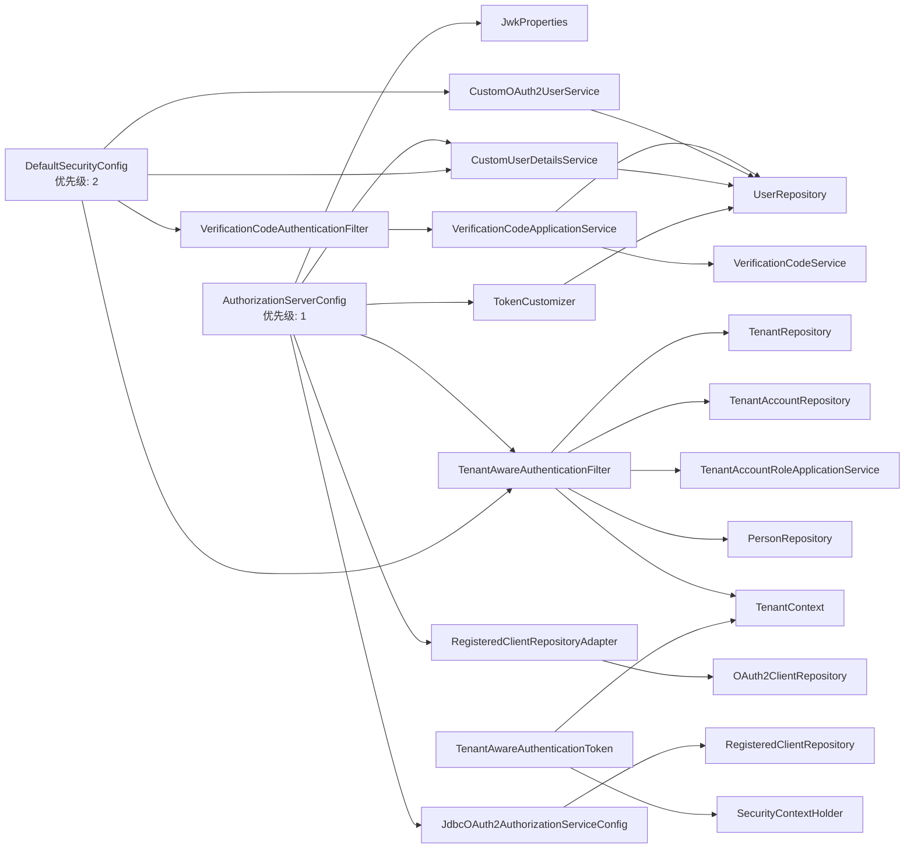
```mermaid
graph LR
AS["AuthorizationServerConfig<br/>优先级: 1"] --> JP["JwkProperties"]
AS --> UDS["CustomUserDetailsService"]
AS --> RRA["RegisteredClientRepositoryAdapter"]
AS --> TC["TokenCustomizer"]
AS --> JOS["JdbcOAuth2AuthorizationServiceConfig"]
AS --> TAF["TenantAwareAuthenticationFilter"]
DSC["DefaultSecurityConfig<br/>优先级: 2"] --> UDS
DSC --> COUS["CustomOAuth2UserService"]
DSC --> VCAF["VerificationCodeAuthenticationFilter"]
DSC --> TAF
TAF --> TR["TenantRepository"]
TAF --> TAR["TenantAccountRepository"]
TAF --> TARS["TenantAccountRoleApplicationService"]
TAF --> PR["PersonRepository"]
TAF --> TCtx["TenantContext"]
TAT["TenantAwareAuthenticationToken"] --> SC["SecurityContextHolder"]
TAT --> TCtx
VCAF --> VCAS["VerificationCodeApplicationService"]
VCAS --> VCS["VerificationCodeService"]
VCAS --> UR["UserRepository"]
COUS --> UR
UDS --> UR
RRA --> OCR["OAuth2ClientRepository"]
TC --> UR
JOS --> RCR["RegisteredClientRepository"]
```

**图表来源**
- [AuthorizationServerConfig.java:38-92](file://src/main/java/sso/oidc/infrastructure/config/AuthorizationServerConfig.java#L38-L92)
- [DefaultSecurityConfig.java:21-52](file://src/main/java/sso/oidc/infrastructure/config/DefaultSecurityConfig.java#L21-L52)
- [VerificationCodeAuthenticationFilter.java:20](file://src/main/java/sso/oidc/infrastructure/security/VerificationCodeAuthenticationFilter.java#L20)
- [VerificationCodeApplicationService.java:19-20](file://src/main/java/sso/oidc/application/service/VerificationCodeApplicationService.java#L19)
- [TenantAwareAuthenticationFilter.java:45-48](file://src/main/java/sso/oidc/infrastructure/security/TenantAwareAuthenticationFilter.java#L45-L48)
- [TenantAwareAuthenticationToken.java:14-22](file://src/main/java/sso/oidc/infrastructure/security/TenantAwareAuthenticationToken.java#L14-L22)

**章节来源**
- [AuthorizationServerConfig.java:38-92](file://src/main/java/sso/oidc/infrastructure/config/AuthorizationServerConfig.java#L38-L92)
- [DefaultSecurityConfig.java:21-52](file://src/main/java/sso/oidc/infrastructure/config/DefaultSecurityConfig.java#L21-L52)
- [VerificationCodeAuthenticationFilter.java:20](file://src/main/java/sso/oidc/infrastructure/security/VerificationCodeAuthenticationFilter.java#L20)
- [VerificationCodeApplicationService.java:19-20](file://src/main/java/sso/oidc/application/service/VerificationCodeApplicationService.java#L19)
- [TenantAwareAuthenticationFilter.java:45-48](file://src/main/java/sso/oidc/infrastructure/security/TenantAwareAuthenticationFilter.java#L45-L48)
- [TenantAwareAuthenticationToken.java:14-22](file://src/main/java/sso/oidc/infrastructure/security/TenantAwareAuthenticationToken.java#L14-L22)

## 性能考虑
- 连接池与会话存储：数据源连接超时、空闲时间、最大生命周期配置；Redis 存储会话
- 数据库与 Flyway：DDL 校验、迁移脚本位置与编码
- Jackson 时区与日期格式：统一序列化行为
- 指标与追踪：暴露健康、指标、Prometheus，Zipkin 链路追踪
- **验证码认证性能**：验证码服务应使用高效的缓存机制，避免频繁的数据库查询
- **多租户性能优化**：租户上下文应使用 ThreadLocal，避免跨线程传递；权限加载应使用缓存机制；租户识别应优先使用头部参数而非数据库查询

**更新** 新增多租户认证相关的性能考虑。

## 故障排查指南
常见问题与处理：
- 认证失败：捕获认证异常，返回未授权响应
- 权限不足：捕获访问拒绝异常，返回禁止响应
- 参数校验失败：收集字段错误，返回 400
- 业务异常：根据业务异常状态码返回对应错误
- 未预期异常：记录错误日志，返回 500
- **验证码认证失败**：检查验证码服务配置，确认短信/邮箱服务可用性
- **多租户认证失败**：检查租户代码是否正确，确认租户状态为 ACTIVE，验证用户在目标租户中的账号状态，检查权限加载是否正常

**更新** 新增多租户认证相关的故障排查指导。

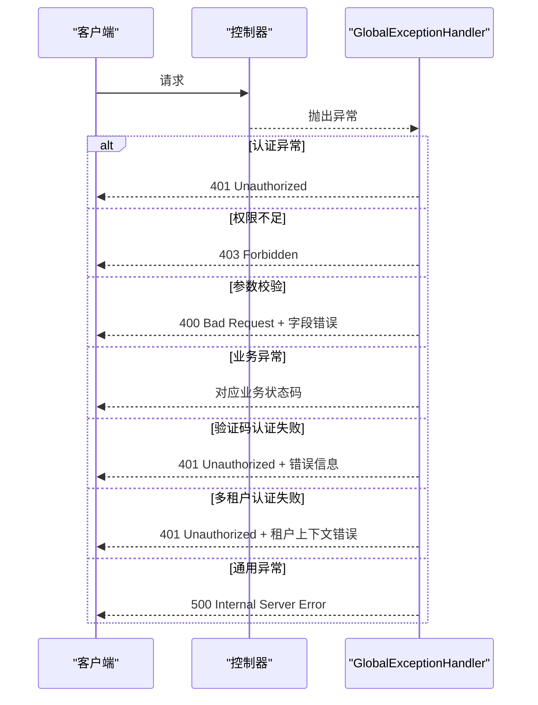
```mermaid
sequenceDiagram
participant Client as "客户端"
participant Ctrl as "控制器"
participant Handler as "GlobalExceptionHandler"
Client->>Ctrl : 请求
Ctrl-->>Handler : 抛出异常
alt 认证异常
Handler-->>Client : 401 Unauthorized
else 权限不足
Handler-->>Client : 403 Forbidden
else 参数校验
Handler-->>Client : 400 Bad Request + 字段错误
else 业务异常
Handler-->>Client : 对应业务状态码
else 验证码认证失败
Handler-->>Client : 401 Unauthorized + 错误信息
else 多租户认证失败
Handler-->>Client : 401 Unauthorized + 租户上下文错误
else 通用异常
Handler-->>Client : 500 Internal Server Error
end
```

**图表来源**
- [GlobalExceptionHandler.java:20-65](file://src/main/java/sso/oidc/interfaces/rest/common/GlobalExceptionHandler.java#L20-L65)

**章节来源**
- [GlobalExceptionHandler.java:20-65](file://src/main/java/sso/oidc/interfaces/rest/common/GlobalExceptionHandler.java#L20-L65)

## 结论
本系统通过 Spring Authorization Server 提供了完整的 OIDC/OAuth2.0 能力，结合自定义用户详情服务、客户端适配器、令牌定制器与 JDBC 授权服务，实现了可扩展的认证授权方案。**更新后的双安全过滤链架构**显著增强了系统的灵活性，支持多种认证方式包括传统的用户名密码认证、验证码认证和第三方OAuth2认证。新增的多租户认证上下文系统通过 TenantAwareAuthenticationFilter 和 TenantContext 实现了租户级别的认证和权限管理，支持多种租户识别策略和权限注入机制。配合 Web 页面与全局异常处理，满足生产环境对用户体验与可观测性的要求。建议在生产环境中完善密钥轮换、审计日志、速率限制与更严格的密码策略，并确保验证码服务和多租户系统的高可用性。

## 附录

### OIDC 与 OAuth 2.0 流程概览
- 授权码流程（Authorization Code）：客户端引导用户到授权服务器，用户授权后回调携带授权码，服务端交换令牌
- 刷新令牌：使用刷新令牌换取新的访问令牌
- JWT 令牌：基于 JWK 签发与校验，支持自定义声明

**更新** 新增多租户认证流程说明。

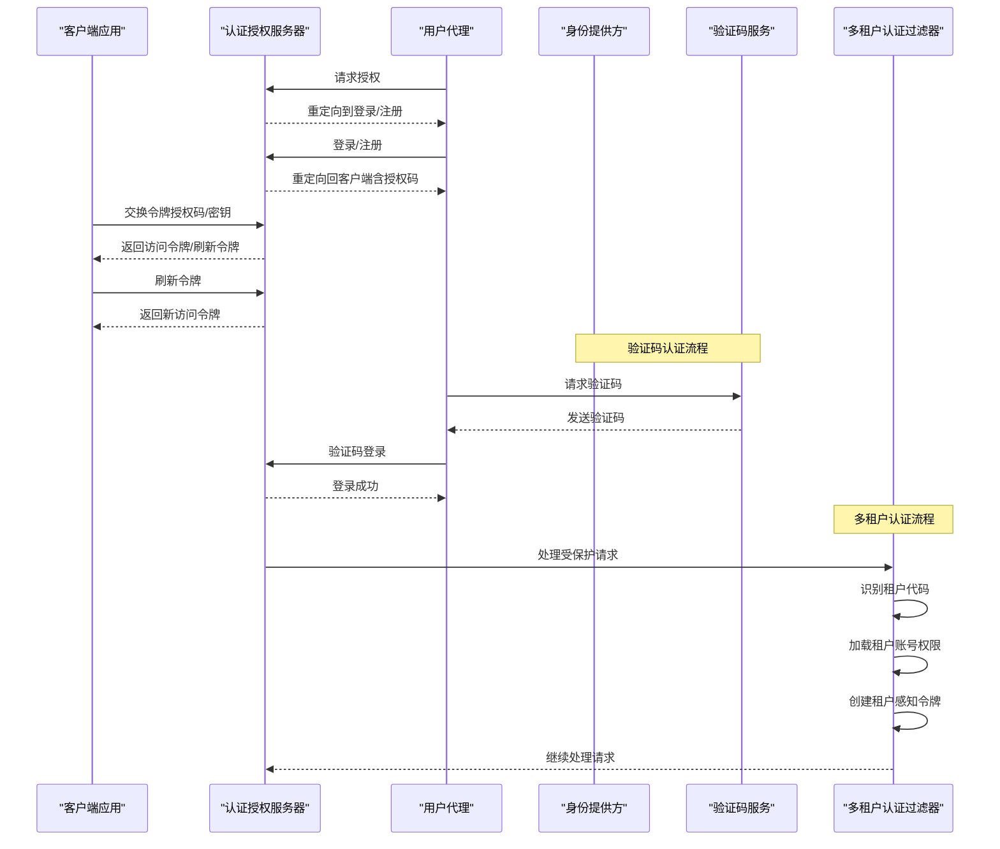
```mermaid
sequenceDiagram
participant Client as "客户端应用"
participant AS as "认证授权服务器"
participant UA as "用户代理"
participant ID as "身份提供方"
participant VC as "验证码服务"
participant TAF as "多租户认证过滤器"
UA->>AS : 请求授权
AS-->>UA : 重定向到登录/注册
UA->>AS : 登录/注册
AS-->>UA : 重定向回客户端含授权码
Client->>AS : 交换令牌授权码/密钥
AS-->>Client : 返回访问令牌/刷新令牌
Client->>AS : 刷新令牌
AS-->>Client : 返回新访问令牌
Note over VC,ID : 验证码认证流程
UA->>VC : 请求验证码
VC-->>UA : 发送验证码
UA->>AS : 验证码登录
AS-->>UA : 登录成功
Note over TAF : 多租户认证流程
AS->>TAF : 处理受保护请求
TAF->>TAF : 识别租户代码
TAF->>TAF : 加载租户账号权限
TAF->>TAF : 创建租户感知令牌
TAF-->>AS : 继续处理请求
```

### 配置项与环境变量参考
- 数据源与 JPA：数据库连接、方言、DDL 行为
- Redis：会话存储主机、端口、密码
- JWK：RSA 私钥与公钥路径
- Issuer URI：OIDC 发行者地址
- Swagger/OpenAPI：接口文档路径
- 管理端点：健康、指标、追踪配置
- **验证码配置**：短信和邮箱验证码服务开关与参数
- **多租户配置**：租户代码识别策略、权限缓存配置

**更新** 新增多租户相关的配置项说明。

**章节来源**
- [application.yml:9-18](file://src/main/resources/application.yml#L9-L18)
- [application.yml:28-35](file://src/main/resources/application.yml#L28-L35)
- [application.yml:48-55](file://src/main/resources/application.yml#L48-L55)
- [application.yml:57-78](file://src/main/resources/application.yml#L57-L78)
- [application.yml:66-74](file://src/main/resources/application.yml#L66-L74)

### 多租户数据库模式
系统使用以下多租户相关表结构：

- **t_tenant**：租户表，包含租户代码、名称、状态、最大用户数等
- **t_person**：人员表，替代原有的用户表，包含个人身份信息
- **t_tenant_account**：租户账号表，关联人员和租户，支持多租户用户关系
- **t_tenant_account_role_mapping**：租户账号-角色映射表，支持租户级别的权限分配
- **t_person_external_login**：人员第三方登录表，支持OAuth2登录

**更新** 新增多租户数据库模式说明。

**章节来源**
- [V3__add_multi_tenant_support.sql:12-314](file://src/main/resources/db/migration/V3__add_multi_tenant_support.sql#L12-L314)