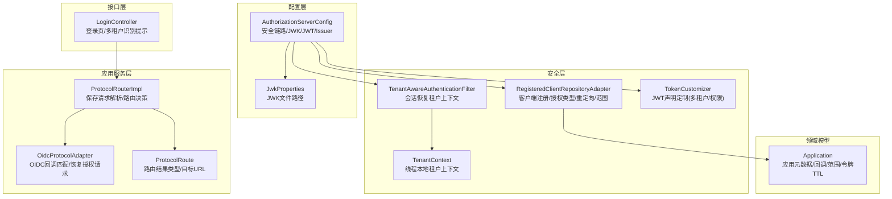
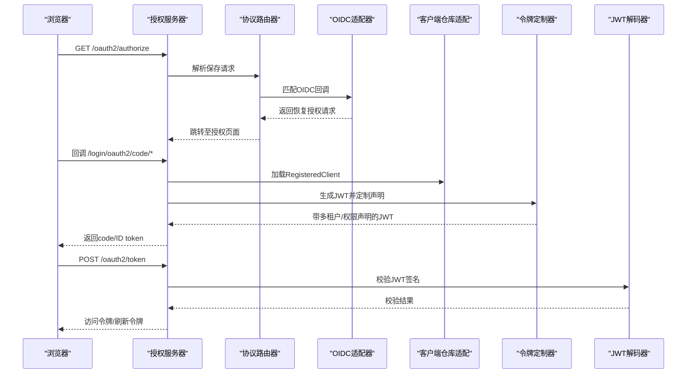
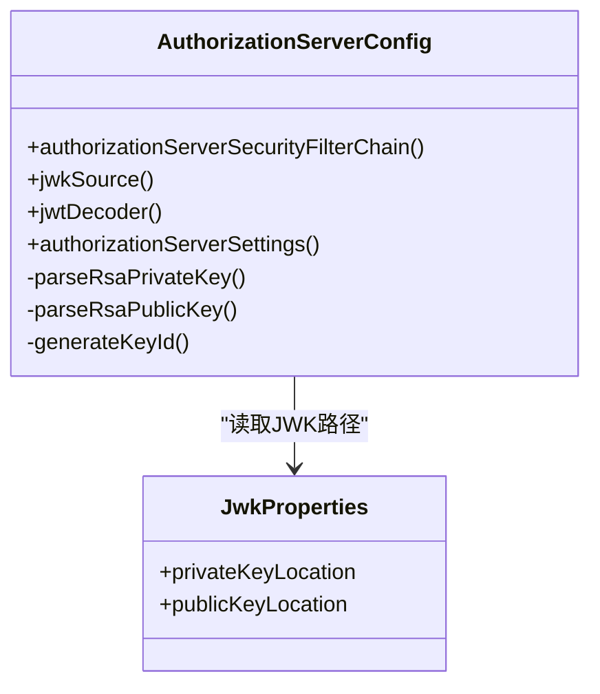
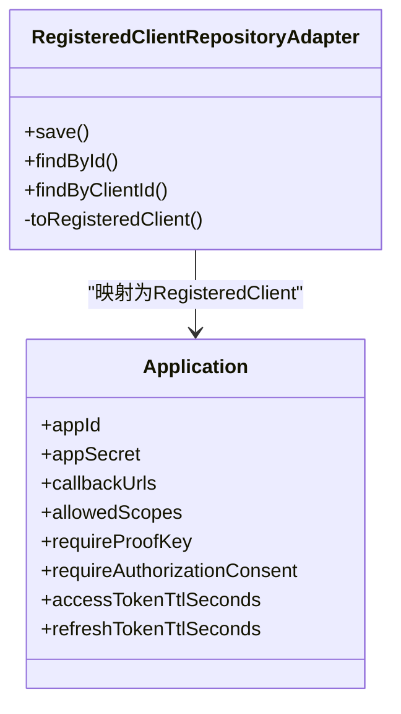
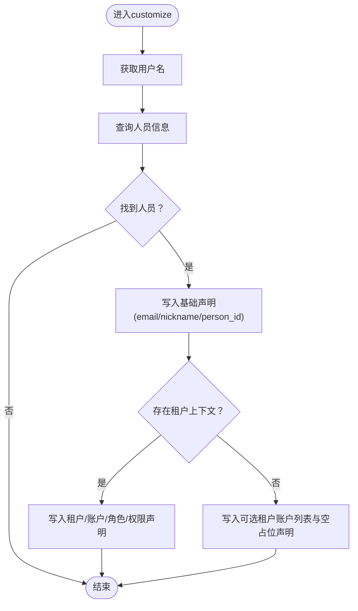
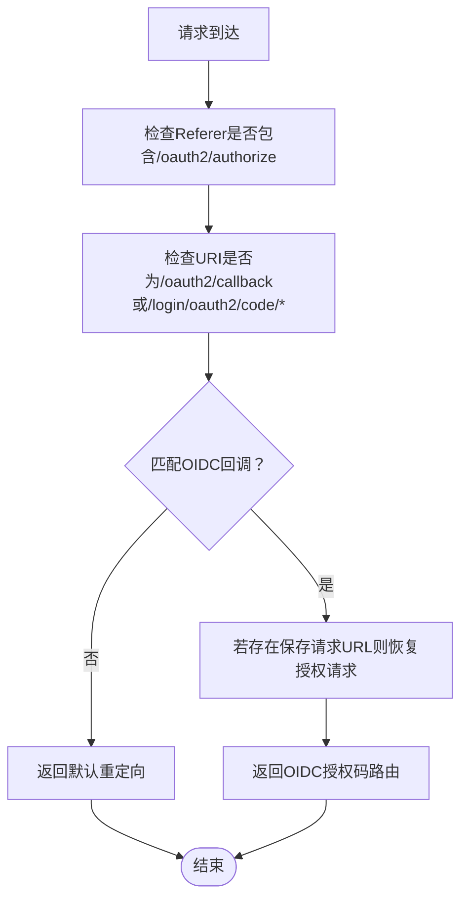
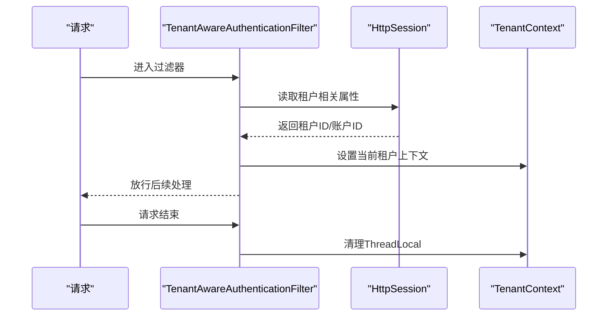
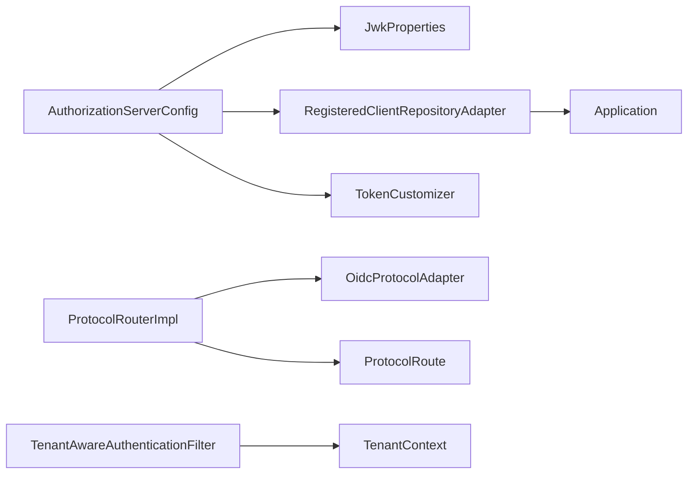

# OAuth2/OIDC协议实现

<cite>
**本文引用的文件**
- [AuthorizationServerConfig.java](file://iam-auth-server/src/main/java/iam/platform/auth/infrastructure/config/AuthorizationServerConfig.java)
- [JwkProperties.java](file://iam-auth-server/src/main/java/iam/platform/auth/infrastructure/config/JwkProperties.java)
- [RegisteredClientRepositoryAdapter.java](file://iam-auth-server/src/main/java/iam/platform/auth/infrastructure/security/RegisteredClientRepositoryAdapter.java)
- [TokenCustomizer.java](file://iam-auth-server/src/main/java/iam/platform/auth/infrastructure/security/TokenCustomizer.java)
- [TenantAwareAuthenticationFilter.java](file://iam-auth-server/src/main/java/iam/platform/auth/infrastructure/security/TenantAwareAuthenticationFilter.java)
- [TenantContext.java](file://iam-auth-server/src/main/java/iam/platform/auth/infrastructure/security/TenantContext.java)
- [OidcProtocolAdapter.java](file://iam-auth-server/src/main/java/iam/platform/auth/application/service/routing/OidcProtocolAdapter.java)
- [ProtocolRouterImpl.java](file://iam-auth-server/src/main/java/iam/platform/auth/application/service/routing/ProtocolRouterImpl.java)
- [ProtocolRoute.java](file://iam-auth-server/src/main/java/iam/platform/auth/application/service/routing/ProtocolRoute.java)
- [LoginController.java](file://iam-auth-server/src/main/java/iam/platform/auth/interfaces/web/LoginController.java)
- [application.yml](file://iam-auth-server/src/main/resources/application.yml)
- [Application.java](file://iam-auth-server/src/main/java/iam/platform/auth/domain/model/entity/Application.java)
</cite>

## 目录
1. [引言](#引言)
2. [项目结构](#项目结构)
3. [核心组件](#核心组件)
4. [架构总览](#架构总览)
5. [详细组件分析](#详细组件分析)
6. [依赖关系分析](#依赖关系分析)
7. [性能考虑](#性能考虑)
8. [故障排查指南](#故障排查指南)
9. [结论](#结论)
10. [附录](#附录)

## 引言
本文件面向实现与维护基于Spring Security OAuth2 Authorization Server的统一认证平台，系统性梳理OAuth2/OIDC协议在本项目中的落地方式，涵盖客户端注册、令牌颁发、JWK管理、OIDC协议适配器、授权端点/令牌端点/用户信息端点的路由与行为、JWT生成与校验、刷新机制、以及多租户上下文注入等关键能力。同时提供扩展新授权类型与自定义令牌内容的实践路径与最佳实践。

## 项目结构
本项目采用多模块分层架构，认证服务位于iam-auth-server模块，核心围绕以下层次组织：
- 配置层：负责Authorization Server安全链路、JWK源、JWT解码器、授权服务器设置等
- 安全层：客户端仓库适配、租户上下文过滤器、令牌定制器、统一认证过滤器等
- 应用服务层：协议路由与适配器，根据来源协议（OIDC/SAML/CAS）进行分流
- 接口层：登录页控制器、REST接口等
- 领域模型：应用实体及凭证、令牌设置等

图表来源
- [AuthorizationServerConfig.java:44-99](file://iam-auth-server/src/main/java/iam/platform/auth/infrastructure/config/AuthorizationServerConfig.java#L44-L99)
- [JwkProperties.java:12-15](file://iam-auth-server/src/main/java/iam/platform/auth/infrastructure/config/JwkProperties.java#L12-L15)
- [RegisteredClientRepositoryAdapter.java:20-99](file://iam-auth-server/src/main/java/iam/platform/auth/infrastructure/security/RegisteredClientRepositoryAdapter.java#L20-L99)
- [TenantAwareAuthenticationFilter.java:23-67](file://iam-auth-server/src/main/java/iam/platform/auth/infrastructure/security/TenantAwareAuthenticationFilter.java#L23-L67)
- [TenantContext.java:7-44](file://iam-auth-server/src/main/java/iam/platform/auth/infrastructure/security/TenantContext.java#L7-L44)
- [TokenCustomizer.java:27-126](file://iam-auth-server/src/main/java/iam/platform/auth/infrastructure/security/TokenCustomizer.java#L27-L126)
- [ProtocolRouterImpl.java:20-51](file://iam-auth-server/src/main/java/iam/platform/auth/application/service/routing/ProtocolRouterImpl.java#L20-L51)
- [OidcProtocolAdapter.java:12-39](file://iam-auth-server/src/main/java/iam/platform/auth/application/service/routing/OidcProtocolAdapter.java#L12-L39)
- [ProtocolRoute.java:8-73](file://iam-auth-server/src/main/java/iam/platform/auth/application/service/routing/ProtocolRoute.java#L8-L73)
- [LoginController.java:17-57](file://iam-auth-server/src/main/java/iam/platform/auth/interfaces/web/LoginController.java#L17-L57)
- [Application.java:21-211](file://iam-auth-server/src/main/java/iam/platform/auth/domain/model/entity/Application.java#L21-L211)

章节来源
- [AuthorizationServerConfig.java:44-99](file://iam-auth-server/src/main/java/iam/platform/auth/infrastructure/config/AuthorizationServerConfig.java#L44-L99)
- [application.yml:81-88](file://iam-auth-server/src/main/resources/application.yml#L81-L88)

## 核心组件
- 授权服务器配置：启用默认安全策略、开启OIDC、配置异常入口点、资源服务器JWT、添加租户感知过滤器、构建JWK源与JWT解码器、设置issuer
- 客户端注册适配：从应用实体映射到RegisteredClient，支持授权码、密码两种授权类型，动态注入重定向URI、作用域、PKCE/同意页要求、令牌TTL
- JWK与JWT：从PEM加载RSA密钥，生成稳定KeyID，构建ImmutableJWKSet并注入JwtDecoder
- 令牌定制：向JWT载荷注入用户基础信息与多租户上下文，若未选择租户则暴露可选租户账户列表
- 协议路由：通过保存请求URL判断来源协议，OIDC适配器识别授权回调并恢复授权请求
- 租户上下文：线程本地存储当前人员、租户与租户账户ID，过滤器在请求间恢复上下文

章节来源
- [AuthorizationServerConfig.java:44-99](file://iam-auth-server/src/main/java/iam/platform/auth/infrastructure/config/AuthorizationServerConfig.java#L44-L99)
- [RegisteredClientRepositoryAdapter.java:47-99](file://iam-auth-server/src/main/java/iam/platform/auth/infrastructure/security/RegisteredClientRepositoryAdapter.java#L47-L99)
- [TokenCustomizer.java:33-126](file://iam-auth-server/src/main/java/iam/platform/auth/infrastructure/security/TokenCustomizer.java#L33-L126)
- [OidcProtocolAdapter.java:14-39](file://iam-auth-server/src/main/java/iam/platform/auth/application/service/routing/OidcProtocolAdapter.java#L14-L39)
- [ProtocolRouterImpl.java:24-50](file://iam-auth-server/src/main/java/iam/platform/auth/application/service/routing/ProtocolRouterImpl.java#L24-L50)
- [TenantAwareAuthenticationFilter.java:28-66](file://iam-auth-server/src/main/java/iam/platform/auth/infrastructure/security/TenantAwareAuthenticationFilter.java#L28-L66)
- [TenantContext.java:7-44](file://iam-auth-server/src/main/java/iam/platform/auth/infrastructure/security/TenantContext.java#L7-L44)

## 架构总览
下图展示了OAuth2/OIDC在本系统的端到端交互：浏览器发起授权请求，授权服务器根据SavedRequest判断来源协议，OIDC适配器恢复授权请求；客户端注册来自应用实体；令牌签发时注入多租户声明；JWT解码器用于资源服务器校验。

图表来源
- [ProtocolRouterImpl.java:24-50](file://iam-auth-server/src/main/java/iam/platform/auth/application/service/routing/ProtocolRouterImpl.java#L24-L50)
- [OidcProtocolAdapter.java:14-39](file://iam-auth-server/src/main/java/iam/platform/auth/application/service/routing/OidcProtocolAdapter.java#L14-L39)
- [RegisteredClientRepositoryAdapter.java:29-45](file://iam-auth-server/src/main/java/iam/platform/auth/infrastructure/security/RegisteredClientRepositoryAdapter.java#L29-L45)
- [TokenCustomizer.java:33-126](file://iam-auth-server/src/main/java/iam/platform/auth/infrastructure/security/TokenCustomizer.java#L33-L126)
- [AuthorizationServerConfig.java:90-93](file://iam-auth-server/src/main/java/iam/platform/auth/infrastructure/config/AuthorizationServerConfig.java#L90-L93)

## 详细组件分析

### 授权服务器配置（AuthorizationServerConfig）
- 启用默认OAuth2 Authorization Server安全策略与OIDC配置
- 配置HTML请求的登录入口点，资源服务器使用JWT
- 注入租户感知过滤器，确保后续请求能恢复租户上下文
- 从配置属性加载RSA私钥/公钥PEM，解析为Java密钥对象
- 基于公钥生成稳定KeyID（SHA-256指纹前128位），避免重启导致JWKS缓存失效
- 构建ImmutableJWKSet并注入JwtDecoder，供资源服务器校验JWT

图表来源
- [AuthorizationServerConfig.java:44-128](file://iam-auth-server/src/main/java/iam/platform/auth/infrastructure/config/AuthorizationServerConfig.java#L44-L128)
- [JwkProperties.java:12-15](file://iam-auth-server/src/main/java/iam/platform/auth/infrastructure/config/JwkProperties.java#L12-L15)

章节来源
- [AuthorizationServerConfig.java:44-128](file://iam-auth-server/src/main/java/iam/platform/auth/infrastructure/config/AuthorizationServerConfig.java#L44-L128)
- [application.yml:81-88](file://iam-auth-server/src/main/resources/application.yml#L81-L88)

### 客户端注册适配（RegisteredClientRepositoryAdapter）
- 将应用实体映射为RegisteredClient，支持：
  - 授权类型：授权码（标准OIDC/OAuth2）、密码（遗留第三方应用）
  - 重定向URI：来自应用回调地址集合
  - 作用域：来自应用允许的作用域集合
  - 客户端认证方法：默认client_secret_basic
  - 客户端设置：是否需要PKCE、是否需要授权同意页
  - 令牌设置：访问令牌与刷新令牌TTL来自应用配置
- 客户端密钥编码策略：开发环境支持明文前缀，生产建议BCrypt或结合KMS

图表来源
- [RegisteredClientRepositoryAdapter.java:20-99](file://iam-auth-server/src/main/java/iam/platform/auth/infrastructure/security/RegisteredClientRepositoryAdapter.java#L20-L99)
- [Application.java:21-211](file://iam-auth-server/src/main/java/iam/platform/auth/domain/model/entity/Application.java#L21-L211)

章节来源
- [RegisteredClientRepositoryAdapter.java:29-99](file://iam-auth-server/src/main/java/iam/platform/auth/infrastructure/security/RegisteredClientRepositoryAdapter.java#L29-L99)
- [Application.java:48-178](file://iam-auth-server/src/main/java/iam/platform/auth/domain/model/entity/Application.java#L48-L178)

### 令牌定制（TokenCustomizer）
- 在JWT声明中注入：
  - 用户基础信息：邮箱、昵称、人员ID
  - 多租户上下文：当已建立租户上下文时，注入租户ID、租户账户ID、租户编码、员工号、角色列表、权限集合
  - 未选择租户时：注入可选租户账户列表，以及空占位声明，便于客户端引导用户选择
- 权限加载失败时降级为空列表，保证令牌生成不阻断

图表来源
- [TokenCustomizer.java:33-126](file://iam-auth-server/src/main/java/iam/platform/auth/infrastructure/security/TokenCustomizer.java#L33-L126)

章节来源
- [TokenCustomizer.java:33-126](file://iam-auth-server/src/main/java/iam/platform/auth/infrastructure/security/TokenCustomizer.java#L33-L126)

### OIDC协议适配器（OidcProtocolAdapter）
- 通过Referer与回调URI判断是否为OAuth2/OIDC授权回调
- 若存在保存的授权请求URL，则恢复授权请求；否则返回默认重定向
- 与协议路由器配合，决定最终跳转目标

图表来源
- [OidcProtocolAdapter.java:14-39](file://iam-auth-server/src/main/java/iam/platform/auth/application/service/routing/OidcProtocolAdapter.java#L14-L39)
- [ProtocolRouterImpl.java:24-50](file://iam-auth-server/src/main/java/iam/platform/auth/application/service/routing/ProtocolRouterImpl.java#L24-L50)

章节来源
- [OidcProtocolAdapter.java:14-39](file://iam-auth-server/src/main/java/iam/platform/auth/application/service/routing/OidcProtocolAdapter.java#L14-L39)
- [ProtocolRouterImpl.java:24-50](file://iam-auth-server/src/main/java/iam/platform/auth/application/service/routing/ProtocolRouterImpl.java#L24-L50)

### 租户上下文与过滤器（TenantAwareAuthenticationFilter/TenantContext）
- 过滤器在请求开始时尝试从会话恢复租户上下文（租户ID、租户账户ID、人员ID），并在请求结束后清理ThreadLocal，防止内存泄漏
- TenantContext提供静态方法设置/获取当前请求的租户上下文

图表来源
- [TenantAwareAuthenticationFilter.java:28-66](file://iam-auth-server/src/main/java/iam/platform/auth/infrastructure/security/TenantAwareAuthenticationFilter.java#L28-L66)
- [TenantContext.java:7-44](file://iam-auth-server/src/main/java/iam/platform/auth/infrastructure/security/TenantContext.java#L7-L44)

章节来源
- [TenantAwareAuthenticationFilter.java:28-66](file://iam-auth-server/src/main/java/iam/platform/auth/infrastructure/security/TenantAwareAuthenticationFilter.java#L28-L66)
- [TenantContext.java:7-44](file://iam-auth-server/src/main/java/iam/platform/auth/infrastructure/security/TenantContext.java#L7-L44)

### 登录控制器（LoginController）
- 提供登录页，支持从子域名或查询参数识别租户，若未识别则在登录后引导用户选择租户
- 传递错误/退出状态到视图

章节来源
- [LoginController.java:19-57](file://iam-auth-server/src/main/java/iam/platform/auth/interfaces/web/LoginController.java#L19-L57)

## 依赖关系分析
- 授权服务器配置依赖JWK属性与租户过滤器，构建JWK源与JWT解码器
- 客户端仓库适配依赖应用仓储，将应用实体转换为RegisteredClient
- 令牌定制依赖人员仓储、租户账户仓储与角色服务，注入多租户声明
- 协议路由依赖多个适配器，按来源协议进行分流

图表来源
- [AuthorizationServerConfig.java:44-99](file://iam-auth-server/src/main/java/iam/platform/auth/infrastructure/config/AuthorizationServerConfig.java#L44-L99)
- [RegisteredClientRepositoryAdapter.java:20-99](file://iam-auth-server/src/main/java/iam/platform/auth/infrastructure/security/RegisteredClientRepositoryAdapter.java#L20-L99)
- [TokenCustomizer.java:27-126](file://iam-auth-server/src/main/java/iam/platform/auth/infrastructure/security/TokenCustomizer.java#L27-L126)
- [ProtocolRouterImpl.java:20-51](file://iam-auth-server/src/main/java/iam/platform/auth/application/service/routing/ProtocolRouterImpl.java#L20-L51)
- [OidcProtocolAdapter.java:12-39](file://iam-auth-server/src/main/java/iam/platform/auth/application/service/routing/OidcProtocolAdapter.java#L12-L39)
- [ProtocolRoute.java:8-73](file://iam-auth-server/src/main/java/iam/platform/auth/application/service/routing/ProtocolRoute.java#L8-L73)
- [TenantAwareAuthenticationFilter.java:23-67](file://iam-auth-server/src/main/java/iam/platform/auth/infrastructure/security/TenantAwareAuthenticationFilter.java#L23-L67)
- [TenantContext.java:7-44](file://iam-auth-server/src/main/java/iam/platform/auth/infrastructure/security/TenantContext.java#L7-L44)

章节来源
- [AuthorizationServerConfig.java:44-99](file://iam-auth-server/src/main/java/iam/platform/auth/infrastructure/config/AuthorizationServerConfig.java#L44-L99)
- [RegisteredClientRepositoryAdapter.java:20-99](file://iam-auth-server/src/main/java/iam/platform/auth/infrastructure/security/RegisteredClientRepositoryAdapter.java#L20-L99)
- [TokenCustomizer.java:27-126](file://iam-auth-server/src/main/java/iam/platform/auth/infrastructure/security/TokenCustomizer.java#L27-L126)
- [ProtocolRouterImpl.java:20-51](file://iam-auth-server/src/main/java/iam/platform/auth/application/service/routing/ProtocolRouterImpl.java#L20-L51)
- [OidcProtocolAdapter.java:12-39](file://iam-auth-server/src/main/java/iam/platform/auth/application/service/routing/OidcProtocolAdapter.java#L12-L39)
- [ProtocolRoute.java:8-73](file://iam-auth-server/src/main/java/iam/platform/auth/application/service/routing/ProtocolRoute.java#L8-L73)
- [TenantAwareAuthenticationFilter.java:23-67](file://iam-auth-server/src/main/java/iam/platform/auth/infrastructure/security/TenantAwareAuthenticationFilter.java#L23-L67)
- [TenantContext.java:7-44](file://iam-auth-server/src/main/java/iam/platform/auth/infrastructure/security/TenantContext.java#L7-L44)

## 性能考虑
- JWK KeyID稳定性：通过公钥指纹生成固定KeyID，避免重启导致客户端JWKS缓存失效，降低资源服务器校验开销
- 令牌定制降级：权限加载异常时以空列表降级，避免令牌生成阻断
- 会话存储：租户上下文通过会话恢复，减少重复鉴权与查询成本
- 数据库连接池：合理配置连接池大小与超时，避免高并发下的连接争用

## 故障排查指南
- OIDC回调无法恢复授权请求
  - 检查协议适配器匹配逻辑与保存请求URL
  - 确认协议路由器是否正确解析SavedRequest
- 令牌缺少多租户声明
  - 确认租户上下文是否已在会话中设置
  - 检查令牌定制器是否成功注入声明
- JWT解码失败
  - 校验JWK源是否正确加载PEM文件
  - 确认issuer与客户端配置一致
- 客户端无法获取令牌
  - 校验RegisteredClient授权类型与客户端认证方法
  - 确认重定向URI与作用域配置

章节来源
- [OidcProtocolAdapter.java:14-39](file://iam-auth-server/src/main/java/iam/platform/auth/application/service/routing/OidcProtocolAdapter.java#L14-L39)
- [ProtocolRouterImpl.java:24-50](file://iam-auth-server/src/main/java/iam/platform/auth/application/service/routing/ProtocolRouterImpl.java#L24-L50)
- [TokenCustomizer.java:33-126](file://iam-auth-server/src/main/java/iam/platform/auth/infrastructure/security/TokenCustomizer.java#L33-L126)
- [AuthorizationServerConfig.java:90-93](file://iam-auth-server/src/main/java/iam/platform/auth/infrastructure/config/AuthorizationServerConfig.java#L90-L93)
- [RegisteredClientRepositoryAdapter.java:47-99](file://iam-auth-server/src/main/java/iam/platform/auth/infrastructure/security/RegisteredClientRepositoryAdapter.java#L47-L99)

## 结论
本实现以Spring Security OAuth2 Authorization Server为核心，结合应用实体驱动的客户端注册、稳定KeyID的JWK管理、多租户上下文注入的JWT定制、以及基于SavedRequest的协议路由，形成了完整的OAuth2/OIDC能力闭环。通过明确的扩展点（新增授权类型、自定义令牌内容）与安全最佳实践，可在保障安全性的同时灵活适配业务需求。

## 附录

### OAuth2/OIDC端点与参数说明（基于本实现的行为）
- 授权端点
  - 路径：/oauth2/authorize
  - 行为：由协议路由器与适配器根据SavedRequest判断来源协议，OIDC场景下恢复授权请求
- 令牌端点
  - 路径：/oauth2/token
  - 行为：接收授权码换取访问令牌/刷新令牌；本实现支持授权码与密码两种授权类型
- 用户信息端点
  - 行为：本实现启用OIDC配置，但未显式暴露独立用户信息端点；用户信息通过令牌定制器注入JWT声明

章节来源
- [AuthorizationServerConfig.java:50-51](file://iam-auth-server/src/main/java/iam/platform/auth/infrastructure/config/AuthorizationServerConfig.java#L50-L51)
- [RegisteredClientRepositoryAdapter.java:74-78](file://iam-auth-server/src/main/java/iam/platform/auth/infrastructure/security/RegisteredClientRepositoryAdapter.java#L74-L78)

### JWT声明与刷新机制
- 声明定制：令牌定制器在JWT中注入用户基础信息与多租户上下文；未选择租户时提供可选租户账户列表
- 刷新机制：客户端注册适配器将刷新令牌TTL配置注入RegisteredClient，令牌端点据此发放刷新令牌

章节来源
- [TokenCustomizer.java:33-126](file://iam-auth-server/src/main/java/iam/platform/auth/infrastructure/security/TokenCustomizer.java#L33-L126)
- [RegisteredClientRepositoryAdapter.java:90-96](file://iam-auth-server/src/main/java/iam/platform/auth/infrastructure/security/RegisteredClientRepositoryAdapter.java#L90-L96)

### 扩展新授权类型与自定义令牌内容
- 新增授权类型
  - 在客户端注册适配器中为RegisteredClient添加授权类型
  - 确保客户端认证方法与重定向URI配置正确
- 自定义令牌内容
  - 在令牌定制器中扩展JWT声明，注意异常降级与性能影响
  - 如需引入外部权限服务，建议异步加载并设置超时

章节来源
- [RegisteredClientRepositoryAdapter.java:74-78](file://iam-auth-server/src/main/java/iam/platform/auth/infrastructure/security/RegisteredClientRepositoryAdapter.java#L74-L78)
- [TokenCustomizer.java:33-126](file://iam-auth-server/src/main/java/iam/platform/auth/infrastructure/security/TokenCustomizer.java#L33-L126)