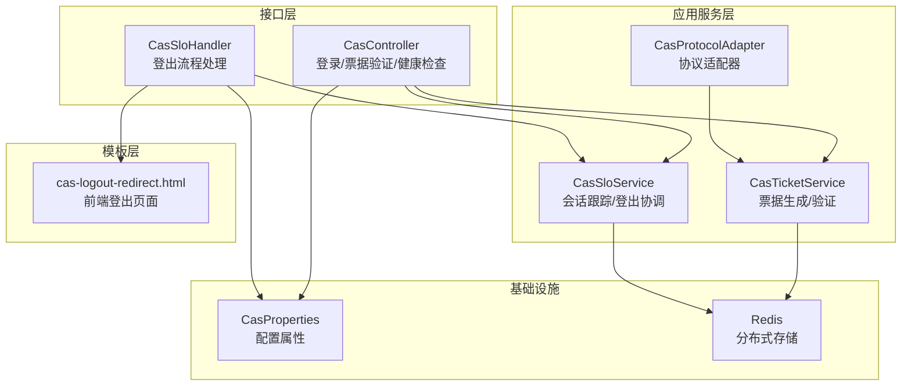
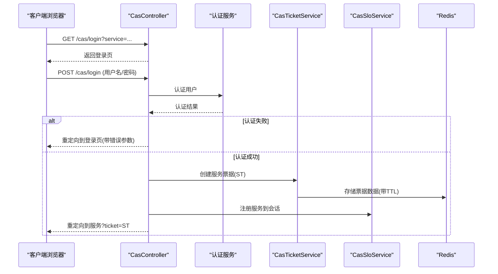
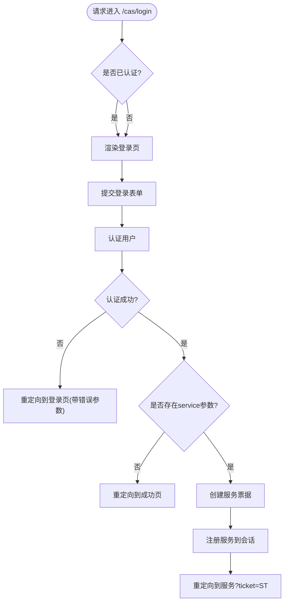
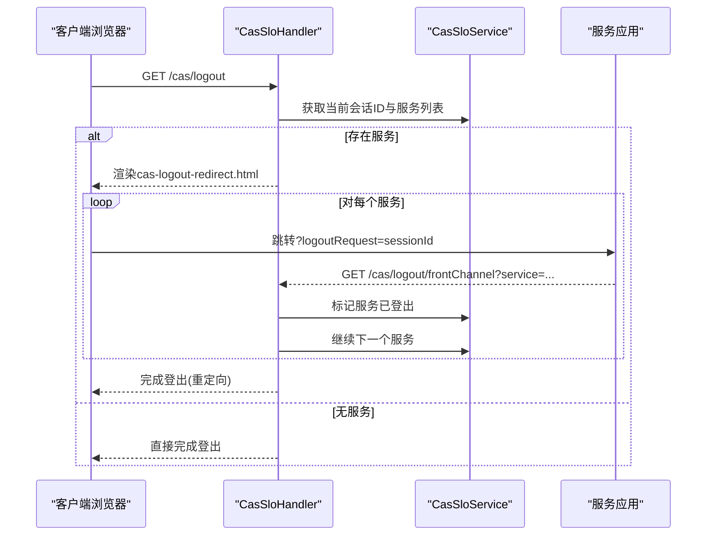
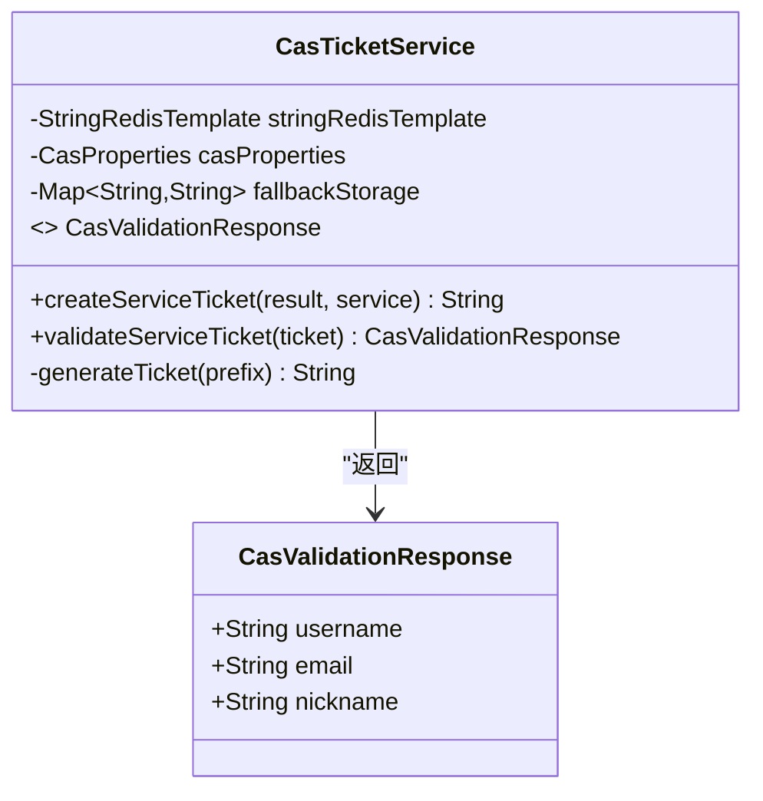
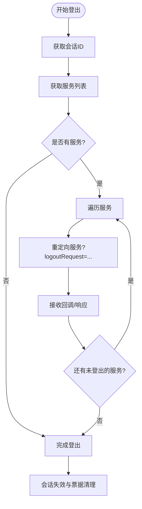
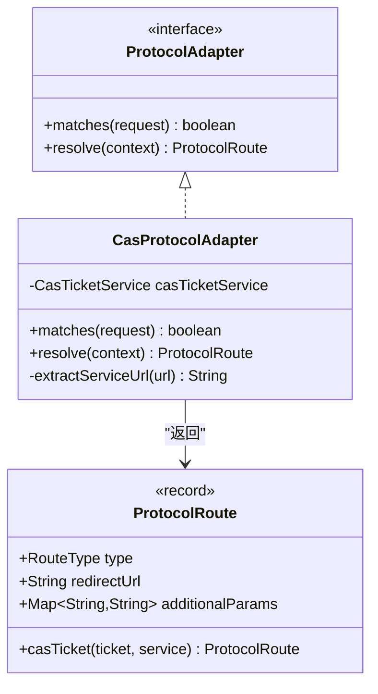
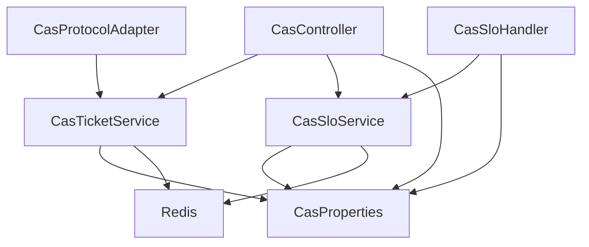

# CAS控制器

<cite>
**本文档引用的文件**
- [CasController.java](file://iam-auth-server/src/main/java/iam/platform/auth/interfaces/web/CasController.java)
- [CasSloHandler.java](file://iam-auth-server/src/main/java/iam/platform/auth/interfaces/web/CasSloHandler.java)
- [CasTicketService.java](file://iam-auth-server/src/main/java/iam/platform/auth/application/service/CasTicketService.java)
- [CasSloService.java](file://iam-auth-server/src/main/java/iam/platform/auth/application/service/CasSloService.java)
- [CasProtocolAdapter.java](file://iam-auth-server/src/main/java/iam/platform/auth/application/service/routing/CasProtocolAdapter.java)
- [ProtocolAdapter.java](file://iam-auth-server/src/main/java/iam/platform/auth/application/service/routing/ProtocolAdapter.java)
- [ProtocolRoute.java](file://iam-auth-server/src/main/java/iam/platform/auth/application/service/routing/ProtocolRoute.java)
- [CasProperties.java](file://iam-auth-server/src/main/java/iam/platform/auth/infrastructure/config/CasProperties.java)
- [application.yml](file://iam-auth-server/src/main/resources/application.yml)
- [cas-logout-redirect.html](file://iam-auth-server/src/main/resources/templates/cas-logout-redirect.html)
- [login.html](file://iam-auth-server/src/main/resources/templates/login.html)
</cite>

## 目录
1. [简介](#简介)
2. [项目结构](#项目结构)
3. [核心组件](#核心组件)
4. [架构概览](#架构概览)
5. [详细组件分析](#详细组件分析)
6. [依赖关系分析](#依赖关系分析)
7. [性能考量](#性能考量)
8. [故障排除指南](#故障排除指南)
9. [结论](#结论)
10. [附录](#附录)

## 简介
本文件为IAM平台中CAS控制器的详细技术文档，全面阐述CasController的实现细节，包括：
- CAS协议支持：登录、服务票据验证、健康检查
- 单点登出（SLO）：前后通道登出、会话跟踪与清理
- 服务代理链处理：服务注册与登出协调
- 协议端点实现：参数解析、响应格式、错误处理
- 与CasProtocolAdapter的协作机制及认证流程集成
- CAS服务注册、票据生命周期管理与安全考虑
- 扩展示例与与其他认证协议的集成思路

## 项目结构
CAS相关代码主要位于iam-auth-server模块，采用分层架构：
- 接口层（web）：CasController、CasSloHandler
- 应用服务层：CasTicketService、CasSloService、CasProtocolAdapter
- 配置层：CasProperties
- 模板层：Thymeleaf模板（cas-logout-redirect.html等）
- 配置文件：application.yml中的CAS属性

**图表来源**
- [CasController.java:1-170](file://iam-auth-server/src/main/java/iam/platform/auth/interfaces/web/CasController.java#L1-L170)
- [CasSloHandler.java:1-198](file://iam-auth-server/src/main/java/iam/platform/auth/interfaces/web/CasSloHandler.java#L1-L198)
- [CasTicketService.java:1-127](file://iam-auth-server/src/main/java/iam/platform/auth/application/service/CasTicketService.java#L1-L127)
- [CasSloService.java:1-302](file://iam-auth-server/src/main/java/iam/platform/auth/application/service/CasSloService.java#L1-L302)
- [CasProtocolAdapter.java:1-80](file://iam-auth-server/src/main/java/iam/platform/auth/application/service/routing/CasProtocolAdapter.java#L1-L80)
- [CasProperties.java:1-45](file://iam-auth-server/src/main/java/iam/platform/auth/infrastructure/config/CasProperties.java#L1-L45)
- [cas-logout-redirect.html:1-272](file://iam-auth-server/src/main/resources/templates/cas-logout-redirect.html#L1-L272)

**章节来源**
- [CasController.java:1-170](file://iam-auth-server/src/main/java/iam/platform/auth/interfaces/web/CasController.java#L1-L170)
- [CasSloHandler.java:1-198](file://iam-auth-server/src/main/java/iam/platform/auth/interfaces/web/CasSloHandler.java#L1-L198)
- [CasTicketService.java:1-127](file://iam-auth-server/src/main/java/iam/platform/auth/application/service/CasTicketService.java#L1-L127)
- [CasSloService.java:1-302](file://iam-auth-server/src/main/java/iam/platform/auth/application/service/CasSloService.java#L1-L302)
- [CasProtocolAdapter.java:1-80](file://iam-auth-server/src/main/java/iam/platform/auth/application/service/routing/CasProtocolAdapter.java#L1-L80)
- [CasProperties.java:1-45](file://iam-auth-server/src/main/java/iam/platform/auth/infrastructure/config/CasProperties.java#L1-L45)
- [cas-logout-redirect.html:1-272](file://iam-auth-server/src/main/resources/templates/cas-logout-redirect.html#L1-L272)

## 核心组件
- CasController：提供CAS登录页、登录处理、服务票据验证、健康检查端点
- CasSloHandler：提供CAS登出入口、前后通道登出回调、登出完成处理
- CasTicketService：负责CAS服务票据（ST）的生成、验证与消费
- CasSloService：负责会话跟踪、服务注册、前后通道登出协调与清理
- CasProtocolAdapter：协议适配器，用于在统一认证流程中生成CAS票据并重定向
- CasProperties：CAS相关配置项（票据有效期、前缀、登出策略等）

**章节来源**
- [CasController.java:30-170](file://iam-auth-server/src/main/java/iam/platform/auth/interfaces/web/CasController.java#L30-L170)
- [CasSloHandler.java:21-198](file://iam-auth-server/src/main/java/iam/platform/auth/interfaces/web/CasSloHandler.java#L21-L198)
- [CasTicketService.java:15-127](file://iam-auth-server/src/main/java/iam/platform/auth/application/service/CasTicketService.java#L15-L127)
- [CasSloService.java:17-302](file://iam-auth-server/src/main/java/iam/platform/auth/application/service/CasSloService.java#L17-L302)
- [CasProtocolAdapter.java:10-80](file://iam-auth-server/src/main/java/iam/platform/auth/application/service/routing/CasProtocolAdapter.java#L10-L80)
- [CasProperties.java:7-45](file://iam-auth-server/src/main/java/iam/platform/auth/infrastructure/config/CasProperties.java#L7-L45)

## 架构概览
CAS控制器通过接口层暴露REST端点，应用服务层负责业务逻辑，基础设施层提供配置与分布式存储。协议适配器在统一认证流程中根据上下文生成CAS票据并返回重定向路由。

**图表来源**
- [CasController.java:44-107](file://iam-auth-server/src/main/java/iam/platform/auth/interfaces/web/CasController.java#L44-L107)
- [CasTicketService.java:36-58](file://iam-auth-server/src/main/java/iam/platform/auth/application/service/CasTicketService.java#L36-L58)
- [CasSloService.java:42-55](file://iam-auth-server/src/main/java/iam/platform/auth/application/service/CasSloService.java#L42-L55)

**章节来源**
- [CasController.java:44-107](file://iam-auth-server/src/main/java/iam/platform/auth/interfaces/web/CasController.java#L44-L107)
- [CasTicketService.java:36-58](file://iam-auth-server/src/main/java/iam/platform/auth/application/service/CasTicketService.java#L36-L58)
- [CasSloService.java:42-55](file://iam-auth-server/src/main/java/iam/platform/auth/application/service/CasSloService.java#L42-L55)

## 详细组件分析

### CasController 分析
- 登录页端点：GET /cas/login，接收service、renew、gateway参数，渲染登录模板
- 登录处理端点：POST /cas/login，执行用户认证、生成票据、注册服务、重定向
- 服务票据验证：GET /cas/serviceTicket，返回CAS 3.0兼容XML响应
- 健康检查：GET /cas/health，返回状态信息

**图表来源**
- [CasController.java:44-107](file://iam-auth-server/src/main/java/iam/platform/auth/interfaces/web/CasController.java#L44-L107)

**章节来源**
- [CasController.java:40-170](file://iam-auth-server/src/main/java/iam/platform/auth/interfaces/web/CasController.java#L40-L170)

### CasSloHandler 分析
- 前通道登出入口：GET /cas/logout，初始化登出流程，渲染cas-logout-redirect.html
- 后通道登出：POST /cas/logout/backChannel，接收并处理SAML风格的登出请求
- 前通道回调：GET /cas/logout/frontChannel，标记服务登出状态并继续下一个服务
- 登出响应：GET /cas/logoutResponse，接收服务登出响应并完成登出
- 完成登出：清理会话、失效票据、销毁HTTP会话

**图表来源**
- [CasSloHandler.java:42-196](file://iam-auth-server/src/main/java/iam/platform/auth/interfaces/web/CasSloHandler.java#L42-L196)
- [CasSloService.java:167-201](file://iam-auth-server/src/main/java/iam/platform/auth/application/service/CasSloService.java#L167-L201)

**章节来源**
- [CasSloHandler.java:21-198](file://iam-auth-server/src/main/java/iam/platform/auth/interfaces/web/CasSloHandler.java#L21-L198)
- [cas-logout-redirect.html:228-272](file://iam-auth-server/src/main/resources/templates/cas-logout-redirect.html#L228-L272)

### CasTicketService 分析
- 票据生成：基于配置前缀与UUID生成ST，将用户信息与服务写入Redis并设置TTL
- 票据验证：读取Redis中的票据数据，一次性消费（删除），解析并返回验证响应
- 失败回退：Redis不可用时使用内存映射作为临时存储

**图表来源**
- [CasTicketService.java:15-127](file://iam-auth-server/src/main/java/iam/platform/auth/application/service/CasTicketService.java#L15-L127)

**章节来源**
- [CasTicketService.java:15-127](file://iam-auth-server/src/main/java/iam/platform/auth/application/service/CasTicketService.java#L15-L127)

### CasSloService 分析
- 会话服务注册：将服务URL按会话ID存入Redis集合，并设置过期时间
- 会话查询：从Redis集合读取服务列表
- 前通道登出：构建SAML风格logoutRequest，逐个跳转服务进行登出
- 后通道登出：解码并解析logoutRequest，提取会话ID，调用会话失效流程
- 会话失效：清理会话关联的所有服务票据（TTL到期自动清理），移除会话跟踪

**图表来源**
- [CasSloService.java:167-201](file://iam-auth-server/src/main/java/iam/platform/auth/application/service/CasSloService.java#L167-L201)
- [CasSloHandler.java:120-163](file://iam-auth-server/src/main/java/iam/platform/auth/interfaces/web/CasSloHandler.java#L120-L163)

**章节来源**
- [CasSloService.java:17-302](file://iam-auth-server/src/main/java/iam/platform/auth/application/service/CasSloService.java#L17-L302)

### CasProtocolAdapter 分析
- 请求匹配：判断请求URI是否包含"/cas/"
- 上下文解析：从保存的请求URL中提取service参数或直接使用保存的URL
- 路由生成：调用CasTicketService生成ST并返回ProtocolRoute.CAS_TICKET类型路由

**图表来源**
- [ProtocolAdapter.java:1-20](file://iam-auth-server/src/main/java/iam/platform/auth/application/service/routing/ProtocolAdapter.java#L1-L20)
- [CasProtocolAdapter.java:10-80](file://iam-auth-server/src/main/java/iam/platform/auth/application/service/routing/CasProtocolAdapter.java#L10-L80)
- [ProtocolRoute.java:1-74](file://iam-auth-server/src/main/java/iam/platform/auth/application/service/routing/ProtocolRoute.java#L1-L74)

**章节来源**
- [CasProtocolAdapter.java:10-80](file://iam-auth-server/src/main/java/iam/platform/auth/application/service/routing/CasProtocolAdapter.java#L10-L80)
- [ProtocolRoute.java:1-74](file://iam-auth-server/src/main/java/iam/platform/auth/application/service/routing/ProtocolRoute.java#L1-L74)

### CAS协议端点与参数解析
- /cas/login
  - GET：接收service、renew、gateway参数，渲染登录页
  - POST：接收username、password、service，执行认证后重定向
- /cas/serviceTicket
  - GET：接收ticket参数，返回CAS 3.0 XML响应
- /cas/logout
  - GET：初始化登出流程，渲染cas-logout-redirect.html
- /cas/logout/backChannel
  - POST：接收logoutRequest，处理后返回CAS XML响应
- /cas/logout/frontChannel
  - GET：接收service参数，标记服务登出并继续下一个服务
- /cas/logoutResponse
  - GET：接收logoutResponse、RelayState、service，处理后完成登出
- /cas/health
  - GET：返回健康状态

**章节来源**
- [CasController.java:44-158](file://iam-auth-server/src/main/java/iam/platform/auth/interfaces/web/CasController.java#L44-L158)
- [CasSloHandler.java:42-163](file://iam-auth-server/src/main/java/iam/platform/auth/interfaces/web/CasSloHandler.java#L42-L163)

### 响应格式与错误处理
- 服务票据验证响应：XML格式，成功时包含<cas:authenticationSuccess>，失败时包含<cas:authenticationFailure>
- 后通道登出响应：XML格式，成功时<cas:logoutSuccess>，失败时<cas:logoutFailure>
- 错误处理：对无效票据、认证失败、Redis异常等情况返回相应错误XML或重定向

**章节来源**
- [CasController.java:114-149](file://iam-auth-server/src/main/java/iam/platform/auth/interfaces/web/CasController.java#L114-L149)
- [CasSloHandler.java:76-110](file://iam-auth-server/src/main/java/iam/platform/auth/interfaces/web/CasSloHandler.java#L76-L110)

### 与CasProtocolAdapter的协作机制
- 在统一认证流程中，ProtocolRouter根据请求匹配ProtocolAdapter
- CasProtocolAdapter从保存的请求URL中提取service参数
- 生成CAS票据后，返回ProtocolRoute.CAS_TICKET，包含ticket与service
- CasController接收该路由并重定向至目标服务

**章节来源**
- [CasProtocolAdapter.java:28-50](file://iam-auth-server/src/main/java/iam/platform/auth/application/service/routing/CasProtocolAdapter.java#L28-L50)
- [ProtocolRoute.java:62-72](file://iam-auth-server/src/main/java/iam/platform/auth/application/service/routing/ProtocolRoute.java#L62-L72)

### CAS服务注册与票据生命周期
- 服务注册：CasController在生成ST后，调用CasSloService.registerServiceForSession将服务注册到会话
- 票据生命周期：CasTicketService.createServiceTicket写入Redis并设置TTL；validateServiceTicket一次性消费并删除
- 会话失效：CasSloService.invalidateSession清理会话关联服务票据并移除会话跟踪

**章节来源**
- [CasController.java:96-99](file://iam-auth-server/src/main/java/iam/platform/auth/interfaces/web/CasController.java#L96-L99)
- [CasTicketService.java:36-58](file://iam-auth-server/src/main/java/iam/platform/auth/application/service/CasTicketService.java#L36-L58)
- [CasSloService.java:252-278](file://iam-auth-server/src/main/java/iam/platform/auth/application/service/CasSloService.java#L252-L278)

### 安全考虑事项
- 票据有效期：通过CasProperties.ticketValiditySeconds控制，建议结合业务场景调整
- Redis可用性：当Redis不可用时使用内存回退，但需注意集群部署下的数据一致性
- 登出策略：支持前后通道登出，建议启用并正确配置logoutRequestTtlSeconds
- 参数校验：对service参数进行URL解码与长度限制，避免注入攻击
- HTTPS传输：生产环境必须启用SSL，确保票据与登出请求的安全传输

**章节来源**
- [CasProperties.java:18-44](file://iam-auth-server/src/main/java/iam/platform/auth/infrastructure/config/CasProperties.java#L18-L44)
- [application.yml:3-9](file://iam-auth-server/src/main/resources/application.yml#L3-L9)
- [CasTicketService.java:47-55](file://iam-auth-server/src/main/java/iam/platform/auth/application/service/CasTicketService.java#L47-L55)

### 实际代码示例与扩展
- 扩展认证策略：在CasController中可替换简化的authenticateUser方法为AuthenticationDispatcher
- 集成其他协议：通过ProtocolAdapter接口实现新的协议适配器，复用ProtocolRoute返回标准路由
- 自定义票据存储：替换CasTicketService中的Redis实现，支持数据库或其他缓存系统
- 登出流程定制：在CasSloHandler中增加自定义登出回调或通知机制

**章节来源**
- [CasController.java:164-168](file://iam-auth-server/src/main/java/iam/platform/auth/interfaces/web/CasController.java#L164-L168)
- [ProtocolAdapter.java:5-19](file://iam-auth-server/src/main/java/iam/platform/auth/application/service/routing/ProtocolAdapter.java#L5-L19)
- [CasTicketService.java:47-55](file://iam-auth-server/src/main/java/iam/platform/auth/application/service/CasTicketService.java#L47-L55)

## 依赖关系分析
CAS控制器各组件之间的依赖关系如下：

**图表来源**
- [CasController.java:36-38](file://iam-auth-server/src/main/java/iam/platform/auth/interfaces/web/CasController.java#L36-L38)
- [CasSloHandler.java:31](file://iam-auth-server/src/main/java/iam/platform/auth/interfaces/web/CasSloHandler.java#L31)
- [CasProtocolAdapter.java:19](file://iam-auth-server/src/main/java/iam/platform/auth/application/service/routing/CasProtocolAdapter.java#L19)
- [CasTicketService.java:24-25](file://iam-auth-server/src/main/java/iam/platform/auth/application/service/CasTicketService.java#L24-L25)
- [CasSloService.java:26-27](file://iam-auth-server/src/main/java/iam/platform/auth/application/service/CasSloService.java#L26-L27)

**章节来源**
- [CasController.java:36-38](file://iam-auth-server/src/main/java/iam/platform/auth/interfaces/web/CasController.java#L36-L38)
- [CasSloHandler.java:31](file://iam-auth-server/src/main/java/iam/platform/auth/interfaces/web/CasSloHandler.java#L31)
- [CasProtocolAdapter.java:19](file://iam-auth-server/src/main/java/iam/platform/auth/application/service/routing/CasProtocolAdapter.java#L19)
- [CasTicketService.java:24-25](file://iam-auth-server/src/main/java/iam/platform/auth/application/service/CasTicketService.java#L24-L25)
- [CasSloService.java:26-27](file://iam-auth-server/src/main/java/iam/platform/auth/application/service/CasSloService.java#L26-L27)

## 性能考量
- Redis性能：票据与会话数据均存储于Redis，建议使用连接池与合适的TTL，避免热点Key
- 内存回退：Redis不可用时使用ConcurrentHashMap，但仅适用于单实例部署
- 前通道登出：通过隐藏iframe逐个登出服务，建议设置合理的超时时间以保证用户体验
- 缓存策略：Thymeleaf模板在开发环境禁用缓存，生产环境建议开启缓存提升响应速度

## 故障排除指南
- 票据验证失败：检查Redis连接与TTL设置，确认票据已被消费
- 登出不生效：确认服务是否正确接收logoutRequest并回调frontChannel端点
- 会话ID为空：检查HTTP会话配置与Redis会话存储
- 健康检查异常：确认CAS相关配置项与服务端可达性

**章节来源**
- [CasController.java:114-149](file://iam-auth-server/src/main/java/iam/platform/auth/interfaces/web/CasController.java#L114-L149)
- [CasSloHandler.java:76-110](file://iam-auth-server/src/main/java/iam/platform/auth/interfaces/web/CasSloHandler.java#L76-L110)
- [CasSloService.java:97-119](file://iam-auth-server/src/main/java/iam/platform/auth/application/service/CasSloService.java#L97-L119)

## 结论
CAS控制器通过清晰的分层设计与协议适配器模式，实现了完整的CAS 3.0协议支持，包括登录、票据验证与单点登出。其与Redis的集成提供了高可用的分布式存储能力，配合灵活的配置选项满足不同部署场景的需求。建议在生产环境中完善安全策略、监控告警与性能优化，确保系统的稳定性与安全性。

## 附录
- CAS配置项参考：ticketValiditySeconds、ticketPrefix、singleSignOutEnabled、logoutUrl、loginUrl、frontChannelLogoutEnabled、backChannelLogoutEnabled、logoutRequestTtlSeconds、sendLogoutToAllServices
- 模板文件：cas-logout-redirect.html提供前端登出体验，login.html提供通用登录界面

**章节来源**
- [CasProperties.java:15-44](file://iam-auth-server/src/main/java/iam/platform/auth/infrastructure/config/CasProperties.java#L15-L44)
- [cas-logout-redirect.html:1-272](file://iam-auth-server/src/main/resources/templates/cas-logout-redirect.html#L1-L272)
- [login.html:1-343](file://iam-auth-server/src/main/resources/templates/login.html#L1-L343)