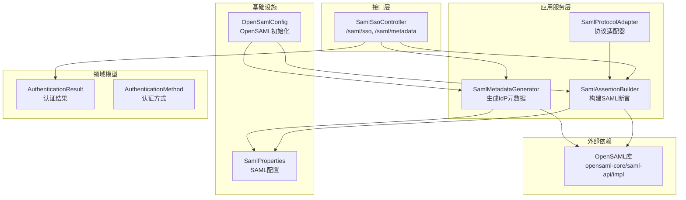
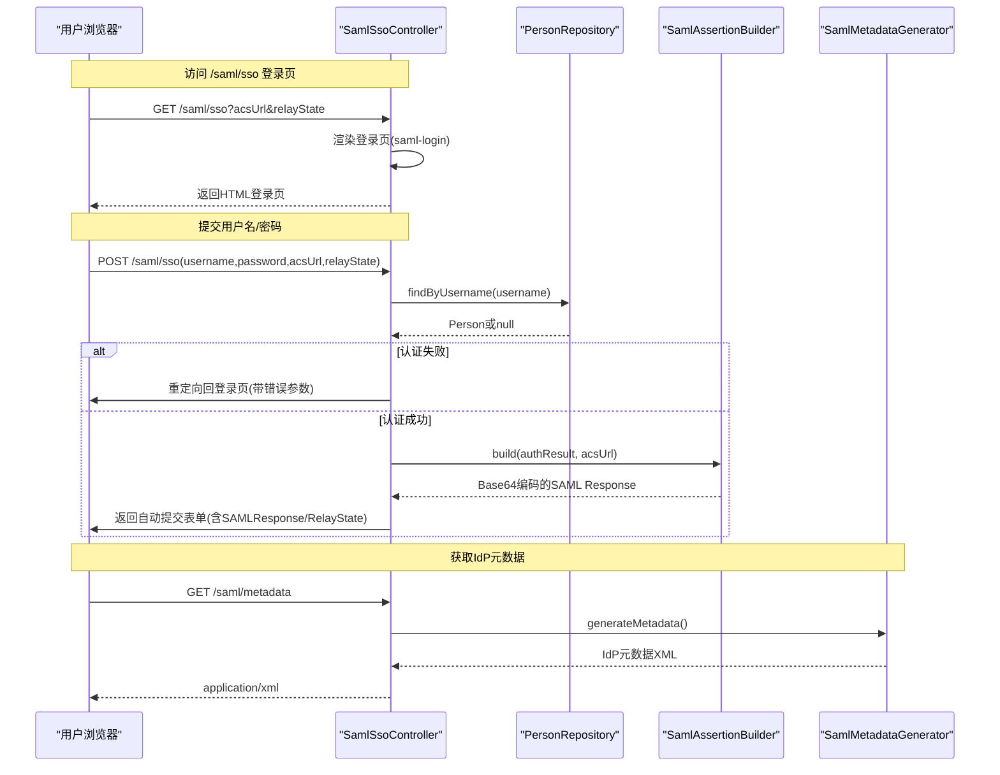
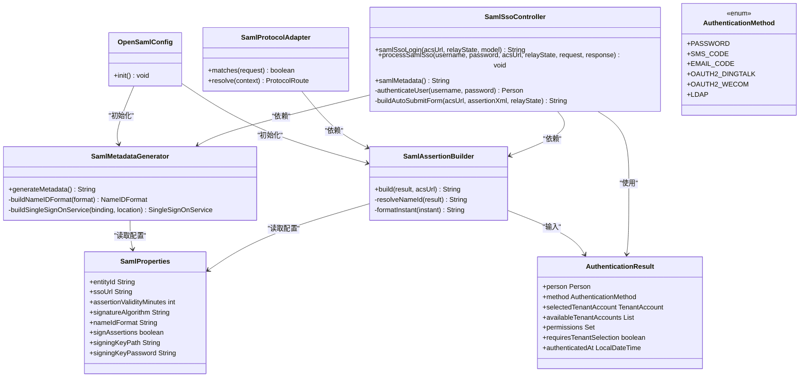
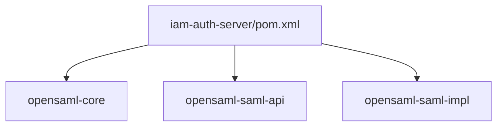
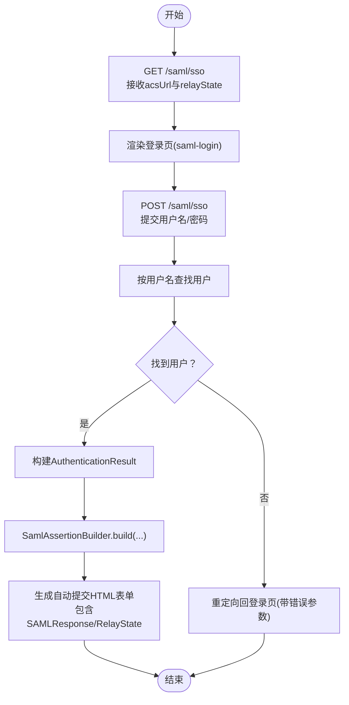
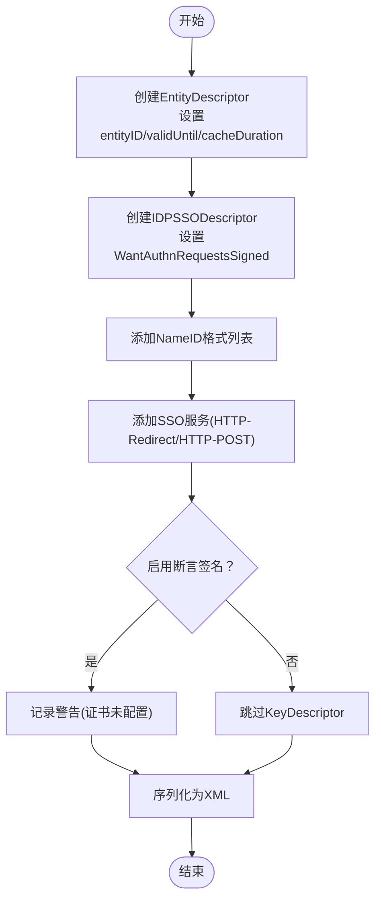

# SAML单点登录控制器

<cite>
**本文档引用的文件**
- [SamlSsoController.java](file://iam-auth-server/src/main/java/iam/platform/auth/interfaces/web/SamlSsoController.java)
- [SamlAssertionBuilder.java](file://iam-auth-server/src/main/java/iam/platform/auth/application/service/SamlAssertionBuilder.java)
- [SamlMetadataGenerator.java](file://iam-auth-server/src/main/java/iam/platform/auth/application/service/SamlMetadataGenerator.java)
- [SamlProperties.java](file://iam-auth-server/src/main/java/iam/platform/auth/infrastructure/config/SamlProperties.java)
- [OpenSamlConfig.java](file://iam-auth-server/src/main/java/iam/platform/auth/infrastructure/config/OpenSamlConfig.java)
- [SamlProtocolAdapter.java](file://iam-auth-server/src/main/java/iam/platform/auth/application/service/routing/SamlProtocolAdapter.java)
- [AuthenticationResult.java](file://iam-auth-server/src/main/java/iam/platform/auth/domain/model/valueobject/AuthenticationResult.java)
- [AuthenticationMethod.java](file://iam-auth-server/src/main/java/iam/platform/auth/domain/model/enums/AuthenticationMethod.java)
- [pom.xml](file://iam-auth-server/pom.xml)
- [application.yml](file://iam-auth-server/src/main/resources/application.yml)
- [SamlMetadataGeneratorTest.java](file://iam-auth-server/src/test/java/iam/platform/auth/application/service/SamlMetadataGeneratorTest.java)
</cite>

## 目录
1. [简介](#简介)
2. [项目结构](#项目结构)
3. [核心组件](#核心组件)
4. [架构总览](#架构总览)
5. [详细组件分析](#详细组件分析)
6. [依赖关系分析](#依赖关系分析)
7. [性能考虑](#性能考虑)
8. [故障排除指南](#故障排除指南)
9. [结论](#结论)
10. [附录](#附录)

## 简介
本文件面向SAML 2.0单点登录（SSO）控制器的技术文档，重点围绕SamlSsoController的实现进行深入剖析，涵盖以下方面：
- SAML协议支持与端点设计：GET/POST SSO端点、元数据端点
- 断言构建与用户属性提取：基于AuthenticationResult生成SAML Assertion
- 元数据交换与签名策略：基于OpenSAML生成IdP元数据
- SAML SSO流程与IdP响应处理：登录页渲染、自动提交表单、RelayState传递
- 与OpenSAML库的集成：初始化、XML序列化、Builder模式
- 配置管理与扩展：SamlProperties、SamlProtocolAdapter路由适配
- 实际代码示例路径：展示如何扩展控制器与自定义断言处理

## 项目结构
SAML相关代码主要位于iam-auth-server模块中，采用分层架构组织：
- 接口层：SamlSsoController（Web控制器）
- 应用服务层：SamlAssertionBuilder（断言构建）、SamlMetadataGenerator（元数据生成）、SamlProtocolAdapter（协议适配）
- 基础设施配置：OpenSamlConfig（OpenSAML初始化）、SamlProperties（SAML配置）
- 领域模型：AuthenticationResult（认证结果值对象）、AuthenticationMethod（认证方式枚举）

**图表来源**
- [SamlSsoController.java:32-151](file://iam-auth-server/src/main/java/iam/platform/auth/interfaces/web/SamlSsoController.java#L32-L151)
- [SamlAssertionBuilder.java:21-115](file://iam-auth-server/src/main/java/iam/platform/auth/application/service/SamlAssertionBuilder.java#L21-L115)
- [SamlMetadataGenerator.java:23-128](file://iam-auth-server/src/main/java/iam/platform/auth/application/service/SamlMetadataGenerator.java#L23-L128)
- [SamlProtocolAdapter.java:15-47](file://iam-auth-server/src/main/java/iam/platform/auth/application/service/routing/SamlProtocolAdapter.java#L15-L47)
- [OpenSamlConfig.java:15-29](file://iam-auth-server/src/main/java/iam/platform/auth/infrastructure/config/OpenSamlConfig.java#L15-L29)
- [SamlProperties.java:13-39](file://iam-auth-server/src/main/java/iam/platform/auth/infrastructure/config/SamlProperties.java#L13-L39)

**章节来源**
- [SamlSsoController.java:32-151](file://iam-auth-server/src/main/java/iam/platform/auth/interfaces/web/SamlSsoController.java#L32-L151)
- [SamlAssertionBuilder.java:21-115](file://iam-auth-server/src/main/java/iam/platform/auth/application/service/SamlAssertionBuilder.java#L21-L115)
- [SamlMetadataGenerator.java:23-128](file://iam-auth-server/src/main/java/iam/platform/auth/application/service/SamlMetadataGenerator.java#L23-L128)
- [SamlProtocolAdapter.java:15-47](file://iam-auth-server/src/main/java/iam/platform/auth/application/service/routing/SamlProtocolAdapter.java#L15-L47)
- [OpenSamlConfig.java:15-29](file://iam-auth-server/src/main/java/iam/platform/auth/infrastructure/config/OpenSamlConfig.java#L15-L29)
- [SamlProperties.java:13-39](file://iam-auth-server/src/main/java/iam/platform/auth/infrastructure/config/SamlProperties.java#L13-L39)

## 核心组件
- SamlSsoController：提供SAML SSO登录页面、POST处理登录并返回自动提交表单、元数据端点
- SamlAssertionBuilder：根据AuthenticationResult构建符合SAML 2.0规范的断言XML，并进行Base64编码
- SamlMetadataGenerator：使用OpenSAML生成标准IdP元数据XML，包含EntityDescriptor、IDPSSODescriptor、NameID格式、SSO服务等
- SamlProtocolAdapter：在统一协议路由中识别SAML请求，生成断言并返回SAML路由结果
- OpenSamlConfig：确保OpenSAML库在使用前完成初始化
- SamlProperties：集中管理SAML实体ID、SSO URL、断言有效期、签名算法、NameID格式、签名开关及密钥配置
- AuthenticationResult/AuthenticationMethod：封装认证结果与认证方式，为断言构建提供必要信息

**章节来源**
- [SamlSsoController.java:32-151](file://iam-auth-server/src/main/java/iam/platform/auth/interfaces/web/SamlSsoController.java#L32-L151)
- [SamlAssertionBuilder.java:21-115](file://iam-auth-server/src/main/java/iam/platform/auth/application/service/SamlAssertionBuilder.java#L21-L115)
- [SamlMetadataGenerator.java:23-128](file://iam-auth-server/src/main/java/iam/platform/auth/application/service/SamlMetadataGenerator.java#L23-L128)
- [SamlProtocolAdapter.java:15-47](file://iam-auth-server/src/main/java/iam/platform/auth/application/service/routing/SamlProtocolAdapter.java#L15-L47)
- [OpenSamlConfig.java:15-29](file://iam-auth-server/src/main/java/iam/platform/auth/infrastructure/config/OpenSamlConfig.java#L15-L29)
- [SamlProperties.java:13-39](file://iam-auth-server/src/main/java/iam/platform/auth/infrastructure/config/SamlProperties.java#L13-L39)
- [AuthenticationResult.java:14-56](file://iam-auth-server/src/main/java/iam/platform/auth/domain/model/valueobject/AuthenticationResult.java#L14-L56)
- [AuthenticationMethod.java:6-8](file://iam-auth-server/src/main/java/iam/platform/auth/domain/model/enums/AuthenticationMethod.java#L6-L8)

## 架构总览
下图展示了SAML SSO从用户访问到断言返回的关键交互流程，映射到实际源码中的组件与方法。

**图表来源**
- [SamlSsoController.java:42-103](file://iam-auth-server/src/main/java/iam/platform/auth/interfaces/web/SamlSsoController.java#L42-L103)
- [SamlAssertionBuilder.java:32-100](file://iam-auth-server/src/main/java/iam/platform/auth/application/service/SamlAssertionBuilder.java#L32-L100)
- [SamlMetadataGenerator.java:40-101](file://iam-auth-server/src/main/java/iam/platform/auth/application/service/SamlMetadataGenerator.java#L40-L101)

## 详细组件分析

### SamlSsoController 控制器
职责与实现要点：
- GET /saml/sso：接收acsUrl与relayState，渲染登录页，注入登录类型标识
- POST /saml/sso：简化认证（通过PersonRepository按用户名查找），构造AuthenticationResult，调用SamlAssertionBuilder生成断言，返回自动提交HTML表单至SP的ACS端点
- GET /saml/metadata：返回IdP元数据XML，供SP配置使用
- 自动提交表单：内嵌SAMLResponse与可选RelayState，触发浏览器自动提交

关键流程与复杂度：
- 认证查找：O(1)数据库查询（按用户名唯一索引）
- 断言构建：字符串拼接+Base64编码，时间复杂度近似O(n)，n为断言XML长度
- 表单生成：字符串格式化，O(n)

安全与健壮性：
- 认证失败时重定向回登录页并携带错误参数
- 断言有效期、NameID格式、Audience限制等由断言构建器控制
- 元数据生成包含NameID格式与绑定方式声明，便于SP正确配置

**章节来源**
- [SamlSsoController.java:38-151](file://iam-auth-server/src/main/java/iam/platform/auth/interfaces/web/SamlSsoController.java#L38-L151)

### SamlAssertionBuilder 断言构建器
职责与实现要点：
- 输入：AuthenticationResult、SP的ACS URL
- 输出：Base64编码的SAML 2.0 Response XML
- 关键字段：Issuer、Status、Assertion、Subject、Conditions、AuthnStatement、AttributeStatement
- 用户属性：email、nickname（从AuthenticationResult.person提取）
- NameID解析：优先使用邮箱，否则使用用户名
- 时间戳：IssueInstant、NotBefore、NotOnOrAfter（基于配置的断言有效期）

复杂度与性能：
- 字符串拼接与Base64编码，整体O(n)
- 可扩展：支持动态属性注入、条件分支（如不同NameID格式）

**章节来源**
- [SamlAssertionBuilder.java:25-115](file://iam-auth-server/src/main/java/iam/platform/auth/application/service/SamlAssertionBuilder.java#L25-L115)
- [AuthenticationResult.java:14-56](file://iam-auth-server/src/main/java/iam/platform/auth/domain/model/valueobject/AuthenticationResult.java#L14-L56)

### SamlMetadataGenerator 元数据生成器
职责与实现要点：
- 使用OpenSAML的Builder与Marshaller生成标准IdP元数据
- 包含EntityDescriptor、IDPSSODescriptor、NameID格式列表、多种绑定的SingleSignOnService
- 支持WantAuthnRequestsSigned标志（与配置一致）
- 当启用断言签名但未配置证书时记录警告（预留扩展点）

复杂度与性能：
- DOM序列化与XML打印，整体O(n)
- 可扩展：增加KeyDescriptor以支持断言签名

**章节来源**
- [SamlMetadataGenerator.java:35-128](file://iam-auth-server/src/main/java/iam/platform/auth/application/service/SamlMetadataGenerator.java#L35-L128)
- [SamlProperties.java:13-39](file://iam-auth-server/src/main/java/iam/platform/auth/infrastructure/config/SamlProperties.java#L13-L39)

### SamlProtocolAdapter 协议适配器
职责与实现要点：
- 识别SAML请求（URI包含/saml/或/ssso/saml）
- 从上下文中提取ACS URL与RelayState
- 调用SamlAssertionBuilder生成断言，返回SAML路由结果（包含断言、ACS、RelayState）

与SamlSsoController的关系：
- SamlSsoController直接处理Web请求
- SamlProtocolAdapter用于统一路由场景下的SAML处理（例如在更复杂的认证管道中）

**章节来源**
- [SamlProtocolAdapter.java:19-45](file://iam-auth-server/src/main/java/iam/platform/auth/application/service/routing/SamlProtocolAdapter.java#L19-L45)

### OpenSAML 初始化配置
职责与实现要点：
- 在应用启动后初始化OpenSAML库，确保后续使用Builder、Marshaller等能力
- 异常处理：初始化失败抛出运行时异常

**章节来源**
- [OpenSamlConfig.java:17-27](file://iam-auth-server/src/main/java/iam/platform/auth/infrastructure/config/OpenSamlConfig.java#L17-L27)

### SamlProperties 配置管理
关键配置项：
- entityId：IdP实体ID
- ssoUrl：SSO端点URL
- assertionValidityMinutes：断言有效期（分钟）
- signatureAlgorithm：签名算法
- nameIdFormat：NameID格式
- signAssertions：是否对断言签名
- signingKeyPath/signingKeyPassword：签名密钥路径与密码（当前元数据生成器预留扩展）

**章节来源**
- [SamlProperties.java:13-39](file://iam-auth-server/src/main/java/iam/platform/auth/infrastructure/config/SamlProperties.java#L13-L39)

### 类关系图（代码级）

**图表来源**
- [SamlSsoController.java:34-36](file://iam-auth-server/src/main/java/iam/platform/auth/interfaces/web/SamlSsoController.java#L34-L36)
- [SamlAssertionBuilder.java:23-24](file://iam-auth-server/src/main/java/iam/platform/auth/application/service/SamlAssertionBuilder.java#L23-L24)
- [SamlMetadataGenerator.java:25-27](file://iam-auth-server/src/main/java/iam/platform/auth/application/service/SamlMetadataGenerator.java#L25-L27)
- [SamlProtocolAdapter.java:17-18](file://iam-auth-server/src/main/java/iam/platform/auth/application/service/routing/SamlProtocolAdapter.java#L17-L18)
- [OpenSamlConfig.java:17-27](file://iam-auth-server/src/main/java/iam/platform/auth/infrastructure/config/OpenSamlConfig.java#L17-L27)
- [SamlProperties.java:13-39](file://iam-auth-server/src/main/java/iam/platform/auth/infrastructure/config/SamlProperties.java#L13-L39)
- [AuthenticationResult.java:14-26](file://iam-auth-server/src/main/java/iam/platform/auth/domain/model/valueobject/AuthenticationResult.java#L14-L26)
- [AuthenticationMethod.java:6-8](file://iam-auth-server/src/main/java/iam/platform/auth/domain/model/enums/AuthenticationMethod.java#L6-L8)

## 依赖关系分析
- Maven依赖：OpenSAML核心、SAML API与实现依赖已引入
- 运行时依赖：Spring Web、Thymeleaf（模板）、Redis（会话存储）、JPA（持久化）
- OpenSAML初始化：通过OpenSamlConfig在应用启动时完成

**图表来源**
- [pom.xml:82-93](file://iam-auth-server/pom.xml#L82-L93)

**章节来源**
- [pom.xml:18-180](file://iam-auth-server/pom.xml#L18-L180)

## 性能考虑
- 断言构建：字符串拼接与Base64编码开销较小，适合高并发场景；建议在高负载时缓存常用配置值
- 元数据生成：DOM序列化与XML打印成本低，但需避免频繁重复生成；可在配置变更时更新缓存
- 认证查找：按用户名查询应建立数据库索引，确保O(1)查询性能
- 模板渲染：Thymeleaf在开发环境禁用缓存，生产环境建议开启缓存以降低CPU消耗

## 故障排除指南
常见问题与排查步骤：
- OpenSAML初始化失败：检查OpenSamlConfig是否被Spring加载，确认日志中“OpenSAML initialized successfully”输出
- 断言签名未生效：当前元数据生成器在启用签名但未配置证书时仅记录警告；需完善证书加载逻辑
- 登录失败重定向：检查POST /saml/sso是否正确传递acsUrl与relayState，以及PersonRepository是否存在该用户名
- 断言属性缺失：确认AuthenticationResult.person包含email与nickname，否则断言中对应属性为空
- 元数据不完整：验证SamlProperties配置的entityId、ssoUrl、nameIdFormat、signAssertions等是否正确

**章节来源**
- [OpenSamlConfig.java:17-27](file://iam-auth-server/src/main/java/iam/platform/auth/infrastructure/config/OpenSamlConfig.java#L17-L27)
- [SamlMetadataGenerator.java:80-85](file://iam-auth-server/src/main/java/iam/platform/auth/application/service/SamlMetadataGenerator.java#L80-L85)
- [SamlSsoController.java:69-74](file://iam-auth-server/src/main/java/iam/platform/auth/interfaces/web/SamlSsoController.java#L69-L74)
- [SamlAssertionBuilder.java:94-96](file://iam-auth-server/src/main/java/iam/platform/auth/application/service/SamlAssertionBuilder.java#L94-L96)
- [SamlProperties.java:13-39](file://iam-auth-server/src/main/java/iam/platform/auth/infrastructure/config/SamlProperties.java#L13-L39)

## 结论
SamlSsoController及其配套组件提供了完整的SAML 2.0 IdP基础能力：登录页面、断言生成、元数据发布与OpenSAML集成。当前实现聚焦于核心流程与配置管理，断言签名与更丰富的属性扩展可通过SamlProperties与元数据生成器进一步完善。建议在生产环境中：
- 完善断言签名与证书管理
- 引入断言验证与审计日志
- 扩展用户属性映射与条件声明
- 加强安全与性能监控

## 附录

### SAML SSO流程与IdP响应处理（流程图）

**图表来源**
- [SamlSsoController.java:42-93](file://iam-auth-server/src/main/java/iam/platform/auth/interfaces/web/SamlSsoController.java#L42-L93)
- [SamlAssertionBuilder.java:32-100](file://iam-auth-server/src/main/java/iam/platform/auth/application/service/SamlAssertionBuilder.java#L32-L100)

### 元数据生成流程（流程图）

**图表来源**
- [SamlMetadataGenerator.java:40-101](file://iam-auth-server/src/main/java/iam/platform/auth/application/service/SamlMetadataGenerator.java#L40-L101)

### 测试用例参考
- SamlMetadataGeneratorTest：验证元数据XML结构、NameID格式、SSO绑定与entityId一致性

**章节来源**
- [SamlMetadataGeneratorTest.java:24-49](file://iam-auth-server/src/test/java/iam/platform/auth/application/service/SamlMetadataGeneratorTest.java#L24-L49)