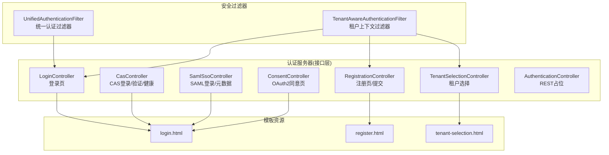
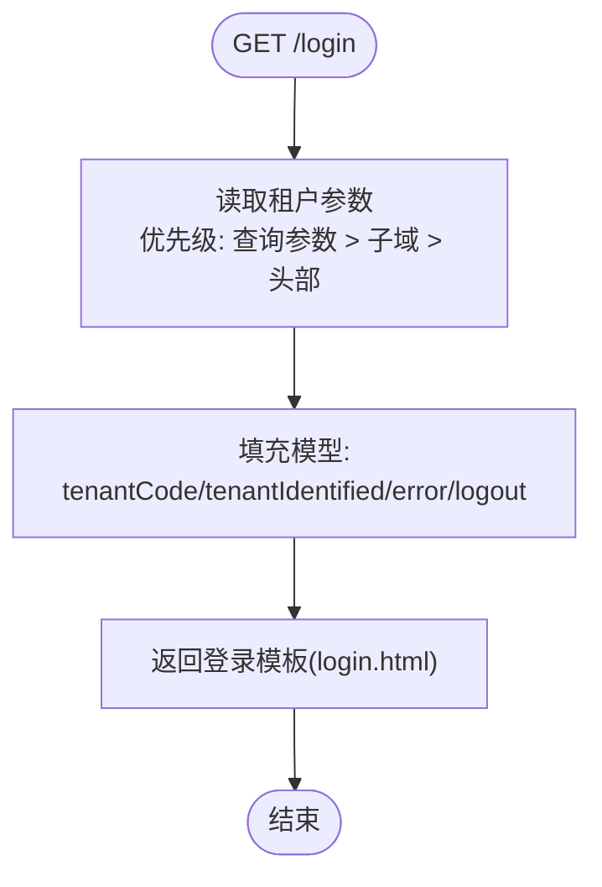
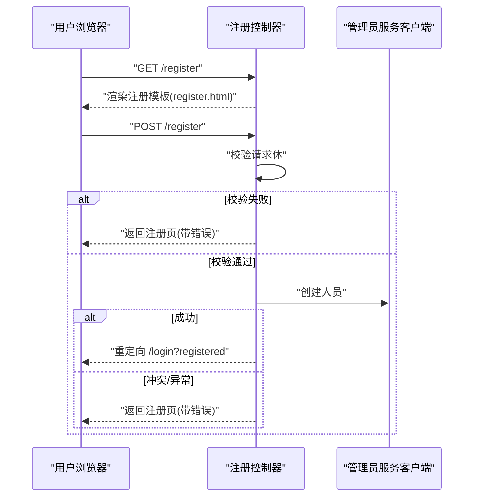
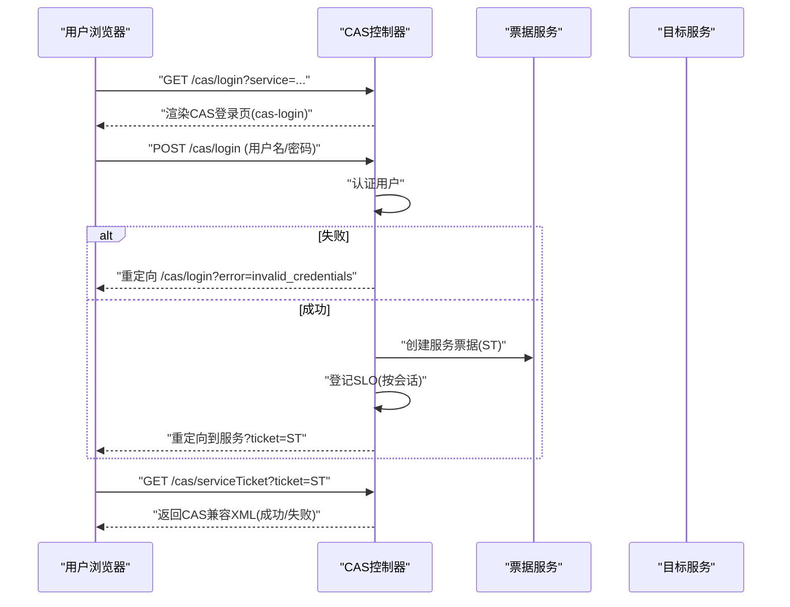
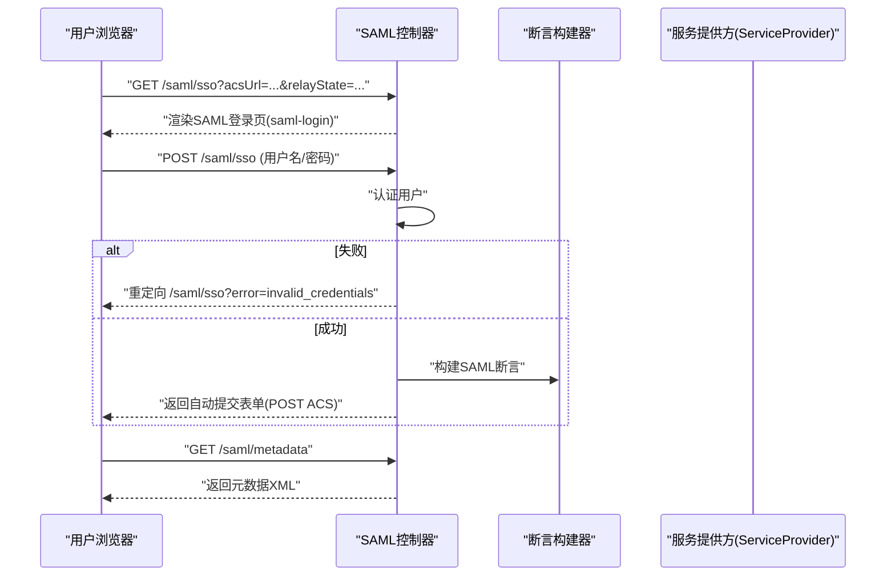
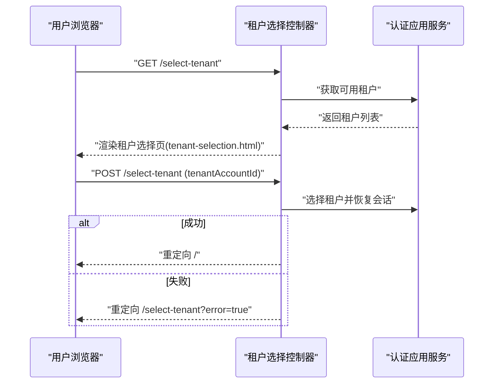
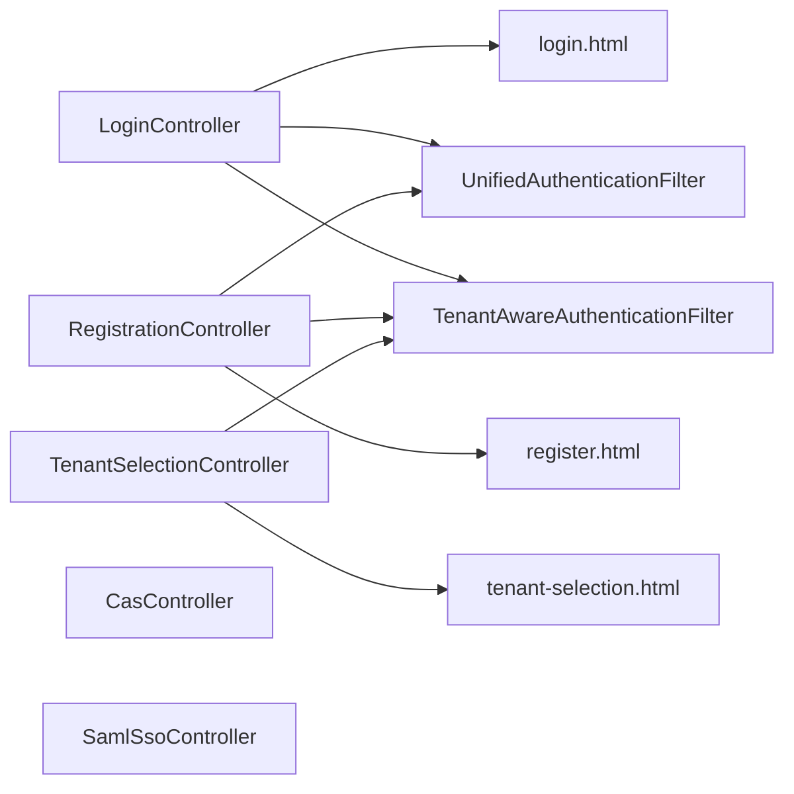

# Web控制器层

<cite>
**本文引用的文件**
- [LoginController.java](file://iam-auth-server/src/main/java/iam/platform/auth/interfaces/web/LoginController.java)
- [RegistrationController.java](file://iam-auth-server/src/main/java/iam/platform/auth/interfaces/web/RegistrationController.java)
- [CasController.java](file://iam-auth-server/src/main/java/iam/platform/auth/interfaces/web/CasController.java)
- [SamlSsoController.java](file://iam-auth-server/src/main/java/iam/platform/auth/interfaces/web/SamlSsoController.java)
- [TenantSelectionController.java](file://iam-auth-server/src/main/java/iam/platform/auth/interfaces/web/TenantSelectionController.java)
- [ConsentController.java](file://iam-auth-server/src/main/java/iam/platform/auth/interfaces/web/ConsentController.java)
- [AuthenticationController.java](file://iam-auth-server/src/main/java/iam/platform/auth/interfaces/rest/AuthenticationController.java)
- [login.html](file://iam-auth-server/src/main/resources/templates/login.html)
- [register.html](file://iam-auth-server/src/main/resources/templates/register.html)
- [tenant-selection.html](file://iam-auth-server/src/main/resources/templates/tenant-selection.html)
- [UnifiedAuthenticationFilter.java](file://iam-auth-server/src/main/java/iam/platform/auth/infrastructure/security/UnifiedAuthenticationFilter.java)
- [TenantAwareAuthenticationFilter.java](file://iam-auth-server/src/main/java/iam/platform/auth/infrastructure/security/TenantAwareAuthenticationFilter.java)
- [SamlMetadataGeneratorTest.java](file://iam-auth-server/src/test/java/iam/platform/auth/application/service/SamlMetadataGeneratorTest.java)
</cite>

## 目录
1. [简介](#简介)
2. [项目结构](#项目结构)
3. [核心组件](#核心组件)
4. [架构总览](#架构总览)
5. [详细组件分析](#详细组件分析)
6. [依赖分析](#依赖分析)
7. [性能考虑](#性能考虑)
8. [故障排查指南](#故障排查指南)
9. [结论](#结论)
10. [附录](#附录)

## 简介
本文件聚焦认证服务器的Web控制器层，系统性梳理登录控制器、注册控制器、CAS控制器、SAML控制器、租户选择控制器等核心组件的职责、请求处理流程、响应格式与错误处理机制，并阐明控制器与服务层的交互模式与数据传递方式。同时提供测试策略、调试技巧与性能监控建议，并给出可扩展与自定义开发的实践路径。

## 项目结构
认证服务器的Web控制器位于接口层（interfaces/web），负责页面渲染、表单处理与重定向；REST控制器用于内部认证API占位；模板资源位于templates目录，配合Thymeleaf进行视图渲染；安全过滤器在请求进入控制器前统一解析认证凭据与恢复租户上下文。



图表来源
- [LoginController.java:1-58](file://iam-auth-server/src/main/java/iam/platform/auth/interfaces/web/LoginController.java#L1-L58)
- [RegistrationController.java:1-46](file://iam-auth-server/src/main/java/iam/platform/auth/interfaces/web/RegistrationController.java#L1-L46)
- [CasController.java:1-170](file://iam-auth-server/src/main/java/iam/platform/auth/interfaces/web/CasController.java#L1-L170)
- [SamlSsoController.java:1-151](file://iam-auth-server/src/main/java/iam/platform/auth/interfaces/web/SamlSsoController.java#L1-L151)
- [TenantSelectionController.java:1-58](file://iam-auth-server/src/main/java/iam/platform/auth/interfaces/web/TenantSelectionController.java#L1-L58)
- [ConsentController.java:1-18](file://iam-auth-server/src/main/java/iam/platform/auth/interfaces/web/ConsentController.java#L1-L18)
- [AuthenticationController.java:1-47](file://iam-auth-server/src/main/java/iam/platform/auth/interfaces/rest/AuthenticationController.java#L1-L47)
- [login.html:1-343](file://iam-auth-server/src/main/resources/templates/login.html#L1-L343)
- [register.html:1-64](file://iam-auth-server/src/main/resources/templates/register.html#L1-L64)
- [tenant-selection.html:1-237](file://iam-auth-server/src/main/resources/templates/tenant-selection.html#L1-L237)
- [UnifiedAuthenticationFilter.java:1-80](file://iam-auth-server/src/main/java/iam/platform/auth/infrastructure/security/UnifiedAuthenticationFilter.java#L1-L80)
- [TenantAwareAuthenticationFilter.java:1-68](file://iam-auth-server/src/main/java/iam/platform/auth/infrastructure/security/TenantAwareAuthenticationFilter.java#L1-L68)

章节来源
- [LoginController.java:1-58](file://iam-auth-server/src/main/java/iam/platform/auth/interfaces/web/LoginController.java#L1-L58)
- [RegistrationController.java:1-46](file://iam-auth-server/src/main/java/iam/platform/auth/interfaces/web/RegistrationController.java#L1-L46)
- [CasController.java:1-170](file://iam-auth-server/src/main/java/iam/platform/auth/interfaces/web/CasController.java#L1-L170)
- [SamlSsoController.java:1-151](file://iam-auth-server/src/main/java/iam/platform/auth/interfaces/web/SamlSsoController.java#L1-L151)
- [TenantSelectionController.java:1-58](file://iam-auth-server/src/main/java/iam/platform/auth/interfaces/web/TenantSelectionController.java#L1-L58)
- [ConsentController.java:1-18](file://iam-auth-server/src/main/java/iam/platform/auth/interfaces/web/ConsentController.java#L1-L18)
- [AuthenticationController.java:1-47](file://iam-auth-server/src/main/java/iam/platform/auth/interfaces/rest/AuthenticationController.java#L1-L47)
- [login.html:1-343](file://iam-auth-server/src/main/resources/templates/login.html#L1-L343)
- [register.html:1-64](file://iam-auth-server/src/main/resources/templates/register.html#L1-L64)
- [tenant-selection.html:1-237](file://iam-auth-server/src/main/resources/templates/tenant-selection.html#L1-L237)
- [UnifiedAuthenticationFilter.java:1-80](file://iam-auth-server/src/main/java/iam/platform/auth/infrastructure/security/UnifiedAuthenticationFilter.java#L1-L80)
- [TenantAwareAuthenticationFilter.java:1-68](file://iam-auth-server/src/main/java/iam/platform/auth/infrastructure/security/TenantAwareAuthenticationFilter.java#L1-L68)

## 核心组件
- 登录控制器：支持多租户识别（子域/查询参数/头部），渲染登录页并注入错误/登出消息。
- 注册控制器：GET渲染注册表单，POST校验并调用管理员服务创建用户，异常时回显错误。
- CAS控制器：提供CAS登录页、登录处理（生成ST）、服务票据验证（XML响应）、健康检查。
- SAML控制器：提供SAML SSO登录页、登录处理（生成SAML响应并自动提交）、元数据导出。
- 租户选择控制器：在用户属于多个租户时引导选择，选择后重定向至首页或授权流程。
- OAuth2同意控制器：渲染同意页，向用户展示客户端与权限范围。
- REST认证控制器：为内部服务保留认证API占位，明确密码模式应走标准授权服务器端点。

章节来源
- [LoginController.java:1-58](file://iam-auth-server/src/main/java/iam/platform/auth/interfaces/web/LoginController.java#L1-L58)
- [RegistrationController.java:1-46](file://iam-auth-server/src/main/java/iam/platform/auth/interfaces/web/RegistrationController.java#L1-L46)
- [CasController.java:1-170](file://iam-auth-server/src/main/java/iam/platform/auth/interfaces/web/CasController.java#L1-L170)
- [SamlSsoController.java:1-151](file://iam-auth-server/src/main/java/iam/platform/auth/interfaces/web/SamlSsoController.java#L1-L151)
- [TenantSelectionController.java:1-58](file://iam-auth-server/src/main/java/iam/platform/auth/interfaces/web/TenantSelectionController.java#L1-L58)
- [ConsentController.java:1-18](file://iam-auth-server/src/main/java/iam/platform/auth/interfaces/web/ConsentController.java#L1-L18)
- [AuthenticationController.java:1-47](file://iam-auth-server/src/main/java/iam/platform/auth/interfaces/rest/AuthenticationController.java#L1-L47)

## 架构总览
Web控制器层通过统一认证过滤器接收多种认证方式的表单请求，解析为统一认证令牌后交由安全框架处理；租户上下文过滤器在后续请求中恢复当前租户信息。控制器与服务层解耦，通过应用服务与领域仓储协作完成业务逻辑。

```mermaid
sequenceDiagram
participant U as "用户浏览器"
participant C as "控制器"
participant F as "统一认证过滤器"
participant S as "安全框架/认证管理器"
participant P as "租户上下文过滤器"
U->>C : "GET /login 或 /register"
C-->>U : "渲染登录/注册页面(login.html/register.html)"
U->>F : "POST /login (method=password/email/sms/ldap)"
F->>F : "解析隐藏字段method与参数"
F->>S : "构建统一认证令牌并尝试认证"
S-->>F : "认证结果(成功/失败)"
F-->>U : "成功则设置会话/跳转; 失败则返回登录页并带错误"
U->>P : "后续请求"
P-->>U : "从会话恢复租户上下文"
```

图表来源
- [LoginController.java:1-58](file://iam-auth-server/src/main/java/iam/platform/auth/interfaces/web/LoginController.java#L1-L58)
- [RegistrationController.java:1-46](file://iam-auth-server/src/main/java/iam/platform/auth/interfaces/web/RegistrationController.java#L1-L46)
- [UnifiedAuthenticationFilter.java:1-80](file://iam-auth-server/src/main/java/iam/platform/auth/infrastructure/security/UnifiedAuthenticationFilter.java#L1-L80)
- [TenantAwareAuthenticationFilter.java:1-68](file://iam-auth-server/src/main/java/iam/platform/auth/infrastructure/security/TenantAwareAuthenticationFilter.java#L1-L68)

## 详细组件分析

### 登录控制器(LoginController)
- 职责与功能
  - 渲染登录页，支持三种租户识别方式：子域、查询参数、头部（由过滤器处理）。
  - 将租户标识与“是否已识别”状态注入模型，供视图使用。
  - 处理错误与登出参数，向视图传递提示信息。
- 请求处理流程
  - GET /login：解析租户参数，填充模型，返回登录模板。
  - 子域提取为占位实现，生产环境由租户上下文过滤器接管。
- 错误处理
  - 通过URL参数携带错误/登出信息，控制器将其映射到模型属性。
- 视图交互
  - 模板包含多方法登录切换、验证码发送与校验逻辑，控制器仅负责初始渲染与消息注入。



图表来源
- [LoginController.java:1-58](file://iam-auth-server/src/main/java/iam/platform/auth/interfaces/web/LoginController.java#L1-L58)
- [login.html:1-343](file://iam-auth-server/src/main/resources/templates/login.html#L1-L343)

章节来源
- [LoginController.java:1-58](file://iam-auth-server/src/main/java/iam/platform/auth/interfaces/web/LoginController.java#L1-L58)
- [login.html:1-343](file://iam-auth-server/src/main/resources/templates/login.html#L1-L343)

### 注册控制器(RegistrationController)
- 职责与功能
  - GET：初始化注册表单模型。
  - POST：校验请求体，调用管理员服务创建人员；冲突或异常时回显错误并保持表单。
- 请求处理流程
  - GET /register：构造空请求对象并渲染注册模板。
  - POST /register：校验失败直接返回注册页；成功则重定向到登录页并带注册成功参数。
- 错误处理
  - 冲突异常捕获并显示友好错误；其他异常统一提示“注册失败”。



图表来源
- [RegistrationController.java:1-46](file://iam-auth-server/src/main/java/iam/platform/auth/interfaces/web/RegistrationController.java#L1-L46)
- [register.html:1-64](file://iam-auth-server/src/main/resources/templates/register.html#L1-L64)

章节来源
- [RegistrationController.java:1-46](file://iam-auth-server/src/main/java/iam/platform/auth/interfaces/web/RegistrationController.java#L1-L46)
- [register.html:1-64](file://iam-auth-server/src/main/resources/templates/register.html#L1-L64)

### CAS控制器(CasController)
- 职责与功能
  - 提供CAS登录页、登录处理（含Renew/GateWay语义）、服务票据验证（XML响应）、健康检查。
  - 在有service时生成ST并登记SLO跟踪，随后重定向至服务回调地址。
- 请求处理流程
  - GET /cas/login：注入service/renew/gateway与登录类型，返回CAS登录模板。
  - POST /cas/login：认证用户，构造认证结果，若存在service则生成ST并登记SLO，最后重定向到服务。
  - GET /cas/serviceTicket：验证票据并返回CAS兼容XML。
  - GET /cas/health：返回健康状态。
- 错误处理
  - 认证失败时根据是否存在service决定重定向或直接返回登录页并带错误参数。
  - 票据无效时返回XML错误响应。



图表来源
- [CasController.java:1-170](file://iam-auth-server/src/main/java/iam/platform/auth/interfaces/web/CasController.java#L1-L170)

章节来源
- [CasController.java:1-170](file://iam-auth-server/src/main/java/iam/platform/auth/interfaces/web/CasController.java#L1-L170)

### SAML控制器(SamlSsoController)
- 职责与功能
  - 提供SAML SSO登录页、登录处理（生成SAML断言并自动提交到SP的ACS）、元数据导出。
- 请求处理流程
  - GET /saml/sso：注入acsUrl/relayState与登录类型，返回SAML登录模板。
  - POST /saml/sso：认证用户，构造认证结果，生成SAML断言并通过自动提交表单回传给SP。
  - GET /saml/metadata：返回IdP元数据XML。
- 错误处理
  - 认证失败时重定向回登录页并带错误参数。
- 视图交互
  - 自动提交HTML表单，内嵌RelayState以保持状态。



图表来源
- [SamlSsoController.java:1-151](file://iam-auth-server/src/main/java/iam/platform/auth/interfaces/web/SamlSsoController.java#L1-L151)

章节来源
- [SamlSsoController.java:1-151](file://iam-auth-server/src/main/java/iam/platform/auth/interfaces/web/SamlSsoController.java#L1-L151)

### 租户选择控制器(TenantSelectionController)
- 职责与功能
  - 当用户属于多个租户时，引导其在登录后选择目标租户，选择后恢复会话并继续授权流程。
- 请求处理流程
  - GET /select-tenant：调用应用服务获取可用租户列表，注入模型并渲染租户选择页。
  - POST /select-tenant：选择租户并重定向首页；失败时重定向回选择页并带错误参数。
- 错误处理
  - 未认证时重定向到登录页。



图表来源
- [TenantSelectionController.java:1-58](file://iam-auth-server/src/main/java/iam/platform/auth/interfaces/web/TenantSelectionController.java#L1-L58)
- [tenant-selection.html:1-237](file://iam-auth-server/src/main/resources/templates/tenant-selection.html#L1-L237)

章节来源
- [TenantSelectionController.java:1-58](file://iam-auth-server/src/main/java/iam/platform/auth/interfaces/web/TenantSelectionController.java#L1-L58)
- [tenant-selection.html:1-237](file://iam-auth-server/src/main/resources/templates/tenant-selection.html#L1-L237)

### OAuth2同意控制器(ConsentController)
- 职责与功能
  - 渲染同意页，向用户展示客户端名称与申请的权限范围，便于用户确认授权。
- 请求处理流程
  - GET /oauth2/consent：接收clientName与scopes参数，注入模型并渲染同意模板。

章节来源
- [ConsentController.java:1-18](file://iam-auth-server/src/main/java/iam/platform/auth/interfaces/web/ConsentController.java#L1-L18)

### REST认证控制器(AuthenticationController)
- 职责与功能
  - 为内部服务保留认证API占位；明确密码模式应走标准授权服务器端点（/oauth2/token），避免重复造轮子。
- 使用建议
  - 非OAuth2场景可在此扩展内部认证；OAuth2密码模式必须使用标准端点。

章节来源
- [AuthenticationController.java:1-47](file://iam-auth-server/src/main/java/iam/platform/auth/interfaces/rest/AuthenticationController.java#L1-L47)

## 依赖分析
- 控制器与模板
  - 登录/注册/租户选择控制器均依赖Thymeleaf模板进行页面渲染。
- 控制器与安全过滤器
  - 统一认证过滤器负责解析多方法登录表单并构建认证令牌；租户上下文过滤器在后续请求中恢复租户上下文。
- 控制器与服务层
  - 注册控制器依赖管理员服务客户端；租户选择控制器依赖认证应用服务；CAS/SAML控制器依赖各自的应用服务与仓储。



图表来源
- [LoginController.java:1-58](file://iam-auth-server/src/main/java/iam/platform/auth/interfaces/web/LoginController.java#L1-L58)
- [RegistrationController.java:1-46](file://iam-auth-server/src/main/java/iam/platform/auth/interfaces/web/RegistrationController.java#L1-L46)
- [TenantSelectionController.java:1-58](file://iam-auth-server/src/main/java/iam/platform/auth/interfaces/web/TenantSelectionController.java#L1-L58)
- [login.html:1-343](file://iam-auth-server/src/main/resources/templates/login.html#L1-L343)
- [register.html:1-64](file://iam-auth-server/src/main/resources/templates/register.html#L1-L64)
- [tenant-selection.html:1-237](file://iam-auth-server/src/main/resources/templates/tenant-selection.html#L1-L237)
- [UnifiedAuthenticationFilter.java:1-80](file://iam-auth-server/src/main/java/iam/platform/auth/infrastructure/security/UnifiedAuthenticationFilter.java#L1-L80)
- [TenantAwareAuthenticationFilter.java:1-68](file://iam-auth-server/src/main/java/iam/platform/auth/infrastructure/security/TenantAwareAuthenticationFilter.java#L1-L68)

章节来源
- [UnifiedAuthenticationFilter.java:1-80](file://iam-auth-server/src/main/java/iam/platform/auth/infrastructure/security/UnifiedAuthenticationFilter.java#L1-L80)
- [TenantAwareAuthenticationFilter.java:1-68](file://iam-auth-server/src/main/java/iam/platform/auth/infrastructure/security/TenantAwareAuthenticationFilter.java#L1-L68)

## 性能考虑
- 视图渲染
  - 模板静态资源与样式分离，减少动态计算开销；避免在模板中执行复杂逻辑。
- 过滤器链路
  - 统一认证过滤器仅解析必要参数并快速构建令牌，避免阻塞；租户上下文过滤器在请求结束后清理ThreadLocal，防止内存泄漏。
- CAS/SAML
  - 票据与断言生成应尽量复用缓存与对象池；对XML响应进行最小化输出，避免冗余字段。
- 并发与限流
  - 对登录/验证码发送等接口结合限流策略，防止滥用。

## 故障排查指南
- 登录失败
  - 检查统一认证过滤器是否正确解析method与参数；查看控制器是否正确转发错误参数。
- 注册失败
  - 关注管理员服务客户端异常与冲突异常分支；确认模板中的错误提示是否正确显示。
- CAS票据无效
  - 核对票据服务是否正确创建与消费票据；检查控制器返回的XML格式是否符合CAS协议。
- SAML断言提交失败
  - 确认SP的ACS地址与RelayState；检查自动提交表单是否正确生成。
- 租户选择异常
  - 确认认证应用服务返回的租户列表与会话恢复逻辑；关注未认证重定向分支。

章节来源
- [UnifiedAuthenticationFilter.java:1-80](file://iam-auth-server/src/main/java/iam/platform/auth/infrastructure/security/UnifiedAuthenticationFilter.java#L1-L80)
- [TenantAwareAuthenticationFilter.java:1-68](file://iam-auth-server/src/main/java/iam/platform/auth/infrastructure/security/TenantAwareAuthenticationFilter.java#L1-L68)
- [CasController.java:1-170](file://iam-auth-server/src/main/java/iam/platform/auth/interfaces/web/CasController.java#L1-L170)
- [SamlSsoController.java:1-151](file://iam-auth-server/src/main/java/iam/platform/auth/interfaces/web/SamlSsoController.java#L1-L151)
- [TenantSelectionController.java:1-58](file://iam-auth-server/src/main/java/iam/platform/auth/interfaces/web/TenantSelectionController.java#L1-L58)

## 结论
Web控制器层通过清晰的职责划分与模板驱动的视图渲染，实现了登录、注册、CAS、SAML、租户选择与同意页等核心能力。统一认证过滤器与租户上下文过滤器确保了多方法认证的一致性与租户上下文的稳定恢复。遵循标准授权服务器端点与最小化控制器逻辑的设计原则，有助于提升系统的可维护性与安全性。

## 附录
- 测试策略
  - 单元测试：针对控制器的请求处理与错误分支进行断言（如登录页渲染、注册失败回显、租户选择重定向）。
  - 集成测试：使用Web测试工具启动容器，模拟浏览器行为验证表单提交、重定向与模板渲染。
  - 协议测试：对CAS/SAML控制器进行协议兼容性测试，验证XML响应与元数据输出。
- 调试技巧
  - 启用控制器与过滤器的日志级别，观察参数解析与认证流程。
  - 利用浏览器开发者工具检查网络请求与自动提交表单。
- 性能监控
  - 对登录/注册/租户选择等关键路径埋点，统计响应时间与错误率。
- 扩展与自定义
  - 新增认证方式：在统一认证过滤器中扩展method分支，并在控制器中补充对应模板与处理逻辑。
  - 自定义租户选择UI：修改租户选择模板并调整控制器的数据绑定与重定向策略。