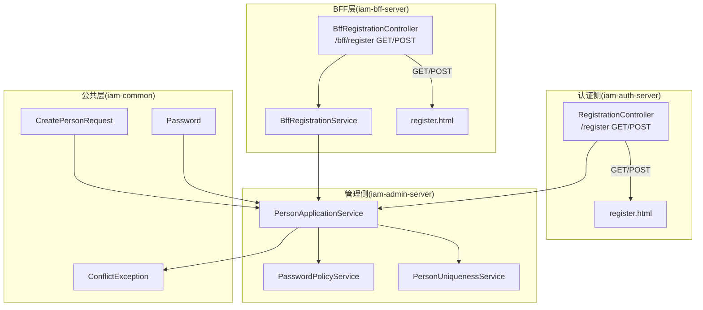
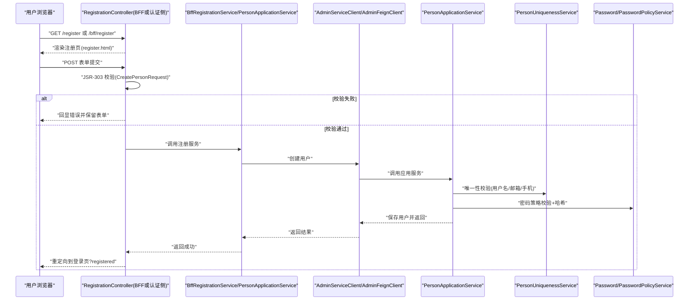
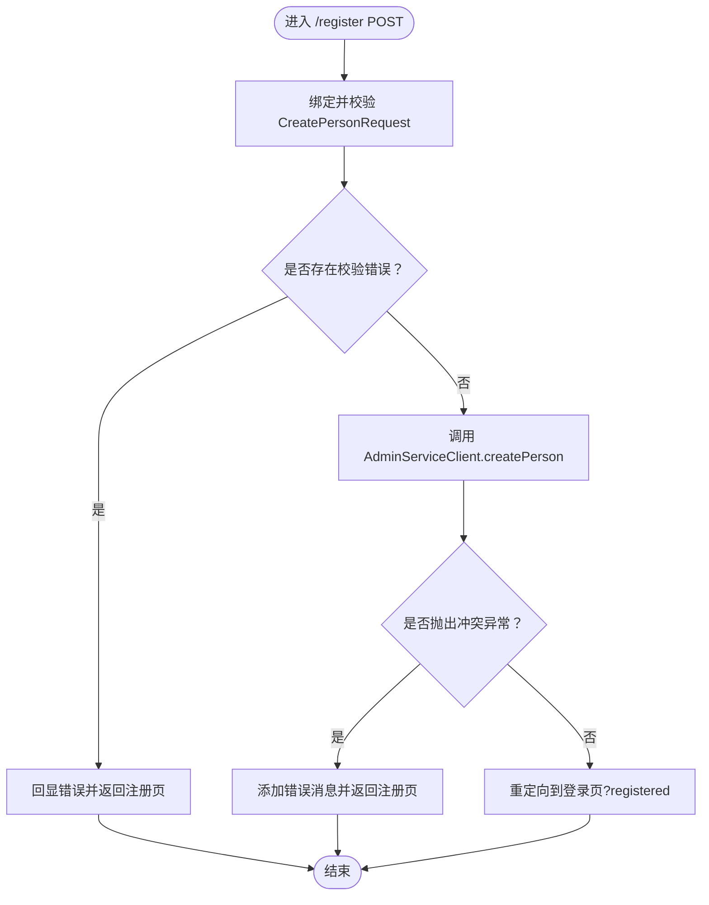
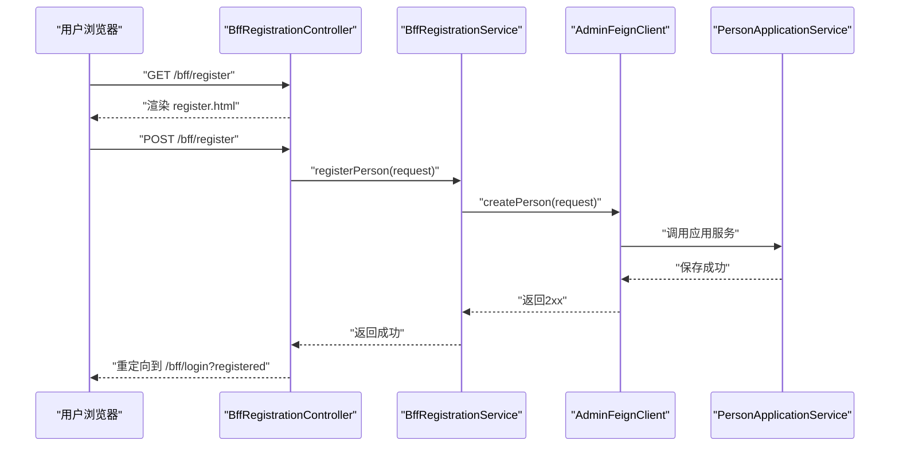
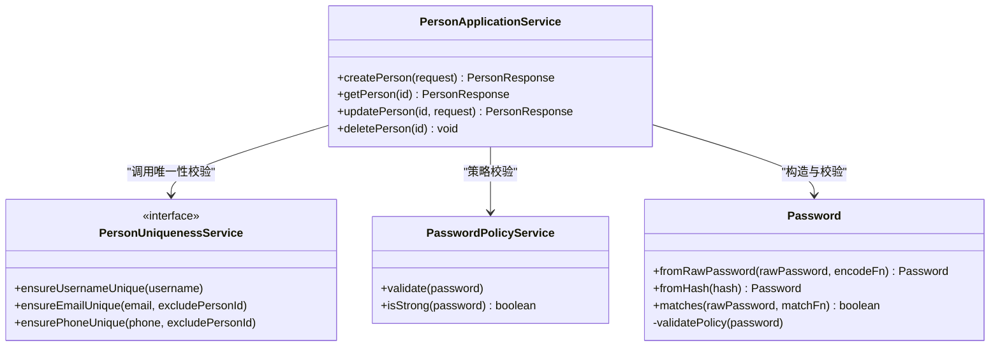
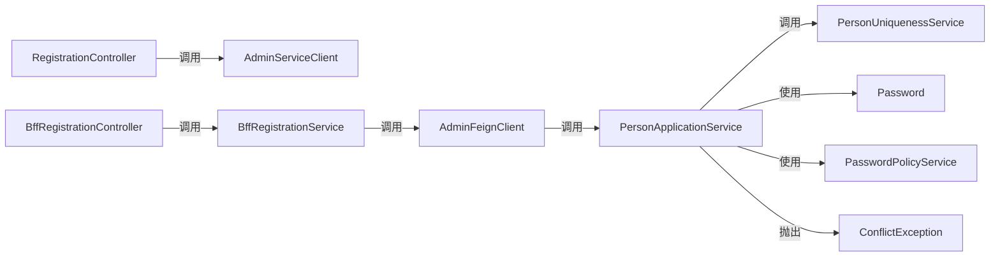

# 注册控制器

<cite>
**本文引用的文件**
- [RegistrationController.java](file://iam-auth-server/src/main/java/iam/platform/auth/interfaces/web/RegistrationController.java)
- [BffRegistrationController.java](file://iam-bff-server/src/main/java/iam/platform/bff/interfaces/web/BffRegistrationController.java)
- [BffRegistrationService.java](file://iam-bff-server/src/main/java/iam/platform/bff/application/service/BffRegistrationService.java)
- [PersonApplicationService.java](file://iam-admin-server/src/main/java/iam/platform/admin/application/service/PersonApplicationService.java)
- [CreatePersonRequest.java](file://iam-common/src/main/java/iam/platform/common/dto/request/CreatePersonRequest.java)
- [register.html（认证侧）](file://iam-auth-server/src/main/resources/templates/register.html)
- [register.html（BFF侧）](file://iam-bff-server/src/main/resources/templates/register.html)
- [PersonUniquenessService.java](file://iam-admin-server/src/main/java/iam/platform/admin/domain/service/PersonUniquenessService.java)
- [PasswordPolicyService.java](file://iam-admin-server/src/main/java/iam/platform/admin/domain/service/PasswordPolicyService.java)
- [Password.java](file://iam-common/src/main/java/iam/platform/common/model/valueobject/Password.java)
- [ConflictException.java](file://iam-common/src/main/java/iam/platform/common/model/exception/ConflictException.java)
</cite>

## 目录
1. [简介](#简介)
2. [项目结构](#项目结构)
3. [核心组件](#核心组件)
4. [架构总览](#架构总览)
5. [详细组件分析](#详细组件分析)
6. [依赖关系分析](#依赖关系分析)
7. [性能考量](#性能考量)
8. [故障排查指南](#故障排查指南)
9. [结论](#结论)
10. [附录：扩展与自定义开发示例](#附录扩展与自定义开发示例)

## 简介
本文件聚焦于注册控制器的技术实现，系统性解析以下内容：
- RegistrationController 的请求处理流程、表单绑定与校验、错误处理与重定向逻辑
- 注册页面渲染、用户输入处理、密码策略与邮箱唯一性校验机制
- 与 PersonApplicationService 的交互模式与数据传递方式
- 注册成功后的重定向行为、重复注册防护、用户体验优化建议
- 可扩展与自定义开发路径（如增加验证码、二次确认、邮箱验证等）

## 项目结构
注册功能在三层形态中均有实现：
- 认证侧（iam-auth-server）：直接调用管理侧 AdminServiceClient 完成注册
- BFF 层（iam-bff-server）：通过 BffRegistrationService 调用 AdminFeignClient 完成注册
- 公共层（iam-common）：提供注册请求 DTO、密码值对象与异常模型

图表来源
- [RegistrationController.java:1-46](file://iam-auth-server/src/main/java/iam/platform/auth/interfaces/web/RegistrationController.java#L1-L46)
- [BffRegistrationController.java:1-40](file://iam-bff-server/src/main/java/iam/platform/bff/interfaces/web/BffRegistrationController.java#L1-L40)
- [BffRegistrationService.java:1-31](file://iam-bff-server/src/main/java/iam/platform/bff/application/service/BffRegistrationService.java#L1-L31)
- [PersonApplicationService.java:1-122](file://iam-admin-server/src/main/java/iam/platform/admin/application/service/PersonApplicationService.java#L1-L122)
- [CreatePersonRequest.java:1-37](file://iam-common/src/main/java/iam/platform/common/dto/request/CreatePersonRequest.java#L1-L37)
- [PasswordPolicyService.java:1-35](file://iam-admin-server/src/main/java/iam/platform/admin/domain/service/PasswordPolicyService.java#L1-L35)
- [Password.java:1-90](file://iam-common/src/main/java/iam/platform/common/model/valueobject/Password.java#L1-L90)
- [ConflictException.java:1-10](file://iam-common/src/main/java/iam/platform/common/model/exception/ConflictException.java#L1-L10)

章节来源
- [RegistrationController.java:1-46](file://iam-auth-server/src/main/java/iam/platform/auth/interfaces/web/RegistrationController.java#L1-L46)
- [BffRegistrationController.java:1-40](file://iam-bff-server/src/main/java/iam/platform/bff/interfaces/web/BffRegistrationController.java#L1-L40)
- [BffRegistrationService.java:1-31](file://iam-bff-server/src/main/java/iam/platform/bff/application/service/BffRegistrationService.java#L1-L31)
- [PersonApplicationService.java:1-122](file://iam-admin-server/src/main/java/iam/platform/admin/application/service/PersonApplicationService.java#L1-L122)
- [CreatePersonRequest.java:1-37](file://iam-common/src/main/java/iam/platform/common/dto/request/CreatePersonRequest.java#L1-L37)
- [register.html（认证侧）:1-64](file://iam-auth-server/src/main/resources/templates/register.html#L1-L64)
- [register.html（BFF侧）:1-64](file://iam-bff-server/src/main/resources/templates/register.html#L1-L64)
- [PasswordPolicyService.java:1-35](file://iam-admin-server/src/main/java/iam/platform/admin/domain/service/PasswordPolicyService.java#L1-L35)
- [Password.java:1-90](file://iam-common/src/main/java/iam/platform/common/model/valueobject/Password.java#L1-L90)
- [ConflictException.java:1-10](file://iam-common/src/main/java/iam/platform/common/model/exception/ConflictException.java#L1-L10)

## 核心组件
- 注册控制器（认证侧）
  - GET /register：向模板注入空的 CreatePersonRequest 对象并返回注册页
  - POST /register：参数绑定与 JSR-303 校验，失败回显；成功则调用 AdminServiceClient 创建用户，异常时捕获冲突并回显错误信息
  - 成功后重定向到登录页并带 registered 参数
- 注册控制器（BFF侧）
  - GET /bff/register：向模板注入 CreatePersonRequest 并返回注册页
  - POST /bff/register：调用 BffRegistrationService 执行注册，异常时回显错误信息并保留已填表单
  - 成功后重定向到 /bff/login?registered
- 注册服务（BFF侧）
  - 通过 AdminFeignClient 调用管理侧接口，对响应状态进行检查，非2xx抛出运行时异常
- 应用服务（管理侧）
  - createPerson：执行用户名/邮箱/手机号唯一性校验，校验密码策略并通过 Password 值对象完成哈希，保存实体并返回响应
- 请求DTO与值对象
  - CreatePersonRequest：定义用户名、邮箱、手机、密码、昵称、头像等字段的校验规则
  - Password：封装密码策略校验与哈希，避免在公共模块引入安全依赖
- 异常模型
  - ConflictException：用于标识资源冲突（如用户名/邮箱/手机号已存在），由 PersonUniquenessService 触发

章节来源
- [RegistrationController.java:1-46](file://iam-auth-server/src/main/java/iam/platform/auth/interfaces/web/RegistrationController.java#L1-L46)
- [BffRegistrationController.java:1-40](file://iam-bff-server/src/main/java/iam/platform/bff/interfaces/web/BffRegistrationController.java#L1-L40)
- [BffRegistrationService.java:1-31](file://iam-bff-server/src/main/java/iam/platform/bff/application/service/BffRegistrationService.java#L1-L31)
- [PersonApplicationService.java:31-51](file://iam-admin-server/src/main/java/iam/platform/admin/application/service/PersonApplicationService.java#L31-L51)
- [CreatePersonRequest.java:15-36](file://iam-common/src/main/java/iam/platform/common/dto/request/CreatePersonRequest.java#L15-L36)
- [Password.java:37-41](file://iam-common/src/main/java/iam/platform/common/model/valueobject/Password.java#L37-L41)
- [ConflictException.java:1-10](file://iam-common/src/main/java/iam/platform/common/model/exception/ConflictException.java#L1-L10)

## 架构总览
注册流程在不同边界下的职责划分如下：

图表来源
- [RegistrationController.java:21-44](file://iam-auth-server/src/main/java/iam/platform/auth/interfaces/web/RegistrationController.java#L21-L44)
- [BffRegistrationController.java:21-38](file://iam-bff-server/src/main/java/iam/platform/bff/interfaces/web/BffRegistrationController.java#L21-L38)
- [BffRegistrationService.java:23-29](file://iam-bff-server/src/main/java/iam/platform/bff/application/service/BffRegistrationService.java#L23-L29)
- [PersonApplicationService.java:34-51](file://iam-admin-server/src/main/java/iam/platform/admin/application/service/PersonApplicationService.java#L34-L51)
- [PersonUniquenessService.java:7-35](file://iam-admin-server/src/main/java/iam/platform/admin/domain/service/PersonUniquenessService.java#L7-L35)
- [PasswordPolicyService.java:11-24](file://iam-admin-server/src/main/java/iam/platform/admin/domain/service/PasswordPolicyService.java#L11-L24)
- [Password.java:37-41](file://iam-common/src/main/java/iam/platform/common/model/valueobject/Password.java#L37-L41)

## 详细组件分析

### 认证侧 RegistrationController
- GET /register
  - 向模型注入 CreatePersonRequest 对象，供 Thymeleaf 模板绑定
  - 返回 register.html
- POST /register
  - 使用 @Valid + BindingResult 进行参数校验
  - 若存在校验错误，将错误信息回显至模板并返回注册页
  - 调用 AdminServiceClient.createPerson(request) 创建用户
  - 捕获 ConflictException：将错误消息写入模型并回显注册页
  - 捕获其他异常：统一提示“注册失败，请稍后再试”
  - 成功后重定向到登录页并携带 registered 参数

图表来源
- [RegistrationController.java:27-44](file://iam-auth-server/src/main/java/iam/platform/auth/interfaces/web/RegistrationController.java#L27-L44)

章节来源
- [RegistrationController.java:1-46](file://iam-auth-server/src/main/java/iam/platform/auth/interfaces/web/RegistrationController.java#L1-L46)
- [register.html（认证侧）:1-64](file://iam-auth-server/src/main/resources/templates/register.html#L1-L64)

### BFF侧注册控制器与服务
- GET /bff/register
  - 注入 CreatePersonRequest 至模板并返回注册页
- POST /bff/register
  - 调用 BffRegistrationService.registerPerson(request)
  - 捕获异常：将错误消息与原始表单数据回显至模板
  - 成功后重定向到 /bff/login?registered
- BffRegistrationService.registerPerson
  - 记录日志并调用 AdminFeignClient.createPerson
  - 校验响应状态码是否为2xx，否则抛出运行时异常

图表来源
- [BffRegistrationController.java:21-38](file://iam-bff-server/src/main/java/iam/platform/bff/interfaces/web/BffRegistrationController.java#L21-L38)
- [BffRegistrationService.java:23-29](file://iam-bff-server/src/main/java/iam/platform/bff/application/service/BffRegistrationService.java#L23-L29)
- [PersonApplicationService.java:34-51](file://iam-admin-server/src/main/java/iam/platform/admin/application/service/PersonApplicationService.java#L34-L51)

章节来源
- [BffRegistrationController.java:1-40](file://iam-bff-server/src/main/java/iam/platform/bff/interfaces/web/BffRegistrationController.java#L1-L40)
- [BffRegistrationService.java:1-31](file://iam-bff-server/src/main/java/iam/platform/bff/application/service/BffRegistrationService.java#L1-L31)
- [register.html（BFF侧）:1-64](file://iam-bff-server/src/main/resources/templates/register.html#L1-L64)

### 管理侧应用服务与领域服务
- PersonApplicationService.createPerson
  - 调用 PersonUniquenessService 确保用户名/邮箱/手机唯一
  - 使用 Password.fromRawPassword 进行策略校验与哈希
  - 通过领域工厂方法构建 Person 实体并持久化
  - 返回标准化响应
- PersonUniquenessService
  - 提供 ensureUsernameUnique、ensureEmailUnique、ensurePhoneUnique 方法
  - 冲突时抛出 ConflictException
- PasswordPolicyService
  - 提供强密码策略校验与强度判断
- Password 值对象
  - 封装策略校验与哈希，避免在公共模块引入安全依赖

图表来源
- [PersonApplicationService.java:34-51](file://iam-admin-server/src/main/java/iam/platform/admin/application/service/PersonApplicationService.java#L34-L51)
- [PersonUniquenessService.java:7-35](file://iam-admin-server/src/main/java/iam/platform/admin/domain/service/PersonUniquenessService.java#L7-L35)
- [PasswordPolicyService.java:11-24](file://iam-admin-server/src/main/java/iam/platform/admin/domain/service/PasswordPolicyService.java#L11-L24)
- [Password.java:37-41](file://iam-common/src/main/java/iam/platform/common/model/valueobject/Password.java#L37-L41)

章节来源
- [PersonApplicationService.java:31-51](file://iam-admin-server/src/main/java/iam/platform/admin/application/service/PersonApplicationService.java#L31-L51)
- [PersonUniquenessService.java:1-36](file://iam-admin-server/src/main/java/iam/platform/admin/domain/service/PersonUniquenessService.java#L1-L36)
- [PasswordPolicyService.java:1-35](file://iam-admin-server/src/main/java/iam/platform/admin/domain/service/PasswordPolicyService.java#L1-L35)
- [Password.java:1-90](file://iam-common/src/main/java/iam/platform/common/model/valueobject/Password.java#L1-L90)

### 注册表单字段与验证规则
- 字段定义与约束
  - 用户名：必填，长度3~100
  - 邮箱：必填，合法邮箱格式
  - 手机：可选，最大长度20
  - 密码：必填，长度8~100
  - 昵称：可选，最大长度100
  - 头像URL：可选，最大长度500
- 前端一致性校验
  - 认证侧与BFF侧模板均包含“确认密码”字段，并在提交前校验两次密码一致，不一致则阻止提交并弹窗提示

章节来源
- [CreatePersonRequest.java:15-36](file://iam-common/src/main/java/iam/platform/common/dto/request/CreatePersonRequest.java#L15-L36)
- [register.html（认证侧）:32-41](file://iam-auth-server/src/main/resources/templates/register.html#L32-L41)
- [register.html（BFF侧）:32-41](file://iam-bff-server/src/main/resources/templates/register.html#L32-L41)

### 密码策略与邮箱验证机制
- 密码策略
  - 最小长度8位，必须包含大写字母、小写字母与数字
  - 通过 Password.fromRawPassword 与 PasswordPolicyService.validate 实施
- 邮箱验证
  - 邮箱唯一性由 PersonUniquenessService.ensureEmailUnique 保证
  - 管理侧应用服务在创建时对邮箱进行唯一性检查
- 邮箱验证状态
  - PersonResponse 中包含 emailVerified 字段，但当前注册流程未实现邮箱验证发送与状态更新逻辑

章节来源
- [Password.java:67-83](file://iam-common/src/main/java/iam/platform/common/model/valueobject/Password.java#L67-L83)
- [PasswordPolicyService.java:11-24](file://iam-admin-server/src/main/java/iam/platform/admin/domain/service/PasswordPolicyService.java#L11-L24)
- [PersonApplicationService.java:36-37](file://iam-admin-server/src/main/java/iam/platform/admin/application/service/PersonApplicationService.java#L36-L37)
- [PersonUniquenessService.java:16-24](file://iam-admin-server/src/main/java/iam/platform/admin/domain/service/PersonUniquenessService.java#L16-L24)

### 重复注册防护与错误处理
- 重复注册防护
  - 通过 PersonUniquenessService 在创建阶段拦截用户名/邮箱/手机重复
  - 冲突时抛出 ConflictException，控制器捕获并回显错误
- 错误处理
  - 控制器层：捕获 ConflictException 与通用异常，分别设置错误消息并回显注册页
  - BFF服务层：对非2xx响应抛出运行时异常，由控制器统一处理
- 重定向逻辑
  - 成功后重定向至登录页并携带 registered 参数，便于前端显示成功提示

章节来源
- [PersonUniquenessService.java:14-34](file://iam-admin-server/src/main/java/iam/platform/admin/domain/service/PersonUniquenessService.java#L14-L34)
- [ConflictException.java:1-10](file://iam-common/src/main/java/iam/platform/common/model/exception/ConflictException.java#L1-L10)
- [RegistrationController.java:34-43](file://iam-auth-server/src/main/java/iam/platform/auth/interfaces/web/RegistrationController.java#L34-L43)
- [BffRegistrationService.java:23-29](file://iam-bff-server/src/main/java/iam/platform/bff/application/service/BffRegistrationService.java#L23-L29)

## 依赖关系分析
- 控制器依赖
  - 认证侧：依赖 AdminServiceClient
  - BFF侧：依赖 BffRegistrationService 与 AdminFeignClient
- 应用服务依赖
  - PersonApplicationService 依赖 PersonUniquenessService、PasswordEncoder、PersonRepository
- 值对象与策略
  - Password 值对象负责策略校验与哈希
  - PasswordPolicyService 提供策略校验能力
- 异常模型
  - ConflictException 作为唯一性冲突的标准异常类型

图表来源
- [RegistrationController.java:19-35](file://iam-auth-server/src/main/java/iam/platform/auth/interfaces/web/RegistrationController.java#L19-L35)
- [BffRegistrationController.java:19-31](file://iam-bff-server/src/main/java/iam/platform/bff/interfaces/web/BffRegistrationController.java#L19-L31)
- [BffRegistrationService.java:18-25](file://iam-bff-server/src/main/java/iam/platform/bff/application/service/BffRegistrationService.java#L18-L25)
- [PersonApplicationService.java:27-29](file://iam-admin-server/src/main/java/iam/platform/admin/application/service/PersonApplicationService.java#L27-L29)
- [Password.java:37-41](file://iam-common/src/main/java/iam/platform/common/model/valueobject/Password.java#L37-L41)
- [PasswordPolicyService.java:11-24](file://iam-admin-server/src/main/java/iam/platform/admin/domain/service/PasswordPolicyService.java#L11-L24)
- [ConflictException.java:1-10](file://iam-common/src/main/java/iam/platform/common/model/exception/ConflictException.java#L1-L10)

章节来源
- [RegistrationController.java:1-46](file://iam-auth-server/src/main/java/iam/platform/auth/interfaces/web/RegistrationController.java#L1-L46)
- [BffRegistrationController.java:1-40](file://iam-bff-server/src/main/java/iam/platform/bff/interfaces/web/BffRegistrationController.java#L1-L40)
- [BffRegistrationService.java:1-31](file://iam-bff-server/src/main/java/iam/platform/bff/application/service/BffRegistrationService.java#L1-L31)
- [PersonApplicationService.java:1-122](file://iam-admin-server/src/main/java/iam/platform/admin/application/service/PersonApplicationService.java#L1-L122)

## 性能考量
- 控制器层
  - 使用 JSR-303 校验减少无效请求进入服务层
  - 异常捕获与快速回显，避免多余渲染开销
- 应用服务层
  - 事务边界明确，仅在创建/更新时开启
  - 唯一性检查与密码策略校验在数据库访问前完成，降低失败成本
- BFF层
  - 通过 Feign 客户端直连管理侧，减少中间环节
  - 对响应状态进行严格校验，避免下游异常扩散

## 故障排查指南
- 常见问题与定位
  - 表单校验失败：检查 CreatePersonRequest 的字段约束与前端模板绑定
  - 密码策略失败：确认密码满足最小长度与字符集要求
  - 唯一性冲突：检查用户名/邮箱/手机是否已被占用
  - 服务调用失败：BFF侧检查 AdminFeignClient 返回状态码，认证侧检查 AdminServiceClient 调用链
- 日志与可观测性
  - BFF注册服务记录注册日志
  - 应用服务在创建成功后输出用户信息日志
- 用户体验
  - 控制器层统一错误回显，保持表单数据不丢失
  - 登录页可通过查询参数 registered 判断是否显示成功提示

章节来源
- [BffRegistrationService.java:24-28](file://iam-bff-server/src/main/java/iam/platform/bff/application/service/BffRegistrationService.java#L24-L28)
- [PersonApplicationService.java:49-49](file://iam-admin-server/src/main/java/iam/platform/admin/application/service/PersonApplicationService.java#L49-L49)
- [RegistrationController.java:34-43](file://iam-auth-server/src/main/java/iam/platform/auth/interfaces/web/RegistrationController.java#L34-L43)

## 结论
本注册体系采用清晰的分层设计：控制器负责请求接入与错误回显，BFF层承担对外聚合与调用，应用服务实现核心业务规则与数据一致性保障。通过值对象与策略服务解耦了密码策略与唯一性校验，提升了可维护性与可测试性。当前实现具备良好的扩展空间，可在后续版本中加入邮箱验证、图形验证码、二次确认等增强功能。

## 附录：扩展与自定义开发示例
- 增加邮箱验证
  - 在 PersonApplicationService.createPerson 后触发发送邮件任务，并在用户首次登录时校验 emailVerified
  - 参考字段：PersonResponse.emailVerified
- 增加图形验证码
  - 在 BffRegistrationController.processRegistration 前增加验证码校验步骤
  - 参考：BffRegistrationController.processRegistration
- 自定义密码策略
  - 扩展 PasswordPolicyService.validate 与 Password.validatePolicy，支持更多复杂度规则
  - 参考：PasswordPolicyService.validate、Password.validatePolicy
- 前端交互优化
  - 在注册页增加实时密码强度提示与邮箱/用户名可用性检测
  - 参考：register.html 中的表单与脚本

章节来源
- [PersonApplicationService.java:34-51](file://iam-admin-server/src/main/java/iam/platform/admin/application/service/PersonApplicationService.java#L34-L51)
- [BffRegistrationController.java:27-38](file://iam-bff-server/src/main/java/iam/platform/bff/interfaces/web/BffRegistrationController.java#L27-L38)
- [PasswordPolicyService.java:11-24](file://iam-admin-server/src/main/java/iam/platform/admin/domain/service/PasswordPolicyService.java#L11-L24)
- [Password.java:67-83](file://iam-common/src/main/java/iam/platform/common/model/valueobject/Password.java#L67-L83)
- [register.html（认证侧）:1-64](file://iam-auth-server/src/main/resources/templates/register.html#L1-L64)
- [register.html（BFF侧）:1-64](file://iam-bff-server/src/main/resources/templates/register.html#L1-L64)