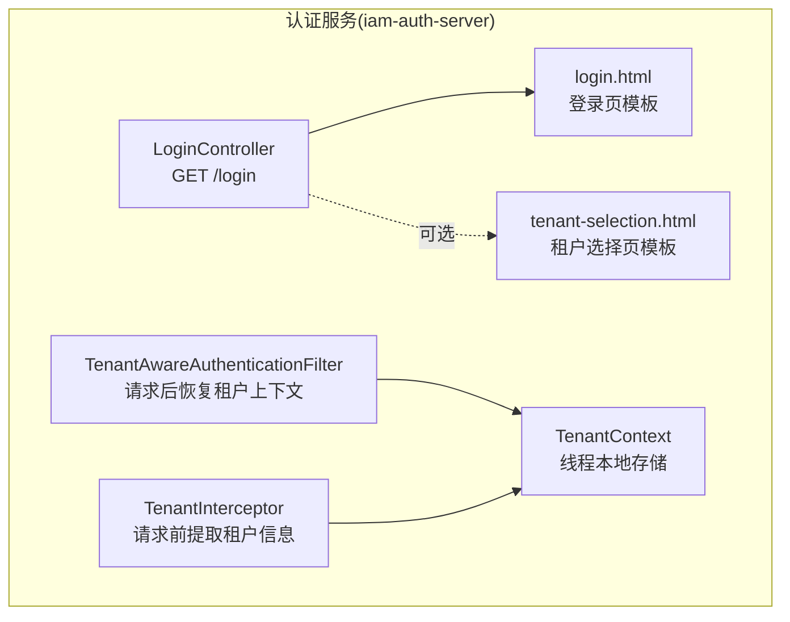
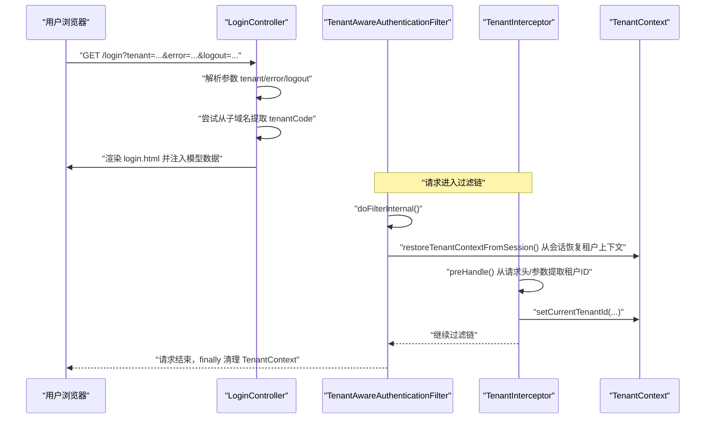
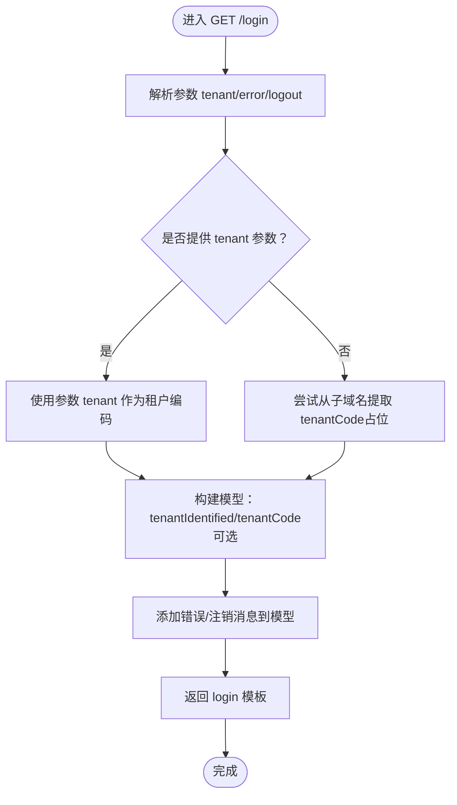
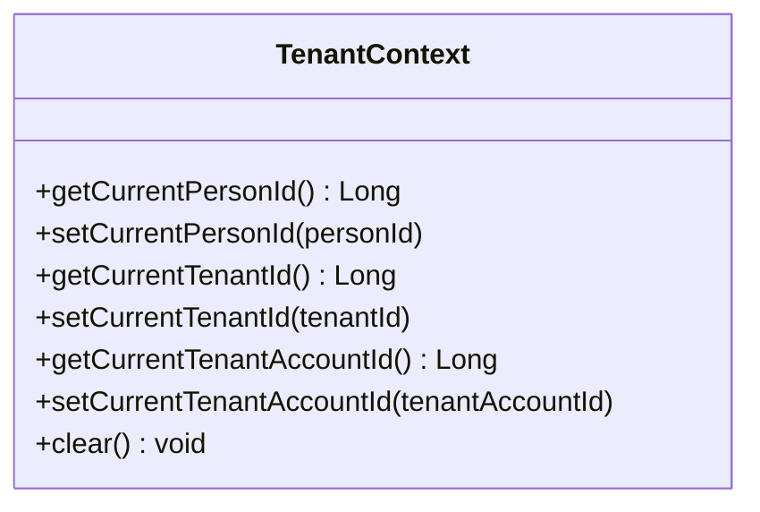
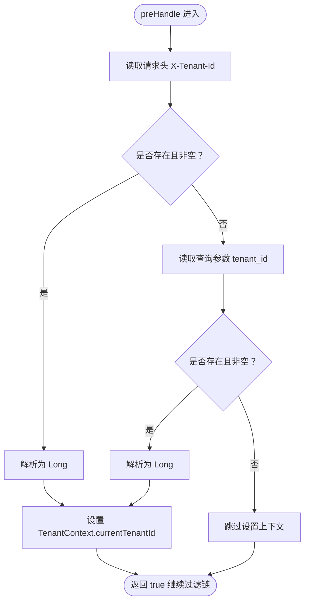
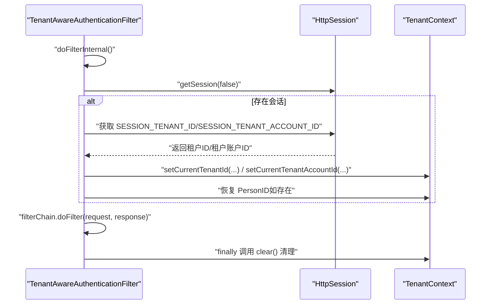
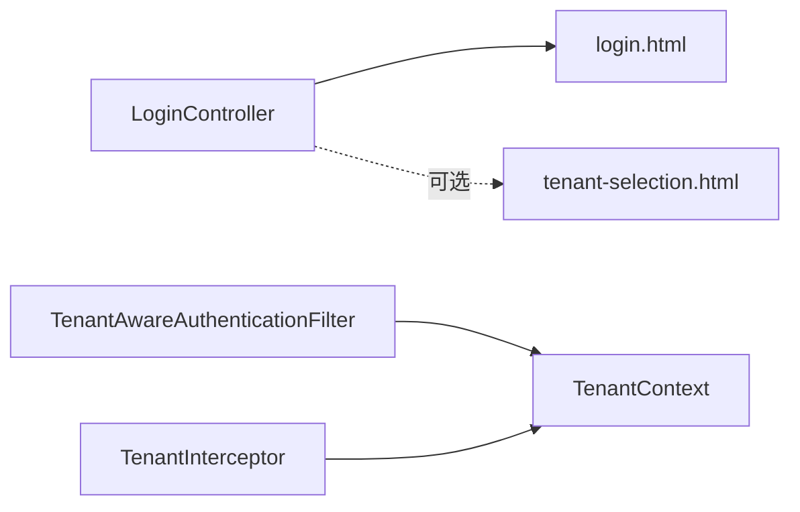

# 登录控制器

<cite>
**本文引用的文件**
- [LoginController.java](file://iam-auth-server/src/main/java/iam/platform/auth/interfaces/web/LoginController.java)
- [TenantAwareAuthenticationFilter.java](file://iam-auth-server/src/main/java/iam/platform/auth/infrastructure/security/TenantAwareAuthenticationFilter.java)
- [TenantContext.java](file://iam-auth-server/src/main/java/iam/platform/auth/infrastructure/security/TenantContext.java)
- [TenantInterceptor.java](file://iam-auth-server/src/main/java/iam/platform/auth/infrastructure/security/TenantInterceptor.java)
- [login.html](file://iam-auth-server/src/main/resources/templates/login.html)
- [tenant-selection.html](file://iam-auth-server/src/main/resources/templates/tenant-selection.html)
</cite>

## 目录
1. [简介](#简介)
2. [项目结构](#项目结构)
3. [核心组件](#核心组件)
4. [架构总览](#架构总览)
5. [详细组件分析](#详细组件分析)
6. [依赖分析](#依赖分析)
7. [性能考虑](#性能考虑)
8. [故障排查指南](#故障排查指南)
9. [结论](#结论)
10. [附录](#附录)

## 简介
本文件面向登录控制器的技术实现，围绕 LoginController 的多租户支持机制、登录页面渲染逻辑、错误处理与会话管理进行深入解析。重点涵盖以下方面：
- 三种租户识别方法：子域名识别、查询参数识别、头部识别的实现原理与协作关系
- GET /login 端点的参数处理、模型数据绑定、视图渲染流程
- 与 TenantAwareAuthenticationFilter 的协作机制与租户上下文建立过程
- 登录表单验证、错误消息显示、注销状态处理
- 实际代码示例路径，展示如何扩展登录控制器功能

## 项目结构
登录相关能力主要分布在认证服务模块中，涉及接口层控制器、安全过滤与拦截器、以及 Thymeleaf 视图模板。

图表来源
- [LoginController.java:19-47](file://iam-auth-server/src/main/java/iam/platform/auth/interfaces/web/LoginController.java#L19-L47)
- [TenantAwareAuthenticationFilter.java:28-44](file://iam-auth-server/src/main/java/iam/platform/auth/infrastructure/security/TenantAwareAuthenticationFilter.java#L28-L44)
- [TenantInterceptor.java:23-42](file://iam-auth-server/src/main/java/iam/platform/auth/infrastructure/security/TenantInterceptor.java#L23-L42)
- [TenantContext.java:7-44](file://iam-auth-server/src/main/java/iam/platform/auth/infrastructure/security/TenantContext.java#L7-L44)
- [login.html:164-211](file://iam-auth-server/src/main/resources/templates/login.html#L164-L211)
- [tenant-selection.html:194-219](file://iam-auth-server/src/main/resources/templates/tenant-selection.html#L194-L219)

章节来源
- [LoginController.java:1-58](file://iam-auth-server/src/main/java/iam/platform/auth/interfaces/web/LoginController.java#L1-L58)
- [TenantAwareAuthenticationFilter.java:1-68](file://iam-auth-server/src/main/java/iam/platform/auth/infrastructure/security/TenantAwareAuthenticationFilter.java#L1-L68)
- [TenantInterceptor.java:1-51](file://iam-auth-server/src/main/java/iam/platform/auth/infrastructure/security/TenantInterceptor.java#L1-L51)
- [TenantContext.java:1-45](file://iam-auth-server/src/main/java/iam/platform/auth/infrastructure/security/TenantContext.java#L1-L45)
- [login.html:1-343](file://iam-auth-server/src/main/resources/templates/login.html#L1-L343)
- [tenant-selection.html:1-237](file://iam-auth-server/src/main/resources/templates/tenant-selection.html#L1-L237)

## 核心组件
- 登录控制器 LoginController：负责渲染登录页并处理多租户标识与错误/注销消息传递
- 租户上下文 TenantContext：以线程本地变量保存当前请求生命周期内的人员、租户与租户账户信息
- 租户拦截器 TenantInterceptor：在请求到达控制器前从请求头或查询参数提取租户标识并写入上下文
- 租户感知过滤器 TenantAwareAuthenticationFilter：在请求完成后清理上下文，并在后续请求中从会话恢复租户上下文（用于已登录场景）
- 登录页模板 login.html：统一登录表单（密码、验证码、社交登录），支持错误/成功/注销消息提示
- 租户选择页模板 tenant-selection.html：当未识别到租户时，引导用户选择租户

章节来源
- [LoginController.java:16-57](file://iam-auth-server/src/main/java/iam/platform/auth/interfaces/web/LoginController.java#L16-L57)
- [TenantContext.java:7-44](file://iam-auth-server/src/main/java/iam/platform/auth/infrastructure/security/TenantContext.java#L7-L44)
- [TenantInterceptor.java:17-50](file://iam-auth-server/src/main/java/iam/platform/auth/infrastructure/security/TenantInterceptor.java#L17-L50)
- [TenantAwareAuthenticationFilter.java:21-67](file://iam-auth-server/src/main/java/iam/platform/auth/infrastructure/security/TenantAwareAuthenticationFilter.java#L21-L67)
- [login.html:144-154](file://iam-auth-server/src/main/resources/templates/login.html#L144-L154)
- [tenant-selection.html:186-192](file://iam-auth-server/src/main/resources/templates/tenant-selection.html#L186-L192)

## 架构总览
下图展示了登录控制器与安全上下文组件之间的交互关系，以及请求生命周期中的上下文建立与清理过程。

图表来源
- [LoginController.java:19-47](file://iam-auth-server/src/main/java/iam/platform/auth/interfaces/web/LoginController.java#L19-L47)
- [TenantAwareAuthenticationFilter.java:28-44](file://iam-auth-server/src/main/java/iam/platform/auth/infrastructure/security/TenantAwareAuthenticationFilter.java#L28-L44)
- [TenantInterceptor.java:23-42](file://iam-auth-server/src/main/java/iam/platform/auth/infrastructure/security/TenantInterceptor.java#L23-L42)
- [TenantContext.java:39-43](file://iam-auth-server/src/main/java/iam/platform/auth/infrastructure/security/TenantContext.java#L39-L43)

## 详细组件分析

### 登录控制器 LoginController
- 多租户支持机制
  - 查询参数识别：优先读取 tenant 参数作为租户编码
  - 子域名识别：若未提供，则尝试从子域名提取（当前实现为占位，实际由过滤器处理）
  - 头部识别：通过 TenantInterceptor 在请求前从 X-Tenant-Id 提取租户ID并写入上下文
- 参数处理与模型绑定
  - 接收 tenant、error、logout 三个可选参数
  - 将 tenantIdentified、tenantCode（可选）注入模型，供模板判断是否显示租户选择
  - 将 error、logout 消息注入模型，用于页面提示
- 视图渲染
  - 返回 login 模板；若未识别到租户，模板可通过逻辑控制引导用户选择租户

图表来源
- [LoginController.java:19-47](file://iam-auth-server/src/main/java/iam/platform/auth/interfaces/web/LoginController.java#L19-L47)

章节来源
- [LoginController.java:16-57](file://iam-auth-server/src/main/java/iam/platform/auth/interfaces/web/LoginController.java#L16-L57)
- [login.html:144-154](file://iam-auth-server/src/main/resources/templates/login.html#L144-L154)

### 租户上下文 TenantContext
- 设计要点
  - 使用 ThreadLocal 存储当前请求的人员ID、租户ID、租户账户ID
  - 提供设置与清理方法，确保请求结束后释放资源，避免内存泄漏
- 生命周期
  - 请求开始：TenantInterceptor 或登录流程设置上下文
  - 请求结束：TenantAwareAuthenticationFilter 清理上下文

图表来源
- [TenantContext.java:7-44](file://iam-auth-server/src/main/java/iam/platform/auth/infrastructure/security/TenantContext.java#L7-L44)

章节来源
- [TenantContext.java:7-44](file://iam-auth-server/src/main/java/iam/platform/auth/infrastructure/security/TenantContext.java#L7-L44)

### 租户拦截器 TenantInterceptor
- 功能
  - 在请求到达控制器前，从请求头 X-Tenant-Id 或查询参数 tenant_id 中提取租户ID
  - 将租户ID写入 TenantContext，供后续业务使用
- 错误处理
  - 非法格式将被忽略，不设置上下文

图表来源
- [TenantInterceptor.java:23-42](file://iam-auth-server/src/main/java/iam/platform/auth/infrastructure/security/TenantInterceptor.java#L23-L42)

章节来源
- [TenantInterceptor.java:17-50](file://iam-auth-server/src/main/java/iam/platform/auth/infrastructure/security/TenantInterceptor.java#L17-L50)

### 租户感知过滤器 TenantAwareAuthenticationFilter
- 功能
  - 在请求完成后清理 ThreadLocal 上下文，防止内存泄漏
  - 在请求过程中尝试从会话恢复租户上下文（适用于已登录场景）
- 关键常量
  - 会话键：SESSION_TENANT_ID、SESSION_TENANT_ACCOUNT_ID

图表来源
- [TenantAwareAuthenticationFilter.java:28-44](file://iam-auth-server/src/main/java/iam/platform/auth/infrastructure/security/TenantAwareAuthenticationFilter.java#L28-L44)
- [TenantAwareAuthenticationFilter.java:49-66](file://iam-auth-server/src/main/java/iam/platform/auth/infrastructure/security/TenantAwareAuthenticationFilter.java#L49-L66)

章节来源
- [TenantAwareAuthenticationFilter.java:21-67](file://iam-auth-server/src/main/java/iam/platform/auth/infrastructure/security/TenantAwareAuthenticationFilter.java#L21-L67)

### 登录页面渲染与消息处理
- 登录页模板 login.html
  - 支持多种登录方式：密码、验证码（短信/邮箱）、社交登录
  - 通过 Thymeleaf 显示错误/注册成功/注销提示
  - 表单统一提交至 /login，隐藏域 method 指定认证方式
- 注销状态处理
  - 当 GET /login?logout=true 时，模板显示“已成功注销”的提示

章节来源
- [login.html:144-154](file://iam-auth-server/src/main/resources/templates/login.html#L144-L154)
- [login.html:164-211](file://iam-auth-server/src/main/resources/templates/login.html#L164-L211)

### 租户选择页与未识别租户流程
- 当 LoginController 无法识别租户时，可在模型中指示未识别状态，引导用户访问租户选择页
- 租户选择页 tenant-selection.html 提供租户列表与选择逻辑，提交至 /select-tenant

章节来源
- [LoginController.java:30-36](file://iam-auth-server/src/main/java/iam/platform/auth/interfaces/web/LoginController.java#L30-L36)
- [tenant-selection.html:194-219](file://iam-auth-server/src/main/resources/templates/tenant-selection.html#L194-L219)

## 依赖分析
- 控制器依赖
  - LoginController 依赖 Thymeleaf 模板进行视图渲染
  - 通过 TenantInterceptor/TenantAwareAuthenticationFilter 间接获得租户上下文
- 安全组件耦合
  - TenantInterceptor 与 TenantContext 强耦合，负责上下文初始化
  - TenantAwareAuthenticationFilter 与 TenantContext 强耦合，负责上下文清理与恢复

图表来源
- [LoginController.java:19-47](file://iam-auth-server/src/main/java/iam/platform/auth/interfaces/web/LoginController.java#L19-L47)
- [TenantAwareAuthenticationFilter.java:28-44](file://iam-auth-server/src/main/java/iam/platform/auth/infrastructure/security/TenantAwareAuthenticationFilter.java#L28-L44)
- [TenantInterceptor.java:23-42](file://iam-auth-server/src/main/java/iam/platform/auth/infrastructure/security/TenantInterceptor.java#L23-L42)
- [TenantContext.java:39-43](file://iam-auth-server/src/main/java/iam/platform/auth/infrastructure/security/TenantContext.java#L39-L43)

章节来源
- [LoginController.java:16-57](file://iam-auth-server/src/main/java/iam/platform/auth/interfaces/web/LoginController.java#L16-L57)
- [TenantAwareAuthenticationFilter.java:21-67](file://iam-auth-server/src/main/java/iam/platform/auth/infrastructure/security/TenantAwareAuthenticationFilter.java#L21-L67)
- [TenantInterceptor.java:17-50](file://iam-auth-server/src/main/java/iam/platform/auth/infrastructure/security/TenantInterceptor.java#L17-L50)
- [TenantContext.java:7-44](file://iam-auth-server/src/main/java/iam/platform/auth/infrastructure/security/TenantContext.java#L7-L44)

## 性能考虑
- 线程本地存储开销低：ThreadLocal 访问成本低，适合短生命周期的上下文传递
- 过滤器与拦截器仅在必要时设置上下文，避免重复计算
- 会话恢复逻辑仅在存在会话时执行，减少无效 IO

## 故障排查指南
- 未显示租户选择
  - 检查 LoginController 是否正确注入 tenantIdentified=false 的模型属性
  - 确认模板逻辑是否根据该属性渲染租户选择入口
- 登录失败提示不显示
  - 确认 LoginController 是否将 error 参数映射到模型
  - 检查模板中是否使用了正确的 Thymeleaf 条件表达式显示错误
- 注销提示不显示
  - 确认 LoginController 是否将 logout 参数映射到模型
  - 检查模板中是否使用了正确的 Thymeleaf 条件表达式显示注销提示
- 租户上下文未生效
  - 检查 TenantInterceptor 是否正确从请求头/参数解析并设置租户ID
  - 确认 TenantAwareAuthenticationFilter 是否在请求结束后清理上下文，避免脏数据

章节来源
- [LoginController.java:38-44](file://iam-auth-server/src/main/java/iam/platform/auth/interfaces/web/LoginController.java#L38-L44)
- [login.html:144-154](file://iam-auth-server/src/main/resources/templates/login.html#L144-L154)
- [TenantInterceptor.java:32-39](file://iam-auth-server/src/main/java/iam/platform/auth/infrastructure/security/TenantInterceptor.java#L32-L39)
- [TenantAwareAuthenticationFilter.java:38-43](file://iam-auth-server/src/main/java/iam/platform/auth/infrastructure/security/TenantAwareAuthenticationFilter.java#L38-L43)

## 结论
LoginController 通过参数与占位的子域名提取实现多租户识别，并结合 TenantInterceptor/TenantAwareAuthenticationFilter 在请求生命周期内建立与清理租户上下文。登录页模板提供了统一的表单与消息提示机制，配合租户选择页实现未识别租户的引导流程。整体设计清晰、职责分离明确，便于扩展与维护。

## 附录
- 扩展建议与示例路径
  - 自定义子域名提取：在 LoginController 的 extractFromSubdomain 方法中实现从 HttpServletRequest 获取子域名的逻辑
    - 示例路径参考：[LoginController.java:52-56](file://iam-auth-server/src/main/java/iam/platform/auth/interfaces/web/LoginController.java#L52-L56)
  - 增强错误消息映射：在 LoginController 中根据不同的错误码映射更详细的错误提示
    - 示例路径参考：[LoginController.java:38-44](file://iam-auth-server/src/main/java/iam/platform/auth/interfaces/web/LoginController.java#L38-L44)
  - 扩展租户识别策略：在 TenantInterceptor.preHandle 中增加新的请求头或参数解析逻辑
    - 示例路径参考：[TenantInterceptor.java:23-42](file://iam-auth-server/src/main/java/iam/platform/auth/infrastructure/security/TenantInterceptor.java#L23-L42)
  - 登录页定制：在 login.html 中新增字段或修改样式，注意与控制器模型属性保持一致
    - 示例路径参考：[login.html:164-211](file://iam-auth-server/src/main/resources/templates/login.html#L164-L211)