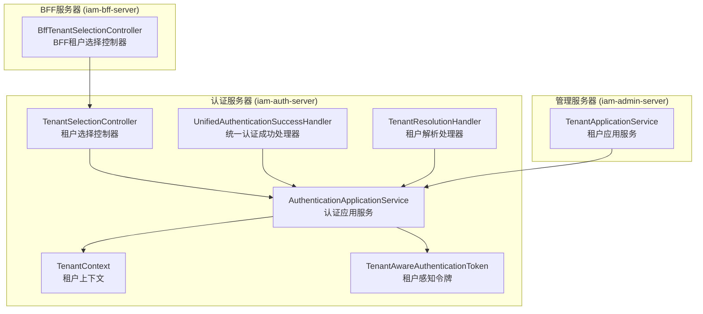
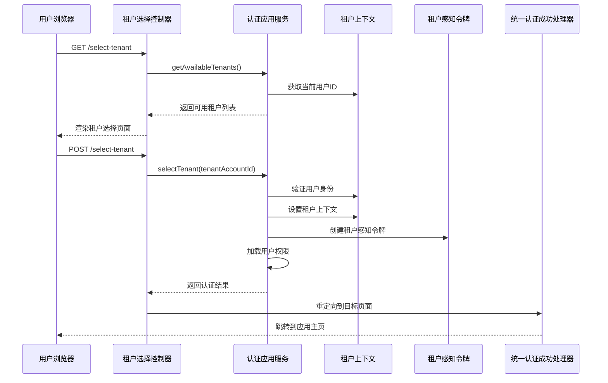
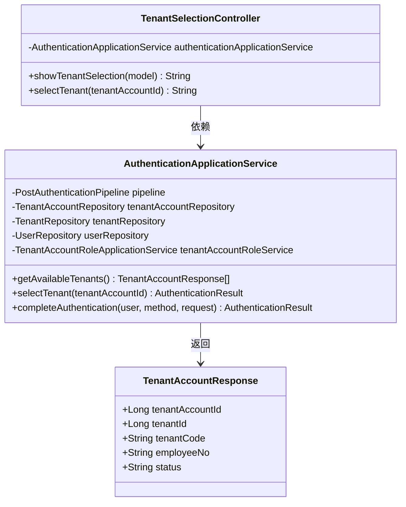
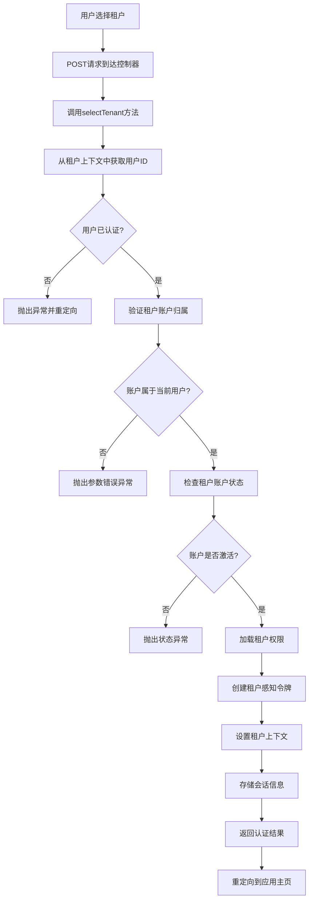
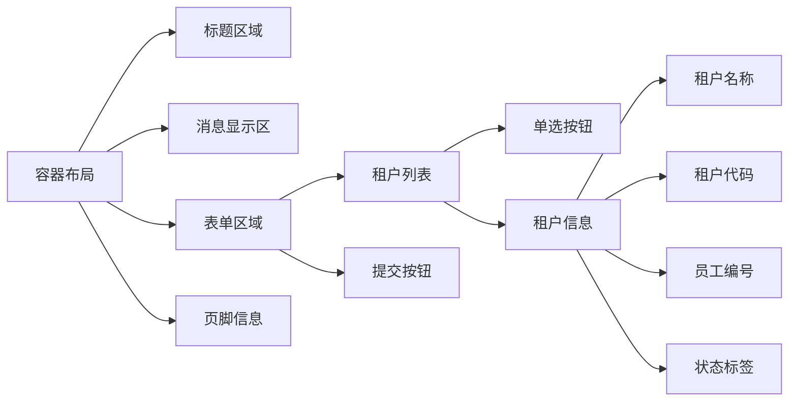
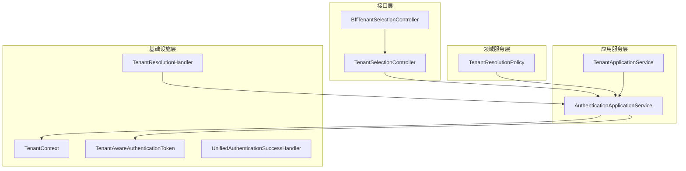

# 租户选择控制器

<cite>
**本文档引用的文件**
- [TenantSelectionController.java](file://iam-auth-server/src/main/java/iam/platform/auth/interfaces/web/TenantSelectionController.java)
- [tenant-selection.html](file://iam-auth-server/src/main/resources/templates/tenant-selection.html)
- [AuthenticationApplicationService.java](file://iam-auth-server/src/main/java/iam/platform/auth/application/service/AuthenticationApplicationService.java)
- [TenantContext.java](file://iam-common/src/main/java/iam/platform/common/context/TenantContext.java)
- [TenantAwareAuthenticationToken.java](file://iam-auth-server/src/main/java/iam/platform/auth/domain/model/valueobject/TenantAwareAuthenticationToken.java)
- [UnifiedAuthenticationSuccessHandler.java](file://iam-auth-server/src/main/java/iam/platform/auth/interfaces/web/handler/UnifiedAuthenticationSuccessHandler.java)
- [TenantResolutionHandler.java](file://iam-auth-server/src/main/java/iam/platform/auth/application/service/pipeline/TenantResolutionHandler.java)
- [TenantApplicationService.java](file://iam-admin-server/src/main/java/iam/platform/admin/application/service/TenantApplicationService.java)
</cite>

## 更新摘要
**变更内容**
- 更新了租户选择控制器的方法签名变更，移除了未使用的 HttpServletRequest 参数
- 更新了认证应用服务的 selectTenant() 方法实现细节
- 更新了租户选择流程的技术文档以反映简化的API设计

## 目录
1. [简介](#简介)
2. [项目结构](#项目结构)
3. [核心组件](#核心组件)
4. [架构概览](#架构概览)
5. [详细组件分析](#详细组件分析)
6. [依赖关系分析](#依赖关系分析)
7. [性能考虑](#性能考虑)
8. [故障排除指南](#故障排除指南)
9. [结论](#结论)

## 简介

租户选择控制器是IAM平台中负责处理多租户用户选择特定租户账户的核心组件。该控制器实现了完整的租户选择流程，包括租户列表展示、租户切换逻辑、多租户导航等功能。系统通过统一的身份认证服务完成租户上下文切换，并通过会话管理确保用户在不同租户间的无缝切换。

**更新** 租户选择控制器现已简化其API设计，移除了未使用的HttpServletRequest参数，使方法签名更加简洁和直观。

## 项目结构

IAM平台采用分层架构设计，租户选择功能分布在多个模块中：

**图表来源**
- [TenantSelectionController.java:18-26](file://iam-auth-server/src/main/java/iam/platform/auth/interfaces/web/TenantSelectionController.java#L18-L26)
- [AuthenticationApplicationService.java:30-36](file://iam-auth-server/src/main/java/iam/platform/auth/application/service/AuthenticationApplicationService.java#L30-L36)
- [TenantContext.java:7-44](file://iam-common/src/main/java/iam/platform/common/context/TenantContext.java#L7-L44)

**章节来源**
- [TenantSelectionController.java:1-57](file://iam-auth-server/src/main/java/iam/platform/auth/interfaces/web/TenantSelectionController.java#L1-L57)
- [tenant-selection.html:1-237](file://iam-auth-server/src/main/resources/templates/tenant-selection.html#L1-L237)

## 核心组件

### 租户选择控制器 (TenantSelectionController)

租户选择控制器是Spring MVC控制器，负责处理租户选择相关的HTTP请求：

- **GET /select-tenant**: 显示租户选择页面
- **POST /select-tenant**: 处理租户选择提交

**更新** 控制器现已简化其方法签名，`selectTenant()` 方法现在只接受租户账户ID参数，移除了未使用的HttpServletRequest参数。

控制器通过依赖注入使用认证应用服务来获取可用租户列表并执行租户切换操作。

### 认证应用服务 (AuthenticationApplicationService)

认证应用服务是租户选择功能的核心业务逻辑实现：

- **getAvailableTenants()**: 获取当前用户可用的租户账户列表
- **selectTenant(Long tenantAccountId)**: 选择特定租户账户并建立完整的认证上下文
- **completeAuthentication()**: 完成认证流程并运行后认证管道

**更新** `selectTenant()` 方法现已简化为只接受租户账户ID参数，移除了未使用的HttpServletRequest参数，使API更加简洁。

### 租户上下文 (TenantContext)

线程本地存储用于维护当前请求生命周期内的租户上下文信息：

- 当前用户ID
- 当前租户ID  
- 当前租户账户ID

### HTML模板 (tenant-selection.html)

Thymeleaf模板提供了用户友好的租户选择界面：

- 响应式设计布局
- 租户列表展示
- 单选按钮选择
- 错误消息显示
- 用户体验优化

**章节来源**
- [TenantSelectionController.java:28-56](file://iam-auth-server/src/main/java/iam/platform/auth/interfaces/web/TenantSelectionController.java#L28-L56)
- [AuthenticationApplicationService.java:117-127](file://iam-auth-server/src/main/java/iam/platform/auth/application/service/AuthenticationApplicationService.java#L117-L127)
- [TenantContext.java:9-43](file://iam-common/src/main/java/iam/platform/common/context/TenantContext.java#L9-L43)
- [tenant-selection.html:181-237](file://iam-auth-server/src/main/resources/templates/tenant-selection.html#L181-L237)

## 架构概览

租户选择功能遵循统一认证架构，通过以下关键组件协同工作：

**图表来源**
- [TenantSelectionController.java:28-56](file://iam-auth-server/src/main/java/iam/platform/auth/interfaces/web/TenantSelectionController.java#L28-L56)
- [AuthenticationApplicationService.java:51-111](file://iam-auth-server/src/main/java/iam/platform/auth/application/service/AuthenticationApplicationService.java#L51-L111)
- [UnifiedAuthenticationSuccessHandler.java:35-66](file://iam-auth-server/src/main/java/iam/platform/auth/interfaces/web/handler/UnifiedAuthenticationSuccessHandler.java#L35-L66)

## 详细组件分析

### 租户选择控制器实现

租户选择控制器采用简洁的设计模式，通过单一职责原则实现清晰的功能分离：

**图表来源**
- [TenantSelectionController.java:19-26](file://iam-auth-server/src/main/java/iam/platform/auth/interfaces/web/TenantSelectionController.java#L19-L26)
- [AuthenticationApplicationService.java:30-36](file://iam-auth-server/src/main/java/iam/platform/auth/application/service/AuthenticationApplicationService.java#L30-L36)
- [AuthenticationApplicationService.java:135-137](file://iam-auth-server/src/main/java/iam/platform/auth/application/service/AuthenticationApplicationService.java#L135-L137)

#### 租户列表展示逻辑

控制器通过以下步骤实现租户列表展示：

1. **获取可用租户**: 调用认证应用服务的`getAvailableTenants()`方法
2. **错误处理**: 捕获未认证状态，重定向到登录页面
3. **数据绑定**: 将租户列表添加到模型属性
4. **空状态处理**: 当租户列表为空时显示提示消息

#### 租户切换逻辑

**更新** 租户切换过程现已简化，移除了未使用的HttpServletRequest参数：

**图表来源**
- [AuthenticationApplicationService.java:51-111](file://iam-auth-server/src/main/java/iam/platform/auth/application/service/AuthenticationApplicationService.java#L51-L111)

**章节来源**
- [TenantSelectionController.java:28-56](file://iam-auth-server/src/main/java/iam/platform/auth/interfaces/web/TenantSelectionController.java#L28-L56)
- [AuthenticationApplicationService.java:51-111](file://iam-auth-server/src/main/java/iam/platform/auth/application/service/AuthenticationApplicationService.java#L51-L111)

### HTML模板设计

租户选择页面采用现代化的响应式设计：

**图表来源**
- [tenant-selection.html:181-237](file://iam-auth-server/src/main/resources/templates/tenant-selection.html#L181-L237)

模板特性包括：
- **响应式设计**: 适配各种设备屏幕尺寸
- **视觉反馈**: 悬停效果和过渡动画
- **无障碍访问**: 合适的颜色对比度和字体大小
- **错误处理**: 清晰的错误消息显示

**章节来源**
- [tenant-selection.html:1-237](file://iam-auth-server/src/main/resources/templates/tenant-selection.html#L1-L237)

### 权限验证机制

系统通过多层次的权限验证确保安全性：

1. **身份验证**: 确保用户已通过身份验证
2. **账户归属验证**: 验证所选租户账户属于当前用户
3. **状态验证**: 检查租户账户和租户的状态是否激活
4. **权限加载**: 动态加载用户的租户权限集合

### 会话管理

租户选择过程中的会话管理包括：

- **ThreadLocal上下文**: 使用线程本地存储维护请求级上下文
- **HTTP会话存储**: 在用户会话中存储租户相关信息
- **安全上下文**: 更新Spring Security的认证上下文
- **自动清理**: 请求完成后清除上下文信息

**章节来源**
- [TenantContext.java:9-43](file://iam-common/src/main/java/iam/platform/common/context/TenantContext.java#L9-L43)
- [TenantAwareAuthenticationToken.java:117-130](file://iam-auth-server/src/main/java/iam/platform/auth/domain/model/valueobject/TenantAwareAuthenticationToken.java#L117-L130)

## 依赖关系分析

租户选择功能涉及多个层次的依赖关系：

**图表来源**
- [TenantSelectionController.java:19-26](file://iam-auth-server/src/main/java/iam/platform/auth/interfaces/web/TenantSelectionController.java#L19-L26)
- [AuthenticationApplicationService.java:30-36](file://iam-auth-server/src/main/java/iam/platform/auth/application/service/AuthenticationApplicationService.java#L30-L36)
- [TenantResolutionHandler.java:16-21](file://iam-auth-server/src/main/java/iam/platform/auth/application/service/pipeline/TenantResolutionHandler.java#L16-L21)

### 关键依赖关系

1. **控制器依赖**: 租户选择控制器依赖认证应用服务
2. **应用服务依赖**: 认证应用服务依赖多个仓库和领域服务
3. **上下文依赖**: 应用服务通过租户上下文管理请求状态
4. **安全集成**: 通过租户感知令牌集成Spring Security

**章节来源**
- [TenantSelectionController.java:21-25](file://iam-auth-server/src/main/java/iam/platform/auth/interfaces/web/TenantSelectionController.java#L21-L25)
- [AuthenticationApplicationService.java:32-36](file://iam-auth-server/src/main/java/iam/platform/auth/application/service/AuthenticationApplicationService.java#L32-L36)

## 性能考虑

### 查询优化

- **懒加载策略**: 租户账户查询使用惰性加载避免不必要的数据库访问
- **批量操作**: 权限加载采用批量查询减少数据库往返次数
- **缓存策略**: 可考虑在租户上下文中缓存用户权限信息

### 内存管理

- **线程本地存储**: 使用ThreadLocal避免跨线程数据污染
- **及时清理**: 请求完成后自动清理上下文数据
- **对象复用**: 重用认证令牌对象避免频繁创建

### 并发处理

- **线程安全**: 租户上下文使用ThreadLocal确保线程隔离
- **无状态设计**: 控制器和应用服务设计为无状态以支持水平扩展
- **连接池**: 数据库连接使用连接池提高资源利用率

## 故障排除指南

### 常见问题及解决方案

#### 1. 租户列表为空

**症状**: 用户登录后直接跳转到租户选择页面但显示"没有可用租户"

**可能原因**:
- 用户没有任何租户账户关联
- 用户的租户账户被禁用
- 系统配置错误

**解决步骤**:
1. 检查用户与租户账户的关联关系
2. 验证租户账户状态是否为激活
3. 确认用户权限配置正确

#### 2. 租户切换失败

**症状**: 选择租户后出现错误消息

**可能原因**:
- 会话超时导致用户未认证
- 选择了不属于当前用户的租户账户
- 租户账户或租户状态不正确

**解决步骤**:
1. 检查用户会话状态
2. 验证租户账户归属验证
3. 确认租户状态验证逻辑

#### 3. 页面渲染问题

**症状**: 租户选择页面显示异常或样式错误

**可能原因**:
- Thymeleaf模板变量未正确设置
- 静态资源加载失败
- 浏览器缓存问题

**解决步骤**:
1. 检查模型属性是否正确传递
2. 验证CSS和JavaScript文件路径
3. 清除浏览器缓存重新加载

**章节来源**
- [TenantSelectionController.java:35-42](file://iam-auth-server/src/main/java/iam/platform/auth/interfaces/web/TenantSelectionController.java#L35-L42)
- [AuthenticationApplicationService.java:54-69](file://iam-auth-server/src/main/java/iam/platform/auth/application/service/AuthenticationApplicationService.java#L54-L69)

## 结论

租户选择控制器作为IAM平台多租户架构的核心组件，通过清晰的分层设计和完善的错误处理机制，为用户提供了流畅的租户切换体验。系统采用的安全上下文管理和会话控制确保了多租户环境下的数据隔离和安全性。

**更新** 最新的API设计变更进一步简化了租户选择流程，移除了不必要的参数，使代码更加简洁易懂。这种重构体现了持续改进的原则，通过消除冗余代码提高了系统的可维护性和可扩展性。

该实现具有以下优势：
- **模块化设计**: 清晰的职责分离便于维护和扩展
- **安全性**: 多层次的验证机制确保系统安全
- **可扩展性**: 基于接口的设计支持灵活的扩展
- **用户体验**: 响应式设计和友好的界面提升用户体验
- **API简洁性**: 简化的方法签名提高了代码的可读性和易用性

未来可以考虑的改进方向包括：引入租户选择的缓存机制、增强错误处理的用户友好性、以及提供租户选择的历史记录功能。