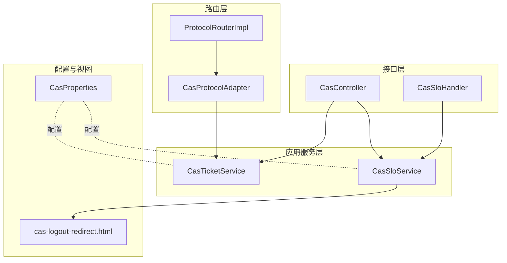
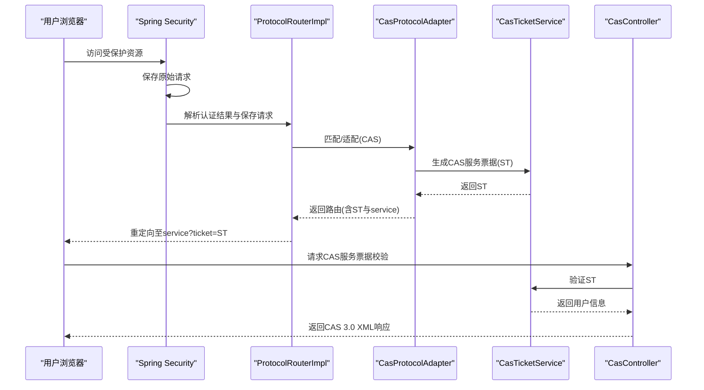
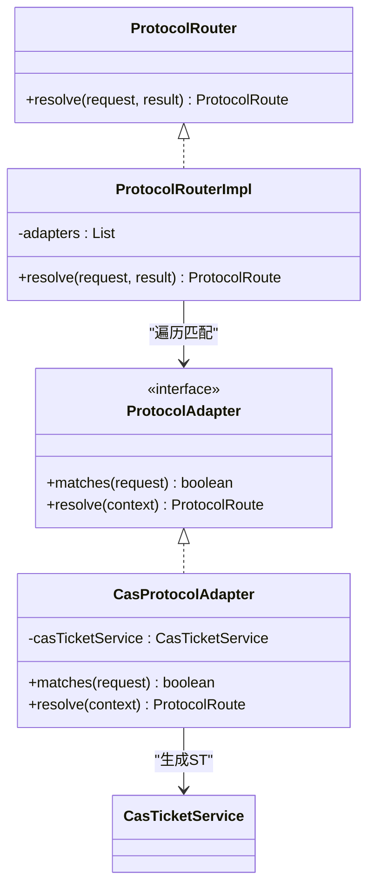
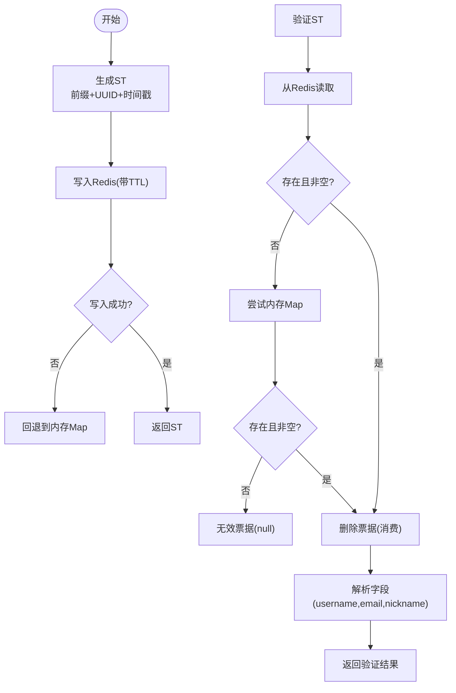
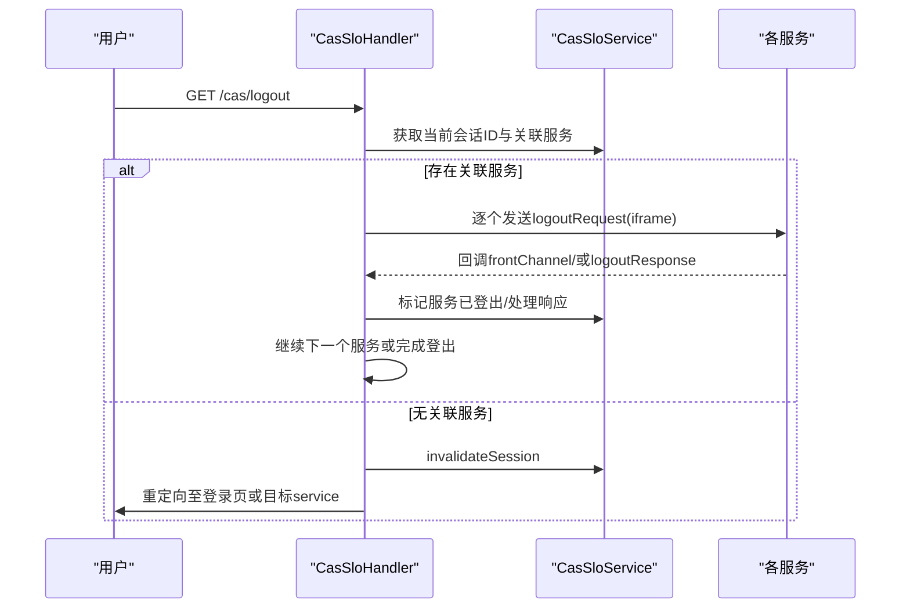
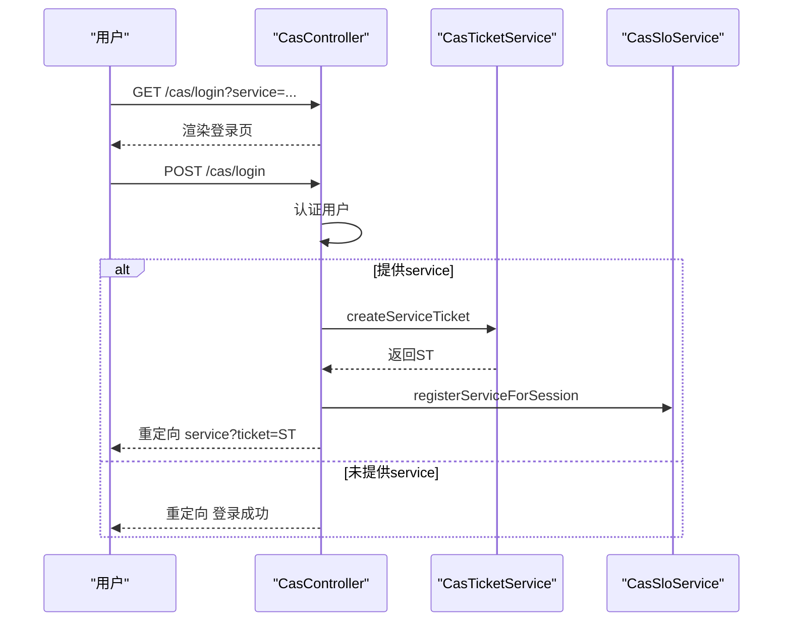
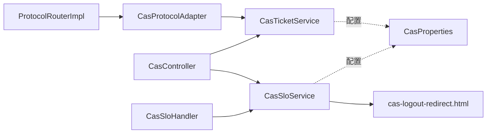

# CAS协议适配器

<cite>
**本文引用的文件**
- [CasProtocolAdapter.java](file://iam-auth-server/src/main/java/iam/platform/auth/application/service/routing/CasProtocolAdapter.java)
- [ProtocolRouter.java](file://iam-auth-server/src/main/java/iam/platform/auth/application/service/routing/ProtocolRouter.java)
- [ProtocolRouterImpl.java](file://iam-auth-server/src/main/java/iam/platform/auth/application/service/routing/ProtocolRouterImpl.java)
- [CasTicketService.java](file://iam-auth-server/src/main/java/iam/platform/auth/application/service/CasTicketService.java)
- [CasSloService.java](file://iam-auth-server/src/main/java/iam/platform/auth/application/service/CasSloService.java)
- [CasController.java](file://iam-auth-server/src/main/java/iam/platform/auth/interfaces/web/CasController.java)
- [CasSloHandler.java](file://iam-auth-server/src/main/java/iam/platform/auth/interfaces/web/CasSloHandler.java)
- [CasProperties.java](file://iam-auth-server/src/main/java/iam/platform/auth/infrastructure/config/CasProperties.java)
- [cas-logout-redirect.html](file://iam-auth-server/src/main/resources/templates/cas-logout-redirect.html)
</cite>

## 目录
1. [简介](#简介)
2. [项目结构](#项目结构)
3. [核心组件](#核心组件)
4. [架构总览](#架构总览)
5. [详细组件分析](#详细组件分析)
6. [依赖关系分析](#依赖关系分析)
7. [性能考量](#性能考量)
8. [故障排除指南](#故障排除指南)
9. [结论](#结论)
10. [附录](#附录)

## 简介
本文件系统性阐述IAM平台中CAS（Central Authentication Service）协议适配器的实现机制，覆盖单点登录（SSO）流程、单点登出（SLO）处理、票据管理与生命周期、协议匹配与路由解析、与CAS服务端交互方式、配置项与安全考量、错误处理策略，并提供可操作的集成测试思路与故障排除建议。文档面向开发者与运维人员，兼顾深度与可读性。

## 项目结构
CAS适配器位于认证服务模块（iam-auth-server），采用分层+职责分离的设计：
- 应用服务层：票据服务（CasTicketService）、SLO服务（CasSloService）
- 接口层：CAS控制器（CasController）、CAS SLO处理器（CasSloHandler）
- 路由层：协议适配器接口（ProtocolRouter、ProtocolAdapter）、具体实现（CasProtocolAdapter、ProtocolRouterImpl）
- 配置层：CAS属性（CasProperties）
- 视图层：CAS登出重定向页面模板（cas-logout-redirect.html）

图表来源
- [ProtocolRouterImpl.java:1-52](file://iam-auth-server/src/main/java/iam/platform/auth/application/service/routing/ProtocolRouterImpl.java#L1-L52)
- [CasProtocolAdapter.java:1-80](file://iam-auth-server/src/main/java/iam/platform/auth/application/service/routing/CasProtocolAdapter.java#L1-L80)
- [CasTicketService.java:1-127](file://iam-auth-server/src/main/java/iam/platform/auth/application/service/CasTicketService.java#L1-L127)
- [CasSloService.java:1-302](file://iam-auth-server/src/main/java/iam/platform/auth/application/service/CasSloService.java#L1-L302)
- [CasController.java:1-170](file://iam-auth-server/src/main/java/iam/platform/auth/interfaces/web/CasController.java#L1-L170)
- [CasSloHandler.java:1-198](file://iam-auth-server/src/main/java/iam/platform/auth/interfaces/web/CasSloHandler.java#L1-L198)
- [CasProperties.java:1-45](file://iam-auth-server/src/main/java/iam/platform/auth/infrastructure/config/CasProperties.java#L1-L45)
- [cas-logout-redirect.html:1-272](file://iam-auth-server/src/main/resources/templates/cas-logout-redirect.html#L1-L272)

章节来源
- [ProtocolRouterImpl.java:1-52](file://iam-auth-server/src/main/java/iam/platform/auth/application/service/routing/ProtocolRouterImpl.java#L1-L52)
- [CasProtocolAdapter.java:1-80](file://iam-auth-server/src/main/java/iam/platform/auth/application/service/routing/CasProtocolAdapter.java#L1-L80)
- [CasTicketService.java:1-127](file://iam-auth-server/src/main/java/iam/platform/auth/application/service/CasTicketService.java#L1-L127)
- [CasSloService.java:1-302](file://iam-auth-server/src/main/java/iam/platform/auth/application/service/CasSloService.java#L1-L302)
- [CasController.java:1-170](file://iam-auth-server/src/main/java/iam/platform/auth/interfaces/web/CasController.java#L1-L170)
- [CasSloHandler.java:1-198](file://iam-auth-server/src/main/java/iam/platform/auth/interfaces/web/CasSloHandler.java#L1-L198)
- [CasProperties.java:1-45](file://iam-auth-server/src/main/java/iam/platform/auth/infrastructure/config/CasProperties.java#L1-L45)
- [cas-logout-redirect.html:1-272](file://iam-auth-server/src/main/resources/templates/cas-logout-redirect.html#L1-L272)

## 核心组件
- 协议适配器与路由
  - ProtocolRouter：根据保存请求与认证结果选择适配器
  - ProtocolRouterImpl：遍历适配器列表，调用匹配的适配器
  - CasProtocolAdapter：匹配以“/cas/”开头的请求，从保存URL提取service参数，生成CAS服务票据并返回路由
- 票据管理
  - CasTicketService：生成ST、验证ST并一次性消费；支持Redis分布式存储与内存回退
- SLO管理
  - CasSloService：会话跟踪、服务注册、前后通道SLO协调、会话失效清理
- 控制器与处理器
  - CasController：CAS登录页、登录处理、ST校验、健康检查
  - CasSloHandler：发起SLO、接收后通道SLO、前端通道回调、登出响应、完成登出
- 配置
  - CasProperties：CAS服务器地址、票据有效期、前缀、SLO开关、前后通道开关、登出请求TTL等
- 视图
  - cas-logout-redirect.html：前端通道SLO的引导页面，内嵌iframe逐个通知服务登出

章节来源
- [ProtocolRouter.java:1-19](file://iam-auth-server/src/main/java/iam/platform/auth/application/service/routing/ProtocolRouter.java#L1-L19)
- [ProtocolRouterImpl.java:1-52](file://iam-auth-server/src/main/java/iam/platform/auth/application/service/routing/ProtocolRouterImpl.java#L1-L52)
- [CasProtocolAdapter.java:1-80](file://iam-auth-server/src/main/java/iam/platform/auth/application/service/routing/CasProtocolAdapter.java#L1-L80)
- [CasTicketService.java:1-127](file://iam-auth-server/src/main/java/iam/platform/auth/application/service/CasTicketService.java#L1-L127)
- [CasSloService.java:1-302](file://iam-auth-server/src/main/java/iam/platform/auth/application/service/CasSloService.java#L1-L302)
- [CasController.java:1-170](file://iam-auth-server/src/main/java/iam/platform/auth/interfaces/web/CasController.java#L1-L170)
- [CasSloHandler.java:1-198](file://iam-auth-server/src/main/java/iam/platform/auth/interfaces/web/CasSloHandler.java#L1-L198)
- [CasProperties.java:1-45](file://iam-auth-server/src/main/java/iam/platform/auth/infrastructure/config/CasProperties.java#L1-L45)
- [cas-logout-redirect.html:1-272](file://iam-auth-server/src/main/resources/templates/cas-logout-redirect.html#L1-L272)

## 架构总览
CAS适配器通过“路由-适配器-服务-控制器”的链路工作：当用户访问受保护资源时，Spring Security保存原始请求；认证完成后，路由器选择CAS适配器，从保存URL提取service参数，生成ST并重定向到服务端；服务端再向CAS校验ST；登出时，CAS服务端或本服务触发SLO，清理会话与票据。

图表来源
- [ProtocolRouterImpl.java:24-50](file://iam-auth-server/src/main/java/iam/platform/auth/application/service/routing/ProtocolRouterImpl.java#L24-L50)
- [CasProtocolAdapter.java:28-50](file://iam-auth-server/src/main/java/iam/platform/auth/application/service/routing/CasProtocolAdapter.java#L28-L50)
- [CasTicketService.java:36-58](file://iam-auth-server/src/main/java/iam/platform/auth/application/service/CasTicketService.java#L36-L58)
- [CasController.java:114-149](file://iam-auth-server/src/main/java/iam/platform/auth/interfaces/web/CasController.java#L114-L149)

## 详细组件分析

### 协议适配器与路由
- 匹配逻辑
  - CasProtocolAdapter.matches：判断请求URI是否包含“/cas/”
- 路由解析
  - CasProtocolAdapter.resolve：从保存请求中提取service参数，若为空则回退默认重定向；若认证结果为空也回退；否则生成ST并返回CAS票据路由
  - ProtocolRouterImpl.resolve：优先处理租户选择场景；否则从HttpSessionRequestCache获取保存请求，构造ProtocolContext，遍历适配器匹配并调用resolve
- 复杂度
  - 匹配为O(1)，解析为O(n)（n为适配器数量），适配器列表通常较小，整体开销可忽略

图表来源
- [ProtocolRouter.java:1-19](file://iam-auth-server/src/main/java/iam/platform/auth/application/service/routing/ProtocolRouter.java#L1-L19)
- [ProtocolRouterImpl.java:20-50](file://iam-auth-server/src/main/java/iam/platform/auth/application/service/routing/ProtocolRouterImpl.java#L20-L50)
- [CasProtocolAdapter.java:17-50](file://iam-auth-server/src/main/java/iam/platform/auth/application/service/routing/CasProtocolAdapter.java#L17-L50)

章节来源
- [ProtocolRouterImpl.java:24-50](file://iam-auth-server/src/main/java/iam/platform/auth/application/service/routing/ProtocolRouterImpl.java#L24-L50)
- [CasProtocolAdapter.java:22-50](file://iam-auth-server/src/main/java/iam/platform/auth/application/service/routing/CasProtocolAdapter.java#L22-L50)

### 票据管理系统（ST生命周期）
- 生成
  - CasTicketService.createServiceTicket：基于配置前缀与UUID生成ST，写入Redis（带TTL），失败时回退到内存Map
- 验证与消费
  - CasTicketService.validateServiceTicket：从Redis读取并删除（一次性消费），解析用户信息；异常时回退内存Map；格式不合法返回null
- 数据结构与复杂度
  - 键空间：auth:cas:ticket:{ticket}，值为“用户名|邮箱|昵称|service”，O(1)读写；TTL控制过期回收
- 安全与可靠性
  - 分布式：Redis主存储，内存回退作为降级
  - 一次性使用：验证即删除，避免重放
  - 格式校验：字段不足直接拒绝

图表来源
- [CasTicketService.java:36-106](file://iam-auth-server/src/main/java/iam/platform/auth/application/service/CasTicketService.java#L36-L106)

章节来源
- [CasTicketService.java:15-127](file://iam-auth-server/src/main/java/iam/platform/auth/application/service/CasTicketService.java#L15-L127)

### 单点登出（SLO）处理
- 会话跟踪与服务注册
  - CasSloService.registerServiceForSession：将service加入会话的集合键，设置过期时间
  - CasSloService.getServicesForSession：查询会话关联的所有service
- 前后通道SLO
  - 前通道：CasSloHandler.initiateLogout渲染cas-logout-redirect.html，内嵌iframe逐一通知各service；回调标记已登出，继续下一个；全部完成后跳转
  - 后通道：CasSloHandler.handleBackChannelLogout接收SAML风格logoutRequest（Base64），解码并提取会话索引，调用invalidateSession清理
- 会话失效与清理
  - CasSloService.invalidateSession：清理会话关联的service集合键，记录失效会话集合，后续可快速判定
- 登出完成
  - CasSloHandler.completeLogout：调用invalidateSession，使HTTP会话失效，按需重定向

图表来源
- [CasSloHandler.java:42-196](file://iam-auth-server/src/main/java/iam/platform/auth/interfaces/web/CasSloHandler.java#L42-L196)
- [CasSloService.java:42-201](file://iam-auth-server/src/main/java/iam/platform/auth/application/service/CasSloService.java#L42-L201)

章节来源
- [CasSloHandler.java:25-198](file://iam-auth-server/src/main/java/iam/platform/auth/interfaces/web/CasSloHandler.java#L25-L198)
- [CasSloService.java:17-302](file://iam-auth-server/src/main/java/iam/platform/auth/application/service/CasSloService.java#L17-L302)
- [cas-logout-redirect.html:228-272](file://iam-auth-server/src/main/resources/templates/cas-logout-redirect.html#L228-L272)

### 控制器与服务端交互
- 登录与重定向
  - CasController.casLoginPage：渲染登录页，携带service/renew/gateway参数
  - CasController.processCasLogin：认证用户，若提供service则生成ST并重定向至service?ticket=ST，同时注册SLO服务
- 票据校验
  - CasController.validateServiceTicket：校验ST并返回CAS 3.0 XML格式的成功/失败响应
- 健康检查
  - CasController.casHealth：返回CAS 3.0协议与SLO状态

图表来源
- [CasController.java:44-107](file://iam-auth-server/src/main/java/iam/platform/auth/interfaces/web/CasController.java#L44-L107)
- [CasTicketService.java:36-58](file://iam-auth-server/src/main/java/iam/platform/auth/application/service/CasTicketService.java#L36-L58)
- [CasSloService.java:42-55](file://iam-auth-server/src/main/java/iam/platform/auth/application/service/CasSloService.java#L42-L55)

章节来源
- [CasController.java:26-170](file://iam-auth-server/src/main/java/iam/platform/auth/interfaces/web/CasController.java#L26-L170)

### 配置选项与安全考量
- 关键配置（CasProperties）
  - 服务器地址、登录/登出URL、票据前缀与有效期、SLO开关、前后通道开关、登出请求TTL、是否向所有服务发送登出请求
- 安全建议
  - 使用HTTPS传输，防止票据泄露
  - 严格校验service参数来源，避免开放重定向
  - 合理设置票据TTL与SLO超时，平衡用户体验与安全
  - Redis连接异常时的内存回退应配合监控告警
- 错误处理
  - ST不存在或已消费：返回CAS 3.0标准失败XML
  - Redis不可用：回退内存存储并记录警告
  - SLO请求解析失败：抛出运行时异常并返回失败XML

章节来源
- [CasProperties.java:10-45](file://iam-auth-server/src/main/java/iam/platform/auth/infrastructure/config/CasProperties.java#L10-L45)
- [CasController.java:122-133](file://iam-auth-server/src/main/java/iam/platform/auth/interfaces/web/CasController.java#L122-L133)
- [CasSloHandler.java:96-110](file://iam-auth-server/src/main/java/iam/platform/auth/interfaces/web/CasSloHandler.java#L96-L110)

## 依赖关系分析
- 组件耦合
  - ProtocolRouterImpl聚合多个ProtocolAdapter，低耦合高扩展
  - CasProtocolAdapter依赖CasTicketService，职责单一
  - CasController与CasSloHandler分别依赖票据与SLO服务，接口清晰
- 外部依赖
  - Redis用于分布式存储与会话跟踪
  - Thymeleaf模板用于前端通道SLO页面
- 潜在循环依赖
  - 未发现循环依赖，层次清晰

图表来源
- [ProtocolRouterImpl.java:22](file://iam-auth-server/src/main/java/iam/platform/auth/application/service/routing/ProtocolRouterImpl.java#L22)
- [CasProtocolAdapter.java:19](file://iam-auth-server/src/main/java/iam/platform/auth/application/service/routing/CasProtocolAdapter.java#L19)
- [CasTicketService.java:24-25](file://iam-auth-server/src/main/java/iam/platform/auth/application/service/CasTicketService.java#L24-L25)
- [CasSloService.java:26-27](file://iam-auth-server/src/main/java/iam/platform/auth/application/service/CasSloService.java#L26-L27)
- [CasController.java:36-38](file://iam-auth-server/src/main/java/iam/platform/auth/interfaces/web/CasController.java#L36-L38)
- [CasSloHandler.java:31](file://iam-auth-server/src/main/java/iam/platform/auth/interfaces/web/CasSloHandler.java#L31)
- [CasProperties.java:12](file://iam-auth-server/src/main/java/iam/platform/auth/infrastructure/config/CasProperties.java#L12)

章节来源
- [ProtocolRouterImpl.java:20-50](file://iam-auth-server/src/main/java/iam/platform/auth/application/service/routing/ProtocolRouterImpl.java#L20-L50)
- [CasProtocolAdapter.java:17-50](file://iam-auth-server/src/main/java/iam/platform/auth/application/service/routing/CasProtocolAdapter.java#L17-L50)
- [CasTicketService.java:24-25](file://iam-auth-server/src/main/java/iam/platform/auth/application/service/CasTicketService.java#L24-L25)
- [CasSloService.java:26-27](file://iam-auth-server/src/main/java/iam/platform/auth/application/service/CasSloService.java#L26-L27)
- [CasController.java:36-38](file://iam-auth-server/src/main/java/iam/platform/auth/interfaces/web/CasController.java#L36-L38)
- [CasSloHandler.java:31](file://iam-auth-server/src/main/java/iam/platform/auth/interfaces/web/CasSloHandler.java#L31)
- [CasProperties.java:12](file://iam-auth-server/src/main/java/iam/platform/auth/infrastructure/config/CasProperties.java#L12)

## 性能考量
- 票据存储
  - Redis提供O(1)读写与TTL自动回收，内存回退仅在极端情况下使用
- SLO并发
  - 前通道通过iframe并行通知服务，但受网络与服务端响应影响；建议设置合理超时与重试
- 缓存与会话
  - 服务集合键设置较长TTL，避免频繁重建；会话失效集合用于快速判定
- 可观测性
  - 建议增加Redis可用性指标、SLO耗时统计、ST生成/验证成功率

## 故障排除指南
- ST无法生成或验证
  - 检查Redis连通性与权限；查看日志中的“Failed to store CAS ticket in Redis”与“Redis unavailable”提示；确认CasProperties.ticketValiditySeconds配置
- ST验证失败
  - 确认service参数正确传递；检查CAS 3.0 XML响应中的INVALID_TICKET错误；确认票据已被消费（一次性使用）
- SLO未生效
  - 前通道：确认cas-logout-redirect.html是否正确加载iframe并回调；检查回调URL与RelayState；查看“Failed to mark service as logged out in Redis”
  - 后通道：确认logoutRequest是否Base64编码正确；检查extractSessionIdFromLogoutRequest解析逻辑；查看“Failed to process Back Channel Logout”
- 登出完成后仍可访问
  - 确认invalidateSession是否执行；检查会话是否被HTTP Session失效；核对CasSloService.isSessionInvalidated判定

章节来源
- [CasTicketService.java:47-55](file://iam-auth-server/src/main/java/iam/platform/auth/application/service/CasTicketService.java#L47-L55)
- [CasTicketService.java:75-92](file://iam-auth-server/src/main/java/iam/platform/auth/application/service/CasTicketService.java#L75-L92)
- [CasSloHandler.java:168-196](file://iam-auth-server/src/main/java/iam/platform/auth/interfaces/web/CasSloHandler.java#L168-L196)
- [CasSloService.java:97-119](file://iam-auth-server/src/main/java/iam/platform/auth/application/service/CasSloService.java#L97-L119)
- [CasSloService.java:252-278](file://iam-auth-server/src/main/java/iam/platform/auth/application/service/CasSloService.java#L252-L278)

## 结论
CAS协议适配器通过清晰的路由-适配器-服务-控制器分层，实现了标准的CAS 3.0 SSO与SLO流程。票据服务提供可靠的分布式存储与一次性消费模型，SLO服务支持前后通道协调与会话失效清理。结合合理的配置与监控，可在保证安全性的同时提供良好的用户体验。

## 附录
- 集成测试建议
  - SSO流程：构造带service参数的受保护请求，验证登录后重定向与ST生成及校验
  - SLO流程：登录后注册多个服务，触发SLO，验证前通道iframe回调与后通道请求处理
  - 容错测试：模拟Redis不可用，验证内存回退路径；模拟SLO请求异常，验证错误响应
- 常见问题定位
  - 查看日志中“CAS Service Ticket created/validated/not found/consumed”等关键信息
  - 核对CasProperties各项配置与环境变量一致性