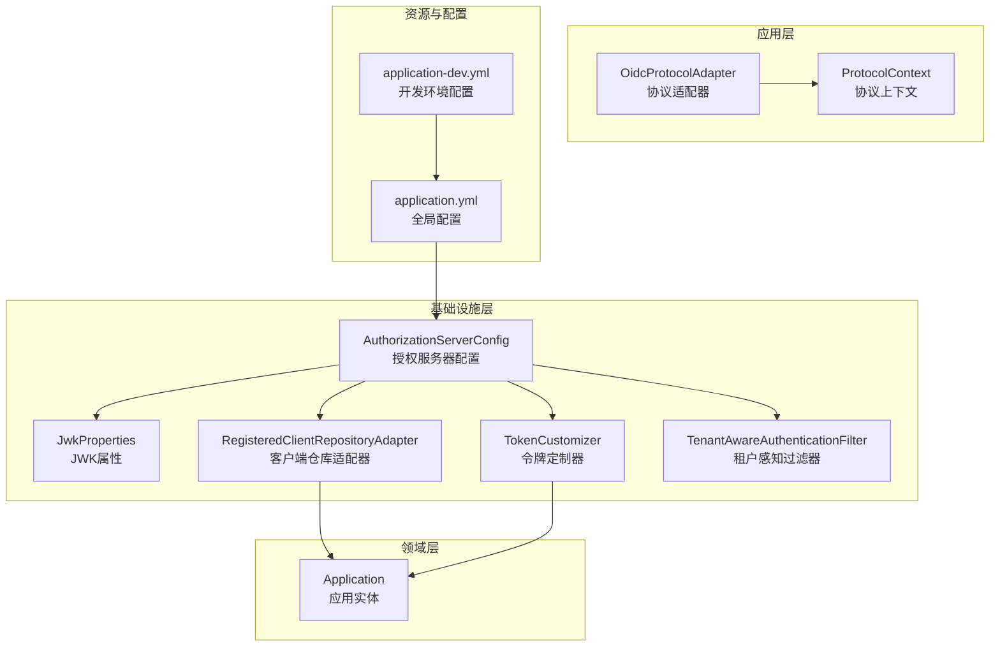
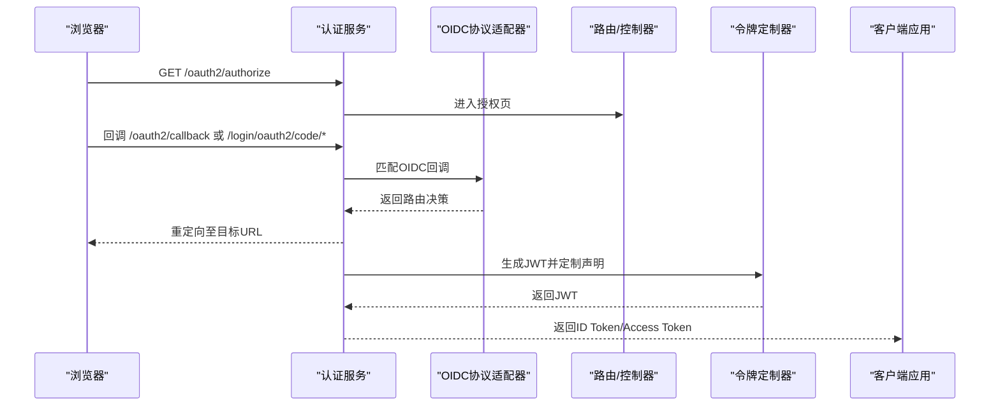
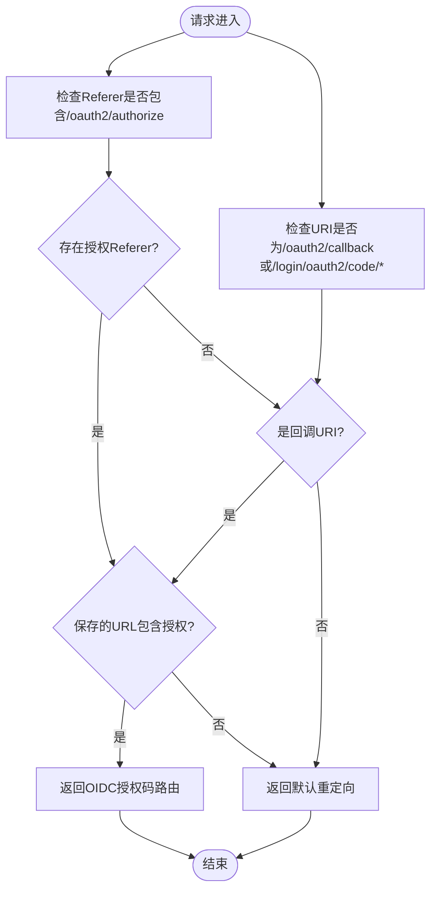
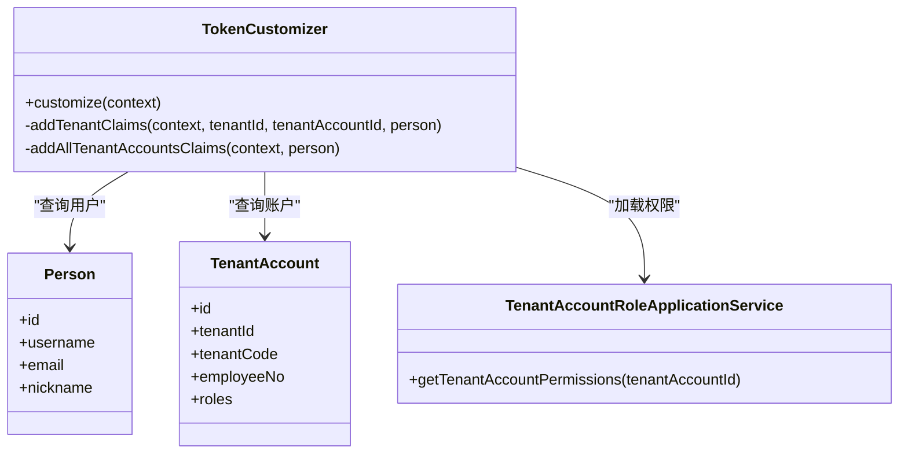
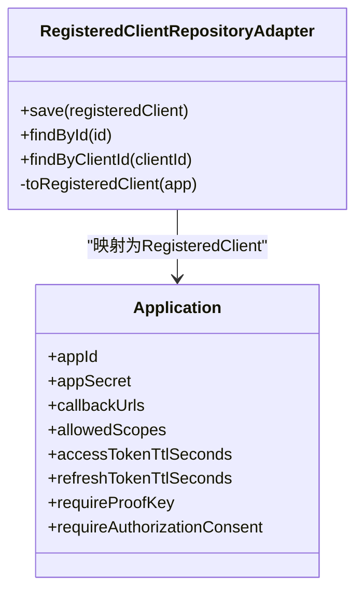
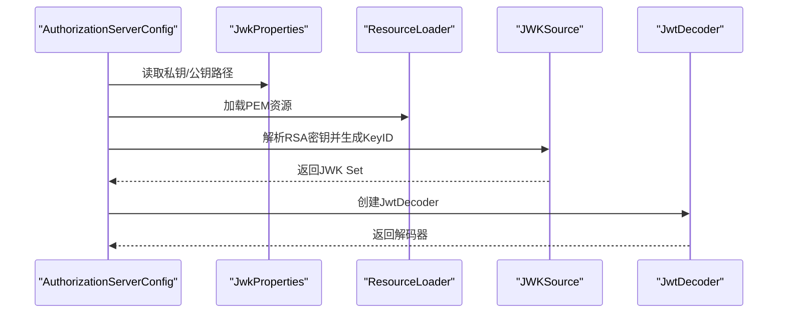
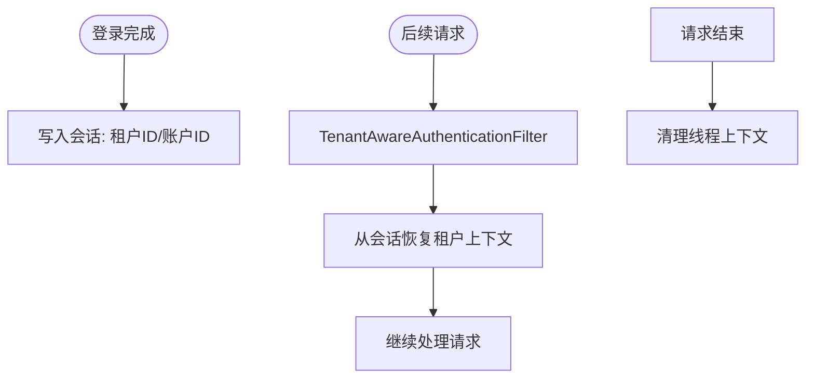
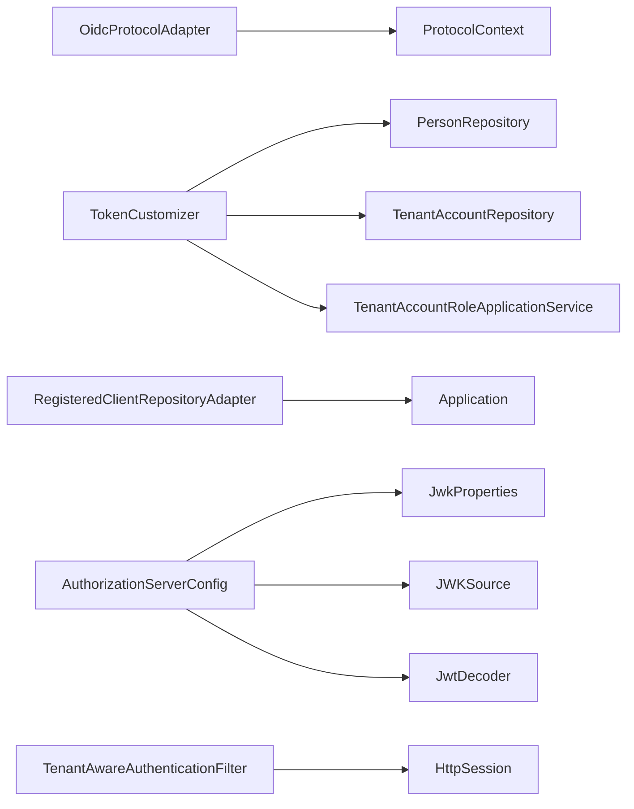

# OIDC协议适配器

<cite>
**本文引用的文件**
- [OidcProtocolAdapter.java](file://iam-auth-server/src/main/java/iam/platform/auth/application/service/routing/OidcProtocolAdapter.java)
- [ProtocolContext.java](file://iam-auth-server/src/main/java/iam/platform/auth/application/service/routing/ProtocolContext.java)
- [TokenCustomizer.java](file://iam-auth-server/src/main/java/iam/platform/auth/infrastructure/security/TokenCustomizer.java)
- [RegisteredClientRepositoryAdapter.java](file://iam-auth-server/src/main/java/iam/platform/auth/infrastructure/security/RegisteredClientRepositoryAdapter.java)
- [AuthorizationServerConfig.java](file://iam-auth-server/src/main/java/iam/platform/auth/infrastructure/config/AuthorizationServerConfig.java)
- [JwkProperties.java](file://iam-auth-server/src/main/java/iam/platform/auth/infrastructure/config/JwkProperties.java)
- [TenantAwareAuthenticationFilter.java](file://iam-auth-server/src/main/java/iam/platform/auth/infrastructure/security/TenantAwareAuthenticationFilter.java)
- [Application.java](file://iam-auth-server/src/main/java/iam/platform/auth/domain/model/entity/Application.java)
- [application.yml](file://iam-auth-server/src/main/resources/application.yml)
- [application-dev.yml](file://iam-auth-server/src/main/resources/application-dev.yml)
</cite>

## 目录
1. [简介](#简介)
2. [项目结构](#项目结构)
3. [核心组件](#核心组件)
4. [架构总览](#架构总览)
5. [组件详解](#组件详解)
6. [依赖关系分析](#依赖关系分析)
7. [性能考量](#性能考量)
8. [故障排查指南](#故障排查指南)
9. [结论](#结论)
10. [附录](#附录)

## 简介
本文件面向OIDC协议适配器的技术实现，系统性阐述基于Spring Authorization Server的OAuth2/OIDC扩展实现，覆盖授权码流程路由、令牌定制、JWK管理、作用域与回调地址配置、多租户上下文注入、以及安全与兼容性最佳实践。文档同时给出关键流程图与时序图，帮助读者快速理解从请求进入、路由决策、令牌签发到客户端验证的全链路。

## 项目结构
OIDC适配器位于认证服务模块中，围绕以下层次组织：
- 应用层：协议适配与路由决策
- 领域层：应用实体与OAuth2客户端元数据
- 基础设施层：授权服务器配置、JWK加载、令牌定制、租户上下文过滤器
- 资源与配置：YAML配置文件定义JWK路径、Issuer、回调地址等

**图表来源**
- [OidcProtocolAdapter.java:1-40](file://iam-auth-server/src/main/java/iam/platform/auth/application/service/routing/OidcProtocolAdapter.java#L1-L40)
- [ProtocolContext.java:1-21](file://iam-auth-server/src/main/java/iam/platform/auth/application/service/routing/ProtocolContext.java#L1-L21)
- [AuthorizationServerConfig.java:1-130](file://iam-auth-server/src/main/java/iam/platform/auth/infrastructure/config/AuthorizationServerConfig.java#L1-L130)
- [JwkProperties.java:1-16](file://iam-auth-server/src/main/java/iam/platform/auth/infrastructure/config/JwkProperties.java#L1-L16)
- [TokenCustomizer.java:1-127](file://iam-auth-server/src/main/java/iam/platform/auth/infrastructure/security/TokenCustomizer.java#L1-L127)
- [RegisteredClientRepositoryAdapter.java:1-101](file://iam-auth-server/src/main/java/iam/platform/auth/infrastructure/security/RegisteredClientRepositoryAdapter.java#L1-L101)
- [TenantAwareAuthenticationFilter.java:1-68](file://iam-auth-server/src/main/java/iam/platform/auth/infrastructure/security/TenantAwareAuthenticationFilter.java#L1-L68)
- [Application.java:1-211](file://iam-auth-server/src/main/java/iam/platform/auth/domain/model/entity/Application.java#L1-L211)
- [application.yml:1-144](file://iam-auth-server/src/main/resources/application.yml#L1-L144)
- [application-dev.yml:1-34](file://iam-auth-server/src/main/resources/application-dev.yml#L1-L34)

**章节来源**
- [OidcProtocolAdapter.java:1-40](file://iam-auth-server/src/main/java/iam/platform/auth/application/service/routing/OidcProtocolAdapter.java#L1-L40)
- [AuthorizationServerConfig.java:1-130](file://iam-auth-server/src/main/java/iam/platform/auth/infrastructure/config/AuthorizationServerConfig.java#L1-L130)
- [application.yml:1-144](file://iam-auth-server/src/main/resources/application.yml#L1-L144)

## 核心组件
- 协议适配器：识别OIDC授权码回调并决定重定向目标
- 令牌定制器：在JWT中注入用户与多租户上下文声明
- 客户端仓库适配器：将应用实体映射为RegisteredClient，配置授权方式、回调与作用域
- 授权服务器配置：启用OIDC、加载JWK、构建JwtDecoder、设置Issuer
- JWK属性：集中管理私钥/公钥位置
- 租户感知过滤器：恢复已登录会话中的租户上下文
- 应用实体：承载客户端元数据（回调、作用域、Token TTL等）

**章节来源**
- [OidcProtocolAdapter.java:1-40](file://iam-auth-server/src/main/java/iam/platform/auth/application/service/routing/OidcProtocolAdapter.java#L1-L40)
- [TokenCustomizer.java:1-127](file://iam-auth-server/src/main/java/iam/platform/auth/infrastructure/security/TokenCustomizer.java#L1-L127)
- [RegisteredClientRepositoryAdapter.java:1-101](file://iam-auth-server/src/main/java/iam/platform/auth/infrastructure/security/RegisteredClientRepositoryAdapter.java#L1-L101)
- [AuthorizationServerConfig.java:1-130](file://iam-auth-server/src/main/java/iam/platform/auth/infrastructure/config/AuthorizationServerConfig.java#L1-L130)
- [JwkProperties.java:1-16](file://iam-auth-server/src/main/java/iam/platform/auth/infrastructure/config/JwkProperties.java#L1-L16)
- [TenantAwareAuthenticationFilter.java:1-68](file://iam-auth-server/src/main/java/iam/platform/auth/infrastructure/security/TenantAwareAuthenticationFilter.java#L1-L68)
- [Application.java:1-211](file://iam-auth-server/src/main/java/iam/platform/auth/domain/model/entity/Application.java#L1-L211)

## 架构总览
下图展示了OIDC授权码流程的关键交互：浏览器发起授权请求，认证服务路由到OIDC授权页；回调后根据上下文决定重定向；随后签发含声明的JWT供客户端验证。

**图表来源**
- [OidcProtocolAdapter.java:14-38](file://iam-auth-server/src/main/java/iam/platform/auth/application/service/routing/OidcProtocolAdapter.java#L14-L38)
- [TokenCustomizer.java:34-61](file://iam-auth-server/src/main/java/iam/platform/auth/infrastructure/security/TokenCustomizer.java#L34-L61)
- [AuthorizationServerConfig.java:46-64](file://iam-auth-server/src/main/java/iam/platform/auth/infrastructure/config/AuthorizationServerConfig.java#L46-L64)

## 组件详解

### 协议适配器与路由
- 匹配规则：通过Referer是否包含授权端点或回调URI判断是否为OIDC授权码流程
- 决策逻辑：若存在保存的授权请求URL，则恢复该URL进行重定向；否则使用默认URL
- 适用场景：支持标准OIDC授权码流程与无保存请求的直接回调

**图表来源**
- [OidcProtocolAdapter.java:15-38](file://iam-auth-server/src/main/java/iam/platform/auth/application/service/routing/OidcProtocolAdapter.java#L15-L38)

**章节来源**
- [OidcProtocolAdapter.java:1-40](file://iam-auth-server/src/main/java/iam/platform/auth/application/service/routing/OidcProtocolAdapter.java#L1-L40)
- [ProtocolContext.java:1-21](file://iam-auth-server/src/main/java/iam/platform/auth/application/service/routing/ProtocolContext.java#L1-L21)

### 令牌定制与声明映射
- 用户基础声明：邮箱、昵称、人员ID
- 多租户上下文：
  - 已选租户：注入租户ID、账户ID、编码后的租户代码、员工号、角色列表、权限集合
  - 未选租户：注入可选租户账户列表及空占位声明，便于客户端引导选择
- 权限加载失败时的降级策略：不阻断令牌生成，权限声明置为空集合

**图表来源**
- [TokenCustomizer.java:27-125](file://iam-auth-server/src/main/java/iam/platform/auth/infrastructure/security/TokenCustomizer.java#L27-L125)

**章节来源**
- [TokenCustomizer.java:1-127](file://iam-auth-server/src/main/java/iam/platform/auth/infrastructure/security/TokenCustomizer.java#L1-L127)

### 客户端注册与作用域/回调配置
- 将应用实体映射为RegisteredClient，支持：
  - 授权方式：授权码（推荐）、密码（仅限高信任）
  - 回调地址：来自应用的回调集合
  - 作用域：来自应用允许的作用域集合
  - Token TTL：分别配置访问令牌与刷新令牌有效期
  - 客户端设置：PKCE要求、授权同意要求
- 客户端密钥存储策略：开发环境可使用明文前缀，生产建议BCrypt编码

**图表来源**
- [RegisteredClientRepositoryAdapter.java:20-99](file://iam-auth-server/src/main/java/iam/platform/auth/infrastructure/security/RegisteredClientRepositoryAdapter.java#L20-L99)
- [Application.java:21-211](file://iam-auth-server/src/main/java/iam/platform/auth/domain/model/entity/Application.java#L21-L211)

**章节来源**
- [RegisteredClientRepositoryAdapter.java:1-101](file://iam-auth-server/src/main/java/iam/platform/auth/infrastructure/security/RegisteredClientRepositoryAdapter.java#L1-L101)
- [Application.java:1-211](file://iam-auth-server/src/main/java/iam/platform/auth/domain/model/entity/Application.java#L1-L211)

### 授权服务器与JWK管理
- 启用OIDC与默认安全配置，设置登录入口与资源服务器JWT解码器
- 从配置文件加载RSA私钥/公钥，生成稳定的KeyID（基于公钥SHA-256指纹），构建JWK Set并注入JwtDecoder
- 设置Issuer URI，用于客户端发现与校验

**图表来源**
- [AuthorizationServerConfig.java:66-93](file://iam-auth-server/src/main/java/iam/platform/auth/infrastructure/config/AuthorizationServerConfig.java#L66-L93)
- [JwkProperties.java:12-15](file://iam-auth-server/src/main/java/iam/platform/auth/infrastructure/config/JwkProperties.java#L12-L15)

**章节来源**
- [AuthorizationServerConfig.java:1-130](file://iam-auth-server/src/main/java/iam/platform/auth/infrastructure/config/AuthorizationServerConfig.java#L1-L130)
- [JwkProperties.java:1-16](file://iam-auth-server/src/main/java/iam/platform/auth/infrastructure/config/JwkProperties.java#L1-L16)

### 租户上下文与会话恢复
- 在认证后将租户ID与账户ID写入会话；后续请求通过过滤器恢复到线程本地上下文
- 清理线程变量防止内存泄漏

**图表来源**
- [TenantAwareAuthenticationFilter.java:28-44](file://iam-auth-server/src/main/java/iam/platform/auth/infrastructure/security/TenantAwareAuthenticationFilter.java#L28-L44)

**章节来源**
- [TenantAwareAuthenticationFilter.java:1-68](file://iam-auth-server/src/main/java/iam/platform/auth/infrastructure/security/TenantAwareAuthenticationFilter.java#L1-L68)

## 依赖关系分析
- 协议适配器依赖请求头与URI判定，耦合度低，职责单一
- 令牌定制器依赖用户与租户账户仓储、权限服务，声明丰富但具备降级容错
- 客户端仓库适配器依赖应用实体，将业务模型映射为OAuth2客户端配置
- 授权服务器配置依赖JWK属性与资源加载器，集中管理密钥与解码器
- 租户感知过滤器依赖会话，对后续请求透明增强上下文

**图表来源**
- [OidcProtocolAdapter.java:1-40](file://iam-auth-server/src/main/java/iam/platform/auth/application/service/routing/OidcProtocolAdapter.java#L1-L40)
- [TokenCustomizer.java:27-31](file://iam-auth-server/src/main/java/iam/platform/auth/infrastructure/security/TokenCustomizer.java#L27-L31)
- [RegisteredClientRepositoryAdapter.java:22-22](file://iam-auth-server/src/main/java/iam/platform/auth/infrastructure/security/RegisteredClientRepositoryAdapter.java#L22-L22)
- [AuthorizationServerConfig.java:40-42](file://iam-auth-server/src/main/java/iam/platform/auth/infrastructure/config/AuthorizationServerConfig.java#L40-L42)
- [TenantAwareAuthenticationFilter.java:49-66](file://iam-auth-server/src/main/java/iam/platform/auth/infrastructure/security/TenantAwareAuthenticationFilter.java#L49-L66)

**章节来源**
- [TokenCustomizer.java:1-127](file://iam-auth-server/src/main/java/iam/platform/auth/infrastructure/security/TokenCustomizer.java#L1-L127)
- [RegisteredClientRepositoryAdapter.java:1-101](file://iam-auth-server/src/main/java/iam/platform/auth/infrastructure/security/RegisteredClientRepositoryAdapter.java#L1-L101)
- [AuthorizationServerConfig.java:1-130](file://iam-auth-server/src/main/java/iam/platform/auth/infrastructure/config/AuthorizationServerConfig.java#L1-L130)
- [TenantAwareAuthenticationFilter.java:1-68](file://iam-auth-server/src/main/java/iam/platform/auth/infrastructure/security/TenantAwareAuthenticationFilter.java#L1-L68)

## 性能考量
- 令牌定制器在权限加载失败时采用降级策略，避免因外部依赖异常导致令牌生成阻塞
- JWK KeyID基于公钥指纹生成，保证重启后KeyID稳定，减少客户端JWKS缓存失效带来的额外请求
- 客户端仓库适配器按需映射应用元数据，避免重复查询与构造开销

[本节为通用性能讨论，无需列出具体文件来源]

## 故障排查指南
- 回调无法识别为OIDC流程
  - 检查Referer与回调URI是否匹配适配器规则
  - 关注协议上下文中的保存URL
- 令牌缺少租户声明
  - 确认会话中是否存在租户ID/账户ID
  - 检查租户感知过滤器是否正确恢复上下文
- 权限为空或缺失
  - 观察令牌定制器的降级日志，确认权限加载异常
- JWK加载失败
  - 校验JWK私钥/公钥路径与PEM格式
  - 确认KeyID生成与JWK Set构建过程无异常
- Issuer不匹配
  - 检查配置文件中的Issuer URI与客户端期望一致

**章节来源**
- [OidcProtocolAdapter.java:15-38](file://iam-auth-server/src/main/java/iam/platform/auth/application/service/routing/OidcProtocolAdapter.java#L15-L38)
- [TenantAwareAuthenticationFilter.java:32-43](file://iam-auth-server/src/main/java/iam/platform/auth/infrastructure/security/TenantAwareAuthenticationFilter.java#L32-L43)
- [TokenCustomizer.java:92-96](file://iam-auth-server/src/main/java/iam/platform/auth/infrastructure/security/TokenCustomizer.java#L92-L96)
- [AuthorizationServerConfig.java:66-93](file://iam-auth-server/src/main/java/iam/platform/auth/infrastructure/config/AuthorizationServerConfig.java#L66-L93)
- [application.yml:88-88](file://iam-auth-server/src/main/resources/application.yml#L88-L88)

## 结论
该OIDC适配器以清晰的分层设计实现了标准OAuth2/OIDC授权码流程，结合多租户上下文与丰富的令牌声明，满足企业级统一认证需求。通过集中化的JWK管理、灵活的客户端配置与健壮的错误降级策略，系统在安全性与可用性之间取得平衡。建议在生产环境启用PKCE与授权同意、使用BCrypt存储客户端密钥，并定期轮换密钥与令牌TTL。

[本节为总结性内容，无需列出具体文件来源]

## 附录

### 配置项速览（摘自配置文件）
- JWK路径与Issuer
  - 私钥位置：security.jwk.rsa.private-key-location
  - 公钥位置：security.jwk.rsa.public-key-location
  - Issuer URI：security.issuer-uri
- 数据源与会话
  - 数据库连接：spring.datasource.*
  - 会话存储：spring.session.store-type=redis
- 安全策略
  - 速率限制：sso.security.rate-limit.*
  - 账户锁定：sso.security.account-lockout.*
  - IP白名单/黑名单：sso.security.ip-whitelist/ip-blacklist

**章节来源**
- [application.yml:81-102](file://iam-auth-server/src/main/resources/application.yml#L81-L102)
- [application-dev.yml:1-34](file://iam-auth-server/src/main/resources/application-dev.yml#L1-L34)