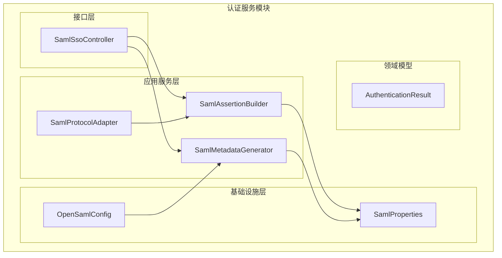
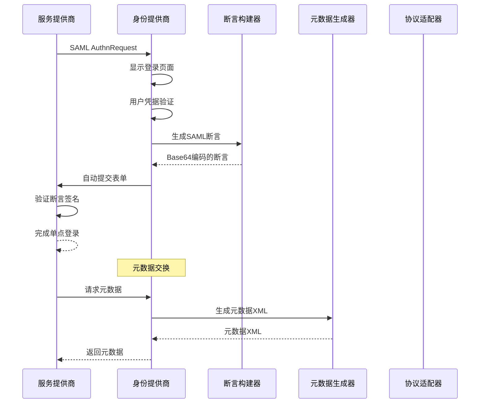
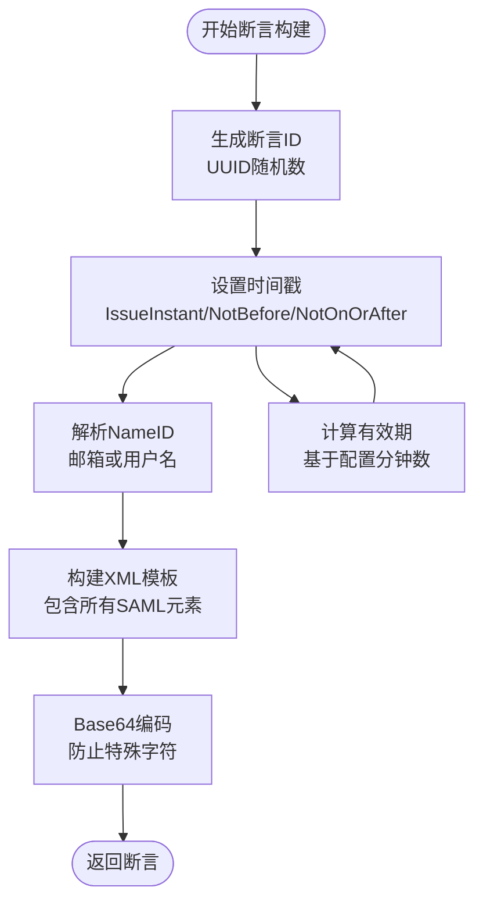
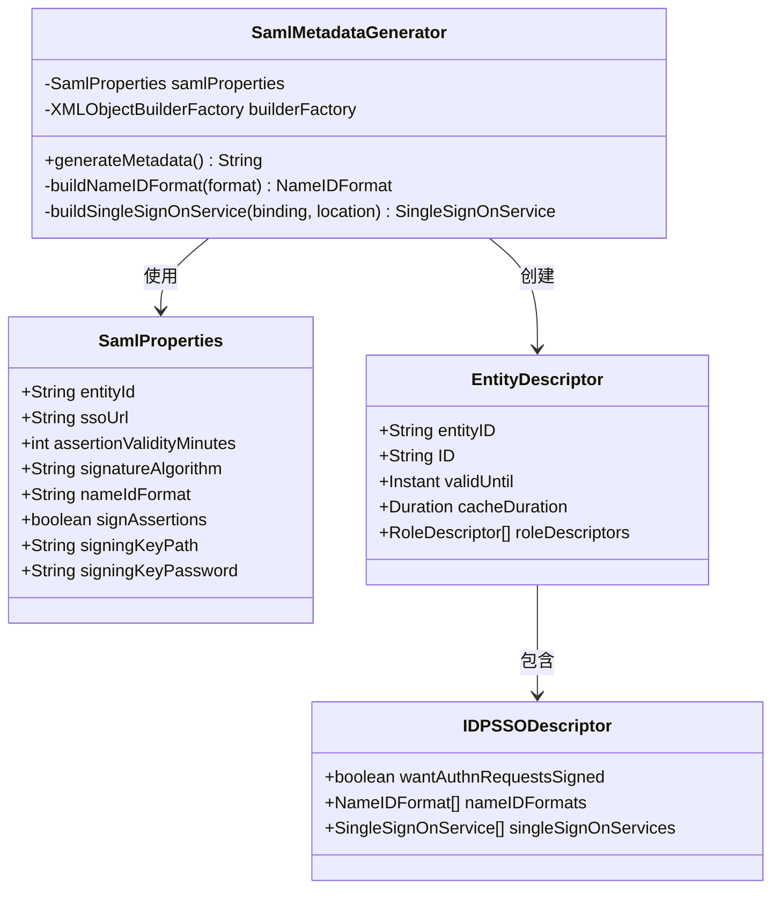
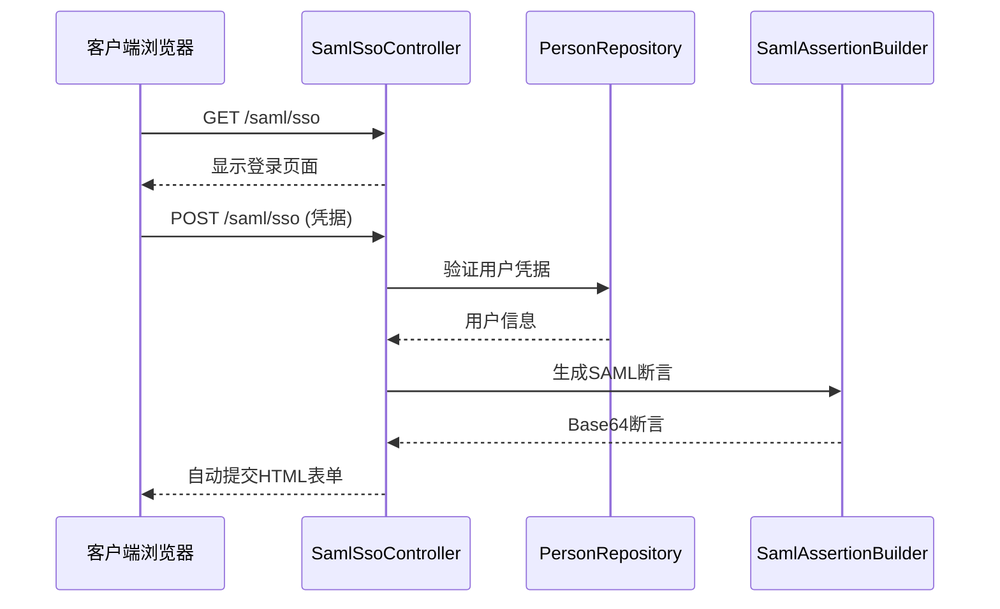
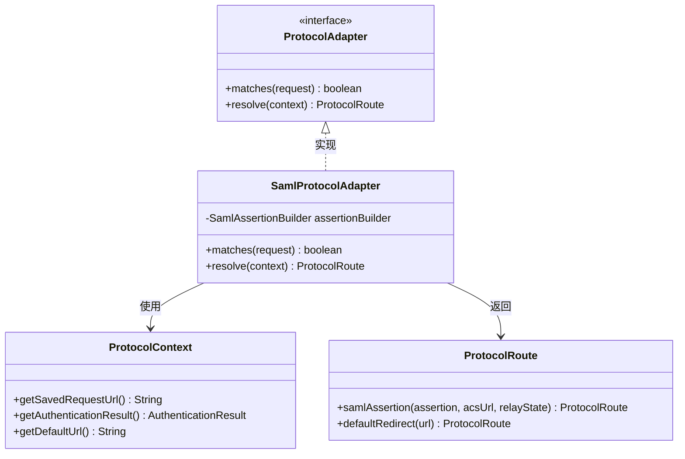
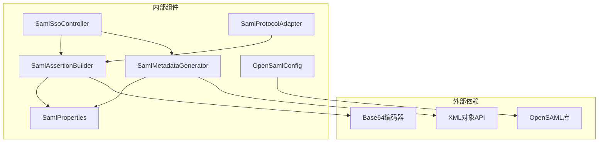

# SAML协议适配器

<cite>
**本文档引用的文件**
- [SamlAssertionBuilder.java](file://iam-auth-server/src/main/java/iam/platform/auth/application/service/SamlAssertionBuilder.java)
- [SamlMetadataGenerator.java](file://iam-auth-server/src/main/java/iam/platform/auth/application/service/SamlMetadataGenerator.java)
- [SamlSsoController.java](file://iam-auth-server/src/main/java/iam/platform/auth/interfaces/web/SamlSsoController.java)
- [SamlProtocolAdapter.java](file://iam-auth-server/src/main/java/iam/platform/auth/application/service/routing/SamlProtocolAdapter.java)
- [SamlProperties.java](file://iam-auth-server/src/main/java/iam/platform/auth/infrastructure/config/SamlProperties.java)
- [OpenSamlConfig.java](file://iam-auth-server/src/main/java/iam/platform/auth/infrastructure/config/OpenSamlConfig.java)
- [ProtocolAdapter.java](file://iam-auth-server/src/main/java/iam/platform/auth/application/service/routing/ProtocolAdapter.java)
- [ProtocolRouter.java](file://iam-auth-server/src/main/java/iam/platform/auth/application/service/routing/ProtocolRouter.java)
- [SamlMetadataGeneratorTest.java](file://iam-auth-server/src/test/java/iam/platform/auth/application/service/SamlMetadataGeneratorTest.java)
- [application.yml](file://iam-auth-server/src/main/resources/application.yml)
- [SsoAuthServerApplication.java](file://iam-auth-server/src/main/java/iam/platform/auth/SsoAuthServerApplication.java)
</cite>

## 目录
1. [简介](#简介)
2. [项目结构](#项目结构)
3. [核心组件](#核心组件)
4. [架构概览](#架构概览)
5. [详细组件分析](#详细组件分析)
6. [依赖关系分析](#依赖关系分析)
7. [性能考虑](#性能考虑)
8. [故障排除指南](#故障排除指南)
9. [结论](#结论)
10. [附录](#附录)

## 简介
本文件为IAM平台中SAML协议适配器的详细技术文档。文档深入解释了SAML协议适配器的实现机制，包括断言构建、元数据生成、签名验证、响应处理等核心功能。详细说明了SAML SSO流程、断言格式、XML签名机制、加密策略等技术细节。文档化了SAML协议的配置参数、元数据交换、实体ID管理等关键要素，并提供了实际代码示例路径、集成测试步骤和性能优化建议。

## 项目结构
IAM平台采用多模块架构，SAML适配器位于认证服务模块（iam-auth-server）中，主要包含以下层次：
- 应用服务层：负责业务逻辑处理，包括断言构建和元数据生成
- 接口层：提供REST API端点，处理用户交互
- 基础设施层：包含配置类和OpenSAML初始化
- 领域模型：定义认证结果和属性对象

**图表来源**
- [SamlSsoController.java:1-151](file://iam-auth-server/src/main/java/iam/platform/auth/interfaces/web/SamlSsoController.java#L1-151)
- [SamlAssertionBuilder.java:1-115](file://iam-auth-server/src/main/java/iam/platform/auth/application/service/SamlAssertionBuilder.java#L1-115)
- [SamlMetadataGenerator.java:1-128](file://iam-auth-server/src/main/java/iam/platform/auth/application/service/SamlMetadataGenerator.java#L1-128)
- [SamlProtocolAdapter.java:1-47](file://iam-auth-server/src/main/java/iam/platform/auth/application/service/routing/SamlProtocolAdapter.java#L1-47)

**章节来源**
- [SsoAuthServerApplication.java:1-19](file://iam-auth-server/src/main/java/iam/platform/auth/SsoAuthServerApplication.java#L1-19)
- [application.yml:1-144](file://iam-auth-server/src/main/resources/application.yml#L1-144)

## 核心组件
SAML协议适配器由四个核心组件构成，每个组件承担特定职责：

### SamlAssertionBuilder（断言构建器）
负责生成符合SAML 2.0规范的XML断言，包含用户身份信息、认证状态和属性声明。

### SamlMetadataGenerator（元数据生成器）
生成SAML IdP元数据XML，供服务提供商（SP）配置使用。

### SamlSsoController（SAML SSO控制器）
处理用户登录请求，执行身份验证并生成SAML响应。

### SamlProtocolAdapter（协议适配器）
实现协议路由逻辑，处理不同协议间的转换。

**章节来源**
- [SamlAssertionBuilder.java:15-115](file://iam-auth-server/src/main/java/iam/platform/auth/application/service/SamlAssertionBuilder.java#L15-115)
- [SamlMetadataGenerator.java:16-128](file://iam-auth-server/src/main/java/iam/platform/auth/application/service/SamlMetadataGenerator.java#L16-128)
- [SamlSsoController.java:25-151](file://iam-auth-server/src/main/java/iam/platform/auth/interfaces/web/SamlSsoController.java#L25-151)
- [SamlProtocolAdapter.java:9-47](file://iam-auth-server/src/main/java/iam/platform/auth/application/service/routing/SamlProtocolAdapter.java#L9-47)

## 架构概览
SAML协议适配器采用分层架构设计，实现了清晰的关注点分离：

**图表来源**
- [SamlSsoController.java:58-93](file://iam-auth-server/src/main/java/iam/platform/auth/interfaces/web/SamlSsoController.java#L58-93)
- [SamlAssertionBuilder.java:32-100](file://iam-auth-server/src/main/java/iam/platform/auth/application/service/SamlAssertionBuilder.java#L32-100)
- [SamlMetadataGenerator.java:40-101](file://iam-auth-server/src/main/java/iam/platform/auth/application/service/SamlMetadataGenerator.java#L40-101)

## 详细组件分析

### 断言构建机制
断言构建器实现了完整的SAML 2.0断言生成流程：

**图表来源**
- [SamlAssertionBuilder.java:32-100](file://iam-auth-server/src/main/java/iam/platform/auth/application/service/SamlAssertionBuilder.java#L32-100)

断言包含的关键元素：
- **Issuer元素**：标识身份提供商实体ID
- **Subject元素**：包含NameID和SubjectConfirmation
- **Conditions元素**：设置受众限制和有效期
- **AuthnStatement元素**：记录认证时间和上下文
- **AttributeStatement元素**：用户属性声明（邮箱、昵称）

**章节来源**
- [SamlAssertionBuilder.java:25-100](file://iam-auth-server/src/main/java/iam/platform/auth/application/service/SamlAssertionBuilder.java#L25-100)

### 元数据生成机制
元数据生成器遵循SAML标准，生成完整的IdP元数据：

**图表来源**
- [SamlMetadataGenerator.java:23-127](file://iam-auth-server/src/main/java/iam/platform/auth/application/service/SamlMetadataGenerator.java#L23-127)
- [SamlProperties.java:13-38](file://iam-auth-server/src/main/java/iam/platform/auth/infrastructure/config/SamlProperties.java#L13-38)

元数据包含的关键配置：
- **实体ID**：唯一标识身份提供商
- **NameID格式**：支持多种NameID格式
- **SSO服务**：支持HTTP-Redirect和HTTP-POST绑定
- **签名配置**：可选的证书描述符

**章节来源**
- [SamlMetadataGenerator.java:40-101](file://iam-auth-server/src/main/java/iam/platform/auth/application/service/SamlMetadataGenerator.java#L40-101)

### SSO控制器实现
SAML SSO控制器提供完整的登录处理流程：

**图表来源**
- [SamlSsoController.java:42-93](file://iam-auth-server/src/main/java/iam/platform/auth/interfaces/web/SamlSsoController.java#L42-93)

控制器处理的关键流程：
- **登录页面显示**：GET /saml/sso端点
- **凭据验证**：POST /saml/sso端点
- **断言生成**：调用断言构建器
- **自动提交**：生成HTML表单自动提交

**章节来源**
- [SamlSsoController.java:38-151](file://iam-auth-server/src/main/java/iam/platform/auth/interfaces/web/SamlSsoController.java#L38-151)

### 协议适配器机制
协议适配器实现统一的协议路由接口：

**图表来源**
- [SamlProtocolAdapter.java:15-46](file://iam-auth-server/src/main/java/iam/platform/auth/application/service/routing/SamlProtocolAdapter.java#L15-46)
- [ProtocolAdapter.java:9-20](file://iam-auth-server/src/main/java/iam/platform/auth/application/service/routing/ProtocolAdapter.java#L9-20)

**章节来源**
- [SamlProtocolAdapter.java:19-45](file://iam-auth-server/src/main/java/iam/platform/auth/application/service/routing/SamlProtocolAdapter.java#L19-45)

## 依赖关系分析

**图表来源**
- [SamlAssertionBuilder.java:1-14](file://iam-auth-server/src/main/java/iam/platform/auth/application/service/SamlAssertionBuilder.java#L1-14)
- [SamlMetadataGenerator.java:5-12](file://iam-auth-server/src/main/java/iam/platform/auth/application/service/SamlMetadataGenerator.java#L5-12)
- [OpenSamlConfig.java:17-27](file://iam-auth-server/src/main/java/iam/platform/auth/infrastructure/config/OpenSamlConfig.java#L17-27)

**章节来源**
- [OpenSamlConfig.java:17-27](file://iam-auth-server/src/main/java/iam/platform/auth/infrastructure/config/OpenSamlConfig.java#L17-27)

## 性能考虑
基于当前实现的性能特征分析：

### 内存使用优化
- **字符串操作**：使用StringBuilder替代字符串拼接，减少内存分配
- **Base64编码**：直接在内存中进行编码，避免临时文件写入
- **对象池**：考虑复用XML对象构建器实例

### 并发处理
- **线程安全**：确保断言构建器和元数据生成器的线程安全性
- **缓存策略**：对元数据进行短期缓存，减少重复生成开销
- **连接池**：合理配置数据库连接池大小

### 网络优化
- **压缩传输**：对元数据响应启用GZIP压缩
- **CDN支持**：元数据文件可部署到CDN加速分发
- **异步处理**：对于耗时的签名操作考虑异步化

## 故障排除指南

### 常见问题诊断
1. **断言验证失败**
   - 检查断言有效期设置
   - 验证NameID格式匹配
   - 确认受众限制配置

2. **元数据加载错误**
   - 验证实体ID配置正确性
   - 检查SSO端点URL可达性
   - 确认签名配置状态

3. **登录页面无法访问**
   - 检查Thymeleaf模板路径
   - 验证会话存储配置
   - 确认静态资源访问权限

### 日志分析要点
- **断言构建日志**：记录断言ID、时间戳、用户信息
- **元数据生成日志**：跟踪XML序列化过程
- **控制器异常**：捕获并记录认证失败原因

**章节来源**
- [SamlMetadataGeneratorTest.java:24-50](file://iam-auth-server/src/test/java/iam/platform/auth/application/service/SamlMetadataGeneratorTest.java#L24-50)

## 结论
SAML协议适配器实现了完整的SAML 2.0身份认证解决方案，具备以下特点：

### 技术优势
- **标准化实现**：严格遵循SAML 2.0规范
- **模块化设计**：清晰的职责分离和依赖管理
- **可扩展性**：支持多种NameID格式和绑定方式
- **安全性**：内置断言有效期控制和受众限制

### 功能完整性
- **断言生成**：完整的XML断言构建和Base64编码
- **元数据管理**：标准的IdP元数据生成和交换
- **协议路由**：统一的协议适配和转换机制
- **配置管理**：灵活的属性配置和环境适配

### 改进建议
1. **签名实现**：完成证书加载和断言签名功能
2. **加密支持**：实现XML加密策略和密钥管理
3. **监控增强**：添加详细的性能指标和错误追踪
4. **测试覆盖**：扩展单元测试和集成测试范围

该实现为IAM平台提供了可靠的SAML身份认证能力，支持企业级单点登录场景。

## 附录

### 配置参数说明
| 参数名称 | 默认值 | 描述 | 作用域 |
|---------|--------|------|--------|
| sso.saml.entityId | https://sso.example.com/saml/metadata | SAML IdP实体ID | 全局配置 |
| sso.saml.ssoUrl | https://sso.example.com/saml/sso | SSO端点URL | 全局配置 |
| sso.saml.assertionValidityMinutes | 5 | 断言有效期（分钟） | 全局配置 |
| sso.saml.signatureAlgorithm | http://www.w3.org/2001/04/xmldsig-more#rsa-sha256 | 签名算法 | 安全配置 |
| sso.saml.nameIdFormat | urn:oasis:names:tc:SAML:1.1:nameid-format:emailAddress | NameID格式 | 身份配置 |
| sso.saml.signAssertions | true | 是否签名断言 | 安全配置 |

### API端点定义
| 方法 | 路径 | 描述 | 响应类型 |
|------|------|------|----------|
| GET | /saml/sso | 显示SAML登录页面 | HTML模板 |
| POST | /saml/sso | 处理SAML登录请求 | HTML自动提交表单 |
| GET | /saml/metadata | 获取SAML元数据 | application/xml |

### 集成测试步骤
1. **环境准备**
   - 启动认证服务应用
   - 配置SSL证书（如需要）
   - 设置数据库连接参数

2. **功能测试**
   - 访问元数据端点验证XML格式
   - 执行断言生成测试验证Base64编码
   - 测试控制器端点的完整流程

3. **性能测试**
   - 压力测试断言生成性能
   - 测试并发访问稳定性
   - 验证内存使用情况

**章节来源**
- [application.yml:91-127](file://iam-auth-server/src/main/resources/application.yml#L91-127)
- [SamlMetadataGeneratorTest.java:24-50](file://iam-auth-server/src/test/java/iam/platform/auth/application/service/SamlMetadataGeneratorTest.java#L24-50)