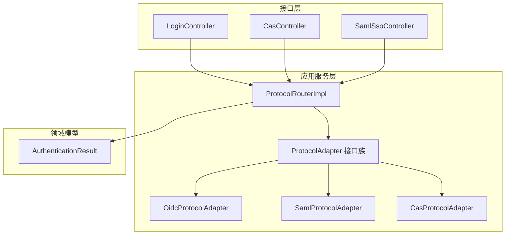
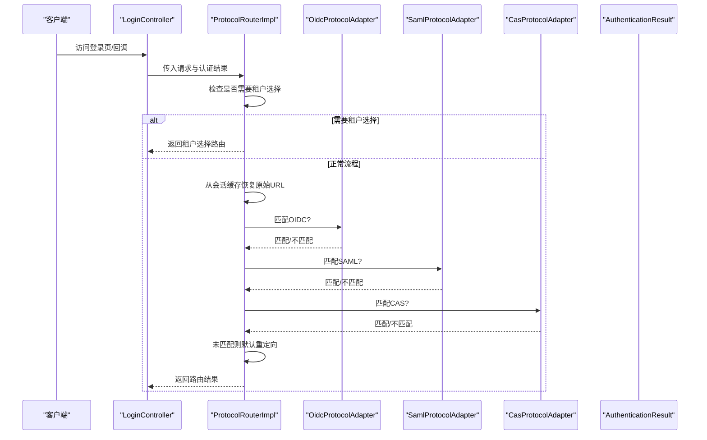
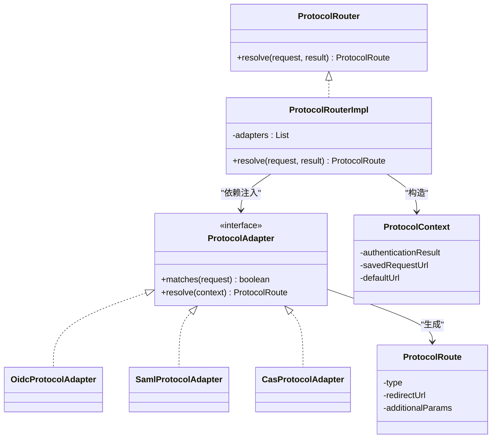
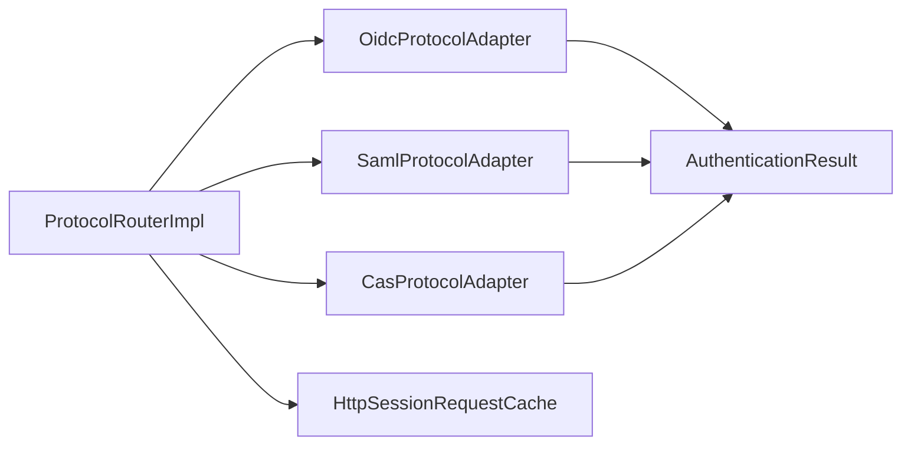

# 协议路由器

<cite>
**本文引用的文件**
- [ProtocolRouter.java](file://iam-auth-server/src/main/java/iam/platform/auth/application/service/routing/ProtocolRouter.java)
- [ProtocolRouterImpl.java](file://iam-auth-server/src/main/java/iam/platform/auth/application/service/routing/ProtocolRouterImpl.java)
- [ProtocolAdapter.java](file://iam-auth-server/src/main/java/iam/platform/auth/application/service/routing/ProtocolAdapter.java)
- [OidcProtocolAdapter.java](file://iam-auth-server/src/main/java/iam/platform/auth/application/service/routing/OidcProtocolAdapter.java)
- [SamlProtocolAdapter.java](file://iam-auth-server/src/main/java/iam/platform/auth/application/service/routing/SamlProtocolAdapter.java)
- [CasProtocolAdapter.java](file://iam-auth-server/src/main/java/iam/platform/auth/application/service/routing/CasProtocolAdapter.java)
- [ProtocolContext.java](file://iam-auth-server/src/main/java/iam/platform/auth/application/service/routing/ProtocolContext.java)
- [ProtocolRoute.java](file://iam-auth-server/src/main/java/iam/platform/auth/application/service/routing/ProtocolRoute.java)
- [AuthenticationResult.java](file://iam-auth-server/src/main/java/iam/platform/auth/domain/model/valueobject/AuthenticationResult.java)
- [LoginController.java](file://iam-auth-server/src/main/java/iam/platform/auth/interfaces/web/LoginController.java)
- [CasController.java](file://iam-auth-server/src/main/java/iam/platform/auth/interfaces/web/CasController.java)
- [SamlSsoController.java](file://iam-auth-server/src/main/java/iam/platform/auth/interfaces/web/SamlSsoController.java)
- [application.yml](file://iam-auth-server/src/main/resources/application.yml)
</cite>

## 目录
1. [简介](#简介)
2. [项目结构](#项目结构)
3. [核心组件](#核心组件)
4. [架构总览](#架构总览)
5. [详细组件分析](#详细组件分析)
6. [依赖分析](#依赖分析)
7. [性能考虑](#性能考虑)
8. [故障排查指南](#故障排查指南)
9. [结论](#结论)
10. [附录](#附录)

## 简介
本文件系统性阐述协议路由器的设计与实现，覆盖路由决策逻辑、适配器注册与扩展、上下文传递、路由规则与匹配算法、路由优先级处理、自定义路由逻辑与性能优化策略，并给出可直接定位到源码位置的示例路径，便于开发者快速落地。

## 项目结构
协议路由器位于认证服务模块中，采用“接口 + 多实现适配器”的分层设计，通过统一的路由入口根据来源协议动态选择具体适配器，最终生成标准化的路由结果对象，供控制器或前端渲染使用。

图表来源
- [ProtocolRouterImpl.java:1-52](file://iam-auth-server/src/main/java/iam/platform/auth/application/service/routing/ProtocolRouterImpl.java#L1-L52)
- [ProtocolAdapter.java:1-20](file://iam-auth-server/src/main/java/iam/platform/auth/application/service/routing/ProtocolAdapter.java#L1-L20)
- [OidcProtocolAdapter.java:1-40](file://iam-auth-server/src/main/java/iam/platform/auth/application/service/routing/OidcProtocolAdapter.java#L1-L40)
- [SamlProtocolAdapter.java:1-47](file://iam-auth-server/src/main/java/iam/platform/auth/application/service/routing/SamlProtocolAdapter.java#L1-L47)
- [CasProtocolAdapter.java:1-80](file://iam-auth-server/src/main/java/iam/platform/auth/application/service/routing/CasProtocolAdapter.java#L1-L80)
- [AuthenticationResult.java:1-56](file://iam-auth-server/src/main/java/iam/platform/auth/domain/model/valueobject/AuthenticationResult.java#L1-L56)
- [LoginController.java:1-58](file://iam-auth-server/src/main/java/iam/platform/auth/interfaces/web/LoginController.java#L1-L58)
- [CasController.java:1-170](file://iam-auth-server/src/main/java/iam/platform/auth/interfaces/web/CasController.java#L1-L170)
- [SamlSsoController.java:1-151](file://iam-auth-server/src/main/java/iam/platform/auth/interfaces/web/SamlSsoController.java#L1-L151)

章节来源
- [ProtocolRouter.java:1-19](file://iam-auth-server/src/main/java/iam/platform/auth/application/service/routing/ProtocolRouter.java#L1-L19)
- [ProtocolRouterImpl.java:1-52](file://iam-auth-server/src/main/java/iam/platform/auth/application/service/routing/ProtocolRouterImpl.java#L1-L52)

## 核心组件
- 协议路由器接口：定义统一的路由解析入口，接收HTTP请求与认证结果，返回标准化的路由决策。
- 默认路由器实现：负责从会话缓存中恢复原始请求URL，构造上下文，按顺序遍历适配器进行匹配，若无匹配则回退默认重定向。
- 协议适配器接口：为不同协议（OIDC、SAML、CAS）提供匹配与解析能力。
- 具体适配器：分别实现各自协议的匹配条件与路由生成逻辑。
- 路由上下文：封装认证结果、原始请求URL与默认URL，作为适配器解析时的输入。
- 路由结果：标准化的路由类型、目标URL与附加参数，支持租户选择、默认重定向、OIDC授权码、SAML断言、CAS票据等。

章节来源
- [ProtocolRouter.java:1-19](file://iam-auth-server/src/main/java/iam/platform/auth/application/service/routing/ProtocolRouter.java#L1-L19)
- [ProtocolRouterImpl.java:1-52](file://iam-auth-server/src/main/java/iam/platform/auth/application/service/routing/ProtocolRouterImpl.java#L1-L52)
- [ProtocolAdapter.java:1-20](file://iam-auth-server/src/main/java/iam/platform/auth/application/service/routing/ProtocolAdapter.java#L1-L20)
- [OidcProtocolAdapter.java:1-40](file://iam-auth-server/src/main/java/iam/platform/auth/application/service/routing/OidcProtocolAdapter.java#L1-L40)
- [SamlProtocolAdapter.java:1-47](file://iam-auth-server/src/main/java/iam/platform/auth/application/service/routing/SamlProtocolAdapter.java#L1-L47)
- [CasProtocolAdapter.java:1-80](file://iam-auth-server/src/main/java/iam/platform/auth/application/service/routing/CasProtocolAdapter.java#L1-L80)
- [ProtocolContext.java:1-21](file://iam-auth-server/src/main/java/iam/platform/auth/application/service/routing/ProtocolContext.java#L1-L21)
- [ProtocolRoute.java:1-74](file://iam-auth-server/src/main/java/iam/platform/auth/application/service/routing/ProtocolRoute.java#L1-L74)

## 架构总览
协议路由器通过“适配器模式”将多协议解耦为独立实现，统一由路由器调度。其核心流程如下：

图表来源
- [ProtocolRouterImpl.java:24-50](file://iam-auth-server/src/main/java/iam/platform/auth/application/service/routing/ProtocolRouterImpl.java#L24-L50)
- [OidcProtocolAdapter.java:14-38](file://iam-auth-server/src/main/java/iam/platform/auth/application/service/routing/OidcProtocolAdapter.java#L14-L38)
- [SamlProtocolAdapter.java:19-45](file://iam-auth-server/src/main/java/iam/platform/auth/application/service/routing/SamlProtocolAdapter.java#L19-L45)
- [CasProtocolAdapter.java:21-50](file://iam-auth-server/src/main/java/iam/platform/auth/application/service/routing/CasProtocolAdapter.java#L21-L50)
- [AuthenticationResult.java:28-54](file://iam-auth-server/src/main/java/iam/platform/auth/domain/model/valueobject/AuthenticationResult.java#L28-L54)

## 详细组件分析

### ProtocolRouter 接口与默认实现
- 设计要点
  - 统一入口：接收HttpServletRequest与AuthenticationResult，返回ProtocolRoute。
  - 决策优先级：先检查是否需要租户选择；再从会话缓存恢复原始URL；最后按适配器列表顺序匹配。
  - 回退策略：若无适配器匹配，则返回默认重定向至原始URL或根路径。
- 关键行为
  - 租户选择分支：直接返回租户选择路由。
  - 适配器匹配：遍历注入的适配器列表，首个匹配者即返回其解析结果。
  - 上下文构建：将认证结果、原始URL与默认URL封装为ProtocolContext，供适配器使用。

章节来源
- [ProtocolRouter.java:9-18](file://iam-auth-server/src/main/java/iam/platform/auth/application/service/routing/ProtocolRouter.java#L9-L18)
- [ProtocolRouterImpl.java:24-50](file://iam-auth-server/src/main/java/iam/platform/auth/application/service/routing/ProtocolRouterImpl.java#L24-L50)

### ProtocolAdapter 接口与适配器实现
- 接口职责
  - matches：基于请求判断是否属于该协议。
  - resolve：在ProtocolContext上下文中生成ProtocolRoute。
- 适配器匹配顺序
  - 当前实现按注入顺序线性遍历，首个匹配即生效。因此适配器注册顺序即为匹配优先级。
- 各协议适配器
  - OIDC：依据Referer或回调URI判断，优先恢复保存的OAuth2授权请求URL；否则回退默认重定向。
  - SAML：依据URI片段判断，要求ACS URL与RelayState；通过断言构建器生成SAML断言。
  - CAS：依据URI片段判断，从保存URL中提取service参数，生成Service Ticket并拼接重定向URL。

章节来源
- [ProtocolAdapter.java:9-19](file://iam-auth-server/src/main/java/iam/platform/auth/application/service/routing/ProtocolAdapter.java#L9-L19)
- [OidcProtocolAdapter.java:14-38](file://iam-auth-server/src/main/java/iam/platform/auth/application/service/routing/OidcProtocolAdapter.java#L14-L38)
- [SamlProtocolAdapter.java:19-45](file://iam-auth-server/src/main/java/iam/platform/auth/application/service/routing/SamlProtocolAdapter.java#L19-L45)
- [CasProtocolAdapter.java:21-50](file://iam-auth-server/src/main/java/iam/platform/auth/application/service/routing/CasProtocolAdapter.java#L21-L50)

### ProtocolContext 与 ProtocolRoute
- ProtocolContext
  - 封装认证结果、原始URL与默认URL，作为适配器解析的输入。
- ProtocolRoute
  - 使用记录类表达路由结果，包含路由类型、目标URL与附加参数。
  - 提供静态工厂方法以生成不同协议的路由：
    - 租户选择、默认重定向、OIDC授权码、SAML断言、CAS票据。
  - 路由类型枚举涵盖OIDC授权码、SAML断言、CAS票据、API令牌响应、租户选择、默认重定向等。

章节来源
- [ProtocolContext.java:10-20](file://iam-auth-server/src/main/java/iam/platform/auth/application/service/routing/ProtocolContext.java#L10-L20)
- [ProtocolRoute.java:8-74](file://iam-auth-server/src/main/java/iam/platform/auth/application/service/routing/ProtocolRoute.java#L8-L74)

### 路由规则与请求匹配算法
- 匹配算法
  - 线性扫描：遍历适配器列表，首个matches返回true的适配器即被选中。
  - 顺序即优先级：通过Spring容器注入顺序控制匹配优先级。
- 匹配条件
  - OIDC：Referer包含授权端点或回调URI。
  - SAML：URI包含特定路径片段。
  - CAS：URI包含特定路径片段。
- 附加参数
  - SAML：附加断言XML与RelayState。
  - CAS：附加ticket与service。

章节来源
- [OidcProtocolAdapter.java:15-25](file://iam-auth-server/src/main/java/iam/platform/auth/application/service/routing/OidcProtocolAdapter.java#L15-L25)
- [SamlProtocolAdapter.java:20-23](file://iam-auth-server/src/main/java/iam/platform/auth/application/service/routing/SamlProtocolAdapter.java#L20-L23)
- [CasProtocolAdapter.java:22-25](file://iam-auth-server/src/main/java/iam/platform/auth/application/service/routing/CasProtocolAdapter.java#L22-L25)

### 路由优先级处理
- 注册顺序即优先级：由于采用线性遍历，适配器在Spring容器中的注册顺序决定了匹配优先级。
- 建议
  - 将更通用或更常见的协议适配器置于前面，以减少不必要的后续匹配开销。
  - 若存在覆盖关系（如OIDC与SAML的URI重叠），应明确调整注册顺序以满足业务需求。

章节来源
- [ProtocolRouterImpl.java:40-45](file://iam-auth-server/src/main/java/iam/platform/auth/application/service/routing/ProtocolRouterImpl.java#L40-L45)

### 自定义路由逻辑与扩展机制
- 新增协议适配器步骤
  - 实现ProtocolAdapter接口，定义matches与resolve逻辑。
  - 在Spring容器中注册为Bean，确保被ProtocolRouterImpl注入。
  - 保证匹配条件能唯一识别新协议来源，避免与现有适配器冲突。
- 示例路径
  - 参考OIDC/SAML/CAS适配器的实现方式，分别在匹配与解析阶段完成协议特有处理。
- 路由结果扩展
  - 如需新增路由类型，可在ProtocolRoute中扩展枚举值与对应工厂方法，并在适配器resolve中返回新类型。

章节来源
- [ProtocolAdapter.java:9-19](file://iam-auth-server/src/main/java/iam/platform/auth/application/service/routing/ProtocolAdapter.java#L9-L19)
- [ProtocolRoute.java:13-72](file://iam-auth-server/src/main/java/iam/platform/auth/application/service/routing/ProtocolRoute.java#L13-L72)

### 上下文传递与数据流
- 数据流
  - 控制器层根据认证结果与请求上下文调用ProtocolRouter。
  - 路由器从会话缓存恢复原始URL，构造ProtocolContext。
  - 适配器基于ProtocolContext生成ProtocolRoute。
- 关键上下文字段
  - 认证结果：包含用户、认证方式、可用租户账户、权限集合、是否需要租户选择等。
  - 原始URL：用于OIDC授权码恢复与SAML/CAS参数提取。
  - 默认URL：作为回退重定向的目标。

章节来源
- [ProtocolRouterImpl.java:32-38](file://iam-auth-server/src/main/java/iam/platform/auth/application/service/routing/ProtocolRouterImpl.java#L32-L38)
- [AuthenticationResult.java:14-16](file://iam-auth-server/src/main/java/iam/platform/auth/domain/model/valueobject/AuthenticationResult.java#L14-L16)
- [ProtocolContext.java:15-19](file://iam-auth-server/src/main/java/iam/platform/auth/application/service/routing/ProtocolContext.java#L15-L19)

### 类关系图

图表来源
- [ProtocolRouter.java:9-18](file://iam-auth-server/src/main/java/iam/platform/auth/application/service/routing/ProtocolRouter.java#L9-L18)
- [ProtocolRouterImpl.java:20-50](file://iam-auth-server/src/main/java/iam/platform/auth/application/service/routing/ProtocolRouterImpl.java#L20-L50)
- [ProtocolAdapter.java:9-19](file://iam-auth-server/src/main/java/iam/platform/auth/application/service/routing/ProtocolAdapter.java#L9-L19)
- [OidcProtocolAdapter.java:12-38](file://iam-auth-server/src/main/java/iam/platform/auth/application/service/routing/OidcProtocolAdapter.java#L12-L38)
- [SamlProtocolAdapter.java:15-45](file://iam-auth-server/src/main/java/iam/platform/auth/application/service/routing/SamlProtocolAdapter.java#L15-L45)
- [CasProtocolAdapter.java:17-50](file://iam-auth-server/src/main/java/iam/platform/auth/application/service/routing/CasProtocolAdapter.java#L17-L50)
- [ProtocolContext.java:10-20](file://iam-auth-server/src/main/java/iam/platform/auth/application/service/routing/ProtocolContext.java#L10-L20)
- [ProtocolRoute.java:8-74](file://iam-auth-server/src/main/java/iam/platform/auth/application/service/routing/ProtocolRoute.java#L8-L74)

## 依赖分析
- 组件内聚与耦合
  - ProtocolRouterImpl对ProtocolAdapter呈现高内聚低耦合：通过接口依赖多个适配器，适配器彼此独立。
  - 适配器对领域服务的依赖有限：仅依赖必要的服务（如断言构建器、票据服务）以生成路由结果。
- 外部依赖
  - 会话缓存：使用Spring Security的HttpSessionRequestCache恢复原始URL。
  - 认证结果：来自认证流水线，决定是否进入租户选择流程。
- 潜在循环依赖
  - 适配器之间无直接依赖，不存在循环依赖风险。

图表来源
- [ProtocolRouterImpl.java:33-35](file://iam-auth-server/src/main/java/iam/platform/auth/application/service/routing/ProtocolRouterImpl.java#L33-L35)
- [AuthenticationResult.java:14-16](file://iam-auth-server/src/main/java/iam/platform/auth/domain/model/valueobject/AuthenticationResult.java#L14-L16)

章节来源
- [ProtocolRouterImpl.java:22-22](file://iam-auth-server/src/main/java/iam/platform/auth/application/service/routing/ProtocolRouterImpl.java#L22-L22)

## 性能考虑
- 匹配复杂度
  - 当前实现为线性扫描，时间复杂度O(N)，N为适配器数量。建议将最可能命中且匹配成本较低的适配器前置。
- 会话缓存访问
  - 每次路由均访问会话缓存以恢复原始URL，建议确保会话存储性能良好（如Redis）并合理设置超时。
- 日志与可观测性
  - 路由器与适配器均包含调试日志，便于追踪匹配与回退路径。结合应用配置启用适当采样率以平衡性能与可观测性。
- 配置参考
  - 应用配置中包含会话存储、安全策略、指标暴露等，可据此优化整体性能与稳定性。

章节来源
- [application.yml:49-53](file://iam-auth-server/src/main/resources/application.yml#L49-L53)
- [application.yml:128-144](file://iam-auth-server/src/main/resources/application.yml#L128-L144)

## 故障排查指南
- 无适配器匹配
  - 现象：返回默认重定向。
  - 排查：确认请求URI是否符合任一适配器的匹配条件；检查适配器注册顺序。
- SAML断言缺失
  - 现象：SAML适配器回退默认重定向。
  - 排查：确认原始请求是否携带ACS URL与RelayState；检查断言构建器可用性。
- CAS服务URL缺失
  - 现象：CAS适配器回退默认重定向。
  - 排查：确认保存URL中是否包含service参数；检查URL解码逻辑。
- 租户选择未触发
  - 现象：认证结果要求租户选择但未跳转。
  - 排查：确认AuthenticationResult.requiresTenantSelection为true；检查控制器是否正确传递结果。

章节来源
- [ProtocolRouterImpl.java:27-30](file://iam-auth-server/src/main/java/iam/platform/auth/application/service/routing/ProtocolRouterImpl.java#L27-L30)
- [SamlProtocolAdapter.java:30-33](file://iam-auth-server/src/main/java/iam/platform/auth/application/service/routing/SamlProtocolAdapter.java#L30-L33)
- [CasProtocolAdapter.java:35-38](file://iam-auth-server/src/main/java/iam/platform/auth/application/service/routing/CasProtocolAdapter.java#L35-L38)
- [AuthenticationResult.java:28-35](file://iam-auth-server/src/main/java/iam/platform/auth/domain/model/valueobject/AuthenticationResult.java#L28-L35)

## 结论
协议路由器通过清晰的接口与适配器模式，实现了多协议路由的可扩展与可维护。其核心优势在于：
- 统一入口与标准化输出，降低上层调用复杂度；
- 适配器注册顺序即优先级，便于灵活控制匹配策略；
- 明确的上下文与路由结果，便于扩展与监控。

建议在生产环境中关注适配器注册顺序、会话缓存性能与日志采样，并结合应用配置完善可观测性与安全策略。

## 附录

### 路由扩展与自定义实现示例路径
- 新增OIDC匹配条件与解析逻辑
  - 参考：[OidcProtocolAdapter.java:15-38](file://iam-auth-server/src/main/java/iam/platform/auth/application/service/routing/OidcProtocolAdapter.java#L15-L38)
- 新增SAML匹配条件与断言生成
  - 参考：[SamlProtocolAdapter.java:19-45](file://iam-auth-server/src/main/java/iam/platform/auth/application/service/routing/SamlProtocolAdapter.java#L19-L45)
- 新增CAS匹配条件与票据生成
  - 参考：[CasProtocolAdapter.java:21-50](file://iam-auth-server/src/main/java/iam/platform/auth/application/service/routing/CasProtocolAdapter.java#L21-L50)
- 扩展路由类型与工厂方法
  - 参考：[ProtocolRoute.java:13-72](file://iam-auth-server/src/main/java/iam/platform/auth/application/service/routing/ProtocolRoute.java#L13-L72)

### 集成测试与监控指标建议
- 集成测试
  - 针对不同协议的控制器端点（登录、回调、元数据等）编写端到端测试，验证路由结果与页面渲染。
  - 参考控制器：
    - [LoginController.java:19-47](file://iam-auth-server/src/main/java/iam/platform/auth/interfaces/web/LoginController.java#L19-L47)
    - [CasController.java:44-107](file://iam-auth-server/src/main/java/iam/platform/auth/interfaces/web/CasController.java#L44-L107)
    - [SamlSsoController.java:42-93](file://iam-auth-server/src/main/java/iam/platform/auth/interfaces/web/SamlSsoController.java#L42-L93)
- 监控指标
  - 启用应用管理端点与指标导出，结合日志采样评估路由命中率与错误率。
  - 参考配置：
    - [application.yml:128-144](file://iam-auth-server/src/main/resources/application.yml#L128-L144)