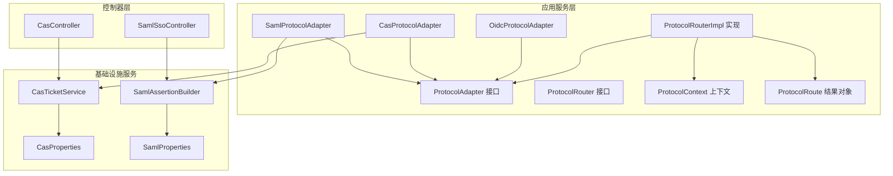
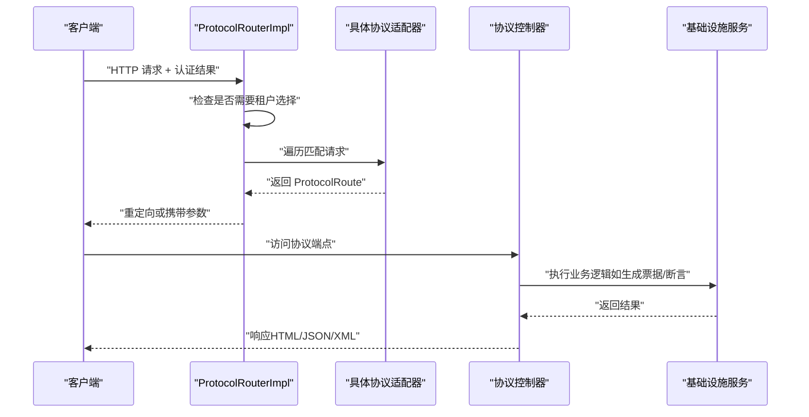
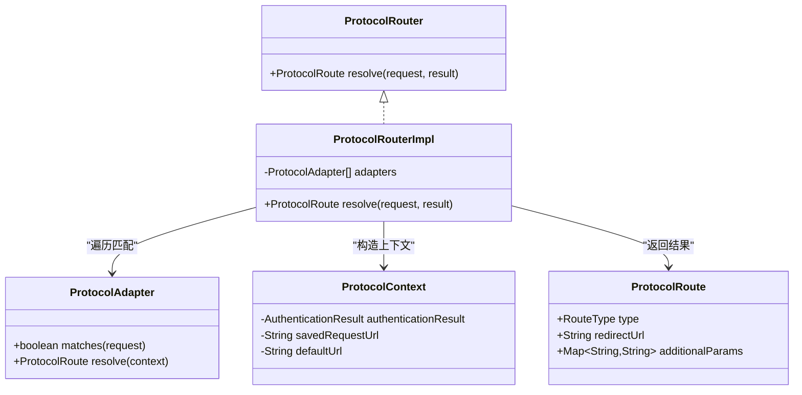
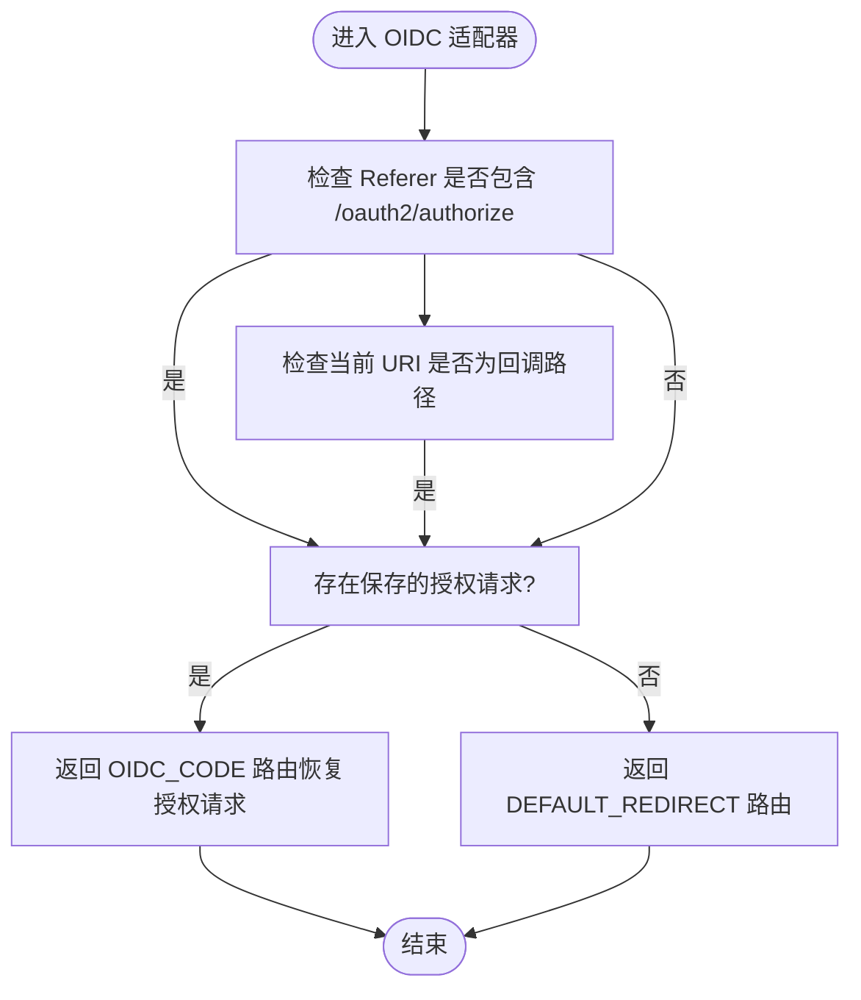
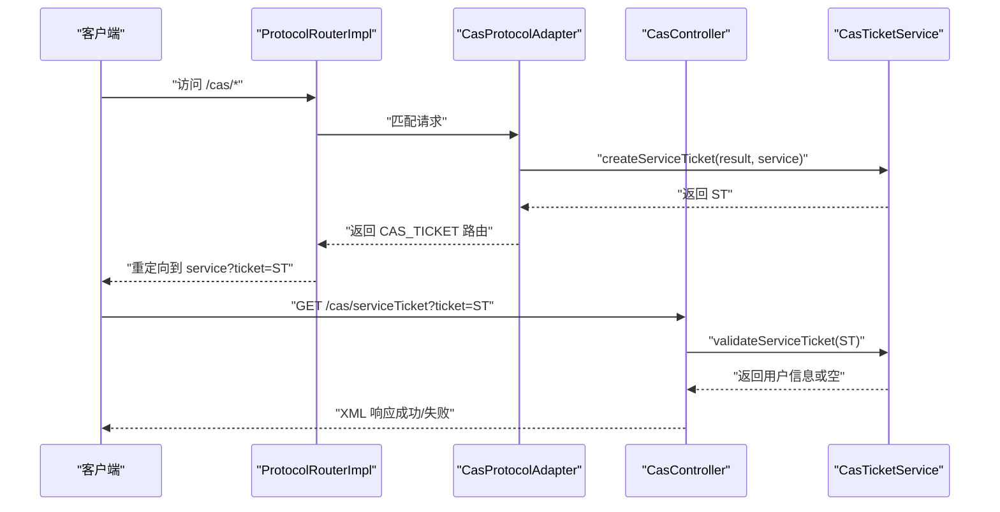
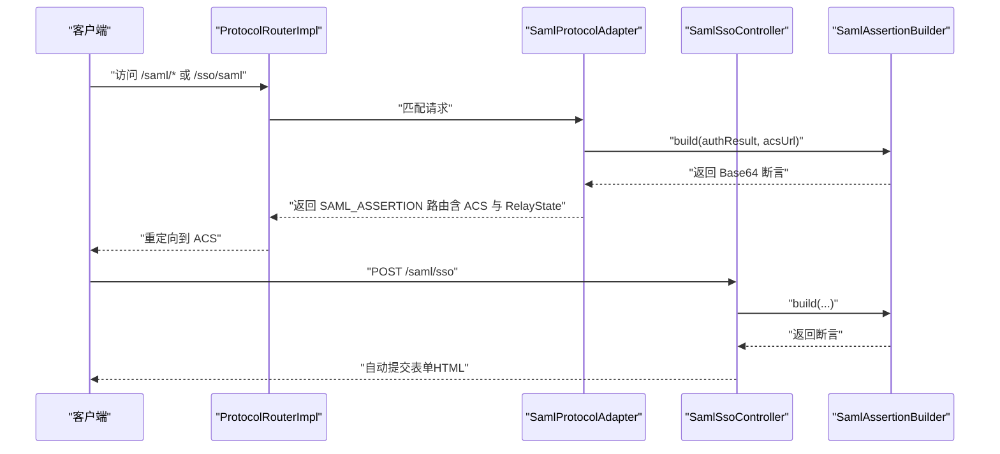
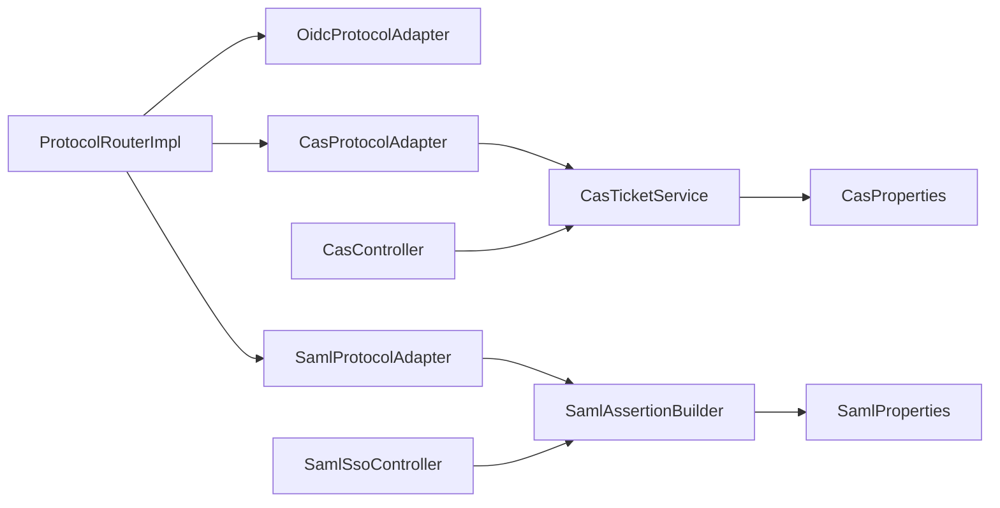

# 协议适配器

<cite>
**本文引用的文件**
- [ProtocolAdapter.java](file://iam-auth-server/src/main/java/iam/platform/auth/application/service/routing/ProtocolAdapter.java)
- [ProtocolRouter.java](file://iam-auth-server/src/main/java/iam/platform/auth/application/service/routing/ProtocolRouter.java)
- [ProtocolRouterImpl.java](file://iam-auth-server/src/main/java/iam/platform/auth/application/service/routing/ProtocolRouterImpl.java)
- [ProtocolContext.java](file://iam-auth-server/src/main/java/iam/platform/auth/application/service/routing/ProtocolContext.java)
- [ProtocolRoute.java](file://iam-auth-server/src/main/java/iam/platform/auth/application/service/routing/ProtocolRoute.java)
- [OidcProtocolAdapter.java](file://iam-auth-server/src/main/java/iam/platform/auth/application/service/routing/OidcProtocolAdapter.java)
- [CasProtocolAdapter.java](file://iam-auth-server/src/main/java/iam/platform/auth/application/service/routing/CasProtocolAdapter.java)
- [SamlProtocolAdapter.java](file://iam-auth-server/src/main/java/iam/platform/auth/application/service/routing/SamlProtocolAdapter.java)
- [CasTicketService.java](file://iam-auth-server/src/main/java/iam/platform/auth/application/service/CasTicketService.java)
- [SamlAssertionBuilder.java](file://iam-auth-server/src/main/java/iam/platform/auth/application/service/SamlAssertionBuilder.java)
- [CasController.java](file://iam-auth-server/src/main/java/iam/platform/auth/interfaces/web/CasController.java)
- [SamlSsoController.java](file://iam-auth-server/src/main/java/iam/platform/auth/interfaces/web/SamlSsoController.java)
- [CasProperties.java](file://iam-auth-server/src/main/java/iam/platform/auth/infrastructure/config/CasProperties.java)
- [SamlProperties.java](file://iam-auth-server/src/main/java/iam/platform/auth/infrastructure/config/SamlProperties.java)
- [application.yml](file://iam-auth-server/src/main/resources/application.yml)
</cite>

## 目录
1. [简介](#简介)
2. [项目结构](#项目结构)
3. [核心组件](#核心组件)
4. [架构总览](#架构总览)
5. [详细组件分析](#详细组件分析)
6. [依赖分析](#依赖分析)
7. [性能考虑](#性能考虑)
8. [故障排查指南](#故障排查指南)
9. [结论](#结论)
10. [附录](#附录)

## 简介
本文件面向协议适配器的设计与实现，系统性阐述统一认证框架中的协议路由机制与适配器模式。重点覆盖：
- 适配器接口与路由决策模型
- CAS 单点登录、单点登出、票据验证
- SAML 断言生成、元数据管理
- 协议路由器工作原理与扩展指南
- 配置示例与集成测试方法
- 新协议适配器与自定义路由逻辑的实现路径

## 项目结构
协议适配器位于认证服务模块中，采用“接口 + 多实现 + 路由器”的分层设计，配合控制器与基础设施配置完成端到端的协议处理。

**图表来源**
- [ProtocolAdapter.java:1-20](file://iam-auth-server/src/main/java/iam/platform/auth/application/service/routing/ProtocolAdapter.java#L1-L20)
- [ProtocolRouterImpl.java:1-52](file://iam-auth-server/src/main/java/iam/platform/auth/application/service/routing/ProtocolRouterImpl.java#L1-L52)
- [OidcProtocolAdapter.java:1-40](file://iam-auth-server/src/main/java/iam/platform/auth/application/service/routing/OidcProtocolAdapter.java#L1-L40)
- [CasProtocolAdapter.java:1-80](file://iam-auth-server/src/main/java/iam/platform/auth/application/service/routing/CasProtocolAdapter.java#L1-L80)
- [SamlProtocolAdapter.java:1-47](file://iam-auth-server/src/main/java/iam/platform/auth/application/service/routing/SamlProtocolAdapter.java#L1-L47)
- [ProtocolContext.java:1-21](file://iam-auth-server/src/main/java/iam/platform/auth/application/service/routing/ProtocolContext.java#L1-L21)
- [ProtocolRoute.java:1-74](file://iam-auth-server/src/main/java/iam/platform/auth/application/service/routing/ProtocolRoute.java#L1-L74)
- [CasTicketService.java:1-127](file://iam-auth-server/src/main/java/iam/platform/auth/application/service/CasTicketService.java#L1-L127)
- [SamlAssertionBuilder.java:1-115](file://iam-auth-server/src/main/java/iam/platform/auth/application/service/SamlAssertionBuilder.java#L1-L115)
- [CasController.java:1-170](file://iam-auth-server/src/main/java/iam/platform/auth/interfaces/web/CasController.java#L1-L170)
- [SamlSsoController.java:1-151](file://iam-auth-server/src/main/java/iam/platform/auth/interfaces/web/SamlSsoController.java#L1-L151)
- [CasProperties.java:1-45](file://iam-auth-server/src/main/java/iam/platform/auth/infrastructure/config/CasProperties.java#L1-L45)
- [SamlProperties.java:1-39](file://iam-auth-server/src/main/java/iam/platform/auth/infrastructure/config/SamlProperties.java#L1-L39)

**章节来源**
- [ProtocolAdapter.java:1-20](file://iam-auth-server/src/main/java/iam/platform/auth/application/service/routing/ProtocolAdapter.java#L1-L20)
- [ProtocolRouterImpl.java:1-52](file://iam-auth-server/src/main/java/iam/platform/auth/application/service/routing/ProtocolRouterImpl.java#L1-L52)
- [application.yml:115-127](file://iam-auth-server/src/main/resources/application.yml#L115-L127)

## 核心组件
- 协议适配器接口：定义匹配请求与解析路由的能力
- 协议路由器：基于保存的请求与认证结果进行路由决策
- 协议上下文：封装认证结果、原始请求与默认跳转地址
- 协议路由结果：标准化返回目标类型与附加参数
- 具体适配器：OIDC、CAS、SAML 的匹配规则与路由策略
- 基础设施服务：CAS 票据生成与校验、SAML 断言构建
- 控制器：对外暴露协议端点（登录、票据校验、元数据）

**章节来源**
- [ProtocolAdapter.java:1-20](file://iam-auth-server/src/main/java/iam/platform/auth/application/service/routing/ProtocolAdapter.java#L1-L20)
- [ProtocolRouter.java:1-19](file://iam-auth-server/src/main/java/iam/platform/auth/application/service/routing/ProtocolRouter.java#L1-L19)
- [ProtocolRouterImpl.java:1-52](file://iam-auth-server/src/main/java/iam/platform/auth/application/service/routing/ProtocolRouterImpl.java#L1-L52)
- [ProtocolContext.java:1-21](file://iam-auth-server/src/main/java/iam/platform/auth/application/service/routing/ProtocolContext.java#L1-L21)
- [ProtocolRoute.java:1-74](file://iam-auth-server/src/main/java/iam/platform/auth/application/service/routing/ProtocolRoute.java#L1-L74)

## 架构总览
协议路由器通过读取保存的请求与认证结果，遍历已注册的适配器，依据匹配规则选择对应协议处理器，最终返回标准化的路由结果。控制器负责对外暴露协议端点，调用相应服务完成业务处理。

**图表来源**
- [ProtocolRouterImpl.java:24-50](file://iam-auth-server/src/main/java/iam/platform/auth/application/service/routing/ProtocolRouterImpl.java#L24-L50)
- [OidcProtocolAdapter.java:14-38](file://iam-auth-server/src/main/java/iam/platform/auth/application/service/routing/OidcProtocolAdapter.java#L14-L38)
- [CasProtocolAdapter.java:21-50](file://iam-auth-server/src/main/java/iam/platform/auth/application/service/routing/CasProtocolAdapter.java#L21-L50)
- [SamlProtocolAdapter.java:19-45](file://iam-auth-server/src/main/java/iam/platform/auth/application/service/routing/SamlProtocolAdapter.java#L19-L45)
- [CasController.java:44-107](file://iam-auth-server/src/main/java/iam/platform/auth/interfaces/web/CasController.java#L44-L107)
- [SamlSsoController.java:42-93](file://iam-auth-server/src/main/java/iam/platform/auth/interfaces/web/SamlSsoController.java#L42-L93)

## 详细组件分析

### 协议适配器接口与路由机制
- 接口职责：声明匹配请求与解析路由的方法
- 匹配策略：基于请求 URI 或上下文信息判断
- 路由结果：统一返回 ProtocolRoute，包含类型、目标 URL 与附加参数

**图表来源**
- [ProtocolAdapter.java:9-19](file://iam-auth-server/src/main/java/iam/platform/auth/application/service/routing/ProtocolAdapter.java#L9-L19)
- [ProtocolRouter.java:9-18](file://iam-auth-server/src/main/java/iam/platform/auth/application/service/routing/ProtocolRouter.java#L9-L18)
- [ProtocolRouterImpl.java:20-50](file://iam-auth-server/src/main/java/iam/platform/auth/application/service/routing/ProtocolRouterImpl.java#L20-L50)
- [ProtocolContext.java:10-19](file://iam-auth-server/src/main/java/iam/platform/auth/application/service/routing/ProtocolContext.java#L10-L19)
- [ProtocolRoute.java:8-26](file://iam-auth-server/src/main/java/iam/platform/auth/application/service/routing/ProtocolRoute.java#L8-L26)

**章节来源**
- [ProtocolAdapter.java:1-20](file://iam-auth-server/src/main/java/iam/platform/auth/application/service/routing/ProtocolAdapter.java#L1-L20)
- [ProtocolRouter.java:1-19](file://iam-auth-server/src/main/java/iam/platform/auth/application/service/routing/ProtocolRouter.java#L1-L19)
- [ProtocolRouterImpl.java:1-52](file://iam-auth-server/src/main/java/iam/platform/auth/application/service/routing/ProtocolRouterImpl.java#L1-L52)
- [ProtocolContext.java:1-21](file://iam-auth-server/src/main/java/iam/platform/auth/application/service/routing/ProtocolContext.java#L1-L21)
- [ProtocolRoute.java:1-74](file://iam-auth-server/src/main/java/iam/platform/auth/application/service/routing/ProtocolRoute.java#L1-L74)

### OIDC 适配器
- 匹配逻辑：通过 Referer 或回调 URI 判断是否为 OAuth2 授权码流程
- 路由策略：若存在保存的授权请求，则恢复该请求；否则默认重定向

**图表来源**
- [OidcProtocolAdapter.java:14-38](file://iam-auth-server/src/main/java/iam/platform/auth/application/service/routing/OidcProtocolAdapter.java#L14-L38)

**章节来源**
- [OidcProtocolAdapter.java:1-40](file://iam-auth-server/src/main/java/iam/platform/auth/application/service/routing/OidcProtocolAdapter.java#L1-L40)

### CAS 适配器与控制器
- 匹配逻辑：请求 URI 包含 /cas/
- 路由策略：从保存请求中提取 service 参数，生成 ST 并重定向至服务端点
- 票据服务：支持 ST 生成与一次性消费校验，使用 Redis 分布式存储，异常时回退内存存储
- 控制器能力：登录页、登录处理、票据校验、健康检查；支持 SLO 服务注册

**图表来源**
- [CasProtocolAdapter.java:21-50](file://iam-auth-server/src/main/java/iam/platform/auth/application/service/routing/CasProtocolAdapter.java#L21-L50)
- [CasTicketService.java:36-106](file://iam-auth-server/src/main/java/iam/platform/auth/application/service/CasTicketService.java#L36-L106)
- [CasController.java:114-149](file://iam-auth-server/src/main/java/iam/platform/auth/interfaces/web/CasController.java#L114-L149)

**章节来源**
- [CasProtocolAdapter.java:1-80](file://iam-auth-server/src/main/java/iam/platform/auth/application/service/routing/CasProtocolAdapter.java#L1-L80)
- [CasTicketService.java:1-127](file://iam-auth-server/src/main/java/iam/platform/auth/application/service/CasTicketService.java#L1-L127)
- [CasController.java:1-170](file://iam-auth-server/src/main/java/iam/platform/auth/interfaces/web/CasController.java#L1-L170)
- [CasProperties.java:1-45](file://iam-auth-server/src/main/java/iam/platform/auth/infrastructure/config/CasProperties.java#L1-L45)

### SAML 适配器与控制器
- 匹配逻辑：请求 URI 包含 /saml/ 或 /sso/saml
- 路由策略：从上下文提取 ACS URL，结合 RelayState 生成 SAML 断言
- 断言构建：按 SAML 2.0 规范生成 XML 并 Base64 编码，设置有效期与受众
- 控制器能力：登录页、登录处理、自动提交表单至 SP 的 ACS，元数据端点

**图表来源**
- [SamlProtocolAdapter.java:19-45](file://iam-auth-server/src/main/java/iam/platform/auth/application/service/routing/SamlProtocolAdapter.java#L19-L45)
- [SamlAssertionBuilder.java:32-100](file://iam-auth-server/src/main/java/iam/platform/auth/application/service/SamlAssertionBuilder.java#L32-L100)
- [SamlSsoController.java:58-93](file://iam-auth-server/src/main/java/iam/platform/auth/interfaces/web/SamlSsoController.java#L58-L93)

**章节来源**
- [SamlProtocolAdapter.java:1-47](file://iam-auth-server/src/main/java/iam/platform/auth/application/service/routing/SamlProtocolAdapter.java#L1-L47)
- [SamlAssertionBuilder.java:1-115](file://iam-auth-server/src/main/java/iam/platform/auth/application/service/SamlAssertionBuilder.java#L1-L115)
- [SamlSsoController.java:1-151](file://iam-auth-server/src/main/java/iam/platform/auth/interfaces/web/SamlSsoController.java#L1-L151)
- [SamlProperties.java:1-39](file://iam-auth-server/src/main/java/iam/platform/auth/infrastructure/config/SamlProperties.java#L1-L39)

## 依赖分析
- 组件耦合：路由器聚合多个适配器，适配器依赖各自的服务（CAS 票据、SAML 断言）
- 外部依赖：Redis 用于 CAS 票据持久化；配置文件集中管理协议参数
- 循环依赖：未见直接循环；适配器仅向下依赖服务，控制器向上依赖服务

**图表来源**
- [ProtocolRouterImpl.java:22-25](file://iam-auth-server/src/main/java/iam/platform/auth/application/service/routing/ProtocolRouterImpl.java#L22-L25)
- [CasProtocolAdapter.java:19-25](file://iam-auth-server/src/main/java/iam/platform/auth/application/service/routing/CasProtocolAdapter.java#L19-L25)
- [SamlProtocolAdapter.java:17-23](file://iam-auth-server/src/main/java/iam/platform/auth/application/service/routing/SamlProtocolAdapter.java#L17-L23)
- [CasTicketService.java:24-25](file://iam-auth-server/src/main/java/iam/platform/auth/application/service/CasTicketService.java#L24-L25)
- [SamlAssertionBuilder.java:23-23](file://iam-auth-server/src/main/java/iam/platform/auth/application/service/SamlAssertionBuilder.java#L23-L23)
- [CasController.java:36-38](file://iam-auth-server/src/main/java/iam/platform/auth/interfaces/web/CasController.java#L36-L38)
- [SamlSsoController.java:34-36](file://iam-auth-server/src/main/java/iam/platform/auth/interfaces/web/SamlSsoController.java#L34-L36)
- [CasProperties.java:13-44](file://iam-auth-server/src/main/java/iam/platform/auth/infrastructure/config/CasProperties.java#L13-L44)
- [SamlProperties.java:13-38](file://iam-auth-server/src/main/java/iam/platform/auth/infrastructure/config/SamlProperties.java#L13-L38)

**章节来源**
- [application.yml:115-127](file://iam-auth-server/src/main/resources/application.yml#L115-L127)

## 性能考虑
- 票据存储：CAS 使用 Redis 存储 ST，具备 TTL 与一次性消费特性；Redis 不可用时回退内存存储，降低可用性风险但影响分布式一致性
- 断言生成：SAML 断言为纯内存构建，Base64 编码后传输，注意大体量属性时的网络开销
- 路由效率：路由器线性遍历适配器，建议在适配器数量较少且匹配逻辑简单时保持高效；可通过优先级排序或更复杂的匹配策略优化
- 会话与缓存：控制器与服务层均依赖会话与缓存，确保 Redis 连接池与超时配置合理

[本节为通用指导，无需特定文件来源]

## 故障排查指南
- CAS 票据无效或已消费
  - 现象：票据校验返回失败
  - 排查：确认票据是否被消费、是否过期、Redis 可用性与键空间
  - 参考
    - [CasTicketService.java:67-106](file://iam-auth-server/src/main/java/iam/platform/auth/application/service/CasTicketService.java#L67-L106)
    - [CasController.java:114-149](file://iam-auth-server/src/main/java/iam/platform/auth/interfaces/web/CasController.java#L114-L149)
- SAML 断言为空或 ACS 未找到
  - 现象：路由返回默认重定向
  - 排查：确认保存请求中是否包含 ACS URL、RelayState 是否正确传递
  - 参考
    - [SamlProtocolAdapter.java:26-45](file://iam-auth-server/src/main/java/iam/platform/auth/application/service/routing/SamlProtocolAdapter.java#L26-L45)
    - [SamlSsoController.java:42-93](file://iam-auth-server/src/main/java/iam/platform/auth/interfaces/web/SamlSsoController.java#L42-L93)
- OIDC 回调无法恢复授权请求
  - 现象：路由返回默认重定向
  - 排查：确认 Referer 与回调路径匹配、保存请求是否存在
  - 参考
    - [OidcProtocolAdapter.java:14-38](file://iam-auth-server/src/main/java/iam/platform/auth/application/service/routing/OidcProtocolAdapter.java#L14-L38)
    - [ProtocolRouterImpl.java:32-35](file://iam-auth-server/src/main/java/iam/platform/auth/application/service/routing/ProtocolRouterImpl.java#L32-L35)

**章节来源**
- [CasTicketService.java:67-106](file://iam-auth-server/src/main/java/iam/platform/auth/application/service/CasTicketService.java#L67-L106)
- [CasController.java:114-149](file://iam-auth-server/src/main/java/iam/platform/auth/interfaces/web/CasController.java#L114-L149)
- [SamlProtocolAdapter.java:26-45](file://iam-auth-server/src/main/java/iam/platform/auth/application/service/routing/SamlProtocolAdapter.java#L26-L45)
- [SamlSsoController.java:42-93](file://iam-auth-server/src/main/java/iam/platform/auth/interfaces/web/SamlSsoController.java#L42-L93)
- [OidcProtocolAdapter.java:14-38](file://iam-auth-server/src/main/java/iam/platform/auth/application/service/routing/OidcProtocolAdapter.java#L14-L38)
- [ProtocolRouterImpl.java:32-35](file://iam-auth-server/src/main/java/iam/platform/auth/application/service/routing/ProtocolRouterImpl.java#L32-L35)

## 结论
协议适配器体系以清晰的接口与可插拔的实现，实现了对 OIDC、CAS、SAML 的统一路由与上下文传递。CAS 与 SAML 的核心能力分别体现在票据与断言的生成与校验上，控制器与服务层协同完成端到端流程。通过配置文件与属性类，系统具备良好的可扩展性与运维可控性。

[本节为总结，无需特定文件来源]

## 附录

### 扩展指南：新增协议适配器
- 步骤
  - 实现 ProtocolAdapter 接口，定义匹配逻辑与路由解析
  - 在 Spring 容器中注册为组件，确保被路由器发现
  - 如需外部服务，注入相应服务类（如票据/断言构建器）
  - 在控制器中暴露必要的端点，遵循现有风格
- 参考
  - [ProtocolAdapter.java:9-19](file://iam-auth-server/src/main/java/iam/platform/auth/application/service/routing/ProtocolAdapter.java#L9-L19)
  - [OidcProtocolAdapter.java:1-40](file://iam-auth-server/src/main/java/iam/platform/auth/application/service/routing/OidcProtocolAdapter.java#L1-L40)
  - [CasProtocolAdapter.java:1-80](file://iam-auth-server/src/main/java/iam/platform/auth/application/service/routing/CasProtocolAdapter.java#L1-L80)
  - [SamlProtocolAdapter.java:1-47](file://iam-auth-server/src/main/java/iam/platform/auth/application/service/routing/SamlProtocolAdapter.java#L1-L47)

**章节来源**
- [ProtocolAdapter.java:1-20](file://iam-auth-server/src/main/java/iam/platform/auth/application/service/routing/ProtocolAdapter.java#L1-L20)
- [OidcProtocolAdapter.java:1-40](file://iam-auth-server/src/main/java/iam/platform/auth/application/service/routing/OidcProtocolAdapter.java#L1-L40)
- [CasProtocolAdapter.java:1-80](file://iam-auth-server/src/main/java/iam/platform/auth/application/service/routing/CasProtocolAdapter.java#L1-L80)
- [SamlProtocolAdapter.java:1-47](file://iam-auth-server/src/main/java/iam/platform/auth/application/service/routing/SamlProtocolAdapter.java#L1-L47)

### 自定义路由逻辑
- 在 ProtocolRouterImpl 中调整匹配顺序或增加条件判断
- 通过 ProtocolContext 注入更多上下文信息（如租户、客户端类型）
- 参考
  - [ProtocolRouterImpl.java:24-50](file://iam-auth-server/src/main/java/iam/platform/auth/application/service/routing/ProtocolRouterImpl.java#L24-L50)
  - [ProtocolContext.java:10-19](file://iam-auth-server/src/main/java/iam/platform/auth/application/service/routing/ProtocolContext.java#L10-L19)

**章节来源**
- [ProtocolRouterImpl.java:1-52](file://iam-auth-server/src/main/java/iam/platform/auth/application/service/routing/ProtocolRouterImpl.java#L1-L52)
- [ProtocolContext.java:1-21](file://iam-auth-server/src/main/java/iam/platform/auth/application/service/routing/ProtocolContext.java#L1-L21)

### 配置示例
- CAS 配置项（application.yml）
  - server-url、ticket-validity-seconds、ticket-prefix、single-sign-out-enabled、logout-url、login-url、front/back-channel logout、logout-request-ttl-seconds、send-logout-to-all-services
  - 参考
    - [application.yml:115-127](file://iam-auth-server/src/main/resources/application.yml#L115-L127)
    - [CasProperties.java:13-44](file://iam-auth-server/src/main/java/iam/platform/auth/infrastructure/config/CasProperties.java#L13-L44)
- SAML 配置项（application.yml）
  - entityId、ssoUrl、assertion-validity-minutes、signature-algorithm、nameIdFormat、sign-assertions、signing-key-path、signing-key-password
  - 参考
    - [application.yml:115-127](file://iam-auth-server/src/main/resources/application.yml#L115-L127)
    - [SamlProperties.java:13-38](file://iam-auth-server/src/main/java/iam/platform/auth/infrastructure/config/SamlProperties.java#L13-L38)

**章节来源**
- [application.yml:115-127](file://iam-auth-server/src/main/resources/application.yml#L115-L127)
- [CasProperties.java:1-45](file://iam-auth-server/src/main/java/iam/platform/auth/infrastructure/config/CasProperties.java#L1-L45)
- [SamlProperties.java:1-39](file://iam-auth-server/src/main/java/iam/platform/auth/infrastructure/config/SamlProperties.java#L1-L39)

### 集成测试方法
- OIDC 测试要点
  - 模拟 Referer 与回调路径，验证路由是否恢复授权请求或默认重定向
  - 参考
    - [OidcProtocolAdapter.java:14-38](file://iam-auth-server/src/main/java/iam/platform/auth/application/service/routing/OidcProtocolAdapter.java#L14-L38)
- CAS 测试要点
  - 登录成功后生成 ST 并重定向；票据校验返回用户信息；票据无效或已消费时返回错误
  - 参考
    - [CasController.java:61-107](file://iam-auth-server/src/main/java/iam/platform/auth/interfaces/web/CasController.java#L61-L107)
    - [CasTicketService.java:36-106](file://iam-auth-server/src/main/java/iam/platform/auth/application/service/CasTicketService.java#L36-L106)
- SAML 测试要点
  - 登录成功后生成断言并自动提交表单至 ACS；元数据端点返回有效 XML
  - 参考
    - [SamlSsoController.java:58-93](file://iam-auth-server/src/main/java/iam/platform/auth/interfaces/web/SamlSsoController.java#L58-L93)
    - [SamlAssertionBuilder.java:32-100](file://iam-auth-server/src/main/java/iam/platform/auth/application/service/SamlAssertionBuilder.java#L32-L100)

**章节来源**
- [OidcProtocolAdapter.java:1-40](file://iam-auth-server/src/main/java/iam/platform/auth/application/service/routing/OidcProtocolAdapter.java#L1-L40)
- [CasController.java:1-170](file://iam-auth-server/src/main/java/iam/platform/auth/interfaces/web/CasController.java#L1-L170)
- [CasTicketService.java:1-127](file://iam-auth-server/src/main/java/iam/platform/auth/application/service/CasTicketService.java#L1-L127)
- [SamlSsoController.java:1-151](file://iam-auth-server/src/main/java/iam/platform/auth/interfaces/web/SamlSsoController.java#L1-L151)
- [SamlAssertionBuilder.java:1-115](file://iam-auth-server/src/main/java/iam/platform/auth/application/service/SamlAssertionBuilder.java#L1-L115)