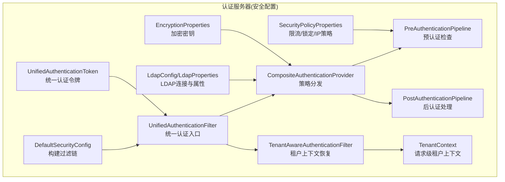
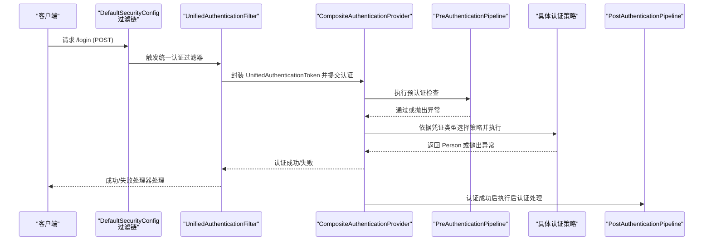
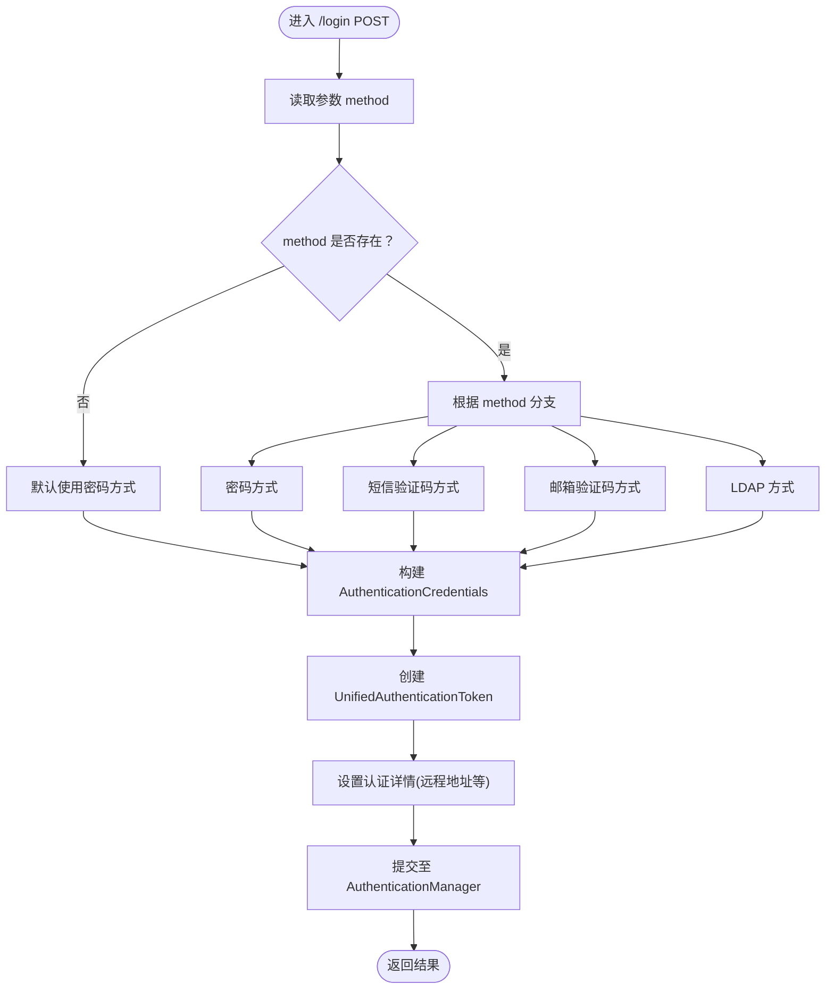
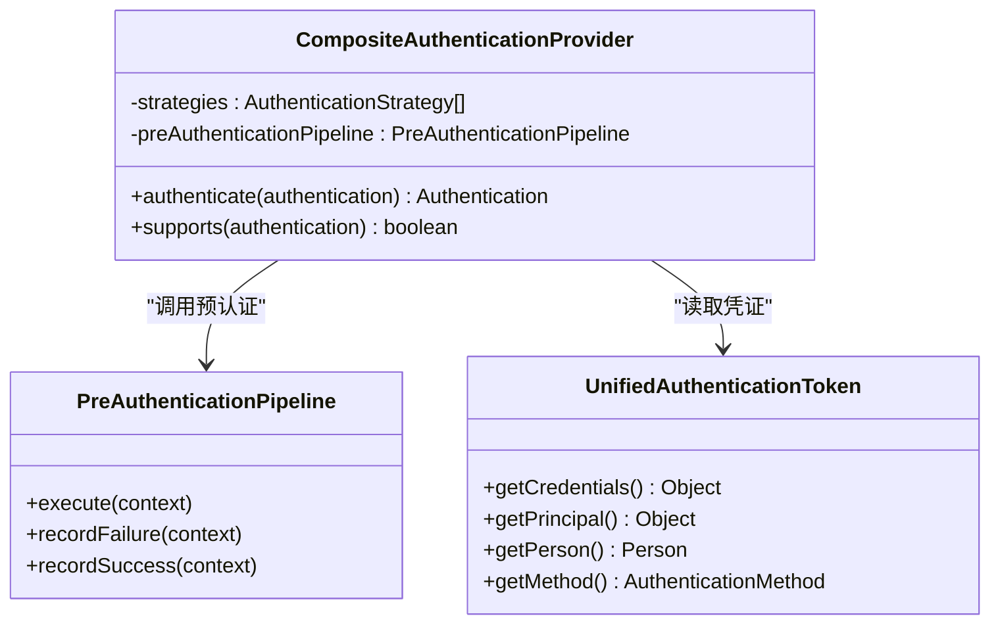
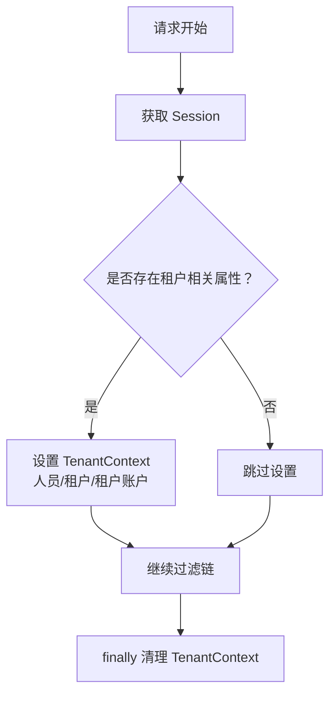
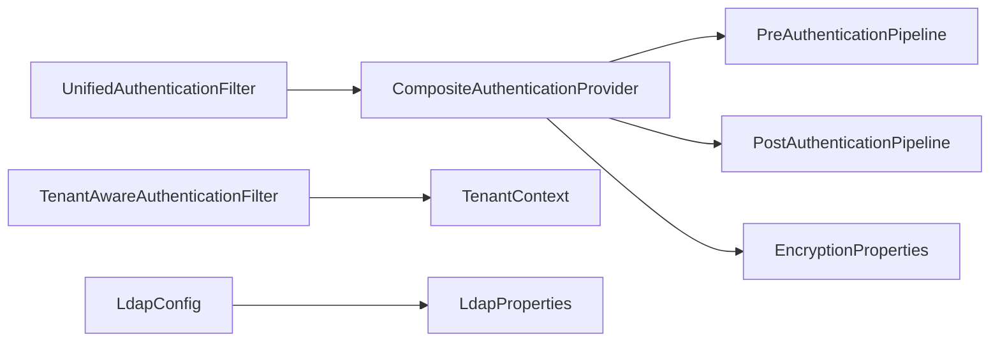

# 安全配置管理

<cite>
**本文引用的文件**
- [DefaultSecurityConfig.java](file://iam-auth-server/src/main/java/iam/platform/auth/infrastructure/config/DefaultSecurityConfig.java)
- [EncryptionProperties.java](file://iam-auth-server/src/main/java/iam/platform/auth/infrastructure/config/EncryptionProperties.java)
- [LdapConfig.java](file://iam-auth-server/src/main/java/iam/platform/auth/infrastructure/config/LdapConfig.java)
- [LdapProperties.java](file://iam-auth-server/src/main/java/iam/platform/auth/infrastructure/config/LdapProperties.java)
- [SecurityPolicyProperties.java](file://iam-auth-server/src/main/java/iam/platform/auth/infrastructure/config/SecurityPolicyProperties.java)
- [UnifiedAuthenticationFilter.java](file://iam-auth-server/src/main/java/iam/platform/auth/infrastructure/security/UnifiedAuthenticationFilter.java)
- [TenantAwareAuthenticationFilter.java](file://iam-auth-server/src/main/java/iam/platform/auth/infrastructure/security/TenantAwareAuthenticationFilter.java)
- [CompositeAuthenticationProvider.java](file://iam-auth-server/src/main/java/iam/platform/auth/infrastructure/security/CompositeAuthenticationProvider.java)
- [UnifiedAuthenticationToken.java](file://iam-auth-server/src/main/java/iam/platform/auth/infrastructure/security/UnifiedAuthenticationToken.java)
- [TenantContext.java](file://iam-auth-server/src/main/java/iam/platform/auth/infrastructure/security/TenantContext.java)
- [PreAuthenticationPipeline.java](file://iam-auth-server/src/main/java/iam/platform/auth/application/service/pipeline/PreAuthenticationPipeline.java)
- [PostAuthenticationPipeline.java](file://iam-auth-server/src/main/java/iam/platform/auth/application/service/pipeline/PostAuthenticationPipeline.java)
- [application.yml](file://iam-auth-server/src/main/resources/application.yml)
- [application-dev.yml](file://iam-auth-server/src/main/resources/application-dev.yml)
</cite>

## 目录
1. [简介](#简介)
2. [项目结构](#项目结构)
3. [核心组件](#核心组件)
4. [架构总览](#架构总览)
5. [详细组件分析](#详细组件分析)
6. [依赖分析](#依赖分析)
7. [性能考虑](#性能考虑)
8. [故障排查指南](#故障排查指南)
9. [结论](#结论)
10. [附录](#附录)

## 简介
本文件系统性梳理认证服务器的安全配置体系，覆盖默认安全配置、加密属性、安全策略（限流、锁定、IP 白黑名单）、LDAP 配置与集成、统一认证过滤器的实现机制（含租户感知、认证上下文、安全拦截），以及安全属性的配置项与最佳实践。同时阐明安全配置的加载机制与优先级规则，提供调试方法、常见问题排查与性能优化建议，并给出可直接参考的配置示例路径。

## 项目结构
认证服务器位于 iam-auth-server 模块，安全相关代码主要分布在以下位置：
- 配置层：DefaultSecurityConfig（Spring Security 过滤链）、EncryptionProperties（加密密钥）、LdapConfig/LdapProperties（LDAP）、SecurityPolicyProperties（安全策略）
- 安全过滤与上下文：UnifiedAuthenticationFilter、TenantAwareAuthenticationFilter、TenantContext、UnifiedAuthenticationToken
- 认证流水线：PreAuthenticationPipeline、PostAuthenticationPipeline、CompositeAuthenticationProvider
- 资源配置：application.yml、application-dev.yml

图表来源
- [DefaultSecurityConfig.java:35-63](file://iam-auth-server/src/main/java/iam/platform/auth/infrastructure/config/DefaultSecurityConfig.java#L35-L63)
- [UnifiedAuthenticationFilter.java:18-79](file://iam-auth-server/src/main/java/iam/platform/auth/infrastructure/security/UnifiedAuthenticationFilter.java#L18-L79)
- [TenantAwareAuthenticationFilter.java:23-67](file://iam-auth-server/src/main/java/iam/platform/auth/infrastructure/security/TenantAwareAuthenticationFilter.java#L23-L67)
- [CompositeAuthenticationProvider.java:26-74](file://iam-auth-server/src/main/java/iam/platform/auth/infrastructure/security/CompositeAuthenticationProvider.java#L26-L74)
- [PreAuthenticationPipeline.java:26-60](file://iam-auth-server/src/main/java/iam/platform/auth/application/service/pipeline/PreAuthenticationPipeline.java#L26-L60)
- [PostAuthenticationPipeline.java:22-30](file://iam-auth-server/src/main/java/iam/platform/auth/application/service/pipeline/PostAuthenticationPipeline.java#L22-L30)
- [LdapConfig.java:20-37](file://iam-auth-server/src/main/java/iam/platform/auth/infrastructure/config/LdapConfig.java#L20-L37)
- [LdapProperties.java:13-33](file://iam-auth-server/src/main/java/iam/platform/auth/infrastructure/config/LdapProperties.java#L13-L33)
- [SecurityPolicyProperties.java:15-36](file://iam-auth-server/src/main/java/iam/platform/auth/infrastructure/config/SecurityPolicyProperties.java#L15-L36)
- [EncryptionProperties.java:12-14](file://iam-auth-server/src/main/java/iam/platform/auth/infrastructure/config/EncryptionProperties.java#L12-L14)
- [TenantContext.java:7-44](file://iam-auth-server/src/main/java/iam/platform/auth/infrastructure/security/TenantContext.java#L7-L44)
- [UnifiedAuthenticationToken.java:17-67](file://iam-auth-server/src/main/java/iam/platform/auth/infrastructure/security/UnifiedAuthenticationToken.java#L17-L67)

章节来源
- [DefaultSecurityConfig.java:24-94](file://iam-auth-server/src/main/java/iam/platform/auth/infrastructure/config/DefaultSecurityConfig.java#L24-L94)
- [application.yml:1-144](file://iam-auth-server/src/main/resources/application.yml#L1-L144)
- [application-dev.yml:1-34](file://iam-auth-server/src/main/resources/application-dev.yml#L1-L34)

## 核心组件
- 默认安全配置与过滤链
  - 构建基于 HttpSecurity 的 SecurityFilterChain，显式注册统一认证过滤器与租户感知过滤器，替代 Spring 默认表单登录过滤器。
  - 提供 PasswordEncoder（BCrypt）与 AuthenticationManager（装配 CompositeAuthenticationProvider）。
- 统一认证过滤器
  - 单一登录入口 /login（POST），根据隐藏参数 method 决定认证方式（密码、短信验证码、邮箱验证码、LDAP），封装为 AuthenticationCredentials 并交由认证管理器处理。
- 复合认证提供者
  - 在 CompositeAuthenticationProvider 中执行预认证流水线，按凭证类型选择对应 AuthenticationStrategy，记录成功/失败以支持安全策略。
- 租户上下文与感知
  - TenantContext 使用 ThreadLocal 存储当前请求的人员、租户、租户账户 ID；TenantAwareAuthenticationFilter 在每次请求中从 Session 恢复上下文并在结束后清理。
- 安全策略属性
  - 支持速率限制（最大尝试次数、时间窗口）、账户锁定（阈值、时长）、IP 白名单/黑名单。
- 加密属性
  - security.encryption.key 用于敏感数据加密。
- LDAP 属性与配置
  - sso.ldap.* 提供启用开关、连接地址、基础 DN、绑定凭据、用户搜索基与过滤、SSL、超时、连接池等。
- 应用配置
  - application.yml/application-dev.yml 提供 SSL、数据库、Redis、OAuth2 客户端、JWK、会话存储、日志级别等。

章节来源
- [DefaultSecurityConfig.java:35-93](file://iam-auth-server/src/main/java/iam/platform/auth/infrastructure/config/DefaultSecurityConfig.java#L35-L93)
- [UnifiedAuthenticationFilter.java:31-78](file://iam-auth-server/src/main/java/iam/platform/auth/infrastructure/security/UnifiedAuthenticationFilter.java#L31-L78)
- [CompositeAuthenticationProvider.java:32-68](file://iam-auth-server/src/main/java/iam/platform/auth/infrastructure/security/CompositeAuthenticationProvider.java#L32-L68)
- [TenantAwareAuthenticationFilter.java:28-66](file://iam-auth-server/src/main/java/iam/platform/auth/infrastructure/security/TenantAwareAuthenticationFilter.java#L28-L66)
- [TenantContext.java:9-43](file://iam-auth-server/src/main/java/iam/platform/auth/infrastructure/security/TenantContext.java#L9-L43)
- [SecurityPolicyProperties.java:15-36](file://iam-auth-server/src/main/java/iam/platform/auth/infrastructure/config/SecurityPolicyProperties.java#L15-L36)
- [EncryptionProperties.java:12-14](file://iam-auth-server/src/main/java/iam/platform/auth/infrastructure/config/EncryptionProperties.java#L12-L14)
- [LdapProperties.java:13-33](file://iam-auth-server/src/main/java/iam/platform/auth/infrastructure/config/LdapProperties.java#L13-L33)
- [application.yml:53-127](file://iam-auth-server/src/main/resources/application.yml#L53-L127)
- [application-dev.yml:24-33](file://iam-auth-server/src/main/resources/application-dev.yml#L24-L33)

## 架构总览
统一认证流程通过过滤链串联，预认证阶段完成限流、锁定、IP 校验等前置检查，认证阶段依据凭证类型委派到具体策略，后认证阶段负责租户解析、权限加载、令牌构造等。

图表来源
- [DefaultSecurityConfig.java:35-79](file://iam-auth-server/src/main/java/iam/platform/auth/infrastructure/config/DefaultSecurityConfig.java#L35-L79)
- [UnifiedAuthenticationFilter.java:31-78](file://iam-auth-server/src/main/java/iam/platform/auth/infrastructure/security/UnifiedAuthenticationFilter.java#L31-L78)
- [CompositeAuthenticationProvider.java:32-68](file://iam-auth-server/src/main/java/iam/platform/auth/infrastructure/security/CompositeAuthenticationProvider.java#L32-L68)
- [PreAuthenticationPipeline.java:26-60](file://iam-auth-server/src/main/java/iam/platform/auth/application/service/pipeline/PreAuthenticationPipeline.java#L26-L60)
- [PostAuthenticationPipeline.java:22-30](file://iam-auth-server/src/main/java/iam/platform/auth/application/service/pipeline/PostAuthenticationPipeline.java#L22-L30)

## 详细组件分析

### 统一认证过滤器（UnifiedAuthenticationFilter）
- 功能要点
  - 仅处理 /login 的 POST 请求，读取隐藏字段 method 决定认证方式。
  - 支持密码、短信验证码、邮箱验证码、LDAP 四种方式，默认密码。
  - 将请求参数封装为 AuthenticationCredentials，创建 UnifiedAuthenticationToken，设置认证细节（远程地址等），交由 AuthenticationManager 处理。
- 错误处理
  - 缺失必要参数时抛出凭据错误。
  - 不支持的 method 抛出未知认证方式错误。
- 与过滤链集成
  - 替代 UsernamePasswordAuthenticationFilter，注册在 SecurityFilterChain 中。

图表来源
- [UnifiedAuthenticationFilter.java:31-78](file://iam-auth-server/src/main/java/iam/platform/auth/infrastructure/security/UnifiedAuthenticationFilter.java#L31-L78)
- [DefaultSecurityConfig.java:55-56](file://iam-auth-server/src/main/java/iam/platform/auth/infrastructure/config/DefaultSecurityConfig.java#L55-L56)

章节来源
- [UnifiedAuthenticationFilter.java:18-79](file://iam-auth-server/src/main/java/iam/platform/auth/infrastructure/security/UnifiedAuthenticationFilter.java#L18-L79)
- [DefaultSecurityConfig.java:35-79](file://iam-auth-server/src/main/java/iam/platform/auth/infrastructure/config/DefaultSecurityConfig.java#L35-L79)

### 复合认证提供者（CompositeAuthenticationProvider）
- 功能要点
  - 接收 UnifiedAuthenticationToken，提取 AuthenticationCredentials。
  - 先执行 PreAuthenticationPipeline，再按凭证类型匹配 AuthenticationStrategy。
  - 认证成功后记录成功事件，失败则记录失败事件，以便后续限流/锁定生效。
- 与策略解耦
  - 通过 Spring 自动发现多个 AuthenticationStrategy，按 supports 判定匹配。

图表来源
- [CompositeAuthenticationProvider.java:26-74](file://iam-auth-server/src/main/java/iam/platform/auth/infrastructure/security/CompositeAuthenticationProvider.java#L26-L74)
- [PreAuthenticationPipeline.java:26-60](file://iam-auth-server/src/main/java/iam/platform/auth/application/service/pipeline/PreAuthenticationPipeline.java#L26-L60)
- [UnifiedAuthenticationToken.java:17-67](file://iam-auth-server/src/main/java/iam/platform/auth/infrastructure/security/UnifiedAuthenticationToken.java#L17-L67)

章节来源
- [CompositeAuthenticationProvider.java:26-74](file://iam-auth-server/src/main/java/iam/platform/auth/infrastructure/security/CompositeAuthenticationProvider.java#L26-L74)
- [PreAuthenticationPipeline.java:26-60](file://iam-auth-server/src/main/java/iam/platform/auth/application/service/pipeline/PreAuthenticationPipeline.java#L26-L60)
- [UnifiedAuthenticationToken.java:17-67](file://iam-auth-server/src/main/java/iam/platform/auth/infrastructure/security/UnifiedAuthenticationToken.java#L17-L67)

### 租户感知过滤器与上下文（TenantAwareAuthenticationFilter、TenantContext）
- 功能要点
  - 在每次请求开始时从 Session 恢复租户上下文（租户 ID、租户账户 ID、人员 ID），结束时清理 ThreadLocal，防止内存泄漏。
  - 作为统一认证后的补充过滤器，确保后续业务逻辑能感知当前租户。
- 上下文存储
  - 使用三个 ThreadLocal 变量分别保存人员、租户、租户账户 ID。

图表来源
- [TenantAwareAuthenticationFilter.java:28-66](file://iam-auth-server/src/main/java/iam/platform/auth/infrastructure/security/TenantAwareAuthenticationFilter.java#L28-L66)
- [TenantContext.java:9-43](file://iam-auth-server/src/main/java/iam/platform/auth/infrastructure/security/TenantContext.java#L9-L43)

章节来源
- [TenantAwareAuthenticationFilter.java:23-67](file://iam-auth-server/src/main/java/iam/platform/auth/infrastructure/security/TenantAwareAuthenticationFilter.java#L23-L67)
- [TenantContext.java:7-44](file://iam-auth-server/src/main/java/iam/platform/auth/infrastructure/security/TenantContext.java#L7-L44)

### 安全策略属性（SecurityPolicyProperties）
- 配置项
  - sso.security.rate-limit.enabled/max-attempts/window-seconds：速率限制开关、最大尝试次数、统计窗口秒数。
  - sso.security.account-lockout.enabled/threshold/lockout-duration-minutes：账户锁定开关、触发阈值、锁定时长。
  - sso.security.ip-whitelist/ip-blacklist：IP 白名单与黑名单列表。
- 生效机制
  - 通过 PreAuthenticationPipeline 的 Handler（如 RateLimitHandler、AccountLockoutHandler）在预认证阶段执行校验与计数，在认证成功/失败后更新状态。

章节来源
- [SecurityPolicyProperties.java:15-36](file://iam-auth-server/src/main/java/iam/platform/auth/infrastructure/config/SecurityPolicyProperties.java#L15-L36)
- [PreAuthenticationPipeline.java:36-59](file://iam-auth-server/src/main/java/iam/platform/auth/application/service/pipeline/PreAuthenticationPipeline.java#L36-L59)

### 加密属性（EncryptionProperties）
- 配置项
  - security.encryption.key：用于敏感信息加密的对称密钥。
- 使用场景
  - 与持久化转换器（EncryptedStringConverter）配合，对存储于数据库中的敏感字段进行透明加解密。

章节来源
- [EncryptionProperties.java:12-14](file://iam-auth-server/src/main/java/iam/platform/auth/infrastructure/config/EncryptionProperties.java#L12-L14)
- [application.yml:86-87](file://iam-auth-server/src/main/resources/application.yml#L86-L87)

### LDAP 配置（LdapConfig、LdapProperties）
- 属性说明
  - sso.ldap.enabled：是否启用 LDAP。
  - sso.ldap.urls/base-dn/bind-dn/bind-password：连接地址、基础 DN、绑定 DN、绑定密码。
  - sso.ldap.user-search-base/user-search-filter：用户搜索基与过滤表达式。
  - sso.ldap.use-ssl/connect-timeout/read-timeout：是否使用 SSL、连接与读取超时。
  - sso.ldap.pool.max-active/max-idle：连接池最大活跃数与最大空闲数。
- Bean 注册
  - LdapContextSource：配置连接参数与连接池。
  - LdapTemplate：提供 LDAP 操作模板。

章节来源
- [LdapProperties.java:13-33](file://iam-auth-server/src/main/java/iam/platform/auth/infrastructure/config/LdapProperties.java#L13-L33)
- [LdapConfig.java:20-37](file://iam-auth-server/src/main/java/iam/platform/auth/infrastructure/config/LdapConfig.java#L20-L37)
- [application.yml:104-114](file://iam-auth-server/src/main/resources/application.yml#L104-L114)

### 默认安全配置（DefaultSecurityConfig）
- 关键点
  - 显式配置放行静态资源、登录页、注册页、验证码接口。
  - 配置 OAuth2 登录页面与用户信息服务。
  - 注册统一认证过滤器与租户感知过滤器，顺序保证：统一认证过滤器先于租户过滤器。
  - 提供 PasswordEncoder（BCrypt）与 AuthenticationManager（装配 CompositeAuthenticationProvider）。

章节来源
- [DefaultSecurityConfig.java:35-93](file://iam-auth-server/src/main/java/iam/platform/auth/infrastructure/config/DefaultSecurityConfig.java#L35-L93)

## 依赖分析
- 组件内聚与耦合
  - UnifiedAuthenticationFilter 与 CompositeAuthenticationProvider 通过 UnifiedAuthenticationToken 解耦。
  - PreAuthenticationPipeline 与 PostAuthenticationPipeline 作为横切关注点，被认证提供者调用，降低策略实现复杂度。
  - TenantAwareAuthenticationFilter 仅依赖 TenantContext，职责单一，耦合度低。
- 外部依赖
  - LDAP：LdapConfig 依赖 LdapProperties；LDAP 启用与否由 sso.ldap.enabled 控制。
  - 会话存储：spring.session.store-type=redis，命名空间 sso-auth。
  - OAuth2：spring.security.oauth2.client 下的第三方登录配置。
- 循环依赖
  - 未见循环依赖迹象；各组件通过接口与抽象类协作。

图表来源
- [UnifiedAuthenticationFilter.java:31-78](file://iam-auth-server/src/main/java/iam/platform/auth/infrastructure/security/UnifiedAuthenticationFilter.java#L31-L78)
- [CompositeAuthenticationProvider.java:29-68](file://iam-auth-server/src/main/java/iam/platform/auth/infrastructure/security/CompositeAuthenticationProvider.java#L29-L68)
- [PreAuthenticationPipeline.java:18-60](file://iam-auth-server/src/main/java/iam/platform/auth/application/service/pipeline/PreAuthenticationPipeline.java#L18-L60)
- [PostAuthenticationPipeline.java:20-30](file://iam-auth-server/src/main/java/iam/platform/auth/application/service/pipeline/PostAuthenticationPipeline.java#L20-L30)
- [TenantAwareAuthenticationFilter.java:49-66](file://iam-auth-server/src/main/java/iam/platform/auth/infrastructure/security/TenantAwareAuthenticationFilter.java#L49-L66)
- [TenantContext.java:9-43](file://iam-auth-server/src/main/java/iam/platform/auth/infrastructure/security/TenantContext.java#L9-L43)
- [LdapConfig.java:20-37](file://iam-auth-server/src/main/java/iam/platform/auth/infrastructure/config/LdapConfig.java#L20-L37)
- [LdapProperties.java:13-33](file://iam-auth-server/src/main/java/iam/platform/auth/infrastructure/config/LdapProperties.java#L13-L33)
- [EncryptionProperties.java:12-14](file://iam-auth-server/src/main/java/iam/platform/auth/infrastructure/config/EncryptionProperties.java#L12-L14)

## 性能考虑
- 连接池与超时
  - LDAP 连接池参数（max-active、max-idle）与超时（connect-timeout、read-timeout）需结合并发与网络状况调整，避免连接饥饿或超时抖动。
- 会话存储
  - spring.session.store-type=redis 且带命名空间，有助于多实例共享与隔离；注意 Redis 延迟与容量。
- 密码编码
  - 使用 BCryptPasswordEncoder，成本因子可根据 CPU 能力调优，平衡安全与吞吐。
- 速率限制与锁定
  - 合理设置 sso.security.rate-limit.window-seconds 与 max-attempts，避免误伤正常用户；锁定阈值与时长需兼顾安全与可用性。
- 日志与 SQL
  - 开发环境可开启 SQL 输出与安全日志，生产环境建议关闭或降级，减少 I/O 压力。

[本节为通用指导，无需列出章节来源]

## 故障排查指南
- 统一认证失败
  - 检查 /login 参数是否包含 method 与必需字段；确认 UnifiedAuthenticationFilter 已注册且顺序正确。
  - 查看 PreAuthenticationPipeline 中的 RateLimitHandler/AccountLockoutHandler 是否阻断请求。
- 租户上下文丢失
  - 确认 TenantAwareAuthenticationFilter 是否在过滤链中；检查 Session 中是否存在 SESSION_TENANT_ID/ACCOUNT_ID；请求结束时是否清理了 TenantContext。
- LDAP 认证异常
  - 核对 sso.ldap.enabled、urls、base-dn、bind-dn/bind-password、user-search-base/filter、use-ssl、超时与连接池配置。
- 加密异常
  - 确认 security.encryption.key 是否配置且长度满足要求；检查数据库字段是否被正确加解密。
- OAuth2 登录
  - 检查 spring.security.oauth2.client 下的 dingtalk 客户端配置与回调地址；确认用户信息映射字段一致。

章节来源
- [DefaultSecurityConfig.java:35-79](file://iam-auth-server/src/main/java/iam/platform/auth/infrastructure/config/DefaultSecurityConfig.java#L35-L79)
- [TenantAwareAuthenticationFilter.java:28-66](file://iam-auth-server/src/main/java/iam/platform/auth/infrastructure/security/TenantAwareAuthenticationFilter.java#L28-L66)
- [LdapProperties.java:15-33](file://iam-auth-server/src/main/java/iam/platform/auth/infrastructure/config/LdapProperties.java#L15-L33)
- [SecurityPolicyProperties.java:18-35](file://iam-auth-server/src/main/java/iam/platform/auth/infrastructure/config/SecurityPolicyProperties.java#L18-L35)
- [application.yml:53-88](file://iam-auth-server/src/main/resources/application.yml#L53-L88)

## 结论
该安全配置体系通过“统一入口 + 策略分发 + 流水线处理”的架构，实现了多认证方式的一致体验与可扩展性；结合 LDAP、限流/锁定、IP 策略与加密属性，形成完整的安全闭环。建议在生产环境中严格控制日志级别、优化 LDAP 连接池与超时、合理配置速率限制与锁定策略，并定期轮换加密密钥与 JWK。

[本节为总结性内容，无需列出章节来源]

## 附录

### 安全配置加载机制与优先级
- 配置文件
  - application.yml 为默认配置，application-dev.yml 为开发环境覆盖。
- 属性前缀
  - 安全策略：sso.security.*
  - LDAP：sso.ldap.*
  - 加密：security.encryption.*
  - JWK：security.jwk.*
  - OAuth2：spring.security.oauth2.client.*
  - 会话：spring.session.store-type=redis
- 优先级规则
  - 环境变量 > application-dev.yml > application.yml > 默认值（如 ${LDAP_ENABLED:false}）。
  - 若未显式设置 security.encryption.key，则加密功能不可用或需在运行时注入。

章节来源
- [application.yml:53-127](file://iam-auth-server/src/main/resources/application.yml#L53-L127)
- [application-dev.yml:24-33](file://iam-auth-server/src/main/resources/application-dev.yml#L24-L33)
- [SecurityPolicyProperties.java:15-36](file://iam-auth-server/src/main/java/iam/platform/auth/infrastructure/config/SecurityPolicyProperties.java#L15-L36)
- [LdapProperties.java:12-33](file://iam-auth-server/src/main/java/iam/platform/auth/infrastructure/config/LdapProperties.java#L12-L33)
- [EncryptionProperties.java:11-14](file://iam-auth-server/src/main/java/iam/platform/auth/infrastructure/config/EncryptionProperties.java#L11-L14)

### 配置示例（路径指引）
- 启用 LDAP 并配置连接参数
  - 参考路径：[application.yml:104-114](file://iam-auth-server/src/main/resources/application.yml#L104-L114)、[LdapProperties.java:15-33](file://iam-auth-server/src/main/java/iam/platform/auth/infrastructure/config/LdapProperties.java#L15-L33)
- 设置安全策略（限流/锁定/IP 黑白名单）
  - 参考路径：[application.yml:90-102](file://iam-auth-server/src/main/resources/application.yml#L90-L102)、[SecurityPolicyProperties.java:18-35](file://iam-auth-server/src/main/java/iam/platform/auth/infrastructure/config/SecurityPolicyProperties.java#L18-L35)
- 配置加密密钥
  - 参考路径：[application.yml:86-87](file://iam-auth-server/src/main/resources/application.yml#L86-L87)、[EncryptionProperties.java:13](file://iam-auth-server/src/main/java/iam/platform/auth/infrastructure/config/EncryptionProperties.java#L13)
- OAuth2 客户端配置（钉钉）
  - 参考路径：[application.yml:57-70](file://iam-auth-server/src/main/resources/application.yml#L57-L70)
- 会话存储与命名空间
  - 参考路径：[application.yml:50-52](file://iam-auth-server/src/main/resources/application.yml#L50-L52)