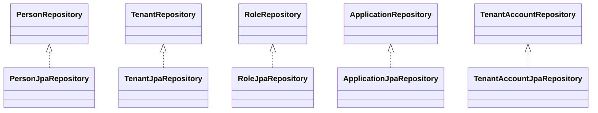
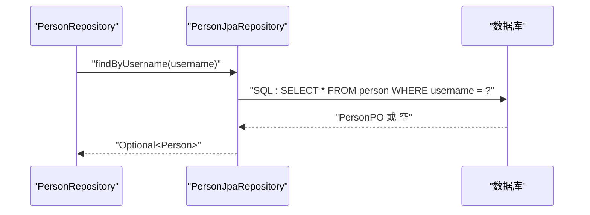
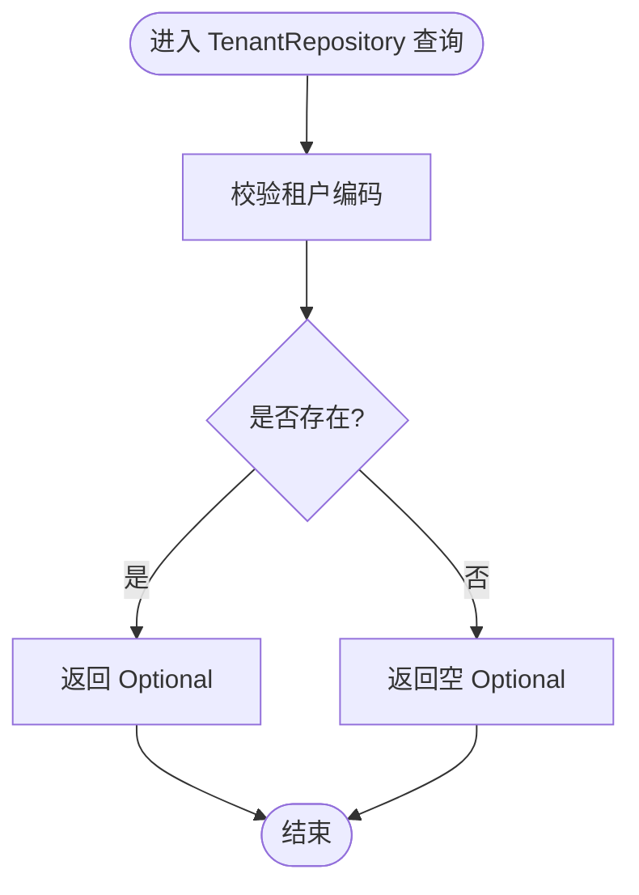
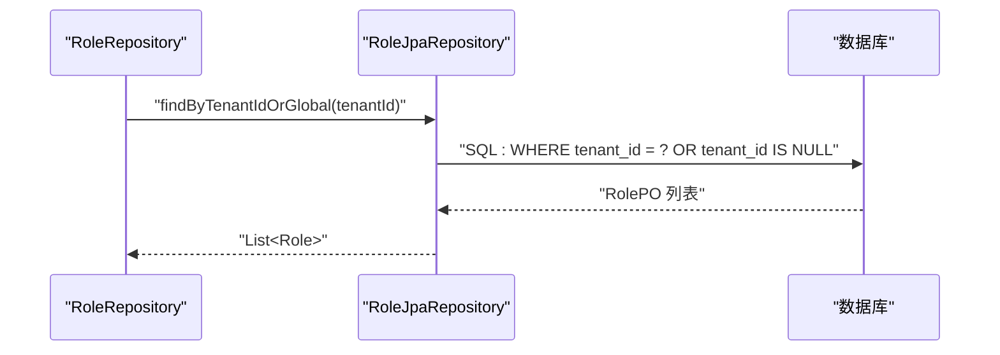
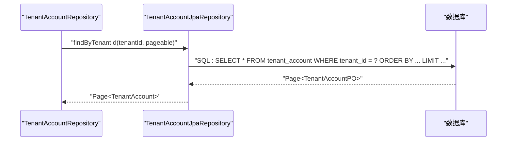

# JPA仓库接口

<cite>
**本文引用的文件**
- [PersonRepository.java](file://iam-auth-server/src/main/java/iam/platform/auth/domain/repository/PersonRepository.java)
- [TenantRepository.java](file://iam-auth-server/src/main/java/iam/platform/auth/domain/repository/TenantRepository.java)
- [RoleRepository.java](file://iam-auth-server/src/main/java/iam/platform/auth/domain/repository/RoleRepository.java)
- [ApplicationRepository.java](file://iam-auth-server/src/main/java/iam/platform/auth/domain/repository/ApplicationRepository.java)
- [TenantAccountRepository.java](file://iam-auth-server/src/main/java/iam/platform/auth/domain/repository/TenantAccountRepository.java)
- [PersonJpaRepository.java](file://iam-auth-server/src/main/java/iam/platform/auth/infrastructure/persistence/repository/PersonJpaRepository.java)
- [TenantJpaRepository.java](file://iam-auth-server/src/main/java/iam/platform/auth/infrastructure/persistence/repository/TenantJpaRepository.java)
- [RoleJpaRepository.java](file://iam-auth-server/src/main/java/iam/platform/auth/infrastructure/persistence/repository/RoleJpaRepository.java)
- [ApplicationJpaRepository.java](file://iam-auth-server/src/main/java/iam/platform/auth/infrastructure/persistence/repository/ApplicationJpaRepository.java)
- [TenantAccountJpaRepository.java](file://iam-auth-server/src/main/java/iam/platform/auth/infrastructure/persistence/repository/TenantAccountJpaRepository.java)
- [Person.java](file://iam-auth-server/src/main/java/iam/platform/auth/domain/model/entity/Person.java)
- [Tenant.java](file://iam-auth-server/src/main/java/iam/platform/auth/domain/model/entity/Tenant.java)
- [Role.java](file://iam-auth-server/src/main/java/iam/platform/auth/domain/model/entity/Role.java)
- [Application.java](file://iam-auth-server/src/main/java/iam/platform/auth/domain/model/entity/Application.java)
- [TenantAccount.java](file://iam-auth-server/src/main/java/iam/platform/auth/domain/model/entity/TenantAccount.java)
</cite>

## 目录
1. [引言](#引言)
2. [项目结构](#项目结构)
3. [核心组件](#核心组件)
4. [架构总览](#架构总览)
5. [详细组件分析](#详细组件分析)
6. [依赖分析](#依赖分析)
7. [性能考虑](#性能考虑)
8. [故障排查指南](#故障排查指南)
9. [结论](#结论)
10. [附录](#附录)

## 引言
本文件系统性梳理认证服务器中基于Spring Data JPA的实体仓库接口设计，重点覆盖PersonRepository、TenantRepository、RoleRepository、ApplicationRepository、TenantAccountRepository等核心接口的定义、方法语义、命名规范、参数与返回类型，并结合对应的JpaRepository实现，阐述Spring Data JPA在该系统中的使用模式（如派生查询、存在性检查、计数查询、分页查询等）。同时给出继承关系、泛型设计与扩展机制的说明，并提供最佳实践与常见问题排查建议。

## 项目结构
认证服务器的仓库层采用“领域接口 + 基于Spring Data JPA的实现”的分层设计：
- 领域仓库接口位于domain/repository包，面向业务用例暴露查询能力
- 实体仓库接口位于infrastructure/persistence/repository包，继承JpaRepository并按需扩展查询方法
- 领域实体位于domain/model/entity包，承载状态与行为

```mermaid
graph TB
subgraph "领域层"
PR["PersonRepository 接口"]
TR["TenantRepository 接口"]
RR["RoleRepository 接口"]
AR["ApplicationRepository 接口"]
TAR["TenantAccountRepository 接口"]
end
subgraph "基础设施层"
PJr["PersonJpaRepository 接口"]
TJr["TenantJpaRepository 接口"]
R Jr["RoleJpaRepository 接口"]
AJr["ApplicationJpaRepository 接口"]
TA Jr["TenantAccountJpaRepository 接口"]
end
PR --> PJr
TR --> TJr
RR --> R Jr
AR --> AJr
TAR --> TA Jr
```

图表来源
- [PersonRepository.java:1-34](file://iam-auth-server/src/main/java/iam/platform/auth/domain/repository/PersonRepository.java#L1-L34)
- [TenantRepository.java:1-27](file://iam-auth-server/src/main/java/iam/platform/auth/domain/repository/TenantRepository.java#L1-L27)
- [RoleRepository.java:1-29](file://iam-auth-server/src/main/java/iam/platform/auth/domain/repository/RoleRepository.java#L1-L29)
- [ApplicationRepository.java:1-25](file://iam-auth-server/src/main/java/iam/platform/auth/domain/repository/ApplicationRepository.java#L1-L25)
- [TenantAccountRepository.java:1-33](file://iam-auth-server/src/main/java/iam/platform/auth/domain/repository/TenantAccountRepository.java#L1-L33)
- [PersonJpaRepository.java:1-25](file://iam-auth-server/src/main/java/iam/platform/auth/infrastructure/persistence/repository/PersonJpaRepository.java#L1-L25)
- [TenantJpaRepository.java:1-15](file://iam-auth-server/src/main/java/iam/platform/auth/infrastructure/persistence/repository/TenantJpaRepository.java#L1-L15)
- [RoleJpaRepository.java:1-22](file://iam-auth-server/src/main/java/iam/platform/auth/infrastructure/persistence/repository/RoleJpaRepository.java#L1-L22)
- [ApplicationJpaRepository.java:1-18](file://iam-auth-server/src/main/java/iam/platform/auth/infrastructure/persistence/repository/ApplicationJpaRepository.java#L1-L18)
- [TenantAccountJpaRepository.java:1-28](file://iam-auth-server/src/main/java/iam/platform/auth/infrastructure/persistence/repository/TenantAccountJpaRepository.java#L1-L28)

章节来源
- [PersonRepository.java:1-34](file://iam-auth-server/src/main/java/iam/platform/auth/domain/repository/PersonRepository.java#L1-L34)
- [TenantRepository.java:1-27](file://iam-auth-server/src/main/java/iam/platform/auth/domain/repository/TenantRepository.java#L1-L27)
- [RoleRepository.java:1-29](file://iam-auth-server/src/main/java/iam/platform/auth/domain/repository/RoleRepository.java#L1-L29)
- [ApplicationRepository.java:1-25](file://iam-auth-server/src/main/java/iam/platform/auth/domain/repository/ApplicationRepository.java#L1-L25)
- [TenantAccountRepository.java:1-33](file://iam-auth-server/src/main/java/iam/platform/auth/domain/repository/TenantAccountRepository.java#L1-L33)
- [PersonJpaRepository.java:1-25](file://iam-auth-server/src/main/java/iam/platform/auth/infrastructure/persistence/repository/PersonJpaRepository.java#L1-L25)
- [TenantJpaRepository.java:1-15](file://iam-auth-server/src/main/java/iam/platform/auth/infrastructure/persistence/repository/TenantJpaRepository.java#L1-L15)
- [RoleJpaRepository.java:1-22](file://iam-auth-server/src/main/java/iam/platform/auth/infrastructure/persistence/repository/RoleJpaRepository.java#L1-L22)
- [ApplicationJpaRepository.java:1-18](file://iam-auth-server/src/main/java/iam/platform/auth/infrastructure/persistence/repository/ApplicationJpaRepository.java#L1-L18)
- [TenantAccountJpaRepository.java:1-28](file://iam-auth-server/src/main/java/iam/platform/auth/infrastructure/persistence/repository/TenantAccountJpaRepository.java#L1-L28)

## 核心组件
本节对各仓库接口进行要点归纳，涵盖查询方法、命名规范、参数与返回类型。

- PersonRepository
  - 保存、按主键查找、按用户名/邮箱/手机号查找、分页查询、存在性检查、删除、计数（启用状态、时间区间）
  - 方法示例路径：[PersonRepository.java:10-33](file://iam-auth-server/src/main/java/iam/platform/auth/domain/repository/PersonRepository.java#L10-L33)

- TenantRepository
  - 保存、按主键查找、按租户编码查找、分页查询、存在性检查、删除、按状态计数、按状态列表查询
  - 方法示例路径：[TenantRepository.java:11-26](file://iam-auth-server/src/main/java/iam/platform/auth/domain/repository/TenantRepository.java#L11-L26)

- RoleRepository
  - 保存、按主键查找、按编码查找、按租户+编码查找、全量/按租户/全局/租户或全局查询、删除、存在性检查
  - 方法示例路径：[RoleRepository.java:9-28](file://iam-auth-server/src/main/java/iam/platform/auth/domain/repository/RoleRepository.java#L9-L28)

- ApplicationRepository
  - 保存、按主键查找、按应用标识查找、按租户查询、全量查询、删除、按租户+状态计数、按状态计数
  - 方法示例路径：[ApplicationRepository.java:9-24](file://iam-auth-server/src/main/java/iam/platform/auth/domain/repository/ApplicationRepository.java#L9-L24)

- TenantAccountRepository
  - 保存、按主键查找、按人员+租户组合查找、按人员/租户查询、按租户分页查询、存在性检查（账户编码/工号）、删除、按租户+状态计数、按状态计数
  - 方法示例路径：[TenantAccountRepository.java:11-32](file://iam-auth-server/src/main/java/iam/platform/auth/domain/repository/TenantAccountRepository.java#L11-L32)

章节来源
- [PersonRepository.java:1-34](file://iam-auth-server/src/main/java/iam/platform/auth/domain/repository/PersonRepository.java#L1-L34)
- [TenantRepository.java:1-27](file://iam-auth-server/src/main/java/iam/platform/auth/domain/repository/TenantRepository.java#L1-L27)
- [RoleRepository.java:1-29](file://iam-auth-server/src/main/java/iam/platform/auth/domain/repository/RoleRepository.java#L1-L29)
- [ApplicationRepository.java:1-25](file://iam-auth-server/src/main/java/iam/platform/auth/domain/repository/ApplicationRepository.java#L1-L25)
- [TenantAccountRepository.java:1-33](file://iam-auth-server/src/main/java/iam/platform/auth/domain/repository/TenantAccountRepository.java#L1-L33)

## 架构总览
下图展示了领域仓库接口与其JPA实现之间的映射关系，体现“领域抽象 + 持久化实现”的分层。



图表来源
- [PersonRepository.java:1-34](file://iam-auth-server/src/main/java/iam/platform/auth/domain/repository/PersonRepository.java#L1-L34)
- [TenantRepository.java:1-27](file://iam-auth-server/src/main/java/iam/platform/auth/domain/repository/TenantRepository.java#L1-L27)
- [RoleRepository.java:1-29](file://iam-auth-server/src/main/java/iam/platform/auth/domain/repository/RoleRepository.java#L1-L29)
- [ApplicationRepository.java:1-25](file://iam-auth-server/src/main/java/iam/platform/auth/domain/repository/ApplicationRepository.java#L1-L25)
- [TenantAccountRepository.java:1-33](file://iam-auth-server/src/main/java/iam/platform/auth/domain/repository/TenantAccountRepository.java#L1-L33)
- [PersonJpaRepository.java:1-25](file://iam-auth-server/src/main/java/iam/platform/auth/infrastructure/persistence/repository/PersonJpaRepository.java#L1-L25)
- [TenantJpaRepository.java:1-15](file://iam-auth-server/src/main/java/iam/platform/auth/infrastructure/persistence/repository/TenantJpaRepository.java#L1-L15)
- [RoleJpaRepository.java:1-22](file://iam-auth-server/src/main/java/iam/platform/auth/infrastructure/persistence/repository/RoleJpaRepository.java#L1-L22)
- [ApplicationJpaRepository.java:1-18](file://iam-auth-server/src/main/java/iam/platform/auth/infrastructure/persistence/repository/ApplicationJpaRepository.java#L1-L18)
- [TenantAccountJpaRepository.java:1-28](file://iam-auth-server/src/main/java/iam/platform/auth/infrastructure/persistence/repository/TenantAccountJpaRepository.java#L1-L28)

## 详细组件分析

### Person 仓库分析
- 查询方法与命名
  - 派生查询：findByUsername、findByEmail、findByPhone
  - 存在性检查：existsByUsername、existsByEmail、existsByPhone
  - 计数查询：countByEnabledTrue、countByCreatedAtBetween
  - 分页查询：findAll(Pageable)
- 参数与返回
  - 字符串参数用于等值匹配；时间范围参数用于时间区间过滤
  - 返回Optional用于存在性安全访问；分页返回Page<Person>
- 扩展机制
  - 可通过新增派生方法满足更多筛选条件；必要时可引入@Query实现复杂条件



图表来源
- [PersonRepository.java:14-14](file://iam-auth-server/src/main/java/iam/platform/auth/domain/repository/PersonRepository.java#L14-L14)
- [PersonJpaRepository.java:9-9](file://iam-auth-server/src/main/java/iam/platform/auth/infrastructure/persistence/repository/PersonJpaRepository.java#L9-L9)

章节来源
- [PersonRepository.java:1-34](file://iam-auth-server/src/main/java/iam/platform/auth/domain/repository/PersonRepository.java#L1-L34)
- [PersonJpaRepository.java:1-25](file://iam-auth-server/src/main/java/iam/platform/auth/infrastructure/persistence/repository/PersonJpaRepository.java#L1-L25)

### Tenant 仓库分析
- 查询方法与命名
  - findByTenantCode、existsByTenantCode、countByStatus、分页与列表查询
- 参数与返回
  - 租户编码作为唯一标识；状态枚举作为过滤条件
  - 返回Optional、boolean、long、List<Tenant>



图表来源
- [TenantRepository.java:15-15](file://iam-auth-server/src/main/java/iam/platform/auth/domain/repository/TenantRepository.java#L15-L15)
- [TenantJpaRepository.java:9-9](file://iam-auth-server/src/main/java/iam/platform/auth/infrastructure/persistence/repository/TenantJpaRepository.java#L9-L9)

章节来源
- [TenantRepository.java:1-27](file://iam-auth-server/src/main/java/iam/platform/auth/domain/repository/TenantRepository.java#L1-L27)
- [TenantJpaRepository.java:1-15](file://iam-auth-server/src/main/java/iam/platform/auth/infrastructure/persistence/repository/TenantJpaRepository.java#L1-L15)

### Role 仓库分析
- 查询方法与命名
  - findByCode、findByTenantId、findGlobalRoles（通过租户ID为空表达）、findByTenantIdOrGlobal
  - existsByTenantIdAndCode、countByTenantIdAndStatus、countByStatus
- 参数与返回
  - 全局角色通过tenantId为null表达；租户或全局查询通过OR条件实现
  - 返回Optional、List、boolean、long



图表来源
- [RoleRepository.java:23-23](file://iam-auth-server/src/main/java/iam/platform/auth/domain/repository/RoleRepository.java#L23-L23)
- [RoleJpaRepository.java:16-16](file://iam-auth-server/src/main/java/iam/platform/auth/infrastructure/persistence/repository/RoleJpaRepository.java#L16-L16)

章节来源
- [RoleRepository.java:1-29](file://iam-auth-server/src/main/java/iam/platform/auth/domain/repository/RoleRepository.java#L1-L29)
- [RoleJpaRepository.java:1-22](file://iam-auth-server/src/main/java/iam/platform/auth/infrastructure/persistence/repository/RoleJpaRepository.java#L1-L22)

### Application 仓库分析
- 查询方法与命名
  - findByAppId、findByTenantId、countByTenantIdAndStatus、countByStatus
- 参数与返回
  - 应用ID唯一；支持按租户过滤与状态计数

章节来源
- [ApplicationRepository.java:1-25](file://iam-auth-server/src/main/java/iam/platform/auth/domain/repository/ApplicationRepository.java#L1-L25)
- [ApplicationJpaRepository.java:1-18](file://iam-auth-server/src/main/java/iam/platform/auth/infrastructure/persistence/repository/ApplicationJpaRepository.java#L1-L18)

### TenantAccount 仓库分析
- 查询方法与命名
  - findByPersonIdAndTenantId、findByPersonId、findByTenantId、findByTenantId(Pageable)
  - existsByTenantIdAndAccountCode、existsByTenantIdAndEmployeeNo
  - countByTenantIdAndStatus、countByStatus
- 参数与返回
  - 支持组合键查询与分页；存在性检查覆盖账户编码与工号



图表来源
- [TenantAccountRepository.java:21-21](file://iam-auth-server/src/main/java/iam/platform/auth/domain/repository/TenantAccountRepository.java#L21-L21)
- [TenantAccountJpaRepository.java:18-18](file://iam-auth-server/src/main/java/iam/platform/auth/infrastructure/persistence/repository/TenantAccountJpaRepository.java#L18-L18)

章节来源
- [TenantAccountRepository.java:1-33](file://iam-auth-server/src/main/java/iam/platform/auth/domain/repository/TenantAccountRepository.java#L1-L33)
- [TenantAccountJpaRepository.java:1-28](file://iam-auth-server/src/main/java/iam/platform/auth/infrastructure/persistence/repository/TenantAccountJpaRepository.java#L1-L28)

## 依赖分析
- 继承关系
  - 各领域仓库接口均被对应JpaRepository实现类继承，遵循Spring Data JPA约定
- 泛型设计
  - JpaRepository<Entity, ID> 中Entity为持久化对象（如PersonPO），ID为Long主键
- 扩展机制
  - 在JpaRepository上新增方法即可扩展查询；若需复杂条件，可在实现类中使用@Query注解
- 外部依赖
  - 使用Spring Data JPA提供的派生查询解析器与分页器；计数查询自动由JPQL生成

```mermaid
graph LR
PR["PersonRepository"] --> PJr["PersonJpaRepository"]
TR["TenantRepository"] --> TJr["TenantJpaRepository"]
RR["RoleRepository"] --> R Jr["RoleJpaRepository"]
AR["ApplicationRepository"] --> AJr["ApplicationJpaRepository"]
TAR["TenantAccountRepository"] --> TA Jr["TenantAccountJpaRepository"]
```

图表来源
- [PersonRepository.java:1-34](file://iam-auth-server/src/main/java/iam/platform/auth/domain/repository/PersonRepository.java#L1-L34)
- [TenantRepository.java:1-27](file://iam-auth-server/src/main/java/iam/platform/auth/domain/repository/TenantRepository.java#L1-L27)
- [RoleRepository.java:1-29](file://iam-auth-server/src/main/java/iam/platform/auth/domain/repository/RoleRepository.java#L1-L29)
- [ApplicationRepository.java:1-25](file://iam-auth-server/src/main/java/iam/platform/auth/domain/repository/ApplicationRepository.java#L1-L25)
- [TenantAccountRepository.java:1-33](file://iam-auth-server/src/main/java/iam/platform/auth/domain/repository/TenantAccountRepository.java#L1-L33)
- [PersonJpaRepository.java:1-25](file://iam-auth-server/src/main/java/iam/platform/auth/infrastructure/persistence/repository/PersonJpaRepository.java#L1-L25)
- [TenantJpaRepository.java:1-15](file://iam-auth-server/src/main/java/iam/platform/auth/infrastructure/persistence/repository/TenantJpaRepository.java#L1-L15)
- [RoleJpaRepository.java:1-22](file://iam-auth-server/src/main/java/iam/platform/auth/infrastructure/persistence/repository/RoleJpaRepository.java#L1-L22)
- [ApplicationJpaRepository.java:1-18](file://iam-auth-server/src/main/java/iam/platform/auth/infrastructure/persistence/repository/ApplicationJpaRepository.java#L1-L18)
- [TenantAccountJpaRepository.java:1-28](file://iam-auth-server/src/main/java/iam/platform/auth/infrastructure/persistence/repository/TenantAccountJpaRepository.java#L1-L28)

## 性能考虑
- 使用派生查询时优先选择等值匹配字段（如编码、ID）以利用索引
- 分页查询务必传入Pageable，避免一次性加载大量数据
- 对高频统计查询（如countByStatus）建议在数据库层面建立合适索引
- 复杂条件查询可考虑使用@Query并结合原生SQL或优化的JPQL，减少不必要的连接
- 对存在性检查（exists*）优先使用布尔返回，避免加载完整实体

## 故障排查指南
- 查询未命中
  - 检查字段大小写与特殊字符；确认是否使用了正确的派生方法命名
- 分页异常
  - 确认Pageable参数是否正确设置排序与页码；避免超大页码
- 计数不准确
  - 核对状态枚举值与数据库存储值一致性；确保索引覆盖
- 存在性检查误判
  - 检查空值处理与默认值；确认数据库约束与查询条件

## 结论
该认证服务器的JPA仓库接口设计遵循“领域抽象 + Spring Data JPA实现”的清晰分层，通过派生查询、存在性检查与计数查询满足典型业务场景。对于更复杂的查询需求，可在JpaRepository实现类中引入@Query注解进行增强。整体设计具备良好的可维护性与扩展性。

## 附录
- 最佳实践清单
  - 命名规范：使用findByXxx、existsByXxx、countByXxx等派生查询前缀
  - 参数传递：优先使用基本类型与字符串；日期范围使用LocalDateTime
  - 结果处理：存在性使用Optional；列表使用List；大数据量使用Page
  - 性能优化：为常用过滤字段建立索引；合理使用分页与投影
  - 复杂查询：必要时使用@Query，注意SQL注入防护与参数绑定