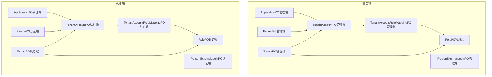
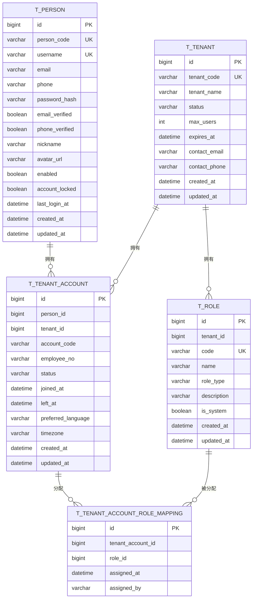
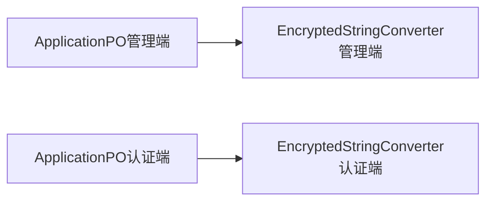

# 实体映射

<cite>
**本文引用的文件**
- [PersonPO（管理端）](file://iam-admin-server/src/main/java/iam/platform/admin/infrastructure/persistence/entity/PersonPO.java)
- [TenantPO（管理端）](file://iam-admin-server/src/main/java/iam/platform/admin/infrastructure/persistence/entity/TenantPO.java)
- [RolePO（管理端）](file://iam-admin-server/src/main/java/iam/platform/admin/infrastructure/persistence/entity/RolePO.java)
- [TenantAccountPO（管理端）](file://iam-admin-server/src/main/java/iam/platform/admin/infrastructure/persistence/entity/TenantAccountPO.java)
- [TenantAccountRoleMappingPO（管理端）](file://iam-admin-server/src/main/java/iam/platform/admin/infrastructure/persistence/entity/TenantAccountRoleMappingPO.java)
- [ApplicationPO（管理端）](file://iam-admin-server/src/main/java/iam/platform/admin/infrastructure/persistence/entity/ApplicationPO.java)
- [PersonExternalLoginPO（管理端）](file://iam-admin-server/src/main/java/iam/platform/admin/infrastructure/persistence/entity/PersonExternalLoginPO.java)
- [EncryptedStringConverter（管理端）](file://iam-admin-server/src/main/java/iam/platform/admin/infrastructure/persistence/converter/EncryptedStringConverter.java)
- [PersonPO（认证端）](file://iam-auth-server/src/main/java/iam/platform/auth/infrastructure/persistence/entity/PersonPO.java)
- [TenantPO（认证端）](file://iam-auth-server/src/main/java/iam/platform/auth/infrastructure/persistence/entity/TenantPO.java)
- [RolePO（认证端）](file://iam-auth-server/src/main/java/iam/platform/auth/infrastructure/persistence/entity/RolePO.java)
- [TenantAccountPO（认证端）](file://iam-auth-server/src/main/java/iam/platform/auth/infrastructure/persistence/entity/TenantAccountPO.java)
- [TenantAccountRoleMappingPO（认证端）](file://iam-auth-server/src/main/java/iam/platform/auth/infrastructure/persistence/entity/TenantAccountRoleMappingPO.java)
- [ApplicationPO（认证端）](file://iam-auth-server/src/main/java/iam/platform/auth/infrastructure/persistence/entity/ApplicationPO.java)
- [PersonExternalLoginPO（认证端）](file://iam-auth-server/src/main/java/iam/platform/auth/infrastructure/persistence/entity/PersonExternalLoginPO.java)
- [EncryptedStringConverter（认证端）](file://iam-auth-server/src/main/java/iam/platform/auth/infrastructure/persistence/converter/EncryptedStringConverter.java)
</cite>

## 目录
1. [简介](#简介)
2. [项目结构](#项目结构)
3. [核心组件](#核心组件)
4. [架构总览](#架构总览)
5. [详细组件分析](#详细组件分析)
6. [依赖分析](#依赖分析)
7. [性能考虑](#性能考虑)
8. [故障排查指南](#故障排查指南)
9. [结论](#结论)
10. [附录](#附录)

## 简介
本文件聚焦于认证服务器中各类实体的 JPA 持久化对象（PO）映射设计，系统梳理 PersonPO、TenantPO、RolePO、TenantAccountPO、TenantAccountRoleMappingPO、ApplicationPO、PersonExternalLoginPO 等核心实体的注解使用、字段映射、约束定义与关系建模，并结合加密转换器的应用场景，给出实体设计最佳实践与性能优化建议。

## 项目结构
- 认证服务器与管理服务器均在各自模块内提供相同的实体映射类，用于支撑各自的业务域与数据模型。
- 实体统一采用 JPA 注解进行表结构与字段约束定义，部分敏感字段通过自定义 AttributeConverter 进行加解密存储。

图表来源
- [PersonPO（管理端）:17-96](file://iam-admin-server/src/main/java/iam/platform/admin/infrastructure/persistence/entity/PersonPO.java#L17-L96)
- [TenantPO（管理端）:17-71](file://iam-admin-server/src/main/java/iam/platform/admin/infrastructure/persistence/entity/TenantPO.java#L17-L71)
- [RolePO（管理端）:20-80](file://iam-admin-server/src/main/java/iam/platform/admin/infrastructure/persistence/entity/RolePO.java#L20-L80)
- [TenantAccountPO（管理端）:17-81](file://iam-admin-server/src/main/java/iam/platform/admin/infrastructure/persistence/entity/TenantAccountPO.java#L17-L81)
- [TenantAccountRoleMappingPO（管理端）:15-47](file://iam-admin-server/src/main/java/iam/platform/admin/infrastructure/persistence/entity/TenantAccountRoleMappingPO.java#L15-L47)
- [ApplicationPO（管理端）:19-117](file://iam-admin-server/src/main/java/iam/platform/admin/infrastructure/persistence/entity/ApplicationPO.java#L19-L117)
- [PersonExternalLoginPO（管理端）:17-71](file://iam-admin-server/src/main/java/iam/platform/admin/infrastructure/persistence/entity/PersonExternalLoginPO.java#L17-L71)
- [PersonPO（认证端）:17-96](file://iam-auth-server/src/main/java/iam/platform/auth/infrastructure/persistence/entity/PersonPO.java#L17-L96)
- [TenantPO（认证端）:17-71](file://iam-auth-server/src/main/java/iam/platform/auth/infrastructure/persistence/entity/TenantPO.java#L17-L71)
- [RolePO（认证端）:20-80](file://iam-auth-server/src/main/java/iam/platform/auth/infrastructure/persistence/entity/RolePO.java#L20-L80)
- [TenantAccountPO（认证端）:17-81](file://iam-auth-server/src/main/java/iam/platform/auth/infrastructure/persistence/entity/TenantAccountPO.java#L17-L81)
- [TenantAccountRoleMappingPO（认证端）:15-47](file://iam-auth-server/src/main/java/iam/platform/auth/infrastructure/persistence/entity/TenantAccountRoleMappingPO.java#L15-L47)
- [ApplicationPO（认证端）:19-117](file://iam-auth-server/src/main/java/iam/platform/auth/infrastructure/persistence/entity/ApplicationPO.java#L19-L117)
- [PersonExternalLoginPO（认证端）:17-71](file://iam-auth-server/src/main/java/iam/platform/auth/infrastructure/persistence/entity/PersonExternalLoginPO.java#L17-L71)

章节来源
- [PersonPO（管理端）:17-96](file://iam-admin-server/src/main/java/iam/platform/admin/infrastructure/persistence/entity/PersonPO.java#L17-L96)
- [TenantPO（管理端）:17-71](file://iam-admin-server/src/main/java/iam/platform/admin/infrastructure/persistence/entity/TenantPO.java#L17-L71)
- [RolePO（管理端）:20-80](file://iam-admin-server/src/main/java/iam/platform/admin/infrastructure/persistence/entity/RolePO.java#L20-L80)
- [TenantAccountPO（管理端）:17-81](file://iam-admin-server/src/main/java/iam/platform/admin/infrastructure/persistence/entity/TenantAccountPO.java#L17-L81)
- [TenantAccountRoleMappingPO（管理端）:15-47](file://iam-admin-server/src/main/java/iam/platform/admin/infrastructure/persistence/entity/TenantAccountRoleMappingPO.java#L15-L47)
- [ApplicationPO（管理端）:19-117](file://iam-admin-server/src/main/java/iam/platform/admin/infrastructure/persistence/entity/ApplicationPO.java#L19-L117)
- [PersonExternalLoginPO（管理端）:17-71](file://iam-admin-server/src/main/java/iam/platform/admin/infrastructure/persistence/entity/PersonExternalLoginPO.java#L17-L71)
- [PersonPO（认证端）:17-96](file://iam-auth-server/src/main/java/iam/platform/auth/infrastructure/persistence/entity/PersonPO.java#L17-L96)
- [TenantPO（认证端）:17-71](file://iam-auth-server/src/main/java/iam/platform/auth/infrastructure/persistence/entity/TenantPO.java#L17-L71)
- [RolePO（认证端）:20-80](file://iam-auth-server/src/main/java/iam/platform/auth/infrastructure/persistence/entity/RolePO.java#L20-L80)
- [TenantAccountPO（认证端）:17-81](file://iam-auth-server/src/main/java/iam/platform/auth/infrastructure/persistence/entity/TenantAccountPO.java#L17-L81)
- [TenantAccountRoleMappingPO（认证端）:15-47](file://iam-auth-server/src/main/java/iam/platform/auth/infrastructure/persistence/entity/TenantAccountRoleMappingPO.java#L15-L47)
- [ApplicationPO（认证端）:19-117](file://iam-auth-server/src/main/java/iam/platform/auth/infrastructure/persistence/entity/ApplicationPO.java#L19-L117)
- [PersonExternalLoginPO（认证端）:17-71](file://iam-auth-server/src/main/java/iam/platform/auth/infrastructure/persistence/entity/PersonExternalLoginPO.java#L17-L71)

## 核心组件
本节从注解与字段映射角度，逐项解析各实体的关键设计要点：

- @Entity、@Table
  - 所有实体均以 @Entity 标识为 JPA 实体，并通过 @Table 指定数据库表名，确保与业务表结构一致。
- @Id、@GeneratedValue
  - 主键统一使用自增策略（GenerationType.IDENTITY），简化主键生成与迁移成本。
- @Column
  - 字段映射严格设置长度、是否可空、是否唯一、默认值等，保障数据一致性与查询效率。
- 时间戳字段
  - 使用 @CreationTimestamp 与 @UpdateTimestamp 或 @PrePersist/@PreUpdate 控制创建与更新时间，避免手工维护。
- 枚举映射
  - RolePO 中使用 @Enumerated(EnumType.STRING) 将枚举持久化为字符串，便于跨库迁移与审计。
- 加密转换
  - ApplicationPO 的敏感字段通过 @Convert(converter = ...) 应用 AttributeConverter，实现透明加解密存储。

章节来源
- [PersonPO（管理端）:17-96](file://iam-admin-server/src/main/java/iam/platform/admin/infrastructure/persistence/entity/PersonPO.java#L17-L96)
- [TenantPO（管理端）:17-71](file://iam-admin-server/src/main/java/iam/platform/admin/infrastructure/persistence/entity/TenantPO.java#L17-L71)
- [RolePO（管理端）:20-80](file://iam-admin-server/src/main/java/iam/platform/admin/infrastructure/persistence/entity/RolePO.java#L20-L80)
- [ApplicationPO（管理端）:19-117](file://iam-admin-server/src/main/java/iam/platform/admin/infrastructure/persistence/entity/ApplicationPO.java#L19-L117)
- [EncryptedStringConverter（管理端）:15-108](file://iam-admin-server/src/main/java/iam/platform/admin/infrastructure/persistence/converter/EncryptedStringConverter.java#L15-L108)
- [PersonPO（认证端）:17-96](file://iam-auth-server/src/main/java/iam/platform/auth/infrastructure/persistence/entity/PersonPO.java#L17-L96)
- [TenantPO（认证端）:17-71](file://iam-auth-server/src/main/java/iam/platform/auth/infrastructure/persistence/entity/TenantPO.java#L17-L71)
- [RolePO（认证端）:20-80](file://iam-auth-server/src/main/java/iam/platform/auth/infrastructure/persistence/entity/RolePO.java#L20-L80)
- [ApplicationPO（认证端）:19-117](file://iam-auth-server/src/main/java/iam/platform/auth/infrastructure/persistence/entity/ApplicationPO.java#L19-L117)
- [EncryptedStringConverter（认证端）:15-108](file://iam-auth-server/src/main/java/iam/platform/auth/infrastructure/persistence/converter/EncryptedStringConverter.java#L15-L108)

## 架构总览
下图展示认证服务器中实体之间的典型关系：Person 与 TenantAccount 为一对多；Tenant 与 TenantAccount、Role 为一对多；TenantAccount 与 Role 通过中间表映射为多对多。

图表来源
- [PersonPO（管理端）:23-84](file://iam-admin-server/src/main/java/iam/platform/admin/infrastructure/persistence/entity/PersonPO.java#L23-L84)
- [TenantPO（管理端）:23-64](file://iam-admin-server/src/main/java/iam/platform/admin/infrastructure/persistence/entity/TenantPO.java#L23-L64)
- [RolePO（管理端）:26-61](file://iam-admin-server/src/main/java/iam/platform/admin/infrastructure/persistence/entity/RolePO.java#L26-L61)
- [TenantAccountPO（管理端）:23-72](file://iam-admin-server/src/main/java/iam/platform/admin/infrastructure/persistence/entity/TenantAccountPO.java#L23-L72)
- [TenantAccountRoleMappingPO（管理端）:21-40](file://iam-admin-server/src/main/java/iam/platform/admin/infrastructure/persistence/entity/TenantAccountRoleMappingPO.java#L21-L40)
- [PersonPO（认证端）:23-84](file://iam-auth-server/src/main/java/iam/platform/auth/infrastructure/persistence/entity/PersonPO.java#L23-L84)
- [TenantPO（认证端）:23-64](file://iam-auth-server/src/main/java/iam/platform/auth/infrastructure/persistence/entity/TenantPO.java#L23-L64)
- [RolePO（认证端）:26-61](file://iam-auth-server/src/main/java/iam/platform/auth/infrastructure/persistence/entity/RolePO.java#L26-L61)
- [TenantAccountPO（认证端）:23-72](file://iam-auth-server/src/main/java/iam/platform/auth/infrastructure/persistence/entity/TenantAccountPO.java#L23-L72)
- [TenantAccountRoleMappingPO（认证端）:21-40](file://iam-auth-server/src/main/java/iam/platform/auth/infrastructure/persistence/entity/TenantAccountRoleMappingPO.java#L21-L40)

## 详细组件分析

### PersonPO（人员）
- 设计要点
  - 主键自增，唯一标识人员。
  - personCode、username 设置唯一与长度限制，确保全局唯一性与校验。
  - 密码字段使用固定长度存储，支持安全哈希。
  - 账号启用状态与锁定状态布尔字段，便于快速筛选与控制。
  - 时间戳字段自动维护，减少手工写入。
- 关系映射
  - 与 TenantAccount 为一对多（一个人员可加入多个租户）。
- 复杂度与性能
  - 唯一索引字段（personCode、username）支持高效查找。
  - 建议在高频查询字段上建立合适索引（如 lastLoginAt）。

章节来源
- [PersonPO（管理端）:17-96](file://iam-admin-server/src/main/java/iam/platform/admin/infrastructure/persistence/entity/PersonPO.java#L17-L96)
- [PersonPO（认证端）:17-96](file://iam-auth-server/src/main/java/iam/platform/auth/infrastructure/persistence/entity/PersonPO.java#L17-L96)

### TenantPO（租户）
- 设计要点
  - 租户编码与名称唯一且有限长度，便于检索与展示。
  - 状态、最大用户数、过期时间等字段用于租户生命周期管理。
  - 联系信息字段支持租户运营与通知。
- 关系映射
  - 与 TenantAccount、Role 为一对多。
- 复杂度与性能
  - 唯一索引（tenantCode）提升匹配效率。
  - 过期时间字段可用于定时清理或状态变更。

章节来源
- [TenantPO（管理端）:17-71](file://iam-admin-server/src/main/java/iam/platform/admin/infrastructure/persistence/entity/TenantPO.java#L17-L71)
- [TenantPO（认证端）:17-71](file://iam-auth-server/src/main/java/iam/platform/auth/infrastructure/persistence/entity/TenantPO.java#L17-L71)

### RolePO（角色）
- 设计要点
  - 角色编码唯一，区分系统内置与租户自定义角色。
  - 枚举字段以字符串形式存储，便于跨环境迁移。
  - 系统标记与描述字段支持权限治理与审计。
- 关系映射
  - 与 Tenant 为一对多；与 TenantAccountRoleMapping 为多对多。
- 复杂度与性能
  - 角色编码唯一索引支持快速定位。
  - 枚举字符串存储降低转换成本。

章节来源
- [RolePO（管理端）:20-80](file://iam-admin-server/src/main/java/iam/platform/admin/infrastructure/persistence/entity/RolePO.java#L20-L80)
- [RolePO（认证端）:20-80](file://iam-auth-server/src/main/java/iam/platform/auth/infrastructure/persistence/entity/RolePO.java#L20-L80)

### TenantAccountPO（租户账号）
- 设计要点
  - 关联人员与租户，形成“人员-租户”绑定关系。
  - 账号状态、入职/离职时间、语言与时区等字段支持多租户个性化。
- 关系映射
  - 与 Person、Tenant 为多对一；与 TenantAccountRoleMapping 为一对多。
- 复杂度与性能
  - 复合状态字段（status、joinedAt）便于范围查询。
  - 建议在 personId、tenantId 上建立索引以优化关联查询。

章节来源
- [TenantAccountPO（管理端）:17-81](file://iam-admin-server/src/main/java/iam/platform/admin/infrastructure/persistence/entity/TenantAccountPO.java#L17-L81)
- [TenantAccountPO（认证端）:17-81](file://iam-auth-server/src/main/java/iam/platform/auth/infrastructure/persistence/entity/TenantAccountPO.java#L17-L81)

### TenantAccountRoleMappingPO（角色映射）
- 设计要点
  - 记录租户账号被授予角色的时间与经办人，便于审计。
- 关系映射
  - 与 TenantAccount、Role 为多对多中间表。
- 复杂度与性能
  - 映射表主键自增，外键字段建立索引可提升联结效率。

章节来源
- [TenantAccountRoleMappingPO（管理端）:15-47](file://iam-admin-server/src/main/java/iam/platform/admin/infrastructure/persistence/entity/TenantAccountRoleMappingPO.java#L15-L47)
- [TenantAccountRoleMappingPO（认证端）:15-47](file://iam-auth-server/src/main/java/iam/platform/auth/infrastructure/persistence/entity/TenantAccountRoleMappingPO.java#L15-L47)

### ApplicationPO（应用）
- 设计要点
  - 应用 ID 唯一，应用密钥通过 AttributeConverter 加密存储。
  - 回调地址、作用域、令牌有效期等字段支持协议适配。
  - 创建与更新时间由预处理器统一维护。
- 关系映射
  - 与 Tenant 为多对一；与 TenantAccount 为多对一（通过授权流程）。
- 复杂度与性能
  - 密钥字段加密存储，兼顾安全性与查询性能。
  - 长文本字段（回调、作用域）建议分表或拆分存储以优化读取。

章节来源
- [ApplicationPO（管理端）:19-117](file://iam-admin-server/src/main/java/iam/platform/admin/infrastructure/persistence/entity/ApplicationPO.java#L19-L117)
- [ApplicationPO（认证端）:19-117](file://iam-auth-server/src/main/java/iam/platform/auth/infrastructure/persistence/entity/ApplicationPO.java#L19-L117)
- [EncryptedStringConverter（管理端）:15-108](file://iam-admin-server/src/main/java/iam/platform/admin/infrastructure/persistence/converter/EncryptedStringConverter.java#L15-L108)
- [EncryptedStringConverter（认证端）:15-108](file://iam-auth-server/src/main/java/iam/platform/auth/infrastructure/persistence/converter/EncryptedStringConverter.java#L15-L108)

### PersonExternalLoginPO（外部登录）
- 设计要点
  - 记录第三方登录提供商、用户 ID 与令牌信息，支持过期与使用时间追踪。
- 关系映射
  - 与 Person 为多对一。
- 复杂度与性能
  - 令牌字段使用 TEXT 定义，满足长文本存储需求。
  - 建议对 provider、provider_user_id 建立组合索引以加速查找。

章节来源
- [PersonExternalLoginPO（管理端）:17-71](file://iam-admin-server/src/main/java/iam/platform/admin/infrastructure/persistence/entity/PersonExternalLoginPO.java#L17-L71)
- [PersonExternalLoginPO（认证端）:17-71](file://iam-auth-server/src/main/java/iam/platform/auth/infrastructure/persistence/entity/PersonExternalLoginPO.java#L17-L71)

### 关系建模与注解使用
- 一对一/一对多/多对多
  - 通过外键字段（如 tenantId、personId、roleId、tenantAccountId）实现关系建模。
  - 多对多通过中间表（TenantAccountRoleMappingPO）消除冗余与数据不一致。
- 级联与更新
  - 当前实体未显式声明级联，遵循“按需级联、谨慎使用”的原则，避免意外删除或更新。
- 复合索引与唯一约束
  - 唯一字段（personCode、username、tenantCode、code）通过 @Column(unique=true) 声明。
  - 建议在高频过滤字段上补充复合索引（如 tenantId+status、personId+tenantId）。

章节来源
- [TenantAccountPO（管理端）:29-34](file://iam-admin-server/src/main/java/iam/platform/admin/infrastructure/persistence/entity/TenantAccountPO.java#L29-L34)
- [RolePO（管理端）:31-36](file://iam-admin-server/src/main/java/iam/platform/admin/infrastructure/persistence/entity/RolePO.java#L31-L36)
- [TenantAccountRoleMappingPO（管理端）:27-32](file://iam-admin-server/src/main/java/iam/platform/admin/infrastructure/persistence/entity/TenantAccountRoleMappingPO.java#L27-L32)
- [PersonExternalLoginPO（管理端）:29-38](file://iam-admin-server/src/main/java/iam/platform/admin/infrastructure/persistence/entity/PersonExternalLoginPO.java#L29-L38)

## 依赖分析
- 同步性
  - 管理端与认证端的实体映射类结构保持一致，确保跨模块数据一致性。
- 转换器依赖
  - ApplicationPO 依赖 EncryptedStringConverter 对敏感字段进行加解密，转换器在构造时根据密钥有效性决定是否启用加密。
- 时间戳依赖
  - 通过注解或预处理器统一维护创建与更新时间，避免业务层重复逻辑。

图表来源
- [ApplicationPO（管理端）:35-37](file://iam-admin-server/src/main/java/iam/platform/admin/infrastructure/persistence/entity/ApplicationPO.java#L35-L37)
- [EncryptedStringConverter（管理端）:28-41](file://iam-admin-server/src/main/java/iam/platform/admin/infrastructure/persistence/converter/EncryptedStringConverter.java#L28-L41)
- [ApplicationPO（认证端）:35-37](file://iam-auth-server/src/main/java/iam/platform/auth/infrastructure/persistence/entity/ApplicationPO.java#L35-L37)
- [EncryptedStringConverter（认证端）:28-41](file://iam-auth-server/src/main/java/iam/platform/auth/infrastructure/persistence/converter/EncryptedStringConverter.java#L28-L41)

章节来源
- [EncryptedStringConverter（管理端）:15-108](file://iam-admin-server/src/main/java/iam/platform/admin/infrastructure/persistence/converter/EncryptedStringConverter.java#L15-L108)
- [EncryptedStringConverter（认证端）:15-108](file://iam-auth-server/src/main/java/iam/platform/auth/infrastructure/persistence/converter/EncryptedStringConverter.java#L15-L108)

## 性能考虑
- 索引策略
  - 在唯一字段（personCode、username、tenantCode、code）上建立唯一索引。
  - 在高频过滤字段（tenantId、personId、roleId、status、joinedAt）上建立单列或复合索引。
- 查询设计
  - 避免 SELECT *，仅选择必要字段；对大字段（如回调地址、作用域）按需加载。
  - 使用分页查询与延迟加载，减少一次性载荷。
- 缓存与归档
  - 对热点数据（如租户配置、角色列表）引入缓存；对历史审计数据进行归档。
- 加密开销
  - 加密转换器在入库时执行，建议批量入库时复用 Cipher 实例以降低开销。

## 故障排查指南
- 唯一约束冲突
  - 现象：插入失败，提示唯一约束冲突。
  - 排查：检查 personCode、username、tenantCode、code 是否重复；确认业务层去重逻辑。
- 密钥配置错误
  - 现象：应用启动时报错或密钥无效警告。
  - 排查：核对加密密钥长度与格式；确认配置项正确加载。
- 时间戳异常
  - 现象：创建/更新时间为空或异常。
  - 排查：确认注解使用正确；检查预处理器是否生效。
- 外键关联异常
  - 现象：关联查询结果为空或报外键约束错误。
  - 排查：确认外键字段值存在且有效；检查中间表映射是否正确。

章节来源
- [EncryptedStringConverter（管理端）:33-40](file://iam-admin-server/src/main/java/iam/platform/admin/infrastructure/persistence/converter/EncryptedStringConverter.java#L33-L40)
- [EncryptedStringConverter（认证端）:33-40](file://iam-auth-server/src/main/java/iam/platform/auth/infrastructure/persistence/converter/EncryptedStringConverter.java#L33-L40)

## 结论
本实体映射设计以简洁、清晰与可扩展为核心目标：通过统一的注解规范与字段约束，确保数据完整性；通过加密转换器与时间戳自动化，提升安全性与可维护性；通过中间表实现多对多关系，平衡查询与一致性。建议在生产环境中结合业务查询模式持续优化索引与缓存策略，并严格控制级联范围以避免意外影响。

## 附录
- 最佳实践清单
  - 明确唯一字段并建立唯一索引。
  - 在高频过滤字段上建立单列或复合索引。
  - 对大字段采用延迟加载或分表策略。
  - 使用注解或预处理器统一维护时间戳。
  - 对敏感字段采用透明加密存储。
  - 严格控制级联范围，按需开启。
  - 定期审查索引使用情况与查询计划。