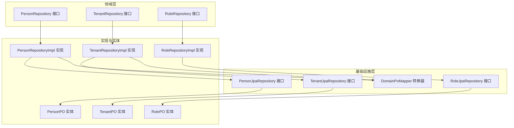
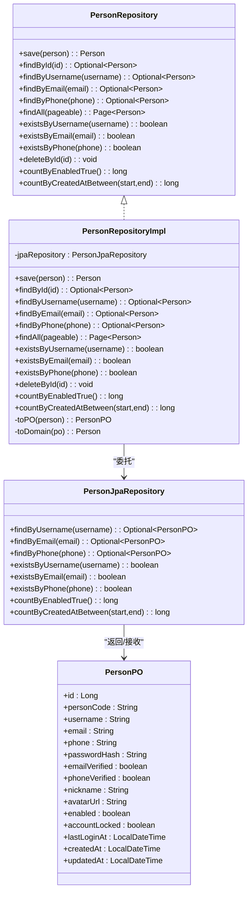
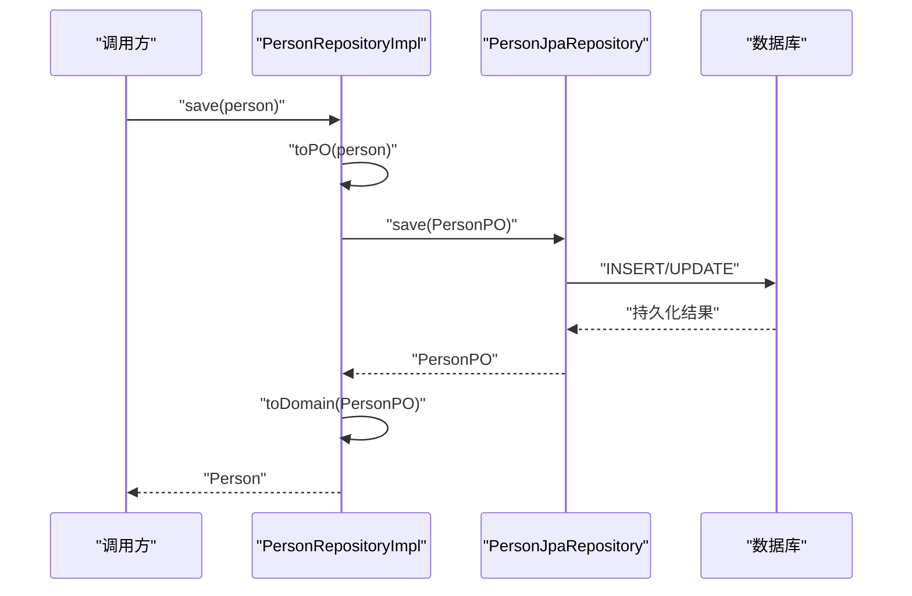
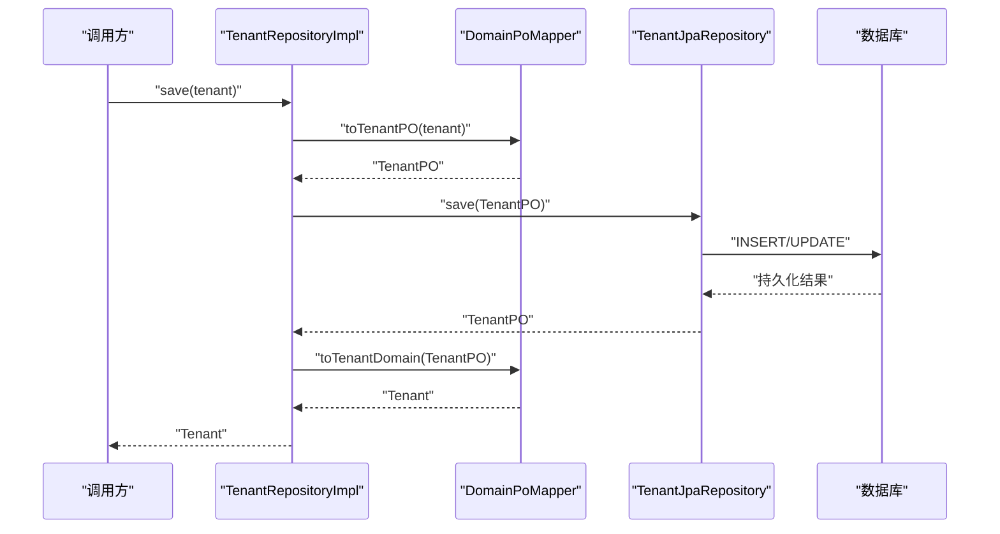
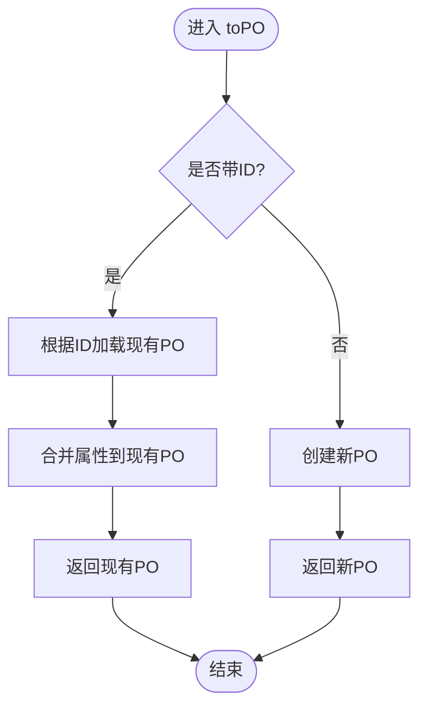
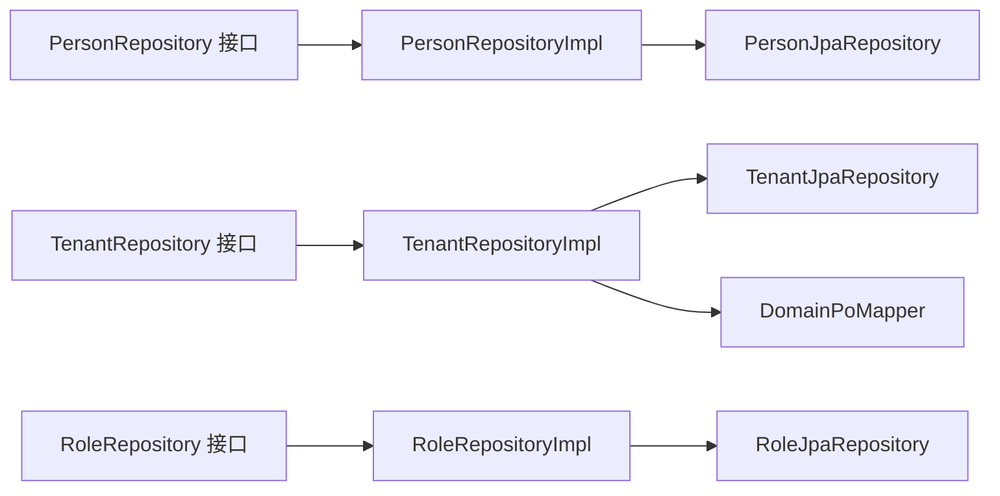

# 持久化实现类

<cite>
**本文引用的文件**
- [PersonRepositoryImpl.java](file://iam-admin-server/src/main/java/iam/platform/admin/infrastructure/persistence/impl/PersonRepositoryImpl.java)
- [TenantRepositoryImpl.java](file://iam-admin-server/src/main/java/iam/platform/admin/infrastructure/persistence/impl/TenantRepositoryImpl.java)
- [RoleRepositoryImpl.java](file://iam-admin-server/src/main/java/iam/platform/admin/infrastructure/persistence/impl/RoleRepositoryImpl.java)
- [PersonJpaRepository.java](file://iam-admin-server/src/main/java/iam/platform/admin/infrastructure/persistence/repository/PersonJpaRepository.java)
- [TenantJpaRepository.java](file://iam-admin-server/src/main/java/iam/platform/admin/infrastructure/persistence/repository/TenantJpaRepository.java)
- [RoleJpaRepository.java](file://iam-admin-server/src/main/java/iam/platform/admin/infrastructure/persistence/repository/RoleJpaRepository.java)
- [PersonPO.java](file://iam-admin-server/src/main/java/iam/platform/admin/infrastructure/persistence/entity/PersonPO.java)
- [TenantPO.java](file://iam-admin-server/src/main/java/iam/platform/admin/infrastructure/persistence/entity/TenantPO.java)
- [RolePO.java](file://iam-admin-server/src/main/java/iam/platform/admin/infrastructure/persistence/entity/RolePO.java)
- [DomainPoMapper.java](file://iam-admin-server/src/main/java/iam/platform/admin/infrastructure/persistence/converter/DomainPoMapper.java)
- [PersonRepository.java](file://iam-admin-server/src/main/java/iam/platform/admin/domain/repository/PersonRepository.java)
- [TenantRepository.java](file://iam-admin-server/src/main/java/iam/platform/admin/domain/repository/TenantRepository.java)
- [RoleRepository.java](file://iam-admin-server/src/main/java/iam/platform/admin/domain/repository/RoleRepository.java)
- [OrganizationRepositoryImpl.java](file://iam-admin-server/src/main/java/iam/platform/admin/infrastructure/persistence/impl/OrganizationRepositoryImpl.java)
- [TenantAccountRepositoryImpl.java](file://iam-admin-server/src/main/java/iam/platform/admin/infrastructure/persistence/impl/TenantAccountRepositoryImpl.java)
- [AuditLogRepositoryImpl.java](file://iam-admin-server/src/main/java/iam/platform/admin/infrastructure/persistence/impl/AuditLogRepositoryImpl.java)
- [GlobalExceptionHandler.java](file://iam-admin-server/src/main/java/iam/platform/admin/interfaces/rest/common/GlobalExceptionHandler.java)
</cite>

## 目录
1. [引言](#引言)
2. [项目结构](#项目结构)
3. [核心组件](#核心组件)
4. [架构总览](#架构总览)
5. [详细组件分析](#详细组件分析)
6. [依赖分析](#依赖分析)
7. [性能考虑](#性能考虑)
8. [故障排查指南](#故障排查指南)
9. [结论](#结论)
10. [附录](#附录)

## 引言
本文件聚焦于认证与权限子系统中“实体持久化实现类”的技术文档，重点覆盖以下实现类：PersonRepositoryImpl、TenantRepositoryImpl、RoleRepositoryImpl。文档从架构设计、实现细节、扩展与优化策略、事务与异常处理、以及与接口的关系等方面进行系统性阐述，并通过图示展示类关系、调用序列与数据流，帮助读者快速理解并高效维护这些实现。

## 项目结构
在认证与管理子系统中，持久化层采用“领域接口 + Spring Data JPA 接口 + 实体 + 转换器 + 实现类”的分层组织方式：
- 领域仓库接口：定义业务语义的操作契约（如 PersonRepository、TenantRepository、RoleRepository）。
- JPA 仓库接口：继承 JpaRepository，声明命名查询或派生查询方法（如 PersonJpaRepository、TenantJpaRepository、RoleJpaRepository）。
- 实体类：映射数据库表结构（如 PersonPO、TenantPO、RolePO）。
- 转换器：统一负责领域对象与持久化对象之间的映射（如 DomainPoMapper）。
- 实现类：面向领域接口，组合 JPA 仓库与转换器，完成数据访问与业务封装（如 PersonRepositoryImpl、TenantRepositoryImpl、RoleRepositoryImpl）。

图表来源
- [PersonRepositoryImpl.java:14-113](file://iam-admin-server/src/main/java/iam/platform/admin/infrastructure/persistence/impl/PersonRepositoryImpl.java#L14-L113)
- [TenantRepositoryImpl.java:17-67](file://iam-admin-server/src/main/java/iam/platform/admin/infrastructure/persistence/impl/TenantRepositoryImpl.java#L17-L67)
- [RoleRepositoryImpl.java:14-103](file://iam-admin-server/src/main/java/iam/platform/admin/infrastructure/persistence/impl/RoleRepositoryImpl.java#L14-L103)
- [PersonJpaRepository.java:8-24](file://iam-admin-server/src/main/java/iam/platform/admin/infrastructure/persistence/repository/PersonJpaRepository.java#L8-L24)
- [TenantJpaRepository.java:8-14](file://iam-admin-server/src/main/java/iam/platform/admin/infrastructure/persistence/repository/TenantJpaRepository.java#L8-L14)
- [RoleJpaRepository.java:9-21](file://iam-admin-server/src/main/java/iam/platform/admin/infrastructure/persistence/repository/RoleJpaRepository.java#L9-L21)
- [DomainPoMapper.java:22-67](file://iam-admin-server/src/main/java/iam/platform/admin/infrastructure/persistence/converter/DomainPoMapper.java#L22-L67)
- [PersonPO.java:17-96](file://iam-admin-server/src/main/java/iam/platform/admin/infrastructure/persistence/entity/PersonPO.java#L17-L96)
- [TenantPO.java:17-71](file://iam-admin-server/src/main/java/iam/platform/admin/infrastructure/persistence/entity/TenantPO.java#L17-L71)
- [RolePO.java:20-80](file://iam-admin-server/src/main/java/iam/platform/admin/infrastructure/persistence/entity/RolePO.java#L20-L80)

章节来源
- [PersonRepositoryImpl.java:14-113](file://iam-admin-server/src/main/java/iam/platform/admin/infrastructure/persistence/impl/PersonRepositoryImpl.java#L14-L113)
- [TenantRepositoryImpl.java:17-67](file://iam-admin-server/src/main/java/iam/platform/admin/infrastructure/persistence/impl/TenantRepositoryImpl.java#L17-L67)
- [RoleRepositoryImpl.java:14-103](file://iam-admin-server/src/main/java/iam/platform/admin/infrastructure/persistence/impl/RoleRepositoryImpl.java#L14-L103)
- [PersonJpaRepository.java:8-24](file://iam-admin-server/src/main/java/iam/platform/admin/infrastructure/persistence/repository/PersonJpaRepository.java#L8-L24)
- [TenantJpaRepository.java:8-14](file://iam-admin-server/src/main/java/iam/platform/admin/infrastructure/persistence/repository/TenantJpaRepository.java#L8-L14)
- [RoleJpaRepository.java:9-21](file://iam-admin-server/src/main/java/iam/platform/admin/infrastructure/persistence/repository/RoleJpaRepository.java#L9-L21)
- [DomainPoMapper.java:22-67](file://iam-admin-server/src/main/java/iam/platform/admin/infrastructure/persistence/converter/DomainPoMapper.java#L22-L67)
- [PersonPO.java:17-96](file://iam-admin-server/src/main/java/iam/platform/admin/infrastructure/persistence/entity/PersonPO.java#L17-L96)
- [TenantPO.java:17-71](file://iam-admin-server/src/main/java/iam/platform/admin/infrastructure/persistence/entity/TenantPO.java#L17-L71)
- [RolePO.java:20-80](file://iam-admin-server/src/main/java/iam/platform/admin/infrastructure/persistence/entity/RolePO.java#L20-L80)

## 核心组件
本节对三个核心实现类进行深入剖析，涵盖职责边界、方法重写策略、查询优化与数据一致性保障。

- PersonRepositoryImpl
  - 职责：封装人员实体的增删改查、唯一性校验、计数统计与分页查询；负责 Person 与 PersonPO 的双向映射。
  - 关键特性：
    - 使用 JPA 接口派生查询（按用户名/邮箱/电话查询与存在性检查）。
    - 提供时间范围计数查询（启用状态、创建时间区间）。
    - 映射方法 toPO/toDomain 将领域对象与持久化对象互转。
  - 性能与一致性：基于 Spring Data JPA 的事务传播语义，结合数据库唯一约束保障唯一性；分页查询避免一次性加载大量数据。

- TenantRepositoryImpl
  - 职责：租户实体的保存、查询、存在性检查、按状态计数与过滤。
  - 关键特性：
    - 通过 DomainPoMapper 完成 Tenant 与 TenantPO 的映射，保持领域模型与持久化模型解耦。
    - 对于按状态过滤，采用内存流式过滤（findAllByStatus），适合小规模结果集。
  - 性能与一致性：利用 JPA 接口的命名查询与存在性检查，减少不必要的对象装载；唯一性由数据库约束与接口方法共同保障。

- RoleRepositoryImpl
  - 职责：角色实体的保存、查询、全局与租户级角色筛选、存在性检查。
  - 关键特性：
    - 自定义 toPO：当角色带 ID 时，优先更新现有实体，否则新建；避免重复构造导致的主键冲突。
    - 多种查询策略：按编码、租户 ID、全局角色、租户或全局组合查询。
  - 性能与一致性：通过 JPA 接口的派生查询与 exists 查询降低开销；更新策略确保同一实体的幂等更新。

章节来源
- [PersonRepositoryImpl.java:16-113](file://iam-admin-server/src/main/java/iam/platform/admin/infrastructure/persistence/impl/PersonRepositoryImpl.java#L16-L113)
- [TenantRepositoryImpl.java:19-67](file://iam-admin-server/src/main/java/iam/platform/admin/infrastructure/persistence/impl/TenantRepositoryImpl.java#L19-L67)
- [RoleRepositoryImpl.java:16-103](file://iam-admin-server/src/main/java/iam/platform/admin/infrastructure/persistence/impl/RoleRepositoryImpl.java#L16-L103)

## 架构总览
下图展示了持久化实现类与其依赖的接口、实体与转换器之间的关系，体现“实现类面向领域接口、委托 JPA 接口、通过转换器映射”的典型分层架构。

图表来源
- [PersonRepositoryImpl.java:16-113](file://iam-admin-server/src/main/java/iam/platform/admin/infrastructure/persistence/impl/PersonRepositoryImpl.java#L16-L113)
- [PersonJpaRepository.java:8-24](file://iam-admin-server/src/main/java/iam/platform/admin/infrastructure/persistence/repository/PersonJpaRepository.java#L8-L24)
- [PersonPO.java:17-96](file://iam-admin-server/src/main/java/iam/platform/admin/infrastructure/persistence/entity/PersonPO.java#L17-L96)
- [PersonRepository.java:9-33](file://iam-admin-server/src/main/java/iam/platform/admin/domain/repository/PersonRepository.java#L9-L33)

## 详细组件分析

### PersonRepositoryImpl 分析
- 设计要点
  - 面向 PersonRepository 接口编程，所有方法均委托给 PersonJpaRepository。
  - 使用 toPO/toDomain 进行对象映射，保持领域模型与持久化模型分离。
  - 利用 JPA 接口的派生查询方法，避免手写 SQL。
- 方法重写策略
  - 基础 CRUD：直接委托 JPA 接口。
  - 唯一性检查：使用 exists* 方法，避免加载完整实体。
  - 计数与范围查询：使用 countBy* 与 between 查询，减少结果集大小。
- 性能优化
  - 分页查询：通过 Pageable 控制结果集大小。
  - 存在性检查：exists* 比 find+Optional 更轻量。
- 数据一致性
  - 唯一约束（用户名、邮箱、电话）由数据库与 JPA 接口方法共同保障。
  - 删除与更新遵循 JPA 的事务传播语义。

图表来源
- [PersonRepositoryImpl.java:20-25](file://iam-admin-server/src/main/java/iam/platform/admin/infrastructure/persistence/impl/PersonRepositoryImpl.java#L20-L25)
- [PersonJpaRepository.java:8-24](file://iam-admin-server/src/main/java/iam/platform/admin/infrastructure/persistence/repository/PersonJpaRepository.java#L8-L24)

章节来源
- [PersonRepositoryImpl.java:16-113](file://iam-admin-server/src/main/java/iam/platform/admin/infrastructure/persistence/impl/PersonRepositoryImpl.java#L16-L113)
- [PersonJpaRepository.java:8-24](file://iam-admin-server/src/main/java/iam/platform/admin/infrastructure/persistence/repository/PersonJpaRepository.java#L8-L24)
- [PersonPO.java:17-96](file://iam-admin-server/src/main/java/iam/platform/admin/infrastructure/persistence/entity/PersonPO.java#L17-L96)

### TenantRepositoryImpl 分析
- 设计要点
  - 通过 DomainPoMapper 统一映射 Tenant 与 TenantPO，避免在实现类内重复映射逻辑。
  - 对于按状态过滤，采用 findAll 后在内存中过滤，适用于中小规模数据。
- 方法重写策略
  - 基础 CRUD：委托 JPA 接口。
  - 唯一性检查：existsByTenantCode。
  - 计数：按状态计数，支持聚合统计。
- 性能优化
  - 使用 exists* 与 count* 减少对象装载。
  - 内存过滤 findAllByStatus 仅在必要时使用，避免大结果集。
- 数据一致性
  - 租户编码唯一性由数据库约束与 exists* 方法共同保障。

图表来源
- [TenantRepositoryImpl.java:24-29](file://iam-admin-server/src/main/java/iam/platform/admin/infrastructure/persistence/impl/TenantRepositoryImpl.java#L24-L29)
- [DomainPoMapper.java:27-31](file://iam-admin-server/src/main/java/iam/platform/admin/infrastructure/persistence/converter/DomainPoMapper.java#L27-L31)
- [TenantJpaRepository.java:8-14](file://iam-admin-server/src/main/java/iam/platform/admin/infrastructure/persistence/repository/TenantJpaRepository.java#L8-L14)
- [TenantPO.java:17-71](file://iam-admin-server/src/main/java/iam/platform/admin/infrastructure/persistence/entity/TenantPO.java#L17-L71)

章节来源
- [TenantRepositoryImpl.java:19-67](file://iam-admin-server/src/main/java/iam/platform/admin/infrastructure/persistence/impl/TenantRepositoryImpl.java#L19-L67)
- [DomainPoMapper.java:22-67](file://iam-admin-server/src/main/java/iam/platform/admin/infrastructure/persistence/converter/DomainPoMapper.java#L22-L67)
- [TenantJpaRepository.java:8-14](file://iam-admin-server/src/main/java/iam/platform/admin/infrastructure/persistence/repository/TenantJpaRepository.java#L8-L14)
- [TenantPO.java:17-71](file://iam-admin-server/src/main/java/iam/platform/admin/infrastructure/persistence/entity/TenantPO.java#L17-L71)

### RoleRepositoryImpl 分析
- 设计要点
  - 自定义 toPO：当角色带 ID 时，先查询现有实体并复用其属性，否则新建，确保更新的幂等性。
  - 支持多种查询：按编码、租户 ID、全局角色、租户或全局组合查询。
- 方法重写策略
  - 基础 CRUD：委托 JPA 接口。
  - 存在性检查：existsByTenantIdAndCode。
  - 查询组合：findByTenantId、findByTenantIdIsNull、findByTenantIdOrTenantIdIsNull。
- 性能优化
  - 使用 exists* 与 findBy* 避免全表扫描。
  - 在内存中进行过滤（如 findByTenantIdAndCode 的流式过滤）。
- 数据一致性
  - 角色编码唯一性由数据库约束与 exists* 方法共同保障。

图表来源
- [RoleRepositoryImpl.java:74-94](file://iam-admin-server/src/main/java/iam/platform/admin/infrastructure/persistence/impl/RoleRepositoryImpl.java#L74-L94)
- [RoleJpaRepository.java:9-21](file://iam-admin-server/src/main/java/iam/platform/admin/infrastructure/persistence/repository/RoleJpaRepository.java#L9-L21)
- [RolePO.java:20-80](file://iam-admin-server/src/main/java/iam/platform/admin/infrastructure/persistence/entity/RolePO.java#L20-L80)

章节来源
- [RoleRepositoryImpl.java:16-103](file://iam-admin-server/src/main/java/iam/platform/admin/infrastructure/persistence/impl/RoleRepositoryImpl.java#L16-L103)
- [RoleJpaRepository.java:9-21](file://iam-admin-server/src/main/java/iam/platform/admin/infrastructure/persistence/repository/RoleJpaRepository.java#L9-L21)
- [RolePO.java:20-80](file://iam-admin-server/src/main/java/iam/platform/admin/infrastructure/persistence/entity/RolePO.java#L20-L80)

### 其他相关实现类（对比参考）
为便于理解实现模式与差异，提供以下实现类的简要分析：

- OrganizationRepositoryImpl
  - 特点：通过 toPO/toDomain 映射组织实体；提供按租户、父节点、路径前缀等多种查询；使用流式收集结果。
  - 参考路径：[OrganizationRepositoryImpl.java:16-98](file://iam-admin-server/src/main/java/iam/platform/admin/infrastructure/persistence/impl/OrganizationRepositoryImpl.java#L16-L98)

- TenantAccountRepositoryImpl
  - 特点：使用 DomainPoMapper 进行映射；提供按人/租户组合查询与分页；支持存在性检查与计数。
  - 参考路径：[TenantAccountRepositoryImpl.java:17-86](file://iam-admin-server/src/main/java/iam/platform/admin/infrastructure/persistence/impl/TenantAccountRepositoryImpl.java#L17-L86)

- AuditLogRepositoryImpl
  - 特点：提供批量保存（saveAll）；支持多维度过滤查询与聚合统计；部分方法标注事务注解。
  - 参考路径：[AuditLogRepositoryImpl.java:35-101](file://iam-admin-server/src/main/java/iam/platform/admin/infrastructure/persistence/impl/AuditLogRepositoryImpl.java#L35-L101)

章节来源
- [OrganizationRepositoryImpl.java:16-98](file://iam-admin-server/src/main/java/iam/platform/admin/infrastructure/persistence/impl/OrganizationRepositoryImpl.java#L16-L98)
- [TenantAccountRepositoryImpl.java:17-86](file://iam-admin-server/src/main/java/iam/platform/admin/infrastructure/persistence/impl/TenantAccountRepositoryImpl.java#L17-L86)
- [AuditLogRepositoryImpl.java:35-101](file://iam-admin-server/src/main/java/iam/platform/admin/infrastructure/persistence/impl/AuditLogRepositoryImpl.java#L35-L101)

## 依赖分析
- 组件耦合
  - 实现类仅依赖领域仓库接口与 JPA 仓库接口，不直接依赖实体类，符合整洁架构原则。
  - TenantRepositoryImpl 依赖 DomainPoMapper，实现跨模块的统一映射。
- 外部依赖
  - Spring Data JPA 提供查询解析与事务管理。
  - 数据库约束（唯一索引）保障数据一致性。
- 循环依赖
  - 当前结构未发现循环依赖；实现类之间相互独立。

图表来源
- [PersonRepository.java:9-33](file://iam-admin-server/src/main/java/iam/platform/admin/domain/repository/PersonRepository.java#L9-L33)
- [TenantRepository.java:10-26](file://iam-admin-server/src/main/java/iam/platform/admin/domain/repository/TenantRepository.java#L10-L26)
- [RoleRepository.java:8-28](file://iam-admin-server/src/main/java/iam/platform/admin/domain/repository/RoleRepository.java#L8-L28)
- [PersonRepositoryImpl.java:16-113](file://iam-admin-server/src/main/java/iam/platform/admin/infrastructure/persistence/impl/PersonRepositoryImpl.java#L16-L113)
- [TenantRepositoryImpl.java:19-67](file://iam-admin-server/src/main/java/iam/platform/admin/infrastructure/persistence/impl/TenantRepositoryImpl.java#L19-L67)
- [RoleRepositoryImpl.java:16-103](file://iam-admin-server/src/main/java/iam/platform/admin/infrastructure/persistence/impl/RoleRepositoryImpl.java#L16-L103)
- [PersonJpaRepository.java:8-24](file://iam-admin-server/src/main/java/iam/platform/admin/infrastructure/persistence/repository/PersonJpaRepository.java#L8-L24)
- [TenantJpaRepository.java:8-14](file://iam-admin-server/src/main/java/iam/platform/admin/infrastructure/persistence/repository/TenantJpaRepository.java#L8-L14)
- [RoleJpaRepository.java:9-21](file://iam-admin-server/src/main/java/iam/platform/admin/infrastructure/persistence/repository/RoleJpaRepository.java#L9-L21)
- [DomainPoMapper.java:22-67](file://iam-admin-server/src/main/java/iam/platform/admin/infrastructure/persistence/converter/DomainPoMapper.java#L22-L67)

## 性能考虑
- 查询优化
  - 优先使用 exists* 与 count* 方法，避免加载完整实体。
  - 使用 Pageable 进行分页，控制单次查询结果集大小。
  - 对于小规模过滤场景，可采用内存流式过滤；对于大规模数据，建议在 JPA 层面增加查询条件或索引。
- 映射优化
  - 使用统一转换器（DomainPoMapper）减少重复映射代码，提升可维护性。
- 更新策略
  - RoleRepositoryImpl 的自定义 toPO 策略确保更新的幂等性，避免因重复构造导致的主键冲突与额外开销。
- 批量操作
  - AuditLogRepositoryImpl 提供批量保存方法，适合高吞吐的日志写入场景。

[本节为通用性能指导，无需特定文件引用]

## 故障排查指南
- 常见异常与处理
  - 数据完整性异常：捕获数据完整性违反异常，返回冲突状态码。
  - 资源不存在：捕获资源未找到异常，返回 404。
  - 通用异常：捕获通用异常，返回 500。
- 建议
  - 在实现类中对关键操作添加事务注解，确保数据一致性。
  - 对于唯一性冲突，优先通过 JPA 接口的 exists* 方法进行预检，减少异常发生概率。

章节来源
- [GlobalExceptionHandler.java:76-100](file://iam-admin-server/src/main/java/iam/platform/admin/interfaces/rest/common/GlobalExceptionHandler.java#L76-L100)

## 结论
PersonRepositoryImpl、TenantRepositoryImpl、RoleRepositoryImpl 三者遵循相同的分层与映射模式：领域接口定义契约、JPA 接口提供查询能力、转换器统一映射、实现类完成业务封装。通过派生查询、存在性检查、分页与流式过滤等手段，实现了良好的性能与可维护性。在事务管理与异常处理方面，建议在关键路径上显式声明事务，并结合全局异常处理器统一响应格式，确保系统稳定性与可观测性。

## 附录
- 最佳实践
  - 映射集中化：统一使用转换器进行对象映射，避免在实现类中散落映射逻辑。
  - 查询最小化：优先使用 exists*、count* 与精准查询，避免全表扫描。
  - 幂等更新：对带 ID 的实体，采用“加载-合并-保存”的策略，确保更新幂等。
  - 批量写入：对日志等高频写入场景，使用批量保存方法提升吞吐。
  - 测试策略：针对每个实现类编写单元测试与集成测试，覆盖关键查询、唯一性校验与异常分支。

[本节为通用指导，无需特定文件引用]