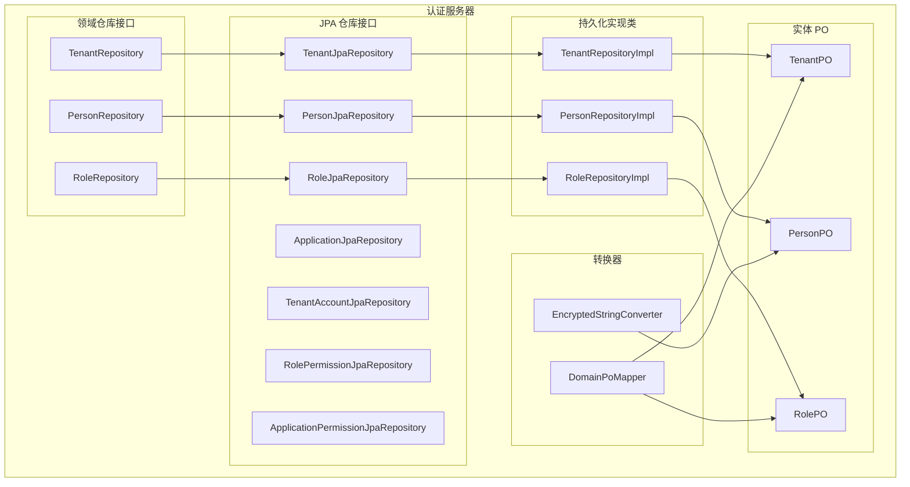
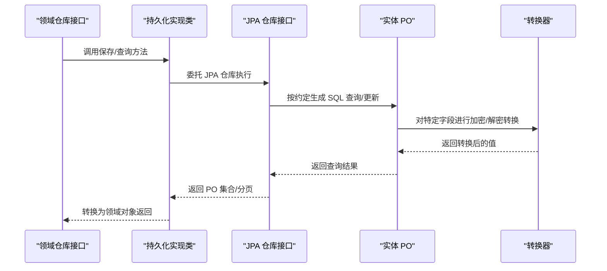
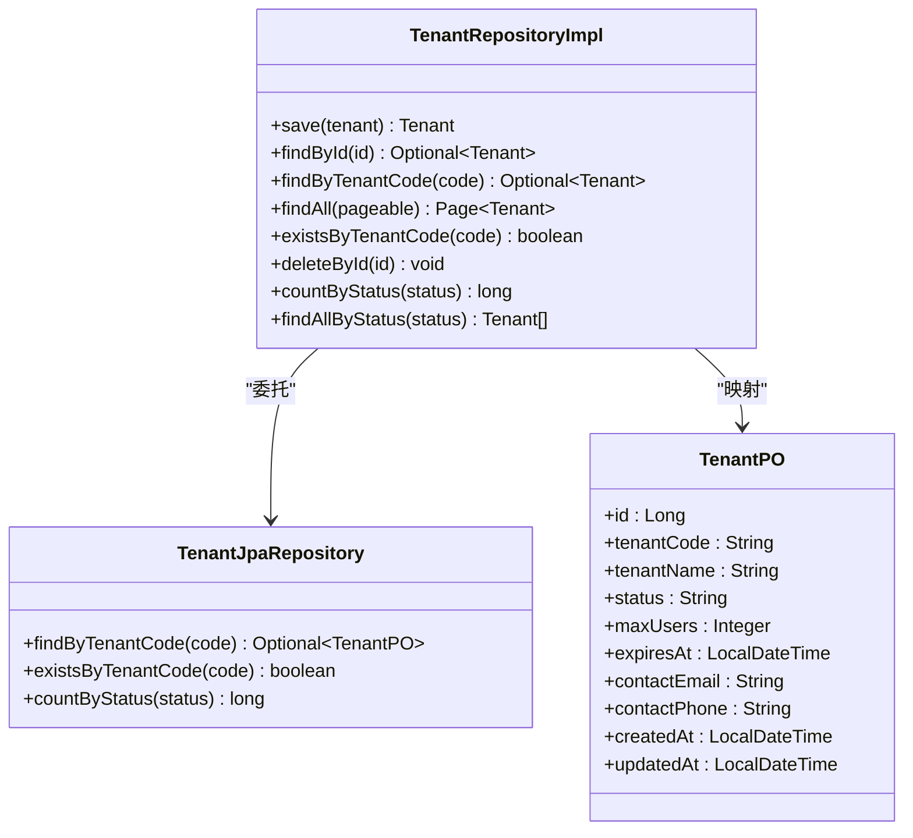
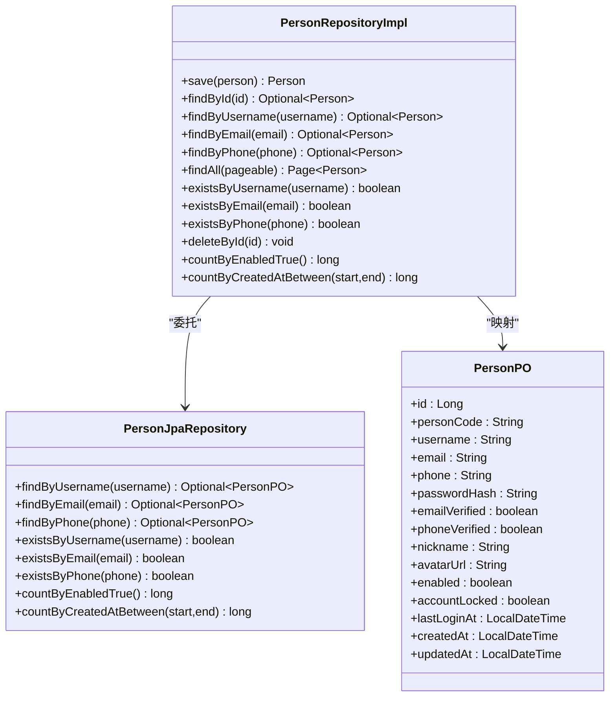
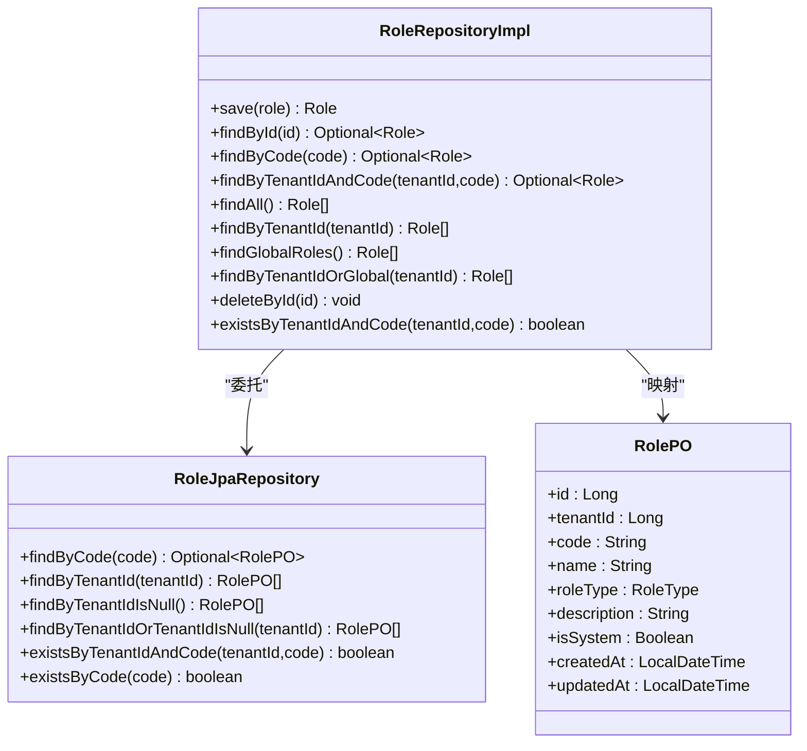
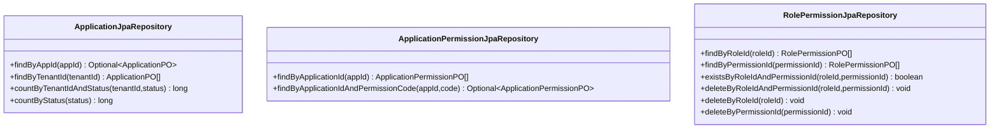
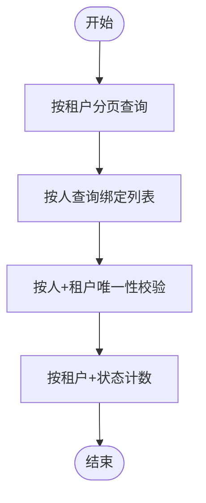
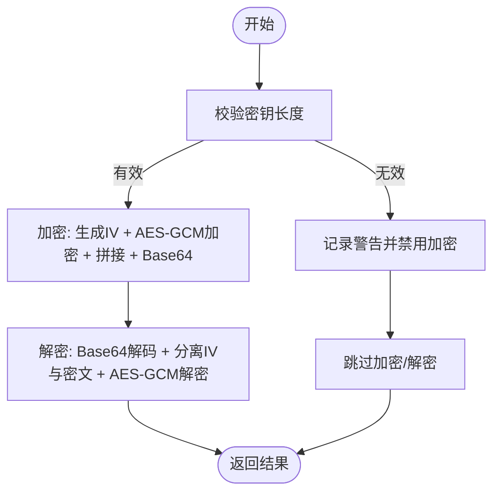
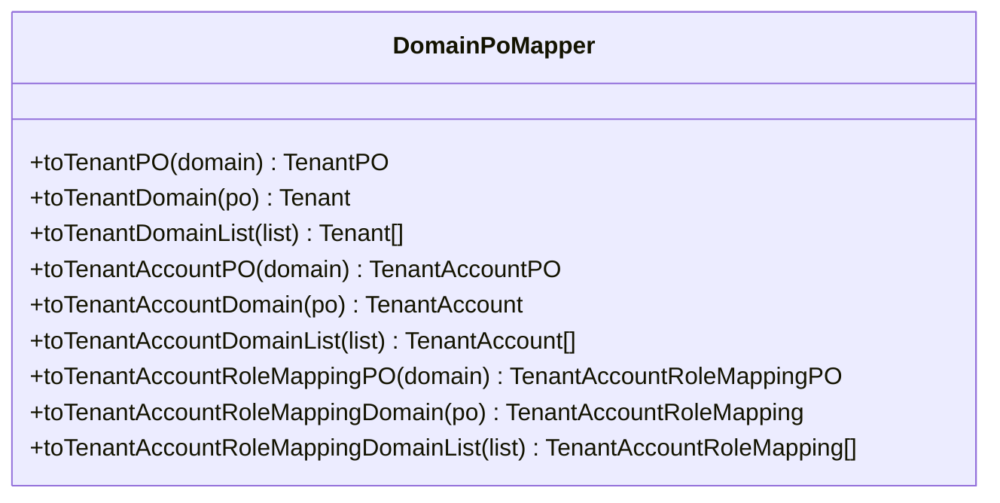
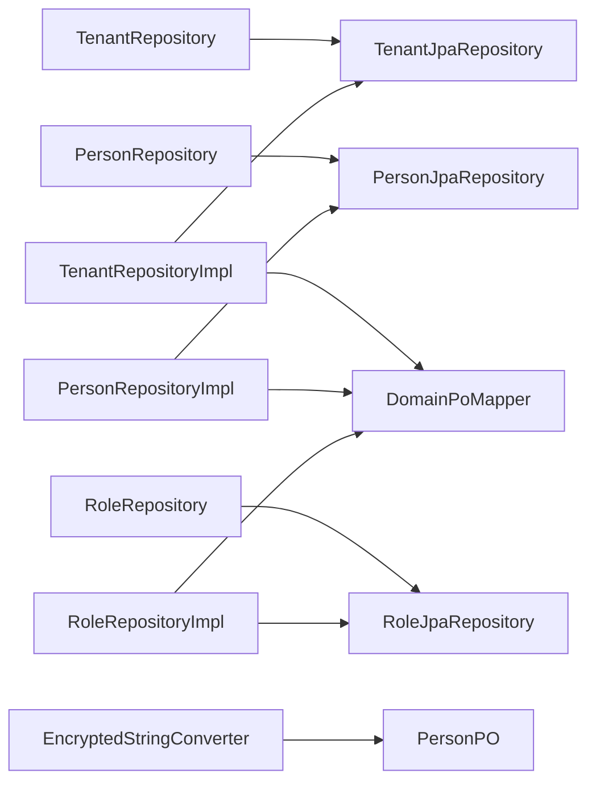

# 数据访问层

<cite>
**本文引用的文件**
- [TenantJpaRepository.java](file://iam-auth-server/src/main/java/iam/platform/auth/infrastructure/persistence/repository/TenantJpaRepository.java)
- [PersonJpaRepository.java](file://iam-auth-server/src/main/java/iam/platform/auth/infrastructure/persistence/repository/PersonJpaRepository.java)
- [RoleJpaRepository.java](file://iam-auth-server/src/main/java/iam/platform/auth/infrastructure/persistence/repository/RoleJpaRepository.java)
- [ApplicationJpaRepository.java](file://iam-auth-server/src/main/java/iam/platform/auth/infrastructure/persistence/repository/ApplicationJpaRepository.java)
- [TenantAccountJpaRepository.java](file://iam-auth-server/src/main/java/iam/platform/auth/infrastructure/persistence/repository/TenantAccountJpaRepository.java)
- [RolePermissionJpaRepository.java](file://iam-auth-server/src/main/java/iam/platform/auth/infrastructure/persistence/repository/RolePermissionJpaRepository.java)
- [ApplicationPermissionJpaRepository.java](file://iam-auth-server/src/main/java/iam/platform/auth/infrastructure/persistence/repository/ApplicationPermissionJpaRepository.java)
- [TenantPO.java](file://iam-auth-server/src/main/java/iam/platform/auth/infrastructure/persistence/entity/TenantPO.java)
- [PersonPO.java](file://iam-auth-server/src/main/java/iam/platform/auth/infrastructure/persistence/entity/PersonPO.java)
- [RolePO.java](file://iam-auth-server/src/main/java/iam/platform/auth/infrastructure/persistence/entity/RolePO.java)
- [EncryptedStringConverter.java](file://iam-auth-server/src/main/java/iam/platform/auth/infrastructure/persistence/converter/EncryptedStringConverter.java)
- [DomainPoMapper.java](file://iam-auth-server/src/main/java/iam/platform/auth/infrastructure/persistence/converter/DomainPoMapper.java)
- [TenantRepositoryImpl.java](file://iam-auth-server/src/main/java/iam/platform/auth/infrastructure/persistence/impl/TenantRepositoryImpl.java)
- [PersonRepositoryImpl.java](file://iam-auth-server/src/main/java/iam/platform/auth/infrastructure/persistence/impl/PersonRepositoryImpl.java)
- [RoleRepositoryImpl.java](file://iam-auth-server/src/main/java/iam/platform/auth/infrastructure/persistence/impl/RoleRepositoryImpl.java)
</cite>

## 目录
1. [简介](#简介)
2. [项目结构](#项目结构)
3. [核心组件](#核心组件)
4. [架构总览](#架构总览)
5. [详细组件分析](#详细组件分析)
6. [依赖分析](#依赖分析)
7. [性能考虑](#性能考虑)
8. [故障排查指南](#故障排查指南)
9. [结论](#结论)
10. [附录](#附录)

## 简介
本文件系统性梳理认证服务器的数据访问层（Data Access Layer），重点覆盖以下方面：
- JPA 仓库接口的设计与命名规范
- 实体类的 JPA 映射与字段约束
- 持久化实现类的职责边界与转换逻辑
- 查询优化策略与分页、统计查询的使用
- 缓存机制与事务管理现状与建议
- 实体转换器（含加密字符串转换）的实现与应用
- 测试方法、性能优化建议与数据库设计最佳实践
- 扩展新数据模型与优化查询性能的实际路径指引

## 项目结构
数据访问层位于认证服务器模块中，采用“领域模型 → 领域仓库接口 → JPA 仓库接口 → 持久化实现类 → 实体 PO”的分层组织方式。转换器负责领域值对象与数据库字段之间的转换（如加密字段）。

图表来源
- [TenantRepositoryImpl.java:1-67](file://iam-auth-server/src/main/java/iam/platform/auth/infrastructure/persistence/impl/TenantRepositoryImpl.java#L1-L67)
- [PersonRepositoryImpl.java:1-113](file://iam-auth-server/src/main/java/iam/platform/auth/infrastructure/persistence/impl/PersonRepositoryImpl.java#L1-L113)
- [RoleRepositoryImpl.java:1-103](file://iam-auth-server/src/main/java/iam/platform/auth/infrastructure/persistence/impl/RoleRepositoryImpl.java#L1-L103)
- [TenantJpaRepository.java:1-15](file://iam-auth-server/src/main/java/iam/platform/auth/infrastructure/persistence/repository/TenantJpaRepository.java#L1-L15)
- [PersonJpaRepository.java:1-25](file://iam-auth-server/src/main/java/iam/platform/auth/infrastructure/persistence/repository/PersonJpaRepository.java#L1-L25)
- [RoleJpaRepository.java:1-22](file://iam-auth-server/src/main/java/iam/platform/auth/infrastructure/persistence/repository/RoleJpaRepository.java#L1-L22)
- [TenantPO.java:1-72](file://iam-auth-server/src/main/java/iam/platform/auth/infrastructure/persistence/entity/TenantPO.java#L1-L72)
- [PersonPO.java:1-97](file://iam-auth-server/src/main/java/iam/platform/auth/infrastructure/persistence/entity/PersonPO.java#L1-L97)
- [RolePO.java:1-81](file://iam-auth-server/src/main/java/iam/platform/auth/infrastructure/persistence/entity/RolePO.java#L1-L81)
- [EncryptedStringConverter.java:1-109](file://iam-auth-server/src/main/java/iam/platform/auth/infrastructure/persistence/converter/EncryptedStringConverter.java#L1-L109)
- [DomainPoMapper.java:1-52](file://iam-auth-server/src/main/java/iam/platform/auth/infrastructure/persistence/converter/DomainPoMapper.java#L1-L52)

章节来源
- [TenantRepositoryImpl.java:1-67](file://iam-auth-server/src/main/java/iam/platform/auth/infrastructure/persistence/impl/TenantRepositoryImpl.java#L1-L67)
- [PersonRepositoryImpl.java:1-113](file://iam-auth-server/src/main/java/iam/platform/auth/infrastructure/persistence/impl/PersonRepositoryImpl.java#L1-L113)
- [RoleRepositoryImpl.java:1-103](file://iam-auth-server/src/main/java/iam/platform/auth/infrastructure/persistence/impl/RoleRepositoryImpl.java#L1-L103)

## 核心组件
- 领域仓库接口：定义业务所需的最小持久化契约，如 TenantRepository、PersonRepository、RoleRepository。
- JPA 仓库接口：基于 Spring Data JPA 的接口，提供按约定命名的方法（如 findByXxx、existsByXxx、countByXxx）以实现查询、去重与计数。
- 持久化实现类：在领域仓库与 JPA 仓库之间进行适配，负责实体与领域对象的双向转换、分页与统计查询的封装。
- 实体 PO：使用 JPA 注解标注表结构与字段约束，部分字段通过转换器进行加密存储。
- 转换器：EncryptedStringConverter 将敏感字符串在入库前加密、出库后解密；DomainPoMapper 使用 MapStruct 进行领域对象与 PO 的批量映射。

章节来源
- [TenantJpaRepository.java:1-15](file://iam-auth-server/src/main/java/iam/platform/auth/infrastructure/persistence/repository/TenantJpaRepository.java#L1-L15)
- [PersonJpaRepository.java:1-25](file://iam-auth-server/src/main/java/iam/platform/auth/infrastructure/persistence/repository/PersonJpaRepository.java#L1-L25)
- [RoleJpaRepository.java:1-22](file://iam-auth-server/src/main/java/iam/platform/auth/infrastructure/persistence/repository/RoleJpaRepository.java#L1-L22)
- [TenantPO.java:1-72](file://iam-auth-server/src/main/java/iam/platform/auth/infrastructure/persistence/entity/TenantPO.java#L1-L72)
- [PersonPO.java:1-97](file://iam-auth-server/src/main/java/iam/platform/auth/infrastructure/persistence/entity/PersonPO.java#L1-L97)
- [RolePO.java:1-81](file://iam-auth-server/src/main/java/iam/platform/auth/infrastructure/persistence/entity/RolePO.java#L1-L81)
- [EncryptedStringConverter.java:1-109](file://iam-auth-server/src/main/java/iam/platform/auth/infrastructure/persistence/converter/EncryptedStringConverter.java#L1-L109)
- [DomainPoMapper.java:1-52](file://iam-auth-server/src/main/java/iam/platform/auth/infrastructure/persistence/converter/DomainPoMapper.java#L1-L52)
- [TenantRepositoryImpl.java:1-67](file://iam-auth-server/src/main/java/iam/platform/auth/infrastructure/persistence/impl/TenantRepositoryImpl.java#L1-L67)
- [PersonRepositoryImpl.java:1-113](file://iam-auth-server/src/main/java/iam/platform/auth/infrastructure/persistence/impl/PersonRepositoryImpl.java#L1-L113)
- [RoleRepositoryImpl.java:1-103](file://iam-auth-server/src/main/java/iam/platform/auth/infrastructure/persistence/impl/RoleRepositoryImpl.java#L1-L103)

## 架构总览
下图展示了从领域仓库到 JPA 仓库再到实现类与实体的调用链路，以及转换器在持久化过程中的作用位置。

图表来源
- [TenantRepositoryImpl.java:24-29](file://iam-auth-server/src/main/java/iam/platform/auth/infrastructure/persistence/impl/TenantRepositoryImpl.java#L24-L29)
- [PersonRepositoryImpl.java:21-25](file://iam-auth-server/src/main/java/iam/platform/auth/infrastructure/persistence/impl/PersonRepositoryImpl.java#L21-L25)
- [RoleRepositoryImpl.java:21-25](file://iam-auth-server/src/main/java/iam/platform/auth/infrastructure/persistence/impl/RoleRepositoryImpl.java#L21-L25)
- [EncryptedStringConverter.java:44-65](file://iam-auth-server/src/main/java/iam/platform/auth/infrastructure/persistence/converter/EncryptedStringConverter.java#L44-L65)

## 详细组件分析

### 租户仓储（Tenant）
- JPA 仓库接口提供按租户编码查询、存在性检查与按状态计数等方法。
- 实现类负责将领域对象与 PO 双向转换，并支持分页查询与按状态过滤。
- 实体 PO 定义了租户的主键、唯一编码、名称、状态、配额、过期时间及审计字段。

图表来源
- [TenantRepositoryImpl.java:19-66](file://iam-auth-server/src/main/java/iam/platform/auth/infrastructure/persistence/impl/TenantRepositoryImpl.java#L19-L66)
- [TenantJpaRepository.java:8-14](file://iam-auth-server/src/main/java/iam/platform/auth/infrastructure/persistence/repository/TenantJpaRepository.java#L8-L14)
- [TenantPO.java:21-71](file://iam-auth-server/src/main/java/iam/platform/auth/infrastructure/persistence/entity/TenantPO.java#L21-L71)

章节来源
- [TenantJpaRepository.java:1-15](file://iam-auth-server/src/main/java/iam/platform/auth/infrastructure/persistence/repository/TenantJpaRepository.java#L1-L15)
- [TenantRepositoryImpl.java:1-67](file://iam-auth-server/src/main/java/iam/platform/auth/infrastructure/persistence/impl/TenantRepositoryImpl.java#L1-L67)
- [TenantPO.java:1-72](file://iam-auth-server/src/main/java/iam/platform/auth/infrastructure/persistence/entity/TenantPO.java#L1-L72)

### 用户仓储（Person）
- JPA 仓库接口提供用户名、邮箱、手机号的唯一性查询与存在性检查，以及启用状态计数与时间段计数。
- 实现类通过自定义映射方法完成 PO 与领域对象的转换，保留所有用户属性。
- 实体 PO 包含用户标识、凭证哈希、验证状态、头像、启用/锁定状态、登录时间与审计字段。

图表来源
- [PersonRepositoryImpl.java:16-112](file://iam-auth-server/src/main/java/iam/platform/auth/infrastructure/persistence/impl/PersonRepositoryImpl.java#L16-L112)
- [PersonJpaRepository.java:8-24](file://iam-auth-server/src/main/java/iam/platform/auth/infrastructure/persistence/repository/PersonJpaRepository.java#L8-L24)
- [PersonPO.java:21-96](file://iam-auth-server/src/main/java/iam/platform/auth/infrastructure/persistence/entity/PersonPO.java#L21-L96)

章节来源
- [PersonJpaRepository.java:1-25](file://iam-auth-server/src/main/java/iam/platform/auth/infrastructure/persistence/repository/PersonJpaRepository.java#L1-L25)
- [PersonRepositoryImpl.java:1-113](file://iam-auth-server/src/main/java/iam/platform/auth/infrastructure/persistence/impl/PersonRepositoryImpl.java#L1-L113)
- [PersonPO.java:1-97](file://iam-auth-server/src/main/java/iam/platform/auth/infrastructure/persistence/entity/PersonPO.java#L1-L97)

### 角色仓储（Role）
- JPA 仓库接口提供按编码查询、按租户过滤、全局角色查询与存在性校验。
- 实现类在保存时支持更新已有实体，避免重复创建；查询时统一转换为领域对象。
- 实体 PO 包含租户关联、角色编码与名称、类型、描述、系统标志与审计字段。

图表来源
- [RoleRepositoryImpl.java:16-102](file://iam-auth-server/src/main/java/iam/platform/auth/infrastructure/persistence/impl/RoleRepositoryImpl.java#L16-L102)
- [RoleJpaRepository.java:9-21](file://iam-auth-server/src/main/java/iam/platform/auth/infrastructure/persistence/repository/RoleJpaRepository.java#L9-L21)
- [RolePO.java:24-80](file://iam-auth-server/src/main/java/iam/platform/auth/infrastructure/persistence/entity/RolePO.java#L24-L80)

章节来源
- [RoleJpaRepository.java:1-22](file://iam-auth-server/src/main/java/iam/platform/auth/infrastructure/persistence/repository/RoleJpaRepository.java#L1-L22)
- [RoleRepositoryImpl.java:1-103](file://iam-auth-server/src/main/java/iam/platform/auth/infrastructure/persistence/impl/RoleRepositoryImpl.java#L1-L103)
- [RolePO.java:1-81](file://iam-auth-server/src/main/java/iam/platform/auth/infrastructure/persistence/entity/RolePO.java#L1-L81)

### 应用与权限仓储（Application、ApplicationPermission、RolePermission）
- ApplicationJpaRepository 提供按应用标识、租户过滤与状态计数。
- ApplicationPermissionJpaRepository 提供按应用与权限码组合查询。
- RolePermissionJpaRepository 提供按角色或权限维度的关联查询、存在性校验与删除操作。

图表来源
- [ApplicationJpaRepository.java:1-18](file://iam-auth-server/src/main/java/iam/platform/auth/infrastructure/persistence/repository/ApplicationJpaRepository.java#L1-L18)
- [ApplicationPermissionJpaRepository.java:1-16](file://iam-auth-server/src/main/java/iam/platform/auth/infrastructure/persistence/repository/ApplicationPermissionJpaRepository.java#L1-L16)
- [RolePermissionJpaRepository.java:1-21](file://iam-auth-server/src/main/java/iam/platform/auth/infrastructure/persistence/repository/RolePermissionJpaRepository.java#L1-L21)

章节来源
- [ApplicationJpaRepository.java:1-18](file://iam-auth-server/src/main/java/iam/platform/auth/infrastructure/persistence/repository/ApplicationJpaRepository.java#L1-L18)
- [ApplicationPermissionJpaRepository.java:1-16](file://iam-auth-server/src/main/java/iam/platform/auth/infrastructure/persistence/repository/ApplicationPermissionJpaRepository.java#L1-L16)
- [RolePermissionJpaRepository.java:1-21](file://iam-auth-server/src/main/java/iam/platform/auth/infrastructure/persistence/repository/RolePermissionJpaRepository.java#L1-L21)

### 租户账号仓储（TenantAccount）
- TenantAccountJpaRepository 提供按人与租户的唯一性查询、按人/租户过滤、分页查询与多维计数。
- 该仓储常用于“人员-租户”绑定关系的读写与统计。

图表来源
- [TenantAccountJpaRepository.java:11-27](file://iam-auth-server/src/main/java/iam/platform/auth/infrastructure/persistence/repository/TenantAccountJpaRepository.java#L11-L27)

章节来源
- [TenantAccountJpaRepository.java:1-28](file://iam-auth-server/src/main/java/iam/platform/auth/infrastructure/persistence/repository/TenantAccountJpaRepository.java#L1-L28)

### 加密字符串转换器（EncryptedStringConverter）
- 通过 AES-GCM 对敏感字符串进行加解密，IV 与密文拼接后 Base64 存储。
- 启动时对密钥长度进行校验，无效时记录警告并优雅降级为明文存储。
- 适用于客户端密钥等敏感字段的持久化安全处理。

图表来源
- [EncryptedStringConverter.java:28-41](file://iam-auth-server/src/main/java/iam/platform/auth/infrastructure/persistence/converter/EncryptedStringConverter.java#L28-L41)
- [EncryptedStringConverter.java:67-107](file://iam-auth-server/src/main/java/iam/platform/auth/infrastructure/persistence/converter/EncryptedStringConverter.java#L67-L107)

章节来源
- [EncryptedStringConverter.java:1-109](file://iam-auth-server/src/main/java/iam/platform/auth/infrastructure/persistence/converter/EncryptedStringConverter.java#L1-L109)

### 领域对象与 PO 映射（DomainPoMapper）
- 使用 MapStruct 将领域对象与 PO 在属性级别进行映射，包括枚举字段的字符串与枚举互转。
- 支持列表映射，减少重复样板代码。

图表来源
- [DomainPoMapper.java:15-51](file://iam-auth-server/src/main/java/iam/platform/auth/infrastructure/persistence/converter/DomainPoMapper.java#L15-L51)

章节来源
- [DomainPoMapper.java:1-52](file://iam-auth-server/src/main/java/iam/platform/auth/infrastructure/persistence/converter/DomainPoMapper.java#L1-L52)

## 依赖分析
- 低耦合高内聚：每个领域仓库接口仅暴露必要方法，实现类通过 JPA 仓库接口解耦具体持久化技术。
- 转换器独立：加密转换器与实体解耦，便于替换与测试。
- 映射器集中：MapStruct 统一处理领域对象与 PO 的映射，降低手写映射成本。

图表来源
- [TenantRepositoryImpl.java:21-22](file://iam-auth-server/src/main/java/iam/platform/auth/infrastructure/persistence/impl/TenantRepositoryImpl.java#L21-L22)
- [PersonRepositoryImpl.java](file://iam-auth-server/src/main/java/iam/platform/auth/infrastructure/persistence/impl/PersonRepositoryImpl.java#L18)
- [RoleRepositoryImpl.java](file://iam-auth-server/src/main/java/iam/platform/auth/infrastructure/persistence/impl/RoleRepositoryImpl.java#L18)
- [DomainPoMapper.java:15-51](file://iam-auth-server/src/main/java/iam/platform/auth/infrastructure/persistence/converter/DomainPoMapper.java#L15-L51)
- [EncryptedStringConverter.java:15-41](file://iam-auth-server/src/main/java/iam/platform/auth/infrastructure/persistence/converter/EncryptedStringConverter.java#L15-L41)
- [PersonPO.java:1-97](file://iam-auth-server/src/main/java/iam/platform/auth/infrastructure/persistence/entity/PersonPO.java#L1-L97)

章节来源
- [TenantRepositoryImpl.java:1-67](file://iam-auth-server/src/main/java/iam/platform/auth/infrastructure/persistence/impl/TenantRepositoryImpl.java#L1-L67)
- [PersonRepositoryImpl.java:1-113](file://iam-auth-server/src/main/java/iam/platform/auth/infrastructure/persistence/impl/PersonRepositoryImpl.java#L1-L113)
- [RoleRepositoryImpl.java:1-103](file://iam-auth-server/src/main/java/iam/platform/auth/infrastructure/persistence/impl/RoleRepositoryImpl.java#L1-L103)

## 性能考虑
- 查询优化
  - 使用 existsByXxx 进行布尔判断，避免不必要的全量加载。
  - 使用 countByXxx 进行聚合统计，减少应用侧计算。
  - 使用 Pageable 进行分页，避免一次性加载大量数据。
- 索引与约束
  - 唯一性字段（如租户编码、用户名、邮箱、手机号）应建立唯一索引，加速查询与去重。
  - 时间范围查询可结合索引列（如创建时间）提升效率。
- 缓存机制
  - 对热点只读数据（如全局角色、应用元数据）引入二级缓存或本地缓存，降低数据库压力。
  - 结合 @Cacheable/@CacheEvict 等注解进行缓存管理。
- 事务管理
  - 写入操作建议使用 @Transactional，确保一致性。
  - 大批量写入可考虑分批提交，避免长事务锁表。
- 加密开销
  - 加密/解密为 CPU 密集型操作，建议对高频字段进行评估是否需要加密，或在批量场景中合并处理。

## 故障排查指南
- 启动阶段密钥校验失败
  - 现象：日志出现 AES-256 密钥长度不合法警告，加密被禁用。
  - 排查：确认配置项长度为 32 字节（UTF-8），重新部署后观察日志。
- 查询结果为空或异常
  - 现象：按编码/用户名/邮箱查询返回空。
  - 排查：确认字段唯一性索引是否存在；核对输入参数大小写与格式。
- 计数与分页异常
  - 现象：countByXxx 或分页结果与预期不符。
  - 排查：确认状态枚举值与数据库存储一致；检查 Pageable 参数是否合理。
- 加密字段无法解密
  - 现象：读取加密字段抛出异常。
  - 排查：确认密钥配置正确且未变更；检查历史数据是否为兼容格式。

章节来源
- [EncryptedStringConverter.java:33-41](file://iam-auth-server/src/main/java/iam/platform/auth/infrastructure/persistence/converter/EncryptedStringConverter.java#L33-L41)
- [PersonJpaRepository.java:8-24](file://iam-auth-server/src/main/java/iam/platform/auth/infrastructure/persistence/repository/PersonJpaRepository.java#L8-L24)
- [TenantJpaRepository.java:8-14](file://iam-auth-server/src/main/java/iam/platform/auth/infrastructure/persistence/repository/TenantJpaRepository.java#L8-L14)

## 结论
认证服务器的数据访问层遵循清晰的分层与职责分离原则：领域仓库接口抽象业务需求，JPA 仓库接口提供高效查询能力，实现类承担转换与封装，实体 PO 与转换器保障数据结构与安全。通过合理的查询优化、索引设计与缓存策略，可在保证安全性的同时获得良好的性能表现。后续扩展新模型时，建议沿用现有模式：定义领域仓库接口、JPA 仓库接口、实现类与实体 PO，并通过转换器与映射器完成安全与一致性处理。

## 附录
- 扩展新数据模型步骤
  - 定义领域实体与领域仓库接口
  - 新建 JPA 仓库接口，按约定命名查询方法
  - 新建实现类，注入 JPA 仓库与映射器/转换器
  - 新建实体 PO，添加必要的 JPA 注解与索引
  - 在转换器中新增必要字段的转换逻辑（如加密）
  - 补充单元测试与集成测试
- 查询性能优化清单
  - 为高频查询字段建立唯一/复合索引
  - 使用 existsByXxx 替代 load 全量数据
  - 使用 Pageable 控制单页大小，避免 N+1 查询
  - 对只读数据引入缓存，定期失效刷新
  - 对批量写入使用事务分批提交