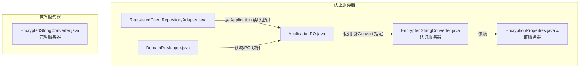
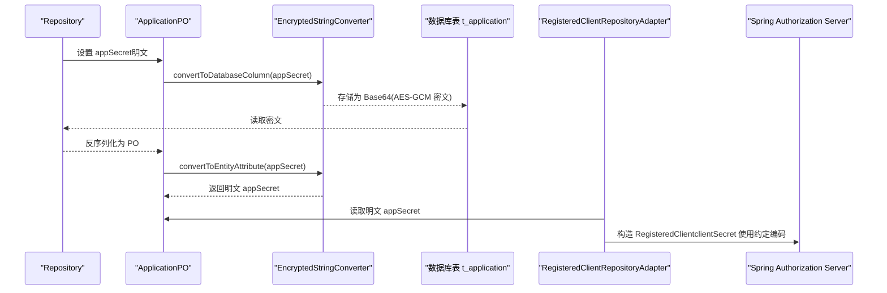
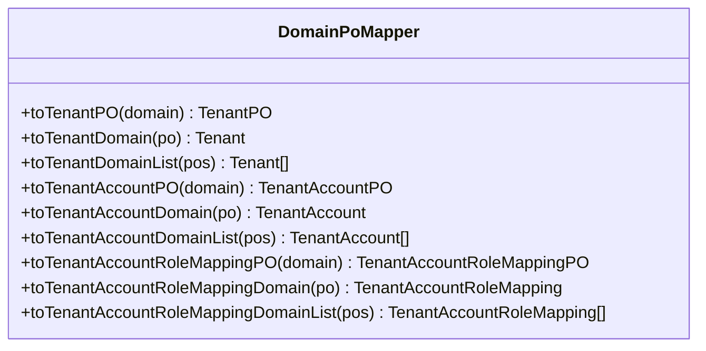
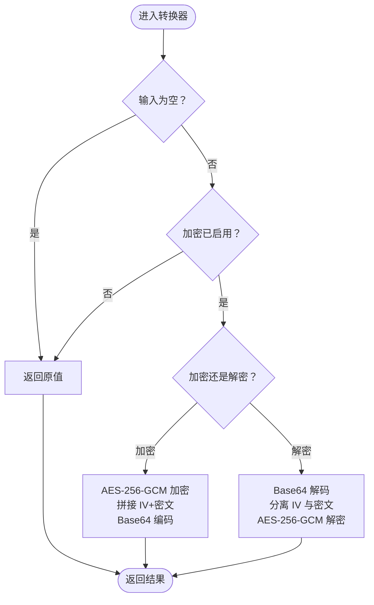
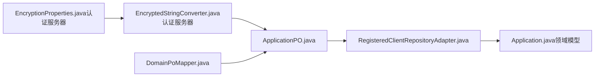

# 转换器组件

<cite>
**本文引用的文件**
- [DomainPoMapper.java](file://iam-auth-server/src/main/java/iam/platform/auth/infrastructure/persistence/converter/DomainPoMapper.java)
- [EncryptedStringConverter.java（认证服务器）](file://iam-auth-server/src/main/java/iam/platform/auth/infrastructure/persistence/converter/EncryptedStringConverter.java)
- [EncryptedStringConverter.java（管理服务器）](file://iam-admin-server/src/main/java/iam/platform/admin/infrastructure/persistence/converter/EncryptedStringConverter.java)
- [EncryptionProperties.java（认证服务器）](file://iam-auth-server/src/main/java/iam/platform/auth/infrastructure/config/EncryptionProperties.java)
- [ApplicationPO.java](file://iam-auth-server/src/main/java/iam/platform/auth/infrastructure/persistence/entity/ApplicationPO.java)
- [RegisteredClientRepositoryAdapter.java](file://iam-auth-server/src/main/java/iam/platform/auth/infrastructure/security/RegisteredClientRepositoryAdapter.java)
- [Application.java（领域模型）](file://iam-auth-server/src/main/java/iam/platform/auth/domain/model/entity/Application.java)
</cite>

## 目录
1. [简介](#简介)
2. [项目结构](#项目结构)
3. [核心组件](#核心组件)
4. [架构总览](#架构总览)
5. [详细组件分析](#详细组件分析)
6. [依赖分析](#依赖分析)
7. [性能考量](#性能考量)
8. [故障排查指南](#故障排查指南)
9. [结论](#结论)
10. [附录](#附录)

## 简介
本文件聚焦认证服务器中的“转换器组件”，系统性阐述以下内容：
- 领域模型与持久化对象映射器 DomainPoMapper 的设计与实现
- 加密字符串转换器 EncryptedStringConverter 的工作原理与安全策略
- @Converter 注解与 AttributeConverter 接口的使用方式、空值处理与异常策略
- 转换器在数据持久化过程中的作用：敏感数据加密、格式转换、类型适配
- 转换器的注册机制、使用场景、性能与安全最佳实践

## 项目结构
认证服务器中与转换器相关的关键位置如下：
- 转换器实现：iam-auth-server/.../persistence/converter
- 实体与注解使用：iam-auth-server/.../persistence/entity
- 安全适配层：iam-auth-server/.../security（将数据库中的明文密钥交给授权服务器）
- 配置属性：iam-auth-server/.../config

图表来源
- [DomainPoMapper.java:15-51](file://iam-auth-server/src/main/java/iam/platform/auth/infrastructure/persistence/converter/DomainPoMapper.java#L15-L51)
- [EncryptedStringConverter.java（认证服务器）:15-108](file://iam-auth-server/src/main/java/iam/platform/auth/infrastructure/persistence/converter/EncryptedStringConverter.java#L15-L108)
- [ApplicationPO.java:19-37](file://iam-auth-server/src/main/java/iam/platform/auth/infrastructure/persistence/entity/ApplicationPO.java#L19-L37)
- [RegisteredClientRepositoryAdapter.java:47-99](file://iam-auth-server/src/main/java/iam/platform/auth/infrastructure/security/RegisteredClientRepositoryAdapter.java#L47-L99)
- [EncryptionProperties.java（认证服务器）:11-14](file://iam-auth-server/src/main/java/iam/platform/auth/infrastructure/config/EncryptionProperties.java#L11-L14)

章节来源
- [DomainPoMapper.java:15-51](file://iam-auth-server/src/main/java/iam/platform/auth/infrastructure/persistence/converter/DomainPoMapper.java#L15-L51)
- [EncryptedStringConverter.java（认证服务器）:15-108](file://iam-auth-server/src/main/java/iam/platform/auth/infrastructure/persistence/converter/EncryptedStringConverter.java#L15-L108)
- [ApplicationPO.java:19-37](file://iam-auth-server/src/main/java/iam/platform/auth/infrastructure/persistence/entity/ApplicationPO.java#L19-L37)
- [RegisteredClientRepositoryAdapter.java:47-99](file://iam-auth-server/src/main/java/iam/platform/auth/infrastructure/security/RegisteredClientRepositoryAdapter.java#L47-L99)
- [EncryptionProperties.java（认证服务器）:11-14](file://iam-auth-server/src/main/java/iam/platform/auth/infrastructure/config/EncryptionProperties.java#L11-L14)

## 核心组件
- 领域模型与持久化对象映射器 DomainPoMapper：基于 MapStruct 的接口式映射器，负责将领域实体与持久化对象之间进行双向转换，并对枚举字段进行字符串化/反串化处理。
- 加密字符串转换器 EncryptedStringConverter：基于 JPA AttributeConverter 的实现，使用 AES-256-GCM 对敏感字符串（如应用密钥）进行透明加解密；通过配置属性启用/禁用。

章节来源
- [DomainPoMapper.java:15-51](file://iam-auth-server/src/main/java/iam/platform/auth/infrastructure/persistence/converter/DomainPoMapper.java#L15-L51)
- [EncryptedStringConverter.java（认证服务器）:15-108](file://iam-auth-server/src/main/java/iam/platform/auth/infrastructure/persistence/converter/EncryptedStringConverter.java#L15-L108)

## 架构总览
下图展示了“实体 → 转换器 → 数据库列”的端到端流程，以及“授权服务器适配层”如何消费转换后的明文密钥：

图表来源
- [ApplicationPO.java:35-37](file://iam-auth-server/src/main/java/iam/platform/auth/infrastructure/persistence/entity/ApplicationPO.java#L35-L37)
- [EncryptedStringConverter.java（认证服务器）:43-65](file://iam-auth-server/src/main/java/iam/platform/auth/infrastructure/persistence/converter/EncryptedStringConverter.java#L43-L65)
- [RegisteredClientRepositoryAdapter.java:47-99](file://iam-auth-server/src/main/java/iam/platform/auth/infrastructure/security/RegisteredClientRepositoryAdapter.java#L47-L99)

## 详细组件分析

### 领域模型与持久化对象映射器 DomainPoMapper
- 设计要点
  - 使用 @Mapper(componentModel = "spring") 将其作为 Spring 组件注入，便于在仓储层或装配器中直接使用。
  - 使用 @Mapping(expression = "...") 对枚举字段进行字符串化/反串化，避免 ORM 层直接存储枚举常量名导致的脆弱性。
  - 提供列表转换方法，支持批量映射。
- 关键映射
  - 租户状态：领域侧为枚举，PO 侧为字符串，默认值处理。
  - 账户状态：同上。
  - 角色映射：忽略角色集合以避免循环映射或额外查询。
- 复杂度与性能
  - 单条映射为 O(1)，批量映射为 O(n)。
  - 通过表达式映射减少额外的工具类调用，降低耦合。

图表来源
- [DomainPoMapper.java:15-51](file://iam-auth-server/src/main/java/iam/platform/auth/infrastructure/persistence/converter/DomainPoMapper.java#L15-L51)

章节来源
- [DomainPoMapper.java:15-51](file://iam-auth-server/src/main/java/iam/platform/auth/infrastructure/persistence/converter/DomainPoMapper.java#L15-L51)

### 加密字符串转换器 EncryptedStringConverter
- 设计要点
  - 实现 AttributeConverter<String, String>，在 JPA 层透明地对字符串字段进行加解密。
  - 使用 AES-256-GCM，随机初始化向量（IV），并将 IV 与密文拼接后 Base64 编码存储。
  - 通过 EncryptionProperties.key 判断是否启用加密；长度校验失败时记录警告并优雅降级为明文存储。
- 空值与异常处理
  - 空值直接透传，不做任何处理。
  - 加密/解密异常统一包装为运行时异常，便于上层捕获。
- 安全性
  - 密钥长度必须为 32 字节（256 位），否则禁用加密。
  - 解密失败视为数据损坏或密钥错误，抛出异常，避免静默失败。
- 性能
  - 加解密为 CPU 密集型操作，建议在高并发场景下评估开销并结合缓存与异步处理。

图表来源
- [EncryptedStringConverter.java（认证服务器）:43-107](file://iam-auth-server/src/main/java/iam/platform/auth/infrastructure/persistence/converter/EncryptedStringConverter.java#L43-L107)

章节来源
- [EncryptedStringConverter.java（认证服务器）:15-108](file://iam-auth-server/src/main/java/iam/platform/auth/infrastructure/persistence/converter/EncryptedStringConverter.java#L15-L108)
- [EncryptionProperties.java（认证服务器）:11-14](file://iam-auth-server/src/main/java/iam/platform/auth/infrastructure/config/EncryptionProperties.java#L11-L14)

### 实体与注解使用：ApplicationPO
- 在字段上使用 @Convert(converter = EncryptedStringConverter.class) 指定转换器。
- 字段类型为 String，存储经转换器处理后的密文（或明文，取决于配置）。
- 该字段用于保存应用密钥，配合授权服务器适配层完成认证流程。

章节来源
- [ApplicationPO.java:35-37](file://iam-auth-server/src/main/java/iam/platform/auth/infrastructure/persistence/entity/ApplicationPO.java#L35-L37)

### 授权服务器适配层：RegisteredClientRepositoryAdapter
- 从 Application 领域模型读取 appSecret（经转换器解密后的明文）。
- 将明文密钥按约定前缀（例如 {noop}）传递给授权服务器，避免重复加密。
- 该适配层体现了“数据库中加密、内存中明文”的分层安全策略。

章节来源
- [RegisteredClientRepositoryAdapter.java:47-99](file://iam-auth-server/src/main/java/iam/platform/auth/infrastructure/security/RegisteredClientRepositoryAdapter.java#L47-L99)
- [Application.java（领域模型）:24-41](file://iam-auth-server/src/main/java/iam/platform/auth/domain/model/entity/Application.java#L24-L41)

## 依赖分析
- 转换器依赖
  - EncryptedStringConverter 依赖 EncryptionProperties 获取密钥配置。
  - ApplicationPO 通过 @Convert 注解绑定转换器。
  - RegisteredClientRepositoryAdapter 依赖 Application 领域模型读取明文密钥。
- 内聚与耦合
  - 转换器职责单一，内聚性高；与实体和配置解耦。
  - 映射器与实体解耦，仅依赖接口契约。

图表来源
- [EncryptionProperties.java（认证服务器）:11-14](file://iam-auth-server/src/main/java/iam/platform/auth/infrastructure/config/EncryptionProperties.java#L11-L14)
- [EncryptedStringConverter.java（认证服务器）:28-41](file://iam-auth-server/src/main/java/iam/platform/auth/infrastructure/persistence/converter/EncryptedStringConverter.java#L28-L41)
- [ApplicationPO.java:35-37](file://iam-auth-server/src/main/java/iam/platform/auth/infrastructure/persistence/entity/ApplicationPO.java#L35-L37)
- [RegisteredClientRepositoryAdapter.java:47-99](file://iam-auth-server/src/main/java/iam/platform/auth/infrastructure/security/RegisteredClientRepositoryAdapter.java#L47-L99)
- [Application.java（领域模型）:24-41](file://iam-auth-server/src/main/java/iam/platform/auth/domain/model/entity/Application.java#L24-L41)
- [DomainPoMapper.java:15-51](file://iam-auth-server/src/main/java/iam/platform/auth/infrastructure/persistence/converter/DomainPoMapper.java#L15-L51)

章节来源
- [EncryptionProperties.java（认证服务器）:11-14](file://iam-auth-server/src/main/java/iam/platform/auth/infrastructure/config/EncryptionProperties.java#L11-L14)
- [EncryptedStringConverter.java（认证服务器）:28-41](file://iam-auth-server/src/main/java/iam/platform/auth/infrastructure/persistence/converter/EncryptedStringConverter.java#L28-L41)
- [ApplicationPO.java:35-37](file://iam-auth-server/src/main/java/iam/platform/auth/infrastructure/persistence/entity/ApplicationPO.java#L35-L37)
- [RegisteredClientRepositoryAdapter.java:47-99](file://iam-auth-server/src/main/java/iam/platform/auth/infrastructure/security/RegisteredClientRepositoryAdapter.java#L47-L99)
- [Application.java（领域模型）:24-41](file://iam-auth-server/src/main/java/iam/platform/auth/domain/model/entity/Application.java#L24-L41)
- [DomainPoMapper.java:15-51](file://iam-auth-server/src/main/java/iam/platform/auth/infrastructure/persistence/converter/DomainPoMapper.java#L15-L51)

## 性能考量
- 加密/解密成本
  - AES-256-GCM 为轻量加密算法，但在高频写入/读取场景下仍需关注 CPU 开销。
  - 建议对热点字段进行缓存或批量处理，减少重复加解密。
- 存储体积
  - 密文经 Base64 编码后会增大约 33%，需评估存储成本。
- 启用策略
  - 仅对敏感字段启用加密，非敏感字段保持明文可提升整体性能。
- 并发与线程安全
  - Cipher 实例非线程安全，当前实现每次加解密新建实例，满足线程安全但有额外开销；可考虑连接池化或复用策略（需谨慎评估）。

## 故障排查指南
- 密钥配置无效
  - 现象：启动日志出现警告，加密被禁用。
  - 排查：确认配置项长度为 32 字节（UTF-8），且非空白。
  - 参考路径：[EncryptionProperties.java（认证服务器）:11-14](file://iam-auth-server/src/main/java/iam/platform/auth/infrastructure/config/EncryptionProperties.java#L11-L14)
- 解密失败
  - 现象：读取密文时报运行时异常。
  - 排查：检查密钥是否变更、数据是否被篡改、Base64 是否完整。
  - 参考路径：[EncryptedStringConverter.java（认证服务器）:55-65](file://iam-auth-server/src/main/java/iam/platform/auth/infrastructure/persistence/converter/EncryptedStringConverter.java#L55-L65)
- 明文泄露风险
  - 现象：授权服务器收到明文密钥。
  - 排查：确认转换器已启用，且未对密钥字段使用其他编码；确保适配层未重复加密。
  - 参考路径：[RegisteredClientRepositoryAdapter.java:56-65](file://iam-auth-server/src/main/java/iam/platform/auth/infrastructure/security/RegisteredClientRepositoryAdapter.java#L56-L65)
- 映射异常
  - 现象：枚举字段映射失败或默认值异常。
  - 排查：检查 @Mapping 表达式与枚举常量名一致性。
  - 参考路径：[DomainPoMapper.java:20-26](file://iam-auth-server/src/main/java/iam/platform/auth/infrastructure/persistence/converter/DomainPoMapper.java#L20-L26)

章节来源
- [EncryptionProperties.java（认证服务器）:11-14](file://iam-auth-server/src/main/java/iam/platform/auth/infrastructure/config/EncryptionProperties.java#L11-L14)
- [EncryptedStringConverter.java（认证服务器）:33-41](file://iam-auth-server/src/main/java/iam/platform/auth/infrastructure/persistence/converter/EncryptedStringConverter.java#L33-L41)
- [RegisteredClientRepositoryAdapter.java:56-65](file://iam-auth-server/src/main/java/iam/platform/auth/infrastructure/security/RegisteredClientRepositoryAdapter.java#L56-L65)
- [DomainPoMapper.java:20-26](file://iam-auth-server/src/main/java/iam/platform/auth/infrastructure/persistence/converter/DomainPoMapper.java#L20-L26)

## 结论
- 转换器组件在认证服务器中承担了“数据安全与类型适配”的双重职责：敏感字段加密、枚举与字符串互转、明文密钥供给授权服务器。
- 通过清晰的注解与配置边界，实现了“持久化层加密、业务层明文”的分层安全策略。
- 建议在生产环境启用加密、严格密钥管理、监控异常并持续评估性能影响。

## 附录

### @Converter 与 AttributeConverter 使用规范
- 注解与接口
  - 使用 @Converter 标记转换器类，使其被 JPA 自动发现。
  - 实现 AttributeConverter<T, S>，分别表示实体属性类型与数据库列类型。
- 空值处理
  - 明确区分 null 与空字符串，避免误判。
- 异常策略
  - 将底层异常封装为运行时异常，便于上层统一处理。
- 类型适配
  - 对于复杂类型（如集合、JSON），可结合自定义转换器或使用 @Convert 指定复合转换器。

章节来源
- [EncryptedStringConverter.java（认证服务器）:15-108](file://iam-auth-server/src/main/java/iam/platform/auth/infrastructure/persistence/converter/EncryptedStringConverter.java#L15-L108)
- [ApplicationPO.java:35-37](file://iam-auth-server/src/main/java/iam/platform/auth/infrastructure/persistence/entity/ApplicationPO.java#L35-L37)

### 自定义转换器实现步骤（示例路径）
- 创建实现类并标注 @Converter
  - 参考：[EncryptedStringConverter.java（认证服务器）:15-108](file://iam-auth-server/src/main/java/iam/platform/auth/infrastructure/persistence/converter/EncryptedStringConverter.java#L15-L108)
- 在实体字段上使用 @Convert 指定转换器
  - 参考：[ApplicationPO.java:35-37](file://iam-auth-server/src/main/java/iam/platform/auth/infrastructure/persistence/entity/ApplicationPO.java#L35-L37)
- 通过配置类注入密钥或参数
  - 参考：[EncryptionProperties.java（认证服务器）:11-14](file://iam-auth-server/src/main/java/iam/platform/auth/infrastructure/config/EncryptionProperties.java#L11-L14)

### 最佳实践清单
- 安全性
  - 仅对敏感字段启用加密；密钥长度严格校验；避免明文日志输出密文。
- 兼容性
  - 采用“数据库加密、内存明文”的分层策略，确保与授权服务器协议兼容。
- 性能
  - 评估加解密开销，必要时引入缓存与批量处理；避免对非敏感字段加密。
- 可维护性
  - 明确异常处理与降级策略；为转换器编写单元测试覆盖空值与异常分支。