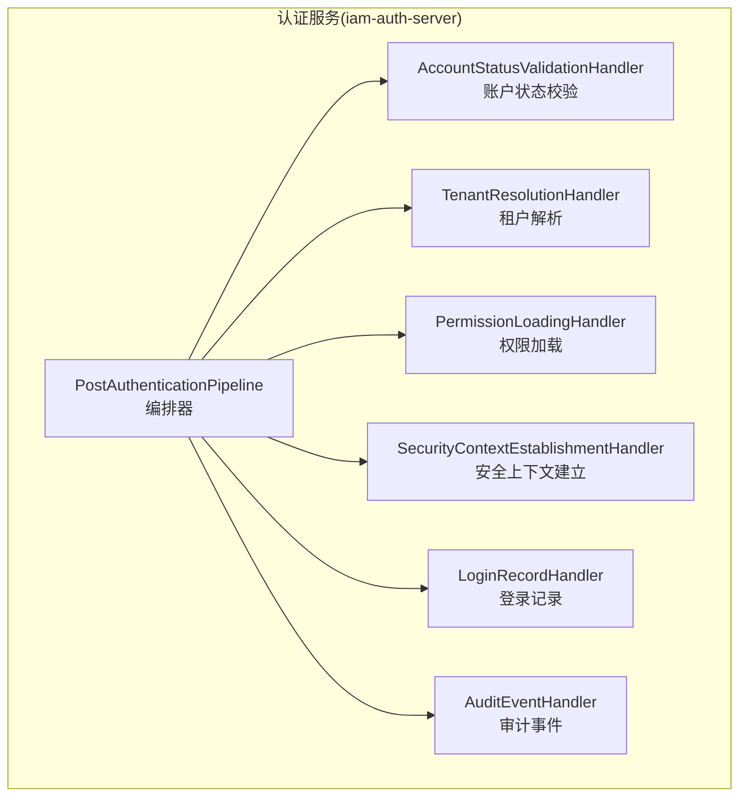
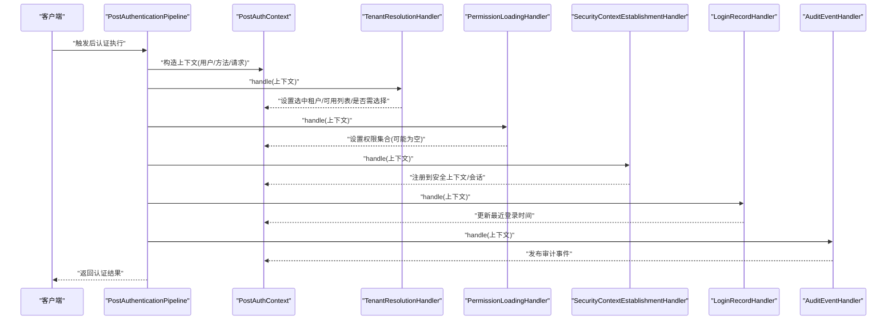
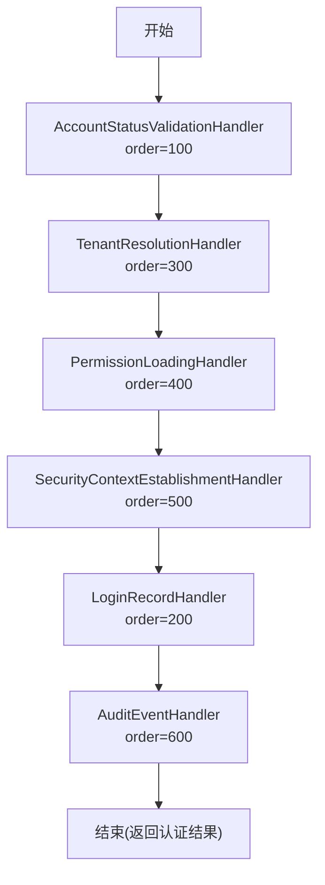
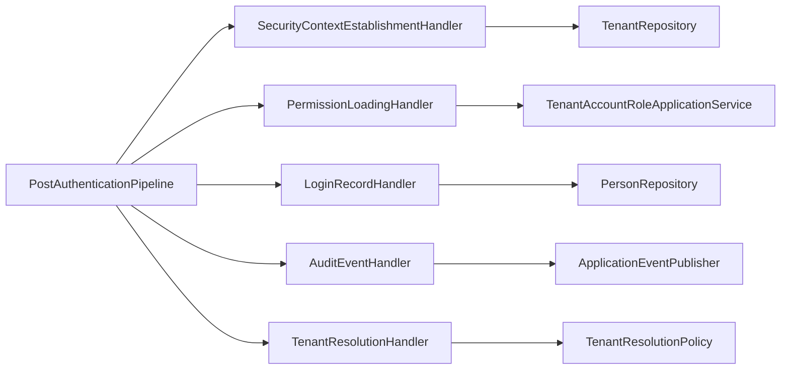

# 后认证管道

<cite>
**本文引用的文件**
- [PostAuthenticationPipeline.java](file://iam-auth-server/src/main/java/iam/platform/auth/application/service/pipeline/PostAuthenticationPipeline.java)
- [PostAuthContext.java](file://iam-auth-server/src/main/java/iam/platform/auth/application/service/pipeline/PostAuthContext.java)
- [PostAuthHandler.java](file://iam-auth-server/src/main/java/iam/platform/auth/application/service/pipeline/PostAuthHandler.java)
- [PreAuthContext.java](file://iam-auth-server/src/main/java/iam/platform/auth/application/service/pipeline/PreAuthContext.java)
- [PreAuthHandler.java](file://iam-auth-server/src/main/java/iam/platform/auth/application/service/pipeline/PreAuthHandler.java)
- [SecurityContextEstablishmentHandler.java](file://iam-auth-server/src/main/java/iam/platform/auth/application/service/pipeline/SecurityContextEstablishmentHandler.java)
- [PermissionLoadingHandler.java](file://iam-auth-server/src/main/java/iam/platform/auth/application/service/pipeline/PermissionLoadingHandler.java)
- [LoginRecordHandler.java](file://iam-auth-server/src/main/java/iam/platform/auth/application/service/pipeline/LoginRecordHandler.java)
- [AuditEventHandler.java](file://iam-auth-server/src/main/java/iam/platform/auth/application/service/pipeline/AuditEventHandler.java)
- [TenantResolutionHandler.java](file://iam-auth-server/src/main/java/iam/platform/auth/application/service/pipeline/TenantResolutionHandler.java)
- [AccountLockoutHandler.java](file://iam-auth-server/src/main/java/iam/platform/auth/application/service/pipeline/AccountLockoutHandler.java)
- [AccountStatusValidationHandler.java](file://iam-auth-server/src/main/java/iam/platform/auth/application/service/pipeline/AccountStatusValidationHandler.java)
- [CredentialValidationHandler.java](file://iam-auth-server/src/main/java/iam/platform/auth/application/service/pipeline/CredentialValidationHandler.java)
- [IpWhitelistHandler.java](file://iam-auth-server/src/main/java/iam/platform/auth/application/service/pipeline/IpWhitelistHandler.java)
- [RateLimitHandler.java](file://iam-auth-server/src/main/java/iam/platform/auth/application/service/pipeline/RateLimitHandler.java)
</cite>

## 目录
1. [简介](#简介)
2. [项目结构](#项目结构)
3. [核心组件](#核心组件)
4. [架构总览](#架构总览)
5. [详细组件分析](#详细组件分析)
6. [依赖分析](#依赖分析)
7. [性能考虑](#性能考虑)
8. [故障排查指南](#故障排查指南)
9. [结论](#结论)
10. [附录](#附录)

## 简介
本文件系统性阐述 IAM 平台“后认证管道”的设计与实现，覆盖以下要点：
- 管道处理器的执行顺序与上下文传递机制
- 各类后认证处理器职责：安全上下文建立、权限加载、登录记录、审计事件等
- 后认证上下文的构建与传递：认证结果封装、权限信息加载、审计日志记录等
- 异常处理机制与成功/失败记录策略
- 管道配置示例、处理器实现指南、性能优化建议
- 实际代码示例路径（以源码路径代替具体代码内容）

## 项目结构
后认证管道位于认证服务模块中，采用“可发现的处理器链”模式，通过 Spring 依赖注入自动收集处理器并按顺序执行。

图表来源
- [PostAuthenticationPipeline.java:18-29](file://iam-auth-server/src/main/java/iam/platform/auth/application/service/pipeline/PostAuthenticationPipeline.java#L18-L29)
- [SecurityContextEstablishmentHandler.java:25-84](file://iam-auth-server/src/main/java/iam/platform/auth/application/service/pipeline/SecurityContextEstablishmentHandler.java#L25-L84)
- [PermissionLoadingHandler.java:16-39](file://iam-auth-server/src/main/java/iam/platform/auth/application/service/pipeline/PermissionLoadingHandler.java#L16-L39)
- [LoginRecordHandler.java:13-28](file://iam-auth-server/src/main/java/iam/platform/auth/application/service/pipeline/LoginRecordHandler.java#L13-L28)
- [AuditEventHandler.java:15-41](file://iam-auth-server/src/main/java/iam/platform/auth/application/service/pipeline/AuditEventHandler.java#L15-L41)
- [TenantResolutionHandler.java:16-65](file://iam-auth-server/src/main/java/iam/platform/auth/application/service/pipeline/TenantResolutionHandler.java#L16-L65)
- [AccountStatusValidationHandler.java:13-26](file://iam-auth-server/src/main/java/iam/platform/auth/application/service/pipeline/AccountStatusValidationHandler.java#L13-L26)

章节来源
- [PostAuthenticationPipeline.java:12-29](file://iam-auth-server/src/main/java/iam/platform/auth/application/service/pipeline/PostAuthenticationPipeline.java#L12-L29)
- [PostAuthContext.java:15-70](file://iam-auth-server/src/main/java/iam/platform/auth/application/service/pipeline/PostAuthContext.java#L15-L70)

## 核心组件
- 编排器：负责收集处理器并按序执行，最终从上下文生成不可变的认证结果。
- 上下文对象：承载用户、认证方式、请求、租户选择状态、权限集合、认证令牌等信息。
- 处理器接口：定义统一的处理契约与排序接口，便于扩展与组合。

章节来源
- [PostAuthHandler.java:9-11](file://iam-auth-server/src/main/java/iam/platform/auth/application/service/pipeline/PostAuthHandler.java#L9-L11)
- [PostAuthContext.java:19-70](file://iam-auth-server/src/main/java/iam/platform/auth/application/service/pipeline/PostAuthContext.java#L19-L70)
- [PostAuthenticationPipeline.java:16-29](file://iam-auth-server/src/main/java/iam/platform/auth/application/service/pipeline/PostAuthenticationPipeline.java#L16-L29)

## 架构总览
后认证管道在“预认证阶段”完成凭据校验、速率限制、IP 白名单/黑名单、账户锁定检查等前置风控后，进入“后认证阶段”。后认证阶段按固定顺序执行多个处理器，逐步构建安全上下文、加载权限、记录登录、发布审计事件等，最终输出认证结果。

图表来源
- [PostAuthenticationPipeline.java:22-29](file://iam-auth-server/src/main/java/iam/platform/auth/application/service/pipeline/PostAuthenticationPipeline.java#L22-L29)
- [TenantResolutionHandler.java:24-46](file://iam-auth-server/src/main/java/iam/platform/auth/application/service/pipeline/TenantResolutionHandler.java#L24-L46)
- [PermissionLoadingHandler.java:21-33](file://iam-auth-server/src/main/java/iam/platform/auth/application/service/pipeline/PermissionLoadingHandler.java#L21-L33)
- [SecurityContextEstablishmentHandler.java:32-79](file://iam-auth-server/src/main/java/iam/platform/auth/application/service/pipeline/SecurityContextEstablishmentHandler.java#L32-L79)
- [LoginRecordHandler.java:17-22](file://iam-auth-server/src/main/java/iam/platform/auth/application/service/pipeline/LoginRecordHandler.java#L17-L22)
- [AuditEventHandler.java:24-35](file://iam-auth-server/src/main/java/iam/platform/auth/application/service/pipeline/AuditEventHandler.java#L24-L35)

## 详细组件分析

### 执行顺序与上下文传递
- 执行顺序由处理器实现的排序值决定，数值越小优先级越高。
- 上下文为可变对象，每个处理器可读写其字段；最终由编排器转换为不可变的认证结果。

图表来源
- [AccountStatusValidationHandler.java:23-25](file://iam-auth-server/src/main/java/iam/platform/auth/application/service/pipeline/AccountStatusValidationHandler.java#L23-L25)
- [TenantResolutionHandler.java:62-64](file://iam-auth-server/src/main/java/iam/platform/auth/application/service/pipeline/TenantResolutionHandler.java#L62-L64)
- [PermissionLoadingHandler.java:35-37](file://iam-auth-server/src/main/java/iam/platform/auth/application/service/pipeline/PermissionLoadingHandler.java#L35-L37)
- [SecurityContextEstablishmentHandler.java:81-84](file://iam-auth-server/src/main/java/iam/platform/auth/application/service/pipeline/SecurityContextEstablishmentHandler.java#L81-L84)
- [LoginRecordHandler.java:24-26](file://iam-auth-server/src/main/java/iam/platform/auth/application/service/pipeline/LoginRecordHandler.java#L24-L26)
- [AuditEventHandler.java:37-39](file://iam-auth-server/src/main/java/iam/platform/auth/application/service/pipeline/AuditEventHandler.java#L37-L39)

章节来源
- [PostAuthHandler.java:9-11](file://iam-auth-server/src/main/java/iam/platform/auth/application/service/pipeline/PostAuthHandler.java#L9-L11)
- [PostAuthContext.java:19-70](file://iam-auth-server/src/main/java/iam/platform/auth/application/service/pipeline/PostAuthContext.java#L19-L70)

### 安全上下文建立（SecurityContextEstablishmentHandler）
- 功能：根据已选租户账号构建带权限的认证令牌，注册到安全上下文与线程本地租户上下文，并将租户标识写入会话。
- 关键点：
  - 若未选择租户账号，跳过完整上下文建立，标记需要租户选择。
  - 将权限集合转换为授权项，包装为基础认证对象，再封装为租户感知的认证令牌。
  - 设置当前人员、租户、租户账号标识到租户上下文。
  - 注册到 Spring Security 上下文。
  - 将租户 ID 写入会话，供后续请求复用。

章节来源
- [SecurityContextEstablishmentHandler.java:23-79](file://iam-auth-server/src/main/java/iam/platform/auth/application/service/pipeline/SecurityContextEstablishmentHandler.java#L23-L79)

### 权限加载（PermissionLoadingHandler）
- 功能：为已选租户账号加载权限集合；若仍需租户选择，则先置空权限集合。
- 关键点：
  - 通过应用服务查询账号关联的权限编码集合。
  - 将权限编码集合写回上下文，供安全上下文建立阶段使用。

章节来源
- [PermissionLoadingHandler.java:14-33](file://iam-auth-server/src/main/java/iam/platform/auth/application/service/pipeline/PermissionLoadingHandler.java#L14-L33)

### 登录记录（LoginRecordHandler）
- 功能：记录用户的最近一次成功登录时间。
- 关键点：
  - 更新用户实体的登录时间戳并持久化。

章节来源
- [LoginRecordHandler.java:13-22](file://iam-auth-server/src/main/java/iam/platform/auth/application/service/pipeline/LoginRecordHandler.java#L13-L22)

### 审计事件（AuditEventHandler）
- 功能：发布登录成功的审计事件（当前为占位，记录调试日志）。
- 关键点：
  - 当前记录调试日志，未来可替换为发布审计事件。
  - 使用应用事件发布器进行事件分发。

章节来源
- [AuditEventHandler.java:15-35](file://iam-auth-server/src/main/java/iam/platform/auth/application/service/pipeline/AuditEventHandler.java#L15-L35)

### 租户解析（TenantResolutionHandler）
- 功能：从请求头或参数提取租户编码，委托策略服务解析用户可访问的租户账号集合，并决定是否需要用户选择。
- 关键点：
  - 请求头优先于查询参数。
  - 解析结果分为：自动选择、需要选择、无可选账号三种状态。
  - 将解析结果写回上下文，影响后续权限加载与安全上下文建立。

章节来源
- [TenantResolutionHandler.java:16-46](file://iam-auth-server/src/main/java/iam/platform/auth/application/service/pipeline/TenantResolutionHandler.java#L16-L46)

### 账户状态校验（AccountStatusValidationHandler）
- 功能：校验用户主体状态，确保允许继续认证流程。
- 关键点：
  - 在后认证阶段执行，保证上下文已具备用户信息。

章节来源
- [AccountStatusValidationHandler.java:13-20](file://iam-auth-server/src/main/java/iam/platform/auth/application/service/pipeline/AccountStatusValidationHandler.java#L13-L20)

### 预认证相关处理器（用于对比）
- 速率限制（RateLimitHandler）、IP 白名单/黑名单（IpWhitelistHandler）、账户锁定（AccountLockoutHandler）、凭据校验（CredentialValidationHandler）等均属于预认证阶段，不参与后认证管道，但与后认证流程协同工作。

章节来源
- [RateLimitHandler.java:14-41](file://iam-auth-server/src/main/java/iam/platform/auth/application/service/pipeline/RateLimitHandler.java#L14-L41)
- [IpWhitelistHandler.java:15-46](file://iam-auth-server/src/main/java/iam/platform/auth/application/service/pipeline/IpWhitelistHandler.java#L15-L46)
- [AccountLockoutHandler.java:14-41](file://iam-auth-server/src/main/java/iam/platform/auth/application/service/pipeline/AccountLockoutHandler.java#L14-L41)
- [CredentialValidationHandler.java:14-96](file://iam-auth-server/src/main/java/iam/platform/auth/application/service/pipeline/CredentialValidationHandler.java#L14-L96)

## 依赖分析
- 编排器依赖处理器列表，处理器之间无直接耦合，仅通过上下文交互。
- 安全上下文建立依赖租户仓储与租户上下文工具类。
- 权限加载依赖应用服务以获取账号权限。
- 登录记录依赖用户仓储。
- 审计事件依赖应用事件发布器。
- 租户解析依赖租户解析策略。

图表来源
- [PostAuthenticationPipeline.java:20-29](file://iam-auth-server/src/main/java/iam/platform/auth/application/service/pipeline/PostAuthenticationPipeline.java#L20-L29)
- [SecurityContextEstablishmentHandler.java:30-30](file://iam-auth-server/src/main/java/iam/platform/auth/application/service/pipeline/SecurityContextEstablishmentHandler.java#L30-L30)
- [PermissionLoadingHandler.java:18-18](file://iam-auth-server/src/main/java/iam/platform/auth/application/service/pipeline/PermissionLoadingHandler.java#L18-L18)
- [LoginRecordHandler.java:15-15](file://iam-auth-server/src/main/java/iam/platform/auth/application/service/pipeline/LoginRecordHandler.java#L15-L15)
- [AuditEventHandler.java:17-21](file://iam-auth-server/src/main/java/iam/platform/auth/application/service/pipeline/AuditEventHandler.java#L17-L21)
- [TenantResolutionHandler.java:21-21](file://iam-auth-server/src/main/java/iam/platform/auth/application/service/pipeline/TenantResolutionHandler.java#L21-L21)

## 性能考虑
- 处理器顺序与数据库访问：权限加载与租户解析可能触发数据库查询，应尽量减少不必要的查询（例如在租户未选择时跳过权限加载）。
- 会话存储：安全上下文建立阶段将租户标识写入会话，有助于后续请求快速识别租户，降低重复解析成本。
- 事件发布：审计事件当前为同步日志记录，建议在生产环境将审计事件异步化，避免阻塞主流程。
- 并发与线程安全：租户上下文使用线程本地变量，确保并发场景下的隔离性。

## 故障排查指南
- 认证结果为空或未建立安全上下文
  - 检查租户解析是否正确设置选中账号；若为空，安全上下文建立会被跳过。
  - 参考路径：[SecurityContextEstablishmentHandler.java:37-42](file://iam-auth-server/src/main/java/iam/platform/auth/application/service/pipeline/SecurityContextEstablishmentHandler.java#L37-L42)
- 权限集合为空
  - 检查租户选择状态与权限加载逻辑；在需要选择租户时，权限加载会置空。
  - 参考路径：[PermissionLoadingHandler.java:22-26](file://iam-auth-server/src/main/java/iam/platform/auth/application/service/pipeline/PermissionLoadingHandler.java#L22-L26)
- 登录时间未更新
  - 检查登录记录处理器是否被调用且保存成功。
  - 参考路径：[LoginRecordHandler.java:17-22](file://iam-auth-server/src/main/java/iam/platform/auth/application/service/pipeline/LoginRecordHandler.java#L17-L22)
- 审计事件未产生
  - 当前为调试日志，未来应集成审计事件发布器。
  - 参考路径：[AuditEventHandler.java:24-35](file://iam-auth-server/src/main/java/iam/platform/auth/application/service/pipeline/AuditEventHandler.java#L24-L35)
- 租户解析异常
  - 检查请求头/参数中的租户编码格式与策略服务返回状态。
  - 参考路径：[TenantResolutionHandler.java:24-46](file://iam-auth-server/src/main/java/iam/platform/auth/application/service/pipeline/TenantResolutionHandler.java#L24-L46)

章节来源
- [SecurityContextEstablishmentHandler.java:37-42](file://iam-auth-server/src/main/java/iam/platform/auth/application/service/pipeline/SecurityContextEstablishmentHandler.java#L37-L42)
- [PermissionLoadingHandler.java:22-26](file://iam-auth-server/src/main/java/iam/platform/auth/application/service/pipeline/PermissionLoadingHandler.java#L22-L26)
- [LoginRecordHandler.java:17-22](file://iam-auth-server/src/main/java/iam/platform/auth/application/service/pipeline/LoginRecordHandler.java#L17-L22)
- [AuditEventHandler.java:24-35](file://iam-auth-server/src/main/java/iam/platform/auth/application/service/pipeline/AuditEventHandler.java#L24-L35)
- [TenantResolutionHandler.java:24-46](file://iam-auth-server/src/main/java/iam/platform/auth/application/service/pipeline/TenantResolutionHandler.java#L24-L46)

## 结论
后认证管道通过“处理器链 + 上下文传递”的架构，清晰地分离了安全上下文建立、权限加载、登录记录与审计事件等职责。合理的处理器顺序与上下文设计，使得系统在保证安全性的同时具备良好的可扩展性与可维护性。建议在生产环境中进一步完善审计事件的异步化与监控告警，持续优化数据库访问与会话复用策略。

## 附录

### 管道配置示例（概念性说明）
- 处理器顺序：通过实现排序接口并设置 order 值控制执行先后。
- 自动发现：Spring 通过构造函数注入收集处理器列表，无需手动组装。
- 上下文共享：处理器通过上下文对象读写状态，实现解耦。

章节来源
- [PostAuthHandler.java:9-11](file://iam-auth-server/src/main/java/iam/platform/auth/application/service/pipeline/PostAuthHandler.java#L9-L11)
- [PostAuthenticationPipeline.java:20-29](file://iam-auth-server/src/main/java/iam/platform/auth/application/service/pipeline/PostAuthenticationPipeline.java#L20-L29)

### 处理器实现指南
- 新增处理器步骤
  - 实现处理器接口并声明排序值。
  - 在 handle 方法中读取/修改上下文字段。
  - 如需外部依赖，通过构造函数注入。
- 注意事项
  - 避免在处理器中直接操作安全上下文，交由专门处理器处理。
  - 对数据库访问进行必要的空值判断与异常处理。

章节来源
- [PostAuthHandler.java:9-11](file://iam-auth-server/src/main/java/iam/platform/auth/application/service/pipeline/PostAuthHandler.java#L9-L11)
- [PostAuthContext.java:19-70](file://iam-auth-server/src/main/java/iam/platform/auth/application/service/pipeline/PostAuthContext.java#L19-L70)

### 实际代码示例（示例路径）
- 安全上下文建立
  - [SecurityContextEstablishmentHandler.java:32-79](file://iam-auth-server/src/main/java/iam/platform/auth/application/service/pipeline/SecurityContextEstablishmentHandler.java#L32-L79)
- 权限加载
  - [PermissionLoadingHandler.java:21-33](file://iam-auth-server/src/main/java/iam/platform/auth/application/service/pipeline/PermissionLoadingHandler.java#L21-L33)
- 登录记录
  - [LoginRecordHandler.java:17-22](file://iam-auth-server/src/main/java/iam/platform/auth/application/service/pipeline/LoginRecordHandler.java#L17-L22)
- 审计事件
  - [AuditEventHandler.java:24-35](file://iam-auth-server/src/main/java/iam/platform/auth/application/service/pipeline/AuditEventHandler.java#L24-L35)
- 租户解析
  - [TenantResolutionHandler.java:24-46](file://iam-auth-server/src/main/java/iam/platform/auth/application/service/pipeline/TenantResolutionHandler.java#L24-L46)
- 账户状态校验
  - [AccountStatusValidationHandler.java:17-20](file://iam-auth-server/src/main/java/iam/platform/auth/application/service/pipeline/AccountStatusValidationHandler.java#L17-L20)