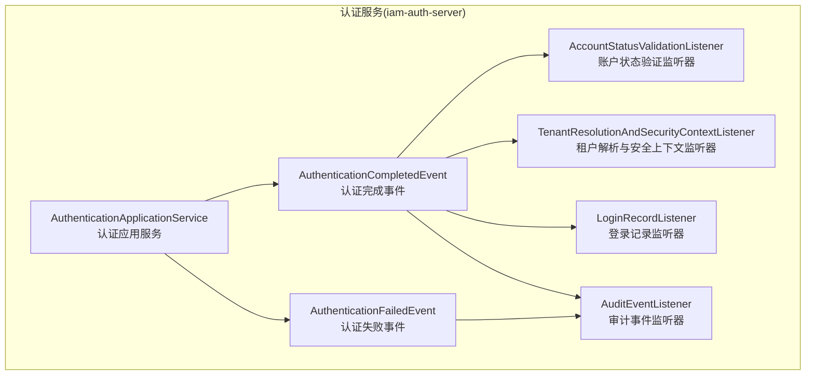
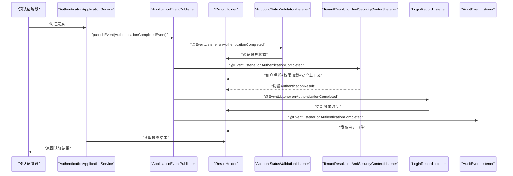
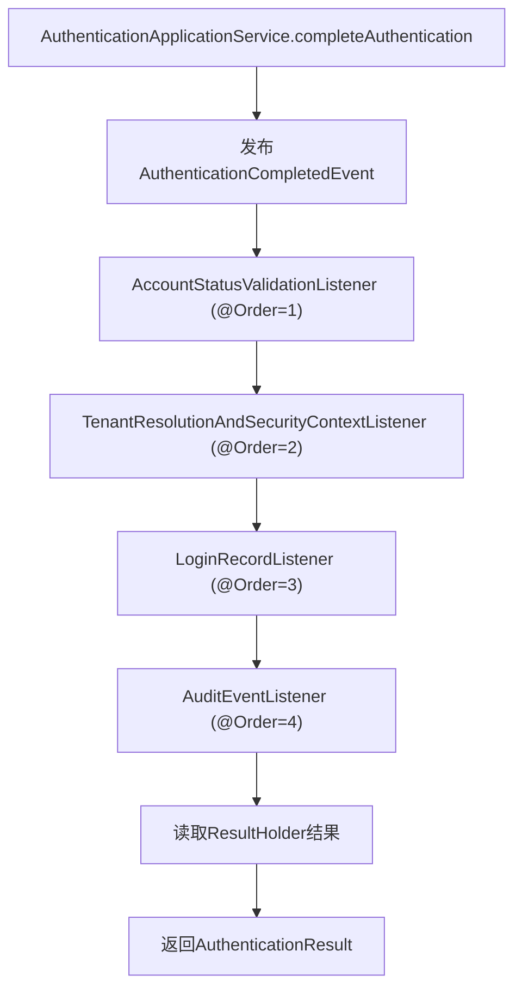
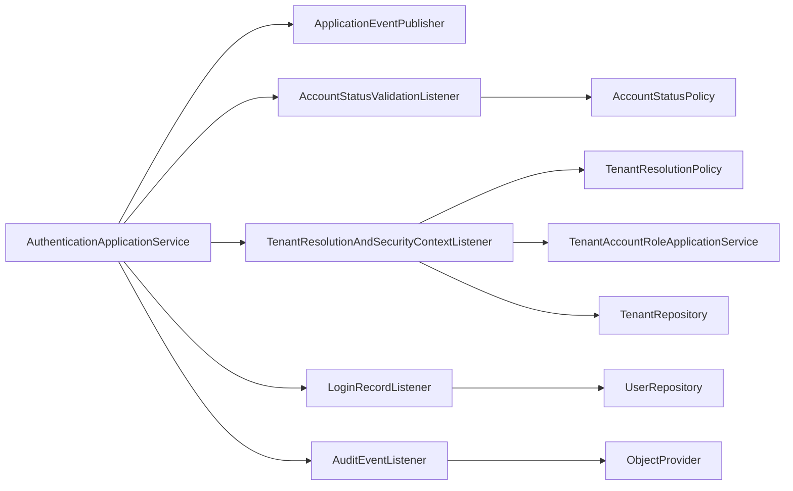

# 后认证管道

<cite>
**本文引用的文件**
- [AuthenticationCompletedEvent.java](file://iam-auth-server/src/main/java/iam/platform/auth/application/service/event/AuthenticationCompletedEvent.java)
- [AuthenticationFailedEvent.java](file://iam-auth-server/src/main/java/iam/platform/auth/application/service/event/AuthenticationFailedEvent.java)
- [AuthenticationResult.java](file://iam-auth-server/src/main/java/iam/platform/auth/domain/model/valueobject/AuthenticationResult.java)
- [AuthenticationApplicationService.java](file://iam-auth-server/src/main/java/iam/platform/auth/application/service/AuthenticationApplicationService.java)
- [AccountStatusValidationListener.java](file://iam-auth-server/src/main/java/iam/platform/auth/application/service/listener/AccountStatusValidationListener.java)
- [AuditEventListener.java](file://iam-auth-server/src/main/java/iam/platform/auth/application/service/listener/AuditEventListener.java)
- [LoginRecordListener.java](file://iam-auth-server/src/main/java/iam/platform/auth/application/service/listener/LoginRecordListener.java)
- [TenantResolutionAndSecurityContextListener.java](file://iam-auth-server/src/main/java/iam/platform/auth/application/service/listener/TenantResolutionAndSecurityContextListener.java)
</cite>

## 更新摘要
**所做更改**
- 完全重写了后认证管道架构，从同步处理器链改为异步事件驱动架构
- 移除了原有的PostAuthenticationPipeline及其所有处理器
- 新增了基于Spring事件的监听器架构
- 更新了认证结果封装和传递机制
- 重新设计了处理器执行顺序和依赖关系

## 目录
1. [简介](#简介)
2. [项目结构](#项目结构)
3. [核心组件](#核心组件)
4. [架构总览](#架构总览)
5. [详细组件分析](#详细组件分析)
6. [依赖分析](#依赖分析)
7. [性能考虑](#性能考虑)
8. [故障排查指南](#故障排查指南)
9. [结论](#结论)
10. [附录](#附录)

## 简介
本文件系统性阐述 IAM 平台"后认证管道"的重大重构，从原有的同步处理器链架构转变为基于事件驱动的异步处理架构。新架构通过 AuthenticationCompletedEvent 和 AuthenticationFailedEvent 实现松耦合的后认证处理，消除了循环依赖问题，提高了系统的可扩展性和可维护性。

## 项目结构
后认证管道现已重构为事件驱动架构，采用"事件发布 + 监听器响应"模式，通过 Spring 事件机制自动分发认证完成和失败事件给相应的监听器。

**图表来源**
- [AuthenticationApplicationService.java:50-63](file://iam-auth-server/src/main/java/iam/platform/auth/application/service/AuthenticationApplicationService.java#L50-L63)
- [AuthenticationCompletedEvent.java:19-34](file://iam-auth-server/src/main/java/iam/platform/auth/application/service/event/AuthenticationCompletedEvent.java#L19-L34)
- [AuthenticationFailedEvent.java:13-27](file://iam-auth-server/src/main/java/iam/platform/auth/application/service/event/AuthenticationFailedEvent.java#L13-L27)
- [AccountStatusValidationListener.java:18-27](file://iam-auth-server/src/main/java/iam/platform/auth/application/service/listener/AccountStatusValidationListener.java#L18-L27)
- [TenantResolutionAndSecurityContextListener.java:38-118](file://iam-auth-server/src/main/java/iam/platform/auth/application/service/listener/TenantResolutionAndSecurityContextListener.java#L38-L118)
- [LoginRecordListener.java:21-34](file://iam-auth-server/src/main/java/iam/platform/auth/application/service/listener/LoginRecordListener.java#L21-L34)
- [AuditEventListener.java:35-104](file://iam-auth-server/src/main/java/iam/platform/auth/application/service/listener/AuditEventListener.java#L35-L104)

**章节来源**
- [AuthenticationApplicationService.java:34-63](file://iam-auth-server/src/main/java/iam/platform/auth/application/service/AuthenticationApplicationService.java#L34-L63)
- [AuthenticationCompletedEvent.java:11-34](file://iam-auth-server/src/main/java/iam/platform/auth/application/service/event/AuthenticationCompletedEvent.java#L11-L34)

## 核心组件
- **认证应用服务**：负责发布认证完成事件，协调监听器执行后认证逻辑
- **认证结果**：不可变值对象，封装认证结果的所有必要信息
- **事件持有者**：ResultHolder 提供监听器向事件发布者回传结果的能力
- **监听器架构**：通过 @EventListener 注解自动响应认证事件

**章节来源**
- [AuthenticationApplicationService.java:39-63](file://iam-auth-server/src/main/java/iam/platform/auth/application/service/AuthenticationApplicationService.java#L39-L63)
- [AuthenticationResult.java:16-28](file://iam-auth-server/src/main/java/iam/platform/auth/domain/model/valueobject/AuthenticationResult.java#L16-L28)
- [AuthenticationCompletedEvent.java:65-75](file://iam-auth-server/src/main/java/iam/platform/auth/application/service/event/AuthenticationCompletedEvent.java#L65-L75)

## 架构总览
后认证管道在"预认证阶段"完成后，由 AuthenticationApplicationService 发布 AuthenticationCompletedEvent 事件。监听器按照预定义的执行顺序异步响应事件，分别处理账户状态验证、租户解析与安全上下文建立、登录记录和审计事件等任务。监听器可以将处理结果写回到事件的 ResultHolder 中，供事件发布者使用。

**图表来源**
- [AuthenticationApplicationService.java:50-63](file://iam-auth-server/src/main/java/iam/platform/auth/application/service/AuthenticationApplicationService.java#L50-L63)
- [AccountStatusValidationListener.java:22-27](file://iam-auth-server/src/main/java/iam/platform/auth/application/service/listener/AccountStatusValidationListener.java#L22-L27)
- [TenantResolutionAndSecurityContextListener.java:50-118](file://iam-auth-server/src/main/java/iam/platform/auth/application/service/listener/TenantResolutionAndSecurityContextListener.java#L50-L118)
- [LoginRecordListener.java:25-34](file://iam-auth-server/src/main/java/iam/platform/auth/application/service/listener/LoginRecordListener.java#L25-34)
- [AuditEventListener.java:46-84](file://iam-auth-server/src/main/java/iam/platform/auth/application/service/listener/AuditEventListener.java#L46-84)

## 详细组件分析

### 事件驱动架构与执行顺序
- **事件发布**：AuthenticationApplicationService 在认证完成后发布 AuthenticationCompletedEvent
- **监听器执行**：监听器按照 @Order 注解的顺序依次执行，@Order 数值越小优先级越高
- **结果回传**：监听器通过 ResultHolder 将处理结果回传给事件发布者
- **同步特性**：Spring 默认的事件发布是同步的，确保监听器在 publish 返回前完成执行

**图表来源**
- [AuthenticationApplicationService.java:50-63](file://iam-auth-server/src/main/java/iam/platform/auth/application/service/AuthenticationApplicationService.java#L50-L63)
- [AccountStatusValidationListener.java:22-27](file://iam-auth-server/src/main/java/iam/platform/auth/application/service/listener/AccountStatusValidationListener.java#L22-27)
- [TenantResolutionAndSecurityContextListener.java:50-118](file://iam-auth-server/src/main/java/iam/platform/auth/application/service/listener/TenantResolutionAndSecurityContextListener.java#L50-118)
- [LoginRecordListener.java:25-34](file://iam-auth-server/src/main/java/iam/platform/auth/application/service/listener/LoginRecordListener.java#L25-34)
- [AuditEventListener.java:46-84](file://iam-auth-server/src/main/java/iam/platform/auth/application/service/listener/AuditEventListener.java#L46-84)

**章节来源**
- [AuthenticationApplicationService.java:39-63](file://iam-auth-server/src/main/java/iam/platform/auth/application/service/AuthenticationApplicationService.java#L39-L63)
- [AuthenticationCompletedEvent.java:19-34](file://iam-auth-server/src/main/java/iam/platform/auth/application/service/event/AuthenticationCompletedEvent.java#L19-L34)

### 认证结果封装与传递
- **不可变设计**：AuthenticationResult 作为不可变值对象，确保线程安全和数据一致性
- **结果持有**：ResultHolder 提供监听器向事件发布者回传结果的机制
- **默认回退**：如果监听器处理失败，使用 basic() 工厂方法提供基本认证结果
- **丰富信息**：包含用户、认证方式、租户选择状态、权限集合等完整信息

**章节来源**
- [AuthenticationResult.java:16-28](file://iam-auth-server/src/main/java/iam/platform/auth/domain/model/valueobject/AuthenticationResult.java#L16-L28)
- [AuthenticationCompletedEvent.java:65-75](file://iam-auth-server/src/main/java/iam/platform/auth/application/service/event/AuthenticationCompletedEvent.java#L65-L75)
- [TenantResolutionAndSecurityContextListener.java:113-118](file://iam-auth-server/src/main/java/iam/platform/auth/application/service/listener/TenantResolutionAndSecurityContextListener.java#L113-L118)

### 账户状态验证（AccountStatusValidationListener）
- **功能**：验证用户账户状态，确保允许继续认证流程
- **执行时机**：在认证完成后立即执行，确保上下文已具备用户信息
- **依赖注入**：通过构造函数注入 AccountStatusPolicy 进行状态验证
- **日志记录**：提供详细的调试日志，便于问题排查

**章节来源**
- [AccountStatusValidationListener.java:18-27](file://iam-auth-server/src/main/java/iam/platform/auth/application/service/listener/AccountStatusValidationListener.java#L18-L27)

### 租户解析与安全上下文建立（TenantResolutionAndSecurityContextListener）
- **功能**：处理租户解析、权限加载和安全上下文建立的完整流程
- **租户解析**：支持从请求头和参数中提取租户编码，调用策略服务解析可用租户
- **权限加载**：根据选中的租户账号加载权限集合
- **安全上下文**：建立带权限的认证令牌，注册到安全上下文和线程本地租户上下文
- **会话管理**：将用户和租户信息写入 HTTP 会话

**章节来源**
- [TenantResolutionAndSecurityContextListener.java:38-118](file://iam-auth-server/src/main/java/iam/platform/auth/application/service/listener/TenantResolutionAndSecurityContextListener.java#L38-L118)

### 登录记录（LoginRecordListener）
- **功能**：记录用户的最近一次成功登录时间
- **实现方式**：通过 UserRepository 更新用户实体的 lastLoginAt 字段
- **事务处理**：确保登录时间更新的原子性和一致性

**章节来源**
- [LoginRecordListener.java:21-34](file://iam-auth-server/src/main/java/iam/platform/auth/application/service/listener/LoginRecordListener.java#L21-L34)

### 审计事件（AuditEventListener）
- **功能**：发布登录成功的审计事件到 RocketMQ
- **失败处理**：提供认证失败事件的审计记录
- **降级机制**：当 RocketMQ 不可用时，优雅降级为本地日志记录
- **分布式追踪**：支持多种追踪头格式，包括 X-Trace-Id、X-B3-TraceId 和 traceparent

**章节来源**
- [AuditEventListener.java:35-104](file://iam-auth-server/src/main/java/iam/platform/auth/application/service/listener/AuditEventListener.java#L35-L104)

## 依赖分析
- **事件发布者**：AuthenticationApplicationService 依赖 ApplicationEventPublisher 发布认证事件
- **监听器依赖**：各监听器通过构造函数注入所需的领域服务和仓储
- **结果传递**：监听器通过 ResultHolder 与事件发布者通信
- **条件装配**：审计监听器使用 @ConditionalOnProperty 进行条件装配

**图表来源**
- [AuthenticationApplicationService.java:39-43](file://iam-auth-server/src/main/java/iam/platform/auth/application/service/AuthenticationApplicationService.java#L39-L43)
- [AccountStatusValidationListener.java:20](file://iam-auth-server/src/main/java/iam/platform/auth/application/service/listener/AccountStatusValidationListener.java#L20)
- [TenantResolutionAndSecurityContextListener.java:46-48](file://iam-auth-server/src/main/java/iam/platform/auth/application/service/listener/TenantResolutionAndSecurityContextListener.java#L46-L48)
- [LoginRecordListener.java:23](file://iam-auth-server/src/main/java/iam/platform/auth/application/service/listener/LoginRecordListener.java#L23)
- [AuditEventListener.java:37](file://iam-auth-server/src/main/java/iam/platform/auth/application/service/listener/AuditEventListener.java#L37)

## 性能考虑
- **异步执行**：监听器异步执行，避免阻塞主认证流程
- **条件装配**：审计事件监听器支持条件装配，可根据配置启用或禁用
- **降级机制**：当外部系统不可用时，提供优雅降级策略
- **内存效率**：AuthenticationResult 作为不可变对象，减少内存拷贝开销
- **线程安全**：ResultHolder 在单个事件处理过程中使用，避免多线程竞争

**章节来源**
- [AuditEventListener.java:86-104](file://iam-auth-server/src/main/java/iam/platform/auth/application/service/listener/AuditEventListener.java#L86-L104)
- [AuthenticationResult.java:16-28](file://iam-auth-server/src/main/java/iam/platform/auth/domain/model/valueobject/AuthenticationResult.java#L16-L28)

## 故障排查指南
- **认证结果为空**
  - 检查监听器是否正确设置 ResultHolder
  - 验证事件发布者是否正确读取 ResultHolder
  - 参考路径：[AuthenticationApplicationService.java:60-63](file://iam-auth-server/src/main/java/iam/platform/auth/application/service/AuthenticationApplicationService.java#L60-L63)
- **监听器未执行**
  - 检查 @EventListener 注解是否正确配置
  - 验证监听器是否被 Spring 容器管理
  - 确认 @Order 注解的数值设置是否合理
- **租户解析失败**
  - 检查请求头和参数中的租户编码格式
  - 验证租户解析策略的实现
  - 查看监听器的日志输出
- **审计事件未发布**
  - 检查 RocketMQ 配置和连接状态
  - 验证审计事件监听器的条件装配
  - 查看降级日志输出
- **安全上下文未建立**
  - 检查租户选择状态和权限加载
  - 验证租户仓储的数据完整性
  - 确认会话创建和属性设置

**章节来源**
- [AuthenticationApplicationService.java:60-63](file://iam-auth-server/src/main/java/iam/platform/auth/application/service/AuthenticationApplicationService.java#L60-L63)
- [TenantResolutionAndSecurityContextListener.java:113-118](file://iam-auth-server/src/main/java/iam/platform/auth/application/service/listener/TenantResolutionAndSecurityContextListener.java#L113-L118)
- [AuditEventListener.java:86-104](file://iam-auth-server/src/main/java/iam/platform/auth/application/service/listener/AuditEventListener.java#L86-L104)

## 结论
后认证管道的重构实现了从同步处理器链到异步事件驱动架构的重大转变。新架构通过事件监听器模式消除了循环依赖，提高了系统的模块化程度和可扩展性。监听器按照明确的执行顺序处理不同的后认证任务，通过 ResultHolder 实现结果回传，确保了认证流程的完整性和可靠性。建议在生产环境中结合监控和日志系统，对事件处理的性能和可靠性进行持续优化。

## 附录

### 事件配置示例
- **事件发布**：AuthenticationApplicationService.completeAuthentication() 方法发布 AuthenticationCompletedEvent
- **监听器注册**：通过 @Component 和 @EventListener 注解自动注册监听器
- **执行顺序**：通过 @Order 注解控制监听器的执行优先级
- **条件装配**：使用 @ConditionalOnProperty 控制监听器的启用状态

**章节来源**
- [AuthenticationApplicationService.java:50-63](file://iam-auth-server/src/main/java/iam/platform/auth/application/service/AuthenticationApplicationService.java#L50-L63)
- [AuditEventListener.java:34](file://iam-auth-server/src/main/java/iam/platform/auth/application/service/listener/AuditEventListener.java#L34)

### 监听器实现指南
- **新增监听器步骤**
  - 创建实现类并添加 @Component 注解
  - 添加 @EventListener 注解的方法处理相应事件
  - 使用 @Order 注解设置执行顺序
  - 通过构造函数注入所需的依赖
- **结果回传**
  - 使用 event.getResultHolder().setResult() 设置结果
  - 确保在监听器内部正确处理异常情况
  - 提供适当的日志记录便于调试

**章节来源**
- [AccountStatusValidationListener.java:18-27](file://iam-auth-server/src/main/java/iam/platform/auth/application/service/listener/AccountStatusValidationListener.java#L18-L27)
- [TenantResolutionAndSecurityContextListener.java:103](file://iam-auth-server/src/main/java/iam/platform/auth/application/service/listener/TenantResolutionAndSecurityContextListener.java#L103)

### 实际代码示例
- **认证应用服务**
  - [AuthenticationApplicationService.java:50-63](file://iam-auth-server/src/main/java/iam/platform/auth/application/service/AuthenticationApplicationService.java#L50-L63)
- **认证完成事件**
  - [AuthenticationCompletedEvent.java:19-75](file://iam-auth-server/src/main/java/iam/platform/auth/application/service/event/AuthenticationCompletedEvent.java#L19-L75)
- **认证失败事件**
  - [AuthenticationFailedEvent.java:13-55](file://iam-auth-server/src/main/java/iam/platform/auth/application/service/event/AuthenticationFailedEvent.java#L13-L55)
- **账户状态验证监听器**
  - [AccountStatusValidationListener.java:18-27](file://iam-auth-server/src/main/java/iam/platform/auth/application/service/listener/AccountStatusValidationListener.java#L18-L27)
- **租户解析与安全上下文监听器**
  - [TenantResolutionAndSecurityContextListener.java:38-118](file://iam-auth-server/src/main/java/iam/platform/auth/application/service/listener/TenantResolutionAndSecurityContextListener.java#L38-L118)
- **登录记录监听器**
  - [LoginRecordListener.java:21-34](file://iam-auth-server/src/main/java/iam/platform/auth/application/service/listener/LoginRecordListener.java#L21-L34)
- **审计事件监听器**
  - [AuditEventListener.java:35-104](file://iam-auth-server/src/main/java/iam/platform/auth/application/service/listener/AuditEventListener.java#L35-L104)